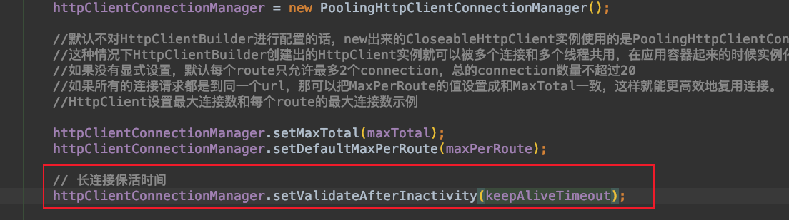

[TOC]


# Httpclient长连接及线程安全原理以及Https客户端验证


## 线程安全原理

### 从池中获取连接

```java
public E get(final long timeout, final TimeUnit timeUnit) throws InterruptedException, ExecutionException, TimeoutException {
    for (;;) {
      // 加锁，防止重复获取相同的连接
        synchronized (this) {
            try {
              // 获取正在使用的连接
                final E entry = entryRef.get();
                if (entry != null) {
                    return entry;
                }
                if (done.get()) {
                    throw new ExecutionException(operationAborted());
                }
              // 从池中获取连接
                final E leasedEntry = getPoolEntryBlocking(route, state, timeout, timeUnit, this);
              // 客户端连接复用-长连接的保活时间  
              if (validateAfterInactivity > 0)  {
                    if (leasedEntry.getUpdated() + validateAfterInactivity <= System.currentTimeMillis()) {
                        if (!validate(leasedEntry)) {
                            leasedEntry.close();
                            release(leasedEntry, false);
                            continue;
                        }
                    }
                }
              // 设置正在使用的连接
                if (done.compareAndSet(false, true)) {
                    entryRef.set(leasedEntry);
                    done.set(true);
                    onLease(leasedEntry);
                    if (callback != null) {
                        callback.completed(leasedEntry);
                    }
                    return leasedEntry;
                } else {
                    release(leasedEntry, true);
                    throw new ExecutionException(operationAborted());
                }
            } catch (final IOException ex) {
                if (done.compareAndSet(false, true)) {
                    if (callback != null) {
                        callback.failed(ex);
                    }
                }
                throw new ExecutionException(ex);
            }
        }
    }
}
```

分析从池中获取连接getPoolEntryBlocking方法

```java
private E getPoolEntryBlocking(
        final T route, final Object state,
        final long timeout, final TimeUnit timeUnit,
        final Future<E> future) throws IOException, InterruptedException, ExecutionException, TimeoutException {

    Date deadline = null;
    if (timeout > 0) {
        deadline = new Date (System.currentTimeMillis() + timeUnit.toMillis(timeout));
    }
  // 加锁
    this.lock.lock();
    try {
        // 获取四元组对应的连接池
        final RouteSpecificPool<T, C, E> pool = getPool(route);
        E entry;
        for (;;) {
            Asserts.check(!this.isShutDown, "Connection pool shut down");
            if (future.isCancelled()) {
                throw new ExecutionException(operationAborted());
            }
            for (;;) {
                // 从四元组对应的连接池中获取空闲连接
                entry = pool.getFree(state);
                if (entry == null) {
                    break;
                }
                if (entry.isExpired(System.currentTimeMillis())) {
                    entry.close();
                }
                if (entry.isClosed()) {
                    this.available.remove(entry);
                    pool.free(entry, false);
                } else {
                    break;
                }
            }
          // 从四元组对应的连接池中移除获取的空闲连接
            if (entry != null) {
                this.available.remove(entry);
                this.leased.add(entry);
                onReuse(entry);
                return entry;
            }

            // New connection is needed
            final int maxPerRoute = getMax(route);
            // Shrink the pool prior to allocating a new connection
            final int excess = Math.max(0, pool.getAllocatedCount() + 1 - maxPerRoute);
            if (excess > 0) {
                for (int i = 0; i < excess; i++) {
                    final E lastUsed = pool.getLastUsed();
                    if (lastUsed == null) {
                        break;
                    }
                    lastUsed.close();
                    this.available.remove(lastUsed);
                    pool.remove(lastUsed);
                }
            }

            if (pool.getAllocatedCount() < maxPerRoute) {
                final int totalUsed = this.leased.size();
                final int freeCapacity = Math.max(this.maxTotal - totalUsed, 0);
                if (freeCapacity > 0) {
                    final int totalAvailable = this.available.size();
                    if (totalAvailable > freeCapacity - 1) {
                        if (!this.available.isEmpty()) {
                            final E lastUsed = this.available.removeLast();
                            lastUsed.close();
                            final RouteSpecificPool<T, C, E> otherpool = getPool(lastUsed.getRoute());
                            otherpool.remove(lastUsed);
                        }
                    }
                    final C conn = this.connFactory.create(route);
                    entry = pool.add(conn);
                    this.leased.add(entry);
                    return entry;
                }
            }

            boolean success = false;
            try {
                pool.queue(future);
                this.pending.add(future);
                if (deadline != null) {
                    success = this.condition.awaitUntil(deadline);
                } else {
                    this.condition.await();
                    success = true;
                }
                if (future.isCancelled()) {
                    throw new ExecutionException(operationAborted());
                }
            } finally {
                // In case of 'success', we were woken up by the
                // connection pool and should now have a connection
                // waiting for us, or else we're shutting down.
                // Just continue in the loop, both cases are checked.
                pool.unqueue(future);
                this.pending.remove(future);
            }
            // check for spurious wakeup vs. timeout
            if (!success && (deadline != null && deadline.getTime() <= System.currentTimeMillis())) {
                break;
            }
        }
        throw new TimeoutException("Timeout waiting for connection");
    } finally {
        this.lock.unlock();
    }
}
```

确保多线程并发条件下，相同的服务器ip以及端口从池中获取的连接不是同一个，因为获取的连接都放在空闲连接里面，空闲连接是加锁进行的获取与放回，所以同一时期只能有一个线程使用该连接。此时获取的连接一定是线程安全的

继续分析获取socket连接的操作

```java
// 连接里面没有设置socket，具体见源码简单
if (!managedConn.isOpen()) {
    this.log.debug("Opening connection " + route);
    try {
      // 创建socket
        establishRoute(proxyAuthState, managedConn, route, request, context);
    } catch (final TunnelRefusedException ex) {
        if (this.log.isDebugEnabled()) {
            this.log.debug(ex.getMessage());
        }
        response = ex.getResponse();
        break;
    }
}
```

最终创建socket走到这个方法

```java
public void connect(
        final ManagedHttpClientConnection conn,
        final HttpHost host,
        final InetSocketAddress localAddress,
        final int connectTimeout,
        final SocketConfig socketConfig,
        final HttpContext context) throws IOException {
    final Lookup<ConnectionSocketFactory> registry = getSocketFactoryRegistry(context);
    final ConnectionSocketFactory sf = registry.lookup(host.getSchemeName());
    if (sf == null) {
        throw new UnsupportedSchemeException(host.getSchemeName() +
                " protocol is not supported");
    }
    final InetAddress[] addresses = host.getAddress() != null ?
            new InetAddress[] { host.getAddress() } : this.dnsResolver.resolve(host.getHostName());
    final int port = this.schemePortResolver.resolve(host);
    for (int i = 0; i < addresses.length; i++) {
        final InetAddress address = addresses[i];
        final boolean last = i == addresses.length - 1;

      // 创建socket
        Socket sock = sf.createSocket(context);
        sock.setSoTimeout(socketConfig.getSoTimeout());
        sock.setReuseAddress(socketConfig.isSoReuseAddress());
        sock.setTcpNoDelay(socketConfig.isTcpNoDelay());
        sock.setKeepAlive(socketConfig.isSoKeepAlive());
        if (socketConfig.getRcvBufSize() > 0) {
            sock.setReceiveBufferSize(socketConfig.getRcvBufSize());
        }
        if (socketConfig.getSndBufSize() > 0) {
            sock.setSendBufferSize(socketConfig.getSndBufSize());
        }

        final int linger = socketConfig.getSoLinger();
        if (linger >= 0) {
            sock.setSoLinger(true, linger);
        }
        conn.bind(sock);

        final InetSocketAddress remoteAddress = new InetSocketAddress(address, port);
        if (this.log.isDebugEnabled()) {
            this.log.debug("Connecting to " + remoteAddress);
        }
        try {
          // 真正创建连接，并设置创建连接的连接超时时间
            sock = sf.connectSocket(
                    connectTimeout, sock, host, remoteAddress, localAddress, context);
          // 在连接中设置socket，一个连接只有一个socket，一对一的关系，一个连接对应一个四元组
            conn.bind(sock);
            if (this.log.isDebugEnabled()) {
                this.log.debug("Connection established " + conn);
            }
            return;
        } catch (final SocketTimeoutException ex) {
            if (last) {
                throw new ConnectTimeoutException(ex, host, addresses);
            }
        } catch (final ConnectException ex) {
            if (last) {
                final String msg = ex.getMessage();
                throw "Connection timed out".equals(msg)
                                ? new ConnectTimeoutException(ex, host, addresses)
                                : new HttpHostConnectException(ex, host, addresses);
            }
        } catch (final NoRouteToHostException ex) {
            if (last) {
                throw ex;
            }
        }
        if (this.log.isDebugEnabled()) {
            this.log.debug("Connect to " + remoteAddress + " timed out. " +
                    "Connection will be retried using another IP address");
        }
    }
}
```

获取连接之后，看连接是否绑定socket，绑定socket就使用这个socket，由于连接是线程安全的，所以socket也是线程安全的。

### 小结

1. 确保多线程并发条件下，相同的服务器ip以及端口从池中获取的连接不是同一个，因为获取的连接都放在空闲连接里面，空闲连接是加锁进行的获取与放回，所以同一时期只能有一个线程使用改连接。
2. 获取连接之后，看连接是否绑定socket，绑定socket就使用这个socket，由于连接是线程安全的，所以socket也是线程安全的。

## 客户端的连接复用-长连接使用

### 使用



### 原理

从池中获取连接时，检验连接的活跃时间+保活时间与当前时间的关系，确认是否使用原连接，来达到长连接的效果

```java
public E get(final long timeout, final TimeUnit timeUnit) throws InterruptedException, ExecutionException, TimeoutException {
    for (;;) {
      // 加锁，防止重复获取相同的连接
        synchronized (this) {
            try {
              // 获取正在使用的连接
                final E entry = entryRef.get();
                if (entry != null) {
                    return entry;
                }
                if (done.get()) {
                    throw new ExecutionException(operationAborted());
                }
              // 从池中获取连接
                final E leasedEntry = getPoolEntryBlocking(route, state, timeout, timeUnit, this);
              // 客户端连接复用-长连接的保活时间  
              if (validateAfterInactivity > 0)  {
                    if (leasedEntry.getUpdated() + validateAfterInactivity <= System.currentTimeMillis()) {
                        if (!validate(leasedEntry)) {
                            leasedEntry.close();
                            release(leasedEntry, false);
                            continue;
                        }
                    }
                }
              // 设置正在使用的连接
                if (done.compareAndSet(false, true)) {
                    entryRef.set(leasedEntry);
                    done.set(true);
                    onLease(leasedEntry);
                    if (callback != null) {
                        callback.completed(leasedEntry);
                    }
                    return leasedEntry;
                } else {
                    release(leasedEntry, true);
                    throw new ExecutionException(operationAborted());
                }
            } catch (final IOException ex) {
                if (done.compareAndSet(false, true)) {
                    if (callback != null) {
                        callback.failed(ex);
                    }
                }
                throw new ExecutionException(ex);
            }
        }
    }
}
```


如果连接的使用时间+保活时间>当前时间，则复用池中的连接，否则关闭改连接

之后再使用连接里面的socket，来达到长连接的效果，减少掉3次握手4次挥手的操作，节约带宽，提升接口性能

### 小结

1. 如果连接的使用时间+保活时间>当前时间，则复用池中的连接，否则关闭改连接，之后再使用连接里面的socket，来达到长连接的效果，减少掉3次握手4次挥手的操作，节约带宽，提升接口性能

## Https客户端验证

**通常HttpClient默认使用的是域名验证；java在jre里面验证的根证书是否是信任的证书，没有开源**

与浏览器不同的是，客户端是httpclient，使用验证CA证书是使用JDK内置的证书

请求的交互流程是


协议细节在SSLSocketImpl类中体现，但这部分代码jdk并没有开源，感兴趣的可以下载相应的openJdk源码继续分析


我这里使用命令，获取了部分CA根证书

keytool -list -keystore "/Library/Java/JavaVirtualMachines/jdk1.8.0_291.jdk/Contents/Home/jre/lib/security/cacerts" -storepass changeit | grep globalroot

在JDK中有个扩展`JSSE(Java安全套接字扩展)`：是`SSL/TLS`的Java实现标准，提供了支持`SSL/TLS`的API和实现.其中与证书相关的是`TrustManager`：信任管理器接口，主要负责决定是否信任对方的安全证书，按以下优先级读取：

1. 属性`javax.net.ssl.trustStore`指定`TrustStore`（该文件表示信任证书存储库）
2. `${java.home}/lib/security/jssecacerts`
3. `${java.home}/lib/security/cacerts` （随jre发布，不同版本内置证书列表有所不同）

### 小结

1. Java与浏览器使用https不一致的是：JDK使用其内置的根证书进行证书校验，浏览器使用操作系统预装的根证书；JDK校验不通过则抛异常，浏览器则用户判断是否信任。


## 参考

https://juejin.cn/post/6942346735595307044


