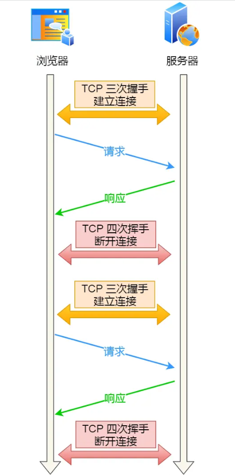
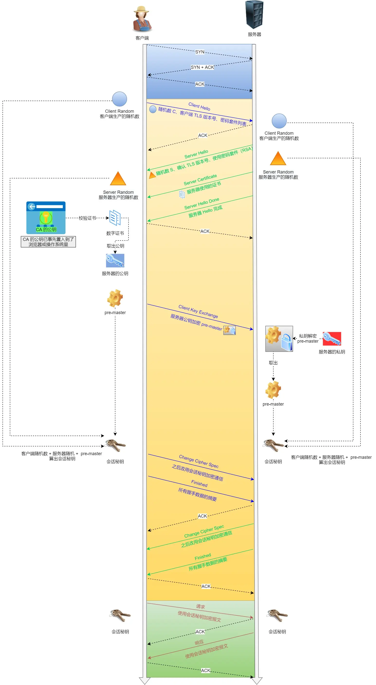
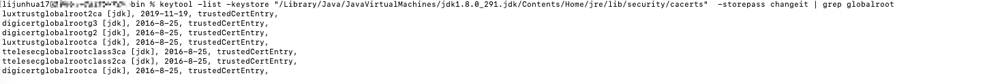
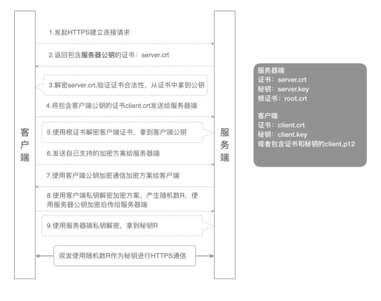

[TOC]

# Http/Https协议

## 状态码

| 状态码 | 类别                                                   | 备注                                                         |
| ------ | ------------------------------------------------------ | ------------------------------------------------------------ |
| 200    | 是最常见的成功状态码，表示一切正常                     | 如果是非 HEAD 请求，服务器返回的响应头都会有 body 数据。     |
| 301    | 永久重定向                                             | 301 和 302 都会在响应头里使用字段 Location，指明后续要跳转的 URL，浏览器会自动重定向新的 URL。 |
| 302    | 临时重定向                                             | 301 和 302 都会在响应头里使用字段 Location，指明后续要跳转的 URL，浏览器会自动重定向新的 URL。 |
| 304    | 表示资源未修改，重定向已存在的缓冲文件，也称缓存重定向 | 告诉客户端可以继续使用缓存资源，用于缓存控制。               |
| 401    | 未登录                                                 |                                                              |
| 403    | 拒绝访问                                               |                                                              |
| 500    | 服务器错误                                             |                                                              |

## HTTP协议不使用长连接

## HTTP/1.1特性

1. 长连接。

   早期是每发起一个请求，都要新建一次 TCP 连接（三次握手），而且是串行请求，做了无谓的 TCP 连接建立和断开，增加了通信开销。持久连接的特点是，只要任意一端没有明确提出断开连接，则保持 TCP 连接状态。

2. 管道网络传输

   HTTP/1.1 采用了长连接的方式，这使得管道（pipeline）网络传输成为了可能。

   即可在同一个 TCP 连接里面，客户端可以发起多个请求，只要第一个请求发出去了，不必等其回来，就可以发第二个请求出去，可以**减少整体的响应时间**

## HTTP 与 HTTPS 有哪些区别？

- HTTP 是超文本传输协议，信息是明文传输，存在安全风险的问题。HTTPS 则解决 HTTP 不安全的缺陷，在 TCP 和 HTTP 网络层之间加入了 SSL/TLS 安全协议，使得报文能够加密传输。
- HTTP 连接建立相对简单， TCP 三次握手之后便可进行 HTTP 的报文传输。而 HTTPS 在 TCP 三次握手之后，还需进行 SSL/TLS 的握手过程，才可进入加密报文传输。
- 两者的默认端口不一样，HTTP 默认端口号是 80，HTTPS 默认端口号是 443。
- HTTPS 协议需要向 CA（证书权威机构）申请数字证书，来保证服务器的身份是可信的

## Https的CA证书

一个证书包含下面的具体内容：

- 证书的发布机构
- 证书的有效期
- 公钥
- 证书所有者（Subject）
- 签名所使用的算法
- 指纹以及指纹算法

**数字证书可以保证数字证书里的公钥确实是这个证书的所有者(Subject)的，或者证书可以用来确认对方的身份**。也就是说，我们拿到一个数字证书，我们可以判断出这个数字证书到底是谁的。

## HTTPS传输数据

HTTPS 采用的是**对称加密**和**非对称加密**结合的「混合加密」方式：

- 在通信建立前采用**非对称加密**的方式交换「会话秘钥」，后续就不再使用非对称加密。
- 在通信过程中全部使用**对称加密**的「会话秘钥」的方式加密明文数据。

采用「混合加密」的方式的原因：

- **对称加密**只使用一个密钥，运算速度快，密钥必须保密，无法做到安全的密钥交换。
- **非对称加密**使用两个密钥：公钥和私钥，公钥可以任意分发而私钥保密，解决了密钥交换问题但速度慢。

SSL/TLS 协议基本流程：

- 客户端向服务器索要并验证服务器的公钥。
- 双方协商生产「会话秘钥」。
- 双方采用「会话秘钥」进行加密通信。

1. TLS 协议建立的详细流程：

   *1. ClientHello*

   首先，由客户端向服务器发起加密通信请求，也就是 `ClientHello` 请求。

   在这一步，客户端主要向服务器发送以下信息：

   （1）客户端支持的 TLS 协议版本，如 TLS 1.2 版本。

   （2）客户端生产的随机数（`Client Random`），后面用于生成「会话秘钥」条件之一。

   （3）客户端支持的密码套件列表，如 RSA 加密算法。

   *2. SeverHello*

   服务器收到客户端请求后，向客户端发出响应，也就是 `SeverHello`。服务器回应的内容有如下内容：

   （1）确认 TLS 协议版本，如果浏览器不支持，则关闭加密通信。

   （2）服务器生产的随机数（`Server Random`），也是后面用于生产「会话秘钥」条件之一。

   （3）确认的密码套件列表，如 RSA 加密算法。

   （4）服务器的数字证书。

   *3.客户端回应*

   客户端收到服务器的回应之后，首先通过浏览器或者操作系统中的 （如果是java客户端则使用JDK内置的根证书）CA 证书，确认服务器的数字证书的真实性。

   如果证书没有问题，客户端会**从数字证书中取出服务器的公钥**，然后使用它加密报文，向服务器发送如下信息：

   （1）一个随机数（`pre-master key`）。该随机数会被服务器公钥加密。

   （2）加密通信算法改变通知，表示随后的信息都将用「会话秘钥」加密通信。

   （3）客户端握手结束通知，表示客户端的握手阶段已经结束。这一项同时把之前所有内容的发生的数据做个摘要，用来供服务端校验。

   上面第一项的随机数是整个握手阶段的第三个随机数，会发给服务端，所以这个随机数客户端和服务端都是一样的。

   **服务器和客户端有了这三个随机数（Client Random、Server Random、pre-master key），接着就用双方协商的加密算法，各自生成本次通信的「会话秘钥」**。

   *4. 服务器的最后回应*

   服务器收到客户端的第三个随机数（`pre-master key`）之后，通过协商的加密算法，计算出本次通信的「会话秘钥」。

   然后，向客户端发送最后的信息：

   （1）加密通信算法改变通知，表示随后的信息都将用「会话秘钥」加密通信。

   （2）服务器握手结束通知，表示服务器的握手阶段已经结束。这一项同时把之前所有内容的发生的数据做个摘要，用来供客户端校验。

   至此，整个 TLS 的握手阶段全部结束。接下来，客户端与服务器进入加密通信，就完全是使用普通的 HTTP 协议，只不过用「会话秘钥」加密内容。

### 小结

1. 三次握手建立连接
2. Client发起一个HTTPS的请求。Server响应收到。
3. Server把事先配置好的**公钥证书**（public key certificate）返回给客户端，Client响应收到。
4. Client验证**公钥证书**：比如是否在有效期内，证书的用途是不是匹配Client请求的站点，是不是在CRL吊销列表里面，它的上一级证书是否有效，这是一个递归的过程，直到验证到根证书（操作系统内置的Root证书或者Client内置的Root证书）。如果验证通过则继续，不通过则显示警告信息。Client使用**伪随机数生成器**生成加密所使用的**会话密钥**，然后用证书的公钥加密这个**会话密钥**，发给Server。Server响应收到。
5. Server使用自己的**私钥**（private key）解密这个消息，得到**会话密钥**。把之前所有内容的发生的数据做个摘要，用来供客户端校验。至此，Client和Server双方都持有了相同的**会话密钥**。Client响应收到。
6. 双方采用「会话秘钥」进行加密通信。

## Https升级实战

1. 申请域名
2. 去CA申请证书
3. 安装证书

通常云服务商申请域名之后可以购买证书，之后支持https

## Java客户端HttpClient使用Https

与浏览器不同的是，客户端是httpclient，使用验证CA证书是使用JDK内置的证书

协议细节在SSLSocketImpl类中体现，但这部分代码jdk并没有开源，感兴趣的可以下载相应的openJdk源码继续分析

我这里使用命令，获取了部分CA根证书

keytool -list -keystore "/Library/Java/JavaVirtualMachines/jdk1.8.0_291.jdk/Contents/Home/jre/lib/security/cacerts" -storepass changeit | grep globalroot

## 抓包工具能截取Https数据的原理

对于 HTTPS 连接来说，中间人要满足以下两点，才能实现真正的明文代理:

1. 中间人，作为客户端与真实服务端建立连接这一步不会有问题，因为服务端不会校验客户端的身份；
2. 中间人，作为服务端与真实客户端建立连接，这里会有客户端信任服务端的问题，也就是服务端必须有对应域名的私钥；

中间人要拿到私钥只能通过如下方式：

1. 去网站服务端拿到私钥；
2. 去CA处拿域名签发私钥；
3. 自己签发证书，切要被浏览器信任；

不用解释，抓包工具只能使用第三种方式取得中间人的身份。

使用抓包工具进行 HTTPS 抓包的时候，需要在客户端安装 Fiddler 的根证书，这里实际上起认证中心（CA）的作用。

抓包工具能够抓包的关键是客户端会往系统受信任的根证书列表中导入抓包工具生成的证书，而这个证书会被浏览器信任，也就是抓包工具给自己创建了一个认证中心 CA，客户端拿着中间人签发的证书去中间人自己的 CA 去认证，当然认为这个证书是有效的。

## 避免被中间人抓取数据

- 我们要保证自己电脑的安全，不要被病毒乘虚而入，而且也不要点击任何证书非法的网站，这样 HTTPS 数据就不会被中间人截取到了。
- 可以通过 **HTTPS 双向认证**来避免这种问题。一般我们的 HTTPS 是单向认证，客户端只会验证了服务端的身份，但是服务端并不会验证客户端的身份。

如果用了双向认证方式，不仅客户端会验证服务端的身份，而且服务端也会验证客户端的身份。服务端一旦验证到请求自己的客户端为不可信任的，服务端就拒绝继续通信，客户端如果发现服务端为不可信任的，那么也中止通信。

## 参考

https://www.cnblogs.com/linianhui/p/security-https-workflow.html

https://www.cnblogs.com/JeffreySun/archive/2010/06/24/1627247.html

https://xiaolincoding.com/network/

