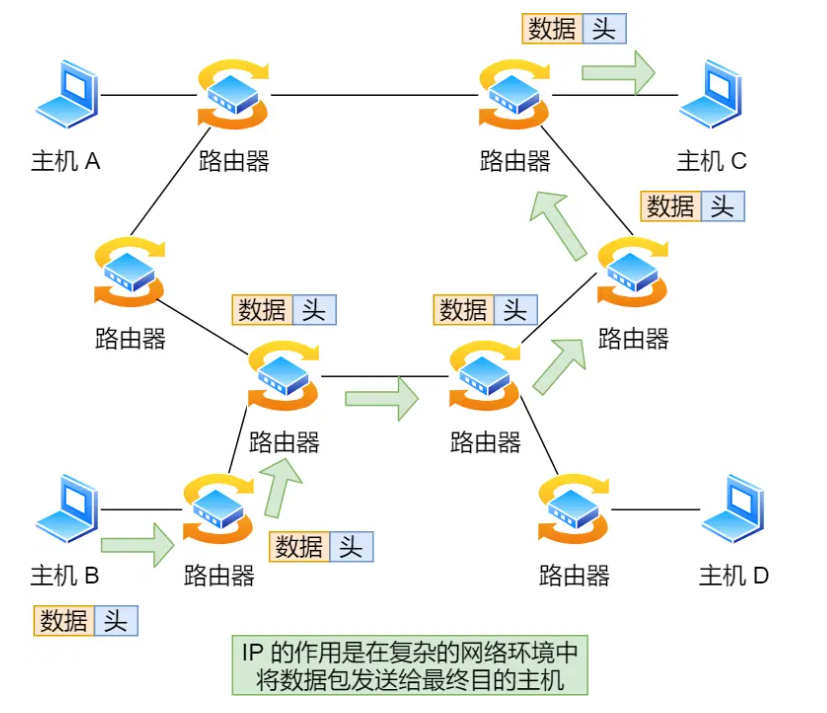
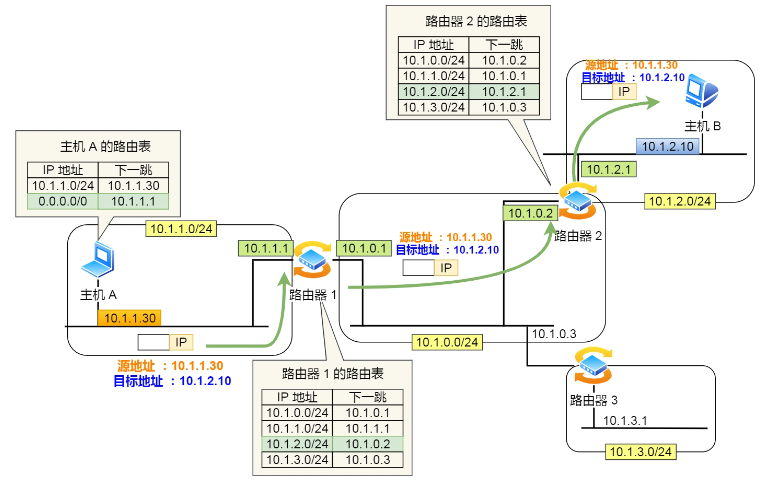
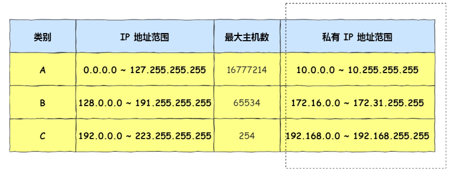

[TOC]

# IP协议

网络层的主要作用是：**实现主机与主机之间的通信，也叫点对点（end to end）通信。**

在上面我们知道 IP 的作用是主机之间通信用的，而 **MAC 的作用则是实现「直连」的两个设备之间通信，而 IP 则负责在「没有直连」的两个网络之间进行通信传输。**

在网络中数据包传输中也是如此，**源IP地址和目标IP地址在传输过程中是不会变化的（前提：没有使用 NAT 网络），只有源 MAC 地址和目标 MAC 一直在变化**

## IP地址与路由控制

路由控制表中记录着网络地址与下一步应该发送至路由器的地址。在主机和路由器上都会有各自的路由器控制表。

在发送 IP 包时，首先要确定 IP 包首部中的目标地址，再从路由控制表中找到与该地址具有**相同网络地址**的记录，根据该记录将 IP 包转发给相应的下一个路由器。如果路由控制表中存在多条相同网络地址的记录，就选择相同位数最多的网络地址，也就是最长匹配。

1. 当转发包时，首先路由器端口会接收发给自己的以太网包，然后**路由表**查询转发目标，再由相应的端口作为发送方将以太网包发送出去。就是路由器收到的数据包有目的 IP 地址，需要转化成从自己的哪个端口出去
2. 知道对方的 IP 地址之后，接下来需要通过 `ARP` 协议根据 IP 地址查询 MAC 地址，并将查询的结果作为接收方 MAC 地址。

下面以下图的网络链路作为例子说明：

1. 主机 A 要发送一个 IP 包，其源地址是 `10.1.1.30` 和目标地址是 `10.1.2.10`，由于没有在主机 A 的路由表找到与目标地址 `10.1.2.10` 相同的网络地址，知道对方的 IP 地址之后，接下来需要通过 `ARP` 协议根据 IP 地址查询 MAC 地址，并将查询的结果作为接收方 MAC 地址。于是包被转发到默认路由（路由器 `1` ）
2. 路由器 `1` 收到 IP 包后，也在路由器 `1` 的路由表匹配与目标地址相同的网络地址记录，发现匹配到了，于是就把 IP 数据包转发到了 `10.1.0.2` 这台路由器 `2`，知道对方的 IP 地址之后，接下来需要通过 `ARP` 协议根据 IP 地址查询 MAC 地址，并将查询的结果作为接收方 MAC 地址。于是包被转发到默认路由（路由器 `2` ）
3. 路由器 `2` 收到后，同样对比自身的路由表，发现匹配到了 `10.1.2.10`，接下来需要通过 `ARP` 协议根据 IP 地址查询 MAC 地址，并将查询的结果作为接收方 MAC 地址。于是把 IP 包从路由器 `2` 的 `10.1.2.1` 这个网口出去，最终包转发到了目标主机

## 公有 IP 地址与私有 IP 地址

在 A、B、C 分类地址，实际上有分公有 IP 地址和私有 IP 地址。

平时我们办公室、家里、学校用的 IP 地址，一般都是私有 IP 地址。因为这些地址允许组织内部的 IT 人员自己管理、自己分配，而且可以重复。因此，你学校的某个私有 IP 地址和我学校的可以是一样的。

公有 IP 地址是有个组织统一分配的，假设你要开一个博客网站，那么你就需要去申请购买一个公有 IP，这样全世界的人才能访问。并且公有 IP 地址基本上要在整个互联网范围内保持唯一。

##  127.0.0.1 和 localhost 以及 0.0.0.0 有区别吗

- `127.0.0.1` 是**回环地址**。`localhost`是**域名**，但默认等于 `127.0.0.1`。
- `ping` 回环地址和 `ping` 本机地址，是一样的，走的是**lo0 "假网卡"**，都会经过网络层和数据链路层等逻辑，最后在快要出网卡前**狠狠拐了个弯**， 将数据插入到一个**链表**后就**软中断**通知 **ksoftirqd** 来进行**收数据**的逻辑，**压根就不出网络**。所以断网了也能 `ping` 通回环地址。
- 如果服务器 `listen` 的是 `0.0.0.0`，那么此时用`127.0.0.1`和本机地址**都可以**访问到服务。

## 参考

https://xiaolincoding.com/network/