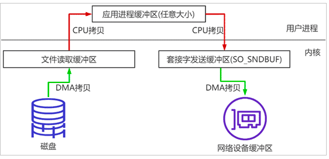
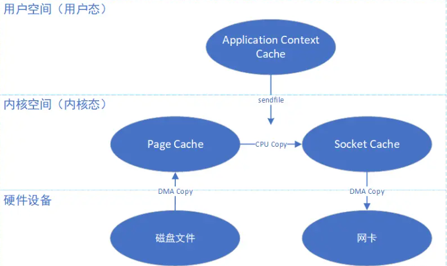
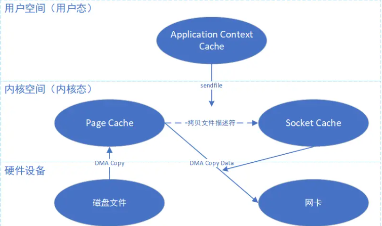
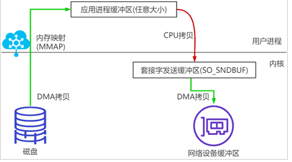

# Java的零拷贝技术


## 传统IO

如果采用传统标准IO的方式（基于数据拷贝），那么需要如下步骤：



**总共需要四步：**

1. read()：涉及到两次上下文切换以及两次数据拷贝；
   1. 读取磁盘文件，将数据DMA Copy到操作系统内核缓冲区Page Cache；
   2. 将内核缓冲区Page Cache的数据，CPU Copy到应用程序缓存；
2. send()：涉及到两次上下文切换以及两次数据拷贝；
   1. 将应用程序缓存中的数据，CPU Copy到socket网络发送缓冲区，即Socket Cache；
   2. 将Socket Cache的数据，DMA Copy到网卡，由网卡进行网络传输。

**可以发现，完成一次读写，需要4次上下文切换、2次DMA数据拷贝、两次CPU数据拷贝，实际上，如果仅仅是数据传输，那么数据根本不需要经过这么多次的拷贝。**

**DMA：Direct Memory Access ，它可以独立地直接读写系统内存，不需要 CPU 介入，像显卡、网卡之类都会用DMA。**

## 使用零拷贝

**零拷贝（Zero-copy）技术是指计算机执行操作时，CPU不需要先将数据从某处内存复制到另一个特定区域。这种技术通常用于通过网络传输数据时节省CPU周期和内存带宽。零拷贝技术可以减少数据拷贝和共享总线操作的次数，消除传输数据在存储器之间不必要的中间拷贝次数，从而有效地提高数据传输效率。而且，零拷贝技术减少了用户进程地址空间和内核地址空间之间因为上下文切换而带来的开销。**

常见的零拷贝技术分类：

1. **直接 I/O**：数据直接跨过内核缓冲区，在用户地址空间与 I/O 设备之间传递，内核只是进行必要的虚拟存储配置等辅助工作；
2. **数据传输不经过用户空间**：当应用程序在数据传输过程中不需要对数据进行访问时，则可以避免将数据从内核空间到用户空间之间的拷贝，传输的数据在页缓存中就可以得到处理；Linux 中提供类似的系统调用主要有 mmap()，sendfile() 以及 splice()。
3. **写时复制**：数据不需要提前拷贝，而是当需要修改的时候再进行部分拷贝。COW是对数据在 Linux 的页缓存和用户进程的缓冲区之间的传输过程进行优化手段。

**下面介绍数据传输不经过用户空间的零拷贝技术：mmap和sendfile，这也是Netty、Kafka、RocketMQ等框架所使用的底层技术。**

### sendfile调用

**Linux 在版本 2.1 中引入了 `sendfile()` 这个系统调用，sendfile()是一种零拷贝的实现。Java对sendfile的支持就是NIO中的`FileChannel.transferTo()`或者`transferFrom()`**



```java
/**
     * 使用sendfile:读取磁盘文件，并网络发送
     */
    @Test
    public void testSendFileClient() {
        SocketChannel socketChannel = null;
        FileChannel fileChannel = null;
        try {

            // 1. 创建并配置 服务器套接字通道 ServerSocketChannel
            socketChannel = SocketChannel.open();
            socketChannel.connect(new InetSocketAddress(HOST, PORT));
            //socketChannel.configureBlocking(false);

            System.out.println("step1: socketChannel" + PORT);

            // 2. 从文件输入流中获取文件通道 ( FileChannel )
            long startTime = System.currentTimeMillis();
            fileChannel = new RandomAccessFile(SRC, "rw").getChannel();

            // 3. 零拷贝传输数据, 注意记录每次拷贝的起始位置
            long transferLen;
            long totalCount = 0;
            // 使用零拷贝将文件数据传到服务器, 循环终止条件是传输结果小于等于 0
            while ((transferLen = fileChannel.transferTo(totalCount, 1024 * 1024 * 32, socketChannel)) > 0) {
                totalCount += transferLen;
            }

            System.out.println("文件传输完毕, 用时 : " + (System.currentTimeMillis() - startTime) + " ms");

            // 4. 关闭连接
            socketChannel.close();
            fileChannel.close();
        } catch (IOException e) {
            e.printStackTrace();
        } finally {
            // 5. 释放资源
            if (socketChannel != null) {
                try {
                    socketChannel.close();
                } catch (IOException e) {
                    e.printStackTrace();
                }
            }
            if (fileChannel != null) {
                try {
                    fileChannel.close();
                } catch (IOException e) {
                    e.printStackTrace();
                }
            }
        }
    }


    /**
     * 使用sendfile:读取磁盘文件，并网络发送
     */
    @Test
    public void testSendFileServer() {
        SocketChannel socketChannel = null;
        FileChannel fileChannel = null;
        try {

            // 1. 创建并配置 服务器套接字通道 ServerSocketChannel
            ServerSocketChannel serverSocketChannel = ServerSocketChannel.open();
            serverSocketChannel.socket().bind(new InetSocketAddress(PORT));

            System.out.println("step1: new ServerSocket:" + PORT);

            // 注意这里使用阻塞模式, 不调用该代码
            //serverSocketChannel.configureBlocking(false);
            // 2. 获取文件通道
            fileChannel = new RandomAccessFile(DEST, "rw").getChannel();

            // 3. 阻塞等待
            socketChannel = serverSocketChannel.accept();

            System.out.println("step2:client\t" + socketChannel.getRemoteAddress());

            // 4. 零拷贝核心操作
            fileChannel.transferFrom(socketChannel, 0, 1024 * 1024 * 32);
        } catch (IOException e) {
            e.printStackTrace();
        } finally {
            // 5. 释放资源
            if (socketChannel != null) {
                try {
                    socketChannel.close();
                } catch (IOException e) {
                    e.printStackTrace();
                }
            }
            if (fileChannel != null) {
                try {
                    fileChannel.close();
                } catch (IOException e) {
                    e.printStackTrace();
                }
            }
        }
    }


    /**
     * 使用sendfile:进行文件复制
     */
    @Test
    public void testFileSendFile() {
        try (FileChannel srcChannel = new RandomAccessFile(SRC, "rw").getChannel();
             FileChannel destChannel = new RandomAccessFile(DEST, "rw").getChannel()) {

            srcChannel.transferTo(0, srcChannel.size(), destChannel);
        } catch (IOException e) {
            e.printStackTrace();
        }
    }
```

**使用sendfile进行网络数据传输流程为：**

1. 发起sendfile() 系统调用，上下文切换一次。将文件中的数据DMA Copy到Page Cache中。
2. 继续将Page Cache中的数据CPU Copy到与 Scocket Cache中去。
3. 继续将Scocket Cache的数据DMA Copy到网卡，由网卡进行网络传输。sendfile() 系统调用返回，上下文切换一次。

**可以看到整个流程，减少了一次CPU Copy，减少了两次的上下文切换，相比于传统IO确实提升了性能。**

但是，数据仍旧需要一次从Page Cache到Socket Cache的CPU Copy，这个Copy能不能也去掉呢？

**当然可以，Linux 2.4+ 版本之后，文件描述符结果被改变，借助DMA Gather(带有收集功能的DMA)，sendfile()再次减少了一次 Copy 操作，变成了真正的零拷贝（没有CPU Copy）。**

此时整个步骤变为：

1. 发起sendfile() 系统调用，上下文切换一次。将文件中的数据DMA Copy到Page Cache中。
2. 继续将Page Cache中的带有文件位置和长度信息的缓冲区描述符CPU Copy到Socket Cache中去，这部分拷贝很少的数据，可忽略。
3. 继续借助DMA Gather ，直接将Scocket Cache的真正数据DMA Copy到网卡，由网卡进行网络传输。这样就避免了最后一次CPU Copy。sendfile() 系统调用返回，上下文切换一次。

**sendfile + DMA Gather流程如下：**



**sendfile + DMA Gather，使得整个传输只需要两次上下文切换，数据只需要两次DMA Copy，降低了上下文切换和数据拷贝带来的开销，极大的提升了数据传输的效率，没有CUP拷贝，是真正的零拷贝。**

**但是，sendfile调用有一个缺点，那就是无法在sendfile调用过程中修改数据，因此sendfile()只是适用于应用程序地址空间不需要对所访问数据进行处理的和修改情况，常见的就是文件传输，或者MQ消费消息的获取，如果想要在传输过程中修改数据，可以使用mmap系统调用。**

**mmap调用是一个比sendfile调用昂贵但优于传统I/O的零拷贝实现方式，而mmap调用则可以在中途直接修改Page Cache中的数据，这也是mmap零拷贝的优点**


### mmap调用

**mmap（Memory Mapped Files）是一种零拷贝技术，学名内存映射文件，Java中的实现就是`MappedByteBuffer`，通过`channel#map`方法得到。**

- 首先要说明的是，JavaNlO中 的Channel (通道)就相当于操作系统中的内核缓冲区，有可能是读缓冲区，也有可能是网络缓冲区，而Buffer就相当于操作系统中的用户缓冲区。

```java
/**
     * 使用内存映射
     */
    @Test
    public void testMMAP() {

        // 文件中存10K的数据
        int length = 10240;
        try (FileChannel channel = new RandomAccessFile(SRC, "rw").getChannel()) {

            // 写数据到pageCache
            MappedByteBuffer mapBuffer = channel.map(FileChannel.MapMode.READ_WRITE, 0, length);
            for (int i = 0; i < length; i++) {
                mapBuffer.put((byte) ((int) 'a' + i % 26));
            }
            // 刷盘
            mapBuffer.force();
            // 读取数据
            for (int i = 0; i < length; i++) {
                if (i % 50 == 0) System.out.println();
                // 像数组一样访问
                System.out.print((char) mapBuffer.get(i));
            }


        } catch (FileNotFoundException e) {
            e.printStackTrace();
        } catch (IOException e) {
            e.printStackTrace();
        }
    }
```

NIO中的FileChannel.map()方法其实就是采用了操作系统中的内存映射方式，底层就是调用Linux mmap()实现的。

mmap将一个文件(或者文件的一部分)映射到进程的地址空间，实现文件磁盘地址和进程虚拟地址空间中一段虚拟地址的一一对映关系。注意这时候没有分配和映射到具体的物理内存空间，而是到第一次加载这个文件的时候，通过MMU把之前虚拟地址换算成物理地址，把文件加载进物理内存——内核空间的Page Cache中。

实现这样的映射关系后，进程就可以采用指针的方式读写操作这一段内存，而系统会自动回写脏页面到对应的文件磁盘上，即完成了对文件的操作而不必再调用 read，write 等系统调用函数。相反，内核空间对这段区域的修改也直接反映用户空间，从而可以实现不同进程间的文件共享。

**简单的说，使用mmap之后，数据无需拷贝到用户空间中，应用程序可以直接操作Page Cache中的数据。**

例如：读取文件，再用socket发送出去，如果是使用MMAP实际经过三次copy（1次cpu拷贝每次100ms ，2次DMA拷贝每次10ms），合计只需要120ms



**使用mmap进行网络数据传输流程为：**

1. 发起mmap() 系统调用，上下文切换一次（切换1）。将文件中的数据DMA Copy到Page Cache中。
2. 上下文切换一次（切换2）在应用程序读取page cache中数据
3. 应用进程通过write函数，发起IO调用， 上下文从用户态转为内核态（切换3）继续将Page Cache中的数据CPU Copy到与 Scocket Cache中去。
4. 继续将Scocket Cache的数据DMA Copy到网卡，由网卡进行网络传输。write() 系统调用返回，上下文切换一次（切换4）。

**另外，当应用程序往 mmap 输出数据时，此时就直接输出到了内核态的缓冲区数据，如果此时输出设备是磁盘的话，不会立即写磁盘，linux系统下通常会间隔是30秒由操作系统自动落盘，也可手动调用fsync()函数让其立即落盘，实现真正的持久化**

### 零拷贝的应用

#### kafka

对于Kafka来说：

1. 数据从Producer到Broker，需要将来自网卡的消息持久化的磁盘中，Kafka中采用**mmap**的方式写，并且不会立即持久化到磁盘中，而是存入page cache内核缓冲区中就直接返回成功。后续有消费者来拉取消息的时候，也是先冲缓冲区中查找消息，如果有就直接发送给消费者，不会再查找磁盘，又提升了拉消息的性能。实际上它的日志文件并没有用到 mmap，而索引文件用了 mmap。
2. 数据从Broker到Consumer，需要将磁盘中的消息通过网卡发送出去，Kafka中采用**sendfile**的方式，将磁盘文件读到OS内核缓冲区后，直接转到socket buffer进行网络发送

## 参考

https://juejin.cn/post/7016498891365302302

https://www.jb51.net/article/257040.htm