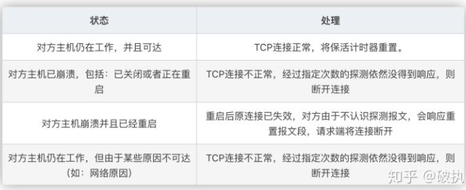
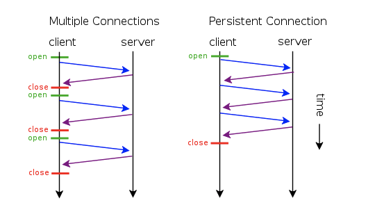

# TCP以及HTTP的长连接

## TCP 中的 KeepAlive 机制

### Tcp keepalive 如何使用

以下环境是在Linux服务器上进行，KeepAlive默认不是开启的，如果想使用KeepAlive，需要在你的应用中设置SO_KEEPALIVE才可以生效。

系统内核参数配置
- tcp_keepalive_time，**在TCP保活打开的情况下**，最后一次数据交换到TCP发送第一个保活探测包的间隔，即允许的持续空闲时长，或者说每次正常发送心跳的周期，默认值为7200s（2h）。
- tcp_keepalive_probes 在tcp_keepalive_time之后，没有接收到对方确认，继续发送保活探测包次数，默认值为9（次）
- tcp_keepalive_intvl，在tcp_keepalive_time之后，没有接收到对方确认，继续发送保活探测包的发送频率，默认值为75s。

*发送频率tcp_keepalive_intvl乘以发送次数tcp_keepalive_probes，就得到了从开始探测到放弃探测确定连接断开的时间；*

例程：
以下改动，需要写入到/etc/sysctl.conf文件：
```linux
net.ipv4.tcp_keepalive_time=90
net.ipv4.tcp_keepalive_intvl=15
net.ipv4.tcp_keepalive_probes=2
```

保存退出，然后执行sysctl -p生效

可通过 sysctl -a | grep keepalive 命令检测一下是否已经生效。

若设置，服务器在客户端连接空闲的时候，每90秒发送一次保活探测包到客户端，若没有及时收到客户端的TCP Keepalive ACK确认，将继续等待15秒*2=30秒。总之可以在90s+30s=120秒（两分钟）时间内可检测到连接失效与否。
* * *
***Java程序只能做到设置SO_KEEPALIVE选项，至于TCP_KEEPCNT，TCP_KEEPIDLE，TCP_KEEPINTVL等参数配置，只能依赖于sysctl配置，系统进行读取。***
* * *
### 在双方长时间未通讯时，如何得知对方还活着？如何得知这个TCP连接是健康且具有通讯能力的？

TCP的保活机制就是用来解决此类问题，这个机制我们也可以称作：keepalive。保活机制默认是关闭的，TCP连接的任何一方都可打开此功能。有三个主要配置参数用来控制保活功能。

如果在一段时间（保活时间：tcp_keepalive_time）内此连接都不活跃，开启保活功能的一端会向对端发送一个保活探测报文。

若对端正常存活，且连接有效，对端必然能收到探测报文并进行响应。此时，发送端收到响应报文则证明TCP连接正常，重置保活时间计数器即可。
若由于网络原因或其他原因导致，发送端无法正常收到保活探测报文的响应。那么在一定探测时间间隔（tcp_keepalive_intvl）后，将继续发送保活探测报文。直到收到对端的响应，或者达到配置的探测循环次数上限（tcp_keepalive_probes）都没有收到对端响应，这时对端会被认为不可达，TCP连接随存在但已失效，需要将连接做中断处理
在探测过程中，对端主机会处于以下四种状态之一：



### TCP Keepalive协议解读

下面协议解读，基于 RFC1122#TCP Keep-Alives  （注意这是协议的解读站在协议的角度）

1. TCP Keepalive 虽不是TCP协议的标准规范，但操作系统一旦实现，默认情况下须为关闭，可以被上层应用开启和关闭。
2. TCP Keepalive必须在 没有任何数据（包括ACK包）接收之后的周期内才会被发送，允许配置，默认值不能够小于2个小时
3. 不包含数据的ACK段在被TCP发送时没有可靠性保证，意即一旦发送，不确保一定发送成功。系统实现不能对任何特定探针包作死连接对待
4. 规范建议keepalive保活包不应该包含数据，但也可以包含1个无意义的字节，比如0x0。
5. TCP保活探测报文序列号将应该的TCP报文序列号减1，即下一次发送正常报文序号等于ACK序列号；总之保活报文不在窗口控制范围内，见[TCP连接请求过程(含keepalive)](docs/cs-basics/network/TCP连接请求过程(含keepalive).md)图解

## HTTP的Connection: keep-alive

### 简介

我们知道HTTP协议采用“请求-应答”模式
- 当使用普通模式，即非KeepAlive模式时，每个请求/应答客户和服务器都要新建一个连接，完成之后立即断开连接（HTTP协议为无连接的协议）；
-  当使用Keep-Alive模式（又称持久连接、连接重用）时，Keep-Alive功能使客户端到服务器端的连接持续有效，当出现对服务器的后继请求时，Keep-Alive功能避免了建立或者重新建立连接。


http 1.0中默认是关闭的，需要在http头加入"Connection: Keep-Alive"，才能启用Keep-Alive；
http 1.1中默认启用Keep-Alive，如果加入"Connection: close "，才关闭。
目前大部分浏览器都是用http1.1协议，也就是说默认都会发起Keep-Alive的连接请求了，所以是否能完成一个完整的Keep-Alive连接就看服务器设置情况。

## HTTP和TCP的长连接有何区别

TCP连接往往就是我们广义理解上的长连接，因为它具备双端连续收发报文的能力；开启了keep-alive的HTTP连接，也是一种长连接，但是它由于协议本身的限制，服务端无法主动发起应用报文。

TCP中的keepalive是用来保鲜、保活的；HTTP中的keep-alive机制主要为了让支撑它的TCP连接活的的更久，所以通常又叫做：HTTP persistent connection（持久连接） 和 HTTP connection reuse（连接重用）。

### 问题

***在HTTP请求中，到底是「服务端」还是「客户端」主动关闭连接呢？***

看到过很多文章，有人说服务端、有人说客户端、有人说分情况（keep-alive的开启与否）既可能是客户端也可能是服务端。你信谁？最后翻来覆去发现各个网站的各种文章基本类似，只有观点，没有论据。

[TCP连接请求过程(含keepalive)](docs/cs-basics/network/TCP连接请求过程(含keepalive).md)的实验结果：无论开启keep-alive与否，最终由服务端主动断开TCP连接。

但是我给出问题的答案是：通常由服务端主动关闭连接。没有写“肯定由服务端主动关闭连接”的原因是，我没遇到客户端主动关闭连接的场景，并不代表没有。网络和协议博大精深，等待我们继续去探索。

### 实验

## 参考

- https://zhuanlan.zhihu.com/p/224595048
- https://www.cnblogs.com/skynet/archive/2010/12/11/1903347.html
- https://segmentfault.com/a/1190000021057175