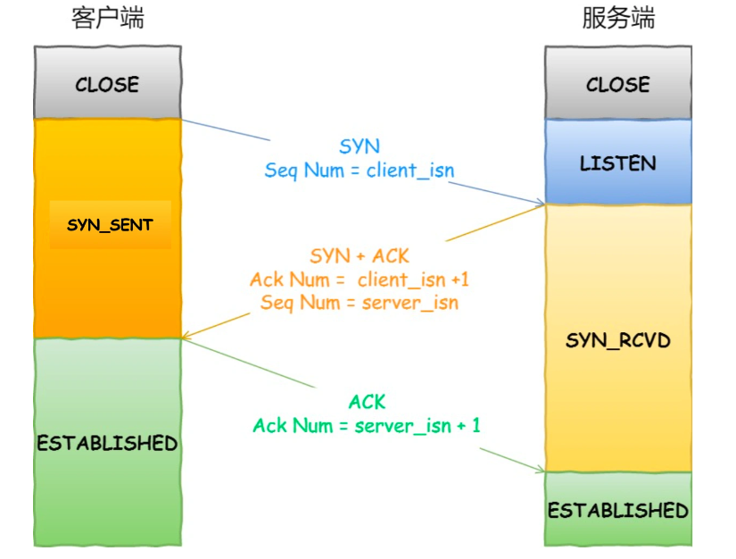
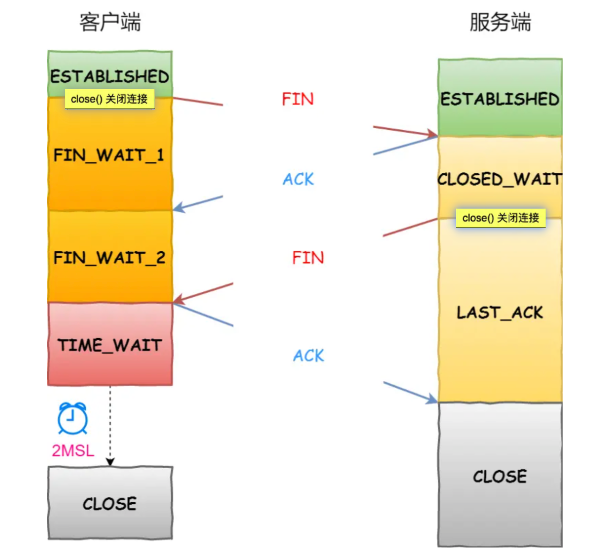
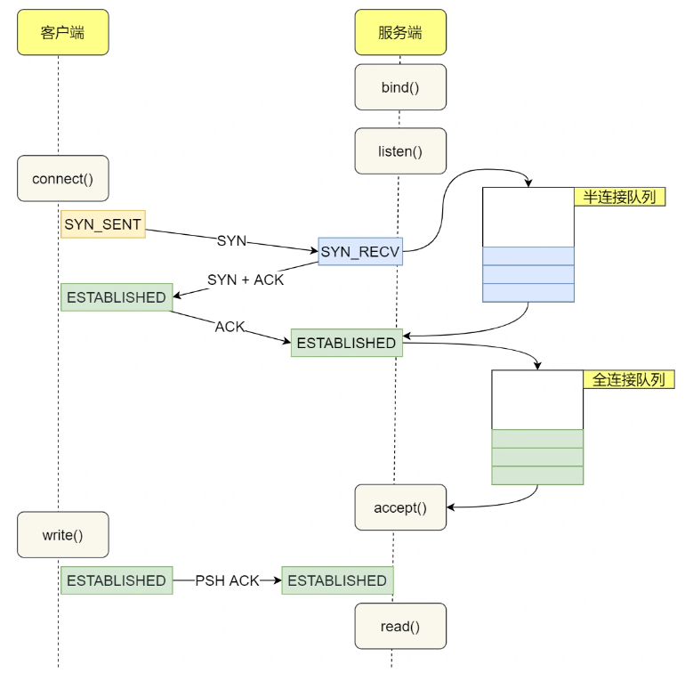

[TOC]

# TCP协议

## 简介

它为了保证可靠性，用了巨多的机制来保证

为了实现可靠性传输，需要考虑很多事情，例如数据的破坏、丢包、重复以及分片顺序混乱等问题。如不能解决这些问题，也就无从谈起可靠传输。

那么，TCP 是通过序列号、确认应答、重发控制、连接管理以及窗口控制等机制实现可靠性传输的。

## 三次握手

## 为什么是三次握手

1. 三次握手才可以阻止重复历史连接的初始化才可以避免资源浪费
2. 三次握手才可以同步双方的初始序列号，也校验了client以及server端的发送接收没有问题

### 三次握手才可以阻止重复历史连接的初始化

因为**在两次握手的情况下，服务端没有中间状态给客户端来阻止历史连接，导致服务端可能建立一个历史连接，造成资源浪费**。

### 三次握手才可以同步双方的初始序列号，也校验client以及server端的发送接收没有问题

序列号是可靠传输的一个关键因素，它的作用：

- 接收方可以去除重复的数据；
- 接收方可以根据数据包的序列号按序接收；
- 可以标识发送出去的数据包中， 哪些是已经被对方收到的（通过 ACK 报文中的序列号知道）；

当客户端发送携带「初始序列号」的 `SYN` 报文的时候，需要服务端回一个 `ACK` 应答报文，表示客户端的 SYN 报文已被服务端成功接收，那当服务端发送「初始序列号」给客户端的时候，依然也要得到客户端的应答回应，**这样一来一回，才能确保双方的初始序列号能被可靠的同步，才能校验client以及server端的发送接收没有问题。**

### 小结

不使用「两次握手」和「四次握手」的原因：

- 「两次握手」：无法防止历史连接的建立，会造成双方资源的浪费，也无法可靠的同步双方序列号；
- 「四次握手」：三次握手就已经理论上最少可靠连接建立，所以不需要使用更多的通信次数。

## 三次握手丢失

### 第一次握手丢失

当客户端想和服务端建立 TCP 连接的时候，首先第一个发的就是 SYN 报文，然后进入到 `SYN_SENT` 状态。在这之后，如果客户端迟迟收不到服务端的 SYN-ACK 报文（第二次握手），就会触发「超时重传」机制，重传 SYN 报文，而且**重传的 SYN 报文的序列号都是一样的**。直到收到第二次握手，或者达到最大重传次数（默认为5，根据超时时间计算），或者达到超时时间。

### 第二次握手丢失

如果第二次握手丢了，就会发生比较有意思的事情，具体会怎么样呢？

因为第二次握手报文里是包含对客户端的第一次握手的 ACK 确认报文，所以，如果客户端迟迟没有收到第二次握手，那么客户端就觉得可能自己的 SYN 报文（第一次握手）丢失了，于是**客户端就会触发超时重传机制，重传 SYN 报文**。直到收到第二次握手，或者达到最大重传次数（默认为5，根据超时时间计算），或者达到超时时间。如果还是没能收到服务端的第二次握手（SYN-ACK 报文），那么客户端就会断开连接。

然后，因为第二次握手中包含服务端的 SYN 报文，所以当客户端收到后，需要给服务端发送 ACK 确认报文（第三次握手），服务端才会认为该 SYN 报文被客户端收到了。

那么，如果第二次握手丢失了，服务端就收不到第三次握手，于是**服务端这边会触发超时重传机制，重传 SYN-ACK 报文**。直到收到第三次握手，或者达到最大重传次数（默认为5，根据超时时间计算），或者达到超时时间。如果还是没能收到客户端的第三次握手（ACK 报文），那么服务端就会断开连接

### 第三次握手丢失

当第三次握手丢失了，如果服务端那一方迟迟收不到这个确认报文，就会触发超时重传机制，重传 SYN-ACK 报文，直到收到第三次握手，或者达到最大重传次数，或者达到超时时间。

在建立 TCP 连接时，如果第三次握手的 ACK，服务端无法收到，则服务端就会短暂处于 `SYN_RECV` 状态，而客户端会处于 `ESTABLISHED` 状态。

由于服务端一直收不到 TCP 第三次握手的 ACK，则会一直重传 SYN、ACK 包，直到重传次数超过 `tcp_synack_retries` 值（默认值 5 次）后，服务端就会断开 TCP 连接。

而客户端则会有两种情况：

- 如果客户端没发送数据包，一直处于 `ESTABLISHED` 状态，然后经过 2 小时 11 分 15 秒才可以发现一个「死亡」连接，于是客户端连接就会断开连接。
- 如果客户端发送了数据包，一直没有收到服务端对该数据包的确认报文，则会一直重传该数据包，直到重传次数超过 `tcp_retries2` 值（默认值 15 次）后，客户端就会断开 TCP 连接

### 小结

1. 第一次握手发送syn有问题的话，客户端会重传 SYN 报文，而且**重传的 SYN 报文的序列号都是一样的**。
2. 第二次握手发送syn、ack包有问题的话，客户端会超时重发 SYN 包，服务端也会超时重传 SYN、ACK 包。如果还是没能收到服务端的第二次握手（SYN-ACK 报文），那么客户端就会断开连接。如果还是没能收到客户端的第三次握手（ACK 报文），那么服务端就会断开连接。
3. 第三次握手发送ack有问题，服务端则会一直重传 SYN、ACK 包，如果还是没能收到客户端的第三次握手（ACK 报文），那么服务端就会断开连接。客户端仍会处于`ESTABLISHED` 状态。
4. 连接失效，客户端 ESTABLISHED 的场景。如果客户端没发送数据包，一直处于 `ESTABLISHED` 状态，然后经过 2 小时 11 分 15 秒（TCP的探活）才可以发现一个「死亡」连接，于是客户端连接就会断开连接。如果客户端发送了数据包，一直没有收到服务端对该数据包的确认报文，则会一直重传该数据包，直到达到最大重传次数后，客户端就会断开 TCP 连接

## 四次挥手

为什么需要四次了。

- 关闭连接时，客户端向服务端发送 `FIN` 时，仅仅表示客户端不再发送数据了但是还能接收数据。
- 服务端收到客户端的 `FIN` 报文时，先回一个 `ACK` 应答报文，而服务端可能还有数据需要处理和发送，等服务端不再发送数据时，才发送 `FIN` 报文给客户端来表示同意现在关闭连接。

从上面过程可知，服务端通常需要等待完成数据的发送和处理，所以服务端的 `ACK` 和 `FIN` 一般都会分开发送，因此是需要四次挥手。

### 第一次挥手丢失

当客户端超时重传 3 次 FIN 报文后，由于 tcp_orphan_retries 为 3，已达到最大重传次数，于是再等待一段时间（时间为上一次超时时间的 2 倍），如果还是没能收到服务端的第二次挥手（ACK报文），那么客户端就会断开连接。

### 第二次挥手丢失

- 当客户端超时重传 2 次 FIN 报文后，由于 tcp_orphan_retries 为 2，已达到最大重传次数，于是再等待一段时间（时间为上一次超时时间的 2 倍），如果还是没能收到服务端的第二次挥手（ACK 报文），那么客户端就会断开连接。

### 第三次挥手丢失

- 当服务端重传第三次挥手报文的次数达到了 3 次后，由于 tcp_orphan_retries 为 3，达到了重传最大次数，于是再等待一段时间（时间为上一次超时时间的 2 倍），如果还是没能收到客户端的第四次挥手（ACK报文），那么服务端就会断开连接。
- 客户端因为是通过 close 函数关闭连接的，处于 FIN_WAIT_2 状态是有时长限制的，如果 tcp_fin_timeout 时间内还是没能收到服务端的第三次挥手（FIN 报文），那么客户端就会断开连接。

### 第四次挥手丢失

- 当服务端重传第三次挥手报文达到 2 时，由于 tcp_orphan_retries 为 2， 达到了最大重传次数，于是再等待一段时间（时间为上一次超时时间的 2 倍），如果还是没能收到客户端的第四次挥手（ACK 报文），那么服务端就会断开连接。
- 客户端在收到第三次挥手后，就会进入 TIME_WAIT 状态，开启时长为 2MSL 的定时器，如果途中再次收到第三次挥手（FIN 报文）后，就会重置定时器，当等待 2MSL 时长后，客户端就会断开连接

## 为什么 TIME_WAIT 等待的时间是 2MSL

`MSL` 是 Maximum Segment Lifetime，**报文最大生存时间**，它是任何报文在网络上存在的最长时间，超过这个时间报文将被丢弃。

在 Linux 系统里 `2MSL` 默认是 `60` 秒，那么一个 `MSL` 也就是 `30` 秒。**Linux 系统停留在 TIME_WAIT 的时间为固定的 60 秒**。

TIME_WAIT 等待 2 倍的 MSL，比较合理的解释是： 网络中可能存在来自发送方的数据包，当这些发送方的数据包被接收方处理后又会向对方发送响应，所以**一来一回需要等待 2 倍的时间**。

## 为什么需要 TIME_WAIT 状态

需要 TIME-WAIT 状态，主要是两个原因：

- 防止历史连接中的数据，被后面相同四元组的连接错误的接收；
- 保证「被动关闭连接」的一方，能被正确的关闭；

为了防止历史连接中的数据，被后面相同四元组的连接错误的接收，因此 TCP 设计了 TIME_WAIT 状态，状态会持续 `2MSL` 时长，这个时间**足以让两个方向上的数据包都被丢弃，使得原来连接的数据包在网络中都自然消失，再出现的数据包一定都是新建立连接所产生的**

**等待足够的时间以确保最后的 ACK 能让被动关闭方接收，从而帮助其正常关闭。**如果客户端（主动关闭方）最后一次 ACK 报文（第四次挥手）在网络中丢失了，那么按照 TCP 可靠性原则，服务端（被动关闭方）会重发 FIN 报文。假设客户端没有 TIME_WAIT 状态，而是在发完最后一次回 ACK 报文就直接进入 CLOSE 状态，如果该 ACK 报文丢失了，服务端则重传的 FIN 报文，而这时客户端已经进入到关闭状态了，在收到服务端重传的 FIN 报文后，就会回 RST 报文。

服务端收到这个 RST 并将其解释为一个错误（Connection reset by peer），这对于一个可靠的协议来说不是一个优雅的终止方式。

为了防止这种情况出现，客户端必须等待足够长的时间，确保服务端能够收到 ACK，如果服务端没有收到 ACK，那么就会触发 TCP 重传机制，服务端会重新发送一个 FIN，这样一去一来刚好两个 MSL 的时间。

## 服务器出现大量 TIME_WAIT 状态的原因有哪些

**什么场景下服务端会主动断开连接呢？**

- 第一个场景：HTTP 没有使用长连接，服务端主动关闭连接
- 第二个场景：HTTP 长连接超时，**nginx 就会触发回调函数来关闭该连接，那么此时服务端上就会出现 TIME_WAIT 状态的连接**。
- 第三个场景：HTTP 长连接的请求数量达到上限， nginx 的 keepalive_requests 这个参数记录这个 HTTP 长连接上已经接收并处理的客户端请求的数量。**如果达到这个参数设置的最大值时，则 nginx 会主动关闭这个长连接**

## 服务器出现大量 CLOSE_WAIT 状态的原因有哪些

**当服务端出现大量 CLOSE_WAIT 状态的连接的时候，说明服务端的程序没有调用 close 函数关闭连接**。

普通的 TCP 服务端的流程：

1. 创建服务端 socket，bind 绑定端口、listen 监听端口
2. 将服务端 socket 注册到 epoll
3. epoll_wait 等待连接到来，连接到来时，调用 accpet 获取已连接的 socket
4. 将已连接的 socket 注册到 epoll
5. epoll_wait 等待事件发生
6. 对方连接关闭时，我方调用 close

可能导致服务端没有调用 close 函数的原因，如下。

**第一个原因**：第 2 步没有做，没有将服务端 socket 注册到 epoll，这样有新连接到来时，服务端没办法感知这个事件，也就无法获取到已连接的 socket，那服务端自然就没机会对 socket 调用 close 函数了。

不过这种原因发生的概率比较小，这种属于明显的代码逻辑 bug，在前期 read view 阶段就能发现的了。

**第二个原因**： 第 3 步没有做，有新连接到来时没有调用 accpet 获取该连接的 socket，导致当有大量的客户端主动断开了连接，而服务端没机会对这些 socket 调用 close 函数，从而导致服务端出现大量 CLOSE_WAIT 状态的连接。

发生这种情况可能是因为服务端在执行 accpet 函数之前，代码卡在某一个逻辑或者提前抛出了异常。

**第三个原因**：第 4 步没有做，通过 accpet 获取已连接的 socket 后，没有将其注册到 epoll，导致后续收到 FIN 报文的时候，服务端没办法感知这个事件，那服务端就没机会调用 close 函数了。

发生这种情况可能是因为服务端在将已连接的 socket 注册到 epoll 之前，代码卡在某一个逻辑或者提前抛出了异常。之前看到过别人解决 close_wait 问题的实践文章，感兴趣的可以看看：[一次 Netty 代码不健壮导致的大量 CLOSE_WAIT 连接原因分析(opens new window)](https://mp.weixin.qq.com/s?__biz=MzU3Njk0MTc3Ng==&mid=2247486020&idx=1&sn=f7cf41aec28e2e10a46228a64b1c0a5c&scene=21#wechat_redirect)

**第四个原因**：第 6 步没有做，当发现客户端关闭连接后，服务端没有执行 close 函数，可能是因为代码漏处理，或者是在执行 close 函数之前，代码卡在某一个逻辑，比如发生死锁等等。

可以发现，**当服务端出现大量 CLOSE_WAIT 状态的连接的时候，通常都是代码的问题，这时候我们需要针对具体的代码一步一步的进行排查和定位，主要分析的方向就是服务端为什么没有调用 close**

## TCP 半连接队列和全连接队列

在 TCP 三次握手的时候，Linux 内核会维护两个队列，分别是：

- 半连接队列，也称 SYN 队列；
- 全连接队列，也称 accept 队列；

服务端收到客户端发起的 SYN 请求后，**内核会把该连接存储到半连接队列**，并向客户端响应 SYN+ACK，接着客户端会返回 ACK，服务端收到第三次握手的 ACK 后，**内核会把连接从半连接队列移除，然后创建新的完全的连接，并将其添加到 accept 队列，等待进程调用 accept 函数时把连接取出来。**

## TCP异常断开连接的场景

这个问题有几个关键词：

- 没有开启 keepalive；
- 一直没有数据交互；
- 进程崩溃；
- 主机崩溃；
- 拔掉网线

### 开启keepalive

如果两端的 TCP 连接一直没有数据交互，达到了触发 TCP 保活机制的条件，那么内核里的 TCP 协议栈就会发送探测报文。

- 如果对端程序是正常工作的。当 TCP 保活的探测报文发送给对端, 对端会正常响应，这样 **TCP 保活时间会被重置**，等待下一个 TCP 保活时间的到来。
- 如果对端主机崩溃，或对端由于其他原因导致报文不可达。当 TCP 保活的探测报文发送给对端后，石沉大海，没有响应，连续几次，达到保活探测次数后，**TCP 会报告该 TCP 连接已经死亡**。

所以，TCP 保活机制可以在双方没有数据交互的情况，通过探测报文，来确定对方的 TCP 连接是否存活。

### 主机崩溃

客户端主机崩溃了，服务端是无法感知到的

- 如果服务端会发送数据，由于客户端已经不存在，收不到数据报文的响应报文，服务端的数据报文会超时重传，当重传总间隔时长达到一定阈值（内核会根据 tcp_retries2 设置的值计算出一个阈值）后，会断开 TCP 连接；
- 如果服务端一直不会发送数据，再看服务端有没有开启 TCP keepalive 机制？
  - 如果有开启，服务端在一段时间没有进行数据交互时，会触发 TCP keepalive 机制，探测对方是否存在，如果探测到对方已经消亡，则会断开自身的 TCP 连接；
  - 如果没有开启，服务端的 TCP 连接会一直存在，并且一直保持在 ESTABLISHED 状态。

### 进程崩溃

TCP 的连接信息是由内核维护的，所以当服务端的进程崩溃后，内核需要回收该进程的所有 TCP 连接资源，于是内核会发送第一次挥手 FIN 报文，后续的挥手过程也都是在内核完成，并不需要进程的参与，所以即使服务端的进程退出了，还是能与客户端完成 TCP四次挥手的过程。

所以，即使没有开启 TCP keepalive，且双方也没有数据交互的情况下，如果其中一方的进程发生了崩溃，这个过程操作系统是可以感知的到的，于是就会发送 FIN 报文给对方，然后与对方进行 TCP 四次挥手。

### 拔掉网线

**拔掉网线这个动作并不会影响 TCP 连接的状态**

#### 拔掉网线后，有数据传输

在客户端拔掉网线后，服务端向客户端发送的数据报文会得不到任何的响应，在等待一定时长后，服务端就会触发**超时重传**机制，重传未得到响应的数据报文。**如果在服务端重传报文的过程中，客户端一直没有将网线插回去**，服务端超时重传报文的次数达到一定阈值后，内核就会判定出该 TCP 有问题，然后通过 Socket 接口告诉应用程序该 TCP 连接出问题了，于是服务端的 TCP 连接就会断开。

#### 拔掉网线后，没有数据传输

- 如果双方都没有开启 TCP keepalive 机制，那么在客户端拔掉网线后，如果客户端一直不插回网线，那么客户端和服务端的 TCP 连接状态将会一直保持存在。
- 如果双方都开启了 TCP keepalive 机制，那么在客户端拔掉网线后，如果客户端一直不插回网线，TCP keepalive 机制会探测到对方的 TCP 连接没有存活，于是就会断开 TCP 连接。而如果在 TCP 探测期间，客户端插回了网线，那么双方原本的 TCP 连接还是能正常存在。

## TCP的序列号以及确认号

**发送的 TCP 报文：**

- **公式一：序列号 = 上一次发送的序列号 + len（数据长度）。特殊情况，如果上一次发送的报文是 SYN 报文或者 FIN 报文，则改为 上一次发送的序列号 + 1。**
- **公式二：确认号 = 上一次收到的报文中的序列号 + len（数据长度）。特殊情况，如果收到的是 SYN 报文或者 FIN 报文，则改为上一次收到的报文中的序列号 + 1。**

## 参考

https://xiaolincoding.com/network/