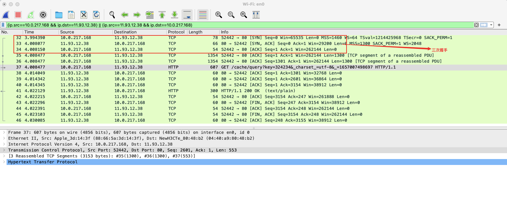
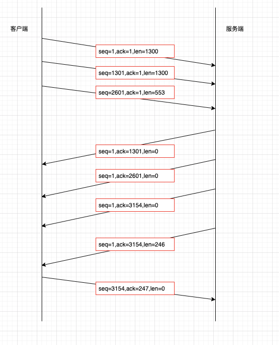
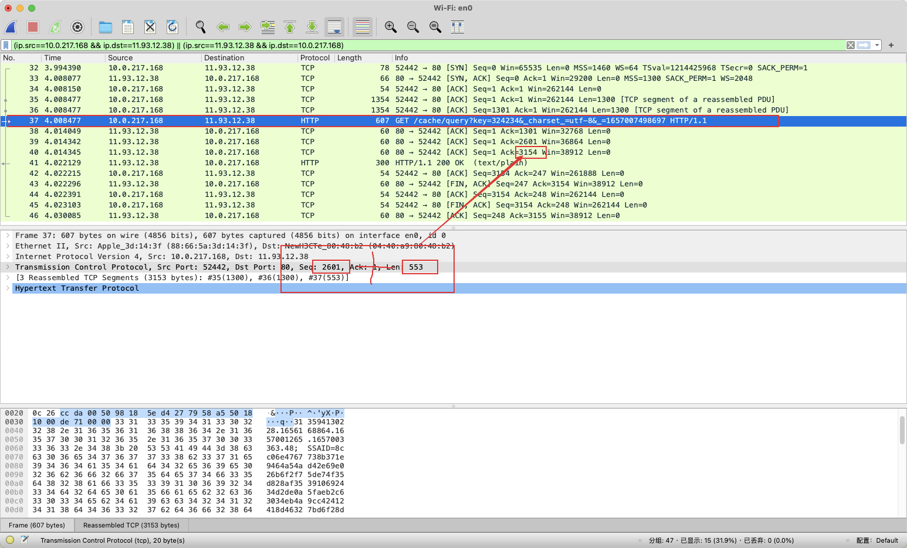
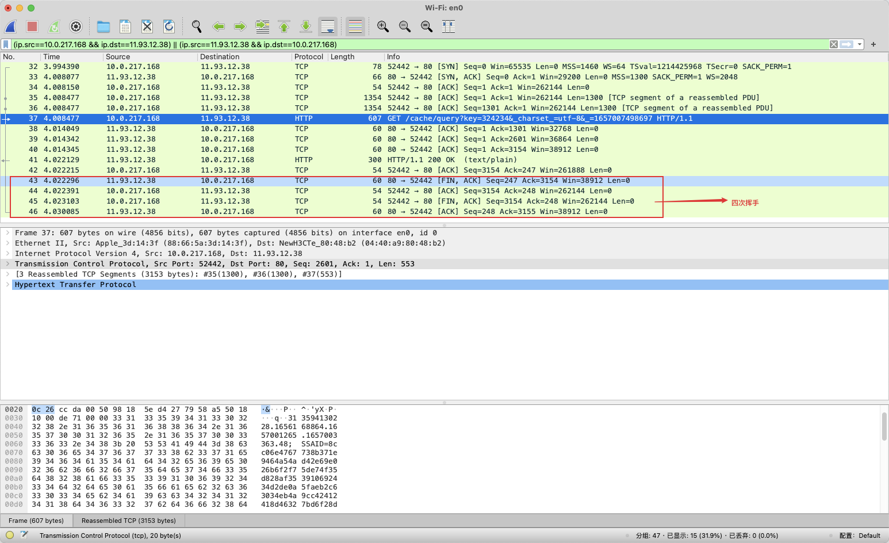
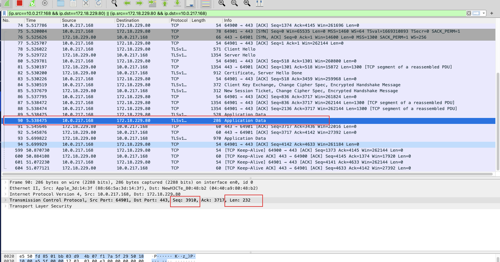
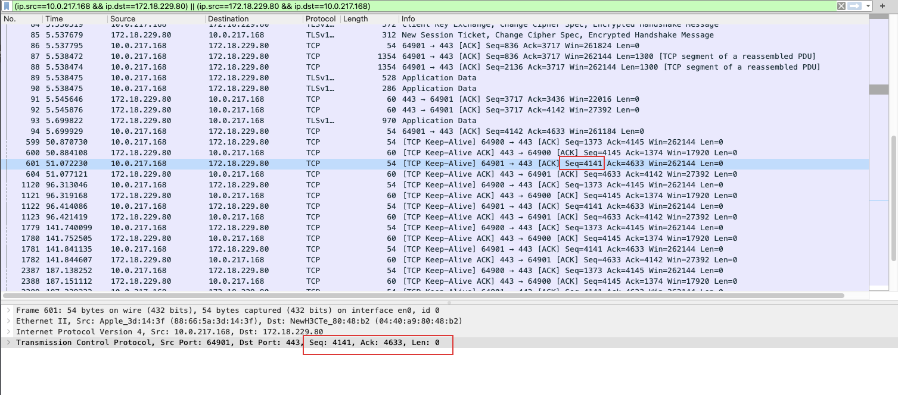

# TCP连接请求过程(含keepalive)

## 使用短连接的方式验证

### 三次握手

* * *

### 数据传输

本次请求：

服务端：
***ack=seq+len***

客户端
***seq=seq+len***
* * *

### 四次挥手

### keepalive保活机制

如图：下次请求的seq应该为3910+232=4142，
但是keepalive保活包的seq=应该的seq-1=4141，如下图所示，
总之保活报文不在窗口控制范围内

