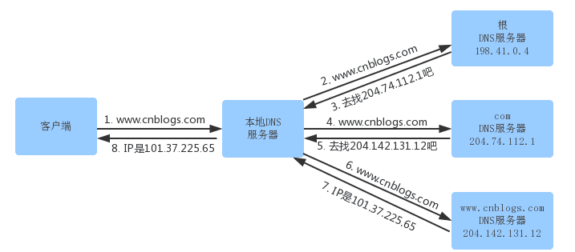

[TOC]

# 从URL到页面显示

## DNS域名解析IP

步骤

- 浏览器搜索自己的DNS缓存（维护一张域名与IP地址对应表）
- 搜索操作系统中的DNS缓存（维护一张域名与IP地址对应表）
- 搜索操作系统的hosts文件（windows环境下，维护一张域名与IP地址对应表）
- 操作系统将域名发送到本地区域服务器（LNDS），进行查找，成功则返回结果，失败则发起一个迭代DNS请求（`迭代查询`）
- 本地域名服务器LDNS迭代先查询根域名服务器->顶级域名服务器->权威域名服务器（通常大公司自己有一个）
- 本地域名服务器LDNS将得到的IP地址返回给操作系统，同时也将IP地址缓存起来
- 操作系统将IP地址返回给浏览器，同时将IP地址缓存起来

淘宝的权威域名服务器

## 操作系统的Socket库

最终：应用程序（浏览器）通过调用 Socket 库，来委托协议栈工作。

## 可靠传输TCP

为了实现可靠性传输，需要考虑很多事情，例如数据的破坏、丢包、重复以及分片顺序混乱等问题。

TCP 是通过序列号、确认应答、重发控制、连接管理以及窗口控制等机制实现可靠性传输的。

## 远程定位IP

这个时候就需要根据**路由表**规则，来判断哪一个网卡作为源地址 IP。

在 Linux 操作系统，我们可以使用 `route -n` 命令查看当前系统的路由表。

举个例子，根据上面的路由表，我们假设 Web 服务器的目标地址是 `192.168.10.200`。

1. 首先先和第一条目的子网掩码（`Genmask`）进行 **与运算**，得到结果为 `192.168.10.0`，但是第一个条目的 `Destination` 是 `192.168.3.0`，两者不一致所以匹配失败。
2. 再与第二条目的子网掩码进行 **与运算**，得到的结果为 `192.168.10.0`，与第二条目的 `Destination 192.168.10.0` 匹配成功，所以将使用 `eth1` 网卡的 IP 地址作为 IP 包头的源地址。

那么假设 Web 服务器的目标地址是 `10.100.20.100`，那么依然依照上面的路由表规则判断，判断后的结果是和第三条目匹配。

**第三条目比较特殊，它目标地址和子网掩码都是 `0.0.0.0`，这表示默认网关，如果其他所有条目都无法匹配，就会自动匹配这一行。并且后续就把包发给路由器，`Gateway` 即是路由器的 IP 地址。**

### 小结

1. 根据**路由表**规则，来判断哪一个网卡作为源地址 IP，并通过该网卡把数据发出去

## 两点传输MAC以及交换机

根据IP协议中的ARP得到MAC地址表

交换机的 MAC 地址表主要包含两个信息：

- 一个是设备的 MAC 地址，
- 另一个是该设备连接在交换机的哪个端口上。

所以，**交换机根据 MAC 地址表查找 MAC 地址，然后将信号发送到相应的端口**。

## 路由器本身也兼具交换机的功能（即具有交换模块的路由器）

路由控制表中记录着网络地址与下一步应该发送至路由器的地址。在主机和路由器上都会有各自的路由器控制表。

在发送 IP 包时，首先要确定 IP 包首部中的目标地址，再从路由控制表中找到与该地址具有**相同网络地址**的记录，根据该记录将 IP 包转发给相应的下一个路由器。如果路由控制表中存在多条相同网络地址的记录，就选择相同位数最多的网络地址，也就是最长匹配。

1. 当转发包时，首先路由器端口会接收发给自己的以太网包，然后**路由表**查询转发目标，再由相应的端口作为发送方将以太网包发送出去。就是路由器收到的数据包有目的 IP 地址，需要转化成从自己的哪个端口出去
2. 知道对方的 IP 地址之后，接下来需要通过 `ARP` 协议根据 IP 地址查询 MAC 地址，并将查询的结果作为接收方 MAC 地址。

首先，我们需要根据**路由表的网关列**判断对方的地址。

- 如果网关是一个 IP 地址，则这个IP 地址就是我们要转发到的目标地址，**还未抵达终点**，还需继续需要路由器转发。
- 如果网关为空，则 IP 头部中的接收方 IP 地址就是要转发到的目标地址，也是就终于找到 IP 包头里的目标地址了，说明**已抵达终点**。

路由器也有 ARP 缓存，因此首先会在 ARP 缓存中查询，如果找不到则发送 ARP 查询请求。

在网络包传输的过程中，**源 IP 和目标 IP 始终是不会变的，一直变化的是 MAC 地址**，因为需要 MAC 地址在以太网内进行**两个设备**之间的包传输。

1. 主机 A 要发送一个 IP 包，其源地址是 `10.1.1.30` 和目标地址是 `10.1.2.10`，由于没有在主机 A 的路由表找到与目标地址 `10.1.2.10` 相同的网络地址，知道对方的 IP 地址之后，接下来需要通过 `ARP` 协议根据 IP 地址查询 MAC 地址，并将查询的结果作为接收方 MAC 地址。于是包被转发到默认路由（路由器 `1` ）
2. 路由器 `1` 收到 IP 包后，也在路由器 `1` 的路由表匹配与目标地址相同的网络地址记录，发现匹配到了，于是就把 IP 数据包转发到了 `10.1.0.2` 这台路由器 `2`，知道对方的 IP 地址之后，接下来需要通过 `ARP` 协议根据 IP 地址查询 MAC 地址，并将查询的结果作为接收方 MAC 地址。于是包被转发到默认路由（路由器 `2` ）
3. 路由器 `2` 收到后，同样对比自身的路由表，发现匹配到了 `10.1.2.10`，接下来需要通过 `ARP` 协议根据 IP 地址查询 MAC 地址，并将查询的结果作为接收方 MAC 地址。于是把 IP 包从路由器 `2` 的 `10.1.2.1` 这个网口出去，最终包转发到了目标主机

## 路由器与交换机的区别与联系

- 因为**路由器**是基于 IP 设计的，俗称**三层**网络设备，路由器的各个端口都具有 MAC 地址和 IP 地址；
- 而**交换机**是基于以太网设计的，俗称**二层**网络设备，交换机的端口不具有 MAC 地址。
- 路由器的端口都具有 MAC 地址，只接收与自身地址匹配的包，遇到不匹配的包则直接丢弃。
- 和网卡不同，**交换机的端口不具有 MAC 地址**；**交换机根据 MAC 地址表查找 MAC 地址，然后将信号发送到相应的端口**。

## 总结

1. 根据DNS域名解析获取IP
2. 利用操作系统的socket将数据发送出去
3. 利用TCP实现可靠性传输
4. 根据本地的路由表，确认发送请求使用的IP
5. 根据本地的交换机MAC地址表，确认使用的MAC地址
6. 到路由器（具有交换模块的路由器）之后，如果是局域网请求，则不走网卡，直接转发请求
7. 到路由器（具有交换模块的路由器）之后，如果是公网请求，则根据路由表获取下一条的IP，然后根据MAC地址表，确认下一条IP的MAC地址
8. 最终到指定IP的机器的网卡，网卡发现MAC地址就是本机的，根据目标IP查询路由表，得到网关为空即找到 IP 包头里的目标地址，利用协议栈处理请求。

## 参考

https://xiaolincoding.com/network/

https://pdai.tech/md/develop/protocol/dev-protocol-url.html

