[TOC]

# Redis笔记

## 数据类型

常见的有五种：**String（字符串），Hash（哈希），List（列表），Set（集合）、Zset（有序集合）**。

随着 Redis 版本的更新，后面又支持了四种数据类型： **BitMap（2.2 版新增）、HyperLogLog（2.8 版新增）、GEO（3.2 版新增）、Stream（5.0 版新增）**。

### String类型

**常用命令：** `set,get,strlen,exists,decr,incr`

**应用场景：**

1.  String 数据类型适合计数场景，比如计算访问次数、点赞、转发、库存数量等等。

2. #### 分布式锁

   ```shell
   SET lock_key unique_value NX PX 10000
   ```

### List类型

**常用命令:** `rpush,lpop,lpush,rpop,lrange,llen` 等。

**应用场景:** 发布与订阅或者说消息队列

### Hash类型

**常用命令：** `hset,hmset,hexists,hget,hgetall,hkeys,hvals` 等。

**应用场景:** 系统中对象数据的存储。购物车等

### Set类型

**常用命令：** `sadd,spop,smembers,sismember,scard,sinterstore,sunion` 等。

**应用场景:** 需要存放的数据不能重复以及需要获取多个数据源交集和并集等场景

### Zset类型

**常用命令：** `zadd,zcard,zscore,zrange,zrevrange,zrem` 等。

**应用场景：** 需要对数据根据某个权重进行排序的场景。比如在直播系统中，实时排行信息包含直播间在线用户列表，各种礼物排行榜，弹幕消息（可以理解为按消息维度的消息排行榜）等信息

## 存储结构

Redis 是使用了一个「哈希表」保存所有键值对，哈希表的最大好处就是让我们可以用 O(1) 的时间复杂度来快速查找到键值对。哈希表其实就是一个数组，数组中的元素叫做哈希桶。

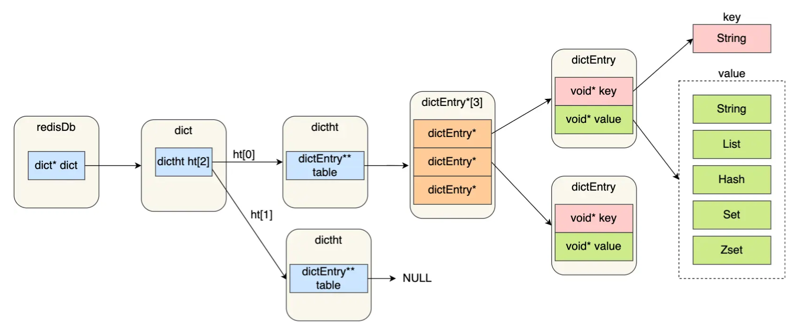


Redis 的哈希桶是怎么保存键值对数据的呢？

哈希桶存放的是指向键值对数据的指针（dictEntry*），这样通过指针就能找到键值对数据，然后因为键值对的值可以保存字符串对象和集合数据类型的对象，所以键值对的数据结构中并不是直接保存值本身，而是保存了 void * key 和 void * value 指针，分别指向了实际的键对象和值对象，这样一来，即使值是集合数据，也可以通过 void * value 指针找到。

- redisDb 结构，表示 Redis 数据库的结构，结构体里存放了指向了 dict 结构的指针；
- dict 结构，结构体里存放了 2 个哈希表，正常情况下都是用「哈希表1」，「哈希表2」只有在 rehash 的时候才用；
- ditctht 结构，表示哈希表的结构，结构里存放了哈希表数组，数组中的每个元素都是指向一个哈希表节点结构（dictEntry）的指针；
- dictEntry 结构，表示哈希表节点的结构，结构里存放了 **void * key 和 void * value 指针， key 指向的是 String 对象，而 \*value 则可以指向 String 对象，也可以指向集合类型的对象，比如 List 对象、Hash 对象、Set 对象和 Zset 对象**。


void * key 和 void * value 指针指向的是 **Redis 对象**，Redis 中的每个对象都由 redisObject 结构表示，如下图：

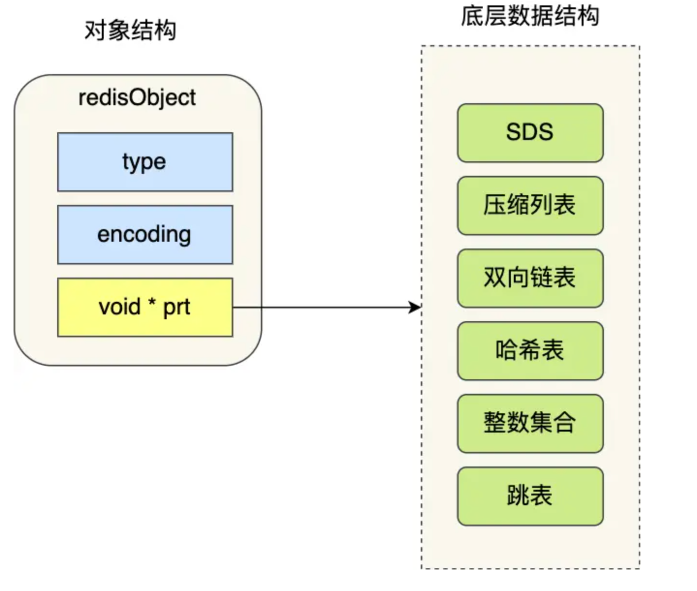


对象结构里包含的成员变量：

- type，标识该对象是什么类型的对象（String 对象、 List 对象、Hash 对象、Set 对象和 Zset 对象）；
- encoding，标识该对象使用了哪种底层的数据结构；
- **ptr，指向底层数据结构的指针**。

### SDS结构

SDS 的数据结构：

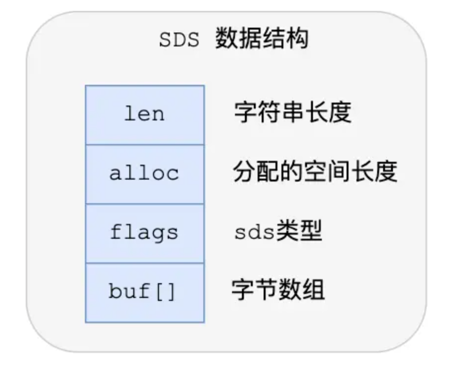


结构中的每个成员变量分别介绍下：

- **len，记录了字符串长度**。这样获取字符串长度的时候，只需要返回这个成员变量值就行，时间复杂度只需要 O（1）。
- **alloc，分配给字符数组的空间长度**。这样在修改字符串的时候，可以通过 `alloc - len` 计算出剩余的空间大小，可以用来判断空间是否满足修改需求，如果不满足的话，就会自动将 SDS 的空间扩展至执行修改所需的大小，然后才执行实际的修改操作，所以使用 SDS 既不需要手动修改 SDS 的空间大小，也不会出现前面所说的缓冲区溢出的问题。
- **flags，用来表示不同类型的 SDS**。一共设计了 5 种类型，分别是 sdshdr5、sdshdr8、sdshdr16、sdshdr32 和 sdshdr64，后面在说明区别之处。
- **buf[]，字符数组，用来保存实际数据**。不仅可以保存字符串，也可以保存二进制数据。

总的来说，Redis 的 SDS 结构在原本字符数组之上，增加了三个元数据：len、alloc、flags，用来解决 C 语言字符串的缺陷

## Redis为什么那么快

总结：纯内存、IO多路复用

Redis 通过**IO 多路复用程序** 来监听来自客户端的大量连接（或者说是监听多个 socket），它会将感兴趣的事件及类型（读、写）注册到内核中并监听每个事件是否发生。

这样的好处非常明显： **I/O 多路复用技术的使用让 Redis 不需要额外创建多余的线程来监听客户端的大量连接，降低了资源的消耗**（和 NIO 中的 `Selector` 组件很像）。

**Redis6.0 引入多线程主要是为了提高网络 IO 读写性能**，因为这个算是 Redis 中的一个性能瓶颈（Redis 的瓶颈主要受限于内存和网络）。

虽然，Redis6.0 引入了多线程，但是 Redis 的多线程只是在网络数据的读写这类耗时操作上使用了，执行命令仍然是单线程顺序执行。因此，你也不需要担心线程安全问题。


## Redis的持久化

Redis 支持持久化，而且支持两种不同的持久化操作。**Redis 的一种持久化方式叫快照（snapshotting，RDB），另一种方式是只追加文件（append-only file, AOF）**

### RDB方式

Redis 提供了两个命令来生成 RDB 文件，分别是 `save` 和 `bgsave`，他们的区别就在于是否在「主线程」里执行：

- 执行了 save 命令，就会在主线程生成 RDB 文件，由于和执行操作命令在同一个线程，所以如果写入 RDB 文件的时间太长，**会阻塞主线程**；
- 执行了 bgsave 命令，会创建一个子进程来生成 RDB 文件，这样可以**避免主线程的阻塞**；

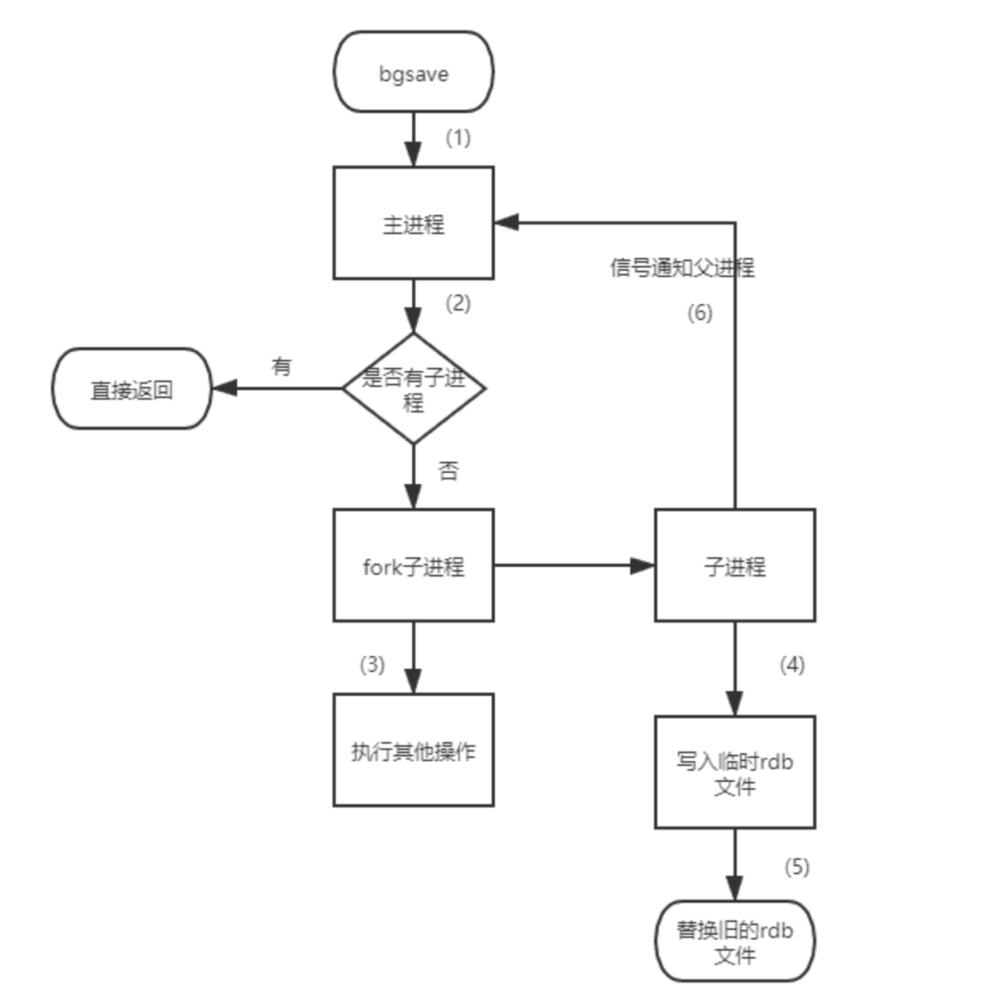

bgsave 快照过程中，如果主线程修改了共享数据，**发生了写时复制后，RDB 快照保存的是原本的内存数据**，而主线程刚修改的数据，是没办法在这一时间写入 RDB 文件的，只能交由下一次的 bgsave 快照。

#### 触发自动时机

- redis.conf中配置`save m n`，即在m秒内有n次修改时，自动触发bgsave生成rdb文件；
- 主从复制时，从节点要从主节点进行全量复制时也会触发bgsave操作，生成当时的快照发送到从节点；
- 执行debug reload命令重新加载redis时也会触发bgsave操作；
- 默认情况下执行shutdown命令时，如果没有开启aof持久化，那么也会触发bgsave操作；

### AOF方式

开启AOF

```java
appendonly yes
```

Redis提供了三种写回策略：

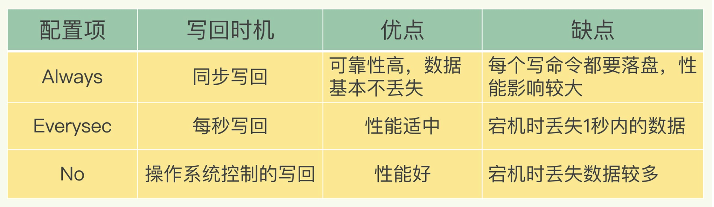

### AOF重写

#### AOF日志重写时机

有两个配置项控制AOF重写的触发：

`auto-aof-rewrite-min-size`:表示运行AOF重写时文件的最小大小，默认为64MB。

`auto-aof-rewrite-percentage`:这个值的计算方式是，当前aof文件大小和上一次重写后aof文件大小的差值，再除以上一次重写后aof文件大小。也就是当前aof文件比上一次重写后aof文件的增量大小，和上一次重写后aof文件大小的比值。

#### 重写日志时，有新数据写入咋整

重写过程总结为：“一个拷贝，两处日志”。在fork出子进程时的拷贝，以及在重写时，如果有新数据写入，主线程就会将命令记录到两个aof日志内存缓冲区中。如果AOF写回策略配置的是always，则直接将命令写回旧的日志文件，并且保存一份命令至AOF重写缓冲区，这些操作对新的日志文件是不存在影响的。（旧的日志文件：主线程使用的日志文件，新的日志文件：bgrewriteaof进程使用的日志文件）

而在bgrewriteaof子进程完成会日志文件的重写操作后，会提示主线程已经完成重写操作，主线程会将AOF重写缓冲中的命令追加到新的日志文件后面。这时候在高并发的情况下，AOF重写缓冲区积累可能会很大，这样就会造成阻塞，Redis后来通过Linux管道技术让aof重写期间就能同时进行回放，这样aof重写结束后只需回放少量剩余的数据即可。

最后通过修改文件名的方式，保证文件切换的原子性。

在AOF重写日志期间发生宕机的话，因为日志文件还没切换，所以恢复数据时，用的还是旧的日志文件。

#### 小结

- 主线程fork出子进程重写aof日志，执行客户端发来的命令；将执行后的写命令追加到 「AOF 缓冲区」；将执行后的写命令追加到 「AOF 重写缓冲区」；
- 将 AOF 重写缓冲区中的所有内容追加到新的 AOF 的文件中，使得新旧两个 AOF 文件所保存的数据库状态一致；
- 新的 AOF 的文件进行改名，覆盖现有的 AOF 文件。

### RDB和AOF混合方式（4.0版本才有)

#### 开启

如果想要开启混合持久化功能，可以在 Redis 配置文件将下面这个配置项设置成 yes：

```text
aof-use-rdb-preamble yes
```

这个方法既能享受到 RDB 文件快速恢复的好处，又能享受到 AOF 只记录操作命令的简单优势, 实际环境中用的很多。

当开启了混合持久化时，在 AOF 重写日志时，`fork` 出来的重写子进程会先将与主线程共享的内存数据以 RDB 方式写入到 AOF 文件，然后主线程处理的操作命令会被记录在重写缓冲区里，重写缓冲区里的增量命令会以 AOF 方式写入到 AOF 文件，写入完成后通知主进程将新的含有 RDB 格式和 AOF 格式的 AOF 文件替换旧的的 AOF 文件。

也就是说，使用了混合持久化，AOF 文件的**前半部分是 RDB 格式的全量数据，后半部分是 AOF 格式的增量数据**。

### 数据恢复

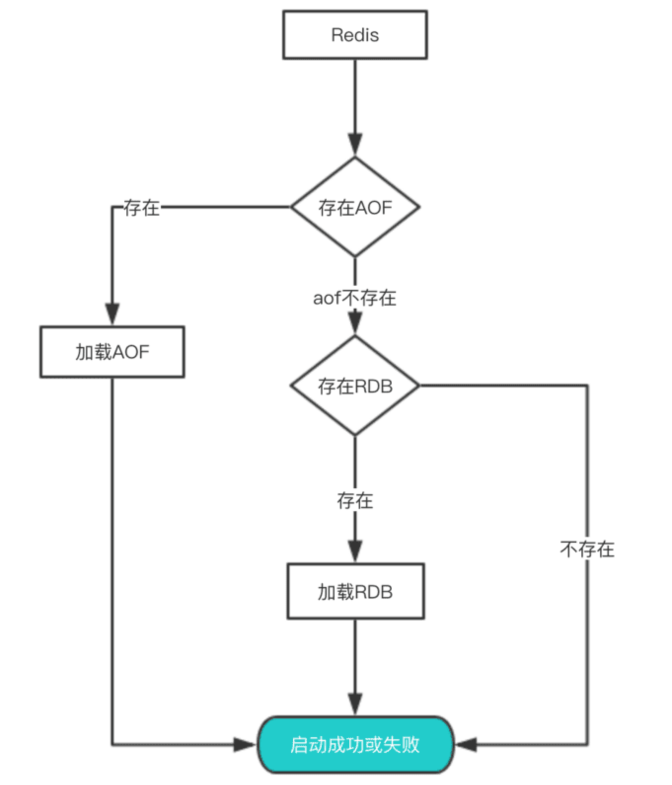


## 过期删除策略

**Redis 选择「惰性删除+定期删除」这两种策略配和使用**

1. **惰性删除** ：只会在取出 key 的时候才对数据进行过期检查。这样对 CPU 最友好，但是可能会造成太多过期 key 没有被删除。
2. **定期删除** ： 每隔一段时间抽取一批 key 执行删除过期 key 操作。并且，Redis 底层会通过限制删除操作执行的时长和频率来减少删除操作对 CPU 时间的影响。

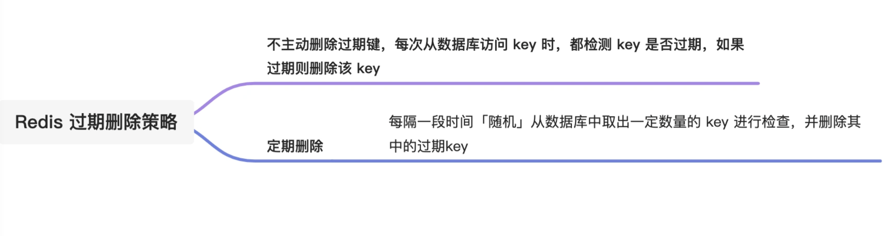

## 内存淘汰策略

*1、不进行数据淘汰的策略*

**noeviction**（Redis3.0之后，默认的内存淘汰策略） ：它表示当运行内存超过最大设置内存时，不淘汰任何数据，这时如果有新的数据写入，则会触发 OOM，但是如果没用数据写入的话，只是单纯的查询或者删除操作的话，还是可以正常工作。

*2、进行数据淘汰的策略*

针对「进行数据淘汰」这一类策略，又可以细分为「在设置了过期时间的数据中进行淘汰」和「在所有数据范围内进行淘汰」这两类策略。

在设置了过期时间的数据中进行淘汰：

- **volatile-random**：随机淘汰设置了过期时间的任意键值；
- **volatile-ttl**：优先淘汰更早过期的键值。
- **volatile-lru**（Redis3.0 之前，默认的内存淘汰策略）：淘汰所有设置了过期时间的键值中，最久未使用的键值；
- **volatile-lfu**（Redis 4.0 后新增的内存淘汰策略）：淘汰所有设置了过期时间的键值中，最少使用的键值；

在所有数据范围内进行淘汰：

- **allkeys-random**：随机淘汰任意键值;
- **allkeys-lru**：淘汰整个键值中最久未使用的键值；
- **allkeys-lfu**（Redis 4.0 后新增的内存淘汰策略）：淘汰整个键值中最少使用的键值。


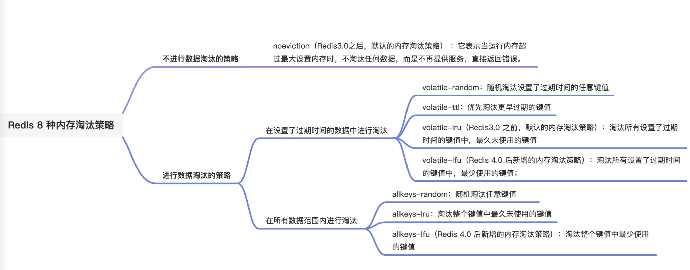


## 主从复制

- `全量（同步）复制`：比如第一次同步时，或者一个从库如果和主库断连时间过长，造成它在主库repl_backlog_buffer的slave_repl_offset位置上的数据已经被覆盖掉了，此时从库和主库间将进行全量复制。
- `增量（同步）复制`：只会把主从库网络断连期间主库收到的命令，同步给从库


### 全量复制

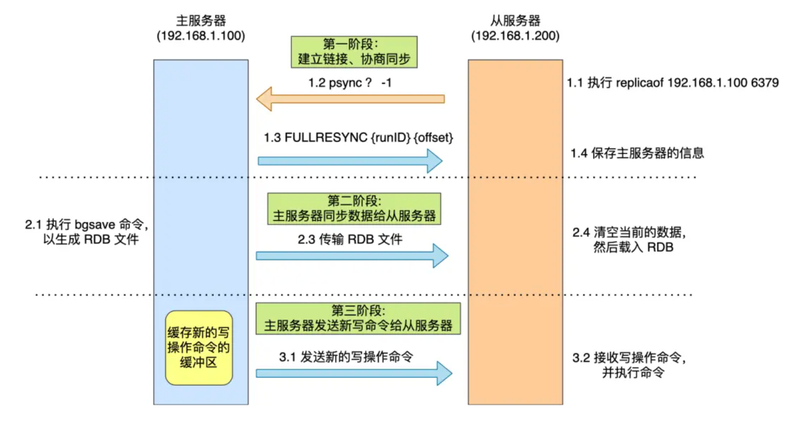

###  增量复制

**主服务器怎么知道要将哪些增量数据发送给从服务器呢？**

答案藏在这两个东西里：

- **repl_backlog_buffer**，是一个「**环形**」缓冲区，用于主从服务器断连后，从中找到差异的数据； 缓行缓冲区的默认大小是 1M，并且由于它是一个环形缓冲区，所以当缓冲区写满后，主服务器继续写入的话，就会覆盖之前的数据。因此，当主服务器的写入速度远超于从服务器的读取速度，缓冲区的数据一下就会被覆盖。
- **replication offset**，标记上面那个缓冲区的同步进度，主从服务器都有各自的偏移量，主服务器使用 master_repl_offset 来记录自己「*写*」到的位置，从服务器使用 slave_repl_offset 来记录自己「*读*」到的位置。

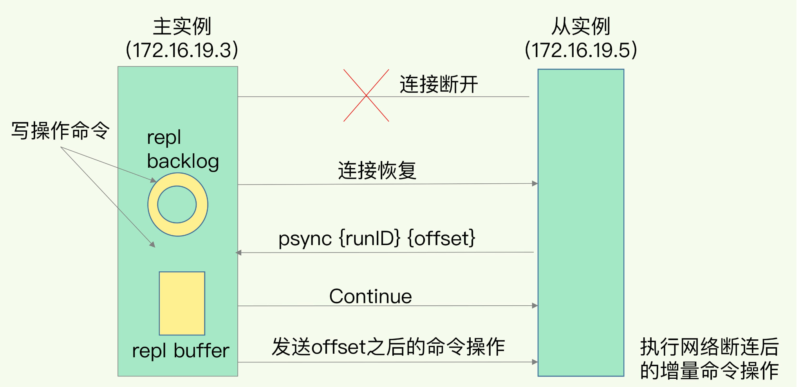


### 小结

主从复制共有三种模式：**全量复制、基于长连接的命令传播、增量复制**。

主从服务器第一次同步的时候，就是采用全量复制，此时主服务器会两个耗时的地方，分别是生成 RDB 文件和传输 RDB 文件。为了避免过多的从服务器和主服务器进行全量复制，可以把一部分从服务器升级为「经理角色」，让它也有自己的从服务器，通过这样可以分摊主服务器的压力。

第一次同步完成后，主从服务器都会维护着一个长连接，主服务器在接收到写操作命令后，就会通过这个连接将写命令传播给从服务器，来保证主从服务器的数据一致性。

如果遇到网络断开，增量复制就可以上场了，不过这个还跟 repl_backlog_size 这个大小有关系。

如果它配置的过小，主从服务器网络恢复时，可能发生「从服务器」想读的数据已经被覆盖了，那么这时就会导致主服务器采用全量复制的方式。所以为了避免这种情况的频繁发生，要调大这个参数的值，以降低主从服务器断开后全量同步的概率

## Redis 哨兵机制

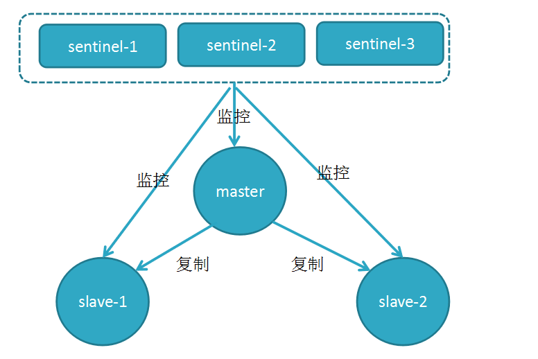


### Sentinel的选举流程

Sentinel集群正常运行的时候每个节点epoch相同，当需要故障转移的时候会在集群中选出Leader执行故障转移操作。Sentinel采用了Raft协议实现了Sentinel间选举Leader的算法，不过也不完全跟论文描述的步骤一致。Sentinel集群运行过程中故障转移完成，所有Sentinel又会恢复平等。Leader仅仅是故障转移操作出现的角色。

- 任何一个想成为 Leader 的哨兵，要满足两个条件
  - 第一，拿到半数以上的赞成票；
  - 第二，拿到的票数同时还需要大于等于哨兵配置文件中的 quorum 值。

Redis 1 主 4 从，5 个哨兵 ，quorum 设置为 3，如果 2 个哨兵故障，当主节点宕机时，哨兵能否判断主节点“客观下线”？主从能否自动切换？

- **哨兵集群可以判定主节点“客观下线”**。哨兵集群还剩下 3 个哨兵，当一个哨兵判断主节点“主观下线”后，询问另外 2 个哨兵后，有可能能拿到 3 张赞同票，这时就达到了 quorum 的值，因此，哨兵集群可以判定主节点为“客观下线”。
- **哨兵集群可以完成主从切换**。当有个哨兵标记主节点为「客观下线」后，就会进行选举 Leader 的过程，因为此时哨兵集群还剩下 3 个哨兵，那么还是可以拿到半数以上（5/2+1=3）的票，而且也达到了 quorum 值，满足了选举 Leader 的两个条件， 所以就能选举成功，因此哨兵集群可以完成主从切换。

所以，**quorum 的值建议设置为哨兵个数的二分之一加1**，例如 3 个哨兵就设置 2，5 个哨兵设置为 3，而且**哨兵节点的数量应该是奇数**。

### 故障转移

选举出了哨兵 leader 后，就可以进行主从故障转移的过程了。该操作包含以下四个步骤：

- 第一步：在已下线主节点（旧主节点）属下的所有「从节点」里面，挑选出一个从节点，并将其转换为主节点，选择的规则：
  - 过滤掉已经离线的从节点；
  - 过滤掉历史网络连接状态不好的从节点；
  - 将剩下的从节点，进行三轮考察：优先级、复制进度、ID 号。在每一轮考察过程中，如果找到了一个胜出的从节点，就将其作为新主节点。
- 第二步：让已下线主节点属下的所有「从节点」修改复制目标，修改为复制「新主节点」；
- 第三步：将新主节点的 IP 地址和信息，通过「发布者/订阅者机制」通知给客户端；
- 第四步：继续监视旧主节点，当这个旧主节点重新上线时，将它设置为新主节点的从节点；


### 小结

*1、第一轮投票：判断主节点下线*

当哨兵集群中的某个哨兵判定主节点下线（主观下线）后，就会向其他哨兵发起命令，其他哨兵收到这个命令后，就会根据自身和主节点的网络状况，做出赞成投票或者拒绝投票的响应。当这个哨兵的赞同票数达到哨兵配置文件中的 quorum 配置项设定的值后，这时主节点就会被该哨兵标记为「客观下线」。

*2、第二轮投票：选出哨兵leader*

某个哨兵判定主节点客观下线后，该哨兵就会发起投票，告诉其他哨兵，它想成为 leader，想成为 leader 的哨兵节点，要满足两个条件：

- 第一，拿到半数以上的赞成票；
- 第二，拿到的票数同时还需要大于等于哨兵配置文件中的 quorum 值。

*3、由哨兵 leader 进行主从故障转移*

## 基于Codis的集群方案

Codis 是由豌豆荚开源的产品，涉及组件众多，其中 ZooKeeper 存放路由表和代理节点元数据、分发 Codis-Config 的命令；Codis-Config 是集成管理工具，有 Web 界面供使用；Codis-Proxy 是一个兼容 Redis 协议的无状态代理；Codis-Redis 基于 Redis 2.8 版本二次开发，加入 slot 支持，方便迁移数据。

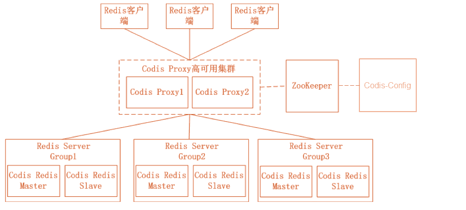

公司使用的

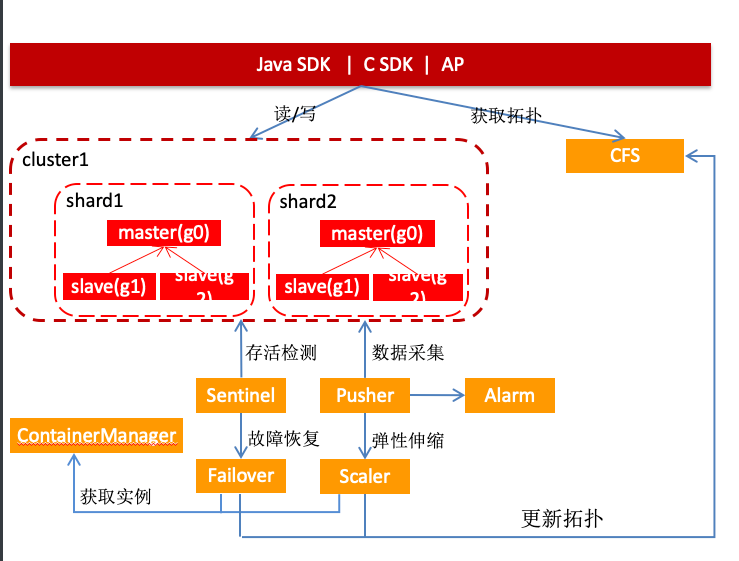

不同的是分片的计算逻辑不同，公司的分片的计算逻辑在客户端，codis的在代理层

## 参考

https://xiaolincoding.com/redis

https://pdai.tech/md/db/nosql-redis/db-redis-overview.html
