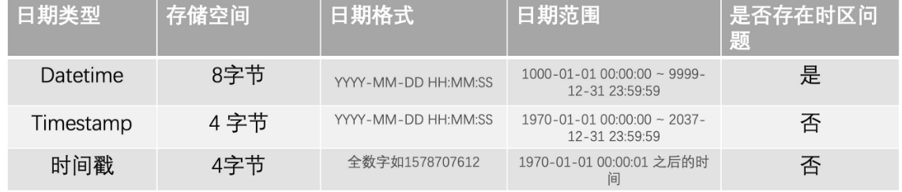

# Mysql小的知识点

[TOC]

## 时间类型存储

#### 小结

1. 不使用字符串进行存储；
2. MySQL 中时间到底怎么存储才好？Datetime?Timestamp? 数值保存的时间戳？《高性能 MySQL 》这本神书的作者就是推荐 Timestamp，原因是数值表示时间不够直观

## Mysql的锁

MySQL 里面表级别的锁有这几种：

- 表锁；表锁除了会限制别的线程的读写操作
- 元数据锁（MDL）;
- 意向锁；在使用 InnoDB 引擎的表里对某些记录加上「共享锁」之前，需要先在表级别加上一个「意向共享锁」；对某些纪录加上「独占锁」之前，需要先在表级别加上一个「意向独占锁」；
- AUTO-INC 锁；

行级锁的类型主要有三类：

- Record Lock，记录锁，也就是仅仅把一条记录锁上；
- Gap Lock，间隙锁，锁定一个范围，但是不包含记录本身；
- Next-Key Lock：Record Lock + Gap Lock 的组合，锁定一个范围，并且锁定记录本身

### update操作会锁全表

当我们要执行 update 语句的时候，确保 where 条件中带上了索引列，并且在测试机确认该语句是否走的是索引扫描，防止因为扫描全表，而对表中的所有记录加上锁。

我们可以打开 MySQL sql_safe_updates 参数，这样可以预防 update 操作时 where 条件没有带上索引列。

如果发现即使在 where 条件中带上了列索引列，优化器走的还是全标扫描，这时我们就要使用 `force index([index_name])` 可以告诉优化器使用哪个索引。

### 参考

https://snailclimb.gitee.io/javaguide/#/./docs/database/mysql/some-thoughts-on-database-storage-time