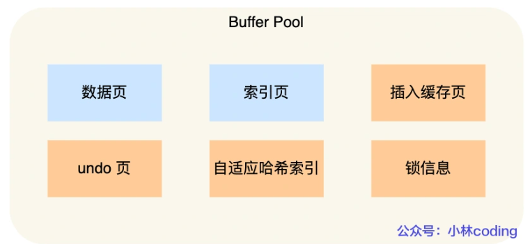

## Mysql的Buffer Pool

InnoDB 会把存储的数据划分为若干个「页」，以页作为磁盘和内存交互的基本单位，一个页的默认大小为 16KB。因此，Buffer Pool 同样需要按「页」来划分。

在 MySQL 启动的时候，**InnoDB 会为 Buffer Pool 申请一片连续的内存空间，然后按照默认的`16KB`的大小划分出一个个的页， Buffer Pool 中的页就叫做缓存页**。此时这些缓存页都是空闲的，之后随着程序的运行，才会有磁盘上的页被缓存到 Buffer Pool 中。

所以，MySQL 刚启动的时候，你会观察到使用的虚拟内存空间很大，而使用到的物理内存空间却很小，这是因为只有这些虚拟内存被访问后，操作系统才会触发缺页中断，申请物理内存，接着将虚拟地址和物理地址建立映射关系。

Buffer Pool 除了缓存「索引页」和「数据页」，还包括了 Undo 页，插入缓存、自适应哈希索引、锁信息等等。

### 参考

https://xiaolincoding.com/mysql/