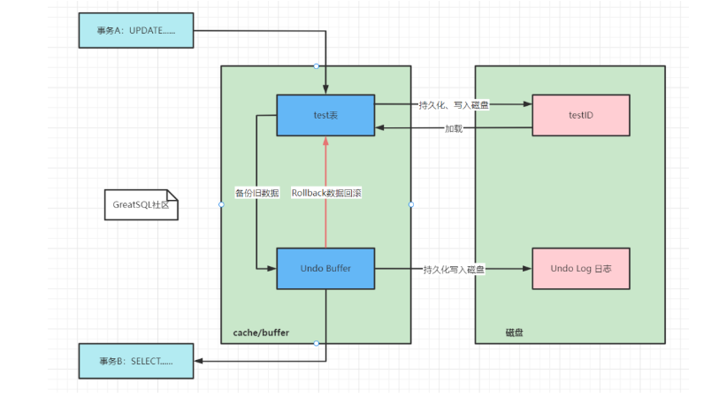
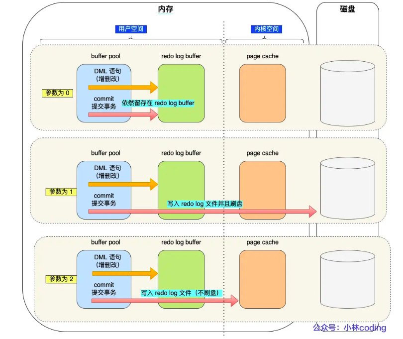
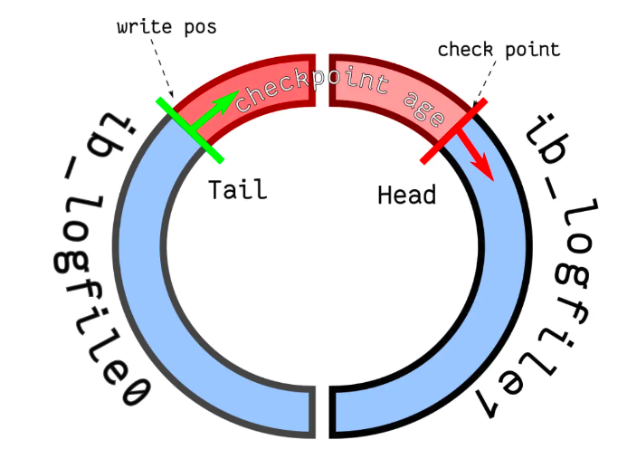
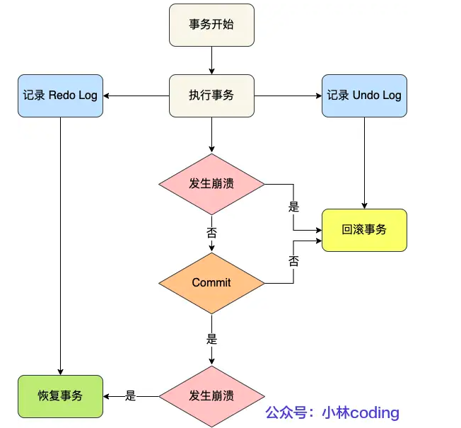
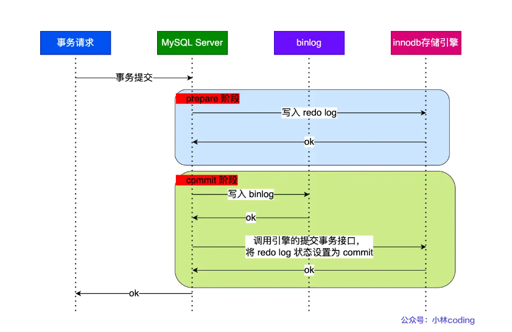

[TOC]

## Mysql的日志

## Undo Log

### 作用

Undo Log 被称为撤销日志、回滚日志。

Undo Log 的作用 / 功能：

- **事务回滚**：可以对提前写入的数据变动进行擦除，实现事务回滚，保证事务的原子性。
- **实现 MVCC 机制**：Undo Log 也用于实现 MVCC 机制，存储记录的多个版本的 Undo Log，形成版本链。
- Undo Log 中存储了回滚需要的数据。在事务回滚或者崩溃恢复时，根据 Undo Log 中的信息对已经写入到磁盘中的数据变动进行擦除。

### 数据组织形式

MySQL中的Undo Log严格的讲不是Log，而是数据，因此他的管理和落盘都跟数据是一样的：

- Undo的磁盘结构并不是顺序的，而是像数据一样按Page管理
- Undo写入时，也像数据一样产生对应的Redo Log
- Undo的Page也像数据一样缓存在Buffer Pool中，跟数据Page一起做LRU换入换出，以及刷脏。Undo Page的刷脏也像数据一样要等到对应的Redo Log 落盘之后

之所以这样实现，首要的原因是MySQL中的Undo Log不只是承担故障恢复时保证原子性的作用，更需要承担MVCC对历史版本的管理的作用，设计目标是高事务并发，方便的管理和维护。因此当做数据更合适。

但既然还叫Log，就还是需要有Undo Log的责任，那就是保证故障恢复时，如果看到数据的修改，一定要能看到其对应Undo的修改，这样才有机会通过事务的回滚保证原子性。标准的Undo Log这一步是靠WAL实现的，也就是要求Undo写入先于数据落盘。而InnoDB中Undo Log作为一种特殊的数据，这一步是通过redo的min-transaction保证的，简单的说就是数据的修改和对应的Undo修改，他们所对应的redo log被放到同一个min-transaction中，同一个min-transaction中的所有redo log在故障恢复时以一个整体进行重放，要么全部重放，要么全部回滚（利用undo log）。

### 工作原理

在更新数据之前，MySQL会提前生成Undo Log日志，当事务提交的时候，并不会立即删除Undo Log，因为后面可能需要进行回滚操作，要执行回滚（ROLLBACK）操作时，从缓存中读取数据。Undo Log日志的删除是通过通过后台purge（清洗）线程进行回收处理的。

- 事务A执行UPDATE操作，此时事务还没提交，会将数据进行备份到对应的Undo的 Buffer Pool，然后由Undo的 Buffer Pool持久化到磁盘中的Undo Log文件（时机计入到redo log）中，此时Undo Log保存了未提交之前的操作日志，接着将操作的数据，也就是test表的数据持久保存到InnoDB的数据文件IBD。
- 此时事务B进行查询操作，直接从Undo的 Buffer Pool缓存中进行读取，这时事务A还没提交事务，如果要回滚（ROLLBACK）事务，是不读磁盘的，先直接从Undo Buffer缓存读取。

### 在事务中的流程

事务在undo log segment分配也写入undo log的同时也会产生redo log,当事务提交时候(commit)
1.将undo log 放入列表中,以供之后的purge(pai rui chi)线程使用
2.判断undo log 所在的页是否可以重用,若可以分配给下个事务使用
3.事务提交后,不能马上删除undo log及undo log所在的页,这是因为还有其他事务需要通过undo log来得到行记录之前的版本,故事务提交将undo log 放入一个链表中,是否可以最终删除undo log及undo log所在页由purge线程来判断

当事务提交时候,首先将undo log放入链表中,判断undo页的使用空间是否小于3/4,则表示undo log可以被重用,之后新的undo log 记录在当前的undo log的后面,由于存放undo log的列表是以记录进行组织的,二undo log可能存放着不同事务的undo log,因此prege操作需要设计磁盘的离散读取操作,是一个比较缓慢的过程,此过程可以设置purge线程的个数来提升回收速度

## innodb的mini-transaction

mini-transaction和我们理解的数据库事务不是一个东西。从一致性来讲，数据库事务是保证多条语句操作的一致性，往往涉及到多个页的修改。而mini-transaction是单页数据一致性，是避免内存页的并发更新影响。当然数据库事务一致性实现也是建立在mini-transaction的基础上的。

所有对页的操作都要在mini_transaction中执行。

在一个mini-transaction操作中，需要对对应的page加锁。锁中代码逻辑主要就是操作页，然后生成redo和undo log，完成之后释放锁。

## “Write-Ahead Log”日志方案

**WAL 技术指的是， MySQL 的写操作并不是立刻写到磁盘上，而是先写日志，然后在合适的时间再写到磁盘上**。

“Write-Ahead Log”在崩溃恢复时，会经历以下三个阶段：

- **分析阶段（Analysis）**：该阶段从最后一次检查点（Checkpoint，可理解为在这个点之前所有应该持久化的变动都已安全落盘）开始扫描日志，找出所有没有 End Record 的事务，组成待恢复的事务集合（一般包括 Transaction Table 和 Dirty Page Table）。
- **重做阶段（Redo）**：该阶段依据分析阶段中，产生的待恢复的事务集合来重演历史（Repeat History），找出所有包含 Commit Record 的日志，将它们写入磁盘，写入完成后增加一条 End Record，然后移除出待恢复事务集合。
- **回滚阶段（Undo）**：该阶段处理经过分析、重做阶段后剩余的待恢复事务集合，此时剩下的都是需要回滚的事务（被称为 Loser），根据 Undo Log 中的信息回滚这些事务（可能数据已经刷到磁盘，所以需要回滚磁盘中数据）。

## Redo 日志

`redo log`（重做日志）是`InnoDB`存储引擎独有的，它让`MySQL`拥有了崩溃恢复能力。

比如 `MySQL` 实例挂了或宕机了，重启时，`InnoDB`存储引擎会使用`redo log`恢复数据，保证数据的持久性与完整性。

### Redo log的刷盘时机

下面几个时机：

- MySQL 正常关闭时；
- 当 redo log buffer 中记录的写入量大于 redo log buffer 内存空间的一半时，会触发落盘；
- InnoDB 的后台线程每隔 1 秒，将 redo log buffer 持久化到磁盘。
- 每次事务提交时都将缓存在 redo log buffer 里的 redo log 直接持久化到磁盘（这个策略可由 innodb_flush_log_at_trx_commit 参数控制）

参数 `innodb_flush_log_at_trx_commit` 参数控制，可取的值有：0、1、2，默认值为 1，这三个值分别代表的策略如下：

- 当设置该**参数为 0 时**，表示每次事务提交时 ，还是**将 redo log 留在 redo log buffer 中** ，该模式下在事务提交时不会主动触发写入磁盘的操作。
- 当设置该**参数为 1 时**，表示每次事务提交时，都**将缓存在 redo log buffer 里的 redo log 直接持久化到磁盘**，这样可以保证 MySQL 异常重启之后数据不会丢失。
- 当设置该**参数为 2 时**，表示每次事务提交时，都只是缓存在 redo log buffer 里的 redo log **写到 redo log 文件，注意写入到「 redo log 文件」并不意味着写入到了磁盘**，因为操作系统的文件系统中有个 Page Cache

### Redo log文件写满

默认情况下， InnoDB 存储引擎有 1 个重做日志文件组( redo log Group），「重做日志文件组」由有 2 个 redo log 文件组成，这两个 redo 日志的文件名叫 ：`ib_logfile0` 和 `ib_logfile1`

重做日志文件组是以**循环写**的方式工作的，从头开始写，写到末尾就又回到开头，相当于一个环形。InnoDB 用 write pos 表示 redo log 当前记录写到的位置，用 checkpoint 表示当前要擦除的位置，如下图：

如果 write pos 追上了 checkpoint，就意味着 **redo log 文件满了，这时 MySQL 不能再执行新的更新操作，也就是说 MySQL 会被阻塞**（*因此所以针对并发量大的系统，适当设置 redo log 的文件大小非常重要*），此时**会停下来将 Buffer Pool 中的脏页刷新到磁盘中，然后标记 redo log 哪些记录可以被擦除，接着对旧的 redo log 记录进行擦除，等擦除完旧记录腾出了空间，checkpoint 就会往后移动（图中顺时针）**，然后 MySQL 恢复正常运行，继续执行新的更新操作。

## Undo 与 Redo日志

undo log 和 redo log 这两个日志都是 Innodb 存储引擎生成的。

它们的区别在于：

- redo log 记录了此次事务「**完成后**」的数据状态，记录的是更新**之后**的值；
- undo log 记录了此次事务「**开始前**」的数据状态，记录的是更新**之前**的值；

事务提交之前发生了崩溃，重启后会通过 undo log 回滚事务，事务提交之后发生了崩溃，重启后会通过 redo log 恢复事务，如下图：

所以有了 redo log，再通过 WAL 技术，InnoDB 就可以保证即使数据库发生异常重启，之前已提交的记录都不会丢失，这个能力称为 **crash-safe**（崩溃恢复）。可以看出来， **redo log 保证了事务四大特性中的持久性**。

## Binlog日志

### 刷盘时机

MySQL提供一个 sync_binlog 参数来控制数据库的 binlog 刷到磁盘上的频率：

- sync_binlog = 0 的时候，表示每次提交事务都只 write，不 fsync，后续交由操作系统决定何时将数据持久化到磁盘；
- sync_binlog = 1 的时候，表示每次提交事务都会 write，然后马上执行 fsync；
- sync_binlog =N(N>1) 的时候，表示每次提交事务都 write，但累积 N 个事务后才 fsync。

线上通常使用sync_binlog 设置为 1，当 sync_binlog 设置为 1 的时候，是最安全就是对写入性能影响太大。

## 两阶段提交

**MySQL 为了避免出现两份日志之间的逻辑不一致的问题，使用了「两阶段提交」来解决**，两阶段提交其实是分布式事务一致性协议，它可以保证多个逻辑操作要不全部成功，要不全部失败，不会出现半成功的状态。

在 MySQL 的 InnoDB 存储引擎中，开启 binlog 的情况下，MySQL 会同时维护 binlog 日志与 InnoDB 的 redo log，为了保证这两个日志的一致性，MySQL 使用了**内部 XA 事务**，内部 XA 事务由 binlog 作为协调者，存储引擎是参与者。

## Redo log 和 Binlog 

两个日志有四个区别。

*1、适用对象不同：*

- binlog 是 MySQL 的 Server 层实现的日志，所有存储引擎都可以使用；
- redo log 是 Innodb 存储引擎实现的日志；

*2、文件格式不同：*

- binlog 有 3 种格式类型，分别是 STATEMENT（默认格式）、ROW、 MIXED，区别如下：
  - STATEMENT：每一条修改数据的 SQL 都会被记录到 binlog 中（相当于记录了逻辑操作，所以针对这种格式， binlog 可以称为逻辑日志），主从复制中 slave 端再根据 SQL 语句重现。但 STATEMENT 有动态函数的问题，比如你用了 uuid 或者 now 这些函数，你在主库上执行的结果并不是你在从库执行的结果，这种随时在变的函数会导致复制的数据不一致；
  - ROW：记录行数据最终被修改成什么样了（这种格式的日志，就不能称为逻辑日志了），不会出现 STATEMENT 下动态函数的问题。但 ROW 的缺点是每行数据的变化结果都会被记录，比如执行批量 update 语句，更新多少行数据就会产生多少条记录，使 binlog 文件过大，而在 STATEMENT 格式下只会记录一个 update 语句而已；
  - MIXED：包含了 STATEMENT 和 ROW 模式，它会根据不同的情况自动使用 ROW 模式和 STATEMENT 模式；
- redo log 是物理日志，记录的是在某个数据页做了什么修改，比如对 XXX 表空间中的 YYY 数据页 ZZZ 偏移量的地方做了AAA 更新；

*3、写入方式不同：*

- binlog 是追加写，写满一个文件，就创建一个新的文件继续写，不会覆盖以前的日志，保存的是全量的日志。
- redo log 是循环写，日志空间大小是固定，全部写满就从头开始，保存未被刷入磁盘的脏页日志。

*4、用途不同：*

- binlog 用于备份恢复、主从复制；
- redo log 用于掉电等故障恢复。

## Sql语句执行

具体更新一条记录 `UPDATE t_user SET name = 'xiaolin' WHERE id = 1;` 的流程如下:

1. 执行器负责具体执行，会调用存储引擎的接口，通过主键索引树搜索获取 id = 1 这一行记录：
   - 如果 id=1 这一行所在的数据页本来就在 buffer pool 中，就直接返回给执行器更新；
   - 如果记录不在 buffer pool，将数据页从磁盘读入到 buffer pool，返回记录给执行器。
2. 执行器得到聚簇索引记录后，会看一下更新前的记录和更新后的记录是否一样：
   - 如果一样的话就不进行后续更新流程；
   - 如果不一样的话就把更新前的记录和更新后的记录都当作参数传给 InnoDB 层，让 InnoDB 真正的执行更新记录的操作；
3. 开启事务， InnoDB 层更新记录前，首先要记录相应的 undo log，因为这是更新操作，需要把被更新的列的旧值记下来，也就是要生成一条 undo log，undo log 会写入 Buffer Pool 中的 Undo 页面，不过在内存修改该 Undo 页面后，需要记录对应的 redo log。
4. InnoDB 层开始更新记录，会先更新内存（同时标记为脏页），然后将记录写到 redo log 里面，这个时候更新就算完成了。为了减少磁盘I/O，不会立即将脏页写入磁盘，后续由后台线程选择一个合适的时机将脏页写入到磁盘。这就是 **WAL 技术**，MySQL 的写操作并不是立刻写到磁盘上，而是先写 redo 日志，然后在合适的时间再将修改的行数据写到磁盘上。
5. 至此，一条记录更新完了。
6. 在一条更新语句执行完成后，然后开始记录该语句对应的 binlog，此时记录的 binlog 会被保存到 binlog cache，并没有刷新到硬盘上的 binlog 文件，在事务提交时才会统一将该事务运行过程中的所有 binlog 刷新到硬盘。
7. 事务提交
   - **prepare 阶段**：将 redo log 对应的事务状态设置为 prepare，然后将 redo log 刷新到硬盘；
   - **commit 阶段**：将 binlog 刷新到磁盘，接着调用引擎的提交事务接口，将 redo log 状态设置为 commit（将事务设置为 commit 状态后，刷入到磁盘 redo log 文件）；
8. 至此，一条更新语句执行完成。

## 参考

https://xiaolincoding.com/mysql/

https://www.zhihu.com/question/267595935/answer/2204949497

https://juejin.cn/post/7023574554899382279

https://www.51cto.com/article/720454.html

https://blog.csdn.net/qq_39787367/article/details/103168445

https://javaguide.cn/database/mysql/mysql-logs.html