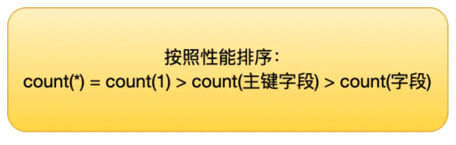

[TOC]

# Mysql索引

## 采用B+树作为索引的数据结构

- B+ 树的非叶子节点不存放实际的记录数据，仅存放索引，因此数据量相同的情况下，相比存储即存索引又存记录的 B 树，B+树的非叶子节点可以存放更多的索引，因此 B+ 树可以比 B 树更「矮胖」，查询底层节点的磁盘 I/O次数会更少。
- B+ 树有大量的冗余节点（所有非叶子节点都是冗余索引），这些冗余索引让 B+ 树在插入、删除的效率都更高，比如删除根节点的时候，不会像 B 树那样会发生复杂的树的变化；
- B+ 树叶子节点之间用链表连接了起来，有利于范围查询，而 B 树要实现范围查询，因此只能通过树的遍历来完成范围查询，这会涉及多个节点的磁盘 I/O 操作，范围查询效率不如 B+ 树。

## 聚簇索引和二级索引

索引又可以分成聚簇索引和非聚簇索引（二级索引），它们区别就在于叶子节点存放的是什么数据：

- 聚簇索引的叶子节点存放的是实际数据，所有完整的用户记录都存放在聚簇索引的叶子节点；**即索引结构和数据一起存放的索引。**
- 二级索引的叶子节点存放的是主键值，而不是实际数据。

InnoDB 在创建聚簇索引时，会根据不同的场景选择不同的列作为索引：

- 如果有主键，默认会使用主键作为聚簇索引的索引键；
- 如果没有主键，就选择第一个不包含 NULL 值的唯一列作为聚簇索引的索引键；
- 在上面两个都没有的情况下，InnoDB 将自动生成一个隐式自增 id 列作为聚簇索引的索引键；

### 单表数据不超过2000万

- 单表数据库到达某个量级的上限时，导致内存无法存储其索引，使得之后的 SQL 查询会产生磁盘 IO，从而导致性能下降，所以增加硬件配置（比如把内存当磁盘使），可能会带来立竿见影的性能提升
- 索引结构不会影响单表最大行数，2000W 也只是推荐值，超过了这个值可能会导致 B + 树层级更高，影响查询性能。

## 索引失效

发生索引失效的情况：

- 当我们使用左或者左右模糊匹配的时候，也就是 `like %xx` 或者 `like %xx%`这两种方式都会造成索引失效；
- 当我们在查询条件中对索引列使用函数，就会导致索引失效。
- 当我们在查询条件中对索引列进行表达式计算，也是无法走索引的。
- MySQL 在遇到字符串和数字比较的时候。如果字符串是索引列，而条件语句中的输入参数是数字的话，那么索引列会发生隐式类型转换，由于隐式类型转换是通过 CAST 函数实现的，等同于对索引列使用了函数，所以就会导致索引失效。
- 联合索引要能正确使用需要遵循最左匹配原则，也就是按照最左优先的方式进行索引的匹配，否则就会导致索引失效。
- 在 WHERE 子句中，如果在 OR 前的条件列是索引列，而在 OR 后的条件列不是索引列，那么索引会失效。

## count() 性能对比

count(1)、 count(*)、 count(主键字段)在执行的时候，如果表里存在二级索引，优化器就会选择二级索引进行扫描。这是因为相同数量的二级索引记录可以比聚簇索引记录占用更少的存储空间，所以二级索引树比聚簇索引树小，这样遍历二级索引的 I/O 成本比遍历聚簇索引的 I/O 成本小，因此「优化器」优先选择的是二级索引。

所以，如果要执行 count(1)、 count(*)、 count(主键字段) 时，尽量在数据表上建立二级索引，这样优化器会自动采用 key_len 最小的二级索引进行扫描，相比于扫描主键索引效率会高一些。

再来，就是不要使用 count(字段) 来统计记录个数，因为它的效率是最差的，会采用全表扫描的方式来统计。如果你非要统计表中该字段不为 NULL 的记录个数，建议给这个字段建立一个二级索引。

## 参考

https://xiaolincoding.com/mysql

