[TOC]


# Mysql笔记

## Mysql行记录怎么存储

以Innodb中的COMPACT 行格式为例


1. 变长字段长度列表：非必须
2. Null值列表：非必须
3. 记录头信息：含有delete_mark标识是否删除，next_record下一条记录的位置，record_type：表示当前记录的类型，0表示普通记录，1表示B+树非叶子节点记录，2表示最小记录，3表示最大记录
4. row_id：如果我们建表的时候指定了主键或者唯一约束列，那么就没有 row_id 隐藏字段了。如果既没有指定主键，又没有唯一约束，那么 InnoDB 就会为记录添加 row_id 隐藏字段。row_id不是必需的，占用 6 个字节。
5. trx_id：事务id，表示这个数据是由哪个事务生成的。
6. roll_pointer：这条记录上一个版本的指针。

## varchar(n) 中 n 最大取值为多少？

1. MySQL 规定除了 TEXT、BLOBs 这种大对象类型之外，其他所有的列（不包括隐藏列和记录头信息）占用的字节长度加起来不能超过 65535 个字节
2. 65535-2（变长字段所占的字节数）=65533字节，如果是中文，在 UTF-8 字符集下，一个字符最多需要三个字节，varchar(n) 的 n 最大取值就是 65533/3 = 21844
3. MySQL 中磁盘和内存交互的基本单位是页，一个页的大小一般是 `16KB`，也就是 `16384字节`，而一个 varchar(n) 类型的列最多可以存储 `65532字节`，行溢出后，多的数据就会存到另外的「溢出页」中

## 时间类型存储


### 小结

1. 不使用字符串进行存储；
2. MySQL 中时间到底怎么存储才好？Datetime?Timestamp? 数值保存的时间戳？《高性能 MySQL 》这本神书的作者就是推荐 Timestamp，原因是数值表示时间不够直观


## Mysql的锁

MySQL 里面表级别的锁有这几种：

- 表锁；表锁除了会限制别的线程的读写操作
- 元数据锁（MDL）;
- 意向锁；在使用 InnoDB 引擎的表里对某些记录加上「共享锁」之前，需要先在表级别加上一个「意向共享锁」；对某些纪录加上「独占锁」之前，需要先在表级别加上一个「意向独占锁」；
- AUTO-INC 锁；

行级锁的类型主要有三类：

- Record Lock，记录锁，也就是仅仅把一条记录锁上；
- Gap Lock，间隙锁，锁定一个范围，但是不包含记录本身；
- Next-Key Lock：Record Lock + Gap Lock 的组合，锁定一个范围，并且锁定记录本身

### update操作会锁全表

当我们要执行 update 语句的时候，确保 where 条件中带上了索引列，并且在测试机确认该语句是否走的是索引扫描，防止因为扫描全表，而对表中的所有记录加上锁。

我们可以打开 MySQL sql_safe_updates 参数，这样可以预防 update 操作时 where 条件没有带上索引列。

如果发现即使在 where 条件中带上了列索引列，优化器走的还是全标扫描，这时我们就要使用 `force index([index_name])` 可以告诉优化器使用哪个索引。

## Mysql的Buffer Pool

InnoDB 会把存储的数据划分为若干个「页」，以页作为磁盘和内存交互的基本单位，一个页的默认大小为 16KB。因此，Buffer Pool 同样需要按「页」来划分。

在 MySQL 启动的时候，**InnoDB 会为 Buffer Pool 申请一片连续的内存空间，然后按照默认的`16KB`的大小划分出一个个的页， Buffer Pool 中的页就叫做缓存页**。此时这些缓存页都是空闲的，之后随着程序的运行，才会有磁盘上的页被缓存到 Buffer Pool 中。

所以，MySQL 刚启动的时候，你会观察到使用的虚拟内存空间很大，而使用到的物理内存空间却很小，这是因为只有这些虚拟内存被访问后，操作系统才会触发缺页中断，申请物理内存，接着将虚拟地址和物理地址建立映射关系。

Buffer Pool 除了缓存「索引页」和「数据页」，还包括了 Undo 页，插入缓存、自适应哈希索引、锁信息等等。

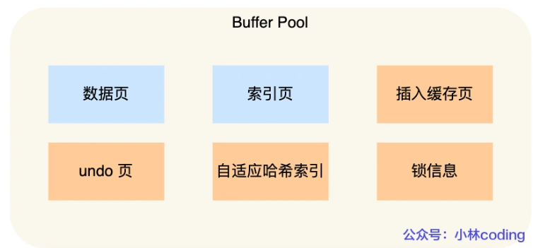

## Undo Log

### 作用

Undo Log 被称为撤销日志、回滚日志。

Undo Log 的作用 / 功能：

- **事务回滚**：可以对提前写入的数据变动进行擦除，实现事务回滚，保证事务的原子性。
- **实现 MVCC 机制**：Undo Log 也用于实现 MVCC 机制，存储记录的多个版本的 Undo Log，形成版本链。
- Undo Log 中存储了回滚需要的数据。在事务回滚或者崩溃恢复时，根据 Undo Log 中的信息对已经写入到磁盘中的数据变动进行擦除。

### 数据组织形式

MySQL中的Undo Log严格的讲不是Log，而是数据，因此他的管理和落盘都跟数据是一样的：

- Undo的磁盘结构并不是顺序的，而是像数据一样按Page管理
- Undo写入时，也像数据一样产生对应的Redo Log
- Undo的Page也像数据一样缓存在Buffer Pool中，跟数据Page一起做LRU换入换出，以及刷脏。Undo Page的刷脏也像数据一样要等到对应的Redo Log 落盘之后

之所以这样实现，首要的原因是MySQL中的Undo Log不只是承担故障恢复时保证原子性的作用，更需要承担MVCC对历史版本的管理的作用，设计目标是高事务并发，方便的管理和维护。因此当做数据更合适。

但既然还叫Log，就还是需要有Undo Log的责任，那就是保证故障恢复时，如果看到数据的修改，一定要能看到其对应Undo的修改，这样才有机会通过事务的回滚保证原子性。标准的Undo Log这一步是靠WAL实现的，也就是要求Undo写入先于数据落盘。而InnoDB中Undo Log作为一种特殊的数据，这一步是通过redo的min-transaction保证的，简单的说就是数据的修改和对应的Undo修改，他们所对应的redo log被放到同一个min-transaction中，同一个min-transaction中的所有redo log在故障恢复时以一个整体进行重放，要么全部重放，要么全部回滚（利用undo log）。

### 工作原理

在更新数据之前，MySQL会提前生成Undo Log日志，当事务提交的时候，并不会立即删除Undo Log，因为后面可能需要进行回滚操作，要执行回滚（ROLLBACK）操作时，从缓存中读取数据。Undo Log日志的删除是通过通过后台purge（清洗）线程进行回收处理的。

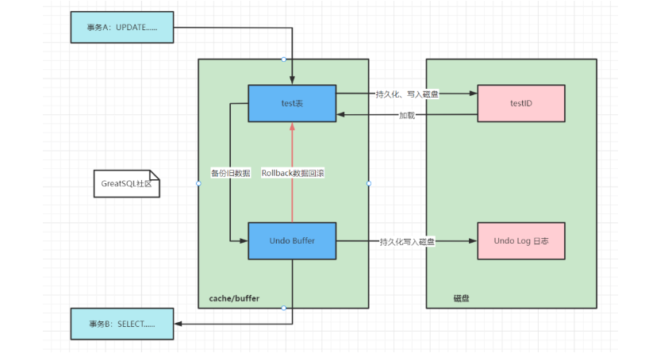

- 事务A执行UPDATE操作，此时事务还没提交，会将数据进行备份到对应的Undo的 Buffer Pool，然后由Undo的 Buffer Pool持久化到磁盘中的Undo Log文件（时机计入到redo log）中，此时Undo Log保存了未提交之前的操作日志，接着将操作的数据，也就是test表的数据持久保存到InnoDB的数据文件IBD。
- 此时事务B进行查询操作，直接从Undo的 Buffer Pool缓存中进行读取，这时事务A还没提交事务，如果要回滚（ROLLBACK）事务，是不读磁盘的，先直接从Undo Buffer缓存读取。

### 在事务中的流程

事务在undo log segment分配也写入undo log的同时也会产生redo log,当事务提交时候(commit)
1.将undo log 放入列表中,以供之后的purge(pai rui chi)线程使用
2.判断undo log 所在的页是否可以重用,若可以分配给下个事务使用
3.事务提交后,不能马上删除undo log及undo log所在的页,这是因为还有其他事务需要通过undo log来得到行记录之前的版本,故事务提交将undo log 放入一个链表中,是否可以最终删除undo log及undo log所在页由purge线程来判断

当事务提交时候,首先将undo log放入链表中,判断undo页的使用空间是否小于3/4,则表示undo log可以被重用,之后新的undo log 记录在当前的undo log的后面,由于存放undo log的列表是以记录进行组织的,二undo log可能存放着不同事务的undo log,因此prege操作需要设计磁盘的离散读取操作,是一个比较缓慢的过程,此过程可以设置purge线程的个数来提升回收速度

## innodb的mini-transaction

mini-transaction和我们理解的数据库事务不是一个东西。从一致性来讲，数据库事务是保证多条语句操作的一致性，往往涉及到多个页的修改。而mini-transaction是单页数据一致性，是避免内存页的并发更新影响。当然数据库事务一致性实现也是建立在mini-transaction的基础上的。

所有对页的操作都要在mini_transaction中执行。

在一个mini-transaction操作中，需要对对应的page加锁。锁中代码逻辑主要就是操作页，然后生成redo和undo log，完成之后释放锁。


## “Write-Ahead Log”日志方案

**WAL 技术指的是， MySQL 的写操作并不是立刻写到磁盘上，而是先写日志，然后在合适的时间再写到磁盘上**。

“Write-Ahead Log”在崩溃恢复时，会经历以下三个阶段：

- **分析阶段（Analysis）**：该阶段从最后一次检查点（Checkpoint，可理解为在这个点之前所有应该持久化的变动都已安全落盘）开始扫描日志，找出所有没有 End Record 的事务，组成待恢复的事务集合（一般包括 Transaction Table 和 Dirty Page Table）。
- **重做阶段（Redo）**：该阶段依据分析阶段中，产生的待恢复的事务集合来重演历史（Repeat History），找出所有包含 Commit Record 的日志，将它们写入磁盘，写入完成后增加一条 End Record，然后移除出待恢复事务集合。
- **回滚阶段（Undo）**：该阶段处理经过分析、重做阶段后剩余的待恢复事务集合，此时剩下的都是需要回滚的事务（被称为 Loser），根据 Undo Log 中的信息回滚这些事务（可能数据已经刷到磁盘，所以需要回滚磁盘中数据）。

## Redo 日志

`redo log`（重做日志）是`InnoDB`存储引擎独有的，它让`MySQL`拥有了崩溃恢复能力。

比如 `MySQL` 实例挂了或宕机了，重启时，`InnoDB`存储引擎会使用`redo log`恢复数据，保证数据的持久性与完整性。

### Redo log的刷盘时机

下面几个时机：

- MySQL 正常关闭时；
- 当 redo log buffer 中记录的写入量大于 redo log buffer 内存空间的一半时，会触发落盘；
- InnoDB 的后台线程每隔 1 秒，将 redo log buffer 持久化到磁盘。
- 每次事务提交时都将缓存在 redo log buffer 里的 redo log 直接持久化到磁盘（这个策略可由 innodb_flush_log_at_trx_commit 参数控制）

参数 `innodb_flush_log_at_trx_commit` 参数控制，可取的值有：0、1、2，默认值为 1，这三个值分别代表的策略如下：

- 当设置该**参数为 0 时**，表示每次事务提交时 ，还是**将 redo log 留在 redo log buffer 中** ，该模式下在事务提交时不会主动触发写入磁盘的操作。
- 当设置该**参数为 1 时**，表示每次事务提交时，都**将缓存在 redo log buffer 里的 redo log 直接持久化到磁盘**，这样可以保证 MySQL 异常重启之后数据不会丢失。
- 当设置该**参数为 2 时**，表示每次事务提交时，都只是缓存在 redo log buffer 里的 redo log **写到 redo log 文件，注意写入到「 redo log 文件」并不意味着写入到了磁盘**，因为操作系统的文件系统中有个 Page Cache

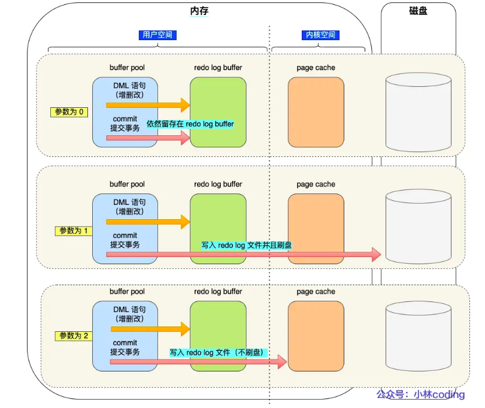

### Redo log文件写满

默认情况下， InnoDB 存储引擎有 1 个重做日志文件组( redo log Group），「重做日志文件组」由有 2 个 redo log 文件组成，这两个 redo 日志的文件名叫 ：`ib_logfile0` 和 `ib_logfile1`

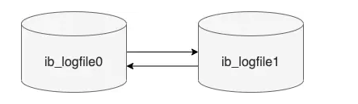

重做日志文件组是以**循环写**的方式工作的，从头开始写，写到末尾就又回到开头，相当于一个环形。InnoDB 用 write pos 表示 redo log 当前记录写到的位置，用 checkpoint 表示当前要擦除的位置，如下图：

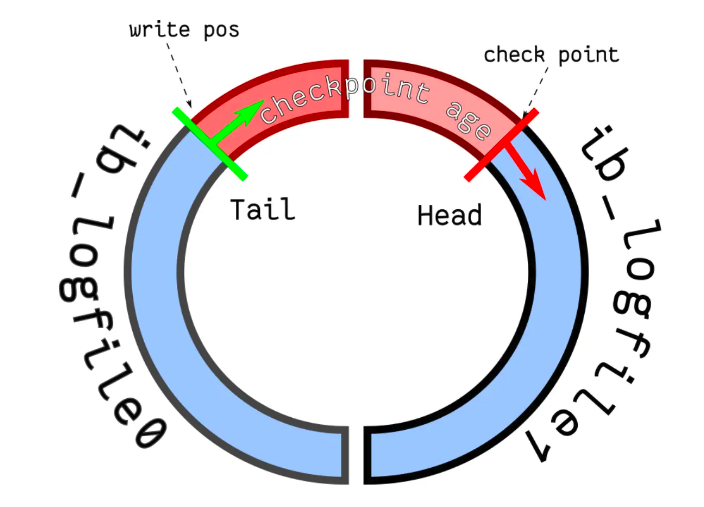

如果 write pos 追上了 checkpoint，就意味着 **redo log 文件满了，这时 MySQL 不能再执行新的更新操作，也就是说 MySQL 会被阻塞**（*因此所以针对并发量大的系统，适当设置 redo log 的文件大小非常重要*），此时**会停下来将 Buffer Pool 中的脏页刷新到磁盘中，然后标记 redo log 哪些记录可以被擦除，接着对旧的 redo log 记录进行擦除，等擦除完旧记录腾出了空间，checkpoint 就会往后移动（图中顺时针）**，然后 MySQL 恢复正常运行，继续执行新的更新操作。

## Undo 与 Redo日志

undo log 和 redo log 这两个日志都是 Innodb 存储引擎生成的。

它们的区别在于：

- redo log 记录了此次事务「**完成后**」的数据状态，记录的是更新**之后**的值；
- undo log 记录了此次事务「**开始前**」的数据状态，记录的是更新**之前**的值；

事务提交之前发生了崩溃，重启后会通过 undo log 回滚事务，事务提交之后发生了崩溃，重启后会通过 redo log 恢复事务，如下图：

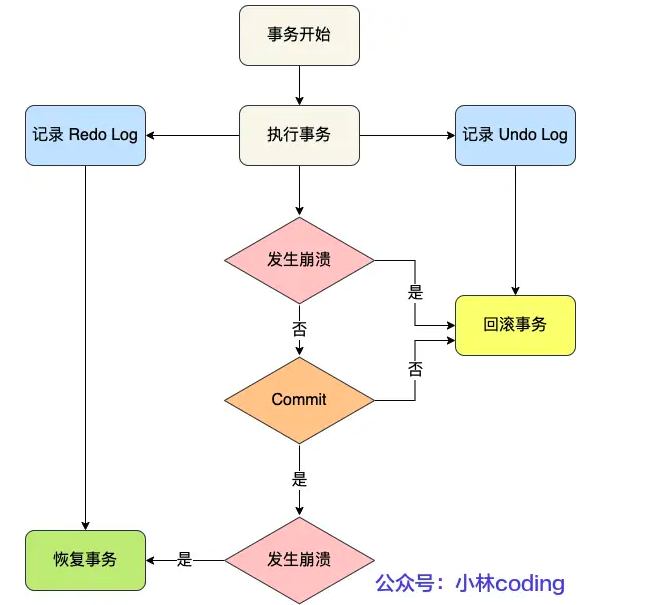


所以有了 redo log，再通过 WAL 技术，InnoDB 就可以保证即使数据库发生异常重启，之前已提交的记录都不会丢失，这个能力称为 **crash-safe**（崩溃恢复）。可以看出来， **redo log 保证了事务四大特性中的持久性**。

## Binlog日志

### 刷盘时机

MySQL提供一个 sync_binlog 参数来控制数据库的 binlog 刷到磁盘上的频率：

- sync_binlog = 0 的时候，表示每次提交事务都只 write，不 fsync，后续交由操作系统决定何时将数据持久化到磁盘；
- sync_binlog = 1 的时候，表示每次提交事务都会 write，然后马上执行 fsync；
- sync_binlog =N(N>1) 的时候，表示每次提交事务都 write，但累积 N 个事务后才 fsync。

线上通常使用sync_binlog 设置为 1，当 sync_binlog 设置为 1 的时候，是最安全就是对写入性能影响太大。

### 清理机制

为防止磁盘打满，binlog带有自动清理机制，使用命令

```sql
show variables like 'expire_logs_days';
```

可以看到binlog的清理时间配置的是30天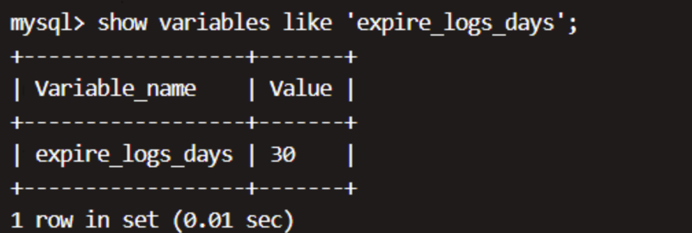


## 两阶段提交

**MySQL 为了避免出现两份日志之间的逻辑不一致的问题，使用了「两阶段提交」来解决**，两阶段提交其实是分布式事务一致性协议，它可以保证多个逻辑操作要不全部成功，要不全部失败，不会出现半成功的状态。

在 MySQL 的 InnoDB 存储引擎中，开启 binlog 的情况下，MySQL 会同时维护 binlog 日志与 InnoDB 的 redo log，为了保证这两个日志的一致性，MySQL 使用了**内部 XA 事务**，内部 XA 事务由 binlog 作为协调者，存储引擎是参与者。

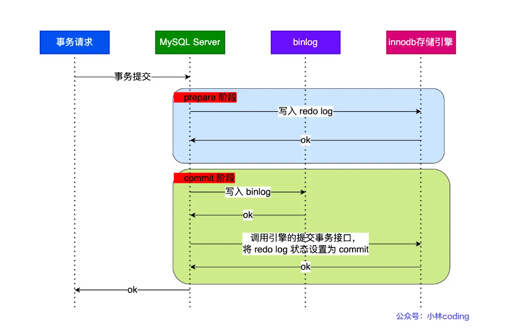

## Redo log 和 Binlog 

两个日志有四个区别。

*1、适用对象不同：*

- binlog 是 MySQL 的 Server 层实现的日志，所有存储引擎都可以使用；
- redo log 是 Innodb 存储引擎实现的日志；

*2、文件格式不同：*

- binlog 有 3 种格式类型，分别是 STATEMENT（默认格式）、ROW、 MIXED，区别如下：
  - STATEMENT：每一条修改数据的 SQL 都会被记录到 binlog 中（相当于记录了逻辑操作，所以针对这种格式， binlog 可以称为逻辑日志），主从复制中 slave 端再根据 SQL 语句重现。但 STATEMENT 有动态函数的问题，比如你用了 uuid 或者 now 这些函数，你在主库上执行的结果并不是你在从库执行的结果，这种随时在变的函数会导致复制的数据不一致；
  - ROW：记录行数据最终被修改成什么样了（这种格式的日志，就不能称为逻辑日志了），不会出现 STATEMENT 下动态函数的问题。但 ROW 的缺点是每行数据的变化结果都会被记录，比如执行批量 update 语句，更新多少行数据就会产生多少条记录，使 binlog 文件过大，而在 STATEMENT 格式下只会记录一个 update 语句而已；
  - MIXED：包含了 STATEMENT 和 ROW 模式，它会根据不同的情况自动使用 ROW 模式和 STATEMENT 模式；
- redo log 是物理日志，记录的是在某个数据页做了什么修改，比如对 XXX 表空间中的 YYY 数据页 ZZZ 偏移量的地方做了AAA 更新；

*3、写入方式不同：*

- binlog 是追加写，写满一个文件，就创建一个新的文件继续写，不会覆盖以前的日志，保存的是全量的日志。
- redo log 是循环写，日志空间大小是固定，全部写满就从头开始，保存未被刷入磁盘的脏页日志。

*4、用途不同：*

- binlog 用于备份恢复、主从复制；
- redo log 用于掉电等故障恢复。


## Sql语句执行

具体更新一条记录 `UPDATE t_user SET name = 'xiaolin' WHERE id = 1;` 的流程如下:

1. 执行器负责具体执行，会调用存储引擎的接口，通过主键索引树搜索获取 id = 1 这一行记录：
   - 如果 id=1 这一行所在的数据页本来就在 buffer pool 中，就直接返回给执行器更新；
   - 如果记录不在 buffer pool，将数据页从磁盘读入到 buffer pool，返回记录给执行器。
2. 执行器得到聚簇索引记录后，会看一下更新前的记录和更新后的记录是否一样：
   - 如果一样的话就不进行后续更新流程；
   - 如果不一样的话就把更新前的记录和更新后的记录都当作参数传给 InnoDB 层，让 InnoDB 真正的执行更新记录的操作；
3. 开启事务， InnoDB 层更新记录前，首先要记录相应的 undo log，因为这是更新操作，需要把被更新的列的旧值记下来，也就是要生成一条 undo log，undo log 会写入 Buffer Pool 中的 Undo 页面，不过在内存修改该 Undo 页面后，需要记录对应的 redo log。
4. InnoDB 层开始更新记录，会先更新内存（同时标记为脏页），然后将记录写到 redo log 里面，这个时候更新就算完成了。为了减少磁盘I/O，不会立即将脏页写入磁盘，后续由后台线程选择一个合适的时机将脏页写入到磁盘。这就是 **WAL 技术**，MySQL 的写操作并不是立刻写到磁盘上，而是先写 redo 日志，然后在合适的时间再将修改的行数据写到磁盘上。
5. 至此，一条记录更新完了。
6. 在一条更新语句执行完成后，然后开始记录该语句对应的 binlog，此时记录的 binlog 会被保存到 binlog cache，并没有刷新到硬盘上的 binlog 文件，在事务提交时才会统一将该事务运行过程中的所有 binlog 刷新到硬盘。
7. 事务提交
   - **prepare 阶段**：将 redo log 对应的事务状态设置为 prepare，然后将 redo log 刷新到硬盘；
   - **commit 阶段**：将 binlog 刷新到磁盘，接着调用引擎的提交事务接口，将 redo log 状态设置为 commit（将事务设置为 commit 状态后，刷入到磁盘 redo log 文件）；
8. 至此，一条更新语句执行完成。

## 主从复制

主要涉及三个线程: binlog 线程、I/O 线程和 SQL 线程。

- **log dump 线程** : 负责将主服务器上的数据更改写入二进制日志中。
- **I/O 线程** : 负责从主服务器上读取二进制日志，并写入从服务器的中继日志中。
- **SQL 线程** : 负责读取中继日志并重放其中的 SQL 语句。

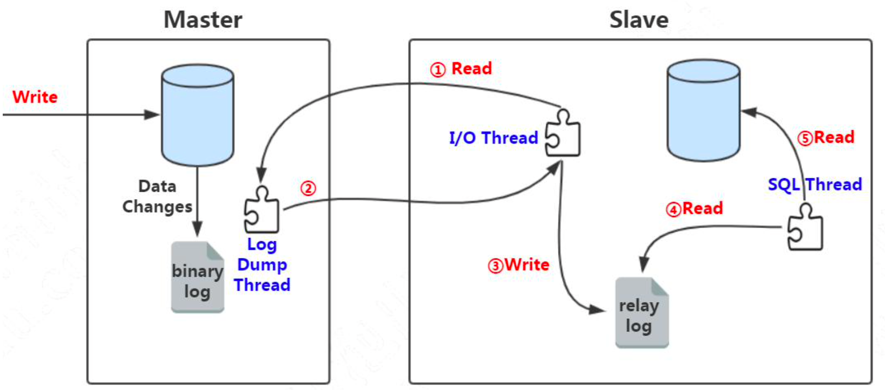

## 事务的特性

四个特性

- 持久性是通过 redo log （重做日志）来保证的；
- 原子性是通过 undo log（回滚日志） 来保证的；
- 隔离性是通过 MVCC（多版本并发控制） 或锁机制来保证的；
- 一致性则是通过持久性+原子性+隔离性来保证；

## 并行事务引发问题

- 脏读（dirty read）
- 不可重复读（non-repeatable read）
- 幻读（phantom read）

## 事务的隔离级别

这四个隔离级别如下：

- **读未提交（\*read uncommitted\*）**，指一个事务还没提交时，它做的变更就能被其他事务看到；
- **读提交（\*read committed\*）**，指一个事务提交之后，它做的变更才能被其他事务看到；
- **可重复读（\*repeatable read\*）**，指一个事务执行过程中看到的数据，一直跟这个事务启动时看到的数据是一致的，**MySQL InnoDB 引擎的默认隔离级别**；
- **串行化（\*serializable\* ）**；会对记录加上读写锁，在多个事务对这条记录进行读写操作时，如果发生了读写冲突的时候，后访问的事务必须等前一个事务执行完成，才能继续执行；

**MySQL InnoDB 引擎的默认隔离级别虽然是「可重复读」，但是它很大程度上避免幻读现象（并不是完全解决了）**，解决的方案有两种：

- 针对**快照读**（普通 select 语句），是**通过 MVCC 方式解决了幻读**，因为可重复读隔离级别下，事务执行过程中看到的数据，一直跟这个事务启动时看到的数据是一致的，即使中途有其他事务插入了一条数据，是查询不出来这条数据的，所以就很好了避免幻读问题。
- 针对**当前读**（select ... for update 等语句），是**通过 next-key lock（记录锁+间隙锁）方式解决了幻读**，因为当执行 select ... for update 语句的时候，会加上 next-key lock，如果有其他事务在 next-key lock 锁范围内插入了一条记录，那么这个插入语句就会被阻塞，无法成功插入，所以就很好了避免幻读问题。

### 为什么不能完全解决幻读

1. 场景一：

   

   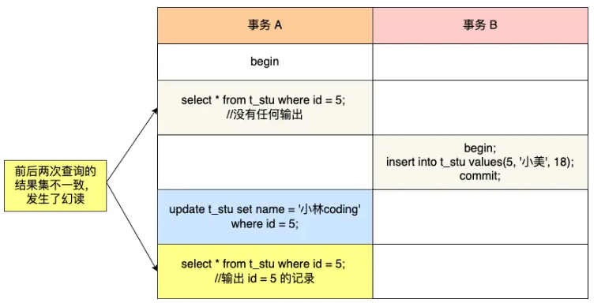可重复读隔离级别下，事务 A 第一次执行普通的 select 语句时生成了一个 ReadView，之后事务 B 向表中新插入了一条 id = 5 的记录并提交。接着，事务 A 对 id = 5 这条记录进行了更新操作，在这个时刻，这条新记录的 trx_id 隐藏列的值就变成了事务 A 的事务 id，之后事务 A 再使用普通 select 语句去查询这条记录时就可以看到这条记录了，于是就发生了幻读。

2. 场景2：

- T1 时刻：事务 A 先执行「快照读语句」：select * from t_test where id > 100 得到了 3 条记录。
- T2 时刻：事务 B 往插入一个 id= 200 的记录并提交；
- T3 时刻：事务 A 再执行「当前读语句」 select * from t_test where id > 100 for update 就会得到 4 条记录，此时也发生了幻读现象。

**要避免这类特殊场景下发生幻读的现象的话，就是尽量在开启事务之后，马上执行 select ... for update 这类当前读的语句**，因为它会对记录加 next-key lock，从而避免其他事务插入一条新记录。


### 四种隔离级别如何实现

- 对于「读未提交」隔离级别的事务来说，因为可以读到未提交事务修改的数据，所以直接读取最新的数据就好了；
- 对于「串行化」隔离级别的事务来说，通过加读写锁的方式来避免并行访问；
- 对于「读提交」和「可重复读」隔离级别的事务来说，它们是通过 **Read View 来实现的，它们的区别在于创建 Read View 的时机不同，大家可以把 Read View 理解成一个数据快照，就像相机拍照那样，定格某一时刻的风景。「读提交」隔离级别是在「每个语句执行前」都会重新生成一个 Read View，而「可重复读」隔离级别是「启动事务第一次查询时」生成一个 Read View，然后整个事务期间都在用这个 Read View**。

### Read View

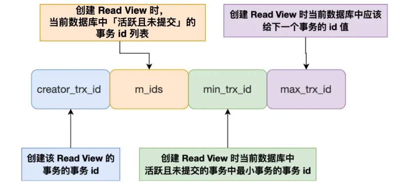


Read View 有四个重要的字段：

- m_ids ：指的是在创建 Read View 时，当前数据库中「活跃事务」的**事务 id 列表**，注意是一个列表，**“活跃事务”指的就是，启动了但还没提交的事务**。
- min_trx_id ：指的是在创建 Read View 时，当前数据库中「活跃事务」中事务 **id 最小的事务**，也就是 m_ids 的最小值。
- max_trx_id ：这个并不是 m_ids 的最大值，而是**创建 Read View 时当前数据库中应该给下一个事务的 id 值**，也就是全局事务中最大的事务 id 值 + 1；
- creator_trx_id ：指的是**创建该 Read View 的事务的事务 id**。

一条记录的每一次更新操作产生的 undo log 格式都有一个 roll_pointer 指针和一个 trx_id 事务id：

- 通过 trx_id 可以知道该记录是被哪个事务修改的；
- 通过 roll_pointer 指针可以将这些 undo log 串成一个链表，这个链表就被称为版本链；

版本链如下图：

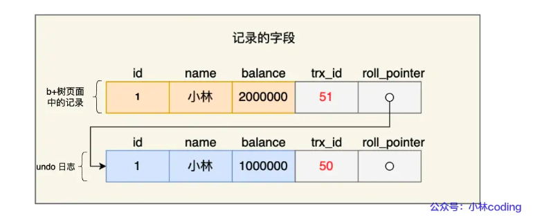

一个事务去访问记录的时候，除了自己的更新记录总是可见之外，还有这几种情况：

- 如果记录的 trx_id 值小于 Read View 中的 `min_trx_id` 值，表示这个版本的记录是在创建 Read View **前**已经提交的事务生成的，所以该版本的记录对当前事务**可见**。
- 如果记录的 trx_id 值大于等于 Read View 中的 `max_trx_id` 值，表示这个版本的记录是在创建 Read View **后**才启动的事务生成的，所以该版本的记录对当前事务**不可见**。
- 如果记录的 trx_id 值在 Read View 的min_trx_id和max_trx_id之间，需要判断 trx_id 是否在 m_ids 列表中：
  - 如果记录的 trx_id **在** `m_ids` 列表中，表示生成该版本记录的活跃事务依然活跃着（还没提交事务），所以该版本的记录对当前事务**不可见**。
  - 如果记录的 trx_id **不在** `m_ids`列表中，表示生成该版本记录的活跃事务已经被提交，所以该版本的记录对当前事务**可见**。

## 采用B+树作为索引的数据结构

- B+ 树的非叶子节点不存放实际的记录数据，仅存放索引，因此数据量相同的情况下，相比存储即存索引又存记录的 B 树，B+树的非叶子节点可以存放更多的索引，因此 B+ 树可以比 B 树更「矮胖」，查询底层节点的磁盘 I/O次数会更少。
- B+ 树有大量的冗余节点（所有非叶子节点都是冗余索引），这些冗余索引让 B+ 树在插入、删除的效率都更高，比如删除根节点的时候，不会像 B 树那样会发生复杂的树的变化；
- B+ 树叶子节点之间用链表连接了起来，有利于范围查询，而 B 树要实现范围查询，因此只能通过树的遍历来完成范围查询，这会涉及多个节点的磁盘 I/O 操作，范围查询效率不如 B+ 树。

## 聚簇索引和二级索引

索引又可以分成聚簇索引和非聚簇索引（二级索引），它们区别就在于叶子节点存放的是什么数据：

- 聚簇索引的叶子节点存放的是实际数据，所有完整的用户记录都存放在聚簇索引的叶子节点；**即索引结构和数据一起存放的索引。**
- 二级索引的叶子节点存放的是主键值，而不是实际数据。

InnoDB 在创建聚簇索引时，会根据不同的场景选择不同的列作为索引：

- 如果有主键，默认会使用主键作为聚簇索引的索引键；
- 如果没有主键，就选择第一个不包含 NULL 值的唯一列作为聚簇索引的索引键；
- 在上面两个都没有的情况下，InnoDB 将自动生成一个隐式自增 id 列作为聚簇索引的索引键；


### 单表数据不超过2000万

- 单表数据库到达某个量级的上限时，导致内存无法存储其索引，使得之后的 SQL 查询会产生磁盘 IO，从而导致性能下降，所以增加硬件配置（比如把内存当磁盘使），可能会带来立竿见影的性能提升
- 索引结构不会影响单表最大行数，2000W 也只是推荐值，超过了这个值可能会导致 B + 树层级更高，影响查询性能。


## 索引失效

发生索引失效的情况：

- 当我们使用左或者左右模糊匹配的时候，也就是 `like %xx` 或者 `like %xx%`这两种方式都会造成索引失效；
- 当我们在查询条件中对索引列使用函数，就会导致索引失效。
- 当我们在查询条件中对索引列进行表达式计算，也是无法走索引的。
- MySQL 在遇到字符串和数字比较的时候。如果字符串是索引列，而条件语句中的输入参数是数字的话，那么索引列会发生隐式类型转换，由于隐式类型转换是通过 CAST 函数实现的，等同于对索引列使用了函数，所以就会导致索引失效。
- 联合索引要能正确使用需要遵循最左匹配原则，也就是按照最左优先的方式进行索引的匹配，否则就会导致索引失效。
- 在 WHERE 子句中，如果在 OR 前的条件列是索引列，而在 OR 后的条件列不是索引列，那么索引会失效。


## count() 性能对比


count(1)、 count(*)、 count(主键字段)在执行的时候，如果表里存在二级索引，优化器就会选择二级索引进行扫描。这是因为相同数量的二级索引记录可以比聚簇索引记录占用更少的存储空间，所以二级索引树比聚簇索引树小，这样遍历二级索引的 I/O 成本比遍历聚簇索引的 I/O 成本小，因此「优化器」优先选择的是二级索引。

所以，如果要执行 count(1)、 count(*)、 count(主键字段) 时，尽量在数据表上建立二级索引，这样优化器会自动采用 key_len 最小的二级索引进行扫描，相比于扫描主键索引效率会高一些。

再来，就是不要使用 count(字段) 来统计记录个数，因为它的效率是最差的，会采用全表扫描的方式来统计。如果你非要统计表中该字段不为 NULL 的记录个数，建议给这个字段建立一个二级索引。

## 参考

https://xiaolincoding.com/mysql/

https://www.zhihu.com/question/267595935/answer/2204949497

https://juejin.cn/post/7023574554899382279

https://www.51cto.com/article/720454.html

https://blog.csdn.net/qq_39787367/article/details/103168445

https://javaguide.cn/database/mysql/mysql-logs.html
