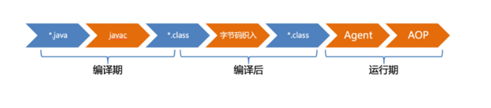
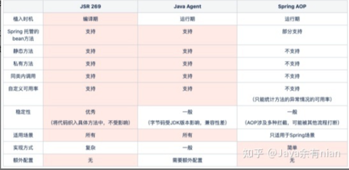
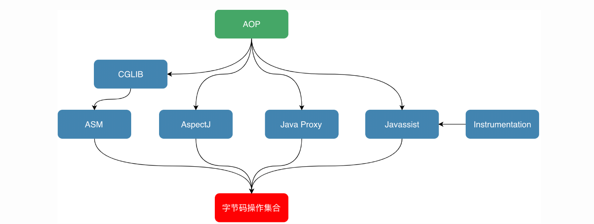
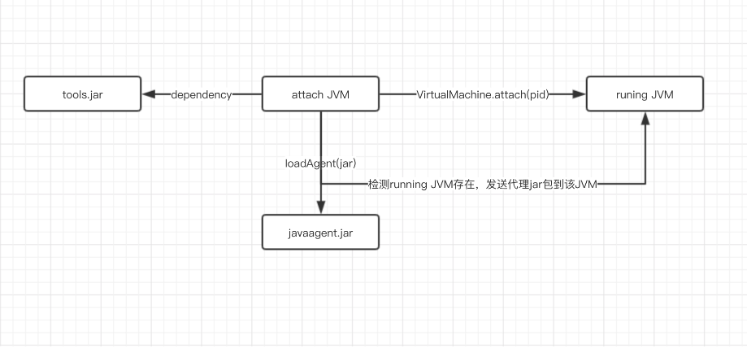

[TOC]

## Java的增强技术

如下图，从软件的开发周期来看，可织入埋点的时机主要有 3 个阶段：编译期、编译后和运行期。

### 编译期

这里的编译期指将Java源文件编译为class字节码的过程。Java编译器提供了基于 JSR 269 规范[1]的注解处理器机制，通过操作AST （抽象语法树，Abstract Syntax Tree，下同）实现逻辑的织入。业内有不少基于此机制的应用，比如Lombok 、MapStruct 、JPA 等；此机制的优点是因为在编译期执行，可以将问题前置，没有多余依赖，因此做出来的工具使用起来比较方便。缺点也很明显，要熟练操作 AST并不是想的那么简单，不理解前后关联的流程写出来的代码不够稳定，因此要花大量时间熟悉编译器底层原理。当然这个过程对使用者来讲是没有感知的。

### 编译后

编译后是指编译成 class 字节码之后，通过字节码进行增强的过程。此阶段插桩需要适配不同的构建工具：Maven、Gradle、Ant、Ivy等，也需要使用方增加额外的构建配置，因此存在开发量大和使用不够方便的问题，首先要排除掉此选项。可能只有极少数场景下才会需要在此阶段插桩。

### 运行期

运行期是指在程序启动后，在运行时进行增强的过程，这个阶段有 3 种方式可以织入逻辑，按照启动顺序，可以分为：静态 Agent、AOP 和动态 Agent。

#### 静态 Agent

JVM 启动时使用 -javaagent 载入指定 jar 包，调用 MANIFEST.MF 文件里的 Premain-Class 类的 premain 方法触发织入逻辑。是技术中间件最常使用的方式，借助字节码工具完成相关工作。应用此机制的中间件有很多，比如：京东内部的链路监控 pfinder、外部开源的 skywalking 的探针、阿里的 TTL 等等。这种方式优点是整体比较成熟，缺点主要是兼容性问题，要测试不同的 JDK 版本代价较大，出现问题只能在线上发现。同时如果不是专业的中间件团队，还是存在一定的技术门槛，维护成本比较高；

#### Spring AOP

Spring AOP大家都不陌生，通过 Spring 代理机制，可以在方法调用前后织入逻辑。AOP 最大的优点是使用简单，同样存在不少缺点：

1. 需要两次反射，一次是增强里面的反射，一次是需要执行方法的反射
2. 私有方法、静态方法、final class和方法等场景无法走切面

#### 动态 Agent

动态加载jar包，调用MANIFEST.MF文件中声明的Agent-Class类的agentmain方法触发织入逻辑。这种方式主要用来线上动态调试，使用此机制的中间件也有很多，比如：Btrace、Arthas等，此方式不适合常驻内存使用，因此要排除掉。

### 最终方案

选择通过上面的分析梳理可知，要实现重复代码的抽象有 3 种方式：基于JSR 269 的插桩、基于 Java Agent 的字节码增强、基于Spring AOP的自定义切面。接下来进一步的对比：

如上表所示，从实现成本上来看，AOP 最简单，但这个方案不能覆盖所有场景，存在一定的局限性，不符合我们追求极致的调性，因此首先排除。Java Agent 能达到的效果与 JSR 269 相同，但是启动参数里需要增加 -javaagent 配置，有少量的运维工作，同时还有 JDK 兼容性的坑需要趟，对非中间件团队来说，这种方式从长久看会带来负担，因此也要排除。

基于 JSR 269 的插桩方式，对Java编译器工作流程的理解和 AST 的操作会带来实现上的复杂性，前期投入比较大，但是组件一旦成型，会带来一劳永逸的解决方案，可以很自信的讲，插桩实现的组件是监控埋点场景里的银弹（事实证明了这点，不然也不敢这么吹）。

## JavaAgent解析

作用：java探针利用了javaAgent + ASM字节码注入工具实现了动态修改类文件的功能。

Agent就是JVMTI的一种实现，Agent有两种启动方式，一是随Java进程启动而启动，经常见到的java -agentlib就是这种方式；二是运行时载入，通过attach API，将模块（jar包）动态地Attach到指定进程id的Java进程内。

### 字节码增强技术

### JVM启动前静态Agent

Javaagent 是什么

Javaagent是java命令的一个参数。参数 javaagent 可以用于指定一个 jar 包，并且对该 java 包有2个要求：

1. 这个 jar 包的 MANIFEST.MF 文件必须指定 Premain-Class 项。
2. Premain-Class 指定的那个类必须实现 premain() 方法。

premain 方法，从字面上理解，就是运行在 main 函数之前的的类。当Java 虚拟机启动时，在执行 main 函数之前，JVM 会先运行`-javaagent`所指定 jar 包内 Premain-Class 这个类的 premain 方法 。

#### 使用

使用 javaagent 需要几个步骤：

1. 定义一个 MANIFEST.MF 文件，必须包含 Premain-Class 选项，通常也会加入Can-Redefine-Classes 和 Can-Retransform-Classes 选项。
2. 创建一个Premain-Class 指定的类，类中包含 premain 方法，方法逻辑由用户自己确定。
3. 将 premain 的类和 MANIFEST.MF 文件打成 jar 包。
4. 使用参数 -javaagent: jar包路径 启动要代理的方法。

#### 结论

我们能够发现：

1. 执行main方法之前会加载所有的类，包括系统类和自定义类；
2. 在ClassFileTransformer中会去拦截系统类和自己实现的类对象；
3. 如果你有对某些类对象进行改写，那么在拦截的时候抓住该类使用字节码编译工具即可实现。

#### 代码解析

见javamaster/master/src/main/java/com/ljh/agent/Main.java以及javamaster/MyCustomerAgent

### JVM启动后动态Agent

上面介绍的 premain 是在 JDK 1.5中提供的，开发者只能在main加载之前添加手脚，在 Java SE 6 的 Instrumentation 当中，提供了一个新的代理操作方法：agentmain，可以在 main 函数开始运行之后再运行。

#### attach实现动态注入的原理

通过VirtualMachine类的`attach(pid)`方法，便可以attach到一个运行中的java进程上，之后便可以通过`loadAgent(agentJarPath)`来将agent的jar包注入到对应的进程，然后对应的进程会调用agentmain方法。

#### 代码解析

见javamaster/master/src/main/java/com/ljh/agent/AttachMain.java与AttachTest.java

## instrument原理

`instrument`的底层实现依赖于`JVMTI(JVM Tool Interface)`，它是JVM暴露出来的一些供用户扩展的接口集合，JVMTI是基于事件驱动的，JVM每执行到一定的逻辑就会调用一些事件的回调接口（如果有的话），这些接口可以供开发者去扩展自己的逻辑。`JVMTIAgent`是一个利用`JVMTI`暴露出来的接口提供了代理启动时加载(agent on load)、代理通过attach形式加载(agent on attach)和代理卸载(agent on unload)功能的动态库。而`instrument agent`可以理解为一类`JVMTIAgent`动态库，别名是`JPLISAgent(Java Programming Language Instrumentation Services Agent)`，也就是**专门为java语言编写的插桩服务提供支持的代理**。

### 启动时加载instrument agent过程：

1. 创建并初始化 JPLISAgent；
2. 监听 `VMInit` 事件，在 JVM 初始化完成之后做下面的事情：
   1. 创建 InstrumentationImpl 对象 ；
   2. 监听 ClassFileLoadHook 事件 ；
   3. 调用 InstrumentationImpl 的`loadClassAndCallPremain`方法，在这个方法里会去调用 javaagent 中 MANIFEST.MF 里指定的Premain-Class 类的 premain 方法 ；
3. 解析 javaagent 中 MANIFEST.MF 文件的参数，并根据这些参数来设置 JPLISAgent 里的一些内容。

### 运行时加载instrument agent过程：

通过 JVM 的attach机制来请求目标 JVM 加载对应的agent，过程大致如下：

1. 创建并初始化JPLISAgent；
2. 解析 javaagent 里 MANIFEST.MF 里的参数；
3. 创建 InstrumentationImpl 对象；
4. 监听 ClassFileLoadHook 事件；
5. 调用 InstrumentationImpl 的`loadClassAndCallAgentmain`方法，在这个方法里会去调用javaagent里 MANIFEST.MF 里指定的`Agent-Class`类的`agentmain`方法。

### Instrumentation的局限性

大多数情况下，我们使用Instrumentation都是使用其字节码插桩的功能，或者笼统说就是类重定义(Class Redefine)的功能，但是有以下的局限性：

1. premain和agentmain两种方式修改字节码的时机都是类文件加载之后，也就是说必须要带有Class类型的参数，不能通过字节码文件和自定义的类名重新定义一个本来不存在的类。
2. 类的字节码修改称为类转换(Class Transform)，类转换其实最终都回归到类重定义Instrumentation#redefineClasses()方法，此方法有以下限制：
   1. 新类和老类的父类必须相同；
   2. 新类和老类实现的接口数也要相同，并且是相同的接口；
   3. 新类和老类访问符必须一致。 新类和老类字段数和字段名要一致；
   4. 新类和老类新增或删除的方法必须是private static/final修饰的；
   5. 可以修改方法体。

除了上面的方式，如果想要重新定义一个类，可以考虑基于类加载器隔离的方式：创建一个新的自定义类加载器去通过新的字节码去定义一个全新的类，不过也存在只能通过反射调用该全新类的局限性。

## 参考

https://www.cnblogs.com/rickiyang/p/11368932.html

https://tech.meituan.com/2019/09/05/java-bytecode-enhancement.html