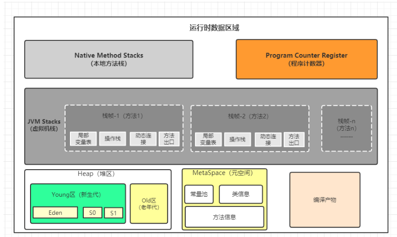
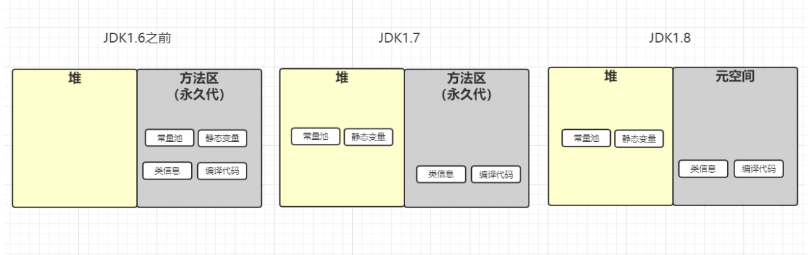
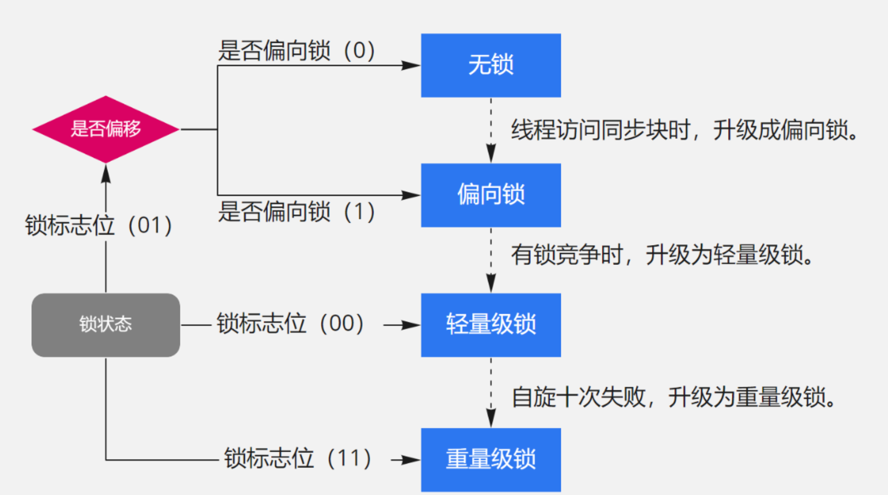

[TOC]

# Java知识点

## instanceof 、isAssignableFrom 、 isInstance 之间区别和联系

1. instanceof：用法：c instanceof Parent ，实例c是否为Parent类的子类或子接口。 
2. isInstance：用法： Face.class.isInstance(c) ， Face类是否为实例c的父类或父接口 ---- 和 instanceof 关键字判断刚刚好相反。
3. isAssignableFrom：用法：Parent.class.isAssignableFrom(Child.class) ，Parent类是否为Child类的父类或父接口。
4. instanceof 、isAssignableFrom 、 isInstance 都是判断Java中类之间的关系（继承类、实现接口）； instanceof 判断是左边是不是右边的儿子 ； isInstance 和 isAssignableFrom 判断的左边是不是右边的爸爸。
5. instanceof 和 isInstance 都是用来判断 类（接口）和实例之间是否存在关系。
6. isAssignableFrom 判断类和类，接口和接口，类和接口 之间是否存在关系。

## HotSpot中字符串常量池保存哪里？永久代？方法区还是堆区?

### 1.8Java内存区域

运行时常量池（Runtime Constant Pool）是虚拟机规范中是方法区的一部分，在加载类和结构到虚拟机后，就会创建对应的运行时常量池；而字符串常量池是这个过程中常量字符串的存放位置。所以从这个角度，字符串常量池属于虚拟机规范中的方法区，它是一个**逻辑上的概念**；而堆区，永久代以及元空间是实际的存放位置。

不同的虚拟机对虚拟机的规范（比如方法区）是不一样的，只有 HotSpot 才有永久代的概念。

HotSpot也是发展的，由于[一些问题](http://openjdk.java.net/jeps/122)的存在，HotSpot考虑逐渐去永久代，对于不同版本的JDK，**实际的存储位置**是有差异的，具体看如下表格：

| JDK版本      | 是否有永久代，字符串常量池放在哪里？                         | 方法区逻辑上规范，由哪些实际的部分实现的？                   |
| ------------ | ------------------------------------------------------------ | ------------------------------------------------------------ |
| jdk1.6及之前 | 有永久代，运行时常量池（包括字符串常量池），静态变量存放在永久代上 | 这个时期方法区在HotSpot中是由永久代来实现的，以至于**这个时期说方法区就是指永久代** |
| jdk1.7       | 有永久代，但已经逐步“去永久代”，字符串常量池、静态变量移除，保存在堆中； | 这个时期方法区在HotSpot中由**永久代**（类型信息、字段、方法、常量）和**堆**（字符串常量池、静态变量）共同实现 |
| jdk1.8及之后 | 取消永久代，类型信息、字段、方法、常量保存在本地内存的元空间，但字符串常量池、静态变量仍在堆中 | 这个时期方法区在HotSpot中由本地内存的**元空间**（类型信息、字段、方法、常量）和**堆**（字符串常量池、静态变量）共同实现 |

## 多线程

### 线程中断

1. java.lang.Thread#interrupt方法：实例方法，中断该线程，实际上只是给线程设置一个中断标志。线程如果正在运行仍会继续运行；如使用了sleep,同步锁的wait,socket中的receiver,accept等方法时，会抛出InterruptException异常
2. java.lang.Thread#interrupted方法：类方法，返回一个boolean并清除中断状态，第二次再调用时中断状态已经被清除，将返回一个false。
ReentrantLock 中 parkAndCheckInterrupt() 为会么会调用Thread.interrupted()？
3. LockSupport.park()，可通过两种方式被唤醒，LockSupport.unpark() 或者 interrupt()，若有中断标志，park就不阻塞线程，所以JDK中被唤醒之后都会调用Thread#interrupted方法来清楚中断状态。

## 实例对象-Class实例对象-元数据的区别联系

1. **元数据**：JVM**加载**一个类的时候会创建一个**instanceKlass**，用来表示这个**类的元数据**，包括常量池、字段、方法等。存放在**方法区**。
2. **实例对象** ：在**new一个对象**时，jvm创建**instanceOopDesc**，来表示**这个对象**，存放在**堆区**，其引用，存放在栈区；平时说的Java 对象实例就是instanceOopDesc，它用来表示对象的实例信息；
3. **Class实例对象**：HotSpot并没有把instanceKlass直接暴露给Java，而会另外创建对应的instanceOopDesc来表示java.lang.Class对象，并将后者称为前者的“Java镜像”，**instanceKlass持有指向对应的Class对象-即instanceOopDesc的引用**。

**instanceOopDesc**包含三部分：

1. 对象头，也叫Mark Word，主要存储对象运行时记录信息，如hashcode, GC分代年龄，锁状态标志，线程ID，时间戳等;
2. 元数据指针，即指向方法区的**instanceKlass**实例
3. 实例数据;
4. 另外，如果是数组对象，还多了一个数组长度

**Person类的实例(Oop)-->Person类的元数据（instanceKlass）-->Person类的Class对象（前提：同一个类加载器）**

- 每一个类的实例可以有多个，每个实例对象对应的Oop中对**instanceKlass**的引用都是同一个。
- 每一个类的元数据instanceKlass只有一个
- 每一个类的Class对象（Oop）也只有一个
- 唯一的Klass与唯一的Class对象一一对应，互相保存着对彼此的引用。

这些**引用关系**支持着**获取class对象三种方式的实现**

- Class.forName("ClassName")：通过类的元数据中的Class对象引用获得Class对象
-  object.getClass()：通过实例对象中保存的对类的元数据的引用获取类的元数据（instanceKlass），通过instanceKlass中对Class对象的引用获取Class对象（instanceOopDesc）
- 类名.class：通过类的元数据中的Class对象引用获得Class对象

## Synchronized锁优化

## 参考

https://blog.csdn.net/HaHa_Sir/article/details/120084092

https://pdai.tech/md/java/basic/java-basic-lan-basic.html#string-intern

https://blog.csdn.net/weixin_44250483/article/details/121338111

https://blog.csdn.net/qq_45795744/article/details/123493673

https://zhuanlan.zhihu.com/p/548844443