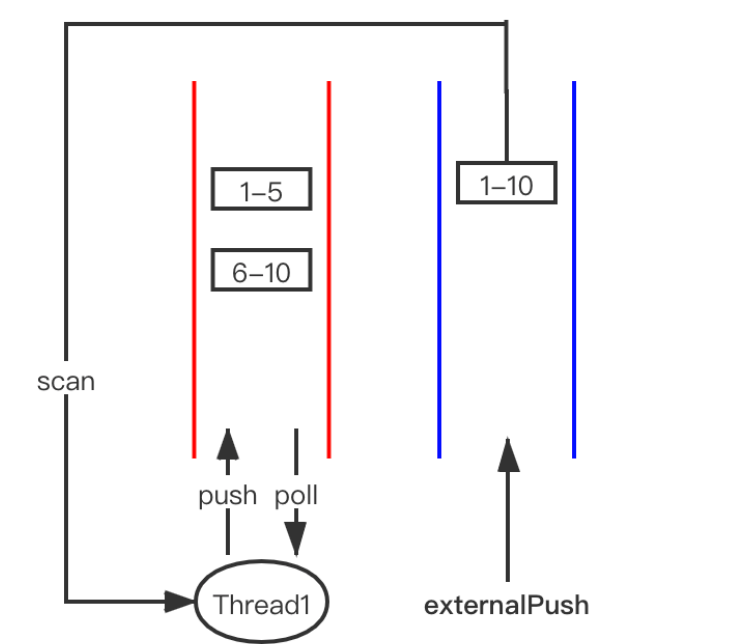

[TOC]


# ForkJoinPool源码详解

## 核心数据结构
与ThreadPoolExector不同的是，除一个全局的任务队列之外，每个线程还有一个自己的局部队列。
### JDK普通线程池
我们来看一下JDK普通线程池是咋玩的。

任务都是丢到一个同步队列BlockingQueue中的。如果你了解JDK BlockingQueue的实现，就知道有界的同步队列都是用锁阻塞的，有些push/poll操作还共用一把锁。
-  问题1:并行的任务有必要共用一个阻塞队列吗？
- 问题2: 如果任务队列中的任务存在依赖，worker线程只能被阻塞着。啥意思呢？

假设任务队列中存在两个任务task1和task2，task1的执行结果依赖于task2的结果。
如果worker1先拉取到task1,结果发现此时task2还没有被执行。则worker1只能阻塞等待别的worker拉取到task2,task2执行完了worker1才能继续执行task1。
如果worker1当发现task1无法继续执行下去时，能够先把它放一边，继续拉取任务执行。这样效率是比较高的。
### ForkJoinPool
Fork-Join框架通过Work−Stealing算法解决上面两个问题。

-  每个线程拥有自己的任务队列，并且是双端队列。
- 线程操作自己的任务队列是LIFO（Last in First out）模式。
- 线程还可以偷取别的线程任务队列中的任务，模式为FIFO（First in First out）。
#### 任务的生产和消费模式

显然每个线程拥有自己的任务队列可以提高获取队列的并行度。
双端任务队列将所属的自己线程的push/pop操作 和 其他线程的steal操作通过不同的模式区分开。这样只有当Base==Top-1时，pop操作和steal操作才会有冲突。

#### join时执行任务的判断
结合上面求和的例子，我们来看一下求1-10之间的数字和的求和任务的可能join过程：

case1:任务未被偷



假设求和 1-10任务被Thread1执行，fork出两个子任务：1-5 和 6-10，只要Thread1能判断出来要join的任务在自己的任务队列中，那当前join哪个子任务就把它取出来执行就可以。

case2:任务被偷，此时自己的任务队列为空，可以帮助小偷执行它未完成的任务


假设求和 1-10任务被Thread1执行，fork出两个子任务：1-5 和 6-10。6-10已成功执行完成，join返回了结果。但此时发现1-5被Thread2偷走了，自己的任务队列中已经没有任务可以执行了。此时Thread1可以找到小偷Thread2，并偷取Thread2的10-20任务来帮助它执行。

case3:任务被偷，此时自己的任务队列不为空


假设求和 1-10任务被Thread1执行，fork出两个子任务：1-5 和 6-10，要join 1-5时发现已经被Thread2偷走了，而自己队列中还有6-10等待join执行。不好意思帮不了小偷了。

只好尝试挂起自己等待1-5的执行结果通知，并尝试唤醒空闲线程或者创建新的线程替代自己执行任务队列中的6-10任务。

上述三种情况代码均在ForkJoinPool.awaitJoin方法中。整体思路是：

当任务还在自己的队列：

- 自己执行，获取结果。

当被别人偷走阻塞了：
- 自己又没任务执行，就帮助小偷执行任务。
- 自己有任务要执行，就尝试挂起自己等待小偷的反馈结果，同时找队友帮助自己执行。

这里任务模式有意思的是：
scan/steal操作都是从Base处获取任务，那么更容易获取到大的任务执行，从而使得整体线程的资源分配更加均衡。
任务队列所属的线程是LIFO的任务生产消费模式，刚好符合递归任务的执行顺序。

#### 工作窃取队列
关于全局队列，有一个关键点需要说明：它并非使用BlockingQueue，而是基于一个普通的数组得以实现。

这个队列又名工作窃取队列，为 ForkJoinPool 的工作窃取算法提供服务。在 ForkJoinPool开篇的注释中，Doug Lea 特别提到了工作窃取队列的实现，其陈述来自如下两篇论文：＂Dynamic CircularWork-Stealing Deque＂ by Chase and Lev，SPAA 2005与＂Idempotent work stealing＂ byMichael，Saraswat，and Vechev，PPoPP 2009。读者可以在网上查阅相应论文。

所谓工作窃取算法，是指一个Worker线程在执行完毕自己队列中的任务之后，可以窃取其他线程队列中的任务来执行，从而实现负载均衡，以防有的线程很空闲，有的线程很忙。这个过程要用到工作窃取队列。

这个队列只有如下几个操作：
-  Worker线程自己，在队列头部，通过对top指针执行加、减操作，实现入队或出队，这是单线程的。
- 其他Worker线程，在队列尾部，通过对base进行累加，实现出队操作，也就是窃取，这是多线程的，需要通过CAS操作。

这个队列，在Dynamic Circular Work-Stealing Deque这篇论文中被称为dynamic-cyclic-array。之所以这样命名，是因为有两个关键点：

整个队列是环形的，也就是一个数组实现的RingBuffer。并且base会一直累加，不会减小；top会累加、减小。最后，base、top的值都会大于整个数组的长度，只是计算数组下标的时候，会取top&（queue.length-1），base&（queue.length-1）。因为queue.length是2的整数次方，这里也就是对queue.length进行取模操作。

当top-base=queue.length-1 的时候，队列为满，此时需要扩容；

当top=base的时候，队列为空，Worker线程即将进入阻塞状态。

当队列满了之后会扩容，所以被称为是动态的。但这就涉及一个棘手的问题：多个线程同时在读写这个队列，如何实现在不加锁的情况下一边读写、一边扩容呢？

通过分析工作窃取队列的特性，我们会发现：在 base 一端，是多线程访问的，但它们只会使base变大，也就是使队列中的元素变少。所以队列为满，一定发生在top一端，对top进行累加的时候，这一端却是单线程的！队列的扩容恰好利用了这个单线程的特性！即在扩容过程中，不可能有其他线程对top进行修改，只有线程对base进行修改。

扩容之后，数组长度变成之前的二倍，但top、base的值是不变的！通过top、base对新的数组长度取模，仍然可以定位到元素在新数组中的位置。

```java
	// steal操作 就是 poll()方法
	final ForkJoinTask<?> poll() {
		ForkJoinTask<?>[] a; int b; ForkJoinTask<?> t;
		// base是将要偷的任务下标，base是用volatile修饰的，保证可见性
		while ((b = base) - top < 0 && (a = array) != null) {
			int j = (((a.length - 1) & b) << ASHIFT) + ABASE;
			t = (ForkJoinTask<?>)U.getObjectVolatile(a, j);
			// 多次判断减少并发
			if (base == b) {
				if (t != null) {
					if (U.compareAndSwapObject(a, j, t, null)) {
						// 如果上面修改成功，表示这个任务被该线程偷到了
						// cas之后只有一个线程成功，所有只有一个线程执行到这里
						base = b + 1;
						return t;
					}
				}
				else if (b + 1 == top) // now empty
					break;
			}
		}
		return null;
	}


	// 考虑push操作，是任务队列所属的线程才能操作，天生线程安全：不需要通过CAS或锁来保证同步，只需要原子的修改top处任务 和 top向前移一位 就可以了。同理，top也不需要用volatile修饰。
	final void push(ForkJoinTask<?> task) {
		ForkJoinTask<?>[] a; ForkJoinPool p;
		int b = base, s = top, n;
		if ((a = array) != null) {    // ignore if queue removed
			int m = a.length - 1;     // fenced write for task visibility
			// 设置top位的值
			U.putOrderedObject(a, ((m & s) << ASHIFT) + ABASE, task);
			U.putOrderedInt(this, QTOP, s + 1);
			if ((n = s - b) <= 1) {
				//如果选中的workQueue只有这一个任务，说明之前线程资源大概率是闲置的状态，会尝试唤醒（signalWork方法）一个空闲的ForkJoinWorkerThread开始拉取任务工作。
				if ((p = pool) != null)
					//此时唤醒其他等待的线程，表示整体pool中有事情可以做了
					p.signalWork(p.workQueues, this);
			}
			// top还有一位就到base的位置
			else if (n >= m)
				// 扩容
				growArray();
		}
	} 
	// 只有在push的时候以及队列初始化的时候才会调用
	final ForkJoinTask<?>[] growArray() {
		ForkJoinTask<?>[] oldA = array;
		int size = oldA != null ? oldA.length << 1 : INITIAL_QUEUE_CAPACITY;
		if (size > MAXIMUM_QUEUE_CAPACITY)
			throw new RejectedExecutionException("Queue capacity exceeded");
		int oldMask, t, b;
		ForkJoinTask<?>[] a = array = new ForkJoinTask<?>[size];
		if (oldA != null && (oldMask = oldA.length - 1) >= 0 &&
			(t = top) - (b = base) > 0) {
			int mask = size - 1;
			do { // emulate poll from old array, push to new array
				ForkJoinTask<?> x;
				int oldj = ((b & oldMask) << ASHIFT) + ABASE;
				int j    = ((b &    mask) << ASHIFT) + ABASE;
				x = (ForkJoinTask<?>)U.getObjectVolatile(oldA, oldj);
				if (x != null &&
					U.compareAndSwapObject(oldA, oldj, x, null))
					U.putObjectVolatile(a, j, x);
			} while (++b != t);
		}
		return a;
	}

	// 考虑pop操作，虽然任务队列所属的线程才能操作，但是当任务队列只有一个任务时，存在steal操作和pop操作的任务竞争。原理就和steal操作一致了，当CAS修改top-1处任务为空 成功时，再更新top值为top-1。
	final ForkJoinTask<?> pop() {
		ForkJoinTask<?>[] a; ForkJoinTask<?> t; int m;
		if ((a = array) != null && (m = a.length - 1) >= 0) {
			for (int s; (s = top - 1) - base >= 0;) {
				long j = ((m & s) << ASHIFT) + ABASE;
				// top没有任务啦，队列空啦
				if ((t = (ForkJoinTask<?>)U.getObject(a, j)) == null)
					break;
				// 当任务队列只有一个任务时，防止steal操作和pop操作的任务竞争。
				if (U.compareAndSwapObject(a, j, t, null)) {
					U.putOrderedInt(this, QTOP, s);
					return t;
				}
			}
		}
		return null;
	}
	


```

ForkJoinWorkerThread刚开始运行时会调用ForkJoinWorkerThread.scan方法随机选取一个队列从Base处捞取任务.捞取到任务会调用WorkQueue.runTask方法执行任务，最终对于RecursiveTask任务执行的是RecursiveTask.exec方法。

## ForkJoinPool的执行流程

可以看出ForkJoinPool 中的任务执行分两种: 
- 直接通过 FJP 提交的外部任务(external/submissions task)，存放在 workQueues 的偶数槽位； 
- 通过内部 fork 分割的子任务(Worker task)，存放在 workQueues 的奇数槽位。


## ForkJoinPool状态控制
### 状态变量ctl解析
类似于ThreadPoolExecutor，在ForkJoinPool中也有一个ctl变量负责表达ForkJoinPool的整个生命周期和相关的各种状态。不过ctl变量更加复杂，是一个long型变量，代码如下所示。
``` java
// Instance fields
volatile long ctl;                   // main pool control
```
ctl变量的64个比特位被分成五部分：
-  AC：最高的16个比特位，表示Active线程数-parallelism，parallelism是上面的构造方法传进去的参数；
- TC：次高的16个比特位，表示Total线程数-parallelism；
- ST：1个比特位，如果是1，表示整个ForkJoinPool正在关闭；
- EC：15个比特位，表示阻塞栈的栈顶线程的wait count（关于什么是wait count，接下来解释）；
- ID：16个比特位，表示阻塞栈的栈顶线程对应的在WorkQueue[]数组中的下标位置。

### 阻塞栈Treiber Stack
什么叫阻塞栈呢？
要实现多个线程的阻塞、唤醒，除了park/unpark这一对操作原语，还需要一个无锁链表实现的阻塞队列，把所有阻塞的线程串在一起。
在ForkJoinPool中，没有使用阻塞队列，而是使用了阻塞栈。把所有空闲的Worker线程放在一个栈里面，这个栈同样通过链表来实现，名为Treiber Stack。前面讲解Phaser的实现原理的时候，也用过这个数据结构。

首先，WorkQueue有一个scanState变量，记录了自己在WorkQueue[]数组中的下标位置，scanState变量就相当于每个WorkQueue或ForkJoinWorkerThread对象的地址；

其次，ForkJoinWorkerThread还有一个stackPred变量，记录了前一个阻塞线程的id，这个stackPred变量就相当于链表的next指针，把所有的阻塞线程串联在一起，组成一个Treiber Stack。

最后，ctl变量的最低16位，记录了栈的栈顶线程的在WorkQueue[]数组中的下标位置；中间的15位，记录了栈顶线程被阻塞的次数，也称为wait count。

### ctl变量的初始值
构造方法中，有如下的代码：
```java
private ForkJoinPool(int parallelism,
					 ForkJoinWorkerThreadFactory factory,
					 UncaughtExceptionHandler handler,
					 int mode,
					 String workerNamePrefix) {
	this.workerNamePrefix = workerNamePrefix;
	this.factory = factory;
	this.ueh = handler;
	this.config = (parallelism & SMASK) | mode;
	long np = (long)(-parallelism); // offset ctl counts
	this.ctl = ((np << AC_SHIFT) & AC_MASK) | ((np << TC_SHIFT) & TC_MASK);
}
```
因为在初始的时候，ForkJoinPool 中的线程个数为 0，所以 AC=0-parallelism，TC=0-parallelism。这意味着只有高32位的AC、TC 两个部分填充了值，低32位都是0填充。

### ForkJoinWorkerThread状态与个数分析
在ThreadPoolExecutor中，有corePoolSize和maxmiumPoolSize 两个参数联合控制总的线程数，而在ForkJoinPool中只传入了一个parallelism参数，且这个参数并不是实际的线程数。那么，ForkJoinPool在实际的运行过程中，线程数究竟是由哪些因素决定的呢？

要回答这个问题，先得明白ForkJoinPool中的线程都可能有哪几种状态？可能的状态有三种：
-  空闲状态（放在Treiber Stack里面）。
- 活跃状态（正在执行某个ForkJoinTask，未阻塞）。
- 阻塞状态（正在执行某个ForkJoinTask，但阻塞了，于是调用join，等待另外一个任务的结果返回）。

ctl变量很好地反映出了三种状态：

高32位：u=(int) (ctl >>> 32)，然后u又拆分成tc、ac 两个16位；

低32位：c=(int) ctl。

c＞0，说明Treiber Stack不为空，有空闲线程；c=0，说明没有空闲线程；

ac＞0，说明有活跃线程；ac＜=0，说明没有空闲线程，并且还未超出parallelism；

tc＞0，说明总线程数 ＞parallelism。

### ForkJoinWorkerThread运行的逻辑
全局队列有任务，局部队列也有任务，每一个Worker线程都会不间断地扫描这些队列，窃取任务来执行。下面从Worker线程的run方法开始分析：
run()->ForkJoinPool#runWorker()->scan()方法
```java
private ForkJoinTask<?> scan(WorkQueue w, int r) {
	WorkQueue[] ws; int m;
	if ((ws = workQueues) != null && (m = ws.length - 1) > 0 && w != null) {
		// scanState的初始值就是该元素在WorkQueue[]数组中的下标位置的索引，大于0
		int ss = w.scanState;                     // initially non-negative
		for (int origin = r & m, k = origin, oldSum = 0, checkSum = 0;;) {
			WorkQueue q; ForkJoinTask<?>[] a; ForkJoinTask<?> t;
			int b, n; long c;
			if ((q = ws[k]) != null) {
				// 如果有待处理的任务
				if ((n = (b = q.base) - q.top) < 0 &&
					(a = q.array) != null) {      // non-empty
					long i = (((a.length - 1) & b) << ASHIFT) + ABASE;
					// base未变更且base对应的数组元素不是null
					if ((t = ((ForkJoinTask<?>)
							  U.getObjectVolatile(a, i))) != null &&
						q.base == b) {
						if (ss >= 0) {
							if (U.compareAndSwapObject(a, i, t, null)) {
								q.base = b + 1;
								// 还有待处理的任务，唤醒空闲的Worker线程或者新增一个Worker线程
								if (n < -1)       // signal others
									signalWork(ws, q);
								return t;
							}
						}
						// ss小于0，说明w由激活状态流转成非激活状态了
						else if (oldSum == 0 &&   // try to activate
								 w.scanState < 0)
							// 尝试激活最近一个被置为未激活的WorkQueue  
							tryRelease(c = ctl, ws[m & (int)c], AC_UNIT);
					}
					// 尝试激活最近一个被置为未激活的WorkQueue  
					if (ss < 0)                   // refresh
						// 更新ss，上一步tryRelease会将scanState变成大于0
						ss = w.scanState;
					r ^= r << 1; r ^= r >>> 3; r ^= r << 10;
					// 重置k，遍历下一个元素，相当于重新调用scan方法，下一次for循环就命中上面的ss小于0时的else if分支，通过tryRelease方法将scanState变成一个非负数
					origin = k = r & m;           // move and rescan
					oldSum = checkSum = 0;
					continue;
				}
				// 如果没有待处理的任务，checkSum将所有的WorkQueue的base值累加起来
				checkSum += b;
			}
			// 如果k对应的数组元素为null，或者不为null但是没有待处理的任务,会不断的k+1，往前遍历，再次等于origin时，相当于所有的WorkQueue都遍历了一遍
			if ((k = (k + 1) & m) == origin) {    // continue until stable
				// ss大于等于0说明w还是激活状态,如果ss小于0且跟scanState相等，说明w已经从激活状态变成非激活了,重新计算的checkSum没有改变，说明这期间没有新增任务,第一次进入此方法时，因为oldSum初始值为0，所以跟checkSum不等，只有第二次进入时才可能相等
				if ((ss >= 0 || (ss == (ss = w.scanState))) &&
					oldSum == (oldSum = checkSum)) {
					// ss小于0表示w已经是非激活了,w.qlock小于0表示关联的Worker线程准备退出了
					if (ss < 0 || w.qlock < 0)    // already inactive
						break;
					// ss大于0，其值就是w在数组中的索引
					int ns = ss | INACTIVE;       // try to inactivate
					// SP_MASK取低32位，UC_MASK取高32位，计算新的ctl，获取nc的低32位时的值就会等于ns
					long nc = ((SP_MASK & ns) |
							   (UC_MASK & ((c = ctl) - AC_UNIT)));
					// 保存上一次的ctl，取其低32位
					w.stackPred = (int)c;         // hold prev stack top
					// 修改w的scanState属性，再把WorkQueue数组遍历一遍后进入此分支，因为ss小于0而终止循环
					U.putInt(w, QSCANSTATE, ns);
					if (U.compareAndSwapLong(this, CTL, c, nc))
						ss = ns;
					else
						// 如果cas修改失败，则恢复scanState
						w.scanState = ss;         // back out
				}
				// checkSum重置为0，下一轮遍历时会重新计算
				checkSum = 0;
			}
		}
	}
	return null;
}

// 尝试激活最近一个被置为未激活的WorkQueue
private boolean tryRelease(long c, WorkQueue v, long inc) {
	int sp = (int)c, vs = (sp + SS_SEQ) & ~INACTIVE; Thread p;
	// 如果v是最近被置为未激活的
	if (v != null && v.scanState == sp) {          // v is at top of stack
		// AC加1，计算v被置为未激活时的ctl
		long nc = (UC_MASK & (c + inc)) | (SP_MASK & v.stackPred);
		if (U.compareAndSwapLong(this, CTL, c, nc)) {
			v.scanState = vs;
			// 修改ctl成功，唤醒parker
			if ((p = v.parker) != null)
				U.unpark(p);
			return true;
		}
	}
	// 如果v不是最近空闲的则返回false
	return false;
}

// 在等待获取任务期间，如果工作线程或线程池已经终止则直接返回false。如果当前无 active 线程，尝试终止线程池并返回false，如果终止失败并且当前是最后一个等待的 Worker，就阻塞指定的时间(IDLE_TIMEOUT)；等到届期或被唤醒后如果发现自己是scanning(scanState >= 0)状态，说明已经等到任务，跳出等待返回true继续 scan，否则的更新ctl并返回false。

private boolean awaitWork(WorkQueue w, int r) {
	if (w == null || w.qlock < 0)                 // w is terminating
		return false;
	for (int pred = w.stackPred, spins = SPINS, ss;;) {
		if ((ss = w.scanState) >= 0)
			// 正在扫描，跳出循环
			break;
		else if (spins > 0) {
			r ^= r << 6; r ^= r >>> 21; r ^= r << 7;
			if (r >= 0 && --spins == 0) {         // randomize spins
				WorkQueue v; WorkQueue[] ws; int s, j; AtomicLong sc;
				if (pred != 0 && (ws = workQueues) != null &&
					(j = pred & SMASK) < ws.length &&
					(v = ws[j]) != null &&        // see if pred parking
					(v.parker == null || v.scanState >= 0))
					spins = SPINS;                // continue spinning
			}
		}
		else if (w.qlock < 0)                     // recheck after spins
			// 当前workQueue已经终止，返回false
			return false;
		else if (!Thread.interrupted()) {
			long c, prevctl, parkTime, deadline;
			// 活跃线程数
			int ac = (int)((c = ctl) >> AC_SHIFT) + (config & SMASK);
			// 无active线程，尝试终止
			if ((ac <= 0 && tryTerminate(false, false)) ||
				(runState & STOP) != 0)           // pool terminating
				return false;
			if (ac <= 0 && ss == (int)c) {        // is last waiter
				 // 计算活跃线程数(高32位)并更新为下一个栈顶的scanState(低32位)
				prevctl = (UC_MASK & (c + AC_UNIT)) | (SP_MASK & pred);
				int t = (short)(c >>> TC_SHIFT);  // shrink excess spares
				// 总线程过量
				if (t > 2 && U.compareAndSwapLong(this, CTL, c, prevctl))
					return false;                 // else use timed wait
				// 计算空闲超时时间
				parkTime = IDLE_TIMEOUT * ((t >= 0) ? 1 : 1 - t);
				deadline = System.nanoTime() + parkTime - TIMEOUT_SLOP;
			}
			else
				prevctl = parkTime = deadline = 0L;
			Thread wt = Thread.currentThread();
			U.putObject(wt, PARKBLOCKER, this);   // emulate LockSupport
			// 设置parker，准备阻塞
			w.parker = wt;
			if (w.scanState < 0 && ctl == c)      // recheck before park
				// 阻塞指定的时间
				U.park(false, parkTime);
			U.putOrderedObject(w, QPARKER, null);
			U.putObject(wt, PARKBLOCKER, null);
			// 正在扫描，说明等到任务，跳出循环
			if (w.scanState >= 0)
				break;
			if (parkTime != 0L && ctl == c &&
				deadline - System.nanoTime() <= 0L &&
				U.compareAndSwapLong(this, CTL, c, prevctl))
				// 未等到任务，更新ctl，返回false
				return false;                     // shrink pool
		}
	}
	return true;
}

```


## Worker线程的阻塞-唤醒机制
ForkerJoinPool 没有使用 BlockingQueue，也就不利用其阻塞/唤醒机制，而是利用了park/unpark原语，并自行实现了Treiber Stack。

下面进行详细分析ForkerJoinPool，在阻塞和唤醒的时候，分别是如何入栈的。

### 阻塞-入栈
当一个线程窃取不到任何任务，也就是处于空闲状态时就会阻塞入栈。
awaitWork()->U.park(false, parkTime)

### 唤醒-出栈
在新的任务到来之后，空闲的线程被唤醒，其核心逻辑在signalWork方法里面。

```java
// 新建或唤醒一个工作线程，在externalPush、externalSubmit、workQueue.push、scan中调用。如果还有空闲线程，则尝试唤醒索引到的 WorkQueue 的parker线程；如果工作线程过少((ctl & ADD_WORKER) != 0L)，则调用tryAddWorker添加一个新的工作线程。

final void signalWork(WorkQueue[] ws, WorkQueue q) {
	long c; int sp, i; WorkQueue v; Thread p;
	while ((c = ctl) < 0L) {                       // too few active
		// 没有forkjoinpool初始化的时候
		if ((sp = (int)c) == 0) {                  // no idle workers
			if ((c & ADD_WORKER) != 0L)            // too few workers
				// 启动一个ForkJoinWorkerThread
				tryAddWorker(c);
			break;
		}
		if (ws == null)                            // unstarted/terminated
			break;
		// i赋值为WorkQueue[]数组中的下标位置的索引
		if (ws.length <= (i = sp & SMASK))         // terminated
			break;
		if ((v = ws[i]) == null)                   // terminating
			break;
		// 计算ctl，加上版本戳SS_SEQ避免ABA问题
		int vs = (sp + SS_SEQ) & ~INACTIVE;        // next scanState
		int d = sp - v.scanState;                  // screen CAS
		// 计算活跃线程数(高32位)并更新为下一个栈顶的scanState(低32位)
		long nc = (UC_MASK & (c + AC_UNIT)) | (SP_MASK & v.stackPred);
		if (d == 0 && U.compareAndSwapLong(this, CTL, c, nc)) {
			v.scanState = vs;                      // activate v
			if ((p = v.parker) != null)
				// 唤醒阻塞线程
				U.unpark(p);
			break;
		}
		if (q != null && q.base == q.top)          // no more work
			break;
	}
}
```

## 任务的提交过程分析
在明白了工作窃取队列、ctl变量的各种状态、Worker的各种状态，以及线程阻塞—唤醒机制之后，接下来综合这些知识，详细分析任务的提交和执行过程。

如何区分一个任务是内部任务，还是外部任务呢？

可以通过调用该方法的线程类型判断。

如果线程类型是ForkJoinWorkerThread，说明是线程池内部的某个线程在调用该方法，则把该任务放入该线程的局部队列；

否则，是外部线程在调用该方法，则将该任务加入全局队列。

### 内部提交任务push
内部提交任务，即上面的q.push(task)，会放入该线程的工作窃取队列中

由于工作窃取队列的特性，操作是单线程的，所以此处不需要执行CAS操作。

### 外部提交任务


外部多个线程会调用该方法，所以要加锁，入队列和扩容的逻辑和线程内部的队列基本相同。最后，调用signalWork()，通知一个空闲线程来取。

## ForkJoinTask的fork/join
如果局部队列、全局中的任务全部是相互独立的，就很简单了。但问题是，对于分治算法来说，分解出来的一个个任务并不是独立的，而是相互依赖，一个任务的完成要依赖另一个前置任务的完成。

这种依赖关系是通过ForkJoinTask中的join()来体现的。

线程在执行当前ForkJoinTask的时候，产生了left、right 两个子Task。

fork是指把这两个子Task放入队列里面。

join则是要等待2个子Task完成。

而子Task在执行过程中，会再次产生两个子Task。如此层层嵌套，类似于递归调用，直到最底层的Task计算完成，再一级级返回。

### fork
fork()的代码很简单，就是把自己放入当前线程所在的局部队列中。

如果是外部线程调用fork方法，则直接将任务添加到共享队列中。

```java
public final ForkJoinTask<V> fork() {
	Thread t;
	if ((t = Thread.currentThread()) instanceof ForkJoinWorkerThread)
		((ForkJoinWorkerThread)t).workQueue.push(this);
	else
		ForkJoinPool.common.externalPush(this);
	return this;
}
```

### join的嵌套
#### join的层层嵌套阻塞原理
join会导致线程的层层嵌套阻塞

线程1在执行 ForkJoinTask1，在执行过程中调用了 forkJoinTask2.join()，所以要等ForkJoinTask2完成，线程1才能返回；

线程2在执行ForkJoinTask2，但由于调用了forkJoinTask3.join()，只有等ForkJoinTask3完成后，线程2才能返回；

线程3在执行ForkJoinTask3。

结果是：线程3首先执行完，然后线程2才能执行完，最后线程1再执行完。所有的任务其实组成一个有向无环图DAG。如果线程3调用了forkJoinTask1.join()，那么会形成环，造成死锁。

那么，这种层次依赖、层次通知的 DAG，在 ForkJoinTask 内部是如何实现的呢？站在ForkJoinTask的角度来看，每个ForkJoinTask，都可能有多个线程在等待它完成，有1个线程在执行它。所以每个ForkJoinTask就是一个同步对象，线程在调用join()的时候，阻塞在这个同步对象上面，执行完成之后，再通过这个同步对象通知所有等待的线程。

利用synchronized关键字和Java原生的wait()/notify()机制，实现了线程的等待-唤醒机制。调用join()的这些线程，内部其实是调用ForkJoinTask这个对象的wait()；执行该任务的Worker线程，在任务执行完毕之后，顺便调用notifyAll()。

#### ForkJoinTask的状态解析
要实现fork()/join()的这种线程间的同步，对应的ForkJoinTask一定是有各种状态的，这个状态变量是实现fork/join的基础。

初始时，status=0。共有五种状态，可以分为两大类：

未完成：status＞=0。

已完成：status＜0。

所以，通过判断是status＞=0，还是status＜0，就可知道任务是否完成，进而决定调用join()的线程是否需要被阻塞。

#### 获取任务结果 - ForkJoinTask.join() / ForkJoinTask.invoke()

说明:  join()方法一把是在任务fork()之后调用，用来获取(或者叫“合并”)任务的执行结果。 

ForkJoinTask的join()和invoke()方法都可以用来获取任务的执行结果(另外还有get方法也是调用了doJoin来获取任务结果，但是会响应运行时异常)，它们对外部提交任务的执行方式一致，都是通过externalAwaitDone方法等待执行结果。不同的是invoke()方法会直接执行当前任务；而join()方法则是在当前任务在队列 top 位时(通过tryUnpush方法判断)才能执行，如果当前任务不在 top 位或者任务执行失败调用ForkJoinPool.awaitJoin方法帮助执行或阻塞当前 join 任务。(所以在官方文档中建议了我们对ForkJoinTask任务的调用顺序，一对 fork-join操作一般按照如下顺序调用: a.fork(); b.fork(); b.join(); a.join();。因为任务 b 是后面进入队列，也就是说它是在栈顶的(top 位)，在它fork()之后直接调用join()就可以直接执行而不会调用ForkJoinPool.awaitJoin方法去等待）


#### join的详细实现
下面看一下代码的详细实现。
```java
public final V join() {
	int s;
	if ((s = doJoin() & DONE_MASK) != NORMAL)
		reportException(s);
	return getRawResult();
}

// 首先判断staus是不是已完成，如果完成了(status < 0)就直接返回，因为这个任务可能被其它线程窃取过去处理掉了
// 其次判断当前线程是否是 ForkJoinWorkerThread：
// - 是的话直接尝试 tryUnpush(this) 出队然后doExec()执行任务处理。如果没有出队成功并且处理成功，则执行wt.pool.awaitJoin(w, this, 0L)，等待任务执行完成
// - 不是的话执行 externalAwaitDone() 等待外部任务执行完成
private int doJoin() {
	int s; Thread t; ForkJoinWorkerThread wt; ForkJoinPool.WorkQueue w;
	return (s = status) < 0 ? s :
		((t = Thread.currentThread()) instanceof ForkJoinWorkerThread) ?
		(w = (wt = (ForkJoinWorkerThread)t).workQueue).
		tryUnpush(this) && (s = doExec()) < 0 ? s :
		wt.pool.awaitJoin(w, this, 0L) :
		externalAwaitDone();
}
```
getRawResult()是ForkJoinTask中的一个模板方法，分别被RecursiveAction和RecursiveTask实现，前者没有返回值，所以返回null，后者返回一个类型为V的result变量。

阻塞主要发生在上面的doJoin()方法里面。在dojoin()里调用t.join()的线程会阻塞，然后等待任务t执行完成，再唤醒该阻塞线程，doJoin()返回。

注意：当 doJoin()返回的时候，就是该任务执行完成的时候，doJoin()的返回值就是任务的完成状态，也就是上面的几种状态。

先看一下externalAwaitDone()，即外部线程的阻塞过程，相对简单。

```java
private int externalAwaitDone() {
	// 执行任务
	int s = ((this instanceof CountedCompleter) ? // try helping
			 // CountedCompleter任务
			 ForkJoinPool.common.externalHelpComplete(
				 (CountedCompleter<?>)this, 0) :
			 // ForkJoinTask任务
			 ForkJoinPool.common.tryExternalUnpush(this) ? doExec() : 0);
	if (s >= 0 && (s = status) >= 0) {
		boolean interrupted = false;
		do {
		    // 循环等待直到任务执行结束
			if (U.compareAndSwapInt(this, STATUS, s, s | SIGNAL)) {
				synchronized (this) {
					if (status >= 0) {
						try {
							wait(0L);
						} catch (InterruptedException ie) {
							interrupted = true;
						}
					}
					else
						notifyAll();
				}
			}
		} while ((s = status) >= 0);
		if (interrupted)
			Thread.currentThread().interrupt();
	}
	return s;
}

// 为外部提交者提供 tryUnpush 功能(给定任务在top位时弹出任务)
// tryExternalUnpush的作用就是判断当前任务是否在top位，如果是则弹出任务，然后在externalAwaitDone中调用doExec()执行任务。
final boolean tryExternalUnpush(ForkJoinTask<?> task) {
    WorkQueue[] ws;
    WorkQueue w;
    ForkJoinTask<?>[] a;
    int m, s;
    int r = ThreadLocalRandom.getProbe();
    if ((ws = workQueues) != null && (m = ws.length - 1) >= 0 &&
            (w = ws[m & r & SQMASK]) != null &&
            (a = w.array) != null && (s = w.top) != w.base) {
        long j = (((a.length - 1) & (s - 1)) << ASHIFT) + ABASE;  //取top位任务
        if (U.compareAndSwapInt(w, QLOCK, 0, 1)) {  //加锁
            if (w.top == s && w.array == a &&
                    U.getObject(a, j) == task &&
                    U.compareAndSwapObject(a, j, task, null)) {  //符合条件，弹出
                U.putOrderedInt(w, QTOP, s - 1);  //更新top
                U.putOrderedInt(w, QLOCK, 0); //解锁，返回true
                return true;
            }
            U.compareAndSwapInt(w, QLOCK, 1, 0);  //当前任务不在top位，解锁返回false
        }
    }
    return false;
}

```

内部Worker线程的阻塞，即上面的wt.pool.awaitJoin(w, this, 0L)，相比外部线程的阻塞要做更多工作。

上面的方法有个关键点：for里面是死循环，并且只有一个返回点，即只有在task.status＜0，任务完成之后才可能返回。否则会不断自旋；若自旋之后还不行，就会调用task.internalWait(ms);阻塞。

```java
// 更新 WorkQueue 的 currentJoin,空循环开启，如果任务已经结束（(s = task.status) < 0），则 break,
// 如果任务为 CountedCompleter 类型，则调用 helpComplete() 帮助父任务完成.
// 队列为空或者任务已经执行成功(可能被其他线程偷取)，则帮助偷取了自己任务的工作线程执行任务（互相帮助helpStealer()如果任务已经结束（(s = task.status) < 0）则break,
// 如果超时结束，则 break,
// 执行失败的情况下，执行补偿操作 tryCompensate(),当前任务完成后，替换currentJoin 为以前的值
final int awaitJoin(WorkQueue w, ForkJoinTask<?> task, long deadline) {
	int s = 0;
	if (task != null && w != null) {
		// 获取给定Worker的join任务
		ForkJoinTask<?> prevJoin = w.currentJoin;
		// 把currentJoin替换为给定任务
		U.putOrderedObject(w, QCURRENTJOIN, task);
		// 判断是否为CountedCompleter类型的任务
		CountedCompleter<?> cc = (task instanceof CountedCompleter) ?
			(CountedCompleter<?>)task : null;
		for (;;) {
			// 已经完成|取消|异常 跳出循环
			if ((s = task.status) < 0)
				break;
			if (cc != null)
				// CountedCompleter任务由helpComplete来完成join
				helpComplete(w, cc, 0);
			else if (w.base == w.top || w.tryRemoveAndExec(task))
				// 尝试执行
				// 队列为空或执行失败，任务可能被偷，帮助偷取者执行该任务
				// 如果给定 WorkQueue 的等待队列为空或任务执行失败，说明任务可能被偷，
				// 调用helpStealer帮助偷取者执行任务(也就是说，偷取者帮我执行任务，我去帮偷取者执行它的任务)；
				helpStealer(w, task);
			if ((s = task.status) < 0)
				// 已经完成|取消|异常，跳出循环
				break;
			// 计算任务等待时间
			long ms, ns;
			if (deadline == 0L)
				ms = 0L;
			else if ((ns = deadline - System.nanoTime()) <= 0L)
				break;
			else if ((ms = TimeUnit.NANOSECONDS.toMillis(ns)) <= 0L)
				ms = 1L;
			if (tryCompensate(w)) {
				// 执行补偿操作
				// 补偿执行成功，任务等待指定时间
				task.internalWait(ms);
				// 更新活跃线程数
				U.getAndAddLong(this, CTL, AC_UNIT);
			}
		}
		// 循环结束，替换为原来的join任务
		U.putOrderedObject(w, QCURRENTJOIN, prevJoin);
	}
	return s;
}
// 调用tryCompensate方法为给定 WorkQueue 尝试执行补偿操作。
// 在执行补偿期间，如果发现 资源争用|池处于unstable状态|当前Worker已终止，
// 则调用ForkJoinTask.internalWait()方法等待指定的时间，任务唤醒之后继续自旋
final void internalWait(long timeout) {
    int s;
    if ((s = status) >= 0 && // force completer to issue notify
        U.compareAndSwapInt(this, STATUS, s, s | SIGNAL)) {//更新任务状态为SIGNAL(等待唤醒)
        synchronized (this) {
            if (status >= 0)
                try { wait(timeout); } catch (InterruptedException ie) { }
            else
                notifyAll();
        }
    }
}

// 从top位开始自旋向下找到给定任务，如果找到把它从当前 Worker 的任务队列中移除并执行它。
// 注意返回的参数: 如果任务队列为空或者任务未执行完毕返回true；任务执行完毕返回false
final boolean tryRemoveAndExec(ForkJoinTask<?> task) {
    ForkJoinTask<?>[] a;
    int m, s, b, n;
    if ((a = array) != null && (m = a.length - 1) >= 0 &&
            task != null) {
        while ((n = (s = top) - (b = base)) > 0) {
            //从top往下自旋查找
            for (ForkJoinTask<?> t; ; ) {      // traverse from s to b
                long j = ((--s & m) << ASHIFT) + ABASE;//计算任务索引
                if ((t = (ForkJoinTask<?>) U.getObject(a, j)) == null) //获取索引到的任务
                    return s + 1 == top;     // shorter than expected
                else if (t == task) { //给定任务为索引任务
                    boolean removed = false;
                    if (s + 1 == top) {      // pop
                        if (U.compareAndSwapObject(a, j, task, null)) { //弹出任务
                            U.putOrderedInt(this, QTOP, s); //更新top
                            removed = true;
                        }
                    } else if (base == b)      // replace with proxy
                        removed = U.compareAndSwapObject(
                                a, j, task, new EmptyTask()); //join任务已经被移除，替换为一个占位任务
                    if (removed)
                        task.doExec(); //执行
                    break;
                } else if (t.status < 0 && s + 1 == top) { //给定任务不是top任务
                    if (U.compareAndSwapObject(a, j, t, null)) //弹出任务
                        U.putOrderedInt(this, QTOP, s);//更新top
                    break;                  // was cancelled
                }
                if (--n == 0) //遍历结束
                    return false;
            }
            if (task.status < 0) //任务执行完毕
                return false;
        }
    }
    return true;
}

// 如果队列为空或任务执行失败，说明任务可能被偷，调用此方法来帮助偷取者执行任务。
// 基本思想是: 偷取者帮助我执行任务，我去帮助偷取者执行它的任务。
// 函数执行流程如下: 循环定位偷取者，由于Worker是在奇数索引位，所以每次会跳两个索引位。
// 定位到偷取者之后，更新调用者 WorkQueue 的hint为偷取者的索引，方便下次定位；
// 定位到偷取者后，开始帮助偷取者执行任务。从偷取者的base索引开始，每次偷取一个任务执行。
// 在帮助偷取者执行任务后，如果调用者发现本身已经有任务(w.top != top)，
// 则依次弹出自己的任务(LIFO顺序)并执行(也就是说自己偷自己的任务执行)
private void helpStealer(WorkQueue w, ForkJoinTask<?> task) {
    WorkQueue[] ws = workQueues;
    int oldSum = 0, checkSum, m;
    if (ws != null && (m = ws.length - 1) >= 0 && w != null &&
            task != null) {
        do {                                       // restart point
            checkSum = 0;                          // for stability check
            ForkJoinTask<?> subtask;
            WorkQueue j = w, v;                    // v is subtask stealer
            descent:
            for (subtask = task; subtask.status >= 0; ) {
                //1. 找到给定WorkQueue的偷取者v
                for (int h = j.hint | 1, k = 0, i; ; k += 2) {//跳两个索引，因为Worker在奇数索引位
                    if (k > m)                     // can't find stealer
                        break descent;
                    if ((v = ws[i = (h + k) & m]) != null) {
                        if (v.currentSteal == subtask) {//定位到偷取者
                            j.hint = i;//更新stealer索引
                            break;
                        }
                        checkSum += v.base;
                    }
                }
                //2. 帮助偷取者v执行任务
                for (; ; ) {                         // help v or descend
                    ForkJoinTask<?>[] a;            //偷取者内部的任务
                    int b;
                    checkSum += (b = v.base);
                    ForkJoinTask<?> next = v.currentJoin;//获取偷取者的join任务
                    if (subtask.status < 0 || j.currentJoin != subtask ||
                            v.currentSteal != subtask) // stale
                        break descent; // stale，跳出descent循环重来
                    if (b - v.top >= 0 || (a = v.array) == null) {
                        if ((subtask = next) == null)   //偷取者的join任务为null，跳出descent循环
                            break descent;
                        j = v;
                        break; //偷取者内部任务为空，可能任务也被偷走了；跳出本次循环，查找偷取者的偷取者
                    }
                    int i = (((a.length - 1) & b) << ASHIFT) + ABASE;//获取base偏移地址
                    ForkJoinTask<?> t = ((ForkJoinTask<?>)
                            U.getObjectVolatile(a, i));//获取偷取者的base任务
                    if (v.base == b) {
                        if (t == null)             // stale
                            break descent; // stale，跳出descent循环重来
                        if (U.compareAndSwapObject(a, i, t, null)) {//弹出任务
                            v.base = b + 1;         //更新偷取者的base位
                            ForkJoinTask<?> ps = w.currentSteal;//获取调用者偷来的任务
                            int top = w.top;
                            //首先更新给定workQueue的currentSteal为偷取者的base任务，然后执行该任务
                            //然后通过检查top来判断给定workQueue是否有自己的任务，如果有，
                            // 则依次弹出任务(LIFO)->更新currentSteal->执行该任务(注意这里是自己偷自己的任务执行)
                            do {
                                U.putOrderedObject(w, QCURRENTSTEAL, t);
                                t.doExec();        // clear local tasks too
                            } while (task.status >= 0 &&
                                    w.top != top && //内部有自己的任务，依次弹出执行
                                    (t = w.pop()) != null);
                            U.putOrderedObject(w, QCURRENTSTEAL, ps);//还原给定workQueue的currentSteal
                            if (w.base != w.top)//给定workQueue有自己的任务了，帮助结束，返回
                                return;            // can't further help
                        }
                    }
                }
            }
        } while (task.status >= 0 && oldSum != (oldSum = checkSum));
    }
}

// 执行补偿操作: 尝试缩减活动线程量，可能释放或创建一个补偿线程来准备阻塞
// 需要补偿 : 调用者队列不为空，并且有空闲工作线程，这种情况会唤醒空闲线程(调用tryRelease方法) 
// 池尚未停止，活跃线程数不足，这时会新建一个工作线程(调用createWorker方法) 
// 不需要补偿 : 调用者已终止或池处于不稳定状态 
// 总线程数大于并行度 && 活动线程数大于1 && 调用者任务队列为
private boolean tryCompensate(WorkQueue w) {
    boolean canBlock;
    WorkQueue[] ws;
    long c;
    int m, pc, sp;
    if (w == null || w.qlock < 0 ||           // caller terminating
            (ws = workQueues) == null || (m = ws.length - 1) <= 0 ||
            (pc = config & SMASK) == 0)           // parallelism disabled
        canBlock = false; //调用者已终止
    else if ((sp = (int) (c = ctl)) != 0)      // release idle worker
        canBlock = tryRelease(c, ws[sp & m], 0L);//唤醒等待的工作线程
    else {//没有空闲线程
        int ac = (int) (c >> AC_SHIFT) + pc; //活跃线程数
        int tc = (short) (c >> TC_SHIFT) + pc;//总线程数
        int nbusy = 0;                        // validate saturation
        for (int i = 0; i <= m; ++i) {        // two passes of odd indices
            WorkQueue v;
            if ((v = ws[((i << 1) | 1) & m]) != null) {//取奇数索引位
                if ((v.scanState & SCANNING) != 0)//没有正在运行任务，跳出
                    break;
                ++nbusy;//正在运行任务，添加标记
            }
        }
        if (nbusy != (tc << 1) || ctl != c)
            canBlock = false;                 // unstable or stale
        else if (tc >= pc && ac > 1 && w.isEmpty()) {//总线程数大于并行度 && 活动线程数大于1 && 调用者任务队列为空，不需要补偿
            long nc = ((AC_MASK & (c - AC_UNIT)) |
                    (~AC_MASK & c));       // uncompensated
            canBlock = U.compareAndSwapLong(this, CTL, c, nc);//更新活跃线程数
        } else if (tc >= MAX_CAP ||
                (this == common && tc >= pc + commonMaxSpares))//超出最大线程数
            throw new RejectedExecutionException(
                    "Thread limit exceeded replacing blocked worker");
        else {                                // similar to tryAddWorker
            boolean add = false;
            int rs;      // CAS within lock
            long nc = ((AC_MASK & c) |
                    (TC_MASK & (c + TC_UNIT)));//计算总线程数
            if (((rs = lockRunState()) & STOP) == 0)
                add = U.compareAndSwapLong(this, CTL, c, nc);//更新总线程数
            unlockRunState(rs, rs & ~RSLOCK);
            //运行到这里说明活跃工作线程数不足，需要创建一个新的工作线程来补偿
            canBlock = add && createWorker(); // throws on exception
        }
    }
    return canBlock;
}
  

```


### join的唤醒
调用t.join()之后，线程会被阻塞。接下来看另外一个线程在任务t执行完毕后如何唤醒阻塞的线程。

任务的执行发生在doExec()方法里面，任务执行完成后，调用一个setCompletion()通知所有等待的线程。这里也做了两件事：

把status置为完成状态。

如果s != 0，即 s = SIGNAL，说明有线程正在等待这个任务执行完成。调用Java原生的notifyAll()通知所有线程。如果s = 0，说明没有线程等待这个任务，不需要通知。

##  ForkJoinPool的优雅关闭
同ThreadPoolExecutor一样，ForkJoinPool的关闭也不可能是“瞬时的”，而是需要一个平滑的过渡过程。

### 工作线程的退出
对于一个Worker线程来说，它会在一个for循环里面不断轮询队列中的任务，如果有任务，则执行，处在活跃状态；如果没有任务，则进入空闲等待状态。

这个线程如何退出呢？

(int) (c = ctl) < 0，即低32位的最高位为1，说明线程池已经进入了关闭状态。但线程池进入关闭状态，不代表所有的线程都会立马关闭。

### shutdown()与shutdownNow()的区别

除shutdown和shutdownNow外，另外3个方法调用时，两个参数都是传false，如果当前状态是正常的则会立即返回，
如果runState中已经有SHUTDOWN标识，即已经调用了shutdown方法，则会唤醒空闲的Worker线程执行剩余未执行完成的任务，加速线程池关闭，
如果有未退出的活跃线程，则直接返回，需等待这些活跃线程将所有WorkQueue中剩余未执行的任务都执行完成。

```java

// 尝试去终止线程池
// 两个参数都是传false，如果当前状态是正常的则会立即返回，如果此时runState小于0，即已经在关闭的过程中，则会尝试去关闭
// now为true，对应shutdownNow方法,会无条件的终止，将所有WorkQueue中未执行的任务都取消掉，唤醒休眠的Worker线程，将正在执行的Worker线程标记为已中断，
// now为false，enable为true，对应shutdown方法，不再接受新的任务，会等待WorkQueue未执行完成的任务都执行完
private boolean tryTerminate(boolean now, boolean enable) {
    int rs;
    if (this == common)                       // cannot shut down
        return false;
    // 线程池正常运行
    if ((rs = runState) >= 0) {
        if (!enable)
            return false;
        // 如果enable为true
        rs = lockRunState();                  // enter SHUTDOWN phase
        // 获取锁，然后解锁修改state，加上SHUTDOWN标识
        unlockRunState(rs, (rs & ~RSLOCK) | SHUTDOWN);
    }
    // enable为true或者runState中有SHUTDOWN标识
    if ((rs & STOP) == 0) {
        if (!now) {                           // check quiescence
            for (long oldSum = 0L;;) {        // repeat until stable
                WorkQueue[] ws; WorkQueue w; int m, b; long c;
                long checkSum = ctl;
                // 如果还有活跃的线程，返回false，等待线程执行完成
                if ((int)(checkSum >> AC_SHIFT) + (config & SMASK) > 0)
                    return false;             // still active workers
                // 如果线程池未启动
                if ((ws = workQueues) == null || (m = ws.length - 1) <= 0)
                    break;                    // check queues
                for (int i = 0; i <= m; ++i) {
                    if ((w = ws[i]) != null) {
                        // 如果w中有未执行完成任务
                        if ((b = w.base) != w.top || w.scanState >= 0 ||
                            w.currentSteal != null) {
                            tryRelease(c = ctl, ws[m & (int)c], AC_UNIT);
                            return false;     // arrange for recheck
                        }
                        checkSum += b;
                        // 这类WorkQueue都不是跟Worker线程绑定的WorkerQueue
                        if ((i & 1) == 0)
                            // 如果i是偶数，将对应的WorkQueue的qlock置为-1，不再接受新的任务
                            w.qlock = -1;     // try to disable external
                    }
                }
                // 所有的WorkQueue遍历了多遍，没有活跃的线程数了，也没有待执行的任务了，且checkSum稳定了，说明该退出的能退出的线程都退出了，则跳出for循环，将
                // runState加上STOP
                if (oldSum == (oldSum = checkSum))
                    break;
            }
        }
        // 如果now为true 或者上面break跳出for循环
        if ((runState & STOP) == 0) {
            // 获取锁，然后解锁修改state，加上STOP
            rs = lockRunState();              // enter STOP phase
            unlockRunState(rs, (rs & ~RSLOCK) | STOP);
        }
    }

    int pass = 0;                             // 3 passes to help terminate
    for (long oldSum = 0L;;) {                // or until done or stable
        WorkQueue[] ws; WorkQueue w; ForkJoinWorkerThread wt; int m;
        long checkSum = ctl;
        // 如果所有线程都退出了
        if ((short)(checkSum >>> TC_SHIFT) + (config & SMASK) <= 0 ||
            (ws = workQueues) == null || (m = ws.length - 1) <= 0) {
            if ((runState & TERMINATED) == 0) {
                // 修改状态，加上TERMINATED
                rs = lockRunState();          // done
                unlockRunState(rs, (rs & ~RSLOCK) | TERMINATED);
                // 唤醒等待终止完成的线程
                synchronized (this) { notifyAll(); } // for awaitTermination
            }
            break;
        }
        // 还有未退出的线程，遍历所有的WorkQueue
        for (int i = 0; i <= m; ++i) {
            if ((w = ws[i]) != null) {
                checkSum += w.base;
                // 置为-1，不再接受新的任务
                w.qlock = -1;                 // try to disable
                if (pass > 0) {
                    // 清空所有的任务
                    w.cancelAll();            // clear queue
                    if (pass > 1 && (wt = w.owner) != null) {
                        if (!wt.isInterrupted()) {
                            try {             // unblock join
                                // 将关联的Worker线程标记为中断
                                wt.interrupt();
                            } catch (Throwable ignore) {
                            }
                        }
                        // 唤醒休眠中的worker线程，被唤醒后发现线程池终止了会自动退出，线程退出会将对应的WorkQueue置为null
                        // 下一次for循环计算checkSum时值就变了
                        if (w.scanState < 0)
                            U.unpark(wt);     // wake up
                    }
                }
            }
        }
        // 重置oldSum，重新遍历
        if (checkSum != oldSum) {             // unstable
            oldSum = checkSum;
            pass = 0;
        }
        // checkSum等于oldSum，可能某个Worker线程在执行任务的过程中被长期阻塞了一直未退出，则此时pass会不断加1
        // 超过一定次数后则终止外层for循环
        else if (pass > 3 && pass > m)        // can't further help
            break;
        else if (++pass > 1) {                // try to dequeue
            long c; int j = 0, sp;            // bound attempts
            while (j++ <= m && (sp = (int)(c = ctl)) != 0)
                // 唤醒休眠的Worker线程
                tryRelease(c, ws[sp & m], AC_UNIT);
        }
    }
    return true;
}


```

二者的代码基本相同，都是调用tryTerminate(boolean, boolean)方法，其中一个传入的是false，另一个传入的是true。tryTerminate意为试图关闭ForkJoinPool，并不保证一定可以关闭成功：

总结：shutdown()只拒绝新提交的任务；shutdownNow()会取消现有的全局队列和局部队列中的任务，同时唤醒所有空闲的线程，让这些线程自动退出。


## 参考文章

- https://juejin.cn/post/6901319824303980558
- https://blog.csdn.net/weixin_45505313/article/details/106149829
- https://juejin.cn/post/6901319824303980558#heading-25
- https://mp.weixin.qq.com/s/KYh3EFJNoSkUv4YVWtMa6Q
- https://pdai.tech/md/java/thread/java-thread-x-juc-executor-ForkJoinPool.html
- https://blog.csdn.net/qq_31865983/article/details/106017610
