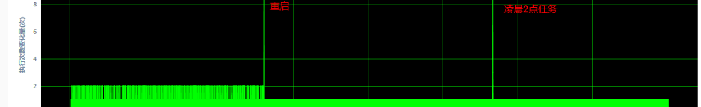

# JVM案例剖析

## 案例一：内存泄漏

现象：堆内存使用不断增加，且FullGC后堆内存占用仍然较多。•分析工具：”jmap-dump:live,format=b,file=/dump.hprof<pid>”导出内存快照，然后等待内存上涨，再导出一份快照，使用JVisualVM打开两份快照，比较增加的实例数，找出增长较多的类，分析类名称和属性数据，确定泄漏的具体类，最好是应用创建的类，定位创建这些类的代码，检查是否有资源未关闭情况。结论：判断是否内存泄漏关键是看FullGC后内存是否回收，定位问题关键是找到泄漏的具体类

## 案例二：Xms过小

现象：YGC比较频繁（一般应用YGC频率2~3次/分钟），且发生GC时，年轻代内存使用率不高。

分析：检查内存配置参数，Xms配置较小，导致jvm尽量维持堆内存使用不超过Xms，进尔频繁YGC

## 案例三：G1 Region过小(G1 Humongous Allocation)

现象：使用G1回收器，YGC比较频繁但年轻代内存使用率不高。

分析：打开GC日志，发现GC频繁时发生了Humongous Allocation，导致对象直接进入老年代，造成老年代过快增长，最终触发多次mixed GC。调整-XX:G1HeapRegionSize=8m，GC明显减少。

结论：G1默认将堆内存分成2048块，如果容器堆内存不大，则每个Region也会比较小，当应用创建对象大于Region一半大小时，G1认为是巨型对象，会直接在老年代创建，因此需要根据容器情况，配置G1HeapRegionSize

2019-11-21T09:43:14.679+0800: 86133.898: [GC pause (G1 Humongous Allocation) (young) (initial-mark), 0.0342845 secs]

2019-11-21T09:43:21.219+0800: 86140.438: [GC pause (G1 Evacuation Pause) (young), 0.0135553 secs]

2019-11-21T09:43:27.489+0800: 86146.708: [GC pause (G1 Evacuation Pause) (mixed), 0.0108471 secs]

2019-11-21T09:43:34.627+0800: 86153.846: [GC pause (G1 Evacuation Pause) (mixed), 0.0081566 secs]

2019-11-21T09:43:42.152+0800: 86161.371: [GC pause (G1 Evacuation Pause) (mixed), 0.0144550 secs]

2019-11-21T09:43:49.252+0800: 86168.471: [GC pause (G1 Evacuation Pause) (mixed), 0.0219709 secs]

2019-11-21T09:43:56.056+0800: 86175.275: [GC pause (G1 Evacuation Pause) (mixed), 0.0096957 secs]

## 案例四：第三方框架触发FullGC

现象：内存使用率不高，但频繁发生FullGC。

分析：堆内存使用、回收正常，且发生的都是FullGC，怀疑是应用程中调用了System.gc()，检查代码未发现，分析是第三方jar导致，反编译代码搜索，发现解析excel的jxl包中确实有调用。

结论：System.gc() 可以通过前述的参数屏蔽，但要当心因为堆内对象不能及时回收，而导致堆外内存不能释放问题

