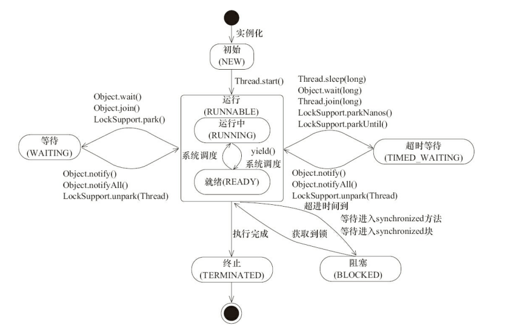
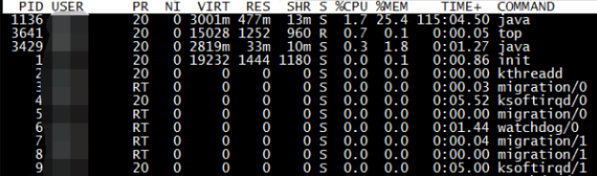
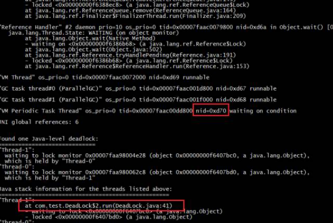
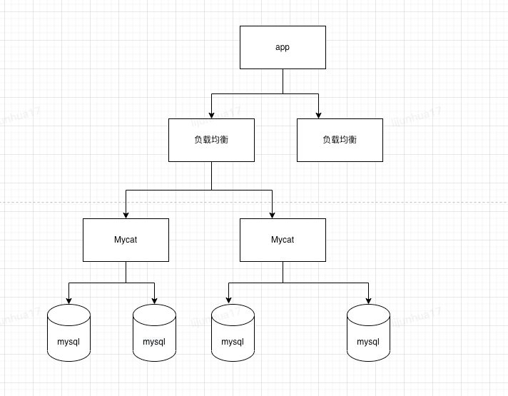
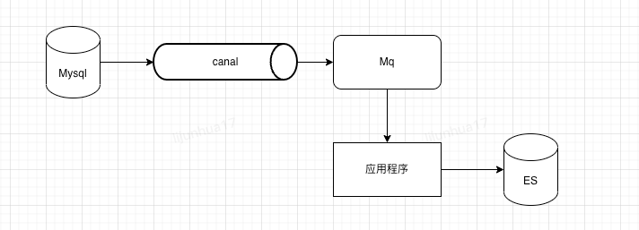
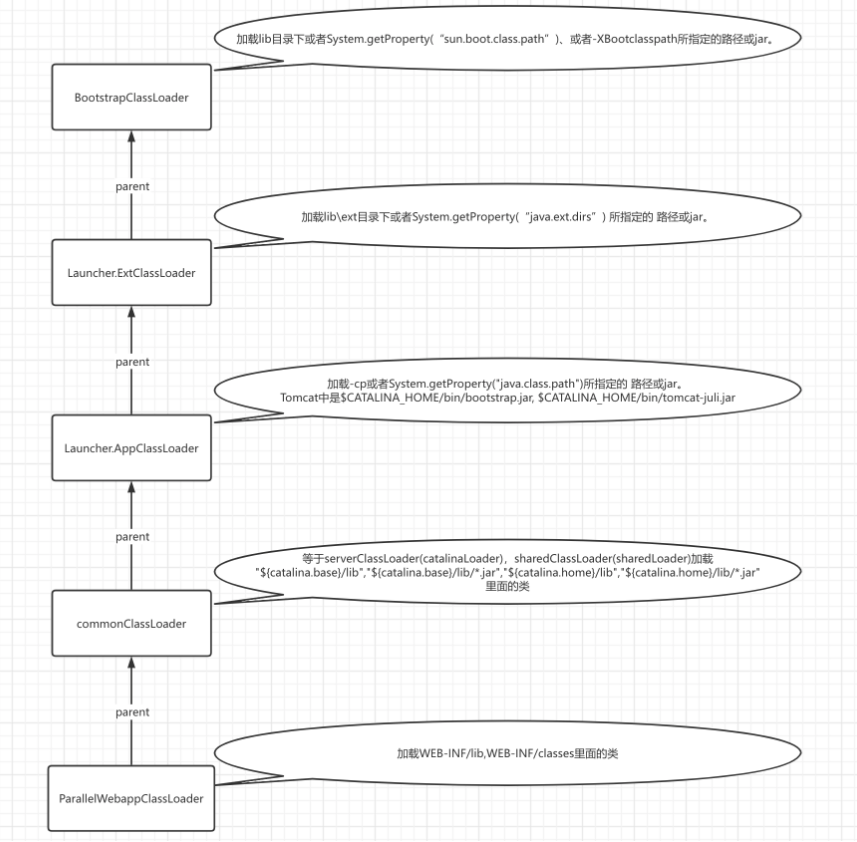
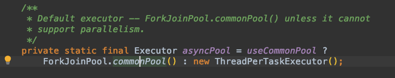

[TOC]


# 线上问题记录

## 常规问题

### 问题：长时间停顿、接口超时、线程内逻辑不执行以及CPU占用率过高等线程问题

使用：jstack命令结合线程状态使用。生成JVM当前的线程的快照

#### 线程状态



1. 使用jps、ps -ef | grep java查看当前java进程的pid，严重情况下可以使用top命令查看当前系统cpu/内存使用率最高的进程pid。



这里我们的死锁的pid是：3429，这里程序很简单，虽然程序死锁，没有占用很多资源。

2. 使用top -Hp 3429命令查看进程里面占用最多的资源的线程。


这里我们看到的占用最多资源的线程是：3440。

3. 使用命令printf "%x\n" 3440 把线程pid转换成16进制数，得到：d70。

4. 使用jstack 3429 | grep -20 d70命令查询该线程阻塞的地方。



到这里就基本跟踪完毕，去代码所在行看看为什么死锁吧。

#### 真正的线上问题的场景

1. 我们man端任务偶发性任务不行，偶尔执行，偶尔不执行
2. 机器假死（不处理Http请求），但是进程依然存活

#### 小结

1. jps、ps -ef | grep java查看当前java进程的pid
2. 使用top -Hp XXX命令查看进程里面占用最多的资源的线程。
3. 使用命令printf "%x\n" 3440 把线程pid转换成16进制数
4. 使用jstack 3429 | grep -20 d70命令查询该线程或者使用stack

### 问题：内存溢出

使用MAT等堆内存分析工具处理即可

### 问题：事务失效问题

问题：线上事务内的两条数据不一致

前置知识：[Spring的事务结合Mybatis源码详解](docs/source-code-analysis/Spring/Spring的事务结合Mybatis源码详解.md)

结论：Mybatis的SqlSessionFactory中的dataSource要和Spring的DataSourceTransactionManager中的dataSource是一个引用，否则导致事务不生效，因为是使用Threadlocal上是根据dataSource来获取相同的connect来保证使用的是一个数据库连接来保证事务的特性。

### 问题：Mysql：偶发性通信链路失效的问题

问题：偶发性通信链路故障

背景：内网环境下，不涉及NAT以及路由器，请求Mysql集群

前置知识：Mysql的JDBC以及Druid的连接池 详见[Mysql的JDBC驱动源码解析](docs/source-code-analysis/数据库连接/Mysql的JDBC驱动源码解析.md)]、[Druid数据库连接池源码解析](docs/source-code-analysis/数据库连接/Druid数据库连接池源码解析.md)，Mysql集群的模型



分析过程：

首先确保本app的数据库连接的保活机制没有问题，但是由于mysql集群存在负载均衡，而负载均衡存在保活机制（固定时间剔除没有请求的连接）可能剔除连接

结论：最终定位到负载均衡剔除连接的问题

### 问题：canal：ES与数据库数据不一致

背景：ES与数据库数据不一致导致订单状态暂停，利用数据库+canal+mq+应用代码处理同步到ES，其中canal同步数据见[Canal数据同步](docs/database/mysql/Canal数据同步.md)



问题原因：断网演练导致canal假死

解决方案：canal假死但是offset依赖存在，mysql的binlog也没有清理，设置下offset重新同步即可

展望：目前canal支持直接把数据同步到ES等

### 问题：Redis：产生大量无效的key

背景：大促压测导致压进去大量无效的key，影响线上Redis的稳定以及下一次压测。

前置知识：SCAN 命令是一个基于游标的迭代器，每次被调用之后， 都会向用户返回一个新的游标， 用户在下次迭代时需要使用这个新游标作为 SCAN 命令的游标参数， 以此来延续之前的迭代过程。

解决方案：使用SCAN命令在不阻塞redis的情况下清楚所有的无效的Key

### 问题：MQ：消息没有手动确认

背景：几乎所有的mq都会有持久化（kafka的0.11之后可以通过配置来保证CP，来实现消息不丢失）来保存消费过的消息

解决方案：可以联系消息管理员进行offset重置，但是有个前提mq的消费逻辑要保证幂等（通常mq要保证最少一次消费，所以基本都保证了幂等）


## 非常规问题

### 问题：流量较大造成mq大量积压


背景：大流量进来之后，产生大量订单，但是这些订单不需要代扣，扫描es拿到代扣任务之后，执行的时候（含有加锁解锁需要同步到es）发现不需要执行，代扣任务积压（执行的时候采用mq），之后又导致任务同步es的topic积压。观察任务流转中断卡在待支付状态

临时解决方案：加机器？解决不了；并行消费？可能导致消息乱序也不行；最终暂停任务，让mq逐渐消费，防止继续积压

最终解决方案：将代扣规从执行的位置转移到扫描的位置，如上图


### 问题：运行中的机器有的rpc接口正常有的抛异常（java.lang.NoClassDefFoundError）

**NoClassDefFoundError和ClassNotFoundException区别**

1. NoClassDefFoundError发生在JVM在动态运行时，根据你提供的类名，在classpath中找到对应的类进行加载，但当它找不到这个类时，就发生了java.lang.NoClassDefFoundError的错误
2. ClassNotFoundException是在编译的时候在classpath中找不到对应的类而发生的错误。

**Tomcat的类加载机制**



见[系列二：Tomcat类加载机制以及Context的初始化.md](docs/source-code-analysis/tomcat/系列二：Tomcat类加载机制以及Context的初始化.md)

#### 问题背景

供应链项目中，底层数据结构jar包升级，导致我们线上部分机器报异常，部分机器正常。

问题现象：
报错信息：could not initialize class，NoClassDefFoundError，这个错误信息是个error不是ClassNotFoundException那个编译时异常，而且没有堆栈信息看不到加载失败的原因。

#### 初步分析:
由于这个错误只有在第一次加载类的时候才会报出来错误信息，我拿到第一次报错之后发现原因是：BU类的静态方法中调用Thread.currentThread().getContextClassLoader()，ClassLoader为null导致的空指针，然后看调这个的代码发现是在ForkJoinPool连接池异步中调的，所以有这个问题

```java
protected InputStream getResourceAsStream(String resxPath) {
   Thread ct = Thread.currentThread();
   ClassLoader ccl = ct.getContextClassLoader();

  // NullPointerException 问题
   return ccl.getResourceAsStream(resxPath);
 }
```

#### 问题猜测：
异步造成的？这样就能解释为什么有的机器有问题有的机器没有问题呢？

#### 继续分析：
1. 本地搞个异步处理的，但是是成功的，在Tomcat中100%调用就能复现。
2. 分析contextClassLoader的赋值逻辑，新建线程的时候contextClassLoader为父线程的contextClassLoader。
3. 处理请求的Http线程的contextClassLoader是ParallelWebappClassLoader，（Tomcat中指定的）
4. 加载StanderdContext的线程的contextClassLoader是ParallelWebappClassLoader
5. 所以理论来说，在Tomcat的应用中不指定的话，能拿到的父线程为contextClassLoader为ParallelWebappClassLoader，那么所有的线程上的contextClassLoader为ParallelWebappClassLoader

#### 问题猜测：
Tomcat重写了ForkJoinPool创建线程池工厂？

#### 继续分析：
debug分析，发现Tomcat重写ForkJoinPool的线程池工厂，把contextClassLoader设置为null导致的

```java
    private static class SafeForkJoinWorkerThread extends ForkJoinWorkerThread {

        protected SafeForkJoinWorkerThread(ForkJoinPool pool) {
            super(pool);
            setContextClassLoader(ForkJoinPool.class.getClassLoader());
        }
    }
```

#### 继续分析：

1. Tomcat加载ServletContainerInitializer、filter、servlet、listener类时指定加载器都是ParallelWebappClassLoader
2. 由于没有指定类加载器时，类的加载器使用的是加载该类的加载器；在DispatcherServlet的init方法中，初始化Spring的单例池，所以容器中的Bean的类加载器默认是ParallelWebappClassLoader（在不指定类加载器的情况下）
3. 所以在Tomcat应用中加载类的类加载器几乎都是ParallelWebappClassLoader（除了JRE的类以及Tomcat的相关的类，在不指定类加载器的情况下），使用ParallelWebappClassLoader来加载ForkJoinPool，ForkJoinPool 是属于rt.jar包的类，由BootStrap ClassLoader加载，所以对应的类加载器为null

#### 最终原因：

在Tomcat中重写ForkJoinPool的线程池工厂，把contextClassLoader设置为null导致的

#### 疑问

**为什么有的机器没有问题，有的机器有问题**

1. 没有问题的原因是：没有使用CompletableFuture.supplyAsync来第一次加载Bu，例如在Tomcat的处理请求的线程池中加载Bu，处理请求的线程的contextClassLoader是ParallelWebappClassLoader，在RPC线程池（使用的是ThreadPoolExecutor）中加载BU，处理请求的线程的contextClassLoader是ParallelWebappClassLoader，都不是null，所有没有问题
2. 有问题的原因：使用CompletableFuture.supplyAsync来第一次加载Bu，之后加载BU的时候直接就报错啦

**改为同步可以吗**

1. 不一定，如果是在RPC请求里面加载的BU，RPC的线程池如果是ForkJoinPool的话还是有问题

**单元测试为什么复现失败原因**

Javase中main线程的contextClassLoader为AppClassLoader，且 ForkJoinWorkerThreadFactory没有被复写，拿到的ForkJoinWorkerThread的contextClassLoader为AppClassLoader，而Tomcat使用的是ParallelWebappClassLoader且使用SafeForkJoinWorkerThreadFactory，导致使用ForkJoinPool线程池时，拿到的ForkJoinWorkerThread的contextClassLoader为null。

**Tomcat使用SafeForkJoinWorkerThreadFactory原因**

Tomcat的热部署需要卸载类及这个类的加载器ParallelWebappClassLoader，如果使用jdk的ForkJoinWorkerThreadFactory，ForkJoinWorkerThreadFactory会有一个contextClassLoader指向ParallelWebappClassLoader，导致ParallelWebappClassLoader无法被卸载

#### 解决方案

改为同步流程，正确吗？
不一定，RPC里面调的接口，RPC的线程如果是ForkJoinPool的线程还是有问题

最终解决方案：
在ApplicationListener中加载这个类。
这个会不会有问题呢？因为加载StanderdContext的线程的contextClassLoader是ParallelWebappClassLoader，所以不是null，不会报空指针


### 问题：部分接口性能差，导致机器整体性能变差

背景：RPC中异步调用性能及其差的接口（从大数据平台读数据）上线之后，大促压测时期机器的整体的接口性能变差

前置知识：[通用RPC方案](docs/source-code-analysis/Netty/通用RPC方案.md)

可能原因：RPC接口的线程池满？异步线程使用不对



解决方案：分析RPC客户端，确认客户端方案，排除RPC线程池满的问题，最终修改异步线程的用法

最终原因：异步线程的ForkJoinPool是JVM维度唯一的


### 问题：偶发性依赖接口超时的问题

#### 问题背景

使用G1垃圾回收期之后，压测时还是出现tp抖动的情况的问题。

#### 前置知识

Mysql的JDBC以及Druid的连接池 详见[Mysql的JDBC驱动源码解析](docs/source-code-analysis/数据库连接/Mysql的JDBC驱动源码解析.md)  、[Druid数据库连接池源码解析](docs/source-code-analysis/数据库连接/Druid数据库连接池源码解析.md)、G1垃圾回收参数

线上垃圾回收参数：**使用G1**

```java
export JAVA_OPTS="-Djava.library.path=/usr/local/lib -server -Xms8192m -Xmx8192m -XX:MetaspaceSize=256m -XX:MaxMetaspaceSize=512m -XX:+UnlockExperimentalVMOptions -XX:+UseG1GC -XX:ParallelGCThreads=8 -XX:ConcGCThreads=4 -XX:CICompilerCount=4 -XX:MaxGCPauseMillis=150 -Djava.awt.headless=true -Dsun.net.client.defaultConnectTimeout=60000 -Dsun.net.client.defaultReadTimeout=60000 -Djmagick.systemclassloader=no -Dnetworkaddress.cache.ttl=300 -Dsun.net.inetaddr.ttl=300 -XX:+HeapDumpOnOutOfMemoryError -XX:HeapDumpPath=/export/Logs/"
```

#### 问题现象：

qps达到500时，cpu达到56%左右，持续一段时间后，再进行压测出现接口可用率降低，但是依赖接口没有波动，怀疑是GC导致。

#### 问题排查：

jvm参数中加入打印GC日志参数，下载了GC日志，最终分析得到了 GC时间超过3.7秒的监控结果，这也是问题的根源

关键GC日志

```java
[GC ref-proc, 3.7471488 secs] 2023-06-03T14:40:35.372+0800: 184752.094: [Unloading, 0.0254883 secs], 3.7778434 secs] [Times: user=3.88 sys=0.05, real=3.77 secs] 
```

#### 分析过程：

dump分析发现，NonRegisteringDriver 对象确实占内存比较多，其中成员变量connectionPhantomRefs 占内存最多，里面存的是数据库连接的虚引用，其类型是 ConcurrentHashMap<ConnectionPhantomReference, ConnectionPhantomReference>，占比居然有88%之多。具体看[Mysql的JDBC驱动源码解析](docs/source-code-analysis/数据库连接/Mysql的JDBC驱动源码解析.md) 。mysql使用该功能来清理关闭失败的网络连接

##### 疑问1：ConnectionPhantomReference多的原因？

每次新建一个数据库连接，都会把该连接放入connectionPhantomRefs集合中。超过空闲连接数的连接在空闲时间超过minEvictableIdleTimeMillis时间以及空闲时间超过maxEvictableIdleTimeMillis后会被废弃，在connectionPhantomRefs集合中等待回收。因为连接资源一般存活时间比较久，经过多次Young GC,一般都能存活到老年代。如果这个数据库连接对象本身在老年代，connectionPhantomRefs中的元素就会一直堆积，直到下次 mixed gc。如果等到mixed gc 的时候connectionPhantomRefs集合的元素非常多，该次mixed gc的GC ref-proc就会非常耗时。

##### 疑问2：MySQL为什么要使用虚引用来解决IO资源回收问题？

MySQL 使用虚引用来解决 IO 资源回收问题，主要是因为 JDBC 连接对象在关闭连接时无法保证其底层网络资源会被立即释放。这可能会导致底层网络资源长时间占用，最终导致应用程序出现性能下降或者资源耗尽的情况。

使用虚引用的好处在于，它允许程序在对象从内存中删除后执行特定任务。 MySQL 驱动程序利用 Java 提供的引用队列机制，将 JDBC 连接对象的虚引用加入到队列中。一旦连接对象被垃圾回收，JVM 会将它加入到引用队列中等待进一步处理。此时，MySQL 驱动程序通过监视引用队列并清理底层网络资源，确保这些资源在连接对象被垃圾回收时被正确地释放，从而避免了底层网络资源长时间占用的问题。

使用虚引用的优点在于可以实现更精细的内存管理和资源回收，提高应用程序的可靠性和性能。

##### 疑问3：那MySQL是怎样执行最终的IO资源回收的呢，是使用了定时任务还是异步守护线程？

MySQL 在执行最终的 IO 资源回收时，使用了异步守护线程来清理底层网络资源。

MySQL 驱动程序将 JDBC 连接对象的虚引用加入到引用队列中后，会创建一个专门的守护线程来监视该引用队列。当连接对象被垃圾回收并加入到引用队列中后，守护线程会从引用队列中获取该连接对象的虚引用，并在后台线程中执行与连接相关的底层网络资源清理工作。

MySQL 使用异步守护线程来执行 IO 资源回收工作，这种方式可以确保底层网络资源的及时释放，并且不会对应用程序的性能产生负面影响。

##### 疑问4：G1的MaxGCPauseMillis是否严格遵守，为什么我配置了-XX:MaxGCPauseMillis=150 本次gc时间还是达到了3秒以上？

G1 的 `-XX:MaxGCPauseMillis` 参数表示 G1 GC 的最大 STW 时间，即如果单次 GC 暂停时间超过该值，则 G1 会尽可能地调整其行为以达到该目标。但是请注意，该参数是一个指导性的参数，不能保证绝对精度。

在实际应用中，由于应用程序和系统的负载情况、堆内存大小等因素的影响，GC 的发生和 STW 时间都可能会出现一定程度的波动和不确定性。因此，单次 GC 暂停时间超过 `-XX:MaxGCPauseMillis` 配置值是有可能发生的，而且这种情况在高负载或堆内存使用较高时更容易出现。

##### 疑问5：监控中为啥出现了多次mixed GC， 而且间隔还如此的短

-XX:G1MixedGCCountTarget，默认为8，这个参数标识最后的混合回收阶段会执行8次，一次只回收掉一部分的Region，然后系统继续运行，过一小段时间之后，又再次进行混合回收，重复8次。执行这种间断的混合回收，就可以把每次的混合回收时间控制在我们需要的停顿时间之内了，同时达到垃圾清理的效果。清理了 7 次就已经满足了回收效果，所以没有继续 mixed GC。

以上是为了：MaxGCPauseMillis 停顿时间控制在期望范围内，所以会出现多次间隔很短连续的mixed GC.

#### 解决方案

1. 调整JVM参数增加两个参数-XX:+ParallelRefProcEnabled -XX:G1MixedGCLiveThresholdPercent=60
2. druid连接池不要设置maxEvictableIdleTimeMillis，防止空闲连接建立连接后再关闭连接，导致内存升高引发mixed gc，详见：[Druid数据库连接池源码解析](docs/source-code-analysis/数据库连接/Druid数据库连接池源码解析.md)

**参数：ParallelRefProcEnabled （并行引用处理开启）**

经过核查应用确认为G1GC 参数配置不当，未开启ParallelRefProcEnabled（并行引用处理）JDK8需要手动开启，JDK9+已默认开启。 导致G1 Final Remark阶段使用单线程标记（G1混合GC的时候，STW约为2~3秒)；

**最终参数**

```java
export JAVA_OPTS="-Djava.library.path=/usr/local/lib -server -Xms8192m -Xmx8192m -XX:MetaspaceSize=256m -XX:MaxMetaspaceSize=512m -XX:+UnlockExperimentalVMOptions -XX:+UseG1GC -XX:ParallelGCThreads=8 -XX:ConcGCThreads=4 -XX:CICompilerCount=4 -XX:G1HeapRegionSize=8m -XX:MaxGCPauseMillis=150  -XX:+ParallelRefProcEnabled -Djava.awt.headless=true -Dsun.net.client.defaultConnectTimeout=60000 -Dsun.net.client.defaultReadTimeout=60000 -Djmagick.systemclassloader=no -Dnetworkaddress.cache.ttl=300 -Dsun.net.inetaddr.ttl=300 -XX:+HeapDumpOnOutOfMemoryError -XX:HeapDumpPath=/export/Logs/"
```


## 参考

https://mp.weixin.qq.com/s/nRTBJKzgaGqR_M3JYwXyyQ

https://juejin.cn/post/6844904175571042312