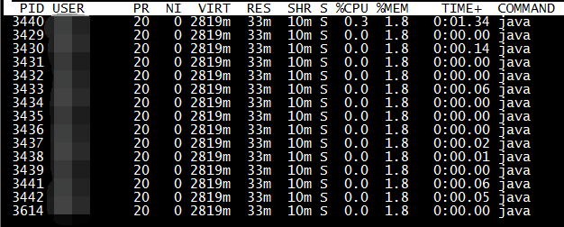

[TOC]


# 线上问题记录

## 常规问题

### 问题：长时间停顿、接口超时、线程内逻辑不执行以及CPU占用率过高等线程问题

使用：jstack命令结合线程状态使用。生成JVM当前的线程的快照

#### 线程状态


1. 使用jps、ps -ef | grep java查看当前java进程的pid，严重情况下可以使用top命令查看当前系统cpu/内存使用率最高的进程pid。


这里我们的死锁的pid是：3429，这里程序很简单，虽然程序死锁，没有占用很多资源。

2. 使用top -Hp 3429命令查看进程里面占用最多的资源的线程。



这里我们看到的占用最多资源的线程是：3440。

3. 使用命令printf "%x\n" 3440 把线程pid转换成16进制数，得到：d70。

4. 使用jstack 3429 | grep -20 d70命令查询该线程阻塞的地方。


到这里就基本跟踪完毕，去代码所在行看看为什么死锁吧。

#### 真正的线上问题的场景

1. 我们man端任务偶发性任务不行，偶尔执行，偶尔不执行
2. 机器假死（不处理Http请求），但是进程依然存活

#### 小结

1. jps、ps -ef | grep java查看当前java进程的pid
2. 使用top -Hp XXX命令查看进程里面占用最多的资源的线程。
3. 使用命令printf "%x\n" 3440 把线程pid转换成16进制数
4. 使用jstack 3429 | grep -20 d70命令查询该线程或者使用stack

### 问题：内存溢出

使用MAT等堆内存分析工具处理即可

### 问题：事务失效问题

问题：线上事务内的两条数据不一致

前置知识：[Spring的事务结合Mybatis源码详解](docs/source-code-analysis/Spring/Spring的事务结合Mybatis源码详解.md)

结论：Mybatis的SqlSessionFactory中的dataSource要和Spring的DataSourceTransactionManager中的dataSource是一个引用，否则导致事务不生效，因为是使用Threadlocal上是根据dataSource来获取相同的connect来保证使用的是一个数据库连接来保证事务的特性。

### 问题：Mysql：偶发性通信链路故障的问题

问题：偶发性通信链路故障

背景：内网环境下，不涉及NAT以及路由器，请求Mysql集群

前置知识：Mysql的JDBC以及Druid的连接池 详见[Mysql的JDBC驱动源码解析](docs/source-code-analysis/数据库连接/Mysql的JDBC驱动源码解析.md)[Druid数据库连接池源码解析](docs/source-code-analysis/数据库连接/Druid数据库连接池源码解析.md)，Mysql集群的模型


分析过程：

首先确保本app的数据库连接的保活机制没有问题，但是由于mysql集群存在负载均衡，而负载均衡存在保活机制（固定时间剔除没有请求的连接）可能剔除连接

结论：最终定位到负载均衡剔除连接的问题

### 问题：canal：ES与数据库数据不一致

背景：ES与数据库数据不一致导致订单状态暂停，利用数据库+canal+mq+应用代码处理同步到ES，其中canal同步数据见[Canal数据同步](docs/database/mysql/Canal数据同步.md)


问题原因：断网演练导致canal假死

解决方案：canal假死但是offset依赖存在，mysql的binlog也没有清理，设置下offset重新同步即可

展望：目前canal支持直接把数据同步到ES等

### 问题：Redis：产生大量无效的key

背景：大促压测导致压进去大量无效的key，影响线上Redis的稳定以及下一次压测。

前置知识：SCAN 命令是一个基于游标的迭代器，每次被调用之后， 都会向用户返回一个新的游标， 用户在下次迭代时需要使用这个新游标作为 SCAN 命令的游标参数， 以此来延续之前的迭代过程。

解决方案：使用SCAN命令在不阻塞redis的情况下清楚所有的无效的Key

### 问题：MQ：消息没有手动确认

背景：几乎所有的mq都会有持久化（kafka的0.11之后可以通过配置来保证CP，来实现消息不丢失）来保存消费过的消息

解决方案：可以联系消息管理员进行offset重置，但是有个前提mq的消费逻辑要保证幂等（通常mq要保证最少一次消费，所以基本都保证了幂等）


## 非常规问题

### 问题：流量较大造成mq大量积压


背景：大流量进来之后，产生大量订单，但是这些订单不需要代扣，扫描es拿到代扣任务之后，执行的时候（含有加锁解锁需要同步到es）发现不需要执行，代扣任务积压（执行的时候采用mq），之后又导致任务同步es的topic积压。观察任务流转中断卡在待支付状态

临时解决方案：加机器？解决不了；并行消费？可能导致消息乱序也不行；最终暂停任务，让mq逐渐消费，防止继续积压

最终解决方案：将代扣规从执行的位置转移到扫描的位置，如上图


### 问题：运行中的机器有的rpc接口正常有的抛异常（java.lang.NoClassDefFoundError）

**NoClassDefFoundError和ClassNotFoundException区别**

1. NoClassDefFoundError发生在JVM在动态运行时，根据你提供的类名，在classpath中找到对应的类进行加载，但当它找不到这个类时，就发生了java.lang.NoClassDefFoundError的错误
2. ClassNotFoundException是在编译的时候在classpath中找不到对应的类而发生的错误。

**Tomcat的类加载机制**


#### 问题背景

供应链项目中，底层数据结构jar包升级，导致我们线上部分机器报异常，部分机器正常。

问题现象：
报错信息：could not initialize class，NoClassDefFoundError，这个错误信息是个error不是ClassNotFoundException那个编译时异常，而且没有堆栈信息看不到加载失败的原因。

#### 初步分析:
由于这个错误只有在第一次加载类的时候才会报出来错误信息，我拿到第一次报错之后发现原因是：BU类的静态方法中调用Thread.currentThread().getContextClassLoader()，ClassLoader为null导致的空指针，然后看调这个的代码发现是在ForkJoinPool连接池异步中调的，所以有这个问题

```java
protected InputStream getResourceAsStream(String resxPath) {
   Thread ct = Thread.currentThread();
   ClassLoader ccl = ct.getContextClassLoader();

  // NullPointerException 问题
   return ccl.getResourceAsStream(resxPath);
 }
```

#### 问题猜测：
异步造成的？这样就能解释为什么有的机器有问题有的机器没有问题呢？

#### 继续分析：
本地搞个异步处理的，但是是成功的，在Tomcat中100%调用就能复现

#### 问题猜测：
Tomcat的类加载机制的问题？

#### 继续分析：

1. Tomcat加载ServletContainerInitializer、filter、servlet、listener类时指定加载器都是ParallelWebappClassLoader
2. 处理请求的Http线程的contextClassLoader是ParallelWebappClassLoader，（Tomcat中指定的）
3. 加载StanderdContext的线程的contextClassLoader是ParallelWebappClassLoader
4. 由于没有指定类加载器时，类的加载器使用的是加载该类的加载器；在DispatcherServlet的init方法中，初始化Spring的单例池，所以容器中的Bean的类加载器默认是ParallelWebappClassLoader（在不指定类加载器的情况下）
5. 所以在Tomcat应用中能拿到的类加载器几乎都是ParallelWebappClassLoader（除了JRE的类以及Tomcat的相关的类，在不指定类加载器的情况下），由于新建线程的时候contextClassLoader为父线程的contextClassLoader，父线程的contextClassLoader为ParallelWebappClassLoader，那么从线程上的contextClassLoader为ParallelWebappClassLoader

#### 问题猜测：
Tomcat重写了ForkJoinPool创建线程池工厂

#### 继续分析：
debug分析，发现Tomcat重写ForkJoinPool的线程池工厂，把contextClassLoader设置为null导致的

#### 最终原因：
在Tomcat中重写ForkJoinPool的线程池工厂，把contextClassLoader设置为null导致的

#### 疑问

**为什么有的机器没有问题，有的机器有问题**

1. 没有问题的原因是：没有使用CompletableFuture.supplyAsync来第一次加载Bu，例如在Tomcat的处理请求的线程池中加载Bu，处理请求的线程的contextClassLoader是ParallelWebappClassLoader，在RPC线程池（使用的是ThreadPoolExecutor）中加载BU，处理请求的线程的contextClassLoader是ParallelWebappClassLoader，都不是null，所有没有问题
2. 有问题的原因：使用CompletableFuture.supplyAsync来第一次加载Bu，之后加载BU的时候直接就报错啦

**改为同步可以吗**

1. 不一定，如果是在RPC请求里面加载的BU，RPC的线程池如果是ForkJoinPool的话还是有问题

**单元测试为什么复现失败原因**

Javase中main线程的contextClassLoader为AppClassLoader，且 ForkJoinWorkerThreadFactory没有被复写，拿到的ForkJoinWorkerThread的contextClassLoader为AppClassLoader，而Tomcat使用的是ParallelWebappClassLoader且使用SafeForkJoinWorkerThreadFactory，导致使用ForkJoinPool线程池时，拿到的ForkJoinWorkerThread的contextClassLoader为null。

**Tomcat使用SafeForkJoinWorkerThreadFactory原因**

Tomcat的热部署需要卸载类及这个类的加载器ParallelWebappClassLoader，如果使用jdk的ForkJoinWorkerThreadFactory，ForkJoinWorkerThreadFactory会有一个contextClassLoader指向ParallelWebappClassLoader，导致ParallelWebappClassLoader无法被卸载

#### 解决方案

改为同步流程，正确吗？
不一定，RPC里面调的接口，RPC的线程如果是ForkJoinPool的线程还是有问题

最终解决方案：
在ApplicationListener中加载这个类。
这个会不会有问题呢？因为加载StanderdContext的线程的contextClassLoader是ParallelWebappClassLoader，所以不是null，不会报空指针


### 问题：部分接口性能差，导致机器整体性能变差

背景：RPC中异步调用性能及其差的接口（从大数据平台读数据）上线之后，大促压测时期机器的整体的接口性能变差

前置知识：[通用RPC方案](docs/source-code-analysis/Netty/通用RPC方案.md)

可能原因：RPC接口的线程池满？异步线程使用不对


解决方案：分析RPC客户端，确认客户端方案，排除RPC线程池满的问题，最终修改异步线程的用法

最终原因：异步线程的ForkJoinPool是JVM维度唯一的


## 参考

https://mp.weixin.qq.com/s/nRTBJKzgaGqR_M3JYwXyyQ