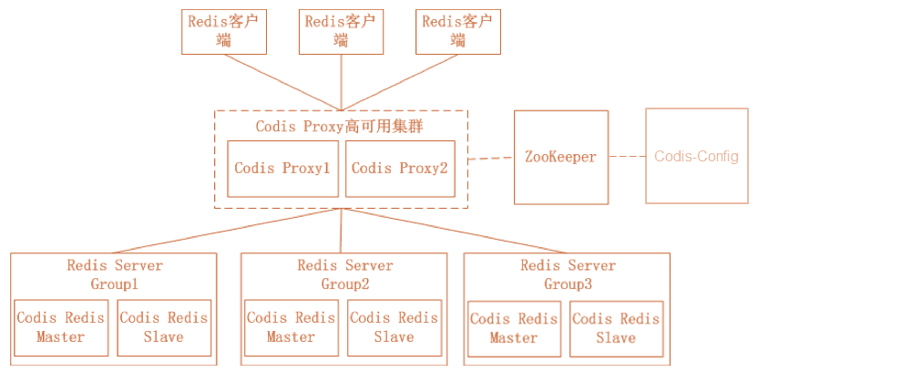
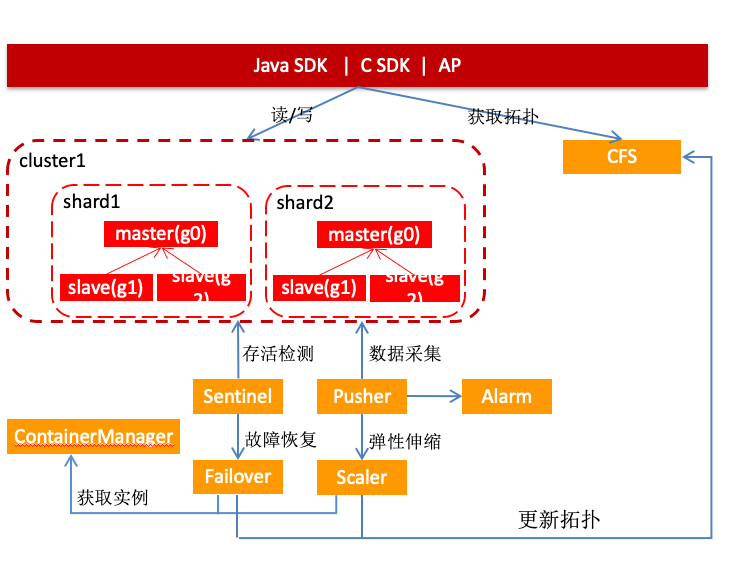

# JIMDB客户端


## JIMDB采用的集群模式


### Codis方案

Codis 是由豌豆荚开源的产品，涉及组件众多，其中 ZooKeeper 存放路由表和代理节点元数据、分发 Codis-Config 的命令；Codis-Config 是集成管理工具，有 Web 界面供使用；Codis-Proxy 是一个兼容 Redis 协议的无状态代理；Codis-Redis 基于 Redis 2.8 版本二次开发，加入 slot 支持，方便迁移数据。



### jimdb方案



### ## 处理逻辑

### 获取shard

```java
private String generateMethodBody(CtMethod abstractMethod, ShardClientType shardClientType) {
   return join("{", 
      "for(int i=0; i<$args.length; i++){",
      "  com.jd.jim.cli.util.Assert.notNull($args[i]);",
      "}",
      "if (destroyed.get()) {",
      "  throw new com.jd.jim.cli.exception.IllegalOperationException(" +
            "\"The cluster has been destroyed,no longer able to execute command.\");",
      "}",
      "com.jd.jim.cli.topology.Shard shard = shardClientSupplier.getShard($1);",
      "com.jd.jim.cli.core.", shardClientType.getClassName(),
         " shardClient = shardClientSupplier.", shardClientType.getMethodName(), "(shard);",
      "return shardClient.", abstractMethod.getName(), "($$);",
      "}");
}
```

```java
protected ShardClientForString getShardClientForString(final String... keys) {
    if (keys == null || keys.length == 0) {
        return null;
    }

    byte[] routeKey = SafeEncoder.extractRouteKey(keys[0], context.getUseKeyTag());

    if (keys.length > 1) {
        for (int index = 1; index < keys.length; index++) {
            byte[] extractRouteKey = SafeEncoder.extractRouteKey(keys[index], context.getUseKeyTag());

            if (!StringUtils.equals(new String(extractRouteKey), new String(routeKey))) {
                throw new IllegalOperationException("Only support single key or use same hashTag");
            }
        }
    }
    Shard shard = this.shardClientSupplier.getShard(keys[0]);
    return this.shardClientSupplier.shardClientForString(shard);
}
```


1. 利用javaassist获得key对应的slot的shard的分片

### 发消息

```java
public Boolean set(String key, String value, long timeout, TimeUnit unit, boolean exist) {
    return syncExecute(commandBuilder.set(key, value, timeout, unit, exist));
}
```

```java
protected <T> T syncExecute(JimCommand<K, V, T> cmd) {
    if (cmd == null) {
        return null;
    }
    try {
        JimFuture<T> jimFuture = executeOneway(cmd, true);
        // executeOneway(cmd, true)里包含get阻塞逻辑,所以此处timeout==0
        return jimFuture.get(0, TimeUnit.MILLISECONDS);
    } catch (Throwable e) {
        UnitRouterUtil.judgeIsUnitException(e);
        String errorMsg = "";
        try {
            if (cmd.getKey() instanceof String) {
                errorMsg = String.format("%s command execute timeout:%d ms and key is %s", cmd.getMatrix(),
                        context.getTimeout(), cmd.getKey());
            } else if (cmd.getKey() instanceof byte[]) {
                errorMsg = String.format("%s command execute timeout:%d ms and key is %s", cmd.getMatrix(),
                        context.getTimeout(), new String((byte[]) cmd.getKey()));
            } else {
                errorMsg = String.format("%s command execute timeout:%d ms", cmd.getMatrix(),
                        context.getTimeout());
            }
        } catch (Throwable throwable) {
            //ignore
        }
        throw new CommandExecutionException(errorMsg, e);
    }
}
```

```java
private <T> JimFuture<T> executeWriteOneway(JimCommand<K, V, T> cmd, boolean isSync) {
    Instance key = shard.getWriteableNode();
    cmd.setMatrix(key.toString());
    JimConnection conn = connectionSupplier.getOrCreate(key);

    JimFuture<T> jimFuture = conn.sendCommand(cmd,isSync);

    if (isSync) {
        try {
            jimFuture.get(Math.max(0, context.getTimeout()), TimeUnit.MILLISECONDS);
        } catch (Exception e) {
            cmd.cancel(true);
            throw new RuntimeException(e);
        }
    }
    return jimFuture;
}
```


```java
public <K, V, T> JimCommand<K, V, T> write(JimCommand<K, V, T> command) {
    checkArgument(command != null, "command must not be null");

    /**
     * autoFlush == false, 检查commandBuffer大小决定是否要flush
     */
    boolean needFlush = false;
    UnitRouterUtil.judgeIsCanWritable(this.jimContext,command);
    try {
        // fill ump caller for monitor
        fillUmpCaller(command);

        incrementWriters();

        if (lifecycleState == LifecycleState.CLOSED) {
            throw new CommandExecutionException("Connection is closed");
        }

        if (commandBuffer.size() + flushedBuffer.size() >= nettyOptions.getRequestQueueSize()) {
            //String errorMsg = String.format("%s Request queue size exceeded: %d", command.getMatrix(), nettyOptions.getRequestQueueSize());
            String errorMsg = String.format("%s Request queue size[commandBuffer size:%d,flushedBuffer size:%d] exceeded: %d", command.getMatrix(), commandBuffer.size(), flushedBuffer.size(), nettyOptions.getRequestQueueSize());
            throw new CommandExecutionException(errorMsg);
        }

        final Channel currentChannel = this.channel;
        checkOverWaterMark(currentChannel);

        if (autoFlush) {
            if (currentChannel != null && currentChannel.isActive() && isConnected()) {
                if (logger.isDebugEnabled()) {
                    logger.debug("{} write() writeAndFlush Command {}", logPrefix, command);
                }

                ChannelPromise promise = currentChannel.newPromise().addListener(new CommandWriteListener(flushedBuffer, command));
                currentChannel.writeAndFlush(command, promise);
            } else {
                if (commandBuffer.contains(command) || flushedBuffer.contains(command)) {
                    if (logger.isWarnEnabled()) {
                        logger.warn("{} command had contained {}", logPrefix, command, connectionError);
                    }
                    return command;
                }

                if (connectionError != null) {
                    if (logger.isErrorEnabled()) {
                        logger.error("{} write() completing Command {} due to connection connectionError", logPrefix, command, connectionError);
                    }
                    command.setException(connectionError);
                    command.cancel(true);
                    return command;
                }

                // TODO 增加开关,决定是否处理这些命令
                needFlush = bufferCommand(command);
                if (logger.isDebugEnabled()) {
                    logger.debug("{} connection is unconnected  write(), Command {}", logPrefix, command, connectionError);
                }
            }
        } else {
            needFlush = bufferCommand(command);
        }
    } finally {
        decrementWriters();
        if (logger.isDebugEnabled()) {
            logger.debug("{} write() done", logPrefix);
        }
    }

    if (needFlush) {
        flushCommands();
    }

    return command;
}
```


## 参考

https://cloud.tencent.com/developer/article/2076104

https://pdai.tech/md/db/nosql-redis/db-redis-x-cluster.html#codis


