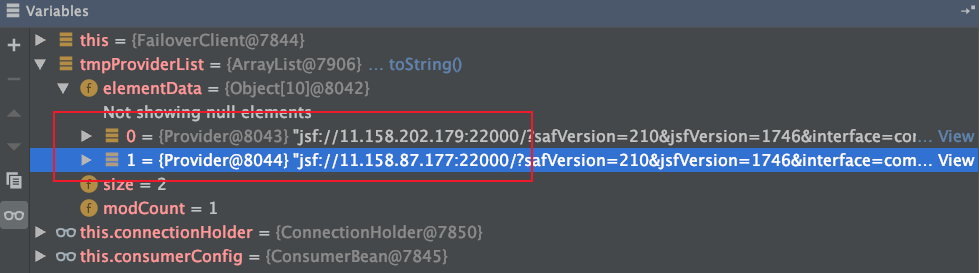
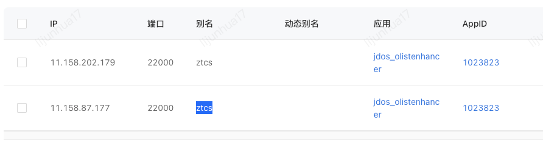
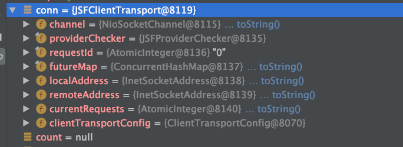

[TOC]

# JSF客户端方案

## provider端

1. 利用org.springframework.context.ApplicationListener#onApplicationEvent在Spring初始化的最后一步时绑定端口

   ```java
   public void onApplicationEvent(ApplicationEvent event) {
       if (event instanceof ContextRefreshedEvent && this.isDelay() && !this.exported && !CommonUtils.isUnitTestMode()) {
           LOGGER.info("JSF export provider with beanName {} after spring context refreshed.", this.beanName);
           if (this.delay < -1) {
               Thread thread = new Thread(new Runnable() {
                   public void run() {
                       try {
                           Thread.sleep((long)(-ProviderBean.this.delay));
                       } catch (Throwable var2) {
                       }
   
                       ProviderBean.this.export();
                   }
               });
               thread.setDaemon(true);
               thread.setName("DelayExportThread");
               thread.start();
           } else {
               this.export();
           }
       }
   
   }
   ```

    

2. 利用Netty将ServerSocketChannel绑定到boss 线程绑定端口

```java
public Boolean start() {
        boolean flag = Boolean.FALSE;
        logger.debug("JSF server transport start! ");
        Boolean reusePort = Boolean.FALSE;
        if (!Constants.isWindows) {
            reusePort = Boolean.TRUE;
        }

        this.serverBootstrap = new ServerBootstrap();
        ((ServerBootstrap)this.serverBootstrap.group(this.config.getParentEventLoopGroup(), this.config.getChildEventLoopGroup()).channel(NettyHelper.getServerSocketChannel(this.config.isUseEpoll()))).childHandler(new ServerChannelInitializer(this.config));
        ((ServerBootstrap)((ServerBootstrap)((ServerBootstrap)((ServerBootstrap)((ServerBootstrap)this.serverBootstrap.option(ChannelOption.CONNECT_TIMEOUT_MILLIS, this.config.getCONNECTTIMEOUT())).option(ChannelOption.SO_BACKLOG, this.config.getBACKLOG())).option(ChannelOption.ALLOCATOR, PooledBufHolder.getInstance())).option(ChannelOption.SO_REUSEADDR, reusePort)).option(ChannelOption.RCVBUF_ALLOCATOR, AdaptiveRecvByteBufAllocator.DEFAULT)).childOption(ChannelOption.SO_KEEPALIVE, this.config.isKEEPALIVE()).childOption(ChannelOption.TCP_NODELAY, this.config.isTCPNODELAY()).childOption(ChannelOption.ALLOCATOR, PooledBufHolder.getInstance()).childOption(ChannelOption.SO_RCVBUF, 1048576).childOption(ChannelOption.SO_SNDBUF, 1048576).childOption(ChannelOption.WRITE_BUFFER_LOW_WATER_MARK, this.config.getBufferLowWaterMark()).childOption(ChannelOption.WRITE_BUFFER_HIGH_WATER_MARK, this.config.getBufferHighWaterMark());
        ChannelFuture future = this.serverBootstrap.bind(new InetSocketAddress(this.config.getHost(), this.config.getPort()));
        ChannelFuture channelFuture = future.addListener(new ChannelFutureListener() {
            public void operationComplete(ChannelFuture future) throws Exception {
                if (future.isSuccess()) {
                    JSFServerTransport.logger.info("Server have success bind to {}:{}", JSFServerTransport.this.config.getHost(), JSFServerTransport.this.config.getPort());
                } else {
                    JSFServerTransport.logger.error("Server fail bind to {}:{}", JSFServerTransport.this.config.getHost(), JSFServerTransport.this.config.getPort());
                    JSFServerTransport.this.config.getParentEventLoopGroup().shutdownGracefully();
                    JSFServerTransport.this.config.getChildEventLoopGroup().shutdownGracefully();
                    throw new InitErrorException("Server start fail !", future.cause());
                }
            }
        });

        try {
            channelFuture.await(5000L, TimeUnit.MILLISECONDS);
            if (channelFuture.isSuccess()) {
                flag = Boolean.TRUE;
            }
        } catch (InterruptedException var6) {
            logger.error(var6.getMessage(), var6);
        }

        return flag;
    }
```

其中ServerChannelInitializer的initChannel为

```java
    protected void initChannel(SocketChannel ch) throws Exception {
        ch.pipeline().addLast(new ChannelHandler[]{this.connectionChannelHandler}).addLast(new ChannelHandler[]{new AdapterDecoder(this.serverChannelHandler, this.transportConfig.getPayload(), this.transportConfig.isTelnet(), this.transportConfig)});
    }
```


触发read事件时，在AdapterDecoder的decode方法的最后一个中加入ServerChannelHandler 继承 ChannelInboundHandlerAdapter

```java
protected void decode(ChannelHandlerContext ctx, ByteBuf in, List<Object> out) throws Exception {
    if (in.readableBytes() >= 2) {
        Short magiccode_high = in.getUnsignedByte(0);
        Short magiccode_low = in.getUnsignedByte(1);
        byte b1 = magiccode_high.byteValue();
        byte b2 = magiccode_low.byteValue();
        InetSocketAddress localAddress = (InetSocketAddress)ctx.channel().localAddress();
        InetSocketAddress remoteAddress = (InetSocketAddress)ctx.channel().remoteAddress();
        ChannelPipeline pipeline;
        if (this.isJSF((short)b1, (short)b2)) {
            LOGGER.info("Accept jsf connection {}", NetUtils.connectToString(remoteAddress, localAddress));
            pipeline = ctx.pipeline();
            pipeline.addLast("jsfFlushEnhance", new JsfFlushHandler());
            pipeline.addLast(new ChannelHandler[]{new JSFDecoder(this.payload)});
            pipeline.addLast(new ChannelHandler[]{new JSFEncoder()});
            pipeline.addLast(new ChannelHandler[]{new ServerCheckChannelHandler()});
            pipeline.addLast(new ChannelHandler[]{this.serverChannelHandler});
            pipeline.remove(this);
            pipeline.fireChannelActive();
        } else if (DubboAdapter.match(b1, b2)) {
            LOGGER.info("Accept dubbo connection {}", NetUtils.connectToString(remoteAddress, localAddress));
            pipeline = ctx.pipeline();
            pipeline.addLast(new ChannelHandler[]{new DubboDecoder(this.payload)});
            pipeline.addLast(new ChannelHandler[]{new DubboEncoder()});
            pipeline.addLast(new ChannelHandler[]{new ServerCheckChannelHandler()});
            pipeline.addLast(new ChannelHandler[]{this.serverChannelHandler});
            pipeline.remove(this);
            pipeline.fireChannelActive();
        } else if (this.isHttp(b1, b2)) {
            if (LOGGER.isTraceEnabled()) {
                LOGGER.trace("Accept http connection {}", NetUtils.connectToString(remoteAddress, localAddress));
            }

            pipeline = ctx.pipeline();
            pipeline.addLast("decoder", new HttpRequestDecoder());
            pipeline.addLast("http-aggregator", new HttpObjectAggregator(this.payload));
            pipeline.addLast("encoder", new HttpResponseEncoder());
            pipeline.addLast("traffic", new ServerCheckChannelHandler());
            pipeline.addLast("jsonDecoder", new HttpJsonHandler(this.serverChannelHandler.getServerHandler()));
            pipeline.remove(this);
        } else if (this.isGrpc(b1, b2)) {
            LOGGER.info("Accept grpc connection {}", NetUtils.connectToString(remoteAddress, localAddress));
            pipeline = ctx.pipeline();
            pipeline.addLast(new ChannelHandler[]{new ServerCheckChannelHandler()});
            pipeline.addLast(new ChannelHandler[]{GrpcServerChannelHandler.newHandler(this.transportConfig)});
            pipeline.remove(this);
        } else {
            LOGGER.info("Accept telnet connection {}", NetUtils.connectToString(remoteAddress, localAddress));
            pipeline = ctx.pipeline();
            pipeline.addLast(new ChannelHandler[]{new TelnetCodec()});
            pipeline.addLast(new ChannelHandler[]{new TelnetChannelHandler()});
            pipeline.remove(this);
            if (this.telnet) {
                pipeline.fireChannelActive();
            } else {
                ctx.channel().writeAndFlush("Sorry! Not support telnet");
                ctx.channel().close();
            }
        }

    }
}
```


### 收到消息时

继续处理read事件时，在ServerChannelHandler 的channelRead方法中使用线程池来处理读到的数据（可能是耗时操作）

创建线程池的操作

```java
private static synchronized ThreadPoolExecutor initPool(ServerTransportConfig transportConfig) {
    final int port = transportConfig.getPort();
    int maxPoolSize = transportConfig.getServerBusinessPoolSize();
    String poolType = transportConfig.getServerBusinessPoolType();
    int minPoolSize;
    char aliveTime;
    if ("fixed".equals(poolType)) {
        minPoolSize = maxPoolSize;
        aliveTime = 0;
    } else {
        if (!"cached".equals(poolType)) {
            throw new IllegalConfigureException(21401, "server.threadpool", poolType);
        }

        minPoolSize = 20;
        maxPoolSize = Math.max(minPoolSize, maxPoolSize);
        aliveTime = '\uea60';
    }

    String queueType = transportConfig.getPoolQueueType();
    int queueSize = transportConfig.getPoolQueueSize();
    boolean isPriority = "priority".equals(queueType);
    BlockingQueue<Runnable> configQueue = ThreadPoolUtils.buildQueue(queueSize, isPriority);
    NamedThreadFactory threadFactory = new NamedThreadFactory("JSF-BZ-" + port, true);
    RejectedExecutionHandler handler = new RejectedExecutionHandler() {
        private int i = 1;

        public void rejectedExecution(Runnable r, ThreadPoolExecutor executor) {
            if (this.i++ % 7 == 0) {
                this.i = 1;
                BusinessPool.LOGGER.warn("[JSF-23002]Task:{} has been reject for ThreadPool exhausted! pool:{}, active:{}, queue:{}, taskcnt: {}", new Object[]{r, executor.getPoolSize(), executor.getActiveCount(), executor.getQueue().size(), executor.getTaskCount()});
            }

            RpcException err = new RpcException("[JSF-23003]Biz thread pool of provider has bean exhausted, the server port is " + port, false, false);
            ProviderErrorHook.getErrorHookInstance().onProcess(new ProviderErrorEvent(err));
            throw err;
        }
    };
    LOGGER.debug("Build " + poolType + " business pool for port " + port + " [min: " + minPoolSize + " max:" + maxPoolSize + " queueType:" + queueType + " queueSize:" + queueSize + " aliveTime:" + aliveTime + "]");
    return new ThreadPoolExecutor(minPoolSize, maxPoolSize, (long)aliveTime, TimeUnit.MILLISECONDS, configQueue, threadFactory, handler);
}
```

线程池的绑定维度

```java
public BaseServerHandler(ServerTransportConfig transportConfig) {
    this.serverTransportConfig = transportConfig;
    this.bizThreadPool = BusinessPool.getBusinessPool(this.serverTransportConfig);
}

public static ThreadPoolExecutor getBusinessPool(ServerTransportConfig transportConfig) {
        int port = transportConfig.getPort();
        ThreadPoolExecutor pool = (ThreadPoolExecutor)poolMap.get(port);
        if (pool == null) {
            pool = (ThreadPoolExecutor)CommonUtils.putToConcurrentMap(poolMap, port, initPool(transportConfig));
        }

        return pool;
    }

```

所以线程池是和端口绑定的


从而来保证不会由于处理请求导致work线程全部耗尽，而出现等待的情况

最终利用反射调用方法

```java
void doRun() {
    try {
        long now = JSFContext.systemClock.now();
        Integer timeout = this.requestMessage.getClientTimeout();
        if (!(this.isDiscard = timeout != null && now - this.requestMessage.getReceiveTime() > (long)timeout)) {
            Protocol protocol = ProtocolFactory.getProtocol(this.requestMessage.getProtocolType(), this.requestMessage.getMsgHeader().getCodecType());
            Short consumerJsfVersion = (Short)this.requestMessage.getMsgHeader().getAttrByKey(HeadKey.jsfVersion);
            Byte consumerLanguage = (Byte)this.requestMessage.getMsgHeader().getAttrByKey(HeadKey.srcLanguage);

            try {
                if (consumerJsfVersion != null) {
                    RpcContext.getContext().setAttachment(".dstJsfVer", consumerJsfVersion);
                }

                if (consumerLanguage != null) {
                    RpcContext.getContext().setAttachment(".dstLan", consumerLanguage);
                }

                this.invocation = (Invocation)protocol.decode(this.requestMessage.getMsgBody(), Constants.INVOCATION_CLASS_NAME);
            } finally {
                if (consumerJsfVersion != null) {
                    RpcContext.getContext().removeAttachment(".dstJsfVer");
                }

                if (consumerLanguage != null) {
                    RpcContext.getContext().removeAttachment(".dstLan");
                }

            }

            this.requestMessage.setInvocationBody(this.invocation);
            TraceUtils.resumeTraceData(this.invocation);
            this.className = this.requestMessage.getClassName();
            this.methodName = this.requestMessage.getMethodName();
            this.aliasName = this.requestMessage.getRealAlias();
            this.processMonitorAttr();
            if (!ServerAuthHelper.isValid(this.className, this.aliasName, this.remoteAddress.getAddress())) {
                throw new RpcException(this.requestMessage.getMsgHeader(), "[JSF-23007]Fail to pass the server auth check in server: " + this.localAddress + ", May be your host in blacklist of server");
            }

            if (CallbackUtil.isCallbackRegister(this.className, this.methodName)) {
                CallbackUtil.msgHandle(this.requestMessage, this.channel);
            }

            this.invoker = this.serverHandler.getOwnInvoker(this.className, this.aliasName);
            if (this.invoker == null) {
                throw new RpcException(this.requestMessage.getMsgHeader(), 23006, "[JSF-23006]Cannot found invoker of " + BaseServerHandler.genInstanceName(this.className, this.aliasName) + " in channel:" + NetUtils.channelToString(this.remoteAddress, this.localAddress) + ", current invokers is " + this.serverHandler.getAllOwnInvoker().keySet());
            }

            this.invocation.addAttachment("_remote", this.remoteAddress);
            this.invocation.addAttachment("_local", this.localAddress);
            this.responseMessage = this.invoker.invoke(this.requestMessage);
            return;
        }

        logger.warn("[JSF-23008]Discard request cause by timeout after receive the msg: {}", this.requestMessage.getMsgHeader());
    } finally {
        TraceUtils.clearTraceData();
        this.requestMessage.release();
    }

}

private Object reflectInvoke(Object impl, Invocation invocation) throws NoSuchMethodException, ClassNotFoundException, InvocationTargetException, IllegalAccessException {
        Method method = this.providerConfig.getMethod(invocation.getMethodName());
        if (method == null) {
            throw new NoSuchMethodException(invocation.getClazzName() + "." + invocation.getMethodName());
        } else if (CompletableFuture.class.isAssignableFrom(method.getReturnType())) {
            AsyncContext asyncContext = RpcContext.getContext().startAsync();
            CompletableFuture<?> future = (CompletableFuture)method.invoke(impl, invocation.getArgs());
            future.whenComplete((ret, err) -> {
                if (err != null) {
                    asyncContext.fail(err);
                } else {
                    asyncContext.commit(ret);
                }

            });
            return null;
        } else {
            return method.invoke(impl, invocation.getArgs());
        }
    }

void write() {
        if (!this.isDiscard) {
            this.methodName = this.requestMessage.getMethodName();
            if (this.responseMessage != null && this.responseMessage.isError()) {
                ProviderErrorHook.getErrorHookInstance().onProcess(new ProviderErrorEvent(this.className, this.methodName, this.aliasName, this.channel.remoteAddress(), this.responseMessage.getException(), this.requestMessage));
            }

            Short consumerJsfVersion = (Short)this.requestMessage.getMsgHeader().getAttrByKey(HeadKey.jsfVersion);
            Byte consumerLanguage = (Byte)this.requestMessage.getMsgHeader().getAttrByKey(HeadKey.srcLanguage);
            ByteBuf buf = PooledBufHolder.getBuffer();

            try {
                if (consumerJsfVersion != null) {
                    RpcContext.getContext().setAttachment(".dstJsfVer", consumerJsfVersion);
                }

                if (consumerLanguage != null) {
                    RpcContext.getContext().setAttachment(".dstLan", consumerLanguage);
                }

                buf = ProtocolUtil.encode(this.responseMessage, buf);
            } finally {
                if (consumerJsfVersion != null) {
                    RpcContext.getContext().removeAttachment(".dstJsfVer");
                }

                if (consumerLanguage != null) {
                    RpcContext.getContext().removeAttachment(".dstLan");
                }

            }

            this.responseMessage.setMsg(buf);
            if (this.isMonitorOpen) {
                String ip = NetUtils.toIpString(this.localAddress);
                int port = this.localAddress.getPort();
                Monitor monitor = MonitorFactory.getMonitor(1, this.className, new Object[]{this.methodName, ip, port});
                if (monitor != null) {
                    boolean iserror = this.responseMessage.isError();
                    this.invocation.addAttachment("_input", this.requestMessage.getMsgHeader().getLength());
                    this.invocation.addAttachment("_output", buf.readableBytes() + 6);
                    this.invocation.addAttachment("_result", !iserror);
                    this.invocation.addAttachment("_protocol", ProtocolType.jsf.value() + "");
                    this.invocation.addAttachment("_waiting_biz_execute_elapsed", (this.beginRunningNano - this.createTimeNano) / 1000L);
                    if (!this.attrs.isEmpty()) {
                        this.invocation.addAttachments(this.attrs);
                    }

                    if (iserror) {
                        monitor.recordException(this.invocation, this.responseMessage.getException());
                    } else {
                        monitor.recordInvoked(this.invocation);
                    }
                }
            }

            RingBufferHolder serverRingBufferHolder = RingBufferHolder.getServerRingbuffer(this.className);
            if (serverRingBufferHolder != null) {
                this.responseMessage.setChannel(this.channel);
                serverRingBufferHolder.submit(this.responseMessage);
            } else {
                Future future1 = this.channel.writeAndFlush(this.responseMessage);
                final String channelString = NetUtils.channelToString(this.localAddress, this.remoteAddress);
                final int msgId = this.requestMessage.getMsgHeader().getMsgId();
                future1.addListener(new FutureListener() {
                    public void operationComplete(Future future) throws Exception {
                        if (future.isSuccess()) {
                            if (JSFTask.logger.isTraceEnabled()) {
                                JSFTask.logger.trace("Response write back {}", future.isSuccess());
                            }
                        } else {
                            Throwable throwable = future.cause();
                            JSFTask.logger.error("[JSF-23009]Failed to send response to " + channelString + " for msg id: " + msgId + ", Cause by:", throwable);
                        }

                    }
                });
            }

        }
    }
```

### 用处

1. 混合压测的必要性，每个接口之间是会互相影响的，系统按照域拆分的重要性
2. 之前商品域的一个超时问题，库存的。当是现象是整体都慢，两个方面：jsf线程的问题（商品域的监控是利用jsf的filter），一个是异步使用的不对。

### 小结

1. 利用org.springframework.context.ApplicationListener#onApplicationEvent在Spring初始化的最后一步时绑定端口
2. 利用Netty将ServerSocketChannel绑定到boss 线程绑定端口
3. 处理读操作，创建线程池，在线程池中反射调用，最终把数据写出去

## consumer端

1. 使用FactoryBean在Spring初始化Bean的时候代理得到真正的代理Bean

2. 从注册中心获取所有的provider

    

    

3. 在线程池中利用Netty连接到provider

   

   ```java
   public static Channel BuildChannel(ClientTransportConfig transportConfig) {
           EventLoopGroup eventLoopGroup = transportConfig.getEventLoopGroup();
           Channel channel = null;
           String host = transportConfig.getProvider().getIp();
           int port = transportConfig.getProvider().getPort();
           int connectTimeout = transportConfig.getConnectionTimeout();
   
           try {
               Bootstrap bootstrap = new Bootstrap();
               ((Bootstrap)bootstrap.group(eventLoopGroup)).channel(NettyHelper.getSocketChannel(transportConfig.isUseEpoll()));
               bootstrap.option(ChannelOption.SO_KEEPALIVE, true);
               bootstrap.option(ChannelOption.ALLOCATOR, PooledBufHolder.getInstance());
               bootstrap.option(ChannelOption.WRITE_BUFFER_LOW_WATER_MARK, transportConfig.getLowWaterMark());
               bootstrap.option(ChannelOption.WRITE_BUFFER_HIGH_WATER_MARK, transportConfig.getHighWaterMark());
               bootstrap.option(ChannelOption.RCVBUF_ALLOCATOR, AdaptiveRecvByteBufAllocator.DEFAULT);
               ClientChannelInitializer initializer = new ClientChannelInitializer(transportConfig);
               bootstrap.handler(initializer);
               ChannelFuture channelFuture = bootstrap.connect(host, port);
               channelFuture.awaitUninterruptibly((long)connectTimeout, TimeUnit.MILLISECONDS);
               if (channelFuture.isSuccess()) {
                   channel = channelFuture.channel();
                   if (NetUtils.toAddressString((InetSocketAddress)channel.remoteAddress()).equals(NetUtils.toAddressString((InetSocketAddress)channel.localAddress()))) {
                       channel.close();
                       throw new InitErrorException("Failed to connect " + host + ":" + port + ". Cause by: Remote and local address are the same");
                   } else {
                       return channel;
                   }
               } else {
                   Throwable cause = channelFuture.cause();
                   throw new InitErrorException("Failed to connect " + host + ":" + port + (cause != null ? ". Cause by: " + cause.getMessage() : "."));
               }
           } catch (InitErrorException var10) {
               throw var10;
           } catch (Exception var11) {
               String errorStr = "Failed to build channel for host:" + host + " port:" + port + ". Cause by: " + var11.getMessage();
               InitErrorException initException = new InitErrorException(errorStr, var11);
               throw initException;
           }
       }
   
   
   protected void initChannel(SocketChannel ch) throws Exception {
           ChannelPipeline pipeline = ch.pipeline();
           ProtocolType type = this.transportConfig.getProvider().getProtocolType();
           switch(type) {
           case jsf:
               pipeline.addLast("jsfFlushEnhance", new JsfFlushHandler());
               pipeline.addLast(new ChannelHandler[]{new ClientCheckChannelHandler()});
               pipeline.addLast(new ChannelHandler[]{new JSFEncoder()});
               pipeline.addLast(new ChannelHandler[]{new JSFDecoder(this.transportConfig.getPayload())});
               break;
           case dubbo:
               pipeline.addLast(new ChannelHandler[]{new ClientCheckChannelHandler()});
               pipeline.addLast(new ChannelHandler[]{new DubboEncoder()});
               pipeline.addLast(new ChannelHandler[]{new DubboDecoder(this.transportConfig.getPayload())});
               break;
           case grpc:
               pipeline.addLast(new ChannelHandler[]{new ClientCheckChannelHandler()});
               pipeline.addLast(new ChannelHandler[]{GrpcClientChannelHandler.newHandler(this.transportConfig)});
               break;
           default:
               throw new InitErrorException("Unsupported client protocol type : " + type.name());
           }
   
           pipeline.addLast("JSF_CLIENT_CHANNELHANDLE", this.clientChannelHandler);
       }
   
   ```

4. 最终得到的连接

    

### 用处

1. 最终的每个连接的4元组都有一个Netty工作线程组，用于传输数据。-->依赖的jsf接口多（不同的提供方）、依赖方的机器多都会导致机器的连接数较多-->大促巡检的时候能看出每个项目的连接数差距较大。-->在我看来连接数的报警是没有意义的，因为依赖方如果加机器你就报警啦，但是报警没有任何意义，主要是看不出来

其中ClientChannelInitializer中加入编码器以及解码器进行编解码通信，以及ClientChannelHandler来处理请求的msgId与响应的msgId的对应关系


### 真正发消息

得到provider对应的ClientTransport

```java
do {
    Provider provider = this.loadbalance.select(invocation, (List)providers);
    ClientTransport transport = this.selectByProvider(message, provider);
    if (transport != null) {
        return new Connection(provider, transport);
    }

    ((List)providers).remove(provider);
} while(((List)providers).size() > 0);
```

真正发消息（含有readTimeout读超时时间）：

```java
msgId = this.genarateRequestId(msg);
msg.setRequestId(msgId);
MsgFuture<ResponseMessage> future = this.doSendAsyn(msg, timeout);
var5 = (ResponseMessage)future.get((long)timeout, TimeUnit.MILLISECONDS);
```

在ClientChannelHandler的channelRead处理read事件：

```java
public void receiveResponse(ResponseMessage msg) {
    Integer msgId = msg.getRequestId();
    MsgFuture future = (MsgFuture)this.futureMap.remove(msgId);
    if (future == null) {
        if (msg != null && msg.getMsgBody() != null) {
            msg.getMsgBody().release();
        }
    } else {
        future.setSuccess(msg);
    }
}
public MsgFuture<V> setSuccess(V result) {
        if (this.isCancelled()) {
            this.releaseIfNeed0(result);
            return this;
        } else if (this.setSuccess0(result)) {
            this.notifyListeners();
            return this;
        } else {
            throw new IllegalStateException("complete already: " + this);
        }
    }
private boolean setSuccess0(V result) {
        if (this.isDone()) {
            return false;
        } else {
            synchronized(this) {
                if (this.isDone()) {
                    return false;
                } else {
                    if (this.result == null) {
                        this.result = result;
                        if (this.doneTime > 0L) {
                            try {
                                CallbackUtil.getCallbackThreadPool().execute(new Runnable() {
                                    public void run() {
                                        MsgFuture.this.getNow();
                                    }
                                });
                            } catch (Exception var5) {
                                logger.error("ignore thread exhausted." + var5.getMessage());
                            }
                        }

                        this.setDoneTime();
                    }

                    if (this.hasWaiters()) {
                        this.notifyAll();
                    }

                    return true;
                }
            }
        }
    }
```

get结果

```java
public V get(long timeout, TimeUnit unit) throws InterruptedException {
    timeout = unit.toMillis(timeout);
    long remaintime = timeout - (this.sentTime - this.genTime);
    if (remaintime <= 0L) {
        if (this.isDone()) {
            return this.getNow();
        }
    } else if (this.await(remaintime, TimeUnit.MILLISECONDS)) {
        return this.getNow();
    }

    this.setDoneTime();
    throw this.clientTimeoutException(false);
}
```

超时等待，阻塞唤醒，不浪费cpu，又及时唤醒。

### 小结

1. 使用FactoryBean在Spring初始化Bean的时候代理得到真正的代理Bean
2. 从注册中心获取所有的provider
3. 在线程池中利用Netty连接到provider
4. 发消息时，利用超时等待，阻塞唤醒，不浪费cpu，又及时唤醒。


