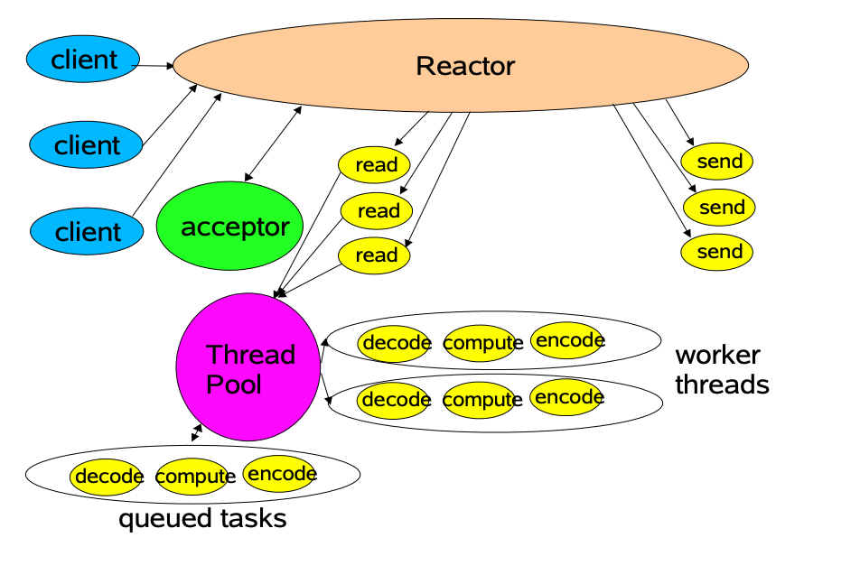

# Netty与Tomcat的区别

- 作用不同：Tomcat 是 Servlet 容器，可以视为 Web 服务器，而 Netty 是异步事件驱动的网络应用程序框架和工具用于简化网络编程，例如TCP和UDP套接字服务器。
- 协议不同：Tomcat 是基于 http 协议的 Web 服务器，而 Netty 能通过编程自定义各种协议，因为 Netty 本身自己能编码/解码字节流，所有 Netty 可以实现，HTTP 服务器、FTP 服务器、UDP 服务器、RPC 服务器、WebSocket 服务器、Redis 的 Proxy 服务器、MySQL 的 Proxy 服务器等等。
- 使用的Reactor模型不同：Tomcat使用的是单Reactor+多线程模型，Netty采用了主从Reactor模型实现，其中主Reactor在Netty中对应Boss group 线程组，子Reactor对应Worker Group 线程组。主Reactor仅负责建立连接，工作简单，一般设置1个线程就足够。在主Reactor建立好连接后，将其注册到Worker Group线程组，触发相应的IO事件，最终由Pipeline中的多个Handler进行有序处理

### 单Reactor+多线程模型

**Tomcat使用的这种模型**

### Netty的reactor模型

# 参考

- https://mp.weixin.qq.com/s?__biz=MzU3MzgwNTU2Mg==&mid=2247487309&idx=2&sn=a33cc56116cb7891145394f9c5353be3&chksm=fd3d49d8ca4ac0ce28cd0a543109d60db47e8be60d63c6951fa30e4ab4c812f9025286fa5c37&scene=21#wechat_redirect

- https://zhuanlan.zhihu.com/p/427895307