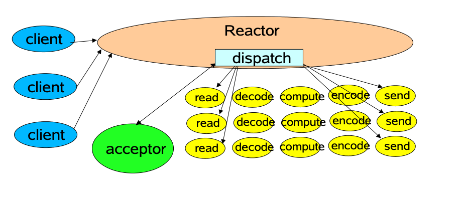
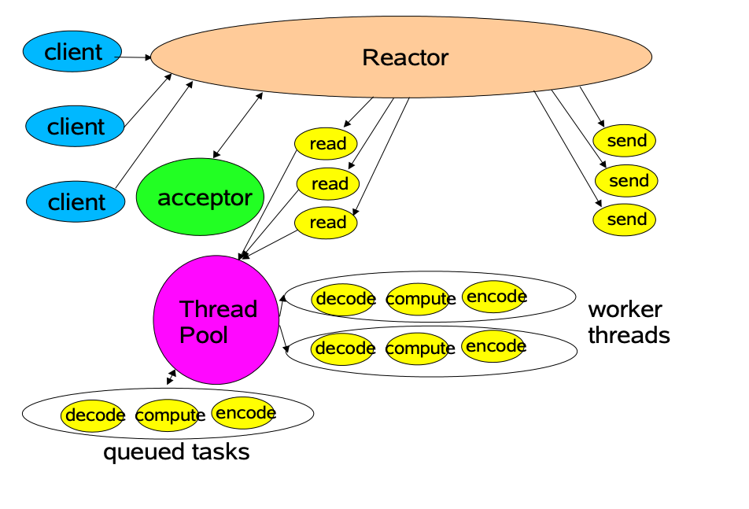
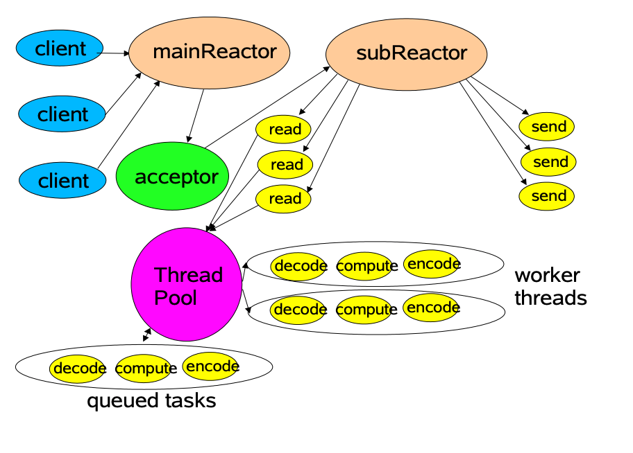
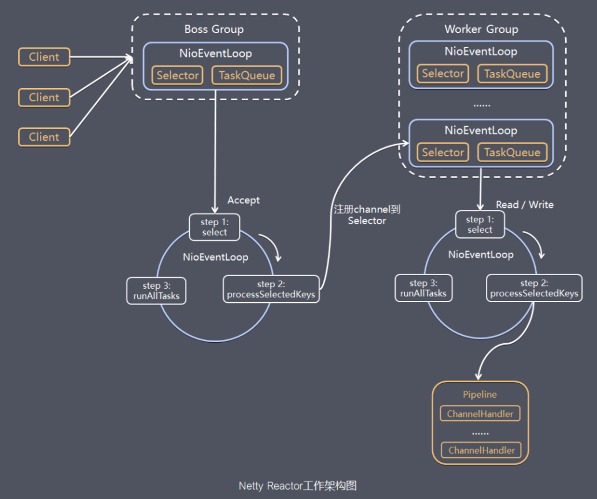
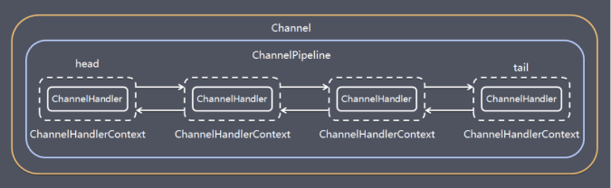
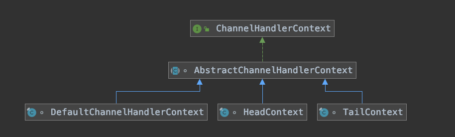

# Netty架构

[TOC]

## 前置知识：Reactor模型

Doug Lea在 “[Scalable IO in Java](http://gee.cs.oswego.edu/dl/cpjslides/nio.pdf)” 中给了很好的阐述。NIO中Reactor的核心是`Selector`。Reactor 模式的典型实现：

### 单Reactor+单线程模型

这种单线程模型不能充分利用多核资源，所以实际使用的不多。

### 单Reactor+多线程模型

**Tomcat使用的这种模型**

### 主从Reactor+多线程模型

### Netty的Reactor模型

## Netty的简介

### 优势

1. 使用NioEventLoop（聚合一个Selector）线程组负载均衡的处理请求。**一个NioEventLoop聚合了一个多路复用器Selector**，因此可以处理成百上千的客户端连接，Netty的处理策略是每当有一个新的客户端接入，则从NioEventLoop线程组中顺序获取一个可用的NioEventLoop，当到达数组上限之后，重新返回到0，通过这种方式，可以基本保证各个NioEventLoop的负载均衡。一个客户端连接只注册到一个NioEventLoop上，这样就避免了多个IO线程去并发操作它。
2. Netty通过串行化设计理念降低了用户的开发难度，提升了处理性能。利用线程组实现了多个串行化线程水平并行执行，线程之间并没有交集，这样既可以充分利用多核提升并行处理能力，同时避免了线程上下文的切换和并发保护带来的额外性能损耗。

### 服务端处理流程

server端通常设置为包含1个Boss NioEventLoopGroup和1个Worker NioEventLoopGroup，NioEventLoopGroup相当于1个事件循环组，这个组里可以包含多个事件循环NioEventLoop，通常设置Boss NioEventLoopGroup为1个NioEventLoop，work NioEventLoopGroup为N个NioEventLoop。

每个Boss NioEventLoop循环执行的任务包含3步：

1. 轮询accept事件
2. 处理accept I/O事件，与Client建立连接，生成NioSocketChannel，并将NioSocketChannel注册到某个Worker NioEventLoop的Selector上 
3. 处理任务队列中的任务，runAllTasks。任务队列中的任务包括用户调用eventloop.execute或schedule执行的任务，或者其它线程提交到该eventloop的任务。

每个Worker NioEventLoop循环执行的任务包含3步：

1. 轮询read、write事件；
2. 处I/O事件，即read、write事件，在NioSocketChannel可读、可写事件发生时进行处理
3. 处理任务队列中的任务，runAllTasks。

## Netty的核心组件

### ChannelPipeline

- 为 ChannelHandler 链提供了容器，当 channel 创建时，就会被自动分配到它专属的 ChannelPipeline，这个关联是永久性的。

- 在 Netty 中每个 Channel 都有且仅有一个 ChannelPipeline 与之对应, 它们的组成关系如下:

一个 Channel 包含了一个 ChannelPipeline, 而 ChannelPipeline 中又维护了一个由 ChannelHandlerContext 组成的双向链表, 并且每个 ChannelHandlerContext 中又关联着一个 ChannelHandler。入站事件和出站事件在一个双向链表中，入站事件会从链表head往后传递到最后一个入站的handler，出站事件会从链表tail往前传递到最前一个出站的handler，两种类型的handler互不干扰。

### ChannelHandler

每一个**ChannelHandlerContext组合了一个ChannelHandler**实例成员。充当了所有处理入站和出站数据的逻辑容器。ChannelHandler 主要用来处理各种事件，这里的事件很广泛，比如可以是连接、数据接收、异常、数据转换等。

方便使用期间，可以继承它的子类：

- ChannelInboundHandler 用于处理入站 I/O 事件。

- ChannelOutboundHandler 用于处理出站 I/O 操作。 

  或者使用以下适配器类：

- ChannelInboundHandlerAdapter 用于处理入站 I/O 事件。

- ChannelOutboundHandlerAdapter 用于处理出站 I/O 操作。

- ChannelDuplexHandler 用于处理入站和出站事件。

### ChannelHandlerContext

保存Channel相关的所有上下文信息，同时关联一个ChannelHandler对象，常见的ChannelHandlerContext如下：

提供了一些方法保证ChannelHandler链式调用

- DefaultChannelHandlerContext初始化了handler，让Handler处理真正的逻辑
- AbstractChannelHandlerContext对应的pipeline、executor、prev和next
- AbstractChannelHandlerContext 提供了使得链路运转的方法
  - findContextOutbound/Inbound
    - inbound找下一个`MASK_ONLY_INOUND`的next
    - ounbound 找下一个`MASK_ONLY_OUTBOUND`的 prev
  - 一系列的invoke和fire方法
    - fireChannelActive，通过findContextInbound找到下一个context,再通过invoke进行具体的调用
    - invokeChannelActive(ctx)是上一个ctx调用下一个ctx,ctx调用本身的方法是不带参数的invokeChannelActive
      

### Bootstrap、ServerBootstrap

Bootstrap意思是引导，一个Netty应用通常由一个Bootstrap开始，主要作用是配置整个Netty程序，串联各个组件，Netty中Bootstrap类是客户端程序的启动引导类，ServerBootstrap是服务端启动引导类。

### Selector

Netty基于Selector对象实现I/O多路复用，通过 Selector, 一个线程可以监听多个连接的Channel事件, 当向一个Selector中注册Channel 后，Selector 内部的机制就可以自动不断地查询(select) 这些注册的Channel是否有已就绪的I/O事件(例如可读, 可写, 网络连接完成等)，这样程序就可以很简单地使用一个线程高效地管理多个 Channel 。

### NioEventLoop

NioEventLoop中维护了一个线程和任务队列，支持异步提交执行任务，线程启动时会调用NioEventLoop的run方法，执行I/O任务和非I/O任务：

- I/O任务 即selectionKey中ready的事件，如accept、connect、read、write等，由processSelectedKeys方法触发。
- 非IO任务 添加到taskQueue中的任务，如register0、bind0等任务，由runAllTasks方法触发。

两种任务的执行时间比由变量ioRatio控制，默认为50，则表示允许非IO任务执行的时间与IO任务的执行时间相等。

### NioEventLoopGroup

NioEventLoopGroup，主要管理eventLoop的生命周期，可以理解为一个线程池，内部维护了一组线程，每个线程(NioEventLoop)负责处理多个Channel上的事件，而一个Channel只对应于一个线程。

## 参考

- https://www.jianshu.com/p/87f438abbd5d
- https://juejin.cn/post/7049490068888616991
