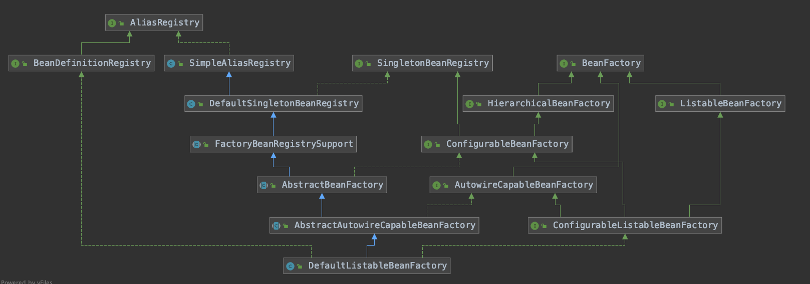

[TOC]

# DefaultListableBeanFactory及其父类的重要方法

## 类结构

## DefaultListableBeanFactory中的重要方法

### 1. 获取要注入的类

先根据类型（如果有泛型，则进行泛型类型匹配）从Spring容器中获取匹配的Bean，后根据@Qualifier>@Primary>@Priority>属性名称匹配的顺序选出要注入的Bean。

org.springframework.beans.factory.support.DefaultListableBeanFactory#resolveDependency

## AbstractBeanFactory中的重要方法

### 1.检查具有给定名称的bean是否与指定类型匹配

AbstractBeanFactory#isTypeMatch(java.lang.String, org.springframework.core.ResolvableType)

### 2.根据beanName从容器中获取Bean，不存在则创建一个Bean，或者按照作用域创建Bean

org.springframework.beans.factory.support.AbstractBeanFactory#doGetBean

### 3.根据beanName处理FactoryBean，返回对应的类

如果beanInstance不是FactoryBean（也就是普通bean），则直接返回beanInstance；如果beanInstance是FactoryBean，并且name以“&”为前缀，则直接返回beanInstance（以“&”为前缀代表想获取的是FactoryBean本身）

org.springframework.beans.factory.support.AbstractBeanFactory#getObjectForBeanInstance

## AbstractAutowireCapableBeanFactory中的重要方法

### 1.根据beanName和BeanDefinition创建Bean实例（包含实例化和初始化）

AbstractAutowireCapableBeanFactory#doCreateBean其中包含实例化以及初始化bean

### 2.给beanName的实例化后的bean注入属性

org.springframework.beans.factory.support.AbstractAutowireCapableBeanFactory#populateBean

