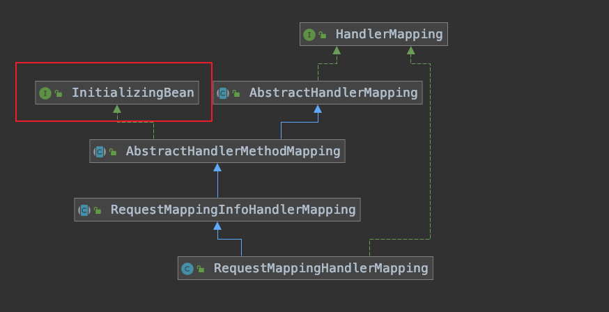

# RequestMappingHandlerMapping的初始化

[TOC]


## RequestMappingHandlerMapping的类图



## 初始化解析映射关系

因为RequestMappingHandlerMapping实现InitializingBean接口所以在spring初始化的时候调用在RequestMappingHandlerMapping的afterPropertiesSet方法，并在其中设置 Method 与 RequestMappingInfo 的映射关系

```java
public void afterPropertiesSet() {
   this.config = new RequestMappingInfo.BuilderConfiguration();
   this.config.setUrlPathHelper(getUrlPathHelper());
   this.config.setPathMatcher(getPathMatcher());
   this.config.setSuffixPatternMatch(this.useSuffixPatternMatch);
   this.config.setTrailingSlashMatch(this.useTrailingSlashMatch);
   this.config.setRegisteredSuffixPatternMatch(this.useRegisteredSuffixPatternMatch);
   this.config.setContentNegotiationManager(getContentNegotiationManager());

   super.afterPropertiesSet();
}
```

```java
public void afterPropertiesSet() {
   initHandlerMethods();
}
```

```java
protected void initHandlerMethods() {
   if (logger.isDebugEnabled()) {
      logger.debug("Looking for request mappings in application context: " + getApplicationContext());
   }
   String[] beanNames = (this.detectHandlerMethodsInAncestorContexts ?
         BeanFactoryUtils.beanNamesForTypeIncludingAncestors(obtainApplicationContext(), Object.class) :
         obtainApplicationContext().getBeanNamesForType(Object.class));

   for (String beanName : beanNames) {
      if (!beanName.startsWith(SCOPED_TARGET_NAME_PREFIX)) {
         Class<?> beanType = null;
         try {
            // 获取 bean 的 type
            beanType = obtainApplicationContext().getType(beanName);
         }
         catch (Throwable ex) {
            // An unresolvable bean type, probably from a lazy bean - let's ignore it.
            if (logger.isDebugEnabled()) {
               logger.debug("Could not resolve target class for bean with name '" + beanName + "'", ex);
            }
         }
         // 类上有 @Controller 或者 @RequestMapping 注解
         if (beanType != null && isHandler(beanType)) {
            // 设置 Method 与 RequestMappingInfo 的映射关系
            detectHandlerMethods(beanName);
         }
      }
   }
   handlerMethodsInitialized(getHandlerMethods());
}
```


类上有 @Controller 或者 @RequestMapping 注解的话进行解析

```java
protected boolean isHandler(Class<?> beanType) {
   return (AnnotatedElementUtils.hasAnnotation(beanType, Controller.class) ||
         AnnotatedElementUtils.hasAnnotation(beanType, RequestMapping.class));
}
```


```java
protected void detectHandlerMethods(Object handler) {
   Class<?> handlerType = (handler instanceof String ?
         obtainApplicationContext().getType((String) handler) : handler.getClass());

   if (handlerType != null) {
      Class<?> userType = ClassUtils.getUserClass(handlerType);
      // 得到 Method 与 RequestMappingInfo 的映射关系
     // 对类或者接口包含其父类以及父接口的所有方法进行getMappingForMethod操作
      Map<Method, T> methods = MethodIntrospector.selectMethods(userType,
            (MethodIntrospector.MetadataLookup<T>) method -> {
               try {
                  return getMappingForMethod(method, userType);
               }
               catch (Throwable ex) {
                  throw new IllegalStateException("Invalid mapping on handler class [" +
                        userType.getName() + "]: " + method, ex);
               }
            });
      if (logger.isDebugEnabled()) {
         logger.debug(methods.size() + " request handler methods found on " + userType + ": " + methods);
      }
      // 设置请求 url 与 RequestMappingInfo 的映射关系
      // 设置 RequestMappingInfo 与 HandlerMethod 的映射关系
      methods.forEach((method, mapping) -> {
         Method invocableMethod = AopUtils.selectInvocableMethod(method, userType);
         registerHandlerMethod(handler, invocableMethod, mapping);
      });
   }
}
```

 对类或者接口包含其父类以及父接口的所有方法进行getMappingForMethod操作

```java
public static <T> Map<Method, T>  selectMethods(Class<?> targetType, final MetadataLookup<T> metadataLookup) {
   final Map<Method, T> methodMap = new LinkedHashMap<>();
   Set<Class<?>> handlerTypes = new LinkedHashSet<>();
   Class<?> specificHandlerType = null;

   // 添加类
   if (!Proxy.isProxyClass(targetType)) {
      specificHandlerType = ClassUtils.getUserClass(targetType);
      handlerTypes.add(specificHandlerType);
   }
   // 添加接口
   handlerTypes.addAll(ClassUtils.getAllInterfacesForClassAsSet(targetType));

   for (Class<?> currentHandlerType : handlerTypes) {
      final Class<?> targetClass = (specificHandlerType != null ? specificHandlerType : currentHandlerType);

      // 对类或者接口包含其父类以及父接口的所有方法进行操作
      ReflectionUtils.doWithMethods(currentHandlerType, method -> {
         Method specificMethod = ClassUtils.getMostSpecificMethod(method, targetClass);
         T result = metadataLookup.inspect(specificMethod);
         if (result != null) {
            Method bridgedMethod = BridgeMethodResolver.findBridgedMethod(specificMethod);
            if (bridgedMethod == specificMethod || metadataLookup.inspect(bridgedMethod) == null) {
               // 设置 Method 与 RequestMappingInfo 的映射关系
               methodMap.put(specificMethod, result);
            }
         }
      }, ReflectionUtils.USER_DECLARED_METHODS);
   }

   return methodMap;
}
```

```java
public static void doWithMethods(Class<?> clazz, MethodCallback mc, @Nullable MethodFilter mf) {
   // Keep backing up the inheritance hierarchy.
   // 获取这个类或者接口的 declaredMethods 以及这个继承或者实现的接口的 default 方法
   Method[] methods = getDeclaredMethods(clazz);
   for (Method method : methods) {
      if (mf != null && !mf.matches(method)) {
         continue;
      }
      try {
         mc.doWith(method);
      }
      catch (IllegalAccessException ex) {
         throw new IllegalStateException("Not allowed to access method '" + method.getName() + "': " + ex);
      }
   }
   // 处理父类
   if (clazz.getSuperclass() != null) {
      doWithMethods(clazz.getSuperclass(), mc, mf);
   }
   // clazz 是接口，处理接口
   else if (clazz.isInterface()) {
      for (Class<?> superIfc : clazz.getInterfaces()) {
         doWithMethods(superIfc, mc, mf);
      }
   }
}
```

分析getMappingForMethod操作

```java
protected RequestMappingInfo getMappingForMethod(Method method, Class<?> handlerType) {
   RequestMappingInfo info = createRequestMappingInfo(method);
   if (info != null) {
      RequestMappingInfo typeInfo = createRequestMappingInfo(handlerType);
      if (typeInfo != null) {
         info = typeInfo.combine(info);
      }
   }
   return info;
}
```

```java
private RequestMappingInfo createRequestMappingInfo(AnnotatedElement element) {
   RequestMapping requestMapping = AnnotatedElementUtils.findMergedAnnotation(element, RequestMapping.class);
   RequestCondition<?> condition = (element instanceof Class ?
         getCustomTypeCondition((Class<?>) element) : getCustomMethodCondition((Method) element));
   return (requestMapping != null ? createRequestMappingInfo(requestMapping, condition) : null);
}
```

```java
protected RequestMappingInfo createRequestMappingInfo(
      RequestMapping requestMapping, @Nullable RequestCondition<?> customCondition) {

   RequestMappingInfo.Builder builder = RequestMappingInfo
         .paths(resolveEmbeddedValuesInPatterns(requestMapping.path()))
         .methods(requestMapping.method())
         .params(requestMapping.params())
         .headers(requestMapping.headers())
         .consumes(requestMapping.consumes())
         .produces(requestMapping.produces())
         .mappingName(requestMapping.name());
   if (customCondition != null) {
      builder.customCondition(customCondition);
   }
   return builder.options(this.config).build();
}
```


设置请求 url 与 RequestMappingInfo 的映射关系，设置 RequestMappingInfo 与 HandlerMethod 的映射关系

```java
public void register(T mapping, Object handler, Method method) {
   this.readWriteLock.writeLock().lock();
   try {
      // 根据方法解析出 HandlerMethod, 存储方法以及方法的参数
      HandlerMethod handlerMethod = createHandlerMethod(handler, method);
      assertUniqueMethodMapping(handlerMethod, mapping);
      // 设置 RequestMappingInfo 与 HandlerMethod 的映射关系
      this.mappingLookup.put(mapping, handlerMethod);

      if (logger.isInfoEnabled()) {
         logger.info("Mapped \"" + mapping + "\" onto " + handlerMethod);
      }

      List<String> directUrls = getDirectUrls(mapping);
      // 设置请求 url 与 RequestMappingInfo 的映射关系
      for (String url : directUrls) {
         this.urlLookup.add(url, mapping);
      }

      String name = null;
      if (getNamingStrategy() != null) {
         name = getNamingStrategy().getName(handlerMethod, mapping);
         addMappingName(name, handlerMethod);
      }

      CorsConfiguration corsConfig = initCorsConfiguration(handler, method, mapping);
      if (corsConfig != null) {
         this.corsLookup.put(handlerMethod, corsConfig);
      }

      this.registry.put(mapping, new MappingRegistration<>(mapping, handlerMethod, directUrls, name));
   }
   finally {
      this.readWriteLock.writeLock().unlock();
   }
}
```

小结：

解析映射关系初始化完成。

请求 url 与 RequestMappingInfo 的映射关系到 urlLookup 中；设置 RequestMappingInfo 与 HandlerMethod 的映射关系到 mappingLookup 中。