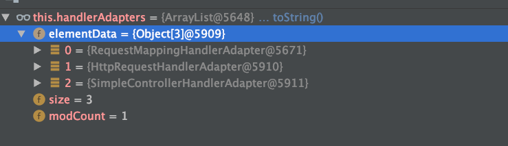

# SpringMVC的请求处理流程

[TOC]

## 前言

本文只分析动态资源。静态资源、默认页等不分析

## 核心流程

### DispatcherServlet 接收到客户端发送的请求

调用doService方法->调用doDispatch方法

```java
protected void doDispatch(HttpServletRequest request, HttpServletResponse response) throws Exception {
   HttpServletRequest processedRequest = request;
   HandlerExecutionChain mappedHandler = null;
   boolean multipartRequestParsed = false;

   WebAsyncManager asyncManager = WebAsyncUtils.getAsyncManager(request);

   try {
      ModelAndView mv = null;
      Exception dispatchException = null;

      try {
         // processedRequest是经过checkMultipart方法处理过的request请求,
         //  如果不满足multipart条件，直接返回request,也就是request没有做任何处理,
         //  如果满足multipart基本条件将multipartRequest转换为StandardMultipartHttpServletRequest请求。
         processedRequest = checkMultipart(request);
         multipartRequestParsed = (processedRequest != request);

         // Determine handler for the current request.
         // DispatcherServlet.getHandler方法会在底层调用HandlerMapping.getHandler方法
         // 这个方法中会遍历DispatcherServlet中的private List<HandlerMapping>
         // handlerMappings链表，找到能够处理当前 request请求的第一个HandlerMapping实例并返回：
         // DispatcherServlet接收到请求后，HandlerMapping将会把请求封装为HandlerExecutionChain，
         //  而HandlerExecutionChain包含请求的所有信息，包括拦截器、Handler处理器等。
         //  HandlerExecutionChain为真正的Handler对象与Interceptor的组合类
         mappedHandler = getHandler(processedRequest);
         if (mappedHandler == null) {
            // 如果没有找到对应的handler则抛出异常。
            noHandlerFound(processedRequest, response);
            return;
         }

         // Determine handler adapter for the current request.
         // 通过getHandlerAdapter方法找到handler对应的HandlerAdapter
         //  则是遍历HandlerAdpaters，然后返回第一个支持handler的Adpater.

         // SimpleControllerHandlerAdapter是用来适配SimpleUrlHandlerMapping和BeanNameUrlHandlerMapping的映射的，也就是实现Controller接口的Handler。
         // RequestMappingHandlerAdapter是用来适配RequestMappingHandlerMapping，也就是我们常用的RequestMapping注解。
         // HttpRequestHandlerAdapter是用来适配远程调用的。
         HandlerAdapter ha = getHandlerAdapter(mappedHandler.getHandler());

         // Process last-modified header, if supported by the handler.
         String method = request.getMethod();
         boolean isGet = "GET".equals(method);
         if (isGet || "HEAD".equals(method)) {
            long lastModified = ha.getLastModified(request, mappedHandler.getHandler());
            if (logger.isDebugEnabled()) {
               logger.debug("Last-Modified value for [" + getRequestUri(request) + "] is: " + lastModified);
            }
            if (new ServletWebRequest(request, response).checkNotModified(lastModified) && isGet) {
               return;
            }
         }

         // 如果有拦截器，执行拦截器preHandler方法
         //  如果拦截器preHandle返回false，那么请求终止。
         if (!mappedHandler.applyPreHandle(processedRequest, response)) {
            return;
         }

         // Actually invoke the handler.
         // todo HandlerAdapter执行handle方法处理请求，返回ModelAndView
         mv = ha.handle(processedRequest, response, mappedHandler.getHandler());

         if (asyncManager.isConcurrentHandlingStarted()) {
            return;
         }

         // 如果返回的ModelAndView不为null，并且没有设置view的话，这设置默认的view
         applyDefaultViewName(processedRequest, mv);
         // 如果有拦截器，执行拦截器postHandle方法
         mappedHandler.applyPostHandle(processedRequest, response, mv);
      }
      catch (Exception ex) {
         dispatchException = ex;
      }
      catch (Throwable err) {
         // As of 4.3, we're processing Errors thrown from handler methods as well,
         // making them available for @ExceptionHandler methods and other scenarios.
         dispatchException = new NestedServletException("Handler dispatch failed", err);
      }
      // 然后调用processDispatchResult方法处理请求结果，封装到response中
      //  DispatcherServlet会将ModelAndView对象传入View层进行渲染
      processDispatchResult(processedRequest, response, mappedHandler, mv, dispatchException);
   }
   catch (Exception ex) {
      triggerAfterCompletion(processedRequest, response, mappedHandler, ex);
   }
   catch (Throwable err) {
      triggerAfterCompletion(processedRequest, response, mappedHandler,
            new NestedServletException("Handler processing failed", err));
   }
   finally {
      if (asyncManager.isConcurrentHandlingStarted()) {
         // Instead of postHandle and afterCompletion
         if (mappedHandler != null) {
            mappedHandler.applyAfterConcurrentHandlingStarted(processedRequest, response);
         }
      }
      else {
         // Clean up any resources used by a multipart request.
         if (multipartRequestParsed) {
            cleanupMultipart(processedRequest);
         }
      }
   }
}
```

### 组装HandlerExecutionChain

```java
protected HandlerExecutionChain getHandler(HttpServletRequest request) throws Exception {
   if (this.handlerMappings != null) {
      for (HandlerMapping hm : this.handlerMappings) {
         if (logger.isTraceEnabled()) {
            logger.trace(
                  "Testing handler map [" + hm + "] in DispatcherServlet with name '" + getServletName() + "'");
         }
         HandlerExecutionChain handler = hm.getHandler(request);
         if (handler != null) {
            return handler;
         }
      }
   }
   return null;
}
```

调用 AbstractHandlerMapping#getHandler 来组装 HandlerExecutionChain，其中静态资源与动态资源的 handler 不同，其中动态资源的 handler 是 HandlerMethod；自定义资源映射的 handler 是ParameterizableViewController；静态资源的 handler 是 ResourceHttpRequestHandler；默认资源的 handler 是 DefaultServletHttpRequestHandler。
具体详见：
[SpringMVC的HandlerMapping](SpringMVC系列二：SpringMVC的HandlerMapping.md)

```java
public final HandlerExecutionChain getHandler(HttpServletRequest request) throws Exception {
   //这里会两个子类重写这个方法：AbstractHandlerMethodMapping子类：RequestMappingHandlerMapping
   // 和AbstractUrlHandlerMapping子类：SimpleUrlHandlerMapping:
   Object handler = getHandlerInternal(request);
   if (handler == null) {
      handler = getDefaultHandler();
   }
   if (handler == null) {
      return null;
   }
   // Bean name or resolved handler?
   if (handler instanceof String) {
      String handlerName = (String) handler;
      handler = obtainApplicationContext().getBean(handlerName);
   }

   //包装为执行器链
   HandlerExecutionChain executionChain = getHandlerExecutionChain(handler, request);
   //是不是cors请求，cors是跨域请求
   if (CorsUtils.isCorsRequest(request)) {
      CorsConfiguration globalConfig = this.globalCorsConfigSource.getCorsConfiguration(request);
      CorsConfiguration handlerConfig = getCorsConfiguration(handler, request);
      CorsConfiguration config = (globalConfig != null ? globalConfig.combine(handlerConfig) : handlerConfig);
      executionChain = getCorsHandlerExecutionChain(request, executionChain, config);
   }
   return executionChain;
}
```


#### SpringMVC的路径匹配原则

Spring的路径匹配使用Ant风格作为路径匹配器

**ANT通配符有三种：**

| 通配符 |          说明           |
| :----: | :---------------------: |
|   ?    |     匹配任何单字符      |
|   *    | 匹配0或者任意数量的字符 |
|   **   |   匹配0或者更多的目录   |

**例子：**

|      URL路径       |                             说明                             |
| :----------------: | :----------------------------------------------------------: |
|      /app/*.x      |             匹配(Matches)所有在app路径下的.x文件             |
|    /app/p?ttern    | 匹配(Matches) /app/pattern 和 /app/pXttern,但是不包括/app/pttern |
|    /**/example     |  匹配(Matches) /app/example, /app/foo/example, 和 /example   |
| /app/**/dir/file.* | 匹配(Matches) /app/dir/file.jsp, /app/foo/dir/file.html,/app/foo/bar/dir/file.pdf, 和 /app/dir/file.java |
|     /**/*.jsp      |                 匹配(Matches)任何的.jsp 文件                 |

**最长匹配原则(has more characters)**

URL请求/app/dir/file.jsp，现在存在两个路径匹配模式/**/*.jsp和/app/dir/*.jsp，那么会根据模式/app/dir/*.jsp来匹配


#### 通过RequestMappingHandlerMapping获得HandlerMethod

```java
protected HandlerMethod getHandlerInternal(HttpServletRequest request) throws Exception {
   // 获取请求路径
   String lookupPath = getUrlPathHelper().getLookupPathForRequest(request);
   if (logger.isDebugEnabled()) {
      logger.debug("Looking up handler method for path " + lookupPath);
   }
   this.mappingRegistry.acquireReadLock();
   try {
      // 根据路径获取 HandlerMethod
      HandlerMethod handlerMethod = lookupHandlerMethod(lookupPath, request);
      if (logger.isDebugEnabled()) {
         if (handlerMethod != null) {
            logger.debug("Returning handler method [" + handlerMethod + "]");
         }
         else {
            logger.debug("Did not find handler method for [" + lookupPath + "]");
         }
      }
      return (handlerMethod != null ? handlerMethod.createWithResolvedBean() : null);
   }
   finally {
      this.mappingRegistry.releaseReadLock();
   }
}
```

其中根据路径获取 HandlerMethod 是 SpringMVC 初始化的时候已经确定 url 到 HandlerMethod 的映射关系。
具体详见：
[RequestMappingHandlerMapping的初始化](SpringMVC系列六：RequestMappingHandlerMapping的初始化.md)


获取 HandlerMethod 时根据 ant风格 进行路径匹配

```java
protected HandlerMethod lookupHandlerMethod(String lookupPath, HttpServletRequest request) throws Exception {
   List<Match> matches = new ArrayList<>();
   // 获取 RequestMappingInfo
   List<T> directPathMatches = this.mappingRegistry.getMappingsByUrl(lookupPath);
   // 利用 ant风格 进行路径匹配
   if (directPathMatches != null) {
      addMatchingMappings(directPathMatches, matches, request);
   }
   if (matches.isEmpty()) {
      // No choice but to go through all mappings...
      addMatchingMappings(this.mappingRegistry.getMappings().keySet(), matches, request);
   }

   if (!matches.isEmpty()) {
      Comparator<Match> comparator = new MatchComparator(getMappingComparator(request));
      matches.sort(comparator);
      if (logger.isTraceEnabled()) {
         logger.trace("Found " + matches.size() + " matching mapping(s) for [" + lookupPath + "] : " + matches);
      }
      Match bestMatch = matches.get(0);
      if (matches.size() > 1) {
         if (CorsUtils.isPreFlightRequest(request)) {
            return PREFLIGHT_AMBIGUOUS_MATCH;
         }
         Match secondBestMatch = matches.get(1);
         if (comparator.compare(bestMatch, secondBestMatch) == 0) {
            Method m1 = bestMatch.handlerMethod.getMethod();
            Method m2 = secondBestMatch.handlerMethod.getMethod();
            throw new IllegalStateException("Ambiguous handler methods mapped for HTTP path '" +
                  request.getRequestURL() + "': {" + m1 + ", " + m2 + "}");
         }
      }
      request.setAttribute(BEST_MATCHING_HANDLER_ATTRIBUTE, bestMatch.handlerMethod);
      // 在请求中设置一些重要的属性, 例如：设置解码后的路径参数
      handleMatch(bestMatch.mapping, lookupPath, request);
      return bestMatch.handlerMethod;
   }
   else {
      return handleNoMatch(this.mappingRegistry.getMappings().keySet(), lookupPath, request);
   }
}
```

```java
private void addMatchingMappings(Collection<T> mappings, List<Match> matches, HttpServletRequest request) {
   for (T mapping : mappings) {
      // 获取 RequestMappingInfo
      T match = getMatchingMapping(mapping, request);
      if (match != null) {
         // 根据 RequestMappingInfo 获取 HandlerMethod
         matches.add(new Match(match, this.mappingRegistry.getMappings().get(mapping)));
      }
   }
}
```

```java
protected RequestMappingInfo getMatchingMapping(RequestMappingInfo info, HttpServletRequest request) {
   return info.getMatchingCondition(request);
}
```

```java
public RequestMappingInfo getMatchingCondition(HttpServletRequest request) {
   RequestMethodsRequestCondition methods = this.methodsCondition.getMatchingCondition(request);
   ParamsRequestCondition params = this.paramsCondition.getMatchingCondition(request);
   HeadersRequestCondition headers = this.headersCondition.getMatchingCondition(request);
   ConsumesRequestCondition consumes = this.consumesCondition.getMatchingCondition(request);
   ProducesRequestCondition produces = this.producesCondition.getMatchingCondition(request);

   if (methods == null || params == null || headers == null || consumes == null || produces == null) {
      return null;
   }

   // 利用 ant风格 进行路径匹配
   PatternsRequestCondition patterns = this.patternsCondition.getMatchingCondition(request);
   if (patterns == null) {
      return null;
   }

   RequestConditionHolder custom = this.customConditionHolder.getMatchingCondition(request);
   if (custom == null) {
      return null;
   }

   return new RequestMappingInfo(this.name, patterns,
         methods, params, headers, consumes, produces, custom.getCondition());
}
```

然后拿着 lookupPath 与当前 patternsCondition 内部的 patterns 属性集合进行匹配

```java
public PatternsRequestCondition getMatchingCondition(HttpServletRequest request) {
   if (this.patterns.isEmpty()) {
      return this;
   }
   String lookupPath = this.pathHelper.getLookupPathForRequest(request);
   // 拿着 lookupPath 与当前 patternsCondition 内部的 patterns 属性集合进行匹配
   List<String> matches = getMatchingPatterns(lookupPath);
   return (!matches.isEmpty() ?
         new PatternsRequestCondition(matches, this.pathHelper, this.pathMatcher,
               this.useSuffixPatternMatch, this.useTrailingSlashMatch, this.fileExtensions) : null);
}
```

```java
public List<String> getMatchingPatterns(String lookupPath) {
   List<String> matches = new ArrayList<>();
   // 遍历内部的 patterns 集合,也就是 @RequestMapping 注解中我们设置的 path 或者默认 value 属性值
   // 一个 @RequestMapping 注解中可以写多个请求路径映射
   for (String pattern : this.patterns) {
      // 进行挨个匹配，没匹配上,返回null
      String match = getMatchingPattern(pattern, lookupPath);
      if (match != null) {
         matches.add(match);
      }
   }
   // 如果存在多个路径匹配上了，那么需要进行路径排序，让最佳匹配放在最前面
   if (matches.size() > 1) {
      matches.sort(this.pathMatcher.getPatternComparator(lookupPath));
   }
   return matches;
}
```

```java
private String getMatchingPattern(String pattern, String lookupPath) {
   // 如果是精确匹配上了,那么直接返回
   if (pattern.equals(lookupPath)) {
      return pattern;
   }
   // 是否开启后缀匹配---默认开启
   if (this.useSuffixPatternMatch) {
      // fileExtensions是我们可以设置的后缀集合,例如: .doc ; .html ; .js ; .do等后缀集合
      if (!this.fileExtensions.isEmpty() && lookupPath.indexOf('.') != -1) {
         for (String extension : this.fileExtensions) {
            // 这里采用的是pathMatcher--实际是 AntPathMatcher,会进行 ant 风格路径匹配
            if (this.pathMatcher.match(pattern + extension, lookupPath)) {
               return pattern + extension;
            }
         }
      }
      else {
         boolean hasSuffix = pattern.indexOf('.') != -1;
         // 利用.*后缀进行ant风格匹配
         if (!hasSuffix && this.pathMatcher.match(pattern + ".*", lookupPath)) {
            return pattern + ".*";
         }
      }
   }
   // 进行ant风格路径匹配
   if (this.pathMatcher.match(pattern, lookupPath)) {
      return pattern;
   }
   // useTrailingSlashMatch功能是默认开启的，该功能的可以让我们使用/hello/请求也能匹配上/hello请求
   if (this.useTrailingSlashMatch) {
      if (!pattern.endsWith("/") && this.pathMatcher.match(pattern + "/", lookupPath)) {
         return pattern + "/";
      }
   }
   return null;
}
```

小结：利用 ant 风格来进行路径匹配

#### 添加匹配的HandlerInterceptor

```java
protected HandlerExecutionChain getHandlerExecutionChain(Object handler, HttpServletRequest request) {
		//判断handler是不是执行器链，如果不是创建一个执行器链
		HandlerExecutionChain chain = (handler instanceof HandlerExecutionChain ?
				(HandlerExecutionChain) handler : new HandlerExecutionChain(handler));

		String lookupPath = this.urlPathHelper.getLookupPathForRequest(request);
		//包装拦截器
		for (HandlerInterceptor interceptor : this.adaptedInterceptors) {
			if (interceptor instanceof MappedInterceptor) {
				MappedInterceptor mappedInterceptor = (MappedInterceptor) interceptor;
				// 利用 ant风格 进行路径匹配
				if (mappedInterceptor.matches(lookupPath, this.pathMatcher)) {
					chain.addInterceptor(mappedInterceptor.getInterceptor());
				}
			}
			else {
				chain.addInterceptor(interceptor);
			}
		}
		return chain;
	}
```

```java
public boolean matches(String lookupPath, PathMatcher pathMatcher) {
   PathMatcher pathMatcherToUse = (this.pathMatcher != null ? this.pathMatcher : pathMatcher);
   if (!ObjectUtils.isEmpty(this.excludePatterns)) {
      for (String pattern : this.excludePatterns) {
         // 利用 ant风格 进行路径匹配
         if (pathMatcherToUse.match(pattern, lookupPath)) {
            return false;
         }
      }
   }
   if (ObjectUtils.isEmpty(this.includePatterns)) {
      return true;
   }
   for (String pattern : this.includePatterns) {
      if (pathMatcherToUse.match(pattern, lookupPath)) {
         return true;
      }
   }
   return false;
}
```

#### 小结

- 请求的url -> HandlerMethod 使用 ant风格 进行路径匹配
- 请求的url找到匹配的 HandlerInterceptor 也是利用  ant风格 进行路径匹配

### 获取HandlerAdapter：RequestMappingHandlerAdapter

SpringMVC内置了3个HandlerAdapter



1. RequestMappingHandlerAdapter 处理 HandlerMethod的 handler，即动态资源
2. HttpRequestHandlerAdapter 处理 HttpRequestHandler 的handler，即静态资源以及默认资源
3. SimpleControllerHandlerAdapter 处理 Controller 的handler，即自定义资源映射的资源

获取HandlerAdapter的逻辑

```java
protected HandlerAdapter getHandlerAdapter(Object handler) throws ServletException {
   if (this.handlerAdapters != null) {
      for (HandlerAdapter ha : this.handlerAdapters) {
         if (logger.isTraceEnabled()) {
            logger.trace("Testing handler adapter [" + ha + "]");
         }
         if (ha.supports(handler)) {
            return ha;
         }
      }
   }
   throw new ServletException("No adapter for handler [" + handler +
         "]: The DispatcherServlet configuration needs to include a HandlerAdapter that supports this handler");
}
```


### 调用HandlerInterceptor的preHandle方法

```java
boolean applyPreHandle(HttpServletRequest request, HttpServletResponse response) throws Exception {
   HandlerInterceptor[] interceptors = getInterceptors();
   if (!ObjectUtils.isEmpty(interceptors)) {
      for (int i = 0; i < interceptors.length; i++) {
         HandlerInterceptor interceptor = interceptors[i];
         if (!interceptor.preHandle(request, response, this.handler)) {
            triggerAfterCompletion(request, response, null);
            return false;
         }
         this.interceptorIndex = i;
      }
   }
   return true;
}
```

逆序调用HandlerInterceptor，返回false，请求直接结束

### 真正的参数解析、方法处理、返回值处理的逻辑

```java
protected ModelAndView handleInternal(HttpServletRequest request,
      HttpServletResponse response, HandlerMethod handlerMethod) throws Exception {

   ModelAndView mav;
   checkRequest(request);

   // Execute invokeHandlerMethod in synchronized block if required.
   // 判断当前是否需要支持在同一个session中只能线性地处理请求
   if (this.synchronizeOnSession) {
      // 获取当前请求的session对象
      HttpSession session = request.getSession(false);
      if (session != null) {
         // 为当前session生成一个唯一的可以用于锁定的key
         Object mutex = WebUtils.getSessionMutex(session);
         synchronized (mutex) {
            // 对HandlerMethod进行参数等的适配处理，并调用目标handler
            mav = invokeHandlerMethod(request, response, handlerMethod);
         }
      }
      else {
         // No HttpSession available -> no mutex necessary
         // 如果当前不存在session，则直接对HandlerMethod进行适配
         mav = invokeHandlerMethod(request, response, handlerMethod);
      }
   }
   else {
      // No synchronization on session demanded at all...
      // 如果当前不需要对session进行同步处理，则直接对HandlerMethod进行适配
      mav = invokeHandlerMethod(request, response, handlerMethod);
   }
   // 判断当前请求头中是否包含Cache-Control请求头，如果不包含，则对当前response进行处理，
   // 为其设置过期时间
   if (!response.containsHeader(HEADER_CACHE_CONTROL)) {
      // 如果当前SessionAttribute中存在配置的attributes，则为其设置过期时间。
      // 这里SessionAttribute主要是通过@SessionAttribute注解生成的
      if (getSessionAttributesHandler(handlerMethod).hasSessionAttributes()) {
         applyCacheSeconds(response, this.cacheSecondsForSessionAttributeHandlers);
      }
      else {
         // 如果当前不存在SessionAttributes，则判断当前是否存在Cache-Control设置，
         // 如果存在，则按照该设置进行response处理，如果不存在，则设置response中的
         // Cache的过期时间为-1，即立即失效
         prepareResponse(response);
      }
   }

   return mav;
}
```


```java
protected ModelAndView invokeHandlerMethod(HttpServletRequest request,
      HttpServletResponse response, HandlerMethod handlerMethod) throws Exception {

   ServletWebRequest webRequest = new ServletWebRequest(request, response);
   try {
      // 使用initBinderAdviceCache对@initBinder进行处理
      // 获取容器中全局配置的InitBinder和当前HandlerMethod所对应的Controller中
      // 配置的InitBinder，用于进行参数的绑定
      WebDataBinderFactory binderFactory = getDataBinderFactory(handlerMethod);

      // 使用modelAttributeAdviceCache对@ModelAttribute进行处理
      // 获取容器中全局配置的ModelAttribute和当前当前HandlerMethod所对应的Controller
      // 中配置的ModelAttribute，这些配置的方法将会在目标方法调用之前进行调用
      ModelFactory modelFactory = getModelFactory(handlerMethod, binderFactory);

      // 将handlerMethod封装为一个ServletInvocableHandlerMethod对象，
      // 该对象用于对当前request的整体调用流程进行了封装
      ServletInvocableHandlerMethod invocableMethod = createInvocableHandlerMethod(handlerMethod);
      if (this.argumentResolvers != null) {
         // 设置当前容器中配置的所有ArgumentResolver
         invocableMethod.setHandlerMethodArgumentResolvers(this.argumentResolvers);
      }
      if (this.returnValueHandlers != null) {
         // 设置当前容器中配置的所有ReturnValueHandler
         invocableMethod.setHandlerMethodReturnValueHandlers(this.returnValueHandlers);
      }
      // 将前面创建的WebDataBinderFactory设置到ServletInvocableHandlerMethod中
      invocableMethod.setDataBinderFactory(binderFactory);
      // 设置ParameterNameDiscoverer，该对象将按照一定的规则获取当前参数的名称
      invocableMethod.setParameterNameDiscoverer(this.parameterNameDiscoverer);

      ModelAndViewContainer mavContainer = new ModelAndViewContainer();
      mavContainer.addAllAttributes(RequestContextUtils.getInputFlashMap(request));
      // 这里initModel()方法主要作用是调用前面获取到的@ModelAttribute标注的方法，
      // 从而达到@ModelAttribute标注的方法能够在目标Handler调用之前调用的目的
      modelFactory.initModel(webRequest, mavContainer, invocableMethod);

      // 获取当前的AsyncWebRequest，这里AsyncWebRequest的主要作用是用于判断目标
      // handler的返回值是否为WebAsyncTask或DefferredResult，如果是这两种中的一种，
      // 则说明当前请求的处理应该是异步的。所谓的异步，指的是当前请求会将Controller中
      // 封装的业务逻辑放到一个线程池中进行调用，待该调用有返回结果之后再返回到response中。
      // 这种处理的优点在于用于请求分发的线程能够解放出来，从而处理更多的请求，只有待目标任务
      // 完成之后才会回来将该异步任务的结果返回。
      mavContainer.setIgnoreDefaultModelOnRedirect(this.ignoreDefaultModelOnRedirect);

      // 封装异步任务的线程池，request和interceptors到WebAsyncManager中
      AsyncWebRequest asyncWebRequest = WebAsyncUtils.createAsyncWebRequest(request, response);
      asyncWebRequest.setTimeout(this.asyncRequestTimeout);

      WebAsyncManager asyncManager = WebAsyncUtils.getAsyncManager(request);
      asyncManager.setTaskExecutor(this.taskExecutor);
      asyncManager.setAsyncWebRequest(asyncWebRequest);
      asyncManager.registerCallableInterceptors(this.callableInterceptors);
      asyncManager.registerDeferredResultInterceptors(this.deferredResultInterceptors);

      // 这里就是用于判断当前请求是否有异步任务结果的，如果存在，则对异步任务结果进行封装
      if (asyncManager.hasConcurrentResult()) {
         Object result = asyncManager.getConcurrentResult();
         mavContainer = (ModelAndViewContainer) asyncManager.getConcurrentResultContext()[0];
         asyncManager.clearConcurrentResult();
         if (logger.isDebugEnabled()) {
            logger.debug("Found concurrent result value [" + result + "]");
         }
         // 封装异步任务的处理结果，虽然封装的是一个HandlerMethod，但只是Spring简单的封装
         // 的一个Callable对象，该对象中直接将调用结果返回了。这样封装的目的在于能够统一的
         // 进行右面的ServletInvocableHandlerMethod.invokeAndHandle()方法的调用
         invocableMethod = invocableMethod.wrapConcurrentResult(result);
      }

      // 完成过程调用
      // 对请求参数进行处理，调用目标HandlerMethod，并且将返回值封装为一个ModelAndView对象
      invocableMethod.invokeAndHandle(webRequest, mavContainer);
      if (asyncManager.isConcurrentHandlingStarted()) {
         return null;
      }

      // 包装ModelAndView，将 mavContainer 中的 model 设置到 ModelAndView 中
      return getModelAndView(mavContainer, modelFactory, webRequest);
   }
   finally {
      // 调用request destruction callbacks和对SessionAttributes进行处理
      webRequest.requestCompleted();
   }
}
```

#### 调用@ModelAttribute标注的方法，并把信息存到request维度的ModelAndViewContainer的Model中

其中在ModelFactory#initModel 中调用匹配的 @ModelAttribute标注的方法

```java
public void initModel(NativeWebRequest request, ModelAndViewContainer container, HandlerMethod handlerMethod)
      throws Exception {

   // 在当前request中获取使用@SessionAttribute注解声明的参数
   Map<String, ?> sessionAttributes = this.sessionAttributesHandler.retrieveAttributes(request);
   // 将@SessionAttribute声明的参数封装到ModelAndViewContainer中
   container.mergeAttributes(sessionAttributes);
   // 调用前面获取的使用@ModelAttribute标注的方法
   invokeModelAttributeMethods(request, container);
   // 这里首先获取目标handler执行所需的参数中与@SessionAttribute同名或同类型的参数，
   // 也就是handler想要直接从@SessionAttribute中声明的参数中获取的参数。然后对这些参数
   // 进行遍历，首先判断request中是否包含该属性，如果不包含，则从之前的SessionAttribute缓存
   // 中获取，如果两个都没有，则直接抛出异常
   for (String name : findSessionAttributeArguments(handlerMethod)) {
      if (!container.containsAttribute(name)) {
         Object value = this.sessionAttributesHandler.retrieveAttribute(request, name);
         if (value == null) {
            throw new HttpSessionRequiredException("Expected session attribute '" + name + "'", name);
         }
         container.addAttribute(name, value);
      }
   }
}
```

```java
private void invokeModelAttributeMethods(NativeWebRequest request, ModelAndViewContainer container)
      throws Exception {

   while (!this.modelMethods.isEmpty()) {
      // 这里getNextModelMethod()方法始终会获取modelMethods中的第0号为的方法，
      // 后续该方法执行完了之后则会将该方法从modelMethods移除掉，因而这里while
      // 循环只需要判断modelMethods是否为空即可
      InvocableHandlerMethod modelMethod = getNextModelMethod(container).getHandlerMethod();
      // 获取当前方法中标注的ModelAttribute属性，然后判断当前request中是否有与该属性中name字段
      // 标注的值相同的属性，如果存在，并且当前ModelAttribute设置了不对该属性进行绑定，那么
      // 就直接略过当前方法的执行
      ModelAttribute ann = modelMethod.getMethodAnnotation(ModelAttribute.class);
      Assert.state(ann != null, "No ModelAttribute annotation");
      if (container.containsAttribute(ann.name())) {
         if (!ann.binding()) {
            container.setBindingDisabled(ann.name());
         }
         continue;
      }

      // 通过ArgumentResolver对方法参数进行处理，并且调用目标方法
      Object returnValue = modelMethod.invokeForRequest(request, container);
      // 如果当前方法的返回值不为空，则判断当前@ModelAttribute是否设置了需要绑定返回值，
      // 如果设置了，则将返回值绑定到请求中，后续handler可以直接使用该参数
      if (!modelMethod.isVoid()){
         String returnValueName = getNameForReturnValue(returnValue, modelMethod.getReturnType());
         if (!ann.binding()) {
            container.setBindingDisabled(returnValueName);
         }
         // 如果request中不包含该参数，则将该返回值添加到ModelAndViewContainer中，
         // 供handler使用
         if (!container.containsAttribute(returnValueName)) {
            container.addAttribute(returnValueName, returnValue);
         }
      }
   }
}
```

#### 使用HandlerMethodArgumentResolver的resolveArgument来解析参数

之后调用 ServletInvocableHandlerMethod#invokeAndHandle 来解析参数，反射调用方法，处理返回值

```java
public void invokeAndHandle(ServletWebRequest webRequest, ModelAndViewContainer mavContainer,
      Object... providedArgs) throws Exception {

   // 对目标handler的参数进行处理，并且调用目标handler
   // ①处理请求参数进行处理，将request中的参数封装为当前handler的参数的形式；
   // ②通过反射调用当前handler
   Object returnValue = invokeForRequest(webRequest, mavContainer, providedArgs);
   // 设置相关的返回状态
   setResponseStatus(webRequest);

   // 如果请求处理完成，则设置requestHandled属性
   if (returnValue == null) {
      if (isRequestNotModified(webRequest) || getResponseStatus() != null || mavContainer.isRequestHandled()) {
         mavContainer.setRequestHandled(true);
         return;
      }
   }
   else if (StringUtils.hasText(getResponseStatusReason())) {
      // 如果请求失败，但是有错误原因，那么也会设置requestHandled属性
      mavContainer.setRequestHandled(true);
      return;
   }

   mavContainer.setRequestHandled(false);
   Assert.state(this.returnValueHandlers != null, "No return value handlers");
   try {
      // 处理返回值
      if (logger.isDebugEnabled()) {
         logger.debug("使用HandlerMethodReturnValueHandler来处理返回值");
      }
      // 遍历当前容器中所有ReturnValueHandler，判断哪种handler支持当前返回值的处理，
      // 如果支持，则使用该handler处理该返回值
      this.returnValueHandlers.handleReturnValue(
            returnValue, getReturnValueType(returnValue), mavContainer, webRequest);
   }
   catch (Exception ex) {
      if (logger.isTraceEnabled()) {
         logger.trace(getReturnValueHandlingErrorMessage("Error handling return value", returnValue), ex);
      }
      throw ex;
   }
}
```


```java
public Object invokeForRequest(NativeWebRequest request, @Nullable ModelAndViewContainer mavContainer,
      Object... providedArgs) throws Exception {

   // 处理方法的参数值
   if (logger.isDebugEnabled()) {
      logger.debug("使用HandlerMethodArgumentResolver来处理方法的参数值");
   }
   Object[] args = getMethodArgumentValues(request, mavContainer, providedArgs);
   if (logger.isTraceEnabled()) {
      logger.trace("Invoking '" + ClassUtils.getQualifiedMethodName(getMethod(), getBeanType()) +
            "' with arguments " + Arrays.toString(args));
   }
   // 这里doInvoke()方法主要是结合处理后的参数，使用反射对目标方法进行调用
   Object returnValue = doInvoke(args);
   if (logger.isTraceEnabled()) {
      logger.trace("Method [" + ClassUtils.getQualifiedMethodName(getMethod(), getBeanType()) +
            "] returned [" + returnValue + "]");
   }
   return returnValue;
}
```

处理请求参数的流程

```java
private Object[] getMethodArgumentValues(NativeWebRequest request, @Nullable ModelAndViewContainer mavContainer,
      Object... providedArgs) throws Exception {

   // 获取当前handler所声明的所有参数，主要包括参数名，参数类型，参数位置，所标注的注解等等属性
   MethodParameter[] parameters = getMethodParameters();
   Object[] args = new Object[parameters.length];
   for (int i = 0; i < parameters.length; i++) {
      MethodParameter parameter = parameters[i];
      parameter.initParameterNameDiscovery(this.parameterNameDiscoverer);
      // providedArgs是调用方提供的参数，这里主要是判断这些参数中是否有当前类型
      // 或其子类型的参数，如果有，则直接使用调用方提供的参数，对于请求处理而言，默认情况下，
      // 调用方提供的参数都是长度为0的数组
      args[i] = resolveProvidedArgument(parameter, providedArgs);
      if (args[i] != null) {
         continue;
      }
      // 如果在调用方提供的参数中不能找到当前类型的参数值，则遍历Spring容器中所有的
      // ArgumentResolver，判断哪种类型的Resolver支持对当前参数的解析，这里的判断
      // 方式比较简单，比如RequestParamMethodArgumentResolver就是判断当前参数
      // 是否使用@RequestParam注解进行了标注
      if (this.argumentResolvers.supportsParameter(parameter)) {
         try {
            // 如果能够找到对当前参数进行处理的ArgumentResolver，则调用其
            // resolveArgument()方法从request中获取对应的参数值，并且进行转换
            args[i] = this.argumentResolvers.resolveArgument(
                  parameter, mavContainer, request, this.dataBinderFactory);
            if (logger.isDebugEnabled()) {
               logger.debug("处理后参数值："+args[i]);
            }
            continue;
         }
         catch (Exception ex) {
            if (logger.isDebugEnabled()) {
               logger.debug(getArgumentResolutionErrorMessage("Failed to resolve", i), ex);
            }
            throw ex;
         }
      }
      // 如果进行了参数处理之后当前参数还是为空，则抛出异常
      if (args[i] == null) {
         throw new IllegalStateException("Could not resolve method parameter at index " +
               parameter.getParameterIndex() + " in " + parameter.getExecutable().toGenericString() +
               ": " + getArgumentResolutionErrorMessage("No suitable resolver for", i));
      }
   }
   return args;
}
```

最后利用 HandlerMethodArgumentResolver 来处理请求参数

```java
public Object resolveArgument(MethodParameter parameter, @Nullable ModelAndViewContainer mavContainer,
      NativeWebRequest webRequest, @Nullable WebDataBinderFactory binderFactory) throws Exception {

   HandlerMethodArgumentResolver resolver = getArgumentResolver(parameter);
   if (resolver == null) {
      throw new IllegalArgumentException("Unsupported parameter type [" +
            parameter.getParameterType().getName() + "]. supportsParameter should be called first.");
   }
   if (logger.isDebugEnabled()) {
      logger.debug("使用"+ resolver.getClass().getName()+"来处理方法的参数值");
   }
   return resolver.resolveArgument(parameter, mavContainer, webRequest, binderFactory);
}
```

详细处理流程详见：
[SpringMVC的参数解析-HandlerMethodArgumentResolver处理流程](SpringMVC系列三：SpringMVC的参数解析-HandlerMethodArgumentResolver处理流程.md)

#### 反射调用方法

```java
protected Object doInvoke(Object... args) throws Exception {
   ReflectionUtils.makeAccessible(getBridgedMethod());
   try {
      return getBridgedMethod().invoke(getBean(), args);
   }
   catch (IllegalArgumentException ex) {
      assertTargetBean(getBridgedMethod(), getBean(), args);
      String text = (ex.getMessage() != null ? ex.getMessage() : "Illegal argument");
      throw new IllegalStateException(getInvocationErrorMessage(text, args), ex);
   }
   catch (InvocationTargetException ex) {
      // Unwrap for HandlerExceptionResolvers ...
      Throwable targetException = ex.getTargetException();
      if (targetException instanceof RuntimeException) {
         throw (RuntimeException) targetException;
      }
      else if (targetException instanceof Error) {
         throw (Error) targetException;
      }
      else if (targetException instanceof Exception) {
         throw (Exception) targetException;
      }
      else {
         String text = getInvocationErrorMessage("Failed to invoke handler method", args);
         throw new IllegalStateException(text, targetException);
      }
   }
}
```

#### 使用HandlerMethodReturnValueHandler的handleReturnValue来处理返回值

```java
public void handleReturnValue(@Nullable Object returnValue, MethodParameter returnType,
      ModelAndViewContainer mavContainer, NativeWebRequest webRequest) throws Exception {

   // 获取能够处理当前返回值的Handler，比如如果返回值是ModelAndView类型，那么这里的handler就是
   // ModelAndViewMethodReturnValueHandler
   HandlerMethodReturnValueHandler handler = selectHandler(returnValue, returnType);
   if (handler == null) {
      throw new IllegalArgumentException("Unknown return value type: " + returnType.getParameterType().getName());
   }
   if (logger.isDebugEnabled()) {
      logger.debug("使用"+handler.getClass().getName()+"来处理返回值");
   }
   // 通过获取到的handler处理返回值，并将其封装到ModelAndViewContainer中
   handler.handleReturnValue(returnValue, returnType, mavContainer, webRequest);
}
```

详细处理流程详见：
[SpringMVC的返回值解析-HandlerMethodReturnValueHandler处理流程](SpringMVC系列四：SpringMVC的返回值解析-HandlerMethodReturnValueHandler处理流程.md)

### 调用HandlerInterceptor的postHandle方法

```java
void applyPostHandle(HttpServletRequest request, HttpServletResponse response, @Nullable ModelAndView mv)
      throws Exception {

   HandlerInterceptor[] interceptors = getInterceptors();
   if (!ObjectUtils.isEmpty(interceptors)) {
      for (int i = interceptors.length - 1; i >= 0; i--) {
         HandlerInterceptor interceptor = interceptors[i];
         interceptor.postHandle(request, response, this.handler, mv);
      }
   }
}
```

逆序调用HandlerInterceptor

### 调用HandlerExceptionResolver的resolveException方法来处理异常（此时请求处理的所有异常）

```java
private void processDispatchResult(HttpServletRequest request, HttpServletResponse response,
      @Nullable HandlerExecutionChain mappedHandler, @Nullable ModelAndView mv,
      @Nullable Exception exception) throws Exception {

   boolean errorView = false;

   //如果有异常，则处理异常，返回异常页面
   if (exception != null) {
      if (exception instanceof ModelAndViewDefiningException) {
         logger.debug("ModelAndViewDefiningException encountered", exception);
         mv = ((ModelAndViewDefiningException) exception).getModelAndView();
      }
      else {
         Object handler = (mappedHandler != null ? mappedHandler.getHandler() : null);
         mv = processHandlerException(request, response, handler, exception);
         errorView = (mv != null);
      }
   }

   // Did the handler return a view to render?
   //返回的ModelAndView不为null
   if (mv != null && !mv.wasCleared()) {
      //解析页面
      render(mv, request, response);
      if (errorView) {
         WebUtils.clearErrorRequestAttributes(request);
      }
   }
   else {
      if (logger.isDebugEnabled()) {
         logger.debug("Null ModelAndView returned to DispatcherServlet with name '" + getServletName() +
               "': assuming HandlerAdapter completed request handling");
      }
   }

   if (WebAsyncUtils.getAsyncManager(request).isConcurrentHandlingStarted()) {
      // Concurrent handling started during a forward
      return;
   }

   // todo 调用处理拦截器的afterCompletion方法
   if (logger.isDebugEnabled()) {
      logger.debug("调用拦截器的afterCompletion()");
   }
   if (mappedHandler != null) {
      mappedHandler.triggerAfterCompletion(request, response, null);
   }
}
```

```java
protected ModelAndView processHandlerException(HttpServletRequest request, HttpServletResponse response,
      @Nullable Object handler, Exception ex) throws Exception {

   // Check registered HandlerExceptionResolvers...
   ModelAndView exMv = null;
   if (this.handlerExceptionResolvers != null) {
      // 异常处理
      for (HandlerExceptionResolver handlerExceptionResolver : this.handlerExceptionResolvers) {
         exMv = handlerExceptionResolver.resolveException(request, response, handler, ex);
         if (exMv != null) {
            break;
         }
      }
   }
   if (exMv != null) {
      if (exMv.isEmpty()) {
         request.setAttribute(EXCEPTION_ATTRIBUTE, ex);
         return null;
      }
      // We might still need view name translation for a plain error model...
      if (!exMv.hasView()) {
         String defaultViewName = getDefaultViewName(request);
         if (defaultViewName != null) {
            exMv.setViewName(defaultViewName);
         }
      }
      if (logger.isDebugEnabled()) {
         logger.debug("Handler execution resulted in exception - forwarding to resolved error view: " + exMv, ex);
      }
      WebUtils.exposeErrorRequestAttributes(request, ex, getServletName());
      return exMv;
   }

   throw ex;
}
```

异常处理的详细流程详见：
[SpringMVC的异常处理-HandlerExceptionResolver处理流程](SpringMVC系列五：SpringMVC的异常处理-HandlerExceptionResolver处理流程.md)

### 调用DispatcherServlet的render来渲染视图

```java
protected void render(ModelAndView mv, HttpServletRequest request, HttpServletResponse response) throws Exception {
   // Determine locale for request and apply it to the response.
   Locale locale =
         (this.localeResolver != null ? this.localeResolver.resolveLocale(request) : request.getLocale());
   response.setLocale(locale);

   View view;
   // 获取 viewName
   String viewName = mv.getViewName();
   if (viewName != null) {
      // We need to resolve the view name.
      view = resolveViewName(viewName, mv.getModelInternal(), locale, request);
      if (view == null) {
         throw new ServletException("Could not resolve view with name '" + mv.getViewName() +
               "' in servlet with name '" + getServletName() + "'");
      }
   }
   else {
      // No need to lookup: the ModelAndView object contains the actual View object.
      view = mv.getView();
      if (view == null) {
         throw new ServletException("ModelAndView [" + mv + "] neither contains a view name nor a " +
               "View object in servlet with name '" + getServletName() + "'");
      }
   }

   // Delegate to the View object for rendering.
   if (logger.isDebugEnabled()) {
      logger.debug("Rendering view [" + view + "] in DispatcherServlet with name '" + getServletName() + "'");
   }
   try {
      if (mv.getStatus() != null) {
         response.setStatus(mv.getStatus().value());
      }
      // 进行页面渲染等操作
      view.render(mv.getModelInternal(), request, response);
   }
   catch (Exception ex) {
      if (logger.isDebugEnabled()) {
         logger.debug("Error rendering view [" + view + "] in DispatcherServlet with name '" +
               getServletName() + "'", ex);
      }
      throw ex;
   }
}
```

进行页面渲染

```java
public void render(@Nullable Map<String, ?> model, HttpServletRequest request,
      HttpServletResponse response) throws Exception {

   if (logger.isTraceEnabled()) {
      logger.trace("Rendering view with name '" + this.beanName + "' with model " + model +
         " and static attributes " + this.staticAttributes);
   }

   Map<String, Object> mergedModel = createMergedOutputModel(model, request, response);
   prepareResponse(request, response);
   // 将 model 中的值设置到 request 的 attribute中，并进行页面渲染等操作
   renderMergedOutputModel(mergedModel, getRequestToExpose(request), response);
}
```

以jsp解析为例，利用 tomcat 的请求路径匹配优先级获取 jspServlet

```java
protected void renderMergedOutputModel(
      Map<String, Object> model, HttpServletRequest request, HttpServletResponse response) throws Exception {

   // 将 model 中的值设置到 request 的 attribute中
   exposeModelAsRequestAttributes(model, request);

   // Expose helpers as request attributes, if any.
   exposeHelpers(request);

   // Determine the path for the request dispatcher.
   String dispatcherPath = prepareForRendering(request, response);

   // Obtain a RequestDispatcher for the target resource (typically a JSP).
   // 获取要处理改请求的 servlet：jspServlet,利用 tomcat 的请求路径匹配优先级获取
   RequestDispatcher rd = getRequestDispatcher(request, dispatcherPath);
   if (rd == null) {
      throw new ServletException("Could not get RequestDispatcher for [" + getUrl() +
            "]: Check that the corresponding file exists within your web application archive!");
   }

   // If already included or response already committed, perform include, else forward.
   if (useInclude(request, response)) {
      response.setContentType(getContentType());
      if (logger.isDebugEnabled()) {
         logger.debug("Including resource [" + getUrl() + "] in InternalResourceView '" + getBeanName() + "'");
      }
      rd.include(request, response);
   }

   else {
      // Note: The forwarded resource is supposed to determine the content type itself.
      if (logger.isDebugEnabled()) {
         logger.debug("Forwarding to resource [" + getUrl() + "] in InternalResourceView '" + getBeanName() + "'");
      }
      rd.forward(request, response);
   }
}
```

其中tomcat的路径匹配优先级详见：

[Spring结合Tomcat解决Jsp乱码问题](../Spring结合Tomcat解决Jsp乱码问题.md)

### 调用HandlerInterceptor的afterCompletion方法，异常是（resolveException导致、解析页面导致的异常）

```java
void triggerAfterCompletion(HttpServletRequest request, HttpServletResponse response, @Nullable Exception ex)
      throws Exception {

   HandlerInterceptor[] interceptors = getInterceptors();
   if (!ObjectUtils.isEmpty(interceptors)) {
      for (int i = this.interceptorIndex; i >= 0; i--) {
         HandlerInterceptor interceptor = interceptors[i];
         try {
            interceptor.afterCompletion(request, response, this.handler, ex);
         }
         catch (Throwable ex2) {
            logger.error("HandlerInterceptor.afterCompletion threw exception", ex2);
         }
      }
   }
}
```

逆序调用HandlerInterceptor

## 总结

1. DispatcherServlet 接收到客户端发送的请求
2. HandleMapping 根据请求 URL 找到对应的 HandlerMethod 以及 HandlerInterceptor，得到 HandlerExecutionChain
3. 根据 HandlerMethod 获取 HandlerAdapter
4. 顺序调用 HandlerInterceptor 的 preHandle 方法
5. 调用@ModelAttribute标注的方法
6. 利用HandlerMethodArgumentResolver进行参数解析，其中需要使用spring进行类型转换的还会先调用 @InitBinder 标注的方法
7. 反射调用方法
8. 利用HandlerMethodReturnValueHandler进行返回值处理，其中@ResponseBody标注方法直接将数据刷到网络中，普通的是Tomcat的 Servlet 处理完之后由 Tomcat 把数据刷到网络上
9. 逆序调用 HandlerInterceptor 的 postHandle 方法
10. 调用 HandlerExceptionResolve r的 resolveException 方法来处理异常，其中要重复 6-8 步骤进行异常方法的调用
11. 渲染视图，把 model 中的数据放入到 request 的 attribute 中
12. DispatcherServlet 将得到的视图进行渲染，填充到request域中
13. 逆序调用 HandlerInterceptor 的 afterCompletion 方法

参考：https://www.jianshu.com/p/189847a7d1c7


