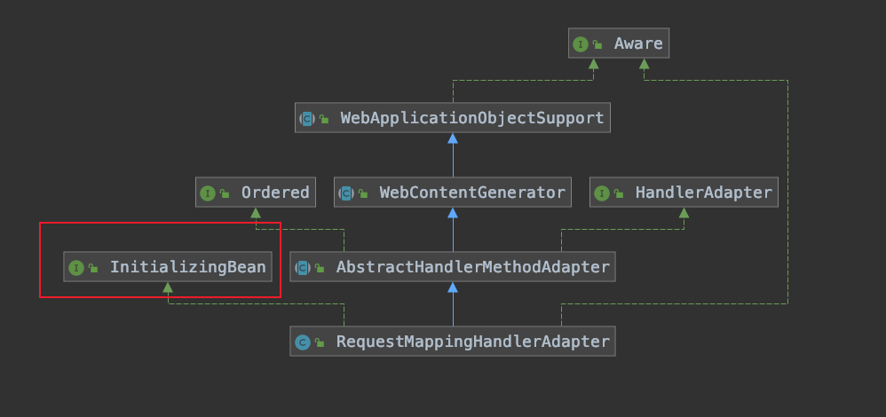

# RequestMappingHandlerAdapter的初始化

[TOC]


## RequestMappingHandlerAdapter的类图





## 注入RequestMappingHandlerAdapter并实例化

```java
@Bean
public RequestMappingHandlerAdapter requestMappingHandlerAdapter() {
   RequestMappingHandlerAdapter adapter = createRequestMappingHandlerAdapter();
   adapter.setContentNegotiationManager(mvcContentNegotiationManager());
   // 设置 HttpMessageConverter
   adapter.setMessageConverters(getMessageConverters());
   // 设置 ConversionService 以及 Validator
   adapter.setWebBindingInitializer(getConfigurableWebBindingInitializer());
   adapter.setCustomArgumentResolvers(getArgumentResolvers());
   adapter.setCustomReturnValueHandlers(getReturnValueHandlers());

   if (jackson2Present) {
      adapter.setRequestBodyAdvice(Collections.singletonList(new JsonViewRequestBodyAdvice()));
      adapter.setResponseBodyAdvice(Collections.singletonList(new JsonViewResponseBodyAdvice()));
   }

   AsyncSupportConfigurer configurer = new AsyncSupportConfigurer();
   configureAsyncSupport(configurer);
   if (configurer.getTaskExecutor() != null) {
      adapter.setTaskExecutor(configurer.getTaskExecutor());
   }
   if (configurer.getTimeout() != null) {
      adapter.setAsyncRequestTimeout(configurer.getTimeout());
   }
   adapter.setCallableInterceptors(configurer.getCallableInterceptors());
   adapter.setDeferredResultInterceptors(configurer.getDeferredResultInterceptors());

   return adapter;
}
```

添加 HttpMessageConverter

```java
protected final List<HttpMessageConverter<?>> getMessageConverters() {
   if (this.messageConverters == null) {
      this.messageConverters = new ArrayList<>();
      configureMessageConverters(this.messageConverters);
      if (this.messageConverters.isEmpty()) {
         // 加入 defaultHttpMessageConverter，通常直接删除
         addDefaultHttpMessageConverters(this.messageConverters);
      }
      // 重写该方法
      extendMessageConverters(this.messageConverters);
   }
   return this.messageConverters;
}
```

加入 stringHttpMessageConverter 和 fastJsonHttpMessageConverter

```
protected void extendMessageConverters(List<HttpMessageConverter<?>> converters) {
   converters.clear();
   converters.add(stringHttpMessageConverter());
   converters.add(fastJsonHttpMessageConverter());
}
```


添加 ConversionService

```java
protected ConfigurableWebBindingInitializer getConfigurableWebBindingInitializer() {
   ConfigurableWebBindingInitializer initializer = new ConfigurableWebBindingInitializer();
   // 设置 ConversionService
   initializer.setConversionService(mvcConversionService());
   // 设置 Validator
   initializer.setValidator(mvcValidator());
   MessageCodesResolver messageCodesResolver = getMessageCodesResolver();
   if (messageCodesResolver != null) {
      initializer.setMessageCodesResolver(messageCodesResolver);
   }
   return initializer;
}
```

```java
@Bean
public FormattingConversionService mvcConversionService() {
   FormattingConversionService conversionService = new DefaultFormattingConversionService();
   // 添加自定义的 Converter
   addFormatters(conversionService);
   return conversionService;
}
```

其中 DefaultFormattingConversionService 含有大量的 Converter 用来参数转换


## 调用 afterPropertiesSet 进行初始化

因为RequestMappingHandlerAdapter实现InitializingBean接口所以在spring初始化的时候调用在RequestMappingHandlerAdapter的afterPropertiesSet方法

```java
@Override
public void afterPropertiesSet() {
   // Do this first, it may add ResponseBody advice beans
   // 解析标注了 @ControllerAdvice 的类中的 @InitBinder @ModelAttribute 方法
   initControllerAdviceCache();

   // 设置 argumentResolvers
   if (this.argumentResolvers == null) {
      List<HandlerMethodArgumentResolver> resolvers = getDefaultArgumentResolvers();
      this.argumentResolvers = new HandlerMethodArgumentResolverComposite().addResolvers(resolvers);
   }
   if (this.initBinderArgumentResolvers == null) {
      List<HandlerMethodArgumentResolver> resolvers = getDefaultInitBinderArgumentResolvers();
      this.initBinderArgumentResolvers = new HandlerMethodArgumentResolverComposite().addResolvers(resolvers);
   }
   // 设置 returnValueHandlers
   if (this.returnValueHandlers == null) {
      List<HandlerMethodReturnValueHandler> handlers = getDefaultReturnValueHandlers();
      this.returnValueHandlers = new HandlerMethodReturnValueHandlerComposite().addHandlers(handlers);
   }
}
```

解析标注了 @ControllerAdvice 的类中的 @InitBinder @ModelAttribute 方法

```java
private void initControllerAdviceCache() {
   if (getApplicationContext() == null) {
      return;
   }
   if (logger.isInfoEnabled()) {
      logger.info("Looking for @ControllerAdvice: " + getApplicationContext());
   }

   // 拿到 ControllerAdvice 标注的类
   List<ControllerAdviceBean> adviceBeans = ControllerAdviceBean.findAnnotatedBeans(getApplicationContext());
   AnnotationAwareOrderComparator.sort(adviceBeans);

   List<Object> requestResponseBodyAdviceBeans = new ArrayList<>();

   for (ControllerAdviceBean adviceBean : adviceBeans) {
      Class<?> beanType = adviceBean.getBeanType();
      if (beanType == null) {
         throw new IllegalStateException("Unresolvable type for ControllerAdviceBean: " + adviceBean);
      }
      // 设置 ModelAttribute 标注的方法
      Set<Method> attrMethods = MethodIntrospector.selectMethods(beanType, MODEL_ATTRIBUTE_METHODS);
      if (!attrMethods.isEmpty()) {
         this.modelAttributeAdviceCache.put(adviceBean, attrMethods);
         if (logger.isInfoEnabled()) {
            logger.info("Detected @ModelAttribute methods in " + adviceBean);
         }
      }
      // 设置 InitBinder 标注的方法
      Set<Method> binderMethods = MethodIntrospector.selectMethods(beanType, INIT_BINDER_METHODS);
      if (!binderMethods.isEmpty()) {
         this.initBinderAdviceCache.put(adviceBean, binderMethods);
         if (logger.isInfoEnabled()) {
            logger.info("Detected @InitBinder methods in " + adviceBean);
         }
      }

      boolean isRequestBodyAdvice = RequestBodyAdvice.class.isAssignableFrom(beanType);
      boolean isResponseBodyAdvice = ResponseBodyAdvice.class.isAssignableFrom(beanType);
      if (isRequestBodyAdvice || isResponseBodyAdvice) {
         requestResponseBodyAdviceBeans.add(adviceBean);
         if (logger.isInfoEnabled()) {
            if (isRequestBodyAdvice) {
               logger.info("Detected RequestBodyAdvice bean in " + adviceBean);
            }
            else {
               logger.info("Detected ResponseBodyAdvice bean in " + adviceBean);
            }
         }
      }
   }

   if (!requestResponseBodyAdviceBeans.isEmpty()) {
      this.requestResponseBodyAdvice.addAll(0, requestResponseBodyAdviceBeans);
   }
}
```

设置默认的 argumentResolvers

```java
private List<HandlerMethodArgumentResolver> getDefaultArgumentResolvers() {
   List<HandlerMethodArgumentResolver> resolvers = new ArrayList<>();

   // Annotation-based argument resolution
   resolvers.add(new RequestParamMethodArgumentResolver(getBeanFactory(), false));
   resolvers.add(new RequestParamMapMethodArgumentResolver());
   resolvers.add(new PathVariableMethodArgumentResolver());
   resolvers.add(new PathVariableMapMethodArgumentResolver());
   resolvers.add(new MatrixVariableMethodArgumentResolver());
   resolvers.add(new MatrixVariableMapMethodArgumentResolver());
   resolvers.add(new ServletModelAttributeMethodProcessor(false));
   resolvers.add(new RequestResponseBodyMethodProcessor(getMessageConverters(), this.requestResponseBodyAdvice));
   resolvers.add(new RequestPartMethodArgumentResolver(getMessageConverters(), this.requestResponseBodyAdvice));
   resolvers.add(new RequestHeaderMethodArgumentResolver(getBeanFactory()));
   resolvers.add(new RequestHeaderMapMethodArgumentResolver());
   resolvers.add(new ServletCookieValueMethodArgumentResolver(getBeanFactory()));
   resolvers.add(new ExpressionValueMethodArgumentResolver(getBeanFactory()));
   resolvers.add(new SessionAttributeMethodArgumentResolver());
   resolvers.add(new RequestAttributeMethodArgumentResolver());

   // Type-based argument resolution
   resolvers.add(new ServletRequestMethodArgumentResolver());
   resolvers.add(new ServletResponseMethodArgumentResolver());
   resolvers.add(new HttpEntityMethodProcessor(getMessageConverters(), this.requestResponseBodyAdvice));
   resolvers.add(new RedirectAttributesMethodArgumentResolver());
   resolvers.add(new ModelMethodProcessor());
   resolvers.add(new MapMethodProcessor());
   resolvers.add(new ErrorsMethodArgumentResolver());
   resolvers.add(new SessionStatusMethodArgumentResolver());
   resolvers.add(new UriComponentsBuilderMethodArgumentResolver());

   // Custom arguments
   if (getCustomArgumentResolvers() != null) {
      resolvers.addAll(getCustomArgumentResolvers());
   }

   // Catch-all
   resolvers.add(new RequestParamMethodArgumentResolver(getBeanFactory(), true));
   resolvers.add(new ServletModelAttributeMethodProcessor(true));

   return resolvers;
}
```

设置默认的 returnValueHandlers

```java
private List<HandlerMethodReturnValueHandler> getDefaultReturnValueHandlers() {
   List<HandlerMethodReturnValueHandler> handlers = new ArrayList<>();

   // Single-purpose return value types
   handlers.add(new ModelAndViewMethodReturnValueHandler());
   handlers.add(new ModelMethodProcessor());
   handlers.add(new ViewMethodReturnValueHandler());
   handlers.add(new ResponseBodyEmitterReturnValueHandler(getMessageConverters(),
         this.reactiveAdapterRegistry, this.taskExecutor, this.contentNegotiationManager));
   handlers.add(new StreamingResponseBodyReturnValueHandler());
   handlers.add(new HttpEntityMethodProcessor(getMessageConverters(),
         this.contentNegotiationManager, this.requestResponseBodyAdvice));
   handlers.add(new HttpHeadersReturnValueHandler());
   handlers.add(new CallableMethodReturnValueHandler());
   handlers.add(new DeferredResultMethodReturnValueHandler());
   handlers.add(new AsyncTaskMethodReturnValueHandler(this.beanFactory));

   // Annotation-based return value types
   handlers.add(new ModelAttributeMethodProcessor(false));
   handlers.add(new RequestResponseBodyMethodProcessor(getMessageConverters(),
         this.contentNegotiationManager, this.requestResponseBodyAdvice));

   // Multi-purpose return value types
   handlers.add(new ViewNameMethodReturnValueHandler());
   handlers.add(new MapMethodProcessor());

   // Custom return value types
   if (getCustomReturnValueHandlers() != null) {
      handlers.addAll(getCustomReturnValueHandlers());
   }

   // Catch-all
   if (!CollectionUtils.isEmpty(getModelAndViewResolvers())) {
      handlers.add(new ModelAndViewResolverMethodReturnValueHandler(getModelAndViewResolvers()));
   }
   else {
      handlers.add(new ModelAttributeMethodProcessor(true));
   }

   return handlers;
}
```

## 总结

在RequestMappingHandlerAdapter初始化时，设置好 参数解析器HandlerMethodArgumentResolver、返回值解析器HandlerMethodReturnValueHandler、类型转换器DefaultFormattingConversionService
