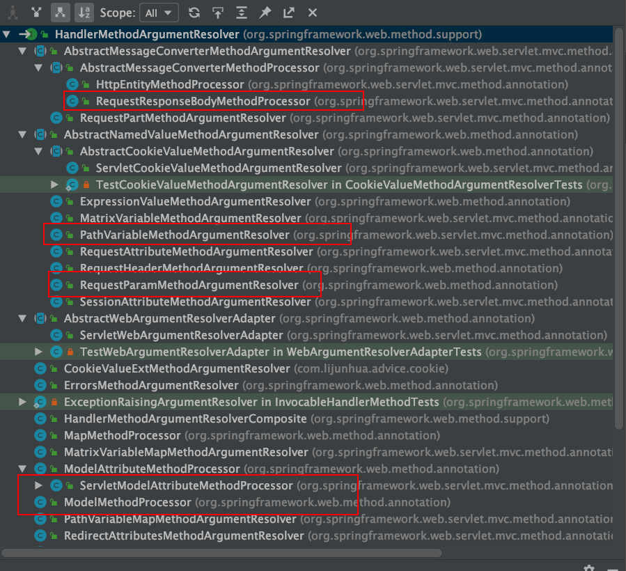
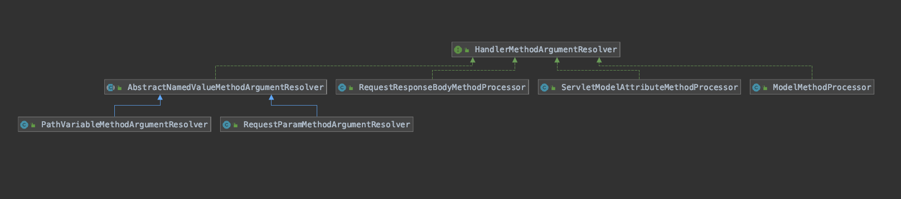

# SpringMVC的http请求的参数解析HandlerMethodArgumentResolver流程


[TOC]

## 本文分析的HandlerMethodArgumentResolver



## 初始化解析映射关系

得到请求 url 与 RequestMappingInfo 的映射关系到 urlLookup 中；设置 RequestMappingInfo 与 HandlerMethod 的映射关系到 mappingLookup 中。得到 url -> HandlerMethod 的映射关系。

详见[RequestMappingHandlerMapping的初始化](SpringMVC系列六：RequestMappingHandlerMapping的初始化.md)

## 处理请求

调用DispatcherServlet#doService->DispatcherServlet#doDispatch方法

```java
protected void doDispatch(HttpServletRequest request, HttpServletResponse response) throws Exception {
   HttpServletRequest processedRequest = request;
   HandlerExecutionChain mappedHandler = null;
   boolean multipartRequestParsed = false;

   WebAsyncManager asyncManager = WebAsyncUtils.getAsyncManager(request);

   try {
      ModelAndView mv = null;
      Exception dispatchException = null;

      try {
         // processedRequest是经过checkMultipart方法处理过的request请求,
         //  如果不满足multipart条件，直接返回request,也就是request没有做任何处理,
         //  如果满足multipart基本条件将multipartRequest转换为StandardMultipartHttpServletRequest请求。
         processedRequest = checkMultipart(request);
         multipartRequestParsed = (processedRequest != request);

         // Determine handler for the current request.
         // DispatcherServlet.getHandler方法会在底层调用HandlerMapping.getHandler方法
         // 这个方法中会遍 历DispatcherServlet中的private List<HandlerMapping>
         // handlerMappings链表，找到能够处理当前 request请求的第一个HandlerMapping实例并返回：
         // DispatcherServlet接收到请求后，HandlerMapping将会把请求封装为HandlerExecutionChain，
         //  而HandlerExecutionChain包含请求的所有信息，包括拦截器、Handler处理器等。
         //  HandlerExecutionChain为真正的Handler对象与Interceptor的组合类
         mappedHandler = getHandler(processedRequest);
         if (mappedHandler == null) {
            // 如果没有找到对应的handler则抛出异常。
            noHandlerFound(processedRequest, response);
            return;
         }

         // Determine handler adapter for the current request.
         // 通过getHandlerAdapter方法找到handler对应的HandlerAdapter
         //  则是遍历HandlerAdpaters，然后返回第一个支持handler的Adpater.

         // SimpleControllerHandlerAdapter是用来适配SimpleUrlHandlerMapping和BeanNameUrlHandlerMapping的映射的，也就是实现Controller接口的Handler。
         // RequestMappingHandlerAdapter是用来适配RequestMappingHandlerMapping，也就是我们常用的RequestMapping注解。
         // HttpRequestHandlerAdapter是用来适配远程调用的。
         HandlerAdapter ha = getHandlerAdapter(mappedHandler.getHandler());

         // Process last-modified header, if supported by the handler.
         String method = request.getMethod();
         boolean isGet = "GET".equals(method);
         if (isGet || "HEAD".equals(method)) {
            long lastModified = ha.getLastModified(request, mappedHandler.getHandler());
            if (logger.isDebugEnabled()) {
               logger.debug("Last-Modified value for [" + getRequestUri(request) + "] is: " + lastModified);
            }
            if (new ServletWebRequest(request, response).checkNotModified(lastModified) && isGet) {
               return;
            }
         }

         // 如果有拦截器，执行拦截器preHandler方法
         //  如果拦截器preHandle返回false，那么请求终止。
         if (!mappedHandler.applyPreHandle(processedRequest, response)) {
            return;
         }

         // Actually invoke the handler.
         // todo HandlerAdapter执行handle方法处理请求，返回ModelAndView
         mv = ha.handle(processedRequest, response, mappedHandler.getHandler());

         if (asyncManager.isConcurrentHandlingStarted()) {
            return;
         }

         // 如果返回的ModelAndView不为null，并且没有设置view的话，这设置默认的view
         applyDefaultViewName(processedRequest, mv);
         // 如果有拦截器，执行拦截器postHandle方法
         mappedHandler.applyPostHandle(processedRequest, response, mv);
      }
      catch (Exception ex) {
         dispatchException = ex;
      }
      catch (Throwable err) {
         // As of 4.3, we're processing Errors thrown from handler methods as well,
         // making them available for @ExceptionHandler methods and other scenarios.
         dispatchException = new NestedServletException("Handler dispatch failed", err);
      }
      // 然后调用processDispatchResult方法处理请求结果，封装到response中
      //  DispatcherServlet会将ModelAndView对象传入View层进行渲染
      processDispatchResult(processedRequest, response, mappedHandler, mv, dispatchException);
   }
   catch (Exception ex) {
      triggerAfterCompletion(processedRequest, response, mappedHandler, ex);
   }
   catch (Throwable err) {
      triggerAfterCompletion(processedRequest, response, mappedHandler,
            new NestedServletException("Handler processing failed", err));
   }
   finally {
      if (asyncManager.isConcurrentHandlingStarted()) {
         // Instead of postHandle and afterCompletion
         if (mappedHandler != null) {
            mappedHandler.applyAfterConcurrentHandlingStarted(processedRequest, response);
         }
      }
      else {
         // Clean up any resources used by a multipart request.
         if (multipartRequestParsed) {
            cleanupMultipart(processedRequest);
         }
      }
   }
}
```

```java
public final ModelAndView handle(HttpServletRequest request, HttpServletResponse response, Object handler)
      throws Exception {

   return handleInternal(request, response, (HandlerMethod) handler);
}
```

```java
protected ModelAndView handleInternal(HttpServletRequest request,
      HttpServletResponse response, HandlerMethod handlerMethod) throws Exception {

   ModelAndView mav;
   checkRequest(request);

   // Execute invokeHandlerMethod in synchronized block if required.
   // 判断当前是否需要支持在同一个session中只能线性地处理请求
   if (this.synchronizeOnSession) {
      // 获取当前请求的session对象
      HttpSession session = request.getSession(false);
      if (session != null) {
         // 为当前session生成一个唯一的可以用于锁定的key
         Object mutex = WebUtils.getSessionMutex(session);
         synchronized (mutex) {
            // 对HandlerMethod进行参数等的适配处理，并调用目标handler
            mav = invokeHandlerMethod(request, response, handlerMethod);
         }
      }
      else {
         // No HttpSession available -> no mutex necessary
         // 如果当前不存在session，则直接对HandlerMethod进行适配
         mav = invokeHandlerMethod(request, response, handlerMethod);
      }
   }
   else {
      // No synchronization on session demanded at all...
      // 如果当前不需要对session进行同步处理，则直接对HandlerMethod进行适配
      mav = invokeHandlerMethod(request, response, handlerMethod);
   }
	...
   return mav;
}
```

之后调invocableMethod.invokeAndHandle(webRequest, mavContainer);

```java
protected ModelAndView invokeHandlerMethod(HttpServletRequest request,
      HttpServletResponse response, HandlerMethod handlerMethod) throws Exception {

   ServletWebRequest webRequest = new ServletWebRequest(request, response);
   try {
      // 使用initBinderAdviceCache对@initBinder进行处理
      // 获取容器中全局配置的InitBinder和当前HandlerMethod所对应的Controller中
      // 配置的InitBinder，用于进行参数的绑定
      WebDataBinderFactory binderFactory = getDataBinderFactory(handlerMethod);

      // 使用modelAttributeAdviceCache对@ModelAttribute进行处理
      // 获取容器中全局配置的ModelAttribute和当前当前HandlerMethod所对应的Controller
      // 中配置的ModelAttribute，这些配置的方法将会在目标方法调用之前进行调用
      ModelFactory modelFactory = getModelFactory(handlerMethod, binderFactory);

      // 将handlerMethod封装为一个ServletInvocableHandlerMethod对象，
      // 该对象用于对当前request的整体调用流程进行了封装
      ServletInvocableHandlerMethod invocableMethod = createInvocableHandlerMethod(handlerMethod);
      if (this.argumentResolvers != null) {
         // 设置当前容器中配置的所有ArgumentResolver
         invocableMethod.setHandlerMethodArgumentResolvers(this.argumentResolvers);
      }
      if (this.returnValueHandlers != null) {
         // 设置当前容器中配置的所有ReturnValueHandler
         invocableMethod.setHandlerMethodReturnValueHandlers(this.returnValueHandlers);
      }
      // 将前面创建的WebDataBinderFactory设置到ServletInvocableHandlerMethod中
      invocableMethod.setDataBinderFactory(binderFactory);
      // 设置ParameterNameDiscoverer，该对象将按照一定的规则获取当前参数的名称
      invocableMethod.setParameterNameDiscoverer(this.parameterNameDiscoverer);

      ModelAndViewContainer mavContainer = new ModelAndViewContainer();
      mavContainer.addAllAttributes(RequestContextUtils.getInputFlashMap(request));
      // 这里initModel()方法主要作用是调用前面获取到的@ModelAttribute标注的方法，
      // 从而达到@ModelAttribute标注的方法能够在目标Handler调用之前调用的目的
      modelFactory.initModel(webRequest, mavContainer, invocableMethod);

      // 获取当前的AsyncWebRequest，这里AsyncWebRequest的主要作用是用于判断目标
      // handler的返回值是否为WebAsyncTask或DefferredResult，如果是这两种中的一种，
      // 则说明当前请求的处理应该是异步的。所谓的异步，指的是当前请求会将Controller中
      // 封装的业务逻辑放到一个线程池中进行调用，待该调用有返回结果之后再返回到response中。
      // 这种处理的优点在于用于请求分发的线程能够解放出来，从而处理更多的请求，只有待目标任务
      // 完成之后才会回来将该异步任务的结果返回。
      mavContainer.setIgnoreDefaultModelOnRedirect(this.ignoreDefaultModelOnRedirect);

      // 封装异步任务的线程池，request和interceptors到WebAsyncManager中
      AsyncWebRequest asyncWebRequest = WebAsyncUtils.createAsyncWebRequest(request, response);
      asyncWebRequest.setTimeout(this.asyncRequestTimeout);

      WebAsyncManager asyncManager = WebAsyncUtils.getAsyncManager(request);
      asyncManager.setTaskExecutor(this.taskExecutor);
      asyncManager.setAsyncWebRequest(asyncWebRequest);
      asyncManager.registerCallableInterceptors(this.callableInterceptors);
      asyncManager.registerDeferredResultInterceptors(this.deferredResultInterceptors);

      // 这里就是用于判断当前请求是否有异步任务结果的，如果存在，则对异步任务结果进行封装
      if (asyncManager.hasConcurrentResult()) {
         Object result = asyncManager.getConcurrentResult();
         mavContainer = (ModelAndViewContainer) asyncManager.getConcurrentResultContext()[0];
         asyncManager.clearConcurrentResult();
         if (logger.isDebugEnabled()) {
            logger.debug("Found concurrent result value [" + result + "]");
         }
         // 封装异步任务的处理结果，虽然封装的是一个HandlerMethod，但只是Spring简单的封装
         // 的一个Callable对象，该对象中直接将调用结果返回了。这样封装的目的在于能够统一的
         // 进行右面的ServletInvocableHandlerMethod.invokeAndHandle()方法的调用
         invocableMethod = invocableMethod.wrapConcurrentResult(result);
      }

      // 完成过程调用
      // 对请求参数进行处理，调用目标HandlerMethod，并且将返回值封装为一个ModelAndView对象
      invocableMethod.invokeAndHandle(webRequest, mavContainer);
      if (asyncManager.isConcurrentHandlingStarted()) {
         return null;
      }

      //2 包装ModelAndView
      // 对封装的ModelAndView进行处理，主要是判断当前请求是否进行了重定向，如果进行了重定向，
      // 还会判断是否需要将FlashAttributes封装到新的请求中
      return getModelAndView(mavContainer, modelFactory, webRequest);
   }
   finally {
      // 调用request destruction callbacks和对SessionAttributes进行处理
      webRequest.requestCompleted();
   }
}
```

之后调用@ModelAttribute标注的方法

```java
public void initModel(NativeWebRequest request, ModelAndViewContainer container, HandlerMethod handlerMethod)
      throws Exception {

   // 在当前request中获取使用@SessionAttribute注解声明的参数
   Map<String, ?> sessionAttributes = this.sessionAttributesHandler.retrieveAttributes(request);
   // 将@SessionAttribute声明的参数封装到ModelAndViewContainer中
   container.mergeAttributes(sessionAttributes);
   // 调用前面获取的使用@ModelAttribute标注的方法
   invokeModelAttributeMethods(request, container);
   // 这里首先获取目标handler执行所需的参数中与@SessionAttribute同名或同类型的参数，
   // 也就是handler想要直接从@SessionAttribute中声明的参数中获取的参数。然后对这些参数
   // 进行遍历，首先判断request中是否包含该属性，如果不包含，则从之前的SessionAttribute缓存
   // 中获取，如果两个都没有，则直接抛出异常
   for (String name : findSessionAttributeArguments(handlerMethod)) {
      if (!container.containsAttribute(name)) {
         Object value = this.sessionAttributesHandler.retrieveAttribute(request, name);
         if (value == null) {
            throw new HttpSessionRequiredException("Expected session attribute '" + name + "'", name);
         }
         container.addAttribute(name, value);
      }
   }
}
```

```java
private void invokeModelAttributeMethods(NativeWebRequest request, ModelAndViewContainer container)
      throws Exception {

   while (!this.modelMethods.isEmpty()) {
      // 这里getNextModelMethod()方法始终会获取modelMethods中的第0号为的方法，
      // 后续该方法执行完了之后则会将该方法从modelMethods移除掉，因而这里while
      // 循环只需要判断modelMethods是否为空即可
      InvocableHandlerMethod modelMethod = getNextModelMethod(container).getHandlerMethod();
      // 获取当前方法中标注的ModelAttribute属性，然后判断当前request中是否有与该属性中name字段
      // 标注的值相同的属性，如果存在，并且当前ModelAttribute设置了不对该属性进行绑定，那么
      // 就直接略过当前方法的执行
      ModelAttribute ann = modelMethod.getMethodAnnotation(ModelAttribute.class);
      Assert.state(ann != null, "No ModelAttribute annotation");
      if (container.containsAttribute(ann.name())) {
         if (!ann.binding()) {
            container.setBindingDisabled(ann.name());
         }
         continue;
      }

      // 通过ArgumentResolver对方法参数进行处理，并且调用目标方法
      Object returnValue = modelMethod.invokeForRequest(request, container);
      // 如果当前方法的返回值不为空，则判断当前@ModelAttribute是否设置了需要绑定返回值，
      // 如果设置了，则将返回值绑定到请求中，后续handler可以直接使用该参数
      if (!modelMethod.isVoid()){
         String returnValueName = getNameForReturnValue(returnValue, modelMethod.getReturnType());
         if (!ann.binding()) {
            container.setBindingDisabled(returnValueName);
         }
         // 如果request中不包含该参数，则将该返回值添加到ModelAndViewContainer中，
         // 供handler使用
         if (!container.containsAttribute(returnValueName)) {
            container.addAttribute(returnValueName, returnValue);
         }
      }
   }
}
```

```java
public Object invokeForRequest(NativeWebRequest request, @Nullable ModelAndViewContainer mavContainer,
      Object... providedArgs) throws Exception {

   // 处理方法的参数值
   if (logger.isDebugEnabled()) {
      logger.debug("使用HandlerMethodArgumentResolver来处理方法的参数值");
   }
   Object[] args = getMethodArgumentValues(request, mavContainer, providedArgs);
   if (logger.isTraceEnabled()) {
      logger.trace("Invoking '" + ClassUtils.getQualifiedMethodName(getMethod(), getBeanType()) +
            "' with arguments " + Arrays.toString(args));
   }
   // 这里doInvoke()方法主要是结合处理后的参数，使用反射对目标方法进行调用
   Object returnValue = doInvoke(args);
   if (logger.isTraceEnabled()) {
      logger.trace("Method [" + ClassUtils.getQualifiedMethodName(getMethod(), getBeanType()) +
            "] returned [" + returnValue + "]");
   }
   return returnValue;
}
```

反射调用@ModelAttribute标注的方法

```java
protected Object doInvoke(Object... args) throws Exception {
   ReflectionUtils.makeAccessible(getBridgedMethod());
   try {
      return getBridgedMethod().invoke(getBean(), args);
   }
   catch (IllegalArgumentException ex) {
      assertTargetBean(getBridgedMethod(), getBean(), args);
      String text = (ex.getMessage() != null ? ex.getMessage() : "Illegal argument");
      throw new IllegalStateException(getInvocationErrorMessage(text, args), ex);
   }
   catch (InvocationTargetException ex) {
      // Unwrap for HandlerExceptionResolvers ...
      Throwable targetException = ex.getTargetException();
      if (targetException instanceof RuntimeException) {
         throw (RuntimeException) targetException;
      }
      else if (targetException instanceof Error) {
         throw (Error) targetException;
      }
      else if (targetException instanceof Exception) {
         throw (Exception) targetException;
      }
      else {
         String text = getInvocationErrorMessage("Failed to invoke handler method", args);
         throw new IllegalStateException(text, targetException);
      }
   }
}
```


### 解析请求参数

本次解析Model参数，@RequestBody标注参数，@RequestParam标注参数，@PathVariable标注参数，以及普通入参

在Object[] args = getMethodArgumentValues(request, mavContainer, providedArgs);里面解析请求参数

```java
private Object[] getMethodArgumentValues(NativeWebRequest request, @Nullable ModelAndViewContainer mavContainer,
      Object... providedArgs) throws Exception {

   // 获取当前handler所声明的所有参数，主要包括参数名，参数类型，参数位置，所标注的注解等等属性
   MethodParameter[] parameters = getMethodParameters();
   Object[] args = new Object[parameters.length];
   for (int i = 0; i < parameters.length; i++) {
      MethodParameter parameter = parameters[i];
      parameter.initParameterNameDiscovery(this.parameterNameDiscoverer);
      // providedArgs是调用方提供的参数，这里主要是判断这些参数中是否有当前类型
      // 或其子类型的参数，如果有，则直接使用调用方提供的参数，对于请求处理而言，默认情况下，
      // 调用方提供的参数都是长度为0的数组
      args[i] = resolveProvidedArgument(parameter, providedArgs);
      if (args[i] != null) {
         continue;
      }
      // 如果在调用方提供的参数中不能找到当前类型的参数值，则遍历Spring容器中所有的
      // ArgumentResolver，判断哪种类型的Resolver支持对当前参数的解析，这里的判断
      // 方式比较简单，比如RequestParamMethodArgumentResolver就是判断当前参数
      // 是否使用@RequestParam注解进行了标注
      if (this.argumentResolvers.supportsParameter(parameter)) {
         try {
            // 如果能够找到对当前参数进行处理的ArgumentResolver，则调用其
            // resolveArgument()方法从request中获取对应的参数值，并且进行转换
            args[i] = this.argumentResolvers.resolveArgument(
                  parameter, mavContainer, request, this.dataBinderFactory);
            if (logger.isDebugEnabled()) {
               logger.debug("处理后参数值："+args[i]);
            }
            continue;
         }
         catch (Exception ex) {
            if (logger.isDebugEnabled()) {
               logger.debug(getArgumentResolutionErrorMessage("Failed to resolve", i), ex);
            }
            throw ex;
         }
      }
      // 如果进行了参数处理之后当前参数还是为空，则抛出异常
      if (args[i] == null) {
         throw new IllegalStateException("Could not resolve method parameter at index " +
               parameter.getParameterIndex() + " in " + parameter.getExecutable().toGenericString() +
               ": " + getArgumentResolutionErrorMessage("No suitable resolver for", i));
      }
   }
   return args;
}
```

```java
public boolean supportsParameter(MethodParameter parameter) {
   return getArgumentResolver(parameter) != null;
}
```

```java
private HandlerMethodArgumentResolver getArgumentResolver(MethodParameter parameter) {
   HandlerMethodArgumentResolver result = this.argumentResolverCache.get(parameter);
   if (result == null) {
      for (HandlerMethodArgumentResolver resolver : this.argumentResolvers) {
         if (resolver.supportsParameter(parameter)) {
            result = resolver;
            this.argumentResolverCache.put(parameter, result);
            break;
         }
      }
   }
   return result;
}
```

#### Model参数解析器是：ModelMethodProcessor

##### 判断是否能解析

```java
public boolean supportsParameter(MethodParameter parameter) {
   return Model.class.isAssignableFrom(parameter.getParameterType());
}
```

##### 处理参数

```java
public Object resolveArgument(MethodParameter parameter, @Nullable ModelAndViewContainer mavContainer,
      NativeWebRequest webRequest, @Nullable WebDataBinderFactory binderFactory) throws Exception {

   Assert.state(mavContainer != null, "ModelAndViewContainer is required for model exposure");
   return mavContainer.getModel();
}
```

#### @RequestBody标注参数的参数解析器是：RequestResponseBodyMethodProcessor

前提是：必须要引入json解析相关的类，

例如：1.fastjson需要引入com.alibaba.fastjson并添加HttpMessageConverter

```java
@Override
	protected void extendMessageConverters(List<HttpMessageConverter<?>> converters) {
		converters.clear();
		converters.add(stringHttpMessageConverter());
		converters.add(fastJsonHttpMessageConverter());
	}
@Bean
	public FastJsonHttpMessageConverter fastJsonHttpMessageConverter() {
		FastJsonHttpMessageConverter fastJsonHttpMessageConverter = new FastJsonHttpMessageConverter();

		FastJsonConfig fastJsonConfig = new FastJsonConfig();
		fastJsonConfig.setSerializerFeatures(
				SerializerFeature.QuoteFieldNames,
				SerializerFeature.WriteMapNullValue,//保留空的字段
				SerializerFeature.WriteNullListAsEmpty,//List null-> []
				SerializerFeature.WriteDateUseDateFormat,// 日期格式化
				SerializerFeature.WriteNullStringAsEmpty);//String null -> ""

		List<MediaType> mediaTypeList = new ArrayList<>();
		mediaTypeList.add(MediaType.APPLICATION_JSON_UTF8);
		mediaTypeList.add(MediaType.APPLICATION_JSON);
		fastJsonHttpMessageConverter.setSupportedMediaTypes(mediaTypeList);
		fastJsonHttpMessageConverter.setFastJsonConfig(fastJsonConfig);
		return fastJsonHttpMessageConverter;
	}

	/**
	 * 在ResponseBody注解下，Spring处理返回值为String时会用到StringHttpMessageConverter
	 *
	 */
	@Bean
	public StringHttpMessageConverter stringHttpMessageConverter() {
		StringHttpMessageConverter httpMessageConverter = new StringHttpMessageConverter();
		httpMessageConverter.setDefaultCharset(Charset.forName("UTF-8"));
		return httpMessageConverter;
	}
```

2.如果使用jackson需要pom引入：com.fasterxml.jackson.core.jackson-databind


下面以fastjson为例进行解析

##### 判断是否能解析

```java
public boolean supportsParameter(MethodParameter parameter) {
   return parameter.hasParameterAnnotation(RequestBody.class);
}
```

##### 处理参数

```java
public Object resolveArgument(MethodParameter parameter, @Nullable ModelAndViewContainer mavContainer,
      NativeWebRequest webRequest, @Nullable WebDataBinderFactory binderFactory) throws Exception {

   parameter = parameter.nestedIfOptional();
   // 使用 HttpMessageConverter 将 请求body 中数据解析出来
   Object arg = readWithMessageConverters(webRequest, parameter, parameter.getNestedGenericParameterType());
   String name = Conventions.getVariableNameForParameter(parameter);

   if (binderFactory != null) {
      WebDataBinder binder = binderFactory.createBinder(webRequest, arg, name);
      if (arg != null) {
         validateIfApplicable(binder, parameter);
         if (binder.getBindingResult().hasErrors() && isBindExceptionRequired(binder, parameter)) {
            throw new MethodArgumentNotValidException(parameter, binder.getBindingResult());
         }
      }
      if (mavContainer != null) {
         mavContainer.addAttribute(BindingResult.MODEL_KEY_PREFIX + name, binder.getBindingResult());
      }
   }

   return adaptArgumentIfNecessary(arg, parameter);
}
```

```java
protected <T> Object readWithMessageConverters(NativeWebRequest webRequest, MethodParameter parameter,
      Type paramType) throws IOException, HttpMediaTypeNotSupportedException, HttpMessageNotReadableException {

   HttpServletRequest servletRequest = webRequest.getNativeRequest(HttpServletRequest.class);
   Assert.state(servletRequest != null, "No HttpServletRequest");
   ServletServerHttpRequest inputMessage = new ServletServerHttpRequest(servletRequest);

   // 使用 HttpMessageConverter 将 请求body 中数据解析出来
   Object arg = readWithMessageConverters(inputMessage, parameter, paramType);
   if (arg == null && checkRequired(parameter)) {
      throw new HttpMessageNotReadableException("Required request body is missing: " +
            parameter.getExecutable().toGenericString());
   }
   return arg;
}
```

```java
protected <T> Object readWithMessageConverters(HttpInputMessage inputMessage, MethodParameter parameter,
      Type targetType) throws IOException, HttpMediaTypeNotSupportedException, HttpMessageNotReadableException {

   MediaType contentType;
   boolean noContentType = false;
   try {
      // 获取 ContentType
      contentType = inputMessage.getHeaders().getContentType();
   }
   catch (InvalidMediaTypeException ex) {
      throw new HttpMediaTypeNotSupportedException(ex.getMessage());
   }
   if (contentType == null) {
      noContentType = true;
      contentType = MediaType.APPLICATION_OCTET_STREAM;
   }

   Class<?> contextClass = parameter.getContainingClass();
   // 获取 method 的参数的类型
   Class<T> targetClass = (targetType instanceof Class ? (Class<T>) targetType : null);
   if (targetClass == null) {
      ResolvableType resolvableType = ResolvableType.forMethodParameter(parameter);
      targetClass = (Class<T>) resolvableType.resolve();
   }

   HttpMethod httpMethod = (inputMessage instanceof HttpRequest ? ((HttpRequest) inputMessage).getMethod() : null);
   Object body = NO_VALUE;

   EmptyBodyCheckingHttpInputMessage message;
   try {
      message = new EmptyBodyCheckingHttpInputMessage(inputMessage);

      // 使用一个 HttpMessageConverter 将 请求body 中数据解析出来
      for (HttpMessageConverter<?> converter : this.messageConverters) {
         Class<HttpMessageConverter<?>> converterType = (Class<HttpMessageConverter<?>>) converter.getClass();
         GenericHttpMessageConverter<?> genericConverter =
               (converter instanceof GenericHttpMessageConverter ? (GenericHttpMessageConverter<?>) converter : null);
         // 选出一个 HttpMessageConverter
         if (genericConverter != null ? genericConverter.canRead(targetType, contextClass, contentType) :
               (targetClass != null && converter.canRead(targetClass, contentType))) {
            if (logger.isDebugEnabled()) {
               logger.debug("Read [" + targetType + "] as \"" + contentType + "\" with [" + converter + "]");
            }
            // 使用 HttpMessageConverter 解析数据
            if (message.hasBody()) {
               HttpInputMessage msgToUse =
                     getAdvice().beforeBodyRead(message, parameter, targetType, converterType);
               body = (genericConverter != null ? genericConverter.read(targetType, contextClass, msgToUse) :
                     ((HttpMessageConverter<T>) converter).read(targetClass, msgToUse));
               body = getAdvice().afterBodyRead(body, msgToUse, parameter, targetType, converterType);
            }
            else {
               body = getAdvice().handleEmptyBody(null, message, parameter, targetType, converterType);
            }
            break;
         }
      }
   }
   catch (IOException ex) {
      throw new HttpMessageNotReadableException("I/O error while reading input message", ex);
   }

   if (body == NO_VALUE) {
      if (httpMethod == null || !SUPPORTED_METHODS.contains(httpMethod) ||
            (noContentType && !message.hasBody())) {
         return null;
      }
      throw new HttpMediaTypeNotSupportedException(contentType, this.allSupportedMediaTypes);
   }

   return body;
}
```

```java
public boolean canRead(Class<?> clazz, @Nullable MediaType mediaType) {
   return supports(clazz) && canRead(mediaType);
}
```

FastJsonHttpMessageConverter的supports方法：

```java

protected boolean supports(Class<?> clazz) {
    return true;
}
```

FastJsonHttpMessageConverter支持两种类型的MediaType：application/json;charset=UTF-8, application/json

```java
protected boolean canRead(@Nullable MediaType mediaType) {
   if (mediaType == null) {
      return true;
   }
   for (MediaType supportedMediaType : getSupportedMediaTypes()) {
      if (supportedMediaType.includes(mediaType)) {
         return true;
      }
   }
   return false;
}
```

使用FastJsonHttpMessageConverter读取数据并反序列化成对象

```java
public Object read(Type type, //
                   Class<?> contextClass, //
                   HttpInputMessage inputMessage //
) throws IOException, HttpMessageNotReadableException {
    return readType(getType(type, contextClass), inputMessage);
}
```

```java
private Object readType(Type type, HttpInputMessage inputMessage) {

    try {
        InputStream in = inputMessage.getBody();
        return JSON.parseObject(in,
                fastJsonConfig.getCharset(),
                type,
                fastJsonConfig.getParserConfig(),
                fastJsonConfig.getParseProcess(),
                JSON.DEFAULT_PARSER_FEATURE,
                fastJsonConfig.getFeatures());
    } catch (JSONException ex) {
        throw new HttpMessageNotReadableException("JSON parse error: " + ex.getMessage(), ex);
    } catch (IOException ex) {
        throw new HttpMessageNotReadableException("I/O error while reading input message", ex);
    }
}
```

StringHttpMessageConverter的supports方法：

```java
@Override
public boolean supports(Class<?> clazz) {
   return String.class == clazz;
}
```

StringHttpMessageConverter支持的MediaType是MediaType.ALL，所以String类型且加@RequestBody标注的参数的都能处理。

使用StringHttpMessageConverter读取数据

```java
public final T read(Class<? extends T> clazz, HttpInputMessage inputMessage)
			throws IOException, HttpMessageNotReadableException {

		return readInternal(clazz, inputMessage);
	}

protected String readInternal(Class<? extends String> clazz, HttpInputMessage inputMessage) throws IOException {
   Charset charset = getContentTypeCharset(inputMessage.getHeaders().getContentType());
   return StreamUtils.copyToString(inputMessage.getBody(), charset);
}
```


#### @RequestParam标注参数以及没有注解的简单参数的参数解析器是：RequestParamMethodArgumentResolver

##### 判断是否能解析

```java
public boolean supportsParameter(MethodParameter parameter) {
   // 有 @RequestParam 注解
   if (parameter.hasParameterAnnotation(RequestParam.class)) {
      if (Map.class.isAssignableFrom(parameter.nestedIfOptional().getNestedParameterType())) {
         RequestParam requestParam = parameter.getParameterAnnotation(RequestParam.class);
         return (requestParam != null && StringUtils.hasText(requestParam.name()));
      }
      else {
         return true;
      }
   }
   else {
      if (parameter.hasParameterAnnotation(RequestPart.class)) {
         return false;
      }
      parameter = parameter.nestedIfOptional();
      if (MultipartResolutionDelegate.isMultipartArgument(parameter)) {
         return true;
      }
      else if (this.useDefaultResolution) {
        // 是简单参数
         return BeanUtils.isSimpleProperty(parameter.getNestedParameterType());
      }
      else {
         return false;
      }
   }
}
```


##### 处理参数

org.springframework.web.method.annotation.AbstractNamedValueMethodArgumentResolver#resolveArgument

```java
public final Object resolveArgument(MethodParameter parameter, @Nullable ModelAndViewContainer mavContainer,
      NativeWebRequest webRequest, @Nullable WebDataBinderFactory binderFactory) throws Exception {

   // 底层使用 asm 来获取方法中的参数的名称
   NamedValueInfo namedValueInfo = getNamedValueInfo(parameter);
   MethodParameter nestedParameter = parameter.nestedIfOptional();
   // 获取方法的参数名称
   Object resolvedName = resolveStringValue(namedValueInfo.name);
   if (resolvedName == null) {
      throw new IllegalArgumentException(
            "Specified name must not resolve to null: [" + namedValueInfo.name + "]");
   }
   // 根据方法的参数名称获取 http请求的参数值
   Object arg = resolveName(resolvedName.toString(), nestedParameter, webRequest);
   if (arg == null) {
      if (namedValueInfo.defaultValue != null) {
         arg = resolveStringValue(namedValueInfo.defaultValue);
      }
      else if (namedValueInfo.required && !nestedParameter.isOptional()) {
         handleMissingValue(namedValueInfo.name, nestedParameter, webRequest);
      }
      arg = handleNullValue(namedValueInfo.name, arg, nestedParameter.getNestedParameterType());
   }
   else if ("".equals(arg) && namedValueInfo.defaultValue != null) {
      arg = resolveStringValue(namedValueInfo.defaultValue);
   }

   if (binderFactory != null) {
      // 创建 WebDataBinder，并调用 @InitBinder 标注的方法
      WebDataBinder binder = binderFactory.createBinder(webRequest, null, namedValueInfo.name);
      try {
         // 使用 SimpleTypeConverter 转换，其中 conversionService 都是从 RequestMappingHandlerAdapter 中获取
         // conversionService 中含有大量默认的 Converter
         arg = binder.convertIfNecessary(arg, parameter.getParameterType(), parameter);
      }
      catch (ConversionNotSupportedException ex) {
         throw new MethodArgumentConversionNotSupportedException(arg, ex.getRequiredType(),
               namedValueInfo.name, parameter, ex.getCause());
      }
      catch (TypeMismatchException ex) {
         throw new MethodArgumentTypeMismatchException(arg, ex.getRequiredType(),
               namedValueInfo.name, parameter, ex.getCause());

      }
   }

   handleResolvedValue(arg, namedValueInfo.name, parameter, mavContainer, webRequest);

   return arg;
}
```

调用AbstractNamedValueMethodArgumentResolver#resolveStringValue 来解析参数名

```java
private Object resolveStringValue(String value) {
   if (this.configurableBeanFactory == null) {
      return value;
   }
   // ${} 解析处理
   String placeholdersResolved = this.configurableBeanFactory.resolveEmbeddedValue(value);
   BeanExpressionResolver exprResolver = this.configurableBeanFactory.getBeanExpressionResolver();
   if (exprResolver == null || this.expressionContext == null) {
      return value;
   }
   // #{} 解析处理
   return exprResolver.evaluate(placeholdersResolved, this.expressionContext);
}
```

org.springframework.web.bind.support.DefaultDataBinderFactory#createBinder创建 WebDataBinder，并调用 @InitBinder 标注的方法，在这个方法里面通常registerCustomEditor来注册用户自定义的转换器提供string->指定类的能力

```java
public final WebDataBinder createBinder(
			NativeWebRequest webRequest, @Nullable Object target, String objectName) throws Exception {

		WebDataBinder dataBinder = createBinderInstance(target, objectName, webRequest);
		if (this.initializer != null) {
			// 初始化 WebDataBinder, 设置一些重要属性
			this.initializer.initBinder(dataBinder, webRequest);
		}
		// 调用 @InitBinder 标注的方法
		initBinder(dataBinder, webRequest);
		return dataBinder;
	}
```

org.springframework.validation.DataBinder#convertIfNecessary(java.lang.Object, java.lang.Class<T>, org.springframework.core.MethodParameter)

```java
public <T> T convertIfNecessary(@Nullable Object value, @Nullable Class<T> requiredType,
      @Nullable MethodParameter methodParam) throws TypeMismatchException {
   // 使用 SimpleTypeConverter 转换，其中 conversionService 都是从 RequestMappingHandlerAdapter 中获取
   // conversionService 中含有大量默认的 Converter
   return getTypeConverter().convertIfNecessary(value, requiredType, methodParam);
}
```

```java
public <T> T convertIfNecessary(@Nullable Object value, @Nullable Class<T> requiredType, @Nullable MethodParameter methodParam)
      throws TypeMismatchException {

   return doConvert(value, requiredType, methodParam, null);
}
```

调用org.springframework.beans.TypeConverterSupport#doConvert来进行参数转换，支持用户自定义的转换器以及内置的Converter

```java
private <T> T doConvert(@Nullable Object value,@Nullable Class<T> requiredType,
      @Nullable MethodParameter methodParam, @Nullable Field field) throws TypeMismatchException {

   Assert.state(this.typeConverterDelegate != null, "No TypeConverterDelegate");
   try {
      if (field != null) {
         return this.typeConverterDelegate.convertIfNecessary(value, requiredType, field);
      }
      else {
         return this.typeConverterDelegate.convertIfNecessary(value, requiredType, methodParam);
      }
   }
   catch (ConverterNotFoundException | IllegalStateException ex) {
      throw new ConversionNotSupportedException(value, requiredType, ex);
   }
   catch (ConversionException | IllegalArgumentException ex) {
      throw new TypeMismatchException(value, requiredType, ex);
   }
}
```

真正进行类型转换

```java
public <T> T convertIfNecessary(@Nullable String propertyName, @Nullable Object oldValue, @Nullable Object newValue,
			@Nullable Class<T> requiredType, @Nullable TypeDescriptor typeDescriptor) throws IllegalArgumentException {

		// 获取客户自定义的 PropertyEditor, 在调用 @InitBinder 标注的方法的时候，在registerCustomEditor注册的用户自定义的转换器
		PropertyEditor editor = this.propertyEditorRegistry.findCustomEditor(requiredType, propertyName);

		ConversionFailedException conversionAttemptEx = null;

		// No custom editor but custom ConversionService specified?
		// conversionService 包含着所有的转换器
		ConversionService conversionService = this.propertyEditorRegistry.getConversionService();
		if (editor == null && conversionService != null && newValue != null && typeDescriptor != null) {
			TypeDescriptor sourceTypeDesc = TypeDescriptor.forObject(newValue);
			if (conversionService.canConvert(sourceTypeDesc, typeDescriptor)) {
				try {
					return (T) conversionService.convert(newValue, sourceTypeDesc, typeDescriptor);
				}
				catch (ConversionFailedException ex) {
					// fallback to default conversion logic below
					conversionAttemptEx = ex;
				}
			}
		}

		Object convertedValue = newValue;

		// Value not of required type?
		if (editor != null || (requiredType != null && !ClassUtils.isAssignableValue(requiredType, convertedValue))) {
			if (typeDescriptor != null && requiredType != null && Collection.class.isAssignableFrom(requiredType) &&
					convertedValue instanceof String) {
				TypeDescriptor elementTypeDesc = typeDescriptor.getElementTypeDescriptor();
				if (elementTypeDesc != null) {
					Class<?> elementType = elementTypeDesc.getType();
					if (Class.class == elementType || Enum.class.isAssignableFrom(elementType)) {
						convertedValue = StringUtils.commaDelimitedListToStringArray((String) convertedValue);
					}
				}
			}
			if (editor == null) {
				editor = findDefaultEditor(requiredType);
			}
			// 使用客户自定义的 PropertyEditor 进行转换
			convertedValue = doConvertValue(oldValue, convertedValue, requiredType, editor);
		}

		。。。

		return (T) convertedValue;
	}
```

##### 小结

1. 调用@InitBinder 标注的方法，在这个方法里面通常registerCustomEditor来注册用户自定义的转换器提供string->指定类的能力
2. 绑定http请求参数到入参参数（简单参数）中，支持类型转换

#### @PathVariable标注参数的参数解析器是：PathVariableMethodArgumentResolver

##### 判断是否能解析

```java
public boolean supportsParameter(MethodParameter parameter) {
   if (!parameter.hasParameterAnnotation(PathVariable.class)) {
      return false;
   }
   if (Map.class.isAssignableFrom(parameter.nestedIfOptional().getNestedParameterType())) {
      PathVariable pathVariable = parameter.getParameterAnnotation(PathVariable.class);
      return (pathVariable != null && StringUtils.hasText(pathVariable.value()));
   }
   return true;
}
```


##### 处理参数

调用AbstractNamedValueMethodArgumentResolver#resolveArgument方法同上，之后调resolveName方法


```java
protected Object resolveName(String name, MethodParameter parameter, NativeWebRequest request) throws Exception {
   Map<String, String> uriTemplateVars = (Map<String, String>) request.getAttribute(
         HandlerMapping.URI_TEMPLATE_VARIABLES_ATTRIBUTE, RequestAttributes.SCOPE_REQUEST);
   return (uriTemplateVars != null ? uriTemplateVars.get(name) : null);
}
```

在根据路径获取 HandlerMethod 的时候设置了HandlerMapping.URI_TEMPLATE_VARIABLES_ATTRIBUTE属性，详见org.springframework.web.servlet.handler.AbstractHandlerMethodMapping#getHandlerInternal方法

##### 小结

1. 调用@InitBinder 标注的方法，在这个方法里面通常registerCustomEditor来注册用户自定义的转换器提供string->指定类的能力
2. 绑定http请求参数到入参参数（简单参数）中，支持类型转换

#### 处理复杂类型的参数解析器是：ServletModelAttributeMethodProcessor

##### 判断是否能解析：只能处理复杂类型，通常是用户自定义类

```java
public boolean supportsParameter(MethodParameter parameter) {
   return (parameter.hasParameterAnnotation(ModelAttribute.class) ||
         (this.annotationNotRequired && !BeanUtils.isSimpleProperty(parameter.getParameterType())));
}
```


##### 处理参数

```java
public final Object resolveArgument(MethodParameter parameter, @Nullable ModelAndViewContainer mavContainer,
      NativeWebRequest webRequest, @Nullable WebDataBinderFactory binderFactory) throws Exception {

   Assert.state(mavContainer != null, "ModelAttributeMethodProcessor requires ModelAndViewContainer");
   Assert.state(binderFactory != null, "ModelAttributeMethodProcessor requires WebDataBinderFactory");
   // 根据@ModelAttribute参数注释（如果存在）
   // 或根据方法参数的 简单类名，第一个字母小写
   String name = ModelFactory.getNameForParameter(parameter);
   ModelAttribute ann = parameter.getParameterAnnotation(ModelAttribute.class);
   if (ann != null) {
      mavContainer.setBinding(name, ann.binding());
   }

   Object attribute = null;
   BindingResult bindingResult = null;
   // 从mavContainer.getModel() 中获取 方法参数简单名称，即要写入参数中的属性
   if (mavContainer.containsAttribute(name)) {
      attribute = mavContainer.getModel().get(name);
   }
   else {
      // 反射创建方法入参中的类
      try {
         attribute = createAttribute(name, parameter, binderFactory, webRequest);
      }
      catch (BindException ex) {
         if (isBindExceptionRequired(parameter)) {
            // No BindingResult parameter -> fail with BindException
            throw ex;
         }
         // Otherwise, expose null/empty value and associated BindingResult
         if (parameter.getParameterType() == Optional.class) {
            attribute = Optional.empty();
         }
         bindingResult = ex.getBindingResult();
      }
   }

   if (bindingResult == null) {
      // Bean property binding and validation;
      // skipped in case of binding failure on construction.
      // 创建 WebDataBinder，并调用 @InitBinder 标注的方法
      WebDataBinder binder = binderFactory.createBinder(webRequest, attribute, name);
      if (binder.getTarget() != null) {
         if (!mavContainer.isBindingDisabled(name)) {
            // 将请求绑定至目标binder的target对象，也就是刚刚创建的attribute对象。
            bindRequestParameters(binder, webRequest);
         }
         // 如果有验证，则验证参数
         validateIfApplicable(binder, parameter);
         if (binder.getBindingResult().hasErrors() && isBindExceptionRequired(binder, parameter)) {
            throw new BindException(binder.getBindingResult());
         }
      }
      // Value type adaptation, also covering java.util.Optional
      if (!parameter.getParameterType().isInstance(attribute)) {
         // 使用 SimpleTypeConverter 转换，其中 conversionService 都是从 RequestMappingHandlerAdapter 中获取
         // conversionService 中含有大量默认的 Converter
         attribute = binder.convertIfNecessary(binder.getTarget(), parameter.getParameterType(), parameter);
      }
      bindingResult = binder.getBindingResult();
   }

   // Add resolved attribute and BindingResult at the end of the model
   Map<String, Object> bindingResultModel = bindingResult.getModel();
   mavContainer.removeAttributes(bindingResultModel);
   mavContainer.addAllAttributes(bindingResultModel);

   return attribute;
}
```

将请求绑定至目标binder的target对象，也就是刚刚创建的attribute对象最终调到

```java
protected void applyPropertyValues(MutablePropertyValues mpvs) {
   try {
      // Bind request parameters onto target object.
      getPropertyAccessor().setPropertyValues(mpvs, isIgnoreUnknownFields(), isIgnoreInvalidFields());
   }
   catch (PropertyBatchUpdateException ex) {
      // Use bind error processor to create FieldErrors.
      for (PropertyAccessException pae : ex.getPropertyAccessExceptions()) {
         getBindingErrorProcessor().processPropertyAccessException(pae, getInternalBindingResult());
      }
   }
}
```

```java
public void setPropertyValues(PropertyValues pvs, boolean ignoreUnknown, boolean ignoreInvalid)
      throws BeansException {

   List<PropertyAccessException> propertyAccessExceptions = null;
   List<PropertyValue> propertyValues = (pvs instanceof MutablePropertyValues ?
         ((MutablePropertyValues) pvs).getPropertyValueList() : Arrays.asList(pvs.getPropertyValues()));
   for (PropertyValue pv : propertyValues) {
      try {
         // This method may throw any BeansException, which won't be caught
         // here, if there is a critical failure such as no matching field.
         // We can attempt to deal only with less serious exceptions.
         // 将请求参数中的属性赋值到方法的入参中
         setPropertyValue(pv);
      }
      catch (NotWritablePropertyException ex) {
         if (!ignoreUnknown) {
            throw ex;
         }
         // Otherwise, just ignore it and continue...
      }
      catch (NullValueInNestedPathException ex) {
         if (!ignoreInvalid) {
            throw ex;
         }
         // Otherwise, just ignore it and continue...
      }
      catch (PropertyAccessException ex) {
         if (propertyAccessExceptions == null) {
            propertyAccessExceptions = new ArrayList<>();
         }
         propertyAccessExceptions.add(ex);
      }
   }

   // If we encountered individual exceptions, throw the composite exception.
   if (propertyAccessExceptions != null) {
      PropertyAccessException[] paeArray = propertyAccessExceptions.toArray(new PropertyAccessException[0]);
      throw new PropertyBatchUpdateException(paeArray);
   }
}
```

```java
public void setPropertyValue(PropertyValue pv) throws BeansException {
   PropertyTokenHolder tokens = (PropertyTokenHolder) pv.resolvedTokens;
   if (tokens == null) {
      String propertyName = pv.getName();
      AbstractNestablePropertyAccessor nestedPa;
      try {
         //根据属性名获取BeanWrapImpl对象，支持多重属性的递归分析处理
         nestedPa = getPropertyAccessorForPropertyPath(propertyName);
      }
      catch (NotReadablePropertyException ex) {
         throw new NotWritablePropertyException(getRootClass(), this.nestedPath + propertyName,
               "Nested property in path '" + propertyName + "' does not exist", ex);
      }
      // 经过上面的递归后，获取到最终需要操作的属性的对象，下面将根据该属性对象，获取最终要操作的内嵌对象的属性，
      // 生成PropertyTokenHolder，内省设置属性值
      tokens = getPropertyNameTokens(getFinalPath(nestedPa, propertyName));
      if (nestedPa == this) {
         pv.getOriginalPropertyValue().resolvedTokens = tokens;
      }
      nestedPa.setPropertyValue(tokens, pv);
   }
   else {
      setPropertyValue(tokens, pv);
   }
}
```

递归处理比较复杂，不展开分析

##### 小结

1. 先从model中根据类的简单名称（第一个字母小写）获取入参参数类或者反射创建入参参数类
2. 调用@InitBinder 标注的方法，在这个方法里面通常registerCustomEditor来注册用户自定义的转换器提供string->指定类的能力
3. 绑定http请求参数到入参参数类的属性中，支持类型转换，支持递归处理

## 总结

类关系图：



1. Model参数的参数解析器是：ModelMethodProcessor
2. @RequestBody标注参数的参数解析器是：RequestResponseBodyMethodProcessor
3. @RequestParam标注以及没有注解的**简单参数**的参数解析器是：RequestParamMethodArgumentResolver
4. @PathVariable标注参数的**简单参数**的参数解析器是：PathVariableMethodArgumentResolver
5. 普通入参（**非简单参数**）即兜底的参数解析器是：ServletModelAttributeMethodProcessor
6. 需要使用 spring 进行类型转换的都会调用@InitBinder 标注的方法

RequestParamMethodArgumentResolver和PathVariableMethodArgumentResolver都使用父类的org.springframework.web.method.annotation.AbstractNamedValueMethodArgumentResolver#resolveArgument方法进行参数解析。

