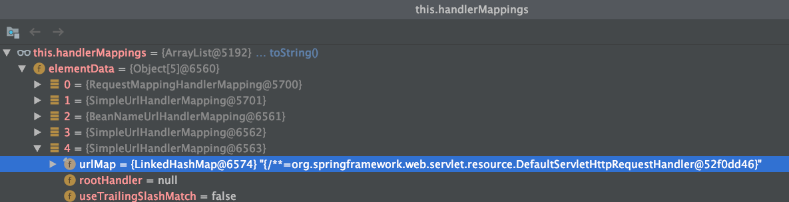
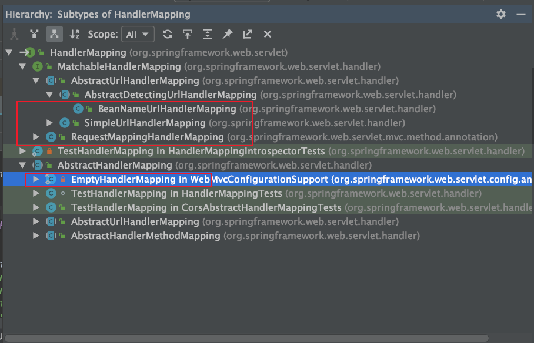

# SpringMVC的HandlerMapping


[TOC]







## RequestMappingHandlerMapping：常用于动态资源获取

## SimpleUrlHandlerMapping：常用于欢迎页

- 常用于处理欢迎页等静态页面

使用

```java
protected void addViewControllers(ViewControllerRegistry registry) {
   registry.addViewController("/hello3").setViewName("hello");
   registry.addViewController("/").setViewName("index");
}
```

初始化：

```java
@Bean
	public HandlerMapping viewControllerHandlerMapping() {
		ViewControllerRegistry registry = new ViewControllerRegistry(this.applicationContext);
		addViewControllers(registry);

		// 注册 SimpleUrlHandlerMapping 到 SpringMVC 中
		AbstractHandlerMapping handlerMapping = registry.buildHandlerMapping();
		handlerMapping = (handlerMapping != null ? handlerMapping : new EmptyHandlerMapping());
		handlerMapping.setPathMatcher(mvcPathMatcher());
		handlerMapping.setUrlPathHelper(mvcUrlPathHelper());
		handlerMapping.setInterceptors(getInterceptors());
		handlerMapping.setCorsConfigurations(getCorsConfigurations());
		return handlerMapping;
	}
```


```java
protected SimpleUrlHandlerMapping buildHandlerMapping() {
   if (this.registrations.isEmpty() && this.redirectRegistrations.isEmpty()) {
      return null;
   }

   Map<String, Object> urlMap = new LinkedHashMap<>();
   // 设置 url 到 ParameterizableViewController 的映射关系
   for (ViewControllerRegistration registration : this.registrations) {
      urlMap.put(registration.getUrlPath(), registration.getViewController());
   }
   for (RedirectViewControllerRegistration registration : this.redirectRegistrations) {
      urlMap.put(registration.getUrlPath(), registration.getViewController());
   }

   SimpleUrlHandlerMapping handlerMapping = new SimpleUrlHandlerMapping();
   handlerMapping.setUrlMap(urlMap);
   handlerMapping.setOrder(this.order);
   return handlerMapping;
}
```

将设置 url 到 ParameterizableViewController 的映射关系保存到 SimpleUrlHandlerMapping 中

请求处理的handleRequest方法

```java
public ModelAndView handleRequest(HttpServletRequest request, HttpServletResponse response)
      throws Exception {

   if (HttpMethod.OPTIONS.matches(request.getMethod())) {
      response.setHeader("Allow", getAllowHeader());
      return null;
   }

   // Delegate to WebContentGenerator for checking and preparing.
   checkRequest(request);
   prepareResponse(response);

   // Execute handleRequestInternal in synchronized block if required.
   if (this.synchronizeOnSession) {
      HttpSession session = request.getSession(false);
      if (session != null) {
         Object mutex = WebUtils.getSessionMutex(session);
         synchronized (mutex) {
            return handleRequestInternal(request, response);
         }
      }
   }

   // 设置 ModelAndView，其中设置好 view 用于视图渲染
   return handleRequestInternal(request, response);
}
```

```java
protected ModelAndView handleRequestInternal(HttpServletRequest request, HttpServletResponse response)
      throws Exception {

   String viewName = getViewName();

   if (getStatusCode() != null) {
      if (getStatusCode().is3xxRedirection()) {
         request.setAttribute(View.RESPONSE_STATUS_ATTRIBUTE, getStatusCode());
         viewName = (viewName != null && !viewName.startsWith("redirect:") ? "redirect:" + viewName : viewName);
      }
      else {
         response.setStatus(getStatusCode().value());
         if (isStatusOnly() || (getStatusCode().equals(HttpStatus.NO_CONTENT) && getViewName() == null)) {
            return null;
         }
      }
   }

   ModelAndView modelAndView = new ModelAndView();
   modelAndView.addAllObjects(RequestContextUtils.getInputFlashMap(request));

   // 设置 viewName
   if (getViewName() != null) {
      modelAndView.setViewName(viewName);
   }
   else {
      modelAndView.setView(getView());
   }

   return (isStatusOnly() ? null : modelAndView);
}
```

最后拿到 viewName 之后进行视图渲染


## BeanNameUrlHandlerMapping：不分析

## SimpleUrlHandlerMapping：常用于静态js文件等等

- 常用于处理静态资源

使用

```java
@Override
protected void addResourceHandlers(ResourceHandlerRegistry registry) {
   registry.addResourceHandler("/js/**").addResourceLocations("/WEB-INF/js/");
}
```

初始化

```java
@Bean
public HandlerMapping resourceHandlerMapping() {
   Assert.state(this.applicationContext != null, "No ApplicationContext set");
   Assert.state(this.servletContext != null, "No ServletContext set");

   ResourceHandlerRegistry registry = new ResourceHandlerRegistry(this.applicationContext,
         this.servletContext, mvcContentNegotiationManager(), mvcUrlPathHelper());
   addResourceHandlers(registry);

   // 配置处理使用处理静态资源请求的 SimpleUrlHandlerMapping
   AbstractHandlerMapping handlerMapping = registry.getHandlerMapping();
   if (handlerMapping != null) {
      handlerMapping.setPathMatcher(mvcPathMatcher());
      handlerMapping.setUrlPathHelper(mvcUrlPathHelper());
      handlerMapping.setInterceptors(getInterceptors());
      handlerMapping.setCorsConfigurations(getCorsConfigurations());
   }
   else {
      handlerMapping = new EmptyHandlerMapping();
   }
   return handlerMapping;
}
```

```java
protected AbstractHandlerMapping getHandlerMapping() {
   if (this.registrations.isEmpty()) {
      return null;
   }

   // 设置 url 到 ResourceHttpRequestHandler 的映射关系
   Map<String, HttpRequestHandler> urlMap = new LinkedHashMap<>();
   for (ResourceHandlerRegistration registration : this.registrations) {
      for (String pathPattern : registration.getPathPatterns()) {
         ResourceHttpRequestHandler handler = registration.getRequestHandler();
         if (this.pathHelper != null) {
            handler.setUrlPathHelper(this.pathHelper);
         }
         if (this.contentNegotiationManager != null) {
            handler.setContentNegotiationManager(this.contentNegotiationManager);
         }
         handler.setServletContext(this.servletContext);
         handler.setApplicationContext(this.applicationContext);
         try {
            handler.afterPropertiesSet();
         }
         catch (Throwable ex) {
            throw new BeanInitializationException("Failed to init ResourceHttpRequestHandler", ex);
         }
         urlMap.put(pathPattern, handler);
      }
   }

   SimpleUrlHandlerMapping handlerMapping = new SimpleUrlHandlerMapping();
   handlerMapping.setOrder(order);
   handlerMapping.setUrlMap(urlMap);
   return handlerMapping;
}
```

将设置 url 到 ResourceHttpRequestHandler 的映射关系保存到 SimpleUrlHandlerMapping 中

请求处理的handleRequest方法

```java
public void handleRequest(HttpServletRequest request, HttpServletResponse response)
      throws ServletException, IOException {

   // For very general mappings (e.g. "/") we need to check 404 first
   // 获取静态资源
   Resource resource = getResource(request);
   if (resource == null) {
      logger.trace("No matching resource found - returning 404");
      response.sendError(HttpServletResponse.SC_NOT_FOUND);
      return;
   }

   if (HttpMethod.OPTIONS.matches(request.getMethod())) {
      response.setHeader("Allow", getAllowHeader());
      return;
   }

   // Supported methods and required session
   checkRequest(request);

   // Header phase
   if (new ServletWebRequest(request, response).checkNotModified(resource.lastModified())) {
      logger.trace("Resource not modified - returning 304");
      return;
   }

   // Apply cache settings, if any
   prepareResponse(response);

   // Check the media type for the resource
   MediaType mediaType = getMediaType(request, resource);
   if (mediaType != null) {
      if (logger.isTraceEnabled()) {
         logger.trace("Determined media type '" + mediaType + "' for " + resource);
      }
   }
   else {
      if (logger.isTraceEnabled()) {
         logger.trace("No media type found for " + resource + " - not sending a content-type header");
      }
   }

   // Content phase
   if (METHOD_HEAD.equals(request.getMethod())) {
      setHeaders(response, resource, mediaType);
      logger.trace("HEAD request - skipping content");
      return;
   }

   ServletServerHttpResponse outputMessage = new ServletServerHttpResponse(response);
   // 利用 resourceHttpMessageConverter 把静态资源写到 socket 中
   if (request.getHeader(HttpHeaders.RANGE) == null) {
      Assert.state(this.resourceHttpMessageConverter != null, "Not initialized");
      setHeaders(response, resource, mediaType);
      this.resourceHttpMessageConverter.write(resource, mediaType, outputMessage);
   }
   else {
      Assert.state(this.resourceRegionHttpMessageConverter != null, "Not initialized");
      response.setHeader(HttpHeaders.ACCEPT_RANGES, "bytes");
      ServletServerHttpRequest inputMessage = new ServletServerHttpRequest(request);
      try {
         List<HttpRange> httpRanges = inputMessage.getHeaders().getRange();
         response.setStatus(HttpServletResponse.SC_PARTIAL_CONTENT);
         this.resourceRegionHttpMessageConverter.write(
               HttpRange.toResourceRegions(httpRanges, resource), mediaType, outputMessage);
      }
      catch (IllegalArgumentException ex) {
         response.setHeader("Content-Range", "bytes */" + resource.contentLength());
         response.sendError(HttpServletResponse.SC_REQUESTED_RANGE_NOT_SATISFIABLE);
      }
   }
}
```

```java
public final void write(final T t, @Nullable MediaType contentType, HttpOutputMessage outputMessage)
      throws IOException, HttpMessageNotWritableException {

   final HttpHeaders headers = outputMessage.getHeaders();
   // 如果 Content-Type 为空则设置默认的
   addDefaultHeaders(headers, t, contentType);

   if (outputMessage instanceof StreamingHttpOutputMessage) {
      StreamingHttpOutputMessage streamingOutputMessage = (StreamingHttpOutputMessage) outputMessage;
      streamingOutputMessage.setBody(outputStream -> writeInternal(t, new HttpOutputMessage() {
         @Override
         public OutputStream getBody() {
            return outputStream;
         }
         @Override
         public HttpHeaders getHeaders() {
            return headers;
         }
      }));
   }
   else {
      // 写数据到 Response.OutputBuffer 中
      writeInternal(t, outputMessage);
      // 直接将数据写到 socket 缓存区发送到网络上
      outputMessage.getBody().flush();
   }
}
```

```java
protected void writeInternal(Resource resource, HttpOutputMessage outputMessage)
      throws IOException, HttpMessageNotWritableException {

   // 把静态资源写到 socket 中
   writeContent(resource, outputMessage);
}

protected void writeContent(Resource resource, HttpOutputMessage outputMessage)
      throws IOException, HttpMessageNotWritableException {
   try {
      // 获取静态资源的 InputStream
      InputStream in = resource.getInputStream();
      try {
         StreamUtils.copy(in, outputMessage.getBody());
      }
      catch (NullPointerException ex) {
         // ignore, see SPR-13620
      }
      finally {
         try {
            in.close();
         }
         catch (Throwable ex) {
            // ignore, see SPR-12999
         }
      }
   }
   catch (FileNotFoundException ex) {
      // ignore, see SPR-12999
   }
}
```

直接将静态资源文件写到 socket 中

## SimpleUrlHandlerMapping：设置的Tomcat的defaultServlet

使用

```java
protected void configureDefaultServletHandling(DefaultServletHandlerConfigurer configurer) {
   configurer.enable();
}
```

初始化

```java
@Bean
public HandlerMapping defaultServletHandlerMapping() {
   Assert.state(this.servletContext != null, "No ServletContext set");
   DefaultServletHandlerConfigurer configurer = new DefaultServletHandlerConfigurer(this.servletContext);
   configureDefaultServletHandling(configurer);

   // 配置处理使用 Tomcat 的 default 请求的 DefaultServlet
   // 使用的 handler 是 DefaultServletHttpRequestHandler
   HandlerMapping handlerMapping = configurer.buildHandlerMapping();
   return (handlerMapping != null ? handlerMapping : new EmptyHandlerMapping());
}
```

```java
protected SimpleUrlHandlerMapping buildHandlerMapping() {
   if (this.handler == null) {
      return null;
   }

   // 配置处理使用 Tomcat 的 default 请求的 DefaultServlet
   SimpleUrlHandlerMapping handlerMapping = new SimpleUrlHandlerMapping();
   handlerMapping.setUrlMap(Collections.singletonMap("/**", this.handler));
   handlerMapping.setOrder(Integer.MAX_VALUE);
   return handlerMapping;
}
```

请求处理的handleRequest方法

```java
public void handleRequest(HttpServletRequest request, HttpServletResponse response)
      throws ServletException, IOException {

   Assert.state(this.servletContext != null, "No ServletContext set");
   RequestDispatcher rd = this.servletContext.getNamedDispatcher(this.defaultServletName);
   if (rd == null) {
      throw new IllegalStateException("A RequestDispatcher could not be located for the default servlet '" +
            this.defaultServletName + "'");
   }
   rd.forward(request, response);
}
```

直接转发给 Tomcat 的 DefaultServlet 来处理


提升扩展：
在spring中也能使用Jsp的原理分析：

[Spring结合Tomcat解决Jsp乱码问题](../Spring结合Tomcat解决Jsp乱码问题.md)


