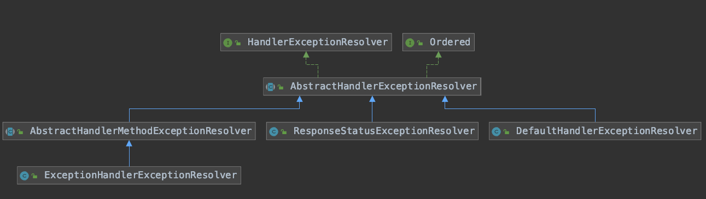
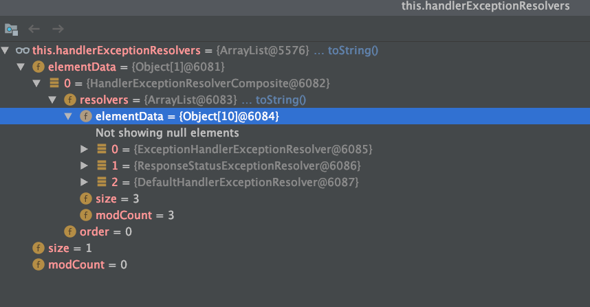

# SpringMVC的http请求的异常处理-HandlerExceptionResoler处理流程


[TOC]

## 初始化

```java
@Bean
public HandlerExceptionResolver handlerExceptionResolver() {
   List<HandlerExceptionResolver> exceptionResolvers = new ArrayList<>();
   configureHandlerExceptionResolvers(exceptionResolvers);
   // 添加默认的 HandlerExceptionResolver
   if (exceptionResolvers.isEmpty()) {
      addDefaultHandlerExceptionResolvers(exceptionResolvers);
   }
   extendHandlerExceptionResolvers(exceptionResolvers);
   HandlerExceptionResolverComposite composite = new HandlerExceptionResolverComposite();
   composite.setOrder(0);
   composite.setExceptionResolvers(exceptionResolvers);
   return composite;
}
```

```java
protected final void addDefaultHandlerExceptionResolvers(List<HandlerExceptionResolver> exceptionResolvers) {
   ExceptionHandlerExceptionResolver exceptionHandlerResolver = createExceptionHandlerExceptionResolver();
   exceptionHandlerResolver.setContentNegotiationManager(mvcContentNegotiationManager());
   exceptionHandlerResolver.setMessageConverters(getMessageConverters());
   exceptionHandlerResolver.setCustomArgumentResolvers(getArgumentResolvers());
   exceptionHandlerResolver.setCustomReturnValueHandlers(getReturnValueHandlers());
   if (jackson2Present) {
      exceptionHandlerResolver.setResponseBodyAdvice(
            Collections.singletonList(new JsonViewResponseBodyAdvice()));
   }
   if (this.applicationContext != null) {
      exceptionHandlerResolver.setApplicationContext(this.applicationContext);
   }
   exceptionHandlerResolver.afterPropertiesSet();
   exceptionResolvers.add(exceptionHandlerResolver);

   ResponseStatusExceptionResolver responseStatusResolver = new ResponseStatusExceptionResolver();
   responseStatusResolver.setMessageSource(this.applicationContext);
   exceptionResolvers.add(responseStatusResolver);

   exceptionResolvers.add(new DefaultHandlerExceptionResolver());
}
```

## SpringMVC中默认加入的HandlerExceptionResoler




HandlerExceptionResoler的实现类在SpringMVC中的顺序

1.  ExceptionHandlerExceptionResolver：基于 `@ExceptionHandler` 配置 HandlerMethod 的 HandlerExceptionResolver 实现类。例如通过 `@ControllerAdvice` 注解自定义异常处理器，加上`@ExceptionHandler`注解指定方法所需要处理的异常类型
2.  ResponseStatusExceptionResolver：基于 `@ResponseStatus` 提供错误响应的 HandlerExceptionResolver 实现类。例如在方法上面添加 `@ResponseStatus` 注解，指定该方法发生异常时，需要设置的 `code` 响应码和 `reason` 错误信息
3.  DefaultHandlerExceptionResolver：默认 HandlerExceptionResolver 实现类，针对各种异常，设置错误响应码。例如 HTTP Method 不支持，则在这个实现类中往响应中设置错误码和错误信息



## 异常处理流程

```java
public ModelAndView resolveException(
			HttpServletRequest request, HttpServletResponse response, @Nullable Object handler, Exception ex) {

		if (this.resolvers != null) {// 异常处理
			for (HandlerExceptionResolver handlerExceptionResolver : this.resolvers) {
				ModelAndView mav = handlerExceptionResolver.resolveException(request, response, handler, ex);
				if (mav != null) {
					return mav;
				}
			}
		}
		return null;
	}
```

```java
public ModelAndView resolveException(
      HttpServletRequest request, HttpServletResponse response, @Nullable Object handler, Exception ex) {

   // 判断是否可以应用
   if (shouldApplyTo(request, handler)) {
      // 阻止缓存
      prepareResponse(ex, response);
      // 执行解析异常，返回 ModelAndView 对象
      ModelAndView result = doResolveException(request, response, handler, ex);
      if (result != null) {
         // Print debug message when warn logger is not enabled.
         if (logger.isDebugEnabled() && (this.warnLogger == null || !this.warnLogger.isWarnEnabled())) {
            logger.debug("Resolved [" + ex + "]" + (result.isEmpty() ? "" : " to " + result));
         }
         // Explicitly configured warn logger in logException method.
         logException(ex, request);
      }
      return result;
   }
   else {
      return null;
   }
}
```


### ExceptionHandlerExceptionResolver处理异常

```java
protected final ModelAndView doResolveException(
      HttpServletRequest request, HttpServletResponse response, @Nullable Object handler, Exception ex) {

   return doResolveHandlerMethodException(request, response, (HandlerMethod) handler, ex);
}
```

```java
protected ModelAndView doResolveHandlerMethodException(HttpServletRequest request,
      HttpServletResponse response, @Nullable HandlerMethod handlerMethod, Exception exception) {

   // 获得异常对应的 ServletInvocableHandlerMethod 对象
   ServletInvocableHandlerMethod exceptionHandlerMethod = getExceptionHandlerMethod(handlerMethod, exception);
   if (exceptionHandlerMethod == null) {
      return null;
   }

   if (this.argumentResolvers != null) {
      exceptionHandlerMethod.setHandlerMethodArgumentResolvers(this.argumentResolvers);
   }
   if (this.returnValueHandlers != null) {
      exceptionHandlerMethod.setHandlerMethodReturnValueHandlers(this.returnValueHandlers);
   }

   ServletWebRequest webRequest = new ServletWebRequest(request, response);
   ModelAndViewContainer mavContainer = new ModelAndViewContainer();

   try {
      if (logger.isDebugEnabled()) {
         logger.debug("Invoking @ExceptionHandler method: " + exceptionHandlerMethod);
      }
      Throwable cause = exception.getCause();
      // 执行处理该异常的方法 利用 ServletInvocableHandlerMethod 反射调用
      if (cause != null) {
         // Expose cause as provided argument as well
         exceptionHandlerMethod.invokeAndHandle(webRequest, mavContainer, exception, cause, handlerMethod);
      }
      else {
         // Otherwise, just the given exception as-is
         exceptionHandlerMethod.invokeAndHandle(webRequest, mavContainer, exception, handlerMethod);
      }
   }
   catch (Throwable invocationEx) {
      // Any other than the original exception is unintended here,
      // probably an accident (e.g. failed assertion or the like).
      if (invocationEx != exception && logger.isWarnEnabled()) {
         logger.warn("Failed to invoke @ExceptionHandler method: " + exceptionHandlerMethod, invocationEx);
      }
      // Continue with default processing of the original exception...
      return null;
   }

   if (mavContainer.isRequestHandled()) {
      return new ModelAndView();
   }
   else {
      // 创建 ModelAndView 对象，并设置相关属性
      ModelMap model = mavContainer.getModel();
      HttpStatus status = mavContainer.getStatus();
      ModelAndView mav = new ModelAndView(mavContainer.getViewName(), model, status);
      mav.setViewName(mavContainer.getViewName());
      if (!mavContainer.isViewReference()) {
         mav.setView((View) mavContainer.getView());
      }
      if (model instanceof RedirectAttributes) {
         Map<String, ?> flashAttributes = ((RedirectAttributes) model).getFlashAttributes();
         RequestContextUtils.getOutputFlashMap(request).putAll(flashAttributes);
      }
      return mav;
   }
}
```


获得匹配的处理异常的标注了@ExceptionHandler的方法

```java
protected ServletInvocableHandlerMethod getExceptionHandlerMethod(
      @Nullable HandlerMethod handlerMethod, Exception exception) {

   Class<?> handlerType = null;

   // 如果 handlerMethod 非空，则先获得 Controller 对应的 @ExceptionHandler 处理器对应的方法
   if (handlerMethod != null) {
      // Local exception handler methods on the controller class itself.
      // To be invoked through the proxy, even in case of an interface-based proxy.
      handlerType = handlerMethod.getBeanType();
      ExceptionHandlerMethodResolver resolver = this.exceptionHandlerCache.get(handlerType);
      if (resolver == null) {
         // 获取该 controller 中支持的异常，遍历 @ExceptionHandler 注解的方法，拿到这些方法用于处理对应的异常
         resolver = new ExceptionHandlerMethodResolver(handlerType);
         this.exceptionHandlerCache.put(handlerType, resolver);
      }
      // 获得异常对应的 Method 处理方法
      Method method = resolver.resolveMethod(exception);
      if (method != null) {
         return new ServletInvocableHandlerMethod(handlerMethod.getBean(), method);
      }
      // For advice applicability check below (involving base packages, assignable types
      // and annotation presence), use target class instead of interface-based proxy.
      // 获得 handlerType 的原始类。因为，此处有可能是代理对象
      if (Proxy.isProxyClass(handlerType)) {
         handlerType = AopUtils.getTargetClass(handlerMethod.getBean());
      }
   }

   // 使用 ControllerAdvice 对应的 @ExceptionHandler 处理器对应的方法
   for (Map.Entry<ControllerAdviceBean, ExceptionHandlerMethodResolver> entry : this.exceptionHandlerAdviceCache.entrySet()) {
      ControllerAdviceBean advice = entry.getKey();
      // 如果 ControllerAdvice 支持当前的 handlerType
      if (advice.isApplicableToBeanType(handlerType)) {
         ExceptionHandlerMethodResolver resolver = entry.getValue();
         // 获得异常对应的 Method 处理方法
         Method method = resolver.resolveMethod(exception);
         if (method != null) {
            return new ServletInvocableHandlerMethod(advice.resolveBean(), method);
         }
      }
   }

   return null;
}
```


1. 先获得该 Controller 中有 @ExceptionHandler 标注的方法，异常类型匹配的方法
2. 获取使用 ControllerAdvice 中有 @ExceptionHandler 标注的方法，异常类型匹配的方法。其中exceptionHandlerAdviceCache的赋值逻辑参考[SpringMVC关键组件初始化](docs/source-code-analysis/Spring/SpringMVC的异常处理HandlerExceptionResolver流程.md)
3. 之后利用 ServletInvocableHandlerMethod 反射调用，处理请求参数以及返回值，其中异常作为入参放到方法中。
4. 重新创建 ModelAndView 对象，并设置相关属性


### ResponseStatusExceptionResolver处理异常

```java
protected ModelAndView doResolveException(
      HttpServletRequest request, HttpServletResponse response, @Nullable Object handler, Exception ex) {

   try {
      // 如果异常是 ResponseStatusException 类型，进行解析并设置到响应
      if (ex instanceof ResponseStatusException) {
         // 设置错误码以及错误信息
         return resolveResponseStatusException((ResponseStatusException) ex, request, response, handler);
      }

      // 如果异常类上有 @ResponseStatus 注解，进行解析并设置到响应
      ResponseStatus status = AnnotatedElementUtils.findMergedAnnotation(ex.getClass(), ResponseStatus.class);
      if (status != null) {
         return resolveResponseStatus(status, request, response, handler, ex);
      }

      // 使用异常的 cause 递归调用
      if (ex.getCause() instanceof Exception) {
         return doResolveException(request, response, handler, (Exception) ex.getCause());
      }
   }
   catch (Exception resolveEx) {
      if (logger.isWarnEnabled()) {
         logger.warn("Failure while trying to resolve exception [" + ex.getClass().getName() + "]", resolveEx);
      }
   }
   return null;
}
```

1. 解决异常是 ResponseStatusException 子类的异常，设置错误码以及错误信息
2. 解决异常类上有 @ResponseStatus 注解的异常，设置错误码以及错误信息
3. 获取异常的 cause 进行递归调用

### DefaultHandlerExceptionResolver处理异常

```java
protected ModelAndView doResolveException(
      HttpServletRequest request, HttpServletResponse response, @Nullable Object handler, Exception ex) {

   try {
      // HTTP请求的方法类型不支持
      if (ex instanceof HttpRequestMethodNotSupportedException) {
         return handleHttpRequestMethodNotSupported(
               (HttpRequestMethodNotSupportedException) ex, request, response, handler);
      }
      else if (ex instanceof HttpMediaTypeNotSupportedException) {
         return handleHttpMediaTypeNotSupported(
               (HttpMediaTypeNotSupportedException) ex, request, response, handler);
      }
      else if (ex instanceof HttpMediaTypeNotAcceptableException) {
         return handleHttpMediaTypeNotAcceptable(
               (HttpMediaTypeNotAcceptableException) ex, request, response, handler);
      }
      else if (ex instanceof MissingPathVariableException) {
         return handleMissingPathVariable(
               (MissingPathVariableException) ex, request, response, handler);
      }
      else if (ex instanceof MissingServletRequestParameterException) {
         return handleMissingServletRequestParameter(
               (MissingServletRequestParameterException) ex, request, response, handler);
      }
      else if (ex instanceof ServletRequestBindingException) {
         return handleServletRequestBindingException(
               (ServletRequestBindingException) ex, request, response, handler);
      }
      else if (ex instanceof ConversionNotSupportedException) {
         return handleConversionNotSupported(
               (ConversionNotSupportedException) ex, request, response, handler);
      }
      else if (ex instanceof TypeMismatchException) {
         return handleTypeMismatch(
               (TypeMismatchException) ex, request, response, handler);
      }
      else if (ex instanceof HttpMessageNotReadableException) {
         return handleHttpMessageNotReadable(
               (HttpMessageNotReadableException) ex, request, response, handler);
      }
      else if (ex instanceof HttpMessageNotWritableException) {
         return handleHttpMessageNotWritable(
               (HttpMessageNotWritableException) ex, request, response, handler);
      }
      else if (ex instanceof MethodArgumentNotValidException) {
         return handleMethodArgumentNotValidException(
               (MethodArgumentNotValidException) ex, request, response, handler);
      }
      else if (ex instanceof MissingServletRequestPartException) {
         return handleMissingServletRequestPartException(
               (MissingServletRequestPartException) ex, request, response, handler);
      }
      else if (ex instanceof BindException) {
         return handleBindException((BindException) ex, request, response, handler);
      }
      else if (ex instanceof NoHandlerFoundException) {
         return handleNoHandlerFoundException(
               (NoHandlerFoundException) ex, request, response, handler);
      }
      else if (ex instanceof AsyncRequestTimeoutException) {
         return handleAsyncRequestTimeoutException(
               (AsyncRequestTimeoutException) ex, request, response, handler);
      }
   }
   catch (Exception handlerEx) {
      if (logger.isWarnEnabled()) {
         logger.warn("Failure while trying to resolve exception [" + ex.getClass().getName() + "]", handlerEx);
      }
   }
   return null;
}
```

解决spring内部的一些异常，设置错误码以及错误信息


