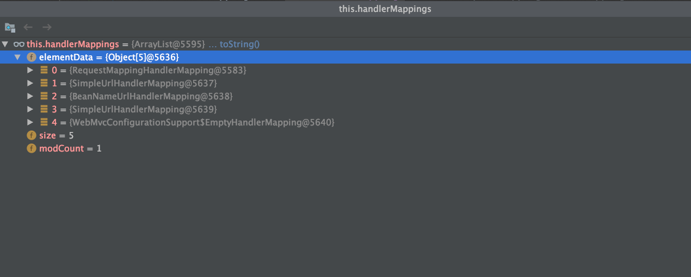
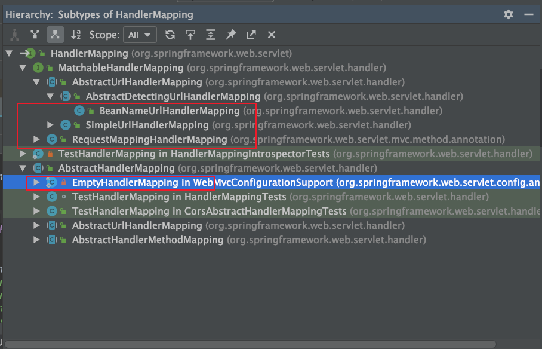

# SpringMVC的HandlerMapping

## RequestMappingHandlerMapping

## SimpleUrlHandlerMapping

## BeanNameUrlHandlerMapping

## SimpleUrlHandlerMapping

## WebMvcConfigurationSupport$EmptyHandlerMapping

