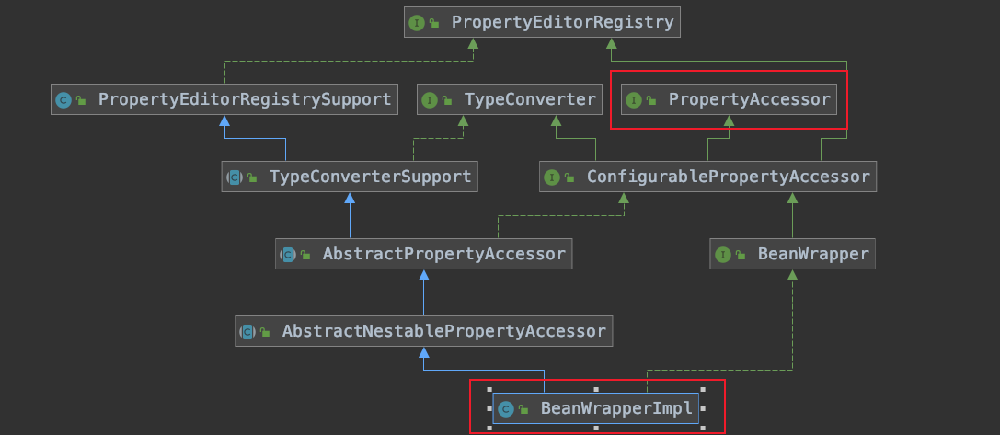

# spring中的一些关键类组件

## BeanWrapperImpl

BeanWrapperImpl实现了PropertyAccessor（属性访问器）接口。在SpingMVC中，对入参Bean属性的存取都是通过BeanWrapperImpl类来实现的

## WebDataBinder

主要用于springmvc处理http请求的时候解析入参，并赋值到方法的入参中

关键属性：

BeanPropertyBindingResult含有关键属性BeanWrapperImpl

