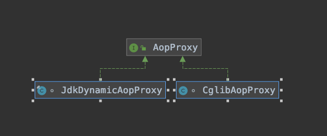

[TOC]

# Spring的AOP之动态代理源码详解

## 使用工厂方法来创建动态代理器

选出来advisor之后，使用选出的advisor来动态代理增强初始化完毕的Bean

```java
// getAdvicesAndAdvisorsForBean这个方法将得到所有的可用于拦截当前 bean 的 advisor、advice、interceptor。
Object[] specificInterceptors = getAdvicesAndAdvisorsForBean(bean.getClass(), beanName, null);
// 如果存在增强器则创建代理
if (specificInterceptors != DO_NOT_PROXY) {
   this.advisedBeans.put(cacheKey, Boolean.TRUE);
   // 创建代理对象：这边SingletonTargetSource的target属性存放的就是我们原来的bean实例
   // （也就是被代理对象），
   // 用于最后增加逻辑执行完毕后，通过反射执行我们真正的方法时使用（method.invoke(bean, args)）
   Object proxy = createProxy(
         bean.getClass(), beanName, specificInterceptors, new SingletonTargetSource(bean));
   // 创建完代理后，将cacheKey -> 代理类的class放到缓存
   this.proxyTypes.put(cacheKey, proxy.getClass());
   return proxy;
}
```

分析createProxy方法

```java
protected Object createProxy(Class<?> beanClass, @Nullable String beanName,
      @Nullable Object[] specificInterceptors, TargetSource targetSource) {

   if (this.beanFactory instanceof ConfigurableListableBeanFactory) {
      AutoProxyUtils.exposeTargetClass((ConfigurableListableBeanFactory) this.beanFactory, beanName, beanClass);
   }

   // 创建 ProxyFactory 实例
   ProxyFactory proxyFactory = new ProxyFactory();
   // 从当前对象复制属性值
   proxyFactory.copyFrom(this);

   // 如果希望使用 CGLIB 来代理接口，可以配置proxy-target-class="true",这样不管有没有接口，
   //  都使用 CGLIB 来生成代理：
   // <aop:config proxy-target-class="true">......</aop:config>
   // 检查proxyTargetClass属性，判断对于给定的bean使用类代理还是接口代理，
   // proxyTargetClass值默认为false，可以通过proxy-target-class属性设置为true
   if (!proxyFactory.isProxyTargetClass()) {
      // 检查preserveTargetClass属性，判断beanClass是应该基于类代理还是基于接口代理
      if (shouldProxyTargetClass(beanClass, beanName)) {
         // 如果是基于类代理，则将proxyTargetClass赋值为true
         proxyFactory.setProxyTargetClass(true);
      }
      else {
         // 代理的该类没有实现接口，则设置proxyTargetClass为true
         evaluateProxyInterfaces(beanClass, proxyFactory);
      }
   }

   // 这个方法会返回匹配了当前 bean 的 advisors 数组
   // 将拦截器封装为Advisor（advice持有者）
   Advisor[] advisors = buildAdvisors(beanName, specificInterceptors);
   // 将advisors添加到proxyFactory
   proxyFactory.addAdvisors(advisors);
   // 设置要代理的类，将targetSource赋值给proxyFactory的targetSource属性，
   // 之后可以通过该属性拿到被代理的bean的实例
   proxyFactory.setTargetSource(targetSource);
   // 自定义ProxyFactory，空方法，留给子类实现
   customizeProxyFactory(proxyFactory);

   // 用来控制proxyFactory被配置之后，是否还允许修改通知。
   // 默认值为false（即在代理被配置之后，不允许修改代理类的配置）
   proxyFactory.setFrozen(this.freezeProxy);
   if (advisorsPreFiltered()) {
      proxyFactory.setPreFiltered(true);
   }

   // 使用proxyFactory获取代理
   return proxyFactory.getProxy(getProxyClassLoader());
}
```

1. 判断代理的代理的该类没有实现接口，则设置proxyTargetClass为true
2. 把Advisor设置到ProxyFactory中
3. 使用proxyFactory获取代理的类

分析evaluateProxyInterfaces方法

```java
protected void evaluateProxyInterfaces(Class<?> beanClass, ProxyFactory proxyFactory) {
   // 获取类上所有接口
   Class<?>[] targetInterfaces = ClassUtils.getAllInterfacesForClass(beanClass, getProxyClassLoader());
   boolean hasReasonableProxyInterface = false;
   for (Class<?> ifc : targetInterfaces) {
      // 不是埋点接口
      if (!isConfigurationCallbackInterface(ifc) && !isInternalLanguageInterface(ifc) &&
            ifc.getMethods().length > 0) {
         hasReasonableProxyInterface = true;
         break;
      }
   }
   if (hasReasonableProxyInterface) {
      // 有接口的，调用一次或多次：proxyFactory.addInterface(ifc)
      // Must allow for introductions; can't just set interfaces to the target's interfaces only.
      for (Class<?> ifc : targetInterfaces) {
         proxyFactory.addInterface(ifc);
      }
   }
   else {
      proxyFactory.setProxyTargetClass(true);
   }
}
```

继续分析proxyFactory.getProxy方法

这里使用工厂方法

```java
public Object getProxy(@Nullable ClassLoader classLoader) {
   // createAopProxy：使用工厂方法创建AopProxy
   // getProxy(classLoader)：获取代理对象实例
   return createAopProxy().getProxy(classLoader);
}
```

1. 使用工厂方法获取jdk动态代理器JdkDynamicAopProxy或者cglib动态代理器ObjenesisCglibAopProxy
2. 使用对应的动态代理器来创建类

先分析获取使用工厂类AopProxyFactory来创建JdkDynamicAopProxy或者ObjenesisCglibAopProxy的逻辑

```java
protected final synchronized AopProxy createAopProxy() {
   if (!this.active) {
      // 激活此代理配置
      activate();
   }
   // 使用的DefaultAopProxyFactory来创建AopProxy
   return getAopProxyFactory().createAopProxy(this);
}
```

```java
public AopProxyFactory getAopProxyFactory() {
   return this.aopProxyFactory;
}
```

其中aopProxyFactory为DefaultAopProxyFactory

继续分析createAopProxy的逻辑

```java
public AopProxy createAopProxy(AdvisedSupport config) throws AopConfigException {
		// (我也没用过这个optimize，默认false) || (proxy-target-class=true||代理类没有实现接口) || (要代理的类没有实现接口或者只有SpringProxy一个接口)
		// proxyTargetClass：默认为false，当代理类没有实现接口设置为true，或者强制使用cglib代理，设置方式：<aop:aspectj-autoproxy proxy-target-class="true" />
		// 要代理的类没有实现接口或者只有SpringProxy一个接口
		if (config.isOptimize() || config.isProxyTargetClass() || hasNoUserSuppliedProxyInterfaces(config)) {
			// 拿到要被代理的对象的类型
			Class<?> targetClass = config.getTargetClass();
			if (targetClass == null) {
				// TargetSource无法确定目标类：代理创建需要接口或目标。
				throw new AopConfigException("TargetSource cannot determine target class: " +
						"Either an interface or a target is required for proxy creation.");
			}
			// 如果要代理的类本身就是接口，也会用 JDK 动态代理
			// 要被代理的对象是接口 || targetClass是Proxy class
			// 当且仅当使用getProxyClass方法或newProxyInstance方法动态生成指定的类作为代理类时，才返回true。
			if (targetClass.isInterface() || Proxy.isProxyClass(targetClass)) {
				// 目标对象是一个接口, 同样是使用jdk的动态代理
				// JDK动态代理，这边的入参config(AdvisedSupport)实际上是ProxyFactory对象
				// 具体为：AbstractAutoProxyCreator中的proxyFactory.getProxy发起的调用，在ProxyCreatorSupport使用了this作为参数，
				// 调用了的本方法，这边的this就是发起调用的proxyFactory对象，而proxyFactory对象中包含了要执行的的拦截器
				if (logger.isDebugEnabled()) {
					logger.debug("使用JDK动态代理");
				}
				return new JdkDynamicAopProxy(config);
			}
			// Cglib代理
			if (logger.isDebugEnabled()) {
				logger.debug("使用CGLIB动态代理");
			}
			return new ObjenesisCglibAopProxy(config);
		}
		else {
			// 如果有接口，会跑到这个分支
			// 默认使用的是 jdk的动态代理
			if (logger.isDebugEnabled()) {
				logger.debug("使用JDK动态代理");
			}
			return new JdkDynamicAopProxy(config);
		}
	}
```

1. 要代理的类没有实现接口、只有SpringProxy一个接口、强制使用cglib代理时使用ObjenesisCglibAopProxy
2. 代理的目标类是接口、代理类是JDK动态代理生成的类：使用JdkDynamicAopProxy

### 小结

1. 判断代理的代理的该类没有实现接口，则设置proxyTargetClass为true
2. 把Advisor设置到ProxyFactory中
3. 使用proxyFactory利用工厂方法获取jdk动态代理器JdkDynamicAopProxy或者cglib动态代理器ObjenesisCglibAopProxy
4. 使用对应的动态代理器来创建类

继续分析使用对应的动态代理类来创建类

都是使用AopProxy的getProxy方法来获取代理的类



## JDK动态代理创建类并执行对应方法

1. 获取代理类
2. 真正的调用

### 获取代理类

先分析JdkDynamicAopProxy的getProxy方法

```java
	public Object getProxy(@Nullable ClassLoader classLoader) {
		if (logger.isDebugEnabled()) {
			logger.debug("Creating JDK dynamic proxy: target source is " + this.advised.getTargetSource());
		}
		// 拿到要被代理对象的所有接口+SpringProxy+Advised+DecoratingProxy
		Class<?>[] proxiedInterfaces = AopProxyUtils.completeProxiedInterfaces(this.advised, true);
		findDefinedEqualsAndHashCodeMethods(proxiedInterfaces);
		// 通过classLoader、接口、InvocationHandler实现类，来获取到代理对象
		return Proxy.newProxyInstance(classLoader, proxiedInterfaces, this);
	}
```

1. 拿到所有要代理对象的接口
2. 使用jdk动态代理来创建动态代理类

### 调用动态代理类里面的方法

继续分析真正的调用逻辑

```java
public Object invoke(Object proxy, Method method, Object[] args) throws Throwable {
   Object oldProxy = null;
   boolean setProxyContext = false;

   TargetSource targetSource = this.advised.targetSource;
   Object target = null;

   try {
      if (!this.equalsDefined && AopUtils.isEqualsMethod(method)) {
         // The target does not implement the equals(Object) method itself.
         // 代理的 equals 方法
         return equals(args[0]);
      }
      else if (!this.hashCodeDefined && AopUtils.isHashCodeMethod(method)) {
         // The target does not implement the hashCode() method itself.
         // 代理的 hashCode 方法
         return hashCode();
      }
      else if (method.getDeclaringClass() == DecoratingProxy.class) {
         // There is only getDecoratedClass() declared -> dispatch to proxy config.
         return AopProxyUtils.ultimateTargetClass(this.advised);
      }
      else if (!this.advised.opaque && method.getDeclaringClass().isInterface() &&
            method.getDeclaringClass().isAssignableFrom(Advised.class)) {
         // Service invocations on ProxyConfig with the proxy config...
         return AopUtils.invokeJoinpointUsingReflection(this.advised, method, args);
      }

      Object retVal;

      // 如果设置了 exposeProxy，那么将 proxy 放到 ThreadLocal 中
      if (this.advised.exposeProxy) {
         // Make invocation available if necessary.
         oldProxy = AopContext.setCurrentProxy(proxy);
         setProxyContext = true;
      }

      // Get as late as possible to minimize the time we "own" the target,
      // in case it comes from a pool.
      target = targetSource.getTarget();
      Class<?> targetClass = (target != null ? target.getClass() : null);

      // Get the interception chain for this method.
      //  获取当前方法的拦截链路，其中包括将AspectJMethodBeforeAdvice、AspectJAfterAdvice、AspectJAfterReturningAdvice
      //  转换成合适的类型(InterceptorAndDynamicMethodMatcher，含有Advice和MethodMatcher)
      List<Object> chain = this.advised.getInterceptorsAndDynamicInterceptionAdvice(method, targetClass);

      // Check whether we have any advice. If we don't, we can fallback on direct
      // reflective invocation of the target, and avoid creating a MethodInvocation.
      if (chain.isEmpty()) {
         // We can skip creating a MethodInvocation: just invoke the target directly
         // Note that the final invoker must be an InvokerInterceptor so we know it does
         // nothing but a reflective operation on the target, and no hot swapping or fancy proxying.
         // chain 是空的，说明不需要被增强，直接反射调用
         Object[] argsToUse = AopProxyUtils.adaptArgumentsIfNecessary(method, args);
         retVal = AopUtils.invokeJoinpointUsingReflection(target, method, argsToUse);
      }
      else {
         // We need to create a method invocation...
         MethodInvocation invocation =
               new ReflectiveMethodInvocation(proxy, target, method, args, targetClass, chain);
         // Proceed to the joinpoint through the interceptor chain.
         // 执行方法，得到返回值
         // 执行拦截器链路
         retVal = invocation.proceed();
      }

      // Massage return value if necessary.
      Class<?> returnType = method.getReturnType();
      if (retVal != null && retVal == target &&
            returnType != Object.class && returnType.isInstance(proxy) &&
            !RawTargetAccess.class.isAssignableFrom(method.getDeclaringClass())) {
         // Special case: it returned "this" and the return type of the method
         // is type-compatible. Note that we can't help if the target sets
         // a reference to itself in another returned object.
         retVal = proxy;
      }
      else if (retVal == null && returnType != Void.TYPE && returnType.isPrimitive()) {
         throw new AopInvocationException(
               "Null return value from advice does not match primitive return type for: " + method);
      }
      return retVal;
   }
   finally {
      if (target != null && !targetSource.isStatic()) {
         // Must have come from TargetSource.
         targetSource.releaseTarget(target);
      }
      if (setProxyContext) {
         // Restore old proxy.
         AopContext.setCurrentProxy(oldProxy);
      }
   }
}
```

1. 获取当前方法的拦截链路Advice链，其中包括将AspectJMethodBeforeAdvice、AspectJAfterAdvice、AspectJAfterReturningAdvice转换成合适的类型(InterceptorAndDynamicMethodMatcher，含有Advice和MethodMatcher)
2. 利用ReflectiveMethodInvocation采用责任链模式来顺序调用增强器Advice，最后调用真正的方法。

扩展：所以Spring的AOP代理也是利用责任链模式来顺序调用增强器

先分析this.advised.getInterceptorsAndDynamicInterceptionAdvice方法

```java
public List<Object> getInterceptorsAndDynamicInterceptionAdvice(Method method, @Nullable Class<?> targetClass) {
   MethodCacheKey cacheKey = new MethodCacheKey(method);
   List<Object> cached = this.methodCache.get(cacheKey);
   if (cached == null) {
      // 缓存没有命中则重新获取
      cached = this.advisorChainFactory.getInterceptorsAndDynamicInterceptionAdvice(
            this, method, targetClass);
      this.methodCache.put(cacheKey, cached);
   }
   return cached;
}
```


```java
public List<Object> getInterceptorsAndDynamicInterceptionAdvice(
      Advised config, Method method, @Nullable Class<?> targetClass) {

   // This is somewhat tricky... We have to process introductions first,
   // but we need to preserve order in the ultimate list.
   List<Object> interceptorList = new ArrayList<Object>(config.getAdvisors().length);
   Class<?> actualClass = (targetClass != null ? targetClass : method.getDeclaringClass());
   boolean hasIntroductions = hasMatchingIntroductions(config, actualClass);
   AdvisorAdapterRegistry registry = GlobalAdvisorAdapterRegistry.getInstance();

   for (Advisor advisor : config.getAdvisors()) {
      if (advisor instanceof PointcutAdvisor) {
         // Add it conditionally.
         PointcutAdvisor pointcutAdvisor = (PointcutAdvisor) advisor;
         // 如果经过 预过滤 || 匹配当前类
         if (config.isPreFiltered() || pointcutAdvisor.getPointcut().getClassFilter().matches(actualClass)) {
            MethodMatcher mm = pointcutAdvisor.getPointcut().getMethodMatcher();
            // 判断当前方法是否匹配
            if (MethodMatchers.matches(mm, method, actualClass, hasIntroductions)) {
               // 因为动态代理在调用增强方法时，是通过 MethodInterceptor#invoke 方法来调用，
               // 但对于AspectJAroundAdvice、AspectJMethodBeforeAdvice、AspectJAfterAdvice、AspectJAfterReturningAdvice、AspectJAfterThrowingAdvice来说，
               // 只有AspectJAroundAdvice 和 AspectJAfterAdvice 实现了MethodInterceptor 接口，其余的并没有实现 MethodInterceptor 接口。
               // 所以在 registry.getInterceptors(advisor) 中，将Advisor中的 Advice 都封装成 MethodInterceptor，以便后面方法增强调用。
               MethodInterceptor[] interceptors = registry.getInterceptors(advisor);
               if (mm.isRuntime()) {
                  // Creating a new object instance in the getInterceptors() method
                  // isn't a problem as we normally cache created chains.
                  for (MethodInterceptor interceptor : interceptors) {
                     interceptorList.add(new InterceptorAndDynamicMethodMatcher(interceptor, mm));
                  }
               }
               else {
                  interceptorList.addAll(Arrays.asList(interceptors));
               }
            }
         }
      }
      else if (advisor instanceof IntroductionAdvisor) {
         IntroductionAdvisor ia = (IntroductionAdvisor) advisor;
         if (config.isPreFiltered() || ia.getClassFilter().matches(actualClass)) {
            Interceptor[] interceptors = registry.getInterceptors(advisor);
            interceptorList.addAll(Arrays.asList(interceptors));
         }
      }
      else {
         Interceptor[] interceptors = registry.getInterceptors(advisor);
         interceptorList.addAll(Arrays.asList(interceptors));
      }
   }

   return interceptorList;
}
```

1. AOP增强的话MethodMatcher使用的是AspectJExpressionPointcut来分析是否类方法匹配，因为增强可能是方法维度的，所以要判断方法是否需要增强
2. 得到MethodInterceptor或者如果是AOP增强的话得到MethodInterceptor的包装类InterceptorAndDynamicMethodMatcher的集合

继续分析invocation.proceed()分析责任链模式来调用增强器Advice，以及最后调用真正的方法。

```java
public Object proceed() throws Throwable {
   // We start with an index of -1 and increment early.
   // 如果所有拦截器执行结束，调用真正的方法
   if (this.currentInterceptorIndex == this.interceptorsAndDynamicMethodMatchers.size() - 1) {
      return invokeJoinpoint();
   }
   // 获取下一个拦截器，currentInterceptorIndex记录执行到哪个拦截器
   Object interceptorOrInterceptionAdvice =
         this.interceptorsAndDynamicMethodMatchers.get(++this.currentInterceptorIndex);
  // 是AOP增强
   if (interceptorOrInterceptionAdvice instanceof InterceptorAndDynamicMethodMatcher) {
      // Evaluate dynamic method matcher here: static part will already have
      // been evaluated and found to match.
      InterceptorAndDynamicMethodMatcher dm =
            (InterceptorAndDynamicMethodMatcher) interceptorOrInterceptionAdvice;
      // 判断调用是否匹配，如果匹配则调用拦截器方法
      if (dm.methodMatcher.matches(this.method, this.targetClass, this.arguments)) {
         return dm.interceptor.invoke(this);
      }
      else {
         // Dynamic matching failed.
         // Skip this interceptor and invoke the next in the chain.
         // 否则递归执行下一个拦截器
         return proceed();
      }
   }
   else {
      // It's an interceptor, so we just invoke it: The pointcut will have
      // been evaluated statically before this object was constructed.
      // 它是一个拦截器，所以我们只调用它:在构造这个对象之前，切入点将被静态地计算。
      // 咱们这里最终调用的是((MethodInterceptor) interceptorOrInterceptionAdvice).invoke(this);
      // 就是TransactionInterceptor事务拦截器回调 目标业务方法
      return ((MethodInterceptor) interceptorOrInterceptionAdvice).invoke(this);
   }
}
```

1. 判断增强是InterceptorAndDynamicMethodMatcher即是AOP增强，则先判断方法匹配，后调用增强
2. 如果是事务增强等Spring内部实现的增强直接走((MethodInterceptor) interceptorOrInterceptionAdvice).invoke(this);
3. 如果增强递归执行（在增强里面再次调用ReflectiveMethodInvocation的proceed方法）完毕，则反射执行被增强的方法

以@Around环绕增强来分析dm.interceptor.invoke(this)的逻辑

调用AspectJAroundAdvice的invoke方法

```java
public Object invoke(MethodInvocation mi) throws Throwable {
   if (!(mi instanceof ProxyMethodInvocation)) {
      throw new IllegalStateException("MethodInvocation is not a Spring ProxyMethodInvocation: " + mi);
   }
   ProxyMethodInvocation pmi = (ProxyMethodInvocation) mi;
  // 增强方法的入参通常是ProceedingJoinPoint，这个入参就是这里实例化的
   ProceedingJoinPoint pjp = lazyGetProceedingJoinPoint(pmi);
   JoinPointMatch jpm = getJoinPointMatch(pmi);
   // 反射调用加了AspectJ注解的advice的增强方法
   return invokeAdviceMethod(pjp, jpm, null, null);
}
```

1. 实例化增强方法的入参ProceedingJoinPoint
2. 反射调用增强方法

```java
protected Object invokeAdviceMethod(JoinPoint jp, @Nullable JoinPointMatch jpMatch,
      @Nullable Object returnValue, @Nullable Throwable t) throws Throwable {

   return invokeAdviceMethodWithGivenArgs(argBinding(jp, jpMatch, returnValue, t));
}
```

1. 获取增强器的入参
2. 反射调用增强器
3. 在增强方法中调用ReflectiveMethodInvocation的proceed方法递归调用，达到责任链顺序执行的逻辑

分析argBinding获取增强器的入参

```java
protected Object[] argBinding(JoinPoint jp, @Nullable JoinPointMatch jpMatch,
      @Nullable Object returnValue, @Nullable Throwable ex) {

   // 提前估测参数绑定
   // 最后就是将所有通知中候选的参数的名称和类型保存到了切点对应属性之中备用
   calculateArgumentBindings();

   // AMC start
   Object[] adviceInvocationArgs = new Object[this.parameterTypes.length];
   int numBound = 0;

   if (this.joinPointArgumentIndex != -1) {
      adviceInvocationArgs[this.joinPointArgumentIndex] = jp;
      numBound++;
   }
   else if (this.joinPointStaticPartArgumentIndex != -1) {
      adviceInvocationArgs[this.joinPointStaticPartArgumentIndex] = jp.getStaticPart();
      numBound++;
   }

   if (!CollectionUtils.isEmpty(this.argumentBindings)) {
      // binding from pointcut match
      // 通过切点匹配进行参数绑定
      if (jpMatch != null) {
         PointcutParameter[] parameterBindings = jpMatch.getParameterBindings();
         for (PointcutParameter parameter : parameterBindings) {
            String name = parameter.getName();
            Integer index = this.argumentBindings.get(name);
            adviceInvocationArgs[index] = parameter.getBinding();
            numBound++;
         }
      }
      // binding from returning clause
      // 通过返回名称进行参数绑定
      if (this.returningName != null) {
         Integer index = this.argumentBindings.get(this.returningName);
         adviceInvocationArgs[index] = returnValue;
         numBound++;
      }
      // binding from thrown exception
      // 通过异常返回进行参数绑定
      if (this.throwingName != null) {
         Integer index = this.argumentBindings.get(this.throwingName);
         adviceInvocationArgs[index] = ex;
         numBound++;
      }
   }

   if (numBound != this.parameterTypes.length) {
      throw new IllegalStateException("Required to bind " + this.parameterTypes.length +
            " arguments, but only bound " + numBound + " (JoinPointMatch " +
            (jpMatch == null ? "was NOT" : "WAS") + " bound in invocation)");
   }

   return adviceInvocationArgs;
}
```

1. 调用calculateArgumentBindings提前估测参数绑定，没用过
2. 设置ProceedingJoinPoint到增强器方法的第一位。

分析calculateArgumentBindings的逻辑

```java
public final synchronized void calculateArgumentBindings() {
   // The simple case... nothing to bind.
   if (this.argumentsIntrospected || this.parameterTypes.length == 0) {
      // 无参可绑的情况，直接返回
      return;
   }

   int numUnboundArgs = this.parameterTypes.length;
   Class<?>[] parameterTypes = this.aspectJAdviceMethod.getParameterTypes();
   // 排除parameterTypes中JoinPoint类型、ProceedingJoinPoint类型、JoinPoint.StaticPart类型的参数
   // JoinPoint类型的参数可作为非环绕通知的首个参数
   // ProceedingJoinPoint类型的参数可作为环绕通知的首个参数
   // JoinPoint.StaticPart类型的参数也可以作为某些通知的首个参数
   // 谨记，以上三种类型的参数只能作为对应通知的首个参数，当然也可以和其他参数共存，但位置必须位于首个，原因也很简单，因为此处判断的时候完全就是在拿首个参数类型来完成的。
   // 这三个参数是可以直接使用的，无需进行参数绑定操作，所以在这里排除掉
   if (maybeBindJoinPoint(parameterTypes[0]) || maybeBindProceedingJoinPoint(parameterTypes[0]) ||
         maybeBindJoinPointStaticPart(parameterTypes[0])) {
      numUnboundArgs--;
   }

   if (numUnboundArgs > 0) {
      // need to bind arguments by name as returned from the pointcut match
      // 排除以上类型之后，如果还有剩余，则需要根据从切入点匹配返回的名称绑定参数
      // 没有用过
      bindArgumentsByName(numUnboundArgs);
   }

   this.argumentsIntrospected = true;
}
```


继续分析反射调用增强器

```java
protected Object invokeAdviceMethodWithGivenArgs(Object[] args) throws Throwable {
   Object[] actualArgs = args;
   if (this.aspectJAdviceMethod.getParameterCount() == 0) {
      actualArgs = null;
   }
   try {
      ReflectionUtils.makeAccessible(this.aspectJAdviceMethod);
      // AopUtils.invokeJoinpointUsingReflection
      return this.aspectJAdviceMethod.invoke(this.aspectInstanceFactory.getAspectInstance(), actualArgs);
   }
   catch (IllegalArgumentException ex) {
      throw new AopInvocationException("Mismatch on arguments to advice method [" +
            this.aspectJAdviceMethod + "]; pointcut expression [" +
            this.pointcut.getPointcutExpression() + "]", ex);
   }
   catch (InvocationTargetException ex) {
      throw ex.getTargetException();
   }
}
```

这里面反射调用增强器

增强器里面的逻辑是

```java
@Around(value = "pc()")
public Object around(ProceedingJoinPoint joinPoint) throws Throwable {
   //1、调用开始...
   String param = JSON.toJSONString(joinPoint.getArgs());
   //开始时间
   long start = System.currentTimeMillis();
   Object result = null;//返回结果 当异常时修改返回结果
   //执行
   try {
      result = joinPoint.proceed();
   } catch (Exception e) {
      log.error("soa method error,param = {}", param);
      throw e;
   }
   //结束时间
   long end = System.currentTimeMillis();
   log.info("soa method end,start time:{}; end time:{}; Run Time:{}(ms), param={}, result = {}", start, end, (end - start), param, JSON.toJSONString(result, SerializerFeature.DisableCircularReferenceDetect));
   return result;
}
```

1. 在joinPoint.proceed()中调用MethodInvocationProceedingJoinPoint的proceed方法，达到递归调用的效果

```java
@Override
public Object proceed() throws Throwable {
   return this.methodInvocation.invocableClone().proceed();
}
```

调用ReflectiveMethodInvocation的proceed方法，达到递归调用的效果

继续分析invokeJoinpoint()的逻辑

```java
protected Object invokeJoinpoint() throws Throwable {
   return AopUtils.invokeJoinpointUsingReflection(this.target, this.method, this.arguments);
}
```

```java
public static Object invokeJoinpointUsingReflection(@Nullable Object target, Method method, Object[] args)
      throws Throwable {

   // Use reflection to invoke the method.
   try {
      ReflectionUtils.makeAccessible(method);
      return method.invoke(target, args);
   }
   catch (InvocationTargetException ex) {
      // Invoked method threw a checked exception.
      // We must rethrow it. The client won't see the interceptor.
      throw ex.getTargetException();
   }
   catch (IllegalArgumentException ex) {
      throw new AopInvocationException("AOP configuration seems to be invalid: tried calling method [" +
            method + "] on target [" + target + "]", ex);
   }
   catch (IllegalAccessException ex) {
      throw new AopInvocationException("Could not access method [" + method + "]", ex);
   }
}
```

比较简单就是反射调用被增强的方法

### 小结

1. 拿到所有要代理对象的接口
2. 使用jdk动态代理来创建动态代理类
3. 真正调用动态代理类的方法的时候：
4. 获取当前方法的拦截链路Advice链，其中包括将AspectJMethodBeforeAdvice、AspectJAfterAdvice、AspectJAfterReturningAdvice转换成合适的类型(InterceptorAndDynamicMethodMatcher，含有Advice和MethodMatcher)
5. 利用ReflectiveMethodInvocation采用责任链模式来顺序调用增强器Advice，最后调用真正的方法。
6. 在增强器里面调用ReflectiveMethodInvocation的proceed方法，达到递归调用以及责任链顺序调用的效果。其中ProceedingJoinPoint设置到增强器方法的第一位

## cglib动态代理创建类并执行对应方法

### 获取代理类

```java
public Object getProxy(@Nullable ClassLoader classLoader) {
   if (logger.isDebugEnabled()) {
      logger.debug("Creating CGLIB proxy: target source is " + this.advised.getTargetSource());
   }

   try {
      // 拿到要代理目标类
      Class<?> rootClass = this.advised.getTargetClass();
      Assert.state(rootClass != null, "Target class must be available for creating a CGLIB proxy");

      // proxySuperClass默认为rootClass
      Class<?> proxySuperClass = rootClass;
      if (ClassUtils.isCglibProxyClass(rootClass)) {
         // 如果rootClass是被Cglib代理过的，获取rootClass的父类作为proxySuperClass
         proxySuperClass = rootClass.getSuperclass();
         Class<?>[] additionalInterfaces = rootClass.getInterfaces();
         for (Class<?> additionalInterface : additionalInterfaces) {
            // 将父类的接口也添加到advised的interfaces属性
            this.advised.addInterface(additionalInterface);
         }
      }

      // Validate the class, writing log messages as necessary.
      // 校验proxySuperClass，主要是校验方法是否用final修饰、跨ClassLoader的包可见方法，
      // 如果有将警告写入日志
      validateClassIfNecessary(proxySuperClass, classLoader);

      // Configure CGLIB Enhancer...
      // 创建和配置Cglib Enhancer
      Enhancer enhancer = createEnhancer();
      if (classLoader != null) {
         enhancer.setClassLoader(classLoader);
         if (classLoader instanceof SmartClassLoader &&
               ((SmartClassLoader) classLoader).isClassReloadable(proxySuperClass)) {
            enhancer.setUseCache(false);
         }
      }
      // superclass为被代理的目标类proxySuperClass，通过名字可以看出，生成的代理类实际上是继承了被代理类
      enhancer.setSuperclass(proxySuperClass);
      enhancer.setInterfaces(AopProxyUtils.completeProxiedInterfaces(this.advised));
      enhancer.setNamingPolicy(SpringNamingPolicy.INSTANCE);
      enhancer.setStrategy(new ClassLoaderAwareUndeclaredThrowableStrategy(classLoader));

      // 获取所有要回调的拦截器
      Callback[] callbacks = getCallbacks(rootClass);
      Class<?>[] types = new Class<?>[callbacks.length];
      for (int x = 0; x < types.length; x++) {
         types[x] = callbacks[x].getClass();
      }
      // fixedInterceptorMap only populated at this point, after getCallbacks call above
      // 添加代理回调过滤器 ProxyCallbackFilter 来选择使用合适的 Callback 来操作 
      enhancer.setCallbackFilter(new ProxyCallbackFilter(
            this.advised.getConfigurationOnlyCopy(), this.fixedInterceptorMap, this.fixedInterceptorOffset));
      enhancer.setCallbackTypes(types);

      // Generate the proxy class and create a proxy instance.
      // 生成代理类并创建代理实例，返回代理实例
      return createProxyClassAndInstance(enhancer, callbacks);
   }
   catch (CodeGenerationException | IllegalArgumentException ex) {
      throw new AopConfigException("Could not generate CGLIB subclass of " + this.advised.getTargetClass() +
            ": Common causes of this problem include using a final class or a non-visible class",
            ex);
   }
   catch (Throwable ex) {
      // TargetSource.getTarget() failed
      throw new AopConfigException("Unexpected AOP exception", ex);
   }
}
```

1. 在创建代理对象时会添加 Callback集合用于代理对象调用时的增强操作
2. 添加代理回调过滤器 ProxyCallbackFilter 来选择使用合适的 Callback 来操作 

### 调用动态代理类里面的方法

```java
public Object intercept(Object proxy, Method method, Object[] args, MethodProxy methodProxy) throws Throwable {
   Object oldProxy = null;
   boolean setProxyContext = false;
   Object target = null;
   // 获取目标数据
   TargetSource targetSource = this.advised.getTargetSource();
   try {
      if (this.advised.exposeProxy) {
         // Make invocation available if necessary.
         oldProxy = AopContext.setCurrentProxy(proxy);
         setProxyContext = true;
      }
      // Get as late as possible to minimize the time we "own" the target, in case it comes from a pool...
      // 获取目标对象
      target = targetSource.getTarget();
      Class<?> targetClass = (target != null ? target.getClass() : null);
      // 获取 适用于当前类的当前方法的 获取拦截器
      // 因为Spring动态代理在调用增强方法时，是通过 MethodInterceptor#invoke 方法来调用，但对于AspectJAroundAdvice、AspectJMethodBeforeAdvice、AspectJAfterAdvice、AspectJAfterReturningAdvice、AspectJAfterThrowingAdvice来说，只有AspectJAroundAdvice 和 AspectJAfterAdvice 实现了MethodInterceptor 接口，其余的并没有实现 MethodInterceptor 接口。所以在 registry.getInterceptors(advisor) 中，将Advisor中的 Advice 都封装成 MethodInterceptor，以便后面方法增强调用。
      List<Object> chain = this.advised.getInterceptorsAndDynamicInterceptionAdvice(method, targetClass);
      Object retVal;
      // Check whether we only have one InvokerInterceptor: that is,
      // no real advice, but just reflective invocation of the target.
      // 如果没有建议链则说明对该方法不需要增强，直接调用即可
      if (chain.isEmpty() && Modifier.isPublic(method.getModifiers())) {
         // We can skip creating a MethodInvocation: just invoke the target directly.
         // Note that the final invoker must be an InvokerInterceptor, so we know
         // it does nothing but a reflective operation on the target, and no hot
         // swapping or fancy proxying.
         Object[] argsToUse = AopProxyUtils.adaptArgumentsIfNecessary(method, args);
         // 调用目标类的目标方法
         retVal = methodProxy.invoke(target, argsToUse);
      }
      else {
         // We need to create a method invocation...
         // 创建一个 方法调用类，里面封装了相关信息，然后通过 proceed 方法调用
         retVal = new CglibMethodInvocation(proxy, target, method, args, targetClass, chain, methodProxy).proceed();
      }
      retVal = processReturnType(proxy, target, method, retVal);
      return retVal;
   }
   finally {
      if (target != null && !targetSource.isStatic()) {
         targetSource.releaseTarget(target);
      }
      if (setProxyContext) {
         // Restore old proxy.
         AopContext.setCurrentProxy(oldProxy);
      }
   }
}
```

1. 获取当前方法的拦截链路Advice链，其中包括将AspectJMethodBeforeAdvice、AspectJAfterAdvice、AspectJAfterReturningAdvice转换成合适的类型(InterceptorAndDynamicMethodMatcher，含有Advice和MethodMatcher)
2. 利用ReflectiveMethodInvocation采用责任链模式来顺序调用增强器Advice，最后调用真正的方法。
3. 具体逻辑基本和JDK动态代理一致，见上文

其中真正调用被代理类的方法invokeJoinpoint的逻辑是：

```java
protected Object invokeJoinpoint() throws Throwable {
   if (this.publicMethod) {
      return this.methodProxy.invoke(this.target, this.arguments);
   }
   else {
      return super.invokeJoinpoint();
   }
}
```

### 小结

创建步骤和JDK动态代理有差别，执行的逻辑和JDK动态代理一致


