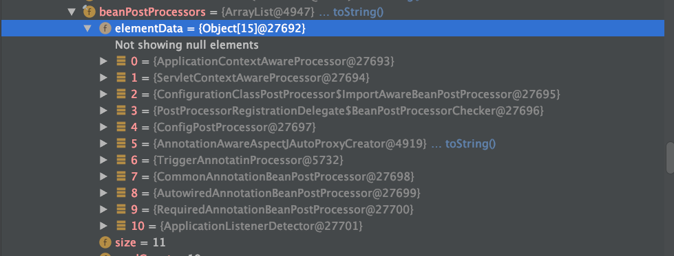

# Spring的BeanpostProcessor的顺序

[TOC]


## 加载BeanPostProcessor的时机

在AbstractApplicationContext#refresh 时加载 BeanPostProcessor

```java
public void refresh() throws BeansException, IllegalStateException {
   synchronized (this.startupShutdownMonitor) {
      // Prepare this context for refreshing.
      prepareRefresh();

      // Tell the subclass to refresh the internal bean factory.
      ConfigurableListableBeanFactory beanFactory = obtainFreshBeanFactory();

      // Prepare the bean factory for use in this context.
      prepareBeanFactory(beanFactory);

      try {
         // Allows post-processing of the bean factory in context subclasses.
         postProcessBeanFactory(beanFactory);

         // Invoke factory processors registered as beans in the context.
         invokeBeanFactoryPostProcessors(beanFactory);

         // Register bean processors that intercept bean creation.
        // 注册BeanPostProcessors
				// 注册所有的 BeanPostProcessor，将所有实现了 BeanPostProcessor 接口的类加载到 BeanFactory 中。
         registerBeanPostProcessors(beanFactory);

         // Initialize message source for this context.
         initMessageSource();

         // Initialize event multicaster for this context.
         initApplicationEventMulticaster();

         // Initialize other special beans in specific context subclasses.
         onRefresh();

         // Check for listener beans and register them.
         registerListeners();

         // Instantiate all remaining (non-lazy-init) singletons.
         finishBeanFactoryInitialization(beanFactory);

         // Last step: publish corresponding event.
         finishRefresh();
      }

      catch (BeansException ex) {
         if (logger.isWarnEnabled()) {
            logger.warn("Exception encountered during context initialization - " +
                  "cancelling refresh attempt: " + ex);
         }

         // Destroy already created singletons to avoid dangling resources.
         destroyBeans();

         // Reset 'active' flag.
         cancelRefresh(ex);

         // Propagate exception to caller.
         throw ex;
      }

      finally {
         // Reset common introspection caches in Spring's core, since we
         // might not ever need metadata for singleton beans anymore...
         resetCommonCaches();
      }
   }
}
```


## 最终加载

```java
public static void registerBeanPostProcessors(
      ConfigurableListableBeanFactory beanFactory, AbstractApplicationContext applicationContext) {

   //从 beanDefinitionNames 中获取类型为 BeanPostProcessor 的 beanName
   String[] postProcessorNames = beanFactory.getBeanNamesForType(BeanPostProcessor.class, true, false);

   // Register BeanPostProcessorChecker that logs an info message when
   // a bean is created during BeanPostProcessor instantiation, i.e. when
   // a bean is not eligible for getting processed by all BeanPostProcessors.
   // BeanPostProcessorChecker 实现了 BeanPostProcessor接口
   // 用来判断当前 bean 是否已经执行了所有的 BeanPostProcessor
   // BeanPostProcessor的目标计数
   int beanProcessorTargetCount = beanFactory.getBeanPostProcessorCount() + 1 + postProcessorNames.length;
   // 2.添加BeanPostProcessorChecker(主要用于记录信息)到beanFactory中
   beanFactory.addBeanPostProcessor(new BeanPostProcessorChecker(beanFactory, beanProcessorTargetCount));

   // Separate between BeanPostProcessors that implement PriorityOrdered,
   // Ordered, and the rest.
   // 对 BeanPostProcessor 进行分类排序
   // 实现 PriorityOrdered 接口的 BeanPostProcessor
   List<BeanPostProcessor> priorityOrderedPostProcessors = new ArrayList<>();
   // 实现 MergedBeanDefinitionPostProcessor 接口的 BeanPostProcessor
   List<BeanPostProcessor> internalPostProcessors = new ArrayList<>();
   // 实现 Ordered 接口的 BeanPostProcessor 的 BeanName
   List<String> orderedPostProcessorNames = new ArrayList<>();
   // 普通的 BeanPostProcessor 的 BeanName
   List<String> nonOrderedPostProcessorNames = new ArrayList<>();
   for (String ppName : postProcessorNames) {
      if (beanFactory.isTypeMatch(ppName, PriorityOrdered.class)) {
         if(logger.isInfoEnabled()){
            logger.info("实例化bdMap中的最高优先级的BeanPostProcessor，该BeanPostProcessor的实现类的beanName："+ppName);
         }
         // 4.1 如果ppName对应的Bean实例实现了PriorityOrdered接口,
         // 则拿到ppName对应的Bean实例并添加到priorityOrderedPostProcessors
         BeanPostProcessor pp = beanFactory.getBean(ppName, BeanPostProcessor.class);
         priorityOrderedPostProcessors.add(pp);
         if (pp instanceof MergedBeanDefinitionPostProcessor) {
            // 4.2 如果ppName对应的Bean实例也实现了MergedBeanDefinitionPostProcessor接口,
            // 则将ppName对应的Bean实例添加到internalPostProcessors
            internalPostProcessors.add(pp);
         }
      }
      else if (beanFactory.isTypeMatch(ppName, Ordered.class)) {
         // 4.3 如果ppName对应的Bean实例没有实现PriorityOrdered接口, 但是实现了Ordered接口, 则将ppName添加到orderedPostProcessorNames
         orderedPostProcessorNames.add(ppName);
      }
      else {
         // 4.4 否则, 将ppName添加到nonOrderedPostProcessorNames
         nonOrderedPostProcessorNames.add(ppName);
      }
   }

   // First, register the BeanPostProcessors that implement PriorityOrdered.
   // 5.首先, 注册实现PriorityOrdered接口的BeanPostProcessors
   // 5.1 对priorityOrderedPostProcessors进行排序
   sortPostProcessors(priorityOrderedPostProcessors, beanFactory);
   // 5.2 注册实现 PriorityOrdered 接口的 BeanPostProcessor
   // 底层循环List调用 beanFactory.addBeanPostProcessor(postProcessor); 方法
   registerBeanPostProcessors(beanFactory, priorityOrderedPostProcessors);

   // Next, register the BeanPostProcessors that implement Ordered.
   List<BeanPostProcessor> orderedPostProcessors = new ArrayList<>();
   // 6.接下来, 注册实现Ordered接口的BeanPostProcessors
   for (String ppName : orderedPostProcessorNames) {
      if(logger.isInfoEnabled()){
         logger.info("实例化bdMap中次优先级的BeanPostProcessor，该BeanPostProcessor的实现类的beanName："+ppName);
      }
      // 6.1 拿到ppName对应的BeanPostProcessor实例对象
      BeanPostProcessor pp = beanFactory.getBean(ppName, BeanPostProcessor.class);
      // 6.2 将ppName对应的BeanPostProcessor实例对象添加到orderedPostProcessors, 准备执行注册
      orderedPostProcessors.add(pp);
      if (pp instanceof MergedBeanDefinitionPostProcessor) {
         // 6.3 如果ppName对应的Bean实例也实现了MergedBeanDefinitionPostProcessor接口,
         // 则将ppName对应的Bean实例添加到internalPostProcessors
         internalPostProcessors.add(pp);
      }
   }
   // 6.4 对orderedPostProcessors进行排序
   sortPostProcessors(orderedPostProcessors, beanFactory);
   // 注册实现 Ordered 接口的 BeanPostProcessor
   registerBeanPostProcessors(beanFactory, orderedPostProcessors);

   // Now, register all regular BeanPostProcessors.
   // 7.注册所有常规的BeanPostProcessors（过程与6类似）
   List<BeanPostProcessor> nonOrderedPostProcessors = new ArrayList<>();
   for (String ppName : nonOrderedPostProcessorNames) {
      if(logger.isInfoEnabled()){
         logger.info("实例化bdMap中普通的BeanPostProcessor，该BeanPostProcessor的实现类的beanName："+ppName);
      }
      BeanPostProcessor pp = beanFactory.getBean(ppName, BeanPostProcessor.class);
      nonOrderedPostProcessors.add(pp);
      if (pp instanceof MergedBeanDefinitionPostProcessor) {
         internalPostProcessors.add(pp);
      }
   }
   //注册普通的 BeanPostProcessor
   registerBeanPostProcessors(beanFactory, nonOrderedPostProcessors);

   // Finally, re-register all internal BeanPostProcessors.
   // 8.最后, 重新注册所有内部BeanPostProcessors（相当于内部的BeanPostProcessor会被移到处理器链的末尾）
   // 8.1 对internalPostProcessors进行排序
   sortPostProcessors(internalPostProcessors, beanFactory);
   //注册实现 MergedBeanDefinitionPostProcessor 接口的 BeanPostProcessor
   registerBeanPostProcessors(beanFactory, internalPostProcessors);

   // Re-register post-processor for detecting inner beans as ApplicationListeners,
   // moving it to the end of the processor chain (for picking up proxies etc).
   // 9.注册ApplicationListenerDetector（跟8类似，主要是为了移动到处理器链的末尾）
   beanFactory.addBeanPostProcessor(new ApplicationListenerDetector(applicationContext));
   if(logger.isInfoEnabled()){
      logger.info("最终beanFactory中的beanPostProcessors的顺序为："+((AbstractBeanFactory)beanFactory).getBeanPostProcessors());
   }
}
```


## 结论


1. Spring手动加入的BeanPostProcessor，即没有BeanDefinition的。
2. 没有实现MergedBeanDefinitionPostProcessor接口的BeanPostProcessor。
   1. 实现了PriorityOrdered的BeanPostProcessor
   2. 实现了Ordered的BeanPostProcessor
   3. 剩余的BeanPostProcessor
3. 实现MergedBeanDefinitionPostProcessor接口的BeanPostProcessor。
   1. 实现了PriorityOrdered的BeanPostProcessor
   2. 实现了Ordered的BeanPostProcessor
   3. 剩余的BeanPostProcessor
4. ApplicationListenerDetector

例子：

- 0-3 是Spring手动加入的BeanPostProcessor；
- 4是没有实现MergedBeanDefinitionPostProcessor接口的实现了PriorityOrdered的BeanPostProcessor；
- 5是没有实现MergedBeanDefinitionPostProcessor接口的实现了Ordered的BeanPostProcessor；其中5为优先级最高为Ordered.HIGHEST_PRECEDENCE
- 6也是没有实现MergedBeanDefinitionPostProcessor接口的实现了Ordered的BeanPostProcessor；6为优先级最低为Ordered.LOWEST_PRECEDENCE
- 7是实现MergedBeanDefinitionPostProcessor接口的实现了PriorityOrdered的BeanPostProcessor；优先级为Ordered.LOWEST_PRECEDENCE - 3
- 8是实现MergedBeanDefinitionPostProcessor接口的实现了PriorityOrdered的BeanPostProcessor；优先级为Ordered.LOWEST_PRECEDENCE - 2
- 9是实现MergedBeanDefinitionPostProcessor接口的实现了PriorityOrdered的BeanPostProcessor；优先级为Ordered.LOWEST_PRECEDENCE - 1
- 10是ApplicationListenerDetector

