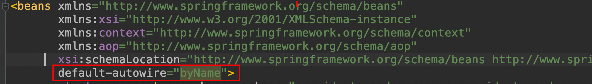

[TOC]

# Spring的IOC容器的属性注入

本文只分析属性的注入，根据源码分析AbstractAutowireCapableBeanFactory的populateBean方法

```java
protected void populateBean(String beanName, RootBeanDefinition mbd, @Nullable BeanWrapper bw) {
   if (bw == null) {
      if (mbd.hasPropertyValues()) {
         throw new BeanCreationException(
               mbd.getResourceDescription(), beanName, "Cannot apply property values to null instance");
      }
      else {
         // Skip property population phase for null instance.
         return;
      }
   }

   // Give any InstantiationAwareBeanPostProcessors the opportunity to modify the
   // state of the bean before properties are set. This can be used, for example,
   // to support styles of field injection.
   boolean continueWithPropertyPopulation = true;

   // 到这步的时候，bean 实例化完成（通过工厂方法或构造方法），但是还没开始属性设值，
   // InstantiationAwareBeanPostProcessor 的实现类可以在这里对 bean 进行状态修改，
   if (!mbd.isSynthetic() && hasInstantiationAwareBeanPostProcessors()) {
      // 如果mbd不是合成的 && 存在InstantiationAwareBeanPostProcessor，则遍历处理InstantiationAwareBeanPostProcessor
      for (BeanPostProcessor bp : getBeanPostProcessors()) {
         if (bp instanceof InstantiationAwareBeanPostProcessor) {
            InstantiationAwareBeanPostProcessor ibp = (InstantiationAwareBeanPostProcessor) bp;
            // 如果返回 false，代表不需要进行后续的属性设值，也不需要再经过其他的 BeanPostProcessor 的处理
            if (!ibp.postProcessAfterInstantiation(bw.getWrappedInstance(), beanName)) {
               continueWithPropertyPopulation = false;
               break;
            }
         }
      }
   }

   // 如果continueWithPropertyPopulation为false，则跳过之后的属性填充
   if (!continueWithPropertyPopulation) {
      return;
   }

   PropertyValues pvs = (mbd.hasPropertyValues() ? mbd.getPropertyValues() : null);

   // 解析自动装配模式为AUTOWIRE_BY_NAME和AUTOWIRE_BY_TYPE（用于注入）
   if (mbd.getResolvedAutowireMode() == AUTOWIRE_BY_NAME || mbd.getResolvedAutowireMode() == AUTOWIRE_BY_TYPE) {
      MutablePropertyValues newPvs = new MutablePropertyValues(pvs);
      // Add property values based on autowire by name if applicable.
      // 通过名字找到所有属性值，如果是 bean 依赖，先初始化依赖的 bean。记录依赖关系
      if (mbd.getResolvedAutowireMode() == AUTOWIRE_BY_NAME) {
         // 解析autowireByName的注入
         autowireByName(beanName, mbd, bw, newPvs);
      }
      // Add property values based on autowire by type if applicable.
      // 通过类型装配。复杂一些
      if (mbd.getResolvedAutowireMode() == AUTOWIRE_BY_TYPE) {
         // 解析autowireByType的注入
         autowireByType(beanName, mbd, bw, newPvs);
      }
      pvs = newPvs;
   }

   // BeanFactory是否注册过InstantiationAwareBeanPostProcessors
   boolean hasInstAwareBpps = hasInstantiationAwareBeanPostProcessors();
   // 是否需要依赖检查
   boolean needsDepCheck = (mbd.getDependencyCheck() != AbstractBeanDefinition.DEPENDENCY_CHECK_NONE);

   // 注册过InstantiationAwareBeanPostProcessors 或者 需要依赖检查
   if (hasInstAwareBpps || needsDepCheck) {
      if (pvs == null) {
         pvs = mbd.getPropertyValues();
      }
      //获取出对象的所有set get方法
      PropertyDescriptor[] filteredPds = filterPropertyDescriptorsForDependencyCheck(bw, mbd.allowCaching);
      if (hasInstAwareBpps) {
         // 应用后置处理器InstantiationAwareBeanPostProcessor
         for (BeanPostProcessor bp : getBeanPostProcessors()) {
            if (bp instanceof InstantiationAwareBeanPostProcessor) {
               InstantiationAwareBeanPostProcessor ibp = (InstantiationAwareBeanPostProcessor) bp;
               // 这里有个非常有用的 BeanPostProcessor
               // 进到这里: AutowiredAnnotationBeanPostProcessor
               // 对采用 @Autowired、@Value、@Resource 注解的依赖进行设值，
               if(logger.isInfoEnabled()){
                  logger.info("调用InstantiationAwareBeanPostProcessor的实例："+bp.getClass().getSimpleName()+"的postProcessPropertyValues方法，" +
                        "\n说明：AutowiredAnnotationBeanPostProcessor对采用 @Autowired、@Value 注解的依赖进行设值");
               }
               pvs = ibp.postProcessPropertyValues(pvs, filteredPds, bw.getWrappedInstance(), beanName);
               if (pvs == null) {
                  return;
               }
            }
         }
      }
      if (needsDepCheck) {
         // 依赖检查，对应depends-on属性
         checkDependencies(beanName, mbd, filteredPds, pvs);
      }
   }

   if (pvs != null) {
      // 将所有PropertyValues中的属性填充到bean中
      applyPropertyValues(beanName, mbd, bw, pvs);
   }
}
```

1.  解析自动装配模式为AUTOWIRE_BY_NAME和AUTOWIRE_BY_TYPE（需要放入三方的bean到Spring容器中时，这时候没办法使用注解）要注入的属性
2. @Autowired、@Value、@Resource注解解析，反射注入属性
3. 步骤1以及XML配置文件中属性注入

## 构造方法有参注入

todo

## 根据名称注入

### 最佳实践

使用注解：

```java
@Bean(autowire = Autowire.BY_NAME)
public AutoWireTestService2 autoWireTestService2() {
   return new AutoWireTestService2();
}
```

```java
public class AutoWireTestService2 {

   private HelloService helloService;

   public void setHelloService(HelloService helloService) {
      this.helloService = helloService;
   }
}
```

使用XML:



### 源码解析

```java
protected void autowireByName(
      String beanName, AbstractBeanDefinition mbd, BeanWrapper bw, MutablePropertyValues pvs) {
   // 寻找bw中需要依赖注入的属性
   String[] propertyNames = unsatisfiedNonSimpleProperties(mbd, bw);
   for (String propertyName : propertyNames) {
      // 校验是否存在beanName=propertyName的bean实例或者BeanDefinition
      if (containsBean(propertyName)) {
         // 获取propertyName的bean实例对象
         Object bean = getBean(propertyName);
         // 将属性名和属性值添加到pvs
         pvs.add(propertyName, bean);
         // 注册依赖关系到缓存（beanName依赖propertyName）
         registerDependentBean(propertyName, beanName);
         if (logger.isDebugEnabled()) {
            logger.debug("Added autowiring by name from bean name '" + beanName +
                  "' via property '" + propertyName + "' to bean named '" + propertyName + "'");
         }
      }
      else {
         if (logger.isTraceEnabled()) {
            logger.trace("Not autowiring property '" + propertyName + "' of bean '" + beanName +
                  "' by name: no matching bean found");
         }
      }
   }
}
```

1. 得到需要依赖注入的属性：获取实例化的Bean中，写入属性值的方法（set方法）不为空 && pd不是从依赖性检查中排除的bean属性 && pd不包含在pvs里&& pd的属性类型不是“简单”属性（基础类型、枚举、Number等）的属性。
2. 其中要注入的属性名称是：例如setXXX方法-setNam的名称是nam，根据nam从容器中获取Bean。
3. 根据要注入的属性名称从Spring容器中获取要注入的Bean。
4. 将要注入的属性加入到pvs中，之后再反射注入

分析要依赖注入的属性

```java
protected String[] unsatisfiedNonSimpleProperties(AbstractBeanDefinition mbd, BeanWrapper bw) {
   Set<String> result = new TreeSet<>();
   // 拿到mdb的属性值
   PropertyValues pvs = mbd.getPropertyValues();
   // 拿到bw的PropertyDescriptors
   PropertyDescriptor[] pds = bw.getPropertyDescriptors();
   // 遍历bw的PropertyDescriptors
   for (PropertyDescriptor pd : pds) {
      // pd用于写入属性值的方法不为空 && pd不是从依赖性检查中排除的bean属性 && pd不包含在pvs里
      // && pd的属性类型不是“简单”属性（基础类型、枚举、Number等）
      // isSimpleProperty: 判断属性是不是“简单”属性
      if (pd.getWriteMethod() != null && !isExcludedFromDependencyCheck(pd) && !pvs.contains(pd.getName()) &&
            !BeanUtils.isSimpleProperty(pd.getPropertyType())) {
         // 符合条件，则添加pd的name到result中，例如setNam的名称是nam
         result.add(pd.getName());
      }
   }
   return StringUtils.toStringArray(result);
}
```

其中PropertyDescriptor中存放的是类中的setXXX、getXXX以及isXXX方法（暂不分析）

### 小结

- set方法的例如setNam的名称是nam，根据名称从Spring容器中获取要注入的属性，该属性需要有set方法且属性类型不是简单类型，如果容器中没有该属性的bean时，则不注入该属性。

1. 得到需要依赖注入的属性：获取实例化的Bean中，写入属性值的方法（set方法）不为空 && pd不是从依赖性检查中排除的bean属性 && pd不包含在pvs里&& pd的属性类型不是“简单”属性（基础类型、枚举、Number等）的属性。
2. 其中要注入的属性名称是：例如setXXX方法-setNam的名称是nam，根据nam从容器中获取Bean。
3. 根据要注入的属性名称从Spring容器中获取要注入的Bean，如果容器中没有该属性的bean时，则不注入该属性。
4. 将要注入的属性加入到pvs中，之后再反射注入

## 根据类型注入

### 最佳实践

```java
@Bean(autowire = Autowire.BY_TYPE)
public static AutoWireTestService3 autoWireTestService3() {
   return new AutoWireTestService3();
}
```

```java
public class AutoWireTestService3 {

   private HelloService helloService;

   public void setHelloService(HelloService helloService) {
      this.helloService = helloService;
   }
}
```

Mybatis与Spring整合的时候，在MapperFactoryBean实例类中注入SqlSessionFactory

在BeanDefinition中设置注入方式是根据类型注入

```java
private void processBeanDefinitions(Set<BeanDefinitionHolder> beanDefinitions) {
  GenericBeanDefinition definition;
  for (BeanDefinitionHolder holder : beanDefinitions) {
    definition = (GenericBeanDefinition) holder.getBeanDefinition();
    String beanClassName = definition.getBeanClassName();
    LOGGER.debug(() -> "Creating MapperFactoryBean with name '" + holder.getBeanName()
        + "' and '" + beanClassName + "' mapperInterface");

    // the mapper interface is the original class of the bean
    // but, the actual class of the bean is MapperFactoryBean
    // 设置有参构造的入参是 要注入接口的全类名
    definition.getConstructorArgumentValues().addGenericArgumentValue(beanClassName); // issue #59
    // 设置BeanClass为mapperFactoryBean
    definition.setBeanClass(this.mapperFactoryBeanClass);

    definition.getPropertyValues().add("addToConfig", this.addToConfig);

    boolean explicitFactoryUsed = false;
    if (StringUtils.hasText(this.sqlSessionFactoryBeanName)) {
      definition.getPropertyValues().add("sqlSessionFactory", new RuntimeBeanReference(this.sqlSessionFactoryBeanName));
      explicitFactoryUsed = true;
    } else if (this.sqlSessionFactory != null) {
      definition.getPropertyValues().add("sqlSessionFactory", this.sqlSessionFactory);
      explicitFactoryUsed = true;
    }

    if (StringUtils.hasText(this.sqlSessionTemplateBeanName)) {
      if (explicitFactoryUsed) {
        LOGGER.warn(() -> "Cannot use both: sqlSessionTemplate and sqlSessionFactory together. sqlSessionFactory is ignored.");
      }
      definition.getPropertyValues().add("sqlSessionTemplate", new RuntimeBeanReference(this.sqlSessionTemplateBeanName));
      explicitFactoryUsed = true;
    } else if (this.sqlSessionTemplate != null) {
      if (explicitFactoryUsed) {
        LOGGER.warn(() -> "Cannot use both: sqlSessionTemplate and sqlSessionFactory together. sqlSessionFactory is ignored.");
      }
      definition.getPropertyValues().add("sqlSessionTemplate", this.sqlSessionTemplate);
      explicitFactoryUsed = true;
    }

    if (!explicitFactoryUsed) {
      LOGGER.debug(() -> "Enabling autowire by type for MapperFactoryBean with name '" + holder.getBeanName() + "'.");
      // 设置根据类型注入
      definition.setAutowireMode(AbstractBeanDefinition.AUTOWIRE_BY_TYPE);
    }
  }
}
```

设置注入类型是根据类型注入

 MapperFactoryBean集成SqlSessionDaoSupport类，SqlSessionDaoSupport中有setSqlSessionFactory方法，在Spring容器中能根据SqlSessionFactory类型找到类型匹配的类，所以注入SqlSessionFactory

```java
public void setSqlSessionFactory(SqlSessionFactory sqlSessionFactory) {
  if (this.sqlSessionTemplate == null || sqlSessionFactory != this.sqlSessionTemplate.getSqlSessionFactory()) {
    this.sqlSessionTemplate = createSqlSessionTemplate(sqlSessionFactory);
  }
}
```

### 源码解析

分析根据类型注入的源码

```java
protected void autowireByType(
      String beanName, AbstractBeanDefinition mbd, BeanWrapper bw, MutablePropertyValues pvs) {

   TypeConverter converter = getCustomTypeConverter();
   if (converter == null) {
      converter = bw;
   }

   Set<String> autowiredBeanNames = new LinkedHashSet<>(4);
   // 寻找bw中需要依赖注入的属性
   String[] propertyNames = unsatisfiedNonSimpleProperties(mbd, bw);
   // 遍历所有需要依赖注入的属性
   for (String propertyName : propertyNames) {
      try {
         PropertyDescriptor pd = bw.getPropertyDescriptor(propertyName);
         // Don't try autowiring by type for type Object: never makes sense,
         // even if it technically is a unsatisfied, non-simple property.
         if (Object.class != pd.getPropertyType()) {
            // 获取指定属性的set方法，封装成MethodParameter（必须有set方法才能通过属性来注入）
            MethodParameter methodParam = BeanUtils.getWriteMethodParameter(pd);
            // Do not allow eager init for type matching in case of a prioritized post-processor.
            boolean eager = !PriorityOrdered.class.isInstance(bw.getWrappedInstance());
            // 将MethodParameter的方法参数索引信息封装成DependencyDescriptor
            DependencyDescriptor desc = new AutowireByTypeDependencyDescriptor(methodParam, eager);
            // 解析当前属性所匹配的bean实例，并把解析到的bean实例的beanName存储在autowiredBeanNames中
            Object autowiredArgument = resolveDependency(desc, beanName, autowiredBeanNames, converter);
            if (autowiredArgument != null) {
               // 如果找到了依赖的bean实例，将属性名和bean实例放到pvs中
               pvs.add(propertyName, autowiredArgument);
            }
            for (String autowiredBeanName : autowiredBeanNames) {
               // 注册依赖关系，beanName依赖autowiredBeanName
               registerDependentBean(autowiredBeanName, beanName);
               if (logger.isDebugEnabled()) {
                  logger.debug("Autowiring by type from bean name '" + beanName + "' via property '" +
                        propertyName + "' to bean named '" + autowiredBeanName + "'");
               }
            }
            autowiredBeanNames.clear();
         }
      }
      catch (BeansException ex) {
         throw new UnsatisfiedDependencyException(mbd.getResourceDescription(), beanName, propertyName, ex);
      }
   }
}
```

1. 得到需要依赖注入的属性：获取实例化的Bean中，写入属性值的方法（set方法）不为空 && pd不是从依赖性检查中排除的bean属性 && pd不包含在pvs里&& pd的属性类型不是“简单”属性（基础类型、枚举、Number等）的属性。
2. 其中要注入的属性名称是：例如setXXX方法-setNam的名称是nam，根据nam从容器中获取Bean。
3. 调用resolveDependency先根据要注入的属性类型存在多个再根据名称从Spring容器中获取要注入的Bean。
4. 将要注入的属性加入到pvs中，之后再反射注入

详细分析resolveDependency

```java
public Object resolveDependency(DependencyDescriptor descriptor, @Nullable String requestingBeanName,
      @Nullable Set<String> autowiredBeanNames, @Nullable TypeConverter typeConverter) throws BeansException {

   descriptor.initParameterNameDiscovery(getParameterNameDiscoverer());
   if (Optional.class == descriptor.getDependencyType()) {
      return createOptionalDependency(descriptor, requestingBeanName);
   }
   else if (ObjectFactory.class == descriptor.getDependencyType() ||
         ObjectProvider.class == descriptor.getDependencyType()) {
      return new DependencyObjectProvider(descriptor, requestingBeanName);
   }
   else if (javaxInjectProviderClass == descriptor.getDependencyType()) {
      return new Jsr330ProviderFactory().createDependencyProvider(descriptor, requestingBeanName);
   }
   else {
      // 通用类注入的处理
      // 如有必要，请获取延迟解析代理
      Object result = getAutowireCandidateResolver().getLazyResolutionProxyIfNecessary(
            descriptor, requestingBeanName);
      if (result == null) {
         // 解析依赖关系，返回的result为创建好的依赖对象的bean实例
         result = doResolveDependency(descriptor, requestingBeanName, autowiredBeanNames, typeConverter);
      }
      return result;
   }
}
```

继续分析doResolveDependency

```java
public Object doResolveDependency(DependencyDescriptor descriptor, @Nullable String beanName,
			@Nullable Set<String> autowiredBeanNames, @Nullable TypeConverter typeConverter) throws BeansException {
		// 设置当前的descriptor(存储了方法参数等信息)为当前注入点
		InjectionPoint previousInjectionPoint = ConstructorResolver.setCurrentInjectionPoint(descriptor);
		try {
			// 如果是ShortcutDependencyDescriptor，则直接通过getBean方法获取Bean实例，并返回；否则返回null
			Object shortcut = descriptor.resolveShortcut(this);
			if (shortcut != null) {
				return shortcut;
			}
			// 拿到descriptor包装的方法的参数类型（通过参数索引定位到具体的参数）
			Class<?> type = descriptor.getDependencyType();
			// 用于支持注解@Value（确定给定的依赖项是否声明Value注解，如果有则拿到值）
			Object value = getAutowireCandidateResolver().getSuggestedValue(descriptor);
			if (value != null) {
				// 如果value是String类型，走这里。此例value为: ${}字符串
				if (value instanceof String) {
					// 开始解析value的值
					// 处理 ${}
					String strVal = resolveEmbeddedValue((String) value);
					BeanDefinition bd = (beanName != null && containsBean(beanName) ? getMergedBeanDefinition(beanName) : null);
					// 处理 #{}
					value = evaluateBeanDefinitionString(strVal, bd);
				}
				TypeConverter converter = (typeConverter != null ? typeConverter : getTypeConverter());
				// 如果使用了@Value注解，则将解析到的值转换成所需的类型并返回
				return (descriptor.getField() != null ?
						converter.convertIfNecessary(value, type, descriptor.getField()) :
						converter.convertIfNecessary(value, type, descriptor.getMethodParameter()));
			}
			// 解析MultipleBean（下文的MultipleBean都是指类型为：Array、Collection、Map）
			Object multipleBeans = resolveMultipleBeans(descriptor, beanName, autowiredBeanNames, typeConverter);
			if (multipleBeans != null) {
				// 如果确实是容器类型的属性，则直接返回解析结果
				return multipleBeans;
			}
			// 查找与所需类型匹配的Bean实例（matchingBeans，key：beanName；value：匹配的bean实例，如果bean还没有实例化则返回匹配的bean实例的类型）
			Map<String, Object> matchingBeans = findAutowireCandidates(beanName, type, descriptor);
			if (matchingBeans.isEmpty()) {
				// 如果require属性为true，而找到的匹配Bean却为空则抛出异常
				if (isRequired(descriptor)) {
					raiseNoMatchingBeanFound(type, descriptor.getResolvableType(), descriptor);
				}
				// 如果require属性为false，而找到的匹配Bean却为空，则返回null
				return null;
			}

			String autowiredBeanName;
			Object instanceCandidate;

			if (matchingBeans.size() > 1) {
				// 非MultipleBean，但是有多个候选者
				// 从多个候选者中选出最优的那个
				autowiredBeanName = determineAutowireCandidate(matchingBeans, descriptor);
				if (autowiredBeanName == null) {
					if (isRequired(descriptor) || !indicatesMultipleBeans(type)) {
						return descriptor.resolveNotUnique(type, matchingBeans);
					}
					else {
						// In case of an optional Collection/Map, silently ignore a non-unique case:
						// possibly it was meant to be an empty collection of multiple regular beans
						// (before 4.3 in particular when we didn't even look for collection beans).
						return null;
					}
				}
				// 拿到autowiredBeanName对应的value（bean实例或bean实例类型）
				instanceCandidate = matchingBeans.get(autowiredBeanName);
			}
			else {
				// We have exactly one match.
				// 只找到了一个候选者，则直接使用该候选者
				Map.Entry<String, Object> entry = matchingBeans.entrySet().iterator().next();
				autowiredBeanName = entry.getKey();
				instanceCandidate = entry.getValue();
			}

			if (autowiredBeanNames != null) {
				// 将依赖的beanName加到autowiredBeanNames中
				autowiredBeanNames.add(autowiredBeanName);
			}
			// 如果instanceCandidate为Class，则instanceCandidate为bean实例的类型，执行descriptor.resolveCandidate方法，通过getBean方法获取bean实例并返回；
			// 如果instanceCandidate不是Class，则instanceCandidate为bean实例，直接返回该实例
			if (instanceCandidate instanceof Class) {
				if(logger.isInfoEnabled()){
					logger.info("该需要注入的属性还没有实例化(包括循环依赖的情况)，则先将该属性实例化，属性为："+((Class)instanceCandidate).getSimpleName());
				}
				instanceCandidate = descriptor.resolveCandidate(autowiredBeanName, type, this);
			}
			Object result = instanceCandidate;
			if (result instanceof NullBean) {
				if (isRequired(descriptor)) {
					raiseNoMatchingBeanFound(type, descriptor.getResolvableType(), descriptor);
				}
				result = null;
			}
			if (!ClassUtils.isAssignableValue(type, result)) {
				throw new BeanNotOfRequiredTypeException(autowiredBeanName, type, instanceCandidate.getClass());
			}
			return result;
		}
		finally {
			// 执行结束，将注入点修改成原来的注入点
			ConstructorResolver.setCurrentInjectionPoint(previousInjectionPoint);
		}
	}
```

1. 处理@Value注解，解析${}以及#{}的逻辑 todo
2. 解析注入类型为：Array、Collection、Map。和步骤3类似不分析
3. 调用findAutowireCandidates方法根据注入的类型，从Spring容器中根据类型（类型如果有泛型，则泛型也要匹配）获取支持的Bean实例，然后再根据@Qualifier注解根据name选出一个，如果bean还没有实例化则返回匹配的bean实例的类型
4. 如果获取的bean为null，且require为true，则抛异常
5. 如果选出来多个bean，调用determineAutowireCandidate方法，先根据@Primary注解后根据OrderComparator.getPriority来比较优先级最后根据属性名称，选出来优先级最高的bean，如果没选出来，且require为true，则抛异常
6. 如果获取的要注入的属性instanceCandidate为Class，则instanceCandidate为bean实例的类型，执行descriptor.resolveCandidate方法，通过getBean方法获取bean实例并返回
7. 如果获取的bean为null，且require为true，则抛异常

分析findAutowireCandidates的逻辑

```java
protected Map<String, Object> findAutowireCandidates(
      @Nullable String beanName, Class<?> requiredType, DependencyDescriptor descriptor) {
   if(logger.isInfoEnabled()){
      logger.info("查找bdMap中的符合该类型："+requiredType.getSimpleName()+"的bean，该过程中会实例化FactoryBean，实例化@Bean标注的返回值为FactoryBean的方法，但是不会加入到单例池中，@Bean方法所在的配置类，会加入到单例池中，" +
            "此处只是为了调用其getObject()方法，来得到其类型\n---------------------------");
   }
   // 获取给定类型的所有beanName，包括在祖先工厂中定义的beanName
   String[] candidateNames = BeanFactoryUtils.beanNamesForTypeIncludingAncestors(
         this, requiredType, true, descriptor.isEager());
   if(logger.isInfoEnabled()){
      logger.info("FactoryBean实例化完毕\n---------------------------------");
   }
   Map<String, Object> result = new LinkedHashMap<>(candidateNames.length);
   // 首先从已经解析的依赖关系缓存中寻找是否存在我们想要的类型
   for (Class<?> autowiringType : this.resolvableDependencies.keySet()) {
      // autowiringType是否与requiredType相同，或者是requiredType的超类、超接口
      if (autowiringType.isAssignableFrom(requiredType)) {
         // 如果requiredType匹配，则从缓存中拿到相应的自动装配值（bean实例）
         Object autowiringValue = this.resolvableDependencies.get(autowiringType);
         // 根据给定的所需类型解析给定的自动装配值
         autowiringValue = AutowireUtils.resolveAutowiringValue(autowiringValue, requiredType);
         if (requiredType.isInstance(autowiringValue)) {
            // 将autowiringValue放到结果集中，此时的value为bean实例
            result.put(ObjectUtils.identityToString(autowiringValue), autowiringValue);
            break;
         }
      }
   }
   // 遍历从容器中获取到的类型符合的beanName
   for (String candidate : candidateNames) {
      // isAutowireCandidate：判断是否有资格作为依赖注入的候选者
      // 如果不是自引用 && candidate有资格作为依赖注入的候选者
      if (!isSelfReference(beanName, candidate) && isAutowireCandidate(candidate, descriptor)) {
         // 将候选者添加到result中
         addCandidateEntry(result, candidate, descriptor, requiredType);
      }
   }
   // 如果结果为空 && type不是MultipleBean（Array、Collection、Map），则使用降级匹配
   if (result.isEmpty() && !indicatesMultipleBeans(requiredType)) {
      // Consider fallback matches if the first pass failed to find anything...
      // 使用降级匹配（跟正常匹配类似）
      DependencyDescriptor fallbackDescriptor = descriptor.forFallbackMatch();
      for (String candidate : candidateNames) {
         if (!isSelfReference(beanName, candidate) && isAutowireCandidate(candidate, fallbackDescriptor)) {
            addCandidateEntry(result, candidate, descriptor, requiredType);
         }
      }
      if (result.isEmpty()) {
         // Consider self references as a final pass...
         // but in the case of a dependency collection, not the very same bean itself.
         // 如果使用降级匹配结果还是空，则考虑自引用
         for (String candidate : candidateNames) {
            if (isSelfReference(beanName, candidate) &&
                  (!(descriptor instanceof MultiElementDescriptor) || !beanName.equals(candidate)) &&
                  isAutowireCandidate(candidate, fallbackDescriptor)) {
               // 如果是自引用 && (descriptor不是MultiElementDescriptor || beanName不等于候选者)
               // && candidate允许依赖注入，则将候选者添加到result中
               addCandidateEntry(result, candidate, descriptor, requiredType);
            }
         }
      }
   }
   // 返回符合条件的候选者
   return result;
}
```

1. 首先根据类型获取Spring容器中所有匹配的beanName
2. 调用isAutowireCandidate判断是否类型匹配

分析isAutowireCandidate的逻辑

```java
public boolean isAutowireCandidate(String beanName, DependencyDescriptor descriptor)
      throws NoSuchBeanDefinitionException {

   // getAutowireCandidateResolver: 返回BeanFactory的@Autowire解析器，开启注解后的解析器为：ContextAnnotationAutowireCandidateResolver
   // 解析beanName对应的bean是否有资格作为候选者
   return isAutowireCandidate(beanName, descriptor, getAutowireCandidateResolver());
}
```

```java
protected boolean isAutowireCandidate(String beanName, DependencyDescriptor descriptor, AutowireCandidateResolver resolver)
      throws NoSuchBeanDefinitionException {

   // 解析beanName，去掉FactoryBean的修饰符"&"
   String beanDefinitionName = BeanFactoryUtils.transformedBeanName(beanName);
   if (containsBeanDefinition(beanDefinitionName)) {
      // beanDefinitionMap缓存中存在beanDefinitionName：通过beanDefinitionName缓存拿到MergedBeanDefinition，
      // 将MergedBeanDefinition作为参数，解析beanName是否有资格作为候选者
      return isAutowireCandidate(beanName, getMergedLocalBeanDefinition(beanDefinitionName), descriptor, resolver);
   }
   else if (containsSingleton(beanName)) {
      // singletonObjects缓存中存在beanName：使用beanName构建RootBeanDefinition作为参数，解析beanName是否有资格作为候选者
      return isAutowireCandidate(beanName, new RootBeanDefinition(getType(beanName)), descriptor, resolver);
   }

   // 在beanDefinitionMap缓存和singletonObjects缓存中都不存在，则在parentBeanFactory中递归解析beanName是否有资格作为候选者
   BeanFactory parent = getParentBeanFactory();
   if (parent instanceof DefaultListableBeanFactory) {
      // No bean definition found in this factory -> delegate to parent.
      return ((DefaultListableBeanFactory) parent).isAutowireCandidate(beanName, descriptor, resolver);
   }
   else if (parent instanceof ConfigurableListableBeanFactory) {
      // If no DefaultListableBeanFactory, can't pass the resolver along.
      return ((ConfigurableListableBeanFactory) parent).isAutowireCandidate(beanName, descriptor);
   }
   else {
      return true;
   }
}
```

```java
protected boolean isAutowireCandidate(String beanName, RootBeanDefinition mbd,
      DependencyDescriptor descriptor, AutowireCandidateResolver resolver) {

   String beanDefinitionName = BeanFactoryUtils.transformedBeanName(beanName);
   // 解析mbd的beanClass
   resolveBeanClass(mbd, beanDefinitionName);
   if (mbd.isFactoryMethodUnique) {
      boolean resolve;
      synchronized (mbd.constructorArgumentLock) {
         resolve = (mbd.resolvedConstructorOrFactoryMethod == null);
      }
      if (resolve) {
         // 如果缓存中已经存在解析的构造函数或工厂方法，则解析mbd中的工厂方法，并替换掉缓存中的方法
         new ConstructorResolver(this).resolveFactoryMethodIfPossible(mbd);
      }
   }
   // 使用resolver解析器解析mbd是否有资格作为依赖注入的候选者
   return resolver.isAutowireCandidate(
         new BeanDefinitionHolder(mbd, beanName, getAliases(beanDefinitionName)), descriptor);
}
```

继续调用到QualifierAnnotationAutowireCandidateResolver的isAutowireCandidate方法

```java
public boolean isAutowireCandidate(BeanDefinitionHolder bdHolder, DependencyDescriptor descriptor) {
   // 调用父类方法判断此bean是否可以自动注入到其他bean
   boolean match = super.isAutowireCandidate(bdHolder, descriptor);
   if (match) {
      // @Qualifier注解检查
      match = checkQualifiers(bdHolder, descriptor.getAnnotations());
      if (match) {
         MethodParameter methodParam = descriptor.getMethodParameter();
         if (methodParam != null) {
            Method method = methodParam.getMethod();
            if (method == null || void.class == method.getReturnType()) {
               match = checkQualifiers(bdHolder, methodParam.getMethodAnnotations());
            }
         }
      }
   }
   return match;
}
```

1. 调用父类GenericTypeAwareAutowireCandidateResolver的isAutowireCandidate方法，判断泛型是否匹配
2. 解析@Qualifier注解，根据名称匹配注入的属性

分析GenericTypeAwareAutowireCandidateResolver的isAutowireCandidate方法

```java
public boolean isAutowireCandidate(BeanDefinitionHolder bdHolder, DependencyDescriptor descriptor) {
   if (!super.isAutowireCandidate(bdHolder, descriptor)) {
      // If explicitly false, do not proceed with any other checks...
      // 如果父类返回false，则直接返回false
      return false;
   }
   // descriptor为空 || bdHolder的类型与descriptor的类型匹配，则返回true
   return checkGenericTypeMatch(bdHolder, descriptor);
}
```

默认走checkGenericTypeMatch方法

```java
protected boolean checkGenericTypeMatch(BeanDefinitionHolder bdHolder, DependencyDescriptor descriptor) {
   ResolvableType dependencyType = descriptor.getResolvableType();
   // 要注入的候选者的类型不存在泛型，由于前面已校验过类型匹配，则直接返回true
   if (dependencyType.getType() instanceof Class) {
      // No generic type -> we know it's a Class type-match, so no need to check again.
      return true;
   }

   ResolvableType targetType = null;
   boolean cacheType = false;
   RootBeanDefinition rbd = null;
   if (bdHolder.getBeanDefinition() instanceof RootBeanDefinition) {
      rbd = (RootBeanDefinition) bdHolder.getBeanDefinition();
   }
   if (rbd != null) {
      targetType = rbd.targetType;
      if (targetType == null) {
         cacheType = true;
         // First, check factory method return type, if applicable
         targetType = getReturnTypeForFactoryMethod(rbd, descriptor);
         if (targetType == null) {
            RootBeanDefinition dbd = getResolvedDecoratedDefinition(rbd);
            if (dbd != null) {
               targetType = dbd.targetType;
               if (targetType == null) {
                  targetType = getReturnTypeForFactoryMethod(dbd, descriptor);
               }
            }
         }
      }
   }
   // 获取要注入的 targetType
   if (targetType == null) {
      // Regular case: straight bean instance, with BeanFactory available.
      if (this.beanFactory != null) {
         Class<?> beanType = this.beanFactory.getType(bdHolder.getBeanName());
         if (beanType != null) {
            targetType = ResolvableType.forClass(ClassUtils.getUserClass(beanType));
         }
      }
      // Fallback: no BeanFactory set, or no type resolvable through it
      // -> best-effort match against the target class if applicable.
      if (targetType == null && rbd != null && rbd.hasBeanClass() && rbd.getFactoryMethodName() == null) {
         Class<?> beanClass = rbd.getBeanClass();
         if (!FactoryBean.class.isAssignableFrom(beanClass)) {
            targetType = ResolvableType.forClass(ClassUtils.getUserClass(beanClass));
         }
      }
   }

   if (targetType == null) {
      return true;
   }
   if (cacheType) {
      rbd.targetType = targetType;
   }
   if (descriptor.fallbackMatchAllowed() && targetType.hasUnresolvableGenerics()) {
      return true;
   }
   // Full check for complex generic type match...
   // 检查泛型类型匹配
   return dependencyType.isAssignableFrom(targetType);
}
```

1. 如果要注入的候选者的类型不存在泛型，由于前面已校验过类型匹配，则直接返回true
2. 根据获取BeanDefinition要注入的 targetType
3. 调用ResolvableType的isAssignableFrom方法进行类型匹配（如果有泛型，则进行泛型类型匹配）todo

如果选出来多个Bean继续分析determineAutowireCandidate方法来确定多个Bean的优先级

```java
protected String determineAutowireCandidate(Map<String, Object> candidates, DependencyDescriptor descriptor) {
   Class<?> requiredType = descriptor.getDependencyType();
   // 根据@Primary注解来选择最优解
   String primaryCandidate = determinePrimaryCandidate(candidates, requiredType);
   if (primaryCandidate != null) {
      return primaryCandidate;
   }
   // 如果类实现OrderComparator接口，根据OrderComparator.getPriority来比较优先级
   String priorityCandidate = determineHighestPriorityCandidate(candidates, requiredType);
   if (priorityCandidate != null) {
      return priorityCandidate;
   }
   // Fallback
   // 如果通过以上两步都不能选择出最优解，则使用最基本的策略
   for (Map.Entry<String, Object> entry : candidates.entrySet()) {
      String candidateName = entry.getKey();
      Object beanInstance = entry.getValue();
      // containsValue：首先如果这个beanInstance已经由Spring注册过依赖关系，则直接使用该beanInstance作为最优解，
      // matchesBeanName：如果没有注册过此beanInstance的依赖关系，则根据参数名称来匹配，
      // 如果参数名称和某个候选者的beanName或别名一致，那么直接将此bean作为最优解
      if ((beanInstance != null && this.resolvableDependencies.containsValue(beanInstance)) ||
            matchesBeanName(candidateName, descriptor.getDependencyName())) {
         return candidateName;
      }
   }
   // 4.没有找到匹配的候选者，则返回null
   return null;
}
```


继续分析checkQualifiers方法，解析@Qualifier注解

```java
protected boolean checkQualifiers(BeanDefinitionHolder bdHolder, Annotation[] annotationsToSearch) {
   if (ObjectUtils.isEmpty(annotationsToSearch)) {
      return true;
   }
   SimpleTypeConverter typeConverter = new SimpleTypeConverter();
   for (Annotation annotation : annotationsToSearch) {
      Class<? extends Annotation> type = annotation.annotationType();
      boolean checkMeta = true;
      boolean fallbackToMeta = false;
      if (isQualifier(type)) {
         // 解析@Qualifier注解，名称匹配则返回 true
         if (!checkQualifier(bdHolder, annotation, typeConverter)) {
            fallbackToMeta = true;
         }
         else {
            checkMeta = false;
         }
      }
      if (checkMeta) {
         boolean foundMeta = false;
         for (Annotation metaAnn : type.getAnnotations()) {
            Class<? extends Annotation> metaType = metaAnn.annotationType();
            if (isQualifier(metaType)) {
               foundMeta = true;
               // Only accept fallback match if @Qualifier annotation has a value...
               // Otherwise it is just a marker for a custom qualifier annotation.
               if ((fallbackToMeta && StringUtils.isEmpty(AnnotationUtils.getValue(metaAnn))) ||
                     !checkQualifier(bdHolder, metaAnn, typeConverter)) {
                  return false;
               }
            }
         }
         if (fallbackToMeta && !foundMeta) {
            return false;
         }
      }
   }
   return true;
}
```

```java
protected boolean checkQualifier(
      BeanDefinitionHolder bdHolder, Annotation annotation, TypeConverter typeConverter) {

   Class<? extends Annotation> type = annotation.annotationType();
   RootBeanDefinition bd = (RootBeanDefinition) bdHolder.getBeanDefinition();

   AutowireCandidateQualifier qualifier = bd.getQualifier(type.getName());
   if (qualifier == null) {
      qualifier = bd.getQualifier(ClassUtils.getShortName(type));
   }
   if (qualifier == null) {
      // First, check annotation on qualified element, if any
      Annotation targetAnnotation = getQualifiedElementAnnotation(bd, type);
      // Then, check annotation on factory method, if applicable
      if (targetAnnotation == null) {
         targetAnnotation = getFactoryMethodAnnotation(bd, type);
      }
      if (targetAnnotation == null) {
         RootBeanDefinition dbd = getResolvedDecoratedDefinition(bd);
         if (dbd != null) {
            targetAnnotation = getFactoryMethodAnnotation(dbd, type);
         }
      }
      if (targetAnnotation == null) {
         // Look for matching annotation on the target class
         if (getBeanFactory() != null) {
            try {
               Class<?> beanType = getBeanFactory().getType(bdHolder.getBeanName());
               if (beanType != null) {
                  targetAnnotation = AnnotationUtils.getAnnotation(ClassUtils.getUserClass(beanType), type);
               }
            }
            catch (NoSuchBeanDefinitionException ex) {
               // Not the usual case - simply forget about the type check...
            }
         }
         if (targetAnnotation == null && bd.hasBeanClass()) {
            targetAnnotation = AnnotationUtils.getAnnotation(ClassUtils.getUserClass(bd.getBeanClass()), type);
         }
      }
      if (targetAnnotation != null && targetAnnotation.equals(annotation)) {
         return true;
      }
   }
       // 解析@Qualifier注解
   Map<String, Object> attributes = AnnotationUtils.getAnnotationAttributes(annotation);
   if (attributes.isEmpty() && qualifier == null) {
      // If no attributes, the qualifier must be present
      return false;
   }
   for (Map.Entry<String, Object> entry : attributes.entrySet()) {
      String attributeName = entry.getKey();
      Object expectedValue = entry.getValue();
      Object actualValue = null;
      // Check qualifier first
      if (qualifier != null) {
         actualValue = qualifier.getAttribute(attributeName);
      }
      if (actualValue == null) {
         // Fall back on bean definition attribute
         actualValue = bd.getAttribute(attributeName);
      }
      // 名称匹配则返回 true
      if (actualValue == null && attributeName.equals(AutowireCandidateQualifier.VALUE_KEY) &&
            expectedValue instanceof String && bdHolder.matchesName((String) expectedValue)) {
         // Fall back on bean name (or alias) match
         continue;
      }
      if (actualValue == null && qualifier != null) {
         // Fall back on default, but only if the qualifier is present
         actualValue = AnnotationUtils.getDefaultValue(annotation, attributeName);
      }
      if (actualValue != null) {
         actualValue = typeConverter.convertIfNecessary(actualValue, expectedValue.getClass());
      }
      if (!expectedValue.equals(actualValue)) {
         return false;
      }
   }
   return true;
}
```

1. 处理@Qualifier注解
2. Qualifier的value属性与beanName名称匹配则返回 true

### 小结

1. 得到需要依赖注入的属性：获取实例化的Bean中，写入属性值的方法（set方法）不为空 && pd不是从依赖性检查中排除的bean属性 && pd不包含在pvs里&& pd的属性类型不是“简单”属性（基础类型、枚举、Number等）的属性。
2. 其中要注入的属性名称是：例如setXXX方法-setNam的名称是nam，根据nam从容器中获取Bean。
3. 先根据类型（如果有泛型，则进行泛型类型匹配）从Spring容器中获取匹配的Bean，后根据@Qualifier>@Primary>OrderComparator.getPriority()>属性名称匹配的顺序选出要注入的Bean。
4. 将要注入的属性加入到pvs中，之后再反射注入

## @Autowired、@Value、@Resource注解注入

### 最佳实践

```java
@RestController
public class HelloController {

   @Value("${server.port}")
   private String port;

   @Autowired
   public HelloService helloService;
}
```

### 源码解析

```java
// 注册过InstantiationAwareBeanPostProcessors 或者 需要依赖检查
if (hasInstAwareBpps || needsDepCheck) {
   if (pvs == null) {
      pvs = mbd.getPropertyValues();
   }
   //获取出对象的所有set get方法
   PropertyDescriptor[] filteredPds = filterPropertyDescriptorsForDependencyCheck(bw, mbd.allowCaching);
   if (hasInstAwareBpps) {
      // 应用后置处理器InstantiationAwareBeanPostProcessor
      for (BeanPostProcessor bp : getBeanPostProcessors()) {
         if (bp instanceof InstantiationAwareBeanPostProcessor) {
            InstantiationAwareBeanPostProcessor ibp = (InstantiationAwareBeanPostProcessor) bp;
            // 这里有个非常有用的 BeanPostProcessor
            // 进到这里: AutowiredAnnotationBeanPostProcessor
            // 对采用 @Autowired、@Value、@Resource 注解的依赖进行设值，
            if(logger.isInfoEnabled()){
               logger.info("调用InstantiationAwareBeanPostProcessor的实例："+bp.getClass().getSimpleName()+"的postProcessPropertyValues方法，" +
                     "\n说明：AutowiredAnnotationBeanPostProcessor对采用 @Autowired、@Value 注解的依赖进行设值");
            }
            pvs = ibp.postProcessPropertyValues(pvs, filteredPds, bw.getWrappedInstance(), beanName);
            if (pvs == null) {
               return;
            }
         }
      }
   }
   if (needsDepCheck) {
      // 依赖检查，对应depends-on属性
      checkDependencies(beanName, mbd, filteredPds, pvs);
   }
}
```

其中处理@Autowired、@Value注解的是AutowiredAnnotationBeanPostProcessor

处理@Resource注解的是CommonAnnotationBeanPostProcessor

#### 先分析AutowiredAnnotationBeanPostProcessor的postProcessPropertyValues方法

```java
public PropertyValues postProcessPropertyValues(
      PropertyValues pvs, PropertyDescriptor[] pds, Object bean, String beanName) throws BeanCreationException {

   // 在指定Bean中查找使用@Autowire，@Value注解的元数据
   InjectionMetadata metadata = findAutowiringMetadata(beanName, bean.getClass(), pvs);
   try {
      // InjectionMetadata: 执行inject()方法，开始执行属性注入或方法注入
      metadata.inject(bean, beanName, pvs);
   }
   catch (BeanCreationException ex) {
      throw ex;
   }
   catch (Throwable ex) {
      throw new BeanCreationException(beanName, "Injection of autowired dependencies failed", ex);
   }
   return pvs;
}
```

1. 调用findAutowiringMetadata查找使用@Autowire，@Value注解的元数据
2. 进行属性注入

解析AutowiredAnnotationBeanPostProcessor的findAutowiringMetadata方法

```java
private InjectionMetadata findAutowiringMetadata(String beanName, Class<?> clazz, @Nullable PropertyValues pvs) {
   // Fall back to class name as cache key, for backwards compatibility with custom callers.
   // 设置cacheKey的值（beanName 或者 className）
   String cacheKey = (StringUtils.hasLength(beanName) ? beanName : clazz.getName());
   // Quick check on the concurrent map first, with minimal locking.
   // 检查beanName对应的InjectionMetadata是否已经存在于缓存中
   InjectionMetadata metadata = this.injectionMetadataCache.get(cacheKey);
   // 检查InjectionMetadata是否需要刷新（为空或者class变了）
   if (InjectionMetadata.needsRefresh(metadata, clazz)) {
      synchronized (this.injectionMetadataCache) {
         // 加锁后，再次从缓存中获取beanName对应的InjectionMetadata
         metadata = this.injectionMetadataCache.get(cacheKey);
         // 加锁后，再次检查InjectionMetadata是否需要刷新
         if (InjectionMetadata.needsRefresh(metadata, clazz)) {
            if (metadata != null) {
               // 如果需要刷新，并且metadata不为空，则先移除
               metadata.clear(pvs);
            }
            // 解析@Autowired注解的信息，生成元数据（包含clazz和clazz里解析到的注入的元素，
            // 这里的元素包括AutowiredFieldElement和AutowiredMethodElement）
            metadata = buildAutowiringMetadata(clazz);
            // 将解析的元数据放到injectionMetadataCache缓存，以备复用，每一个类只解析一次
            this.injectionMetadataCache.put(cacheKey, metadata);
         }
      }
   }
   return metadata;
}
```

初次调用findAutowiringMetadata方法的时机是AutowiredAnnotationBeanPostProcessor的postProcessMergedBeanDefinition方法，在调postProcessPropertyValues是已经有缓存。其中postProcessMergedBeanDefinition的调用时机 todo

```java
private InjectionMetadata findAutowiringMetadata(String beanName, Class<?> clazz, @Nullable PropertyValues pvs) {
   // Fall back to class name as cache key, for backwards compatibility with custom callers.
   // 设置cacheKey的值（beanName 或者 className）
   String cacheKey = (StringUtils.hasLength(beanName) ? beanName : clazz.getName());
   // Quick check on the concurrent map first, with minimal locking.
   // 检查beanName对应的InjectionMetadata是否已经存在于缓存中
   InjectionMetadata metadata = this.injectionMetadataCache.get(cacheKey);
   // 检查InjectionMetadata是否需要刷新（为空或者class变了）
   if (InjectionMetadata.needsRefresh(metadata, clazz)) {
      synchronized (this.injectionMetadataCache) {
         // 加锁后，再次从缓存中获取beanName对应的InjectionMetadata
         metadata = this.injectionMetadataCache.get(cacheKey);
         // 加锁后，再次检查InjectionMetadata是否需要刷新
         if (InjectionMetadata.needsRefresh(metadata, clazz)) {
            if (metadata != null) {
               // 如果需要刷新，并且metadata不为空，则先移除
               metadata.clear(pvs);
            }
            // 解析@Autowired注解的信息，生成元数据（包含clazz和clazz里解析到的注入的元素，
            // 这里的元素包括AutowiredFieldElement和AutowiredMethodElement）
            metadata = buildAutowiringMetadata(clazz);
            // 将解析的元数据放到injectionMetadataCache缓存，以备复用，每一个类只解析一次
            this.injectionMetadataCache.put(cacheKey, metadata);
         }
      }
   }
   return metadata;
}
```

分析buildAutowiringMetadata的逻辑

```java
private InjectionMetadata buildAutowiringMetadata(final Class<?> clazz) {
   // 用于存放所有解析到的注入的元素的变量
   List<InjectionMetadata.InjectedElement> elements = new ArrayList<>();
   Class<?> targetClass = clazz;

   // 循环遍历
   do {
      // 定义存放当前循环的Class注入的元素(有序)
      final List<InjectionMetadata.InjectedElement> currElements = new ArrayList<>();

      // 如果targetClass的属性上有@Autowired注解，则用工具类获取注解信息
      ReflectionUtils.doWithLocalFields(targetClass, field -> {
         // 获取field上的@Autowired注解信息
         AnnotationAttributes ann = findAutowiredAnnotation(field);
         if (ann != null) {
            // 校验field是否被static修饰，如果是则直接返回，因为@Autowired注解不支持static修饰的field
            if (Modifier.isStatic(field.getModifiers())) {
               if (logger.isWarnEnabled()) {
                  logger.warn("Autowired annotation is not supported on static fields: " + field);
               }
               return;
            }
            // 获取@Autowired注解的required的属性值（required：值为true时，如果没有找到bean时，自动装配应该失败；false则不会）
            boolean required = determineRequiredStatus(ann);
            // 将field、required封装成AutowiredFieldElement，添加到currElements
            currElements.add(new AutowiredFieldElement(field, required));
         }
      });

      // 如果targetClass的方法上有@Autowired注解，则用工具类获取注解信息
      ReflectionUtils.doWithLocalMethods(targetClass, method -> {
         // 找到桥接方法
         Method bridgedMethod = BridgeMethodResolver.findBridgedMethod(method);
         // 判断方法的可见性，如果不可见则直接返回
         if (!BridgeMethodResolver.isVisibilityBridgeMethodPair(method, bridgedMethod)) {
            return;
         }
         // 获取method上的@Autowired注解信息
         AnnotationAttributes ann = findAutowiredAnnotation(bridgedMethod);
         if (ann != null && method.equals(ClassUtils.getMostSpecificMethod(method, clazz))) {
            // 校验method是否被static修饰，如果是则直接返回，因为@Autowired注解不支持static修饰的method
            if (Modifier.isStatic(method.getModifiers())) {
               if (logger.isWarnEnabled()) {
                  logger.warn("Autowired annotation is not supported on static methods: " + method);
               }
               return;
            }
            // @Autowired注解标识在方法上的目的就是将容器内的Bean注入到方法的参数中，没有参数就违背了初衷
            if (method.getParameterCount() == 0) {
               if (logger.isWarnEnabled()) {
                  logger.warn("Autowired annotation should only be used on methods with parameters: " +
                        method);
               }
            }
            // 获取@Autowired注解的required的属性值
            boolean required = determineRequiredStatus(ann);
            // 获取method的属性描述器
            PropertyDescriptor pd = BeanUtils.findPropertyForMethod(bridgedMethod, clazz);
            // 将method、required、pd封装成AutowiredMethodElement，添加到currElements
            currElements.add(new AutowiredMethodElement(method, required, pd));
         }
      });

      // 将本次循环获取到的注解信息添加到elements
      elements.addAll(0, currElements);
      //  在解析完targetClass之后，递归解析父类，将所有的@Autowired的属性和方法收集起来，且类的层级越高其属性会被越优先注入
      targetClass = targetClass.getSuperclass();
   }
   // 递归解析targetClass父类(直至父类为Object结束)
   while (targetClass != null && targetClass != Object.class);

   // 将clazz和解析到的注入的元素封装成InjectionMetadata
   return new InjectionMetadata(clazz, elements);
}
```

继续分析inject注入属性的逻辑

```java
public void inject(Object target, @Nullable String beanName, @Nullable PropertyValues pvs) throws Throwable {
   // 如果checkedElements存在，则使用checkedElements，否则使用injectedElements
   Collection<InjectedElement> checkedElements = this.checkedElements;
   Collection<InjectedElement> elementsToIterate =
         (checkedElements != null ? checkedElements : this.injectedElements);
   if (!elementsToIterate.isEmpty()) {
      for (InjectedElement element : elementsToIterate) {
         if (logger.isDebugEnabled()) {
            logger.debug("Processing injected element of bean '" + beanName + "': " + element);
         }
         // 解析@Autowired注解生成的元数据类：AutowiredFieldElement、AutowiredMethodElement，
         // 这两个类继承InjectionMetadata.InjectedElement，各自重写了inject方法。
         if(logger.isInfoEnabled()){
            logger.info("注入属性值，被注入的属性为："+element.member.getName());
         }
         element.inject(target, beanName, pvs);
      }
   }
}
```

只分析属性注入即AutowiredFieldElement的inject方法，方法注入与此类似

```java
protected void inject(Object bean, @Nullable String beanName, @Nullable PropertyValues pvs) throws Throwable {
   // 拿到该元数据的属性值
   Field field = (Field) this.member;
   Object value;
   // 如果缓存中已经存在，则直接从缓存中解析属性
   if (this.cached) {
      value = resolvedCachedArgument(beanName, this.cachedFieldValue);
   }
   else {
      // 将field封装成DependencyDescriptor
      DependencyDescriptor desc = new DependencyDescriptor(field, this.required);
      desc.setContainingClass(bean.getClass());
      Set<String> autowiredBeanNames = new LinkedHashSet<>(1);
      Assert.state(beanFactory != null, "No BeanFactory available");
      TypeConverter typeConverter = beanFactory.getTypeConverter();
      try {
         // 解析当前属性所匹配的bean实例，并把解析到的bean实例的beanName存储在autowiredBeanNames中
         value = beanFactory.resolveDependency(desc, beanName, autowiredBeanNames, typeConverter);
      }
      catch (BeansException ex) {
         throw new UnsatisfiedDependencyException(null, beanName, new InjectionPoint(field), ex);
      }
      // 判断返回的要注入的属性，类型是否匹配
      synchronized (this) {
         if (!this.cached) {
            // value不为空或者required为true
            if (value != null || this.required) {
               // 如果属性依赖注入的bean不止一个（Array,Collection,Map），缓存cachedFieldValue放的是DependencyDescriptor
               this.cachedFieldValue = desc;
               // 注册依赖关系到缓存（beanName 依赖 autowiredBeanNames）
               registerDependentBeans(beanName, autowiredBeanNames);
               // 如果属性依赖注入的bean只有一个（正常都是一个）
               if (autowiredBeanNames.size() == 1) {
                  String autowiredBeanName = autowiredBeanNames.iterator().next();
                  // @Autowired标识属性类型和Bean的类型要匹配，因此Array,Collection,Map类型的属性不支持缓存属性Bean名称
                  // 检查autowiredBeanName对应的bean的类型是否为field的类型
                  if (beanFactory.containsBean(autowiredBeanName) &&
                        beanFactory.isTypeMatch(autowiredBeanName, field.getType())) {
                     // 将该属性解析到的bean的信息封装成ShortcutDependencyDescriptor，
                     // 以便之后可以通过getBean方法来快速拿到bean实例
                     this.cachedFieldValue = new ShortcutDependencyDescriptor(
                           desc, autowiredBeanName, field.getType());
                  }
               }
            }
            else {
               this.cachedFieldValue = null;
            }
            // 缓存标识设为true
            this.cached = true;
         }
      }
   }
   // 设置要注入的属性
   if (value != null) {
      // 设置字段访问性
      ReflectionUtils.makeAccessible(field);
      // 通过反射为属性赋值，将解析出来的bean实例赋值给field
      field.set(bean, value);
   }
}
```

1. 调用resolveDependency方法，先根据类型（如果有泛型，则进行泛型类型匹配）从Spring容器中获取匹配的Bean，后根据@Qualifier>@Primary>OrderComparator.getPriority()>属性名称匹配的顺序选出要注入的Bean。
2. 反射设置实例化Bean的属性值

#### 再分析CommonAnnotationBeanPostProcessor的postProcessPropertyValues方法

```java
public PropertyValues postProcessPropertyValues(
			PropertyValues pvs, PropertyDescriptor[] pds, Object bean, String beanName) {
		// 在指定Bean中查找使用 @Resource 注解的元数据
		InjectionMetadata metadata = findResourceMetadata(beanName, bean.getClass(), pvs);
		try {
			// 执行inject()方法，开始执行属性注入或方法注入
			metadata.inject(bean, beanName, pvs);
		}
		catch (Throwable ex) {
			throw new BeanCreationException(beanName, "Injection of resource dependencies failed", ex);
		}
		return pvs;
	}
```

1. 调用findAutowiringMetadata查找使用@Resource注解的元数据，和解析@Autowire类似不分析
2. 进行属性注入

分析属性注入

```java
public void inject(Object target, @Nullable String beanName, @Nullable PropertyValues pvs) throws Throwable {
   // 如果checkedElements存在，则使用checkedElements，否则使用injectedElements
   Collection<InjectedElement> checkedElements = this.checkedElements;
   Collection<InjectedElement> elementsToIterate =
         (checkedElements != null ? checkedElements : this.injectedElements);
   if (!elementsToIterate.isEmpty()) {
      for (InjectedElement element : elementsToIterate) {
         if (logger.isDebugEnabled()) {
            logger.debug("Processing injected element of bean '" + beanName + "': " + element);
         }
         // 解析@Autowired注解生成的元数据类：AutowiredFieldElement、AutowiredMethodElement，
         // 这两个类继承InjectionMetadata.InjectedElement，各自重写了inject方法。
         if(logger.isInfoEnabled()){
            logger.info("注入属性值，被注入的属性为："+element.member.getName());
         }
         element.inject(target, beanName, pvs);
      }
   }
}
```

```java
protected void inject(Object target, @Nullable String requestingBeanName, @Nullable PropertyValues pvs)
      throws Throwable {
   // 属性注入
   if (this.isField) {
      Field field = (Field) this.member;
      ReflectionUtils.makeAccessible(field);
      field.set(target, getResourceToInject(target, requestingBeanName));
   }
   else {
      // 方法注入
      if (checkPropertySkipping(pvs)) {
         return;
      }
      try {
         Method method = (Method) this.member;
         ReflectionUtils.makeAccessible(method);
         method.invoke(target, getResourceToInject(target, requestingBeanName));
      }
      catch (InvocationTargetException ex) {
         throw ex.getTargetException();
      }
   }
}
```

1. 调用getResourceToInject获取要注入的属性
2. 反射注入实例化的Bean属性

只分析属性注入

分析getResourceToInject方法

```java
protected Object getResourceToInject(Object target, @Nullable String requestingBeanName) {
   return (this.lazyLookup ? buildLazyResourceProxy(this, requestingBeanName) :
         getResource(this, requestingBeanName));
}
```

```java
protected Object getResource(LookupElement element, @Nullable String requestingBeanName)
      throws NoSuchBeanDefinitionException {

   if (StringUtils.hasLength(element.mappedName)) {
      return this.jndiFactory.getBean(element.mappedName, element.lookupType);
   }
   if (this.alwaysUseJndiLookup) {
      return this.jndiFactory.getBean(element.name, element.lookupType);
   }
   if (this.resourceFactory == null) {
      throw new NoSuchBeanDefinitionException(element.lookupType,
            "No resource factory configured - specify the 'resourceFactory' property");
   }
   return autowireResource(this.resourceFactory, element, requestingBeanName);
}
```

```java
protected Object autowireResource(BeanFactory factory, LookupElement element, @Nullable String requestingBeanName)
      throws NoSuchBeanDefinitionException {

   Object resource;
   Set<String> autowiredBeanNames;
   String name = element.name;

   // 如果工厂中没有name, 调用resolveDependency根据类型和名称进行匹配
   if (this.fallbackToDefaultTypeMatch && element.isDefaultName &&
         factory instanceof AutowireCapableBeanFactory && !factory.containsBean(name)) {
      autowiredBeanNames = new LinkedHashSet<>();
      resource = ((AutowireCapableBeanFactory) factory).resolveDependency(
            element.getDependencyDescriptor(), requestingBeanName, autowiredBeanNames, null);
      if (resource == null) {
         throw new NoSuchBeanDefinitionException(element.getLookupType(), "No resolvable resource object");
      }
   }
   else {
      // 如果工厂中有name, 直接根据 name 获取
      resource = factory.getBean(name, element.lookupType);
      autowiredBeanNames = Collections.singleton(name);
   }

   if (factory instanceof ConfigurableBeanFactory) {
      ConfigurableBeanFactory beanFactory = (ConfigurableBeanFactory) factory;
      for (String autowiredBeanName : autowiredBeanNames) {
         if (requestingBeanName != null && beanFactory.containsBean(autowiredBeanName)) {
            beanFactory.registerDependentBean(autowiredBeanName, requestingBeanName);
         }
      }
   }

   return resource;
}
```

1. 如果Spring容器中有该name的Bean，则直接获取
2. 没有则调用resolveDependency方法，先根据类型（如果有泛型，则进行泛型类型匹配）从Spring容器中获取匹配的Bean，后根据@Qualifier>@Primary>OrderComparator.getPriority()>属性名称匹配的顺序选出要注入的Bean。

### 小结

- 使用@Autowire注解标注的属性，直接调用resolveDependency方法，先根据类型（如果有泛型，则进行泛型类型匹配）从Spring容器中获取匹配的Bean，后根据@Qualifier>@Primary>OrderComparator.getPriority()>属性名称匹配的顺序选出要注入的Bean。
- 使用@Resource注解标注的属性，如果Spring容器中有该name的Bean，从Spring容器中获取Bean，没有则调用resolveDependency方法，先根据类型（如果有泛型，则进行泛型类型匹配）从Spring容器中获取匹配的Bean，后根据@Qualifier>@Primary>OrderComparator.getPriority()>属性名称匹配的顺序选出要注入的Bean。
- 使用@Value标注的属性，解析过${}与#{}之后，反射注入到实例化的Bean中。

## XML配置文件中属性注入

### 最佳实践

```java
<bean id="sequenceDataSourcePool" parent="abstractDataSourcePool">
    <property name="driverClassName" value="${sequence.jdbc.driver}"/>
    <property name="url" value="${sequence.jdbc.url}"/>
    <property name="username" value="${sequence.jdbc.username}"/>
    <property name="password" value="${sequence.jdbc.password}"/>
    <property value="15000" name="maxWait"/>
    <property value="2" name="initialSize"/>
    <property value="2" name="minIdle"/>
</bean>
```

### 源码解析

```java
protected void applyPropertyValues(String beanName, BeanDefinition mbd, BeanWrapper bw, PropertyValues pvs) {
		if (pvs.isEmpty()) {
			return;
		}

		if (System.getSecurityManager() != null && bw instanceof BeanWrapperImpl) {
			((BeanWrapperImpl) bw).setSecurityContext(getAccessControlContext());
		}

		MutablePropertyValues mpvs = null;
		List<PropertyValue> original;
		// 获取属性值列表
		if (pvs instanceof MutablePropertyValues) {
			mpvs = (MutablePropertyValues) pvs;
			// 如果mpvs中的值已经被转换为对应的类型，那么可以直接设置到BeanWrapper中
			if (mpvs.isConverted()) {
				// Shortcut: use the pre-converted values as-is.
				try {
					bw.setPropertyValues(mpvs);
					return;
				}
				catch (BeansException ex) {
					throw new BeanCreationException(
							mbd.getResourceDescription(), beanName, "Error setting property values", ex);
				}
			}
			original = mpvs.getPropertyValueList();
		}
		else {
			// 如果pvs并不是使用MutablePropertyValues封装的类型，那么直接使用原始的属性获取方法
			original = Arrays.asList(pvs.getPropertyValues());
		}

		TypeConverter converter = getCustomTypeConverter();
		if (converter == null) {
			converter = bw;
		}
		// 获取对应的解析器
		BeanDefinitionValueResolver valueResolver = new BeanDefinitionValueResolver(this, beanName, mbd, converter);

		// Create a deep copy, resolving any references for values.
		// 创建深层拷贝副本，用于存放解析后的属性值
		List<PropertyValue> deepCopy = new ArrayList<>(original.size());
		boolean resolveNecessary = false;
		// 遍历属性，将属性转换为对应类的对应属性的类型
		for (PropertyValue pv : original) {
			if (pv.isConverted()) {
				// 如果pv已经包含转换的值，则直接添加到deepCopy
				deepCopy.add(pv);
			}
			else {
				// 否则，进行转换
				// 拿到pv的原始属性名和属性值
				String propertyName = pv.getName();
				Object originalValue = pv.getValue();
				// 使用解析器解析原始属性值，涉及解析string类型、<property name="dataSource" ref="multiDataSource"/>的ref
				// 如果是@Autowire、@Value、@Resource注入的属性，则直接返回该属性
				Object resolvedValue = valueResolver.resolveValueIfNecessary(pv, originalValue);
				Object convertedValue = resolvedValue;
				// 判断该属性是否可转换
				boolean convertible = bw.isWritableProperty(propertyName) &&
						!PropertyAccessorUtils.isNestedOrIndexedProperty(propertyName);
				if (convertible) {
					// 如果可转换，则转换指定目标属性的给定值
					convertedValue = convertForProperty(resolvedValue, propertyName, bw, converter);
				}
				// Possibly store converted value in merged bean definition,
				// in order to avoid re-conversion for every created bean instance.
				// 在合并的BeanDefinition中存储转换后的值，以避免为每个创建的bean实例重新转换
				if (resolvedValue == originalValue) {
					if (convertible) {
						pv.setConvertedValue(convertedValue);
					}
					deepCopy.add(pv);
				}
				else if (convertible && originalValue instanceof TypedStringValue &&
						!((TypedStringValue) originalValue).isDynamic() &&
						!(convertedValue instanceof Collection || ObjectUtils.isArray(convertedValue))) {
					pv.setConvertedValue(convertedValue);
					deepCopy.add(pv);
				}
				else {
					resolveNecessary = true;
					deepCopy.add(new PropertyValue(pv, convertedValue));
				}
			}
		}
		if (mpvs != null && !resolveNecessary) {
			mpvs.setConverted();
		}

		// Set our (possibly massaged) deep copy.
		try {
			// 设置bean的属性值为deepCopy
			bw.setPropertyValues(new MutablePropertyValues(deepCopy));
		}
		catch (BeansException ex) {
			throw new BeanCreationException(
					mbd.getResourceDescription(), beanName, "Error setting property values", ex);
		}
	}
```


1. 获取要注入的属性，解析string或者<property name="dataSource" ref="multiDataSource"/>的ref、如果是@Autowire、@Value、@Resource注入的属性，则直接返回该属性等等
2. 利用setPropertyValues反射设置实例化Bean中的属性

分析resolveValueIfNecessary的获取要注入的属性的逻辑

```java
public Object resolveValueIfNecessary(Object argName, @Nullable Object value) {
   // We must check each value to see whether it requires a runtime reference
   // to another bean to be resolved.
   if (value instanceof RuntimeBeanReference) {
      // 如果是beanRef，常见于XML，例如：<property name="dataSource" ref="multiDataSource"/>
      RuntimeBeanReference ref = (RuntimeBeanReference) value;
      // 根据name获取Bean
      return resolveReference(argName, ref);
   }
   else if (value instanceof RuntimeBeanNameReference) {
      String refName = ((RuntimeBeanNameReference) value).getBeanName();
      refName = String.valueOf(doEvaluate(refName));
      if (!this.beanFactory.containsBean(refName)) {
         throw new BeanDefinitionStoreException(
               "Invalid bean name '" + refName + "' in bean reference for " + argName);
      }
      return refName;
   }
   else if (value instanceof BeanDefinitionHolder) {
      // Resolve BeanDefinitionHolder: contains BeanDefinition with name and aliases.
      BeanDefinitionHolder bdHolder = (BeanDefinitionHolder) value;
      return resolveInnerBean(argName, bdHolder.getBeanName(), bdHolder.getBeanDefinition());
   }
   else if (value instanceof BeanDefinition) {
      // Resolve plain BeanDefinition, without contained name: use dummy name.
      BeanDefinition bd = (BeanDefinition) value;
      String innerBeanName = "(inner bean)" + BeanFactoryUtils.GENERATED_BEAN_NAME_SEPARATOR +
            ObjectUtils.getIdentityHexString(bd);
      return resolveInnerBean(argName, innerBeanName, bd);
   }
   else if (value instanceof ManagedArray) {
      // May need to resolve contained runtime references.
      ManagedArray array = (ManagedArray) value;
      Class<?> elementType = array.resolvedElementType;
      if (elementType == null) {
         String elementTypeName = array.getElementTypeName();
         if (StringUtils.hasText(elementTypeName)) {
            try {
               elementType = ClassUtils.forName(elementTypeName, this.beanFactory.getBeanClassLoader());
               array.resolvedElementType = elementType;
            }
            catch (Throwable ex) {
               // Improve the message by showing the context.
               throw new BeanCreationException(
                     this.beanDefinition.getResourceDescription(), this.beanName,
                     "Error resolving array type for " + argName, ex);
            }
         }
         else {
            elementType = Object.class;
         }
      }
      return resolveManagedArray(argName, (List<?>) value, elementType);
   }
   else if (value instanceof ManagedList) {
      // May need to resolve contained runtime references.
      return resolveManagedList(argName, (List<?>) value);
   }
   else if (value instanceof ManagedSet) {
      // May need to resolve contained runtime references.
      return resolveManagedSet(argName, (Set<?>) value);
   }
   else if (value instanceof ManagedMap) {
      // May need to resolve contained runtime references.
      return resolveManagedMap(argName, (Map<?, ?>) value);
   }
   else if (value instanceof ManagedProperties) {
      Properties original = (Properties) value;
      Properties copy = new Properties();
      original.forEach((propKey, propValue) -> {
         if (propKey instanceof TypedStringValue) {
            propKey = evaluate((TypedStringValue) propKey);
         }
         if (propValue instanceof TypedStringValue) {
            propValue = evaluate((TypedStringValue) propValue);
         }
         if (propKey == null || propValue == null) {
            throw new BeanCreationException(
                  this.beanDefinition.getResourceDescription(), this.beanName,
                  "Error converting Properties key/value pair for " + argName + ": resolved to null");
         }
         copy.put(propKey, propValue);
      });
      return copy;
   }
   else if (value instanceof TypedStringValue) {
      // Convert value to target type here.
      // 解析String类型
      TypedStringValue typedStringValue = (TypedStringValue) value;
      Object valueObject = evaluate(typedStringValue);
      try {
         Class<?> resolvedTargetType = resolveTargetType(typedStringValue);
         if (resolvedTargetType != null) {
            // 类型转换
            return this.typeConverter.convertIfNecessary(valueObject, resolvedTargetType);
         }
         else {
            return valueObject;
         }
      }
      catch (Throwable ex) {
         // Improve the message by showing the context.
         throw new BeanCreationException(
               this.beanDefinition.getResourceDescription(), this.beanName,
               "Error converting typed String value for " + argName, ex);
      }
   }
   else if (value instanceof NullBean) {
      return null;
   }
   else {
      // 如果是@Autowire、@Value、@Resource注入的属性，则直接返回该属性
      return evaluate(value);
   }
}
```

继续分析setPropertyValues设置属性的源码

```java
public void setPropertyValues(PropertyValues pvs, boolean ignoreUnknown, boolean ignoreInvalid)
      throws BeansException {

   List<PropertyAccessException> propertyAccessExceptions = null;
   List<PropertyValue> propertyValues = (pvs instanceof MutablePropertyValues ?
         ((MutablePropertyValues) pvs).getPropertyValueList() : Arrays.asList(pvs.getPropertyValues()));
   for (PropertyValue pv : propertyValues) {
      try {
         // This method may throw any BeansException, which won't be caught
         // here, if there is a critical failure such as no matching field.
         // We can attempt to deal only with less serious exceptions.
         // 根据pv设置实例化Bean的属性
         setPropertyValue(pv);
      }
      catch (NotWritablePropertyException ex) {
         if (!ignoreUnknown) {
            throw ex;
         }
         // Otherwise, just ignore it and continue...
      }
      catch (NullValueInNestedPathException ex) {
         if (!ignoreInvalid) {
            throw ex;
         }
         // Otherwise, just ignore it and continue...
      }
      catch (PropertyAccessException ex) {
         if (propertyAccessExceptions == null) {
            propertyAccessExceptions = new ArrayList<>();
         }
         propertyAccessExceptions.add(ex);
      }
   }

   // If we encountered individual exceptions, throw the composite exception.
   if (propertyAccessExceptions != null) {
      PropertyAccessException[] paeArray = propertyAccessExceptions.toArray(new PropertyAccessException[0]);
      throw new PropertyBatchUpdateException(paeArray);
   }
}
```

```java
@Override
public void setPropertyValue(PropertyValue pv) throws BeansException {
   setPropertyValue(pv.getName(), pv.getValue());
}
```

```java
public void setPropertyValue(String propertyName, @Nullable Object value) throws BeansException {
   AbstractNestablePropertyAccessor nestedPa;
   try {
      nestedPa = getPropertyAccessorForPropertyPath(propertyName);
   }
   catch (NotReadablePropertyException ex) {
      throw new NotWritablePropertyException(getRootClass(), this.nestedPath + propertyName,
            "Nested property in path '" + propertyName + "' does not exist", ex);
   }
   PropertyTokenHolder tokens = getPropertyNameTokens(getFinalPath(nestedPa, propertyName));
   // 设置属性
   nestedPa.setPropertyValue(tokens, new PropertyValue(propertyName, value));
}
```

```java
protected void setPropertyValue(PropertyTokenHolder tokens, PropertyValue pv) throws BeansException {
   if (tokens.keys != null) {
      processKeyedProperty(tokens, pv);
   }
   else {
      // 设置属性
      processLocalProperty(tokens, pv);
   }
}
```

```java
private void processLocalProperty(PropertyTokenHolder tokens, PropertyValue pv) {
   PropertyHandler ph = getLocalPropertyHandler(tokens.actualName);
   if (ph == null || !ph.isWritable()) {
      if (pv.isOptional()) {
         if (logger.isDebugEnabled()) {
            logger.debug("Ignoring optional value for property '" + tokens.actualName +
                  "' - property not found on bean class [" + getRootClass().getName() + "]");
         }
         return;
      }
      else {
         throw createNotWritablePropertyException(tokens.canonicalName);
      }
   }

   Object oldValue = null;
   try {
      Object originalValue = pv.getValue();
      Object valueToApply = originalValue;
      if (!Boolean.FALSE.equals(pv.conversionNecessary)) {
         if (pv.isConverted()) {
            valueToApply = pv.getConvertedValue();
         }
         else {
            if (isExtractOldValueForEditor() && ph.isReadable()) {
               try {
                  oldValue = ph.getValue();
               }
               catch (Exception ex) {
                  if (ex instanceof PrivilegedActionException) {
                     ex = ((PrivilegedActionException) ex).getException();
                  }
                  if (logger.isDebugEnabled()) {
                     logger.debug("Could not read previous value of property '" +
                           this.nestedPath + tokens.canonicalName + "'", ex);
                  }
               }
            }
            // 利用 ConversionService 进行入参类型转换
            valueToApply = convertForProperty(
                  tokens.canonicalName, oldValue, originalValue, ph.toTypeDescriptor());
         }
         pv.getOriginalPropertyValue().conversionNecessary = (valueToApply != originalValue);
      }
      // 利用反射设置属性
      ph.setValue(valueToApply);
   }
   。。。。。。
}
```

```java
public void setValue(final @Nullable Object value) throws Exception {
   final Method writeMethod = (this.pd instanceof GenericTypeAwarePropertyDescriptor ?
         ((GenericTypeAwarePropertyDescriptor) this.pd).getWriteMethodForActualAccess() :
         this.pd.getWriteMethod());
   if (System.getSecurityManager() != null) {
      AccessController.doPrivileged((PrivilegedAction<Object>) () -> {
         ReflectionUtils.makeAccessible(writeMethod);
         return null;
      });
      try {
         AccessController.doPrivileged((PrivilegedExceptionAction<Object>) () ->
               writeMethod.invoke(getWrappedInstance(), value), acc);
      }
      catch (PrivilegedActionException ex) {
         throw ex.getException();
      }
   }
   else {
      ReflectionUtils.makeAccessible(writeMethod);
      // set方法设置属性
      writeMethod.invoke(getWrappedInstance(), value);
   }
}
```

### 小结

1. 获取要注入的属性，解析string或者<property name="dataSource" ref="multiDataSource"/>的ref、如果是@Autowire、@Value、@Resource注入的属性，则直接返回该属性等等
2. 反射设置实例化Bean中的属性

## 总结

1. **构造参数设置属性**：直接调用resolveDependency方法，先根据类型（如果有泛型，则进行泛型类型匹配）从Spring容器中获取匹配的Bean，后根据@Qualifier>@Primary>OrderComparator.getPriority()>属性名称匹配的顺序选出要注入的Bean。不支持循环依赖
2. **@Autowire注解标注的属性**：直接调用resolveDependency方法，先根据类型（如果有泛型，则进行泛型类型匹配）从Spring容器中获取匹配的Bean，后根据@Qualifier>@Primary>OrderComparator.getPriority()>属性名称匹配的顺序选出要注入的Bean。如果没有找到，则根据@Autowired(required = false)的required属性决定是否抛出异常。
3. **@Resource注解标注的属性**：如果Spring容器中有该name的Bean，从Spring容器中获取Bean，没有则调用resolveDependency方法，先根据类型（如果有泛型，则进行泛型类型匹配）从Spring容器中获取匹配的Bean，后根据@Qualifier>@Primary>OrderComparator.getPriority()>属性名称匹配的顺序选出要注入的Bean。如果没有找到则抛出异常。
4. **@Value标注的属性**：解析过${}与#{}之后，反射注入到实例化的Bean中。
5. **byName与byType都是得到需要依赖注入的属性**：（获取实例化的Bean中，写入属性值的方法（set方法）不为空 && pd不是从依赖性检查中排除的bean属性 && pd不包含在pvs里&& pd的属性类型不是“简单”属性（基础类型、枚举、Number等）的属性）。
6. byName是根据要注入的属性名称从Spring容器中获取要注入的Bean，如果容器中没有该属性的bean时，则不注入该属性。
7. byType是先根据类型（如果有泛型，则进行泛型类型匹配）从Spring容器中获取匹配的Bean，后根据@Qualifier>@Primary>OrderComparator.getPriority()>属性名称匹配的顺序选出要注入的Bean，如果容器中没有该类型的bean时，则不注入该属性。
8. **XML注入的属性**：根据不同的策略获取要注入的属性，然后反射注入。