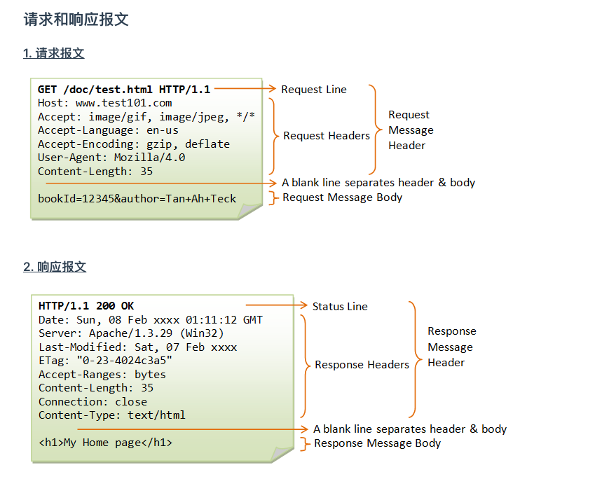

# Tomcat处理Http请求

[TOC]


## 简介

本文只分析http1.1的请求，tomcat版本：8.4.45

## Http请求响应报文



## 请求的处理链路

### 实例化Http11NioProtocol

根据server.xml中的`<connector/>`来实例化Http11NioProtocol

```html
<Connector port="8080" protocol="HTTP/1.1"
               connectionTimeout="20000"
               redirectPort="8443" />
```

- protocol是应用层协议名，可填参数有HTTP/1.1、org.apache.coyote.http11.Http11NioProtocol、AJP/1.3、org.apache.coyote.ajp.AjpNioProtocol，如果protocol不填，则默认为Http11NioProtocol。

实例化Http11NioProtocol

```java
public Http11NioProtocol() {
	super(new NioEndpoint());
}

public AbstractHttp11JsseProtocol(AbstractJsseEndpoint<S> endpoint) {
  super(endpoint);
}

public AbstractHttp11Protocol(AbstractEndpoint<S> endpoint) {
  super(endpoint);
  setConnectionTimeout(Constants.DEFAULT_CONNECTION_TIMEOUT);
  // 初始化ConnectionHandler, ConnectionHandler来获取Http11Processor
  ConnectionHandler<S> cHandler = new ConnectionHandler<>(this);
  setHandler(cHandler);
  getEndpoint().setHandler(cHandler);
}


```


### NioEndPoint获取到socket请求

Acceptor接收到请求封装成一个SocketProcessor扔进线程池Executor后，会调用Processor从操作系统底层读取、过滤字节流，对应用层协议（HTTP/AJP）进行解析封装，生成org.apache.coyote.Request和org.apache.coyote.Response对象。不同的协议有不同的Processor，HTTP/1.1对应Http11Processor，AJP对应AjpProcessor，HTTP/1.2对应StreamProcessor，UpgradeProcessorInternal 和 UpgradeProcessorExternal用于协议升级：

SocketProcessor并不是直接调用的Processor，而是通过org.apache.coyote.AbstractProtocol.ConnectionHandler#process找到一个合适的Processor进行请求处理：根据不同协议创建Http11Processor or AjpProcessor；

详见[系列二：tomcat的Reactor机制/http请求连接处理机制](docs/source-code-analysis/tomcat/tomcat的Reactor机制-http请求连接处理机制.md)


### 根据Http11NioProtocol得到Http11Processor

```java
protected Processor createProcessor() {
        Http11Processor processor = new Http11Processor(getMaxHttpHeaderSize(),
                getAllowHostHeaderMismatch(), getRejectIllegalHeaderName(), getEndpoint(),
                getMaxTrailerSize(), allowedTrailerHeaders, getMaxExtensionSize(),
                getMaxSwallowSize(), httpUpgradeProtocols, getSendReasonPhrase(),
                relaxedPathChars, relaxedQueryChars);
        processor.setAdapter(getAdapter());
        processor.setMaxKeepAliveRequests(getMaxKeepAliveRequests());
        processor.setConnectionUploadTimeout(getConnectionUploadTimeout());
        processor.setDisableUploadTimeout(getDisableUploadTimeout());
        processor.setCompressionMinSize(getCompressionMinSize());
        processor.setCompression(getCompression());
        processor.setNoCompressionUserAgents(getNoCompressionUserAgents());
        processor.setCompressibleMimeTypes(getCompressibleMimeTypes());
        processor.setRestrictedUserAgents(getRestrictedUserAgents());
        processor.setMaxSavePostSize(getMaxSavePostSize());
        processor.setServer(getServer());
        processor.setServerRemoveAppProvidedValues(getServerRemoveAppProvidedValues());
        return processor;
}
```

### Http11Processor处理Http请求

```java
public SocketState service(SocketWrapperBase<?> socketWrapper)
    throws IOException {
    RequestInfo rp = request.getRequestProcessor();
    rp.setStage(org.apache.coyote.Constants.STAGE_PARSE);

    // Setting up the I/O
    // 初始化 inputBuffer.byteBuffer
    // 初始化 outputBuffer
    setSocketWrapper(socketWrapper);

    // Flags
    // keepAlive表示客户端与服务端连接是长连接Keep-alive，就是说客户端socket连接到服务端之后，
    // 告诉服务端这个socket你别给我关了，要一直保持连接。
    keepAlive = true;
    openSocket = false;
    readComplete = true;
    boolean keptAlive = false;
    SendfileState sendfileState = SendfileState.DONE;

    while (!getErrorState().isError() && keepAlive && !isAsync() && upgradeToken == null &&
            sendfileState == SendfileState.DONE && !endpoint.isPaused()) {

        // Parsing the request header
        try {
            // 解析请求行
            if (!inputBuffer.parseRequestLine(keptAlive)) {
                if (inputBuffer.getParsingRequestLinePhase() == -1) {
                    return SocketState.UPGRADING;
                } else if (handleIncompleteRequestLineRead()) {
                    break;
                }
            }

            if (endpoint.isPaused()) {
                // 503 - Service unavailable
                response.setStatus(503);
                setErrorState(ErrorState.CLOSE_CLEAN, null);
            } else {
                keptAlive = true;
                // Set this every time in case limit has been changed via JMX
                request.getMimeHeaders().setLimit(endpoint.getMaxHeaderCount());
                // 解析请求头
                if (!inputBuffer.parseHeaders()) {
                    // We've read part of the request, don't recycle it
                    // instead associate it with the socket
                    openSocket = true;
                    readComplete = false;
                    break;
                }
                if (!disableUploadTimeout) {
                    socketWrapper.setReadTimeout(connectionUploadTimeout);
                }
            }
        } catch (IOException e) {
            if (log.isDebugEnabled()) {
                log.debug(sm.getString("http11processor.header.parse"), e);
            }
            setErrorState(ErrorState.CLOSE_CONNECTION_NOW, e);
            break;
        } catch (Throwable t) {
            ExceptionUtils.handleThrowable(t);
            UserDataHelper.Mode logMode = userDataHelper.getNextMode();
            if (logMode != null) {
                String message = sm.getString("http11processor.header.parse");
                switch (logMode) {
                    case INFO_THEN_DEBUG:
                        message += sm.getString("http11processor.fallToDebug");
                        //$FALL-THROUGH$
                    case INFO:
                        log.info(message, t);
                        break;
                    case DEBUG:
                        log.debug(message, t);
                }
            }
            // 400 - Bad Request
            response.setStatus(400);
            setErrorState(ErrorState.CLOSE_CLEAN, t);
        }

        // Has an upgrade been requested?
        Enumeration<String> connectionValues = request.getMimeHeaders().values("Connection");
        boolean foundUpgrade = false;
        while (connectionValues.hasMoreElements() && !foundUpgrade) {
            String connectionValue = connectionValues.nextElement();
            if (connectionValue != null) {
                foundUpgrade = connectionValue.toLowerCase(Locale.ENGLISH).contains("upgrade");
            }
        }

        if (foundUpgrade) {
            // Check the protocol
            String requestedProtocol = request.getHeader("Upgrade");

            UpgradeProtocol upgradeProtocol = httpUpgradeProtocols.get(requestedProtocol);
            if (upgradeProtocol != null) {
                if (upgradeProtocol.accept(request)) {
                    // TODO Figure out how to handle request bodies at this
                    // point.
                    response.setStatus(HttpServletResponse.SC_SWITCHING_PROTOCOLS);
                    response.setHeader("Connection", "Upgrade");
                    response.setHeader("Upgrade", requestedProtocol);
                    action(ActionCode.CLOSE,  null);
                    getAdapter().log(request, response, 0);

                    InternalHttpUpgradeHandler upgradeHandler =
                            upgradeProtocol.getInternalUpgradeHandler(
                                    getAdapter(), cloneRequest(request));
                    UpgradeToken upgradeToken = new UpgradeToken(upgradeHandler, null, null);
                    action(ActionCode.UPGRADE, upgradeToken);
                    return SocketState.UPGRADING;
                }
            }
        }

        if (getErrorState().isIoAllowed()) {
            // Setting up filters, and parse some request headers
            rp.setStage(org.apache.coyote.Constants.STAGE_PREPARE);
            try {
                // 设置ActiveFilter, 根据contextLength来选择InputFilter, 来解决拆包以及粘包问题
                prepareRequest();
            } catch (Throwable t) {
                ExceptionUtils.handleThrowable(t);
                if (log.isDebugEnabled()) {
                    log.debug(sm.getString("http11processor.request.prepare"), t);
                }
                // 500 - Internal Server Error
                response.setStatus(500);
                setErrorState(ErrorState.CLOSE_CLEAN, t);
            }
        }

        if (maxKeepAliveRequests == 1) {
            keepAlive = false;
        } else if (maxKeepAliveRequests > 0 &&
                socketWrapper.decrementKeepAlive() <= 0) {
            keepAlive = false;
        }

        // Process the request in the adapter
        if (getErrorState().isIoAllowed()) {
            try {
                rp.setStage(org.apache.coyote.Constants.STAGE_SERVICE);
                getAdapter().service(request, response);
                // Handle when the response was committed before a serious
                // error occurred.  Throwing a ServletException should both
                // set the status to 500 and set the errorException.
                // If we fail here, then the response is likely already
                // committed, so we can't try and set headers.
                if(keepAlive && !getErrorState().isError() && !isAsync() &&
                        statusDropsConnection(response.getStatus())) {
                    setErrorState(ErrorState.CLOSE_CLEAN, null);
                }
            } catch (InterruptedIOException e) {
                setErrorState(ErrorState.CLOSE_CONNECTION_NOW, e);
            } catch (HeadersTooLargeException e) {
                log.error(sm.getString("http11processor.request.process"), e);
                // The response should not have been committed but check it
                // anyway to be safe
                if (response.isCommitted()) {
                    setErrorState(ErrorState.CLOSE_NOW, e);
                } else {
                    response.reset();
                    response.setStatus(500);
                    setErrorState(ErrorState.CLOSE_CLEAN, e);
                    response.setHeader("Connection", "close"); // TODO: Remove
                }
            } catch (Throwable t) {
                ExceptionUtils.handleThrowable(t);
                log.error(sm.getString("http11processor.request.process"), t);
                // 500 - Internal Server Error
                response.setStatus(500);
                setErrorState(ErrorState.CLOSE_CLEAN, t);
                getAdapter().log(request, response, 0);
            }
        }

        // Finish the handling of the request
        rp.setStage(org.apache.coyote.Constants.STAGE_ENDINPUT);
        if (!isAsync()) {
            // If this is an async request then the request ends when it has
            // been completed. The AsyncContext is responsible for calling
            // endRequest() in that case.
            // 重置inputBuffer的ByteBuffer的position防止粘包
            endRequest();
        }
        rp.setStage(org.apache.coyote.Constants.STAGE_ENDOUTPUT);

        // If there was an error, make sure the request is counted as
        // and error, and update the statistics counter
        if (getErrorState().isError()) {
            response.setStatus(500);
        }

        if (!isAsync() || getErrorState().isError()) {
            request.updateCounters();
            if (getErrorState().isIoAllowed()) {
                // 重置 inputBuffer.byteBuffer.position 的来准备读
                inputBuffer.nextRequest();
                outputBuffer.nextRequest();
            }
        }

        if (!disableUploadTimeout) {
            int soTimeout = endpoint.getConnectionTimeout();
            if(soTimeout > 0) {
                socketWrapper.setReadTimeout(soTimeout);
            } else {
                socketWrapper.setReadTimeout(0);
            }
        }

        rp.setStage(org.apache.coyote.Constants.STAGE_KEEPALIVE);

        sendfileState = processSendfile(socketWrapper);
    }

    rp.setStage(org.apache.coyote.Constants.STAGE_ENDED);

    if (getErrorState().isError() || endpoint.isPaused()) {
        return SocketState.CLOSED;
    } else if (isAsync()) {
        return SocketState.LONG;
    } else if (isUpgrade()) {
        return SocketState.UPGRADING;
    } else {
        if (sendfileState == SendfileState.PENDING) {
            return SocketState.SENDFILE;
        } else {
            if (openSocket) {
                if (readComplete) {
                    return SocketState.OPEN;
                } else {
                    return SocketState.LONG;
                }
            } else {
                return SocketState.CLOSED;
            }
        }
    }
}
```

#### 初始化inputBuffer以及outputBuffer

```java
protected final void setSocketWrapper(SocketWrapperBase<?> socketWrapper) {
    super.setSocketWrapper(socketWrapper);
    inputBuffer.init(socketWrapper);
    outputBuffer.init(socketWrapper);
}
```

**org.apache.coyote.http11.Http11InputBuffer#init**

```java
void init(SocketWrapperBase<?> socketWrapper) {

  wrapper = socketWrapper;
  wrapper.setAppReadBufHandler(this);

  int bufLength = headerBufferSize +
    wrapper.getSocketBufferHandler().getReadBuffer().capacity();
  if (byteBuffer == null || byteBuffer.capacity() < bufLength) {
    byteBuffer = ByteBuffer.allocate(bufLength);
    byteBuffer.position(0).limit(0);
  }
}
```

**org.apache.coyote.http11.Http11OutputBuffer#init**

```java
public void init(SocketWrapperBase<?> socketWrapper) {
    this.socketWrapper = socketWrapper;
}
```

#### inputBuffer解析Http请求行

```java
boolean parseRequestLine(boolean keptAlive) throws IOException {

    // check state
    if (!parsingRequestLine) {
        return true;
    }
    //
    // Skipping blank lines
    //
    if (parsingRequestLinePhase < 2) {
        byte chr = 0;
        // 过滤掉回车换行符
        do {

            // Read new bytes if needed
            if (byteBuffer.position() >= byteBuffer.limit()) {
                if (keptAlive) {
                    // Haven't read any request data yet so use the keep-alive
                    // timeout.
                    wrapper.setReadTimeout(wrapper.getEndpoint().getKeepAliveTimeout());
                }
                // 从操作系统的输入缓冲区读取数据
                if (!fill(false)) {
                    // A read is pending, so no longer in initial state
                    parsingRequestLinePhase = 1;
                    return false;
                }
                // At least one byte of the request has been received.
                // Switch to the socket timeout.
                wrapper.setReadTimeout(wrapper.getEndpoint().getConnectionTimeout());
            }
            if (!keptAlive && byteBuffer.position() == 0 && byteBuffer.limit() >= CLIENT_PREFACE_START.length - 1) {
                boolean prefaceMatch = true;
                for (int i = 0; i < CLIENT_PREFACE_START.length && prefaceMatch; i++) {
                    if (CLIENT_PREFACE_START[i] != byteBuffer.get(i)) {
                        prefaceMatch = false;
                    }
                }
                if (prefaceMatch) {
                    // HTTP/2 preface matched
                    parsingRequestLinePhase = -1;
                    return false;
                }
            }
            // Set the start time once we start reading data (even if it is
            // just skipping blank lines)
            if (request.getStartTime() < 0) {
                request.setStartTime(System.currentTimeMillis());
            }
            chr = byteBuffer.get();
        } while ((chr == Constants.CR) || (chr == Constants.LF));
        byteBuffer.position(byteBuffer.position() - 1);

        parsingRequestLineStart = byteBuffer.position();
        parsingRequestLinePhase = 2;
        if (log.isDebugEnabled()) {
            log.debug("Received ["
                    + new String(byteBuffer.array(), byteBuffer.position(), byteBuffer.remaining(), StandardCharsets.ISO_8859_1) + "]");
        }
    }
    // 此时回车换行已经过滤掉, 并从操作系统的输入缓冲区读取数据到byteBuffer中,
    // 可能byteBuffer中的数据不全或者是下次请求的数据, 即要考虑拆包和粘包
    if (parsingRequestLinePhase == 2) {
        //
        // Reading the method name
        // Method name is a token
        //
        boolean space = false;
        while (!space) {
            // Read new bytes if needed
            // 解决拆包问题, 再次读取操作系统输入缓冲区
            if (byteBuffer.position() >= byteBuffer.limit()) {
                if (!fill(false)) // request line parsing
                    return false;
            }
            // Spec says method name is a token followed by a single SP but
            // also be tolerant of multiple SP and/or HT.
            int pos = byteBuffer.position();
            // 一个字符一个字符的读, 解决拆包问题
            byte chr = byteBuffer.get();
            if (chr == Constants.SP || chr == Constants.HT) {
                space = true;
                // 设置请求的方法
                request.method().setBytes(byteBuffer.array(), parsingRequestLineStart,
                        pos - parsingRequestLineStart);
            } else if (!HttpParser.isToken(chr)) {
                byteBuffer.position(byteBuffer.position() - 1);
                // Avoid unknown protocol triggering an additional error
                request.protocol().setString(Constants.HTTP_11);
                throw new IllegalArgumentException(sm.getString("iib.invalidmethod"));
            }
        }
        parsingRequestLinePhase = 3;
    }
    // 过滤掉空格
    if (parsingRequestLinePhase == 3) {
        // Spec says single SP but also be tolerant of multiple SP and/or HT
        boolean space = true;
        while (space) {
            // Read new bytes if needed
            if (byteBuffer.position() >= byteBuffer.limit()) {
                if (!fill(false)) // request line parsing
                    return false;
            }
            byte chr = byteBuffer.get();
            if (!(chr == Constants.SP || chr == Constants.HT)) {
                space = false;
                byteBuffer.position(byteBuffer.position() - 1);
            }
        }
        parsingRequestLineStart = byteBuffer.position();
        parsingRequestLinePhase = 4;
    }
    // 解决使用的requestURI
    if (parsingRequestLinePhase == 4) {
        // Mark the current buffer position

        int end = 0;
        //
        // Reading the URI
        //
        boolean space = false;
        while (!space) {
            // Read new bytes if needed
            // 解决拆包问题, 再次读取操作系统输入缓冲区
            if (byteBuffer.position() >= byteBuffer.limit()) {
                if (!fill(false)) // request line parsing
                    return false;
            }
            int pos = byteBuffer.position();
            // 一个字符一个字符的读, 解决拆包问题
            byte chr = byteBuffer.get();
            if (chr == Constants.SP || chr == Constants.HT) {
                space = true;
                end = pos;
            } else if (chr == Constants.CR || chr == Constants.LF) {
                // HTTP/0.9 style request
                parsingRequestLineEol = true;
                space = true;
                end = pos;
            } else if (chr == Constants.QUESTION && parsingRequestLineQPos == -1) {
                parsingRequestLineQPos = pos;
            } else if (parsingRequestLineQPos != -1 && !httpParser.isQueryRelaxed(chr)) {
                // Avoid unknown protocol triggering an additional error
                request.protocol().setString(Constants.HTTP_11);
                // %nn decoding will be checked at the point of decoding
                throw new IllegalArgumentException(sm.getString("iib.invalidRequestTarget"));
            } else if (httpParser.isNotRequestTargetRelaxed(chr)) {
                // Avoid unknown protocol triggering an additional error
                request.protocol().setString(Constants.HTTP_11);
                // This is a general check that aims to catch problems early
                // Detailed checking of each part of the request target will
                // happen in Http11Processor#prepareRequest()
                throw new IllegalArgumentException(sm.getString("iib.invalidRequestTarget"));
            }
        }
        if (parsingRequestLineQPos >= 0) {
            // 设置请求行中的查询参数
            request.queryString().setBytes(byteBuffer.array(), parsingRequestLineQPos + 1,
                    end - parsingRequestLineQPos - 1);
            // 设置请求行中的requestURI: 路径参数
            request.requestURI().setBytes(byteBuffer.array(), parsingRequestLineStart,
                    parsingRequestLineQPos - parsingRequestLineStart);
        } else {
            // 设置请求行中的requestURI: 路径参数
            request.requestURI().setBytes(byteBuffer.array(), parsingRequestLineStart,
                    end - parsingRequestLineStart);
        }
        parsingRequestLinePhase = 5;
    }
    // 过滤掉空格符
    if (parsingRequestLinePhase == 5) {
        // Spec says single SP but also be tolerant of multiple and/or HT
        boolean space = true;
        while (space) {
            // Read new bytes if needed
            if (byteBuffer.position() >= byteBuffer.limit()) {
                if (!fill(false)) // request line parsing
                    return false;
            }
            byte chr = byteBuffer.get();
            if (!(chr == Constants.SP || chr == Constants.HT)) {
                space = false;
                byteBuffer.position(byteBuffer.position() - 1);
            }
        }
        parsingRequestLineStart = byteBuffer.position();
        parsingRequestLinePhase = 6;

        // Mark the current buffer position
        end = 0;
    }
    // 解决使用的协议
    if (parsingRequestLinePhase == 6) {
        //
        // Reading the protocol
        // Protocol is always "HTTP/" DIGIT "." DIGIT
        //
        while (!parsingRequestLineEol) {
            // Read new bytes if needed
            // 解决拆包问题, 再次读取操作系统输入缓冲区
            if (byteBuffer.position() >= byteBuffer.limit()) {
                if (!fill(false)) // request line parsing
                    return false;
            }

            int pos = byteBuffer.position();
            // 一个字符一个字符的读, 解决拆包问题
            byte chr = byteBuffer.get();
            if (chr == Constants.CR) {
                end = pos;
            } else if (chr == Constants.LF) {
                if (end == 0) {
                    end = pos;
                }
                parsingRequestLineEol = true;
            } else if (!HttpParser.isHttpProtocol(chr)) {
                throw new IllegalArgumentException(sm.getString("iib.invalidHttpProtocol"));
            }
        }

        if ((end - parsingRequestLineStart) > 0) {
            request.protocol().setBytes(byteBuffer.array(), parsingRequestLineStart,
                    end - parsingRequestLineStart);
        } else {
            request.protocol().setString("");
        }
        parsingRequestLine = false;
        parsingRequestLinePhase = 0;
        parsingRequestLineEol = false;
        parsingRequestLineStart = 0;
        return true;
    }
    throw new IllegalStateException(
            "Invalid request line parse phase:" + parsingRequestLinePhase);
}
```

#### inputBuffer解析Http请求头

```java
boolean parseHeaders() throws IOException {
    if (!parsingHeader) {
        throw new IllegalStateException(sm.getString("iib.parseheaders.ise.error"));
    }

    HeaderParseStatus status = HeaderParseStatus.HAVE_MORE_HEADERS;

    do {
        // 解析请求头, 一行一行的解析
        status = parseHeader();
        // Checking that
        // (1) Headers plus request line size does not exceed its limit
        // (2) There are enough bytes to avoid expanding the buffer when
        // reading body
        // Technically, (2) is technical limitation, (1) is logical
        // limitation to enforce the meaning of headerBufferSize
        // From the way how buf is allocated and how blank lines are being
        // read, it should be enough to check (1) only.
        if (byteBuffer.position() > headerBufferSize || byteBuffer.capacity() - byteBuffer.position() < socketReadBufferSize) {
            throw new IllegalArgumentException(sm.getString("iib.requestheadertoolarge.error"));
        }
    } while (status == HeaderParseStatus.HAVE_MORE_HEADERS);
    if (status == HeaderParseStatus.DONE) {
        parsingHeader = false;
        end = byteBuffer.position();
        return true;
    } else {
        return false;
    }
}
```

```java
private HeaderParseStatus parseHeader() throws IOException {

    //
    // Check for blank line
    //

    byte chr = 0;
    while (headerParsePos == HeaderParsePosition.HEADER_START) {

        // Read new bytes if needed
        if (byteBuffer.position() >= byteBuffer.limit()) {
            if (!fill(false)) {// parse header
                headerParsePos = HeaderParsePosition.HEADER_START;
                return HeaderParseStatus.NEED_MORE_DATA;
            }
        }

        chr = byteBuffer.get();

        if (chr == Constants.CR) {
            // Skip
        } else if (chr == Constants.LF) {
            // 联系遇到2个换行符, 请求头解析完毕
            return HeaderParseStatus.DONE;
        } else {
            byteBuffer.position(byteBuffer.position() - 1);
            break;
        }

    }

    if (headerParsePos == HeaderParsePosition.HEADER_START) {
        // Mark the current buffer position
        headerData.start = byteBuffer.position();
        headerParsePos = HeaderParsePosition.HEADER_NAME;
    }

    //
    // Reading the header name
    // Header name is always US-ASCII
    //

    while (headerParsePos == HeaderParsePosition.HEADER_NAME) {

        // Read new bytes if needed
        // 解决拆包问题, 再次读取操作系统输入缓冲区
        if (byteBuffer.position() >= byteBuffer.limit()) {
            if (!fill(false)) { // parse header
                return HeaderParseStatus.NEED_MORE_DATA;
            }
        }

        int pos = byteBuffer.position();
        // 一个字符一个字符的读, 解决拆包问题
        chr = byteBuffer.get();
        // 解析 header 的 key
        if (chr == Constants.COLON) {
            headerParsePos = HeaderParsePosition.HEADER_VALUE_START;
            // 添加 key
            headerData.headerValue = headers.addValue(byteBuffer.array(), headerData.start,
                    pos - headerData.start);
            pos = byteBuffer.position();
            // Mark the current buffer position
            headerData.start = pos;
            headerData.realPos = pos;
            headerData.lastSignificantChar = pos;
            break;
        } else if (!HttpParser.isToken(chr)) {
            // Non-token characters are illegal in header names
            // Parsing continues so the error can be reported in context
            headerData.lastSignificantChar = pos;
            byteBuffer.position(byteBuffer.position() - 1);
            // skipLine() will handle the error
            return skipLine();
        }

        // chr is next byte of header name. Convert to lowercase.
        if ((chr >= Constants.A) && (chr <= Constants.Z)) {
            byteBuffer.put(pos, (byte) (chr - Constants.LC_OFFSET));
        }
    }

    // Skip the line and ignore the header
    if (headerParsePos == HeaderParsePosition.HEADER_SKIPLINE) {
        return skipLine();
    }

    //
    // Reading the header value (which can be spanned over multiple lines)
    //

    while (headerParsePos == HeaderParsePosition.HEADER_VALUE_START ||
           headerParsePos == HeaderParsePosition.HEADER_VALUE ||
           headerParsePos == HeaderParsePosition.HEADER_MULTI_LINE) {

        // 过滤掉空格
        if (headerParsePos == HeaderParsePosition.HEADER_VALUE_START) {
            // Skipping spaces
            while (true) {
                // Read new bytes if needed
                // 解决拆包问题, 再次读取操作系统输入缓冲区
                if (byteBuffer.position() >= byteBuffer.limit()) {
                    if (!fill(false)) {// parse header
                        // HEADER_VALUE_START
                        return HeaderParseStatus.NEED_MORE_DATA;
                    }
                }
                // 一个字符一个字符的读, 解决拆包问题
                chr = byteBuffer.get();
                if (!(chr == Constants.SP || chr == Constants.HT)) {
                    headerParsePos = HeaderParsePosition.HEADER_VALUE;
                    byteBuffer.position(byteBuffer.position() - 1);
                    break;
                }
            }
        }
        if (headerParsePos == HeaderParsePosition.HEADER_VALUE) {

            // Reading bytes until the end of the line
            boolean eol = false;
            while (!eol) {

                // Read new bytes if needed
                // 解决拆包问题, 再次读取操作系统输入缓冲区
                if (byteBuffer.position() >= byteBuffer.limit()) {
                    if (!fill(false)) {// parse header
                        // HEADER_VALUE
                        return HeaderParseStatus.NEED_MORE_DATA;
                    }
                }
                // 一个字符一个字符的读, 解决拆包问题
                chr = byteBuffer.get();
                if (chr == Constants.CR) {
                    // Skip
                } else if (chr == Constants.LF) {
                    // 本请求头行结束
                    eol = true;
                } else if (chr == Constants.SP || chr == Constants.HT) {
                    byteBuffer.put(headerData.realPos, chr);
                    headerData.realPos++;
                } else {
                    byteBuffer.put(headerData.realPos, chr);
                    headerData.realPos++;
                    headerData.lastSignificantChar = headerData.realPos;
                }
            }

            // Ignore whitespaces at the end of the line
            headerData.realPos = headerData.lastSignificantChar;

            // Checking the first character of the new line. If the character
            // is a LWS, then it's a multiline header
            headerParsePos = HeaderParsePosition.HEADER_MULTI_LINE;
        }
        // Read new bytes if needed
        // 再次读取数据防止没有读到数据
        if (byteBuffer.position() >= byteBuffer.limit()) {
            if (!fill(false)) {// parse header
                // HEADER_MULTI_LINE
                return HeaderParseStatus.NEED_MORE_DATA;
            }
        }

        chr = byteBuffer.get(byteBuffer.position());
        if (headerParsePos == HeaderParsePosition.HEADER_MULTI_LINE) {
            if ((chr != Constants.SP) && (chr != Constants.HT)) {
                headerParsePos = HeaderParsePosition.HEADER_START;
                break;
            } else {
                // Copying one extra space in the buffer (since there must
                // be at least one space inserted between the lines)
                byteBuffer.put(headerData.realPos, chr);
                headerData.realPos++;
                headerParsePos = HeaderParsePosition.HEADER_VALUE_START;
            }
        }
    }
    // Set the header value
    // 设置请求头的 value
    headerData.headerValue.setBytes(byteBuffer.array(), headerData.start,
            headerData.lastSignificantChar - headerData.start);
    headerData.recycle();
    return HeaderParseStatus.HAVE_MORE_HEADERS;
}
```

#### CoyoteAdapter#service处理请求

```java
public void service(org.apache.coyote.Request req, org.apache.coyote.Response res)
        throws Exception {

    Request request = (Request) req.getNote(ADAPTER_NOTES);
    Response response = (Response) res.getNote(ADAPTER_NOTES);

    if (request == null) {
        // Create objects
        request = connector.createRequest();
        request.setCoyoteRequest(req);
        response = connector.createResponse();
        response.setCoyoteResponse(res);

        // Link objects
        request.setResponse(response);
        response.setRequest(request);

        // Set as notes
        req.setNote(ADAPTER_NOTES, request);
        res.setNote(ADAPTER_NOTES, response);

        // Set query string encoding
        req.getParameters().setQueryStringCharset(connector.getURICharset());
    }

    if (connector.getXpoweredBy()) {
        response.addHeader("X-Powered-By", POWERED_BY);
    }

    boolean async = false;
    boolean postParseSuccess = false;

    req.getRequestProcessor().setWorkerThreadName(THREAD_NAME.get());

    try {
        // Parse and set Catalina and configuration specific
        // request parameters
        // 底层适配类CoyoteAdapter解析底层(coyote包下)req、res，并配置Catalina和应用层request、response的属性值
        postParseSuccess = postParseRequest(req, request, res, response);
        if (postParseSuccess) {
            //check valves if we support async
            request.setAsyncSupported(
                    connector.getService().getContainer().getPipeline().isAsyncSupported());
            // Calling the container
            connector.getService().getContainer().getPipeline().getFirst().invoke(
                    request, response);
        }
        if (request.isAsync()) {
            async = true;
            ReadListener readListener = req.getReadListener();
            if (readListener != null && request.isFinished()) {
                // Possible the all data may have been read during service()
                // method so this needs to be checked here
                ClassLoader oldCL = null;
                try {
                    oldCL = request.getContext().bind(false, null);
                    if (req.sendAllDataReadEvent()) {
                        req.getReadListener().onAllDataRead();
                    }
                } finally {
                    request.getContext().unbind(false, oldCL);
                }
            }

            Throwable throwable =
                    (Throwable) request.getAttribute(RequestDispatcher.ERROR_EXCEPTION);

            // If an async request was started, is not going to end once
            // this container thread finishes and an error occurred, trigger
            // the async error process
            if (!request.isAsyncCompleting() && throwable != null) {
                request.getAsyncContextInternal().setErrorState(throwable, true);
            }
        } else {
            request.finishRequest();
            response.finishResponse();
        }

    } catch (IOException e) {
        // Ignore
    } finally {
        AtomicBoolean error = new AtomicBoolean(false);
        res.action(ActionCode.IS_ERROR, error);

        if (request.isAsyncCompleting() && error.get()) {
            // Connection will be forcibly closed which will prevent
            // completion happening at the usual point. Need to trigger
            // call to onComplete() here.
            res.action(ActionCode.ASYNC_POST_PROCESS,  null);
            async = false;
        }

        // Access log
        if (!async && postParseSuccess) {
            // Log only if processing was invoked.
            // If postParseRequest() failed, it has already logged it.
            Context context = request.getContext();
            Host host = request.getHost();
            // If the context is null, it is likely that the endpoint was
            // shutdown, this connection closed and the request recycled in
            // a different thread. That thread will have updated the access
            // log so it is OK not to update the access log here in that
            // case.
            // The other possibility is that an error occurred early in
            // processing and the request could not be mapped to a Context.
            // Log via the host or engine in that case.
            long time = System.currentTimeMillis() - req.getStartTime();
            if (context != null) {
                context.logAccess(request, response, time, false);
            } else if (response.isError()) {
                if (host != null) {
                    host.logAccess(request, response, time, false);
                } else {
                    connector.getService().getContainer().logAccess(
                            request, response, time, false);
                }
            }
        }

        req.getRequestProcessor().setWorkerThreadName(null);

        // Recycle the wrapper request and response
        if (!async) {
            updateWrapperErrorCount(request, response);
            request.recycle();
            response.recycle();
        }
    }
}
```

##### 调用Container的Valve来处理请求

```java
postParseSuccess = postParseRequest(req, request, res, response);
if (postParseSuccess) {
    //check valves if we support async
    request.setAsyncSupported(
            connector.getService().getContainer().getPipeline().isAsyncSupported());
    // Calling the container
    connector.getService().getContainer().getPipeline().getFirst().invoke(
            request, response);
}
```

###### 调用StandardWrapperValve的invoke方法真正执行filter以及servlet里面的逻辑

```java
public final void invoke(Request request, Response response)
    throws IOException, ServletException {

    // Initialize local variables we may need
    boolean unavailable = false;
    Throwable throwable = null;
    // This should be a Request attribute...
    long t1=System.currentTimeMillis();
    requestCount.incrementAndGet();
    StandardWrapper wrapper = (StandardWrapper) getContainer();
    Servlet servlet = null;
    Context context = (Context) wrapper.getParent();

    // Check for the application being marked unavailable
    if (!context.getState().isAvailable()) {
        response.sendError(HttpServletResponse.SC_SERVICE_UNAVAILABLE,
                       sm.getString("standardContext.isUnavailable"));
        unavailable = true;
    }

    // Check for the servlet being marked unavailable
    if (!unavailable && wrapper.isUnavailable()) {
        container.getLogger().info(sm.getString("standardWrapper.isUnavailable",
                wrapper.getName()));
        long available = wrapper.getAvailable();
        if ((available > 0L) && (available < Long.MAX_VALUE)) {
            response.setDateHeader("Retry-After", available);
            response.sendError(HttpServletResponse.SC_SERVICE_UNAVAILABLE,
                    sm.getString("standardWrapper.isUnavailable",
                            wrapper.getName()));
        } else if (available == Long.MAX_VALUE) {
            response.sendError(HttpServletResponse.SC_NOT_FOUND,
                    sm.getString("standardWrapper.notFound",
                            wrapper.getName()));
        }
        unavailable = true;
    }

    // Allocate a servlet instance to process this request
    try {
        if (!unavailable) {
            // 访问web应用而第一次调用该Servlet时再加载并初始化Servlet。
            servlet = wrapper.allocate();
        }
    } catch (UnavailableException e) {
        container.getLogger().error(
                sm.getString("standardWrapper.allocateException",
                        wrapper.getName()), e);
        long available = wrapper.getAvailable();
        if ((available > 0L) && (available < Long.MAX_VALUE)) {
            response.setDateHeader("Retry-After", available);
            response.sendError(HttpServletResponse.SC_SERVICE_UNAVAILABLE,
                       sm.getString("standardWrapper.isUnavailable",
                                    wrapper.getName()));
        } else if (available == Long.MAX_VALUE) {
            response.sendError(HttpServletResponse.SC_NOT_FOUND,
                       sm.getString("standardWrapper.notFound",
                                    wrapper.getName()));
        }
    } catch (ServletException e) {
        container.getLogger().error(sm.getString("standardWrapper.allocateException",
                         wrapper.getName()), StandardWrapper.getRootCause(e));
        throwable = e;
        exception(request, response, e);
    } catch (Throwable e) {
        ExceptionUtils.handleThrowable(e);
        container.getLogger().error(sm.getString("standardWrapper.allocateException",
                         wrapper.getName()), e);
        throwable = e;
        exception(request, response, e);
        servlet = null;
    }

    MessageBytes requestPathMB = request.getRequestPathMB();
    DispatcherType dispatcherType = DispatcherType.REQUEST;
    if (request.getDispatcherType()==DispatcherType.ASYNC) dispatcherType = DispatcherType.ASYNC;
    request.setAttribute(Globals.DISPATCHER_TYPE_ATTR,dispatcherType);
    request.setAttribute(Globals.DISPATCHER_REQUEST_PATH_ATTR,
            requestPathMB);
    // Create the filter chain for this request
    // 含有Servlet以及ApplicationFilterConfig[] filters
    ApplicationFilterChain filterChain =
            ApplicationFilterFactory.createFilterChain(request, wrapper, servlet);

    // Call the filter chain for this request
    // NOTE: This also calls the servlet's service() method
    try {
        if ((servlet != null) && (filterChain != null)) {
            // Swallow output if needed
            if (context.getSwallowOutput()) {
                try {
                    SystemLogHandler.startCapture();
                    if (request.isAsyncDispatching()) {
                        request.getAsyncContextInternal().doInternalDispatch();
                    } else {
                        // 执行过滤器链中的各个过滤器的doFilter方法,
                        // 一般的过滤器实现中在最后都会有这一句：FilterChain.doFilter(request, response);来实现递归调用
                        filterChain.doFilter(request.getRequest(),
                                response.getResponse());
                    }
                } finally {
                    String log = SystemLogHandler.stopCapture();
                    if (log != null && log.length() > 0) {
                        context.getLogger().info(log);
                    }
                }
            } else {
                if (request.isAsyncDispatching()) {
                    request.getAsyncContextInternal().doInternalDispatch();
                } else {
                    filterChain.doFilter
                        (request.getRequest(), response.getResponse());
                }
            }

        }
    } catch (ClientAbortException | CloseNowException e) {
        if (container.getLogger().isDebugEnabled()) {
            container.getLogger().debug(sm.getString(
                    "standardWrapper.serviceException", wrapper.getName(),
                    context.getName()), e);
        }
        throwable = e;
        exception(request, response, e);
    } catch (IOException e) {
        container.getLogger().error(sm.getString(
                "standardWrapper.serviceException", wrapper.getName(),
                context.getName()), e);
        throwable = e;
        exception(request, response, e);
    } catch (UnavailableException e) {
        container.getLogger().error(sm.getString(
                "standardWrapper.serviceException", wrapper.getName(),
                context.getName()), e);
        //            throwable = e;
        //            exception(request, response, e);
        wrapper.unavailable(e);
        long available = wrapper.getAvailable();
        if ((available > 0L) && (available < Long.MAX_VALUE)) {
            response.setDateHeader("Retry-After", available);
            response.sendError(HttpServletResponse.SC_SERVICE_UNAVAILABLE,
                       sm.getString("standardWrapper.isUnavailable",
                                    wrapper.getName()));
        } else if (available == Long.MAX_VALUE) {
            response.sendError(HttpServletResponse.SC_NOT_FOUND,
                        sm.getString("standardWrapper.notFound",
                                    wrapper.getName()));
        }
        // Do not save exception in 'throwable', because we
        // do not want to do exception(request, response, e) processing
    } catch (ServletException e) {
        Throwable rootCause = StandardWrapper.getRootCause(e);
        if (!(rootCause instanceof ClientAbortException)) {
            container.getLogger().error(sm.getString(
                    "standardWrapper.serviceExceptionRoot",
                    wrapper.getName(), context.getName(), e.getMessage()),
                    rootCause);
        }
        throwable = e;
        exception(request, response, e);
    } catch (Throwable e) {
        ExceptionUtils.handleThrowable(e);
        container.getLogger().error(sm.getString(
                "standardWrapper.serviceException", wrapper.getName(),
                context.getName()), e);
        throwable = e;
        exception(request, response, e);
    }

    // Release the filter chain (if any) for this request
    if (filterChain != null) {
        filterChain.release();
    }

    // Deallocate the allocated servlet instance
    try {
        if (servlet != null) {
            wrapper.deallocate(servlet);
        }
    } catch (Throwable e) {
        ExceptionUtils.handleThrowable(e);
        container.getLogger().error(sm.getString("standardWrapper.deallocateException",
                         wrapper.getName()), e);
        if (throwable == null) {
            throwable = e;
            exception(request, response, e);
        }
    }

    // If this servlet has been marked permanently unavailable,
    // unload it and release this instance
    try {
        if ((servlet != null) &&
            (wrapper.getAvailable() == Long.MAX_VALUE)) {
            wrapper.unload();
        }
    } catch (Throwable e) {
        ExceptionUtils.handleThrowable(e);
        container.getLogger().error(sm.getString("standardWrapper.unloadException",
                         wrapper.getName()), e);
        if (throwable == null) {
            throwable = e;
            exception(request, response, e);
        }
    }
    long t2=System.currentTimeMillis();

    long time=t2-t1;
    processingTime += time;
    if( time > maxTime) maxTime=time;
    if( time < minTime) minTime=time;

}
```

**org.apache.catalina.core.ApplicationFilterChain#doFilter**

```java
public void doFilter(ServletRequest request, ServletResponse response)
    throws IOException, ServletException {

    if( Globals.IS_SECURITY_ENABLED ) {
        final ServletRequest req = request;
        final ServletResponse res = response;
        try {
            java.security.AccessController.doPrivileged(
                new java.security.PrivilegedExceptionAction<Void>() {
                    @Override
                    public Void run()
                        throws ServletException, IOException {
                        internalDoFilter(req,res);
                        return null;
                    }
                }
            );
        } catch( PrivilegedActionException pe) {
            Exception e = pe.getException();
            if (e instanceof ServletException)
                throw (ServletException) e;
            else if (e instanceof IOException)
                throw (IOException) e;
            else if (e instanceof RuntimeException)
                throw (RuntimeException) e;
            else
                throw new ServletException(e.getMessage(), e);
        }
    } else {
        internalDoFilter(request,response);
    }
}
```

**org.apache.catalina.core.ApplicationFilterChain#internalDoFilter**

```java
private void internalDoFilter(ServletRequest request,
                              ServletResponse response)
    throws IOException, ServletException {

    // Call the next filter if there is one
    // 执行过滤器链中的各个过滤器的doFilter方法
    if (pos < n) {
        ApplicationFilterConfig filterConfig = filters[pos++];
        try {
            Filter filter = filterConfig.getFilter();

            if (request.isAsyncSupported() && "false".equalsIgnoreCase(
                    filterConfig.getFilterDef().getAsyncSupported())) {
                request.setAttribute(Globals.ASYNC_SUPPORTED_ATTR, Boolean.FALSE);
            }
            if( Globals.IS_SECURITY_ENABLED ) {
                final ServletRequest req = request;
                final ServletResponse res = response;
                Principal principal =
                    ((HttpServletRequest) req).getUserPrincipal();

                Object[] args = new Object[]{req, res, this};
                SecurityUtil.doAsPrivilege ("doFilter", filter, classType, args, principal);
            } else {
                filter.doFilter(request, response, this);
            }
        } catch (IOException | ServletException | RuntimeException e) {
            throw e;
        } catch (Throwable e) {
            e = ExceptionUtils.unwrapInvocationTargetException(e);
            ExceptionUtils.handleThrowable(e);
            throw new ServletException(sm.getString("filterChain.filter"), e);
        }
        return;
    }

    // We fell off the end of the chain -- call the servlet instance
    try {
        if (ApplicationDispatcher.WRAP_SAME_OBJECT) {
            lastServicedRequest.set(request);
            lastServicedResponse.set(response);
        }

        if (request.isAsyncSupported() && !servletSupportsAsync) {
            request.setAttribute(Globals.ASYNC_SUPPORTED_ATTR,
                    Boolean.FALSE);
        }
        // Use potentially wrapped request from this point
        if ((request instanceof HttpServletRequest) &&
                (response instanceof HttpServletResponse) &&
                Globals.IS_SECURITY_ENABLED ) {
            final ServletRequest req = request;
            final ServletResponse res = response;
            Principal principal =
                ((HttpServletRequest) req).getUserPrincipal();
            Object[] args = new Object[]{req, res};
            SecurityUtil.doAsPrivilege("service",
                                       servlet,
                                       classTypeUsedInService,
                                       args,
                                       principal);
        } else {
            // 执行 servlet.service
            servlet.service(request, response);
        }
    } catch (IOException | ServletException | RuntimeException e) {
        throw e;
    } catch (Throwable e) {
        e = ExceptionUtils.unwrapInvocationTargetException(e);
        ExceptionUtils.handleThrowable(e);
        throw new ServletException(sm.getString("filterChain.servlet"), e);
    } finally {
        if (ApplicationDispatcher.WRAP_SAME_OBJECT) {
            lastServicedRequest.set(null);
            lastServicedResponse.set(null);
        }
    }
}
```

#### 解析请求体（延迟解析）

**我们在第一次调用getParameter(String name ) 或者和parameter 相关的方法时，或者调用getInputStream()方法时会用这个activeFilter 去做解析body、而不是tomcat先解析好。**

看调ServletRequest#getParameter来解析请求body的逻辑

org.apache.catalina.connector.Request#getParameterNames方法

```java
public String getParameter(String name) {
    // parametersParsed 默认是false, 解析万后会设置为true，防止重复读
    if (!parametersParsed) {
        parseParameters();
    }

    return coyoteRequest.getParameters().getParameter(name);

}
```

org.apache.catalina.connector.Request#parseParameters

```java
protected void parseParameters() {

    parametersParsed = true;

    Parameters parameters = coyoteRequest.getParameters();
    boolean success = false;
    try {
        // Set this every time in case limit has been changed via JMX
        parameters.setLimit(getConnector().getMaxParameterCount());

        // getCharacterEncoding() may have been overridden to search for
        // hidden form field containing request encoding
        Charset charset = getCharset();

        boolean useBodyEncodingForURI = connector.getUseBodyEncodingForURI();
        parameters.setCharset(charset);
        if (useBodyEncodingForURI) {
            parameters.setQueryStringCharset(charset);
        }
        // Note: If !useBodyEncodingForURI, the query string encoding is
        //       that set towards the start of CoyoyeAdapter.service()

        // 解析url后面的参数
        parameters.handleQueryParameters();

        if (usingInputStream || usingReader) {
            success = true;
            return;
        }

        String contentType = getContentType();
        if (contentType == null) {
            contentType = "";
        }
        int semicolon = contentType.indexOf(';');
        if (semicolon >= 0) {
            contentType = contentType.substring(0, semicolon).trim();
        } else {
            contentType = contentType.trim();
        }
        // 检查header content-type，如果不是multipart/form-data 或者
        // application/x-www-form-urlencoded 的，则不解析body
        if ("multipart/form-data".equals(contentType)) {
            parseParts(false);
            success = true;
            return;
        }

        if( !getConnector().isParseBodyMethod(getMethod()) ) {
            success = true;
            return;
        }

        if (!("application/x-www-form-urlencoded".equals(contentType))) {
            success = true;
            return;
        }

        int len = getContentLength();

        if (len > 0) {
            int maxPostSize = connector.getMaxPostSize();
            if ((maxPostSize >= 0) && (len > maxPostSize)) {
                Context context = getContext();
                if (context != null && context.getLogger().isDebugEnabled()) {
                    context.getLogger().debug(
                            sm.getString("coyoteRequest.postTooLarge"));
                }
                checkSwallowInput();
                parameters.setParseFailedReason(FailReason.POST_TOO_LARGE);
                return;
            }
            byte[] formData = null;
            if (len < CACHED_POST_LEN) {
                if (postData == null) {
                    postData = new byte[CACHED_POST_LEN];
                }
                formData = postData;
            } else {
                formData = new byte[len];
            }
            try {
                // 真正的读取数据, 读取数据的长度为ContentLength
                if (readPostBody(formData, len) != len) {
                    parameters.setParseFailedReason(FailReason.REQUEST_BODY_INCOMPLETE);
                    return;
                }
            } catch (IOException e) {
                // Client disconnect
                Context context = getContext();
                if (context != null && context.getLogger().isDebugEnabled()) {
                    context.getLogger().debug(
                            sm.getString("coyoteRequest.parseParameters"), e);
                }
                parameters.setParseFailedReason(FailReason.CLIENT_DISCONNECT);
                return;
            }
            // 解析请求体的长度为 ContentLength 的请求的key, value
            parameters.processParameters(formData, 0, len);
        } else if ("chunked".equalsIgnoreCase(
                coyoteRequest.getHeader("transfer-encoding"))) {
            byte[] formData = null;
            try {
                formData = readChunkedPostBody();
            } catch (IllegalStateException ise) {
                // chunkedPostTooLarge error
                parameters.setParseFailedReason(FailReason.POST_TOO_LARGE);
                Context context = getContext();
                if (context != null && context.getLogger().isDebugEnabled()) {
                    context.getLogger().debug(
                            sm.getString("coyoteRequest.parseParameters"),
                            ise);
                }
                return;
            } catch (IOException e) {
                // Client disconnect
                parameters.setParseFailedReason(FailReason.CLIENT_DISCONNECT);
                Context context = getContext();
                if (context != null && context.getLogger().isDebugEnabled()) {
                    context.getLogger().debug(
                            sm.getString("coyoteRequest.parseParameters"), e);
                }
                return;
            }
            if (formData != null) {
                parameters.processParameters(formData, 0, formData.length);
            }
        }
        success = true;
    } finally {
        if (!success) {
            parameters.setParseFailedReason(FailReason.UNKNOWN);
        }
    }

}
```

```java
protected int readPostBody(byte[] body, int len)
        throws IOException {

    int offset = 0;
    do {
        // 这里最终是Http11InputBuffer 根据activeFilter 去读body
        int inputLen = getStream().read(body, offset, len - offset);
        if (inputLen <= 0) {
            return offset;
        }
        offset += inputLen;
    } while ((len - offset) > 0);
    return len;

}
```

有请求体的请求的处理逻辑，使用的是IdentityInputFilter

org.apache.coyote.http11.filters.IdentityInputFilter#doRead

```java
public int doRead(ApplicationBufferHandler handler) throws IOException {

    int result = -1;

    if (contentLength >= 0) {
        if (remaining > 0) {
            // 这个buffer是在设置activeFilter时确定的, 该buffer就是SocketInputBuffer,
            // SocketInputBuffer.doRead 的时候考虑了拆包
            // handler是ApplicationBufferHandler
            int nRead = buffer.doRead(handler);
            if (nRead > remaining) {
                // The chunk is longer than the number of bytes remaining
                // in the body; changing the chunk length to the number
                // of bytes remaining
                handler.getByteBuffer().limit(handler.getByteBuffer().position() + (int) remaining);
                result = (int) remaining;
            } else {
                result = nRead;
            }
            if (nRead > 0) {
                remaining = remaining - nRead;
            }
        } else {
            // No more bytes left to be read : return -1 and clear the
            // buffer
            if (handler.getByteBuffer() != null) {
                handler.getByteBuffer().position(0).limit(0);
            }
            result = -1;
        }
    }

    return result;

}
```

org.apache.coyote.http11.Http11InputBuffer.SocketInputBuffer#doRead方法考虑了拆包的逻辑

```java
public int doRead(ApplicationBufferHandler handler) throws IOException {

    if (byteBuffer.position() >= byteBuffer.limit()) {
        // The application is reading the HTTP request body which is
        // always a blocking operation.
        if (!fill(true))
            return -1;
    }

    int length = byteBuffer.remaining();
    handler.setByteBuffer(byteBuffer.duplicate());
    byteBuffer.position(byteBuffer.limit());

    return length;
}
```

#### inputBuffer的收尾请求处理

```java
if (!isAsync()) {
    // If this is an async request then the request ends when it has
    // been completed. The AsyncContext is responsible for calling
    // endRequest() in that case.
    // 重置inputBuffer的ByteBuffer的position防止粘包
    endRequest();
}
```

```java
private void endRequest() {
    if (getErrorState().isError()) {
        // If we know we are closing the connection, don't drain
        // input. This way uploading a 100GB file doesn't tie up the
        // thread if the servlet has rejected it.
        inputBuffer.setSwallowInput(false);
    } else {
        // Need to check this again here in case the response was
        // committed before the error that requires the connection
        // to be closed occurred.
        checkExpectationAndResponseStatus();
    }

    // Finish the handling of the request
    if (getErrorState().isIoAllowed()) {
        try {
            // 重置inputBuffer的ByteBuffer的position防止粘包
            inputBuffer.endRequest();
        } catch (IOException e) {
            setErrorState(ErrorState.CLOSE_CONNECTION_NOW, e);
        } catch (Throwable t) {
            ExceptionUtils.handleThrowable(t);
            // 500 - Internal Server Error
            // Can't add a 500 to the access log since that has already been
            // written in the Adapter.service method.
            response.setStatus(500);
            setErrorState(ErrorState.CLOSE_NOW, t);
            log.error(sm.getString("http11processor.request.finish"), t);
        }
    }
    if (getErrorState().isIoAllowed()) {
        try {
            action(ActionCode.COMMIT, null);
            outputBuffer.end();
        } catch (IOException e) {
            setErrorState(ErrorState.CLOSE_CONNECTION_NOW, e);
        } catch (Throwable t) {
            ExceptionUtils.handleThrowable(t);
            setErrorState(ErrorState.CLOSE_NOW, t);
            log.error(sm.getString("http11processor.response.finish"), t);
        }
    }
}
```


**org.apache.coyote.http11.Http11InputBuffer#endRequest**

```java
void endRequest() throws IOException {

    if (swallowInput && (lastActiveFilter != -1)) {
        int extraBytes = (int) activeFilters[lastActiveFilter].end();
        // 设置 position, 防止粘包
        byteBuffer.position(byteBuffer.position() - extraBytes);
    }
}
```

#### inputBuffer与outputBuffer循环使用

```java
if (!isAsync() || getErrorState().isError()) {
    request.updateCounters();
    if (getErrorState().isIoAllowed()) {
        // 重置 inputBuffer.byteBuffer.position 的来准备读
        inputBuffer.nextRequest();
        outputBuffer.nextRequest();
    }
}
```

org.apache.coyote.http11.Http11InputBuffer#nextRequest

```java
void nextRequest() {
    request.recycle();

    if (byteBuffer.position() > 0) {
        // byteBuffer里面有数据的
        if (byteBuffer.remaining() > 0) {
            // Copy leftover bytes to the beginning of the buffer
            byteBuffer.compact();
            byteBuffer.flip();
        } else {
            // byteBuffer里面没有数据的
            // Reset position and limit to 0
            byteBuffer.position(0).limit(0);
        }
    }

    // Recycle filters
    for (int i = 0; i <= lastActiveFilter; i++) {
        activeFilters[i].recycle();
    }

    // Reset pointers
    lastActiveFilter = -1;
    parsingHeader = true;
    swallowInput = true;

    headerParsePos = HeaderParsePosition.HEADER_START;
    parsingRequestLine = true;
    parsingRequestLinePhase = 0;
    parsingRequestLineEol = false;
    parsingRequestLineStart = 0;
    parsingRequestLineQPos = -1;
    headerData.recycle();
}
```

org.apache.coyote.http11.Http11OutputBuffer#nextRequest

```java
public void nextRequest() {
    // Recycle filters
    for (int i = 0; i <= lastActiveFilter; i++) {
        activeFilters[i].recycle();
    }
    // Recycle response object
    response.recycle();
    // Reset pointers
    headerBuffer.position(0).limit(headerBuffer.capacity());
    lastActiveFilter = -1;
    responseFinished = false;
    byteCount = 0;
}
```

### 要点

1. 解析请求的过程中要考虑拆包粘包的问题
2. 设置ActiveFilter, 根据**contextLength来选择InputFilter,** 来解决**拆包以及粘包**问题
3. 解析**请求行、请求头**使用的是换行符来界定**拆包还是粘包**
4. 解析**请求体**（后置解析，调获取请求体参数相关方法时调用）使用的是长度来界定是**拆包还是粘包**

## 总结

1. 初始化Http11Processor
2. 解析请求行
3. 解析请求头
4. 根据contextLength来选择InputFilter, 来解决拆包以及粘包问题，InputFilter来解析请求体
5. 填充MappingData:  url映射后的数据，表示一个url具体映射到哪个host，哪个context，哪个wrapper上
6. 访问web应用而第一次调用该Servlet时再加载并调用Servlet.init方法
7. 调用filter.doFilter方法
8. 调用servlet.service方法
9. 重置inputBuffer的ByteBuffer的position解决粘包
10. 重置 inputBuffer.byteBuffer.position 的来准备下次请求

## 参考

- https://blog.csdn.net/weixin_41835612/article/details/111401819
- https://pdai.tech/md/develop/protocol/dev-protocol-http.html
