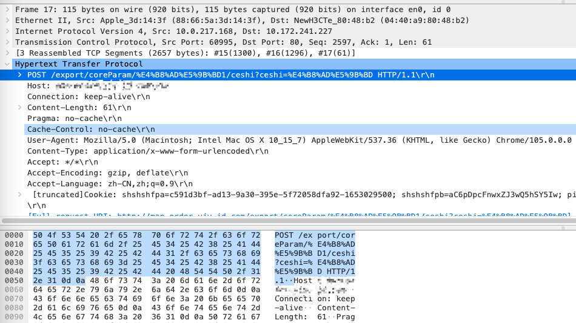
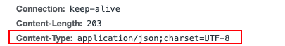
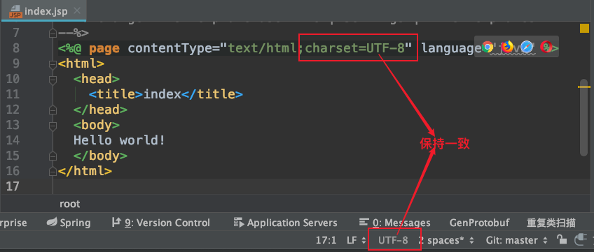

# Tomcat处理请求的编解码


[TOC]


## 前言

本文只分析tomcat与spring结合chrome浏览器的使用


## 结论

- chrome发送请求时请求行以及post请求体中的编码为utf-8



- chrome发送请求时请求头中的编码一定是ISO-8859-1
- 前端发送请求时，指定请求体的编码为utf-8



- tomcat处理请求行的参数时默认编码是ISO-8859-1
- spring处理请求行的path参数时的默认编码是ISO-8859-1

```java
protected String determineEncoding(HttpServletRequest request) {
   String enc = request.getCharacterEncoding();
   if (enc == null) {
      enc = getDefaultEncoding();
   }
   return enc;
}
```

```java
protected String getDefaultEncoding() {
   return this.defaultEncoding;
}
```

```java
private String defaultEncoding = WebUtils.DEFAULT_CHARACTER_ENCODING;
public static final String DEFAULT_CHARACTER_ENCODING = "ISO-8859-1";
```

- tomcat处理请求体的参数时默认编码是ISO-8859-1
- tomcat处理请求行中的参数以及请求体中的参数的编码是相同的
- tomcat中使用org.springframework.web.filter.CharacterEncodingFilter时，请求行的path参数、请求行的参数以及请求体的参数都是指定的encoding的编码格式

```java
<filter>
    <filter-name>CharacterEncodingFilter</filter-name>
    <filter-class>org.springframework.web.filter.CharacterEncodingFilter</filter-class>
    <init-param>
        <param-name>encoding</param-name>
        <param-value>utf-8</param-value>
    </init-param>
</filter>
<filter-mapping>
    <filter-name>CharacterEncodingFilter</filter-name>
    <url-pattern>/*</url-pattern>
</filter-mapping>
```

- 响应的编码需要设置响应头中的**Content-Type**，保证代码中的字符编码格式与**Content-Type**一致，浏览器根据**Content-Type**来解码

  

## http请求的处理


### tomcat处理请求行以及请求体的参数

处理请求的参数

```java
protected void parseParameters() {

    parametersParsed = true;

    Parameters parameters = coyoteRequest.getParameters();
    boolean success = false;
    try {
        // Set this every time in case limit has been changed via JMX
        parameters.setLimit(getConnector().getMaxParameterCount());

        // getCharacterEncoding() may have been overridden to search for
        // hidden form field containing request encoding
        // 获取解析请求行的参数以及请求体的参数, 先使用请求头中的 Content-Type 中的 charset 获取字符集解码
        // 默认是 ISO-8859-1
        Charset charset = getCharset();

        boolean useBodyEncodingForURI = connector.getUseBodyEncodingForURI();
        // 设置处理参数的字符集编码
        parameters.setCharset(charset);
        if (useBodyEncodingForURI) {
            parameters.setQueryStringCharset(charset);
        }
        // Note: If !useBodyEncodingForURI, the query string encoding is
        //       that set towards the start of CoyoyeAdapter.service()

        // 解析url后面的参数
        parameters.handleQueryParameters();

        if (usingInputStream || usingReader) {
            success = true;
            return;
        }

        String contentType = getContentType();
        if (contentType == null) {
            contentType = "";
        }
        int semicolon = contentType.indexOf(';');
        if (semicolon >= 0) {
            contentType = contentType.substring(0, semicolon).trim();
        } else {
            contentType = contentType.trim();
        }
        // 检查header content-type，如果不是multipart/form-data 或者
        // application/x-www-form-urlencoded 的，则不解析body
        if ("multipart/form-data".equals(contentType)) {
            parseParts(false);
            success = true;
            return;
        }

        if( !getConnector().isParseBodyMethod(getMethod()) ) {
            success = true;
            return;
        }

        if (!("application/x-www-form-urlencoded".equals(contentType))) {
            success = true;
            return;
        }

        int len = getContentLength();

        if (len > 0) {
            int maxPostSize = connector.getMaxPostSize();
            if ((maxPostSize >= 0) && (len > maxPostSize)) {
                Context context = getContext();
                if (context != null && context.getLogger().isDebugEnabled()) {
                    context.getLogger().debug(
                            sm.getString("coyoteRequest.postTooLarge"));
                }
                checkSwallowInput();
                parameters.setParseFailedReason(FailReason.POST_TOO_LARGE);
                return;
            }
            byte[] formData = null;
            if (len < CACHED_POST_LEN) {
                if (postData == null) {
                    postData = new byte[CACHED_POST_LEN];
                }
                formData = postData;
            } else {
                formData = new byte[len];
            }
            try {
                // 真正的读取数据, 读取数据的长度为ContentLength
                if (readPostBody(formData, len) != len) {
                    parameters.setParseFailedReason(FailReason.REQUEST_BODY_INCOMPLETE);
                    return;
                }
            } catch (IOException e) {
                // Client disconnect
                Context context = getContext();
                if (context != null && context.getLogger().isDebugEnabled()) {
                    context.getLogger().debug(
                            sm.getString("coyoteRequest.parseParameters"), e);
                }
                parameters.setParseFailedReason(FailReason.CLIENT_DISCONNECT);
                return;
            }
            // 解析请求体的长度为 ContentLength 的请求的key, value
            parameters.processParameters(formData, 0, len);
        } else if ("chunked".equalsIgnoreCase(
                coyoteRequest.getHeader("transfer-encoding"))) {
            byte[] formData = null;
            try {
                formData = readChunkedPostBody();
            } catch (IllegalStateException ise) {
                // chunkedPostTooLarge error
                parameters.setParseFailedReason(FailReason.POST_TOO_LARGE);
                Context context = getContext();
                if (context != null && context.getLogger().isDebugEnabled()) {
                    context.getLogger().debug(
                            sm.getString("coyoteRequest.parseParameters"),
                            ise);
                }
                return;
            } catch (IOException e) {
                // Client disconnect
                parameters.setParseFailedReason(FailReason.CLIENT_DISCONNECT);
                Context context = getContext();
                if (context != null && context.getLogger().isDebugEnabled()) {
                    context.getLogger().debug(
                            sm.getString("coyoteRequest.parseParameters"), e);
                }
                return;
            }
            if (formData != null) {
                parameters.processParameters(formData, 0, formData.length);
            }
        }
        success = true;
    } finally {
        if (!success) {
            parameters.setParseFailedReason(FailReason.UNKNOWN);
        }
    }

}
```

```java
private Charset getCharset() {
    Charset charset = null;
    try {
        // 使用请求头中的 Content-Type 中的 charset 获取字符集解码, 或者使用 CharacterEncodingFilter 设置的字符编码
        charset = coyoteRequest.getCharset();
    } catch (UnsupportedEncodingException e) {
        // Ignore
    }
    if (charset != null) {
        return charset;
    }

    Context context = getContext();
    if (context != null) {
        String encoding = context.getRequestCharacterEncoding();
        if (encoding != null) {
            try {
                return B2CConverter.getCharset(encoding);
            } catch (UnsupportedEncodingException e) {
                // Ignore
            }
        }
    }

    // 获取默认的字符编码 ISO-8859-1
    return org.apache.coyote.Constants.DEFAULT_BODY_CHARSET;
}
```

```java
public Charset getCharset() throws UnsupportedEncodingException {
    if (charset == null) {
        // 使用请求头中的 Content-Type 中的 charset 获取字符集解码
        getCharacterEncoding();
        if (characterEncoding != null) {
            charset = B2CConverter.getCharset(characterEncoding);
        }
    }

    return charset;
}
```

使用字符集编码解析字符

```java

String name;
String value;

if (decodeName) {
  urlDecode(tmpName);
}
tmpName.setCharset(charset);
name = tmpName.toString();

if (valueStart >= 0) {
  if (decodeValue) {
    urlDecode(tmpValue);
  }
  tmpValue.setCharset(charset);
  value = tmpValue.toString();
} else {
  value = "";
}

try {
  // 把参数值填充到 paramHashValues 中
  addParameter(name, value);
}
```


### spring处理请求行的path参数

根据path获取HandlerMethod的时候需要处理请求行的路径path参数

```java
protected HandlerMethod getHandlerInternal(HttpServletRequest request) throws Exception {
   // 获取请求路径
   String lookupPath = getUrlPathHelper().getLookupPathForRequest(request);
   if (logger.isDebugEnabled()) {
      logger.debug("Looking up handler method for path " + lookupPath);
   }
   this.mappingRegistry.acquireReadLock();
   try {
      HandlerMethod handlerMethod = lookupHandlerMethod(lookupPath, request);
      if (logger.isDebugEnabled()) {
         if (handlerMethod != null) {
            logger.debug("Returning handler method [" + handlerMethod + "]");
         }
         else {
            logger.debug("Did not find handler method for [" + lookupPath + "]");
         }
      }
      return (handlerMethod != null ? handlerMethod.createWithResolvedBean() : null);
   }
   finally {
      this.mappingRegistry.releaseReadLock();
   }
}
```

```java
public String getLookupPathForRequest(HttpServletRequest request) {
   // Always use full path within current servlet context?
   if (this.alwaysUseFullPath) {
      return getPathWithinApplication(request);
   }
   // Else, use path within current servlet mapping if applicable
   // 获取除去 Servletpath 之后的请求路径
   String rest = getPathWithinServletMapping(request);
   if (!"".equals(rest)) {
      return rest;
   }
   else {
      return getPathWithinApplication(request);
   }
}
```

```java
public String getPathWithinServletMapping(HttpServletRequest request) {
   // 获取 requestURI: 路径参数
   String pathWithinApp = getPathWithinApplication(request);
   // 获取 servletPath
   String servletPath = getServletPath(request);
   String sanitizedPathWithinApp = getSanitizedPath(pathWithinApp);
   String path;

   // If the app container sanitized the servletPath, check against the sanitized version
   if (servletPath.contains(sanitizedPathWithinApp)) {
      path = getRemainingPath(sanitizedPathWithinApp, servletPath, false);
   }
   else {
      path = getRemainingPath(pathWithinApp, servletPath, false);
   }

   if (path != null) {
      // Normal case: URI contains servlet path.
      return path;
   }
   else {
      // Special case: URI is different from servlet path.
      String pathInfo = request.getPathInfo();
      if (pathInfo != null) {
         // Use path info if available. Indicates index page within a servlet mapping?
         // e.g. with index page: URI="/", servletPath="/index.html"
         return pathInfo;
      }
      if (!this.urlDecode) {
         // No path info... (not mapped by prefix, nor by extension, nor "/*")
         // For the default servlet mapping (i.e. "/"), urlDecode=false can
         // cause issues since getServletPath() returns a decoded path.
         // If decoding pathWithinApp yields a match just use pathWithinApp.
         path = getRemainingPath(decodeInternal(request, pathWithinApp), servletPath, false);
         if (path != null) {
            return pathWithinApp;
         }
      }
      // Otherwise, use the full servlet path.
      return servletPath;
   }
}
```

```java
public String getPathWithinApplication(HttpServletRequest request) {
   String contextPath = getContextPath(request);
   // 获取requestURI: 路径参数
   String requestUri = getRequestUri(request);
   String path = getRemainingPath(requestUri, contextPath, true);
   if (path != null) {
      // Normal case: URI contains context path.
      return (StringUtils.hasText(path) ? path : "/");
   }
   else {
      return requestUri;
   }
}
```

```java
public String getRequestUri(HttpServletRequest request) {
   String uri = (String) request.getAttribute(WebUtils.INCLUDE_REQUEST_URI_ATTRIBUTE);
   if (uri == null) {
      // 获取请求的请求行中的请求路径除去请求行中的参数，requestURI: 路径参数
      uri = request.getRequestURI();
   }
   return decodeAndCleanUriString(request, uri);
}
```

```java
private String decodeAndCleanUriString(HttpServletRequest request, String uri) {
   uri = removeSemicolonContent(uri);
   // 解码uri
   uri = decodeRequestString(request, uri);
   uri = getSanitizedPath(uri);
   return uri;
}
```

```java
public String decodeRequestString(HttpServletRequest request, String source) {
   if (this.urlDecode) {
      // 解码
      return decodeInternal(request, source);
   }
   return source;
}
```

```java
private String decodeInternal(HttpServletRequest request, String source) {
   // 获取字符集
   String enc = determineEncoding(request);
   try {
      return UriUtils.decode(source, enc);
   }
   catch (UnsupportedCharsetException ex) {
      if (logger.isWarnEnabled()) {
         logger.warn("Could not decode request string [" + source + "] with encoding '" + enc +
               "': falling back to platform default encoding; exception message: " + ex.getMessage());
      }
      return URLDecoder.decode(source);
   }
}
```

```java
protected String determineEncoding(HttpServletRequest request) {
   // 获取这个请求的字符集, 使用请求头中的 Content-Type 中的 charset 获取字符集解码
   String enc = request.getCharacterEncoding();
   if (enc == null) {
      // 获取默认的字符编码 ISO-8859-1
      enc = getDefaultEncoding();
   }
   return enc;
}
```


**小结：所以spring中解析请求行的请求path参数的字符集和解析请求的参数的字符集使用的一致，都是使用请求头中的 Content-Type 中的 charset 获取字符集解码**


### CharacterEncodingFilter的生效流程

在请求中设置请求的 字符集，之后请求行的path参数、参数以及请求体参数都是使用这个字符集，而放弃使用请求头中的 Content-Type 中的 charset 中的字符集

```java
protected void doFilterInternal(
      HttpServletRequest request, HttpServletResponse response, FilterChain filterChain)
      throws ServletException, IOException {

   String encoding = getEncoding();
   if (encoding != null) {
      if (isForceRequestEncoding() || request.getCharacterEncoding() == null) {
         // 设置请求的的字符集编码 解析请求行path参数、参数、请求体中的
         request.setCharacterEncoding(encoding);
      }
      if (isForceResponseEncoding()) {
         response.setCharacterEncoding(encoding);
      }
   }
   filterChain.doFilter(request, response);
}
```

```java
public void setCharacterEncoding(String env)
        throws java.io.UnsupportedEncodingException {

    if (request == null) {
        throw new IllegalStateException(
                        sm.getString("requestFacade.nullRequest"));
    }

    // 设置请求的字符集
    request.setCharacterEncoding(env);
}
```

```java
public void setCharacterEncoding(String enc) throws UnsupportedEncodingException {

    if (usingReader) {
        return;
    }

    // Confirm that the encoding name is valid
    Charset charset = B2CConverter.getCharset(enc);

    // Save the validated encoding
    // 设置请求的字符集
    coyoteRequest.setCharset(charset);
}
```

```java
public void setCharset(Charset charset) {
    this.charset = charset;
    this.characterEncoding = charset.name();
}
```


## http响应处理


### 普通的页面渲染的场景

保证代码中页面的编码与代码中的contentType的编码一致


### spring中的@ResponseBody标注的返回值

```java
protected void extendMessageConverters(List<HttpMessageConverter<?>> converters) {
   converters.clear();
   converters.add(stringHttpMessageConverter());
   converters.add(fastJsonHttpMessageConverter());
}

@Bean
public FastJsonHttpMessageConverter fastJsonHttpMessageConverter() {
   FastJsonHttpMessageConverter fastJsonHttpMessageConverter = new FastJsonHttpMessageConverter();

   FastJsonConfig fastJsonConfig = new FastJsonConfig();
   fastJsonConfig.setSerializerFeatures(
         SerializerFeature.QuoteFieldNames,
         SerializerFeature.WriteMapNullValue,//保留空的字段
         SerializerFeature.WriteNullListAsEmpty,//List null-> []
         SerializerFeature.WriteDateUseDateFormat,// 日期格式化
         SerializerFeature.WriteNullStringAsEmpty);//String null -> ""

   List<MediaType> mediaTypeList = new ArrayList<>();
   mediaTypeList.add(MediaType.APPLICATION_JSON_UTF8);
   mediaTypeList.add(MediaType.APPLICATION_JSON);
   fastJsonHttpMessageConverter.setSupportedMediaTypes(mediaTypeList);
   fastJsonHttpMessageConverter.setFastJsonConfig(fastJsonConfig);
   return fastJsonHttpMessageConverter;
}

/**
 * 在ResponseBody注解下，Spring处理返回值为String时会用到StringHttpMessageConverter
 *
 */
@Bean
public StringHttpMessageConverter stringHttpMessageConverter() {
   StringHttpMessageConverter httpMessageConverter = new StringHttpMessageConverter();
   httpMessageConverter.setDefaultCharset(Charset.forName("UTF-8"));
   return httpMessageConverter;
}
```


