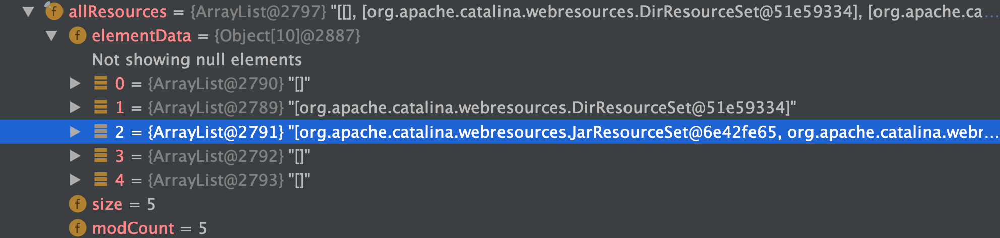

# Tomcat类加载机制以及Context的初始化

[TOC]

## 概述

　　本节简单介绍Java虚拟机规范中提到的主要类加载器：

- Bootstrap Loader：加载lib目录下或者System.getProperty(“sun.boot.class.path”)、或者-XBootclasspath所指定的路径或jar
- Extended Loader：加载lib\ext目录下或者System.getProperty(“java.ext.dirs”) 所指定的 路径或jar。例如：java -Djava.ext.dirs=/projects/testproj/classes HelloWorld
- AppClassLoader：加载-cp或者System.getProperty("java.class.path")所指定的 路径或jar。在使用Java运行程序时，也可以加上-cp来覆盖原有的Classpath设置，例如： java -cp /projects/testproj/classes HelloWorld
- Tomcat的commonLoader：Tomcat最基本的类加载器，加载路径中的class可以被Tomcat容器本身以及各个Webapp访问；加载"${catalina.base}/lib","${catalina.base}/lib/*.jar","${catalina.home}/lib","${catalina.home}/lib/*.jar"里面的类
- Tomcat的WebappClassLoader：各个Webapp私有的类加载器，加载路径中的class只对当前Webapp可见

## tomcat使用的自定义类加载器

tomcat使用了两个自己定义的类加载器，其模型如下


## 源码分析

### commonClassLoader初始化

在Bootstrap.init()中调Bootstrap#initClassLoaders进行初始化

```java
private void initClassLoaders() {
  try {
    // commonLoader的加载路径为common.loader(properties文件配置)
    // 加载${catalina.base}/lib,${catalina.base}/lib/*.jar,${catalina.home}/lib,${catalina.home}/lib/*.jar里面的类
    commonLoader = createClassLoader("common", null);
    if( commonLoader == null ) {
      // no config file, default to this loader - we might be in a 'single' env.
      commonLoader=this.getClass().getClassLoader();
    }
    // 加载路径为server.loader，默认为空，父类加载器为commonLoader
    catalinaLoader = createClassLoader("server", commonLoader);
    // 加载路径为shared.loader，默认为空，父类加载器为commonLoader
    sharedLoader = createClassLoader("shared", commonLoader);
  } catch (Throwable t) {
    handleThrowable(t);
    log.error("Class loader creation threw exception", t);
    System.exit(1);
  }
}
```


### Context的初始化包含ParallerWebAppClassLoader的初始化

加载的类存放的位置



其中：

```java
allResources[1]=mainResources;// /WEB-INF/classes包含的类
allResources[1]=classResources;// /WEB-INF/lib包含的jar中的类
```

在StandardContext#startInternal()->实例化WebappLoader->WebappLoader.start()->实例化ParallerWebAppClassLoader

先看StandardContext.startInternal()的逻辑

```java
protected synchronized void startInternal() throws LifecycleException {

    if(log.isDebugEnabled())
        log.debug("Starting " + getBaseName());

    // Send j2ee.state.starting notification
    if (this.getObjectName() != null) {
        Notification notification = new Notification("j2ee.state.starting",
                this.getObjectName(), sequenceNumber.getAndIncrement());
        broadcaster.sendNotification(notification);
    }

    setConfigured(false);
    boolean ok = true;

    // Currently this is effectively a NO-OP but needs to be called to
    // ensure the NamingResources follows the correct lifecycle
    if (namingResources != null) {
        namingResources.start();
    }

    // Post work directory
    postWorkDirectory();

    // Add missing components as necessary
    if (getResources() == null) {   // (1) Required by Loader
        if (log.isDebugEnabled())
            log.debug("Configuring default Resources");

        try {
            // 设置 context 的 Resources 为 StandardRoot
            setResources(new StandardRoot(this));
        } catch (IllegalArgumentException e) {
            log.error(sm.getString("standardContext.resourcesInit"), e);
            ok = false;
        }
    }
    if (ok) {
        // StandardRoot.startInternal() 初始化要加载allResources包含
        // 重要:  1.mainResources: /WEB-INF/classes包含的jar中的类
        // 重要:  2.classResources: /WEB-INF/lib包含的jar中的类
        // 3.preResources: 是context.xml中定义的 preResources 资源
        // 4.postResources: 是context.xml中定义的 postResources资源
        // 5.classResources
        resourcesStart();
    }

    if (getLoader() == null) {
        // WebappLoader.loaderClass=ParallelWebappClassLoader.class.getName()标识context应用使用的应用类加载器
        WebappLoader webappLoader = new WebappLoader(getParentClassLoader());
        webappLoader.setDelegate(getDelegate());
        setLoader(webappLoader);
    }

    // An explicit cookie processor hasn't been specified; use the default
    if (cookieProcessor == null) {
        cookieProcessor = new Rfc6265CookieProcessor();
    }

    // Initialize character set mapper
    getCharsetMapper();

    // Validate required extensions
    boolean dependencyCheck = true;
    try {
        dependencyCheck = ExtensionValidator.validateApplication
            (getResources(), this);
    } catch (IOException ioe) {
        log.error(sm.getString("standardContext.extensionValidationError"), ioe);
        dependencyCheck = false;
    }

    if (!dependencyCheck) {
        // do not make application available if dependency check fails
        ok = false;
    }

    // Reading the "catalina.useNaming" environment variable
    String useNamingProperty = System.getProperty("catalina.useNaming");
    if ((useNamingProperty != null)
        && (useNamingProperty.equals("false"))) {
        useNaming = false;
    }

    if (ok && isUseNaming()) {
        if (getNamingContextListener() == null) {
            NamingContextListener ncl = new NamingContextListener();
            ncl.setName(getNamingContextName());
            ncl.setExceptionOnFailedWrite(getJndiExceptionOnFailedWrite());
            addLifecycleListener(ncl);
            setNamingContextListener(ncl);
        }
    }

    // Standard container startup
    if (log.isDebugEnabled())
        log.debug("Processing standard container startup");


    // Binding thread
    ClassLoader oldCCL = bindThread();

    try {
        if (ok) {
            // Start our subordinate components, if any
            Loader loader = getLoader();
            if (loader instanceof Lifecycle) {
                // 在WebappLoader.startInternal中实例化类加载器为：ParallelWebappClassLoader
                // 设置在WebappLoader.classLoader=ParallelWebappClassLoader之后创建EventListener，Filter，Servlet
                ((Lifecycle) loader).start();
            }

            // since the loader just started, the webapp classloader is now
            // created.
            setClassLoaderProperty("clearReferencesRmiTargets",
                    getClearReferencesRmiTargets());
            setClassLoaderProperty("clearReferencesStopThreads",
                    getClearReferencesStopThreads());
            setClassLoaderProperty("clearReferencesStopTimerThreads",
                    getClearReferencesStopTimerThreads());
            setClassLoaderProperty("clearReferencesHttpClientKeepAliveThread",
                    getClearReferencesHttpClientKeepAliveThread());
            setClassLoaderProperty("clearReferencesObjectStreamClassCaches",
                    getClearReferencesObjectStreamClassCaches());
            setClassLoaderProperty("clearReferencesThreadLocals",
                    getClearReferencesThreadLocals());

            // By calling unbindThread and bindThread in a row, we setup the
            // current Thread CCL to be the webapp classloader
            unbindThread(oldCCL);
            oldCCL = bindThread();

            // Initialize logger again. Other components might have used it
            // too early, so it should be reset.
            logger = null;
            getLogger();

            Realm realm = getRealmInternal();
            if(null != realm) {
                if (realm instanceof Lifecycle) {
                    ((Lifecycle) realm).start();
                }

                // Place the CredentialHandler into the ServletContext so
                // applications can have access to it. Wrap it in a "safe"
                // handler so application's can't modify it.
                CredentialHandler safeHandler = new CredentialHandler() {
                    @Override
                    public boolean matches(String inputCredentials, String storedCredentials) {
                        return getRealmInternal().getCredentialHandler().matches(inputCredentials, storedCredentials);
                    }

                    @Override
                    public String mutate(String inputCredentials) {
                        return getRealmInternal().getCredentialHandler().mutate(inputCredentials);
                    }
                };
                context.setAttribute(Globals.CREDENTIAL_HANDLER, safeHandler);
            }

            // Notify our interested LifecycleListeners
            // 利用 ContextConfig.lifecycleEvent 解析 web.xml
            fireLifecycleEvent(Lifecycle.CONFIGURE_START_EVENT, null);

            // Start our child containers, if not already started
            for (Container child : findChildren()) {
                if (!child.getState().isAvailable()) {
                    child.start();
                }
            }

            // Start the Valves in our pipeline (including the basic),
            // if any
            if (pipeline instanceof Lifecycle) {
                ((Lifecycle) pipeline).start();
            }

            // Acquire clustered manager
            Manager contextManager = null;
            Manager manager = getManager();
            if (manager == null) {
                if (log.isDebugEnabled()) {
                    log.debug(sm.getString("standardContext.cluster.noManager",
                            Boolean.valueOf((getCluster() != null)),
                            Boolean.valueOf(distributable)));
                }
                if ( (getCluster() != null) && distributable) {
                    try {
                        contextManager = getCluster().createManager(getName());
                    } catch (Exception ex) {
                        log.error("standardContext.clusterFail", ex);
                        ok = false;
                    }
                } else {
                    contextManager = new StandardManager();
                }
            }

            // Configure default manager if none was specified
            if (contextManager != null) {
                if (log.isDebugEnabled()) {
                    log.debug(sm.getString("standardContext.manager",
                            contextManager.getClass().getName()));
                }
                setManager(contextManager);
            }

            if (manager!=null && (getCluster() != null) && distributable) {
                //let the cluster know that there is a context that is distributable
                //and that it has its own manager
                getCluster().registerManager(manager);
            }
        }

        if (!getConfigured()) {
            log.error(sm.getString("standardContext.configurationFail"));
            ok = false;
        }

        // We put the resources into the servlet context
        if (ok)
            getServletContext().setAttribute
                (Globals.RESOURCES_ATTR, getResources());

        if (ok ) {
            if (getInstanceManager() == null) {
                javax.naming.Context context = null;
                if (isUseNaming() && getNamingContextListener() != null) {
                    context = getNamingContextListener().getEnvContext();
                }
                Map<String, Map<String, String>> injectionMap = buildInjectionMap(
                        getIgnoreAnnotations() ? new NamingResourcesImpl(): getNamingResources());
                // 实例化DefaultInstanceManager，在DefaultInstanceManager保存了containerClassLoader：commonClassLoader和
                // 应用类加载器：ParallelWebappClassLoader
                setInstanceManager(new DefaultInstanceManager(context,
                        injectionMap, this, this.getClass().getClassLoader()));
            }
            getServletContext().setAttribute(
                    InstanceManager.class.getName(), getInstanceManager());
            InstanceManagerBindings.bind(getLoader().getClassLoader(), getInstanceManager());
        }

        // Create context attributes that will be required
        if (ok) {
            getServletContext().setAttribute(
                    JarScanner.class.getName(), getJarScanner());
        }

        // Set up the context init params
        mergeParameters();

        // Call ServletContainerInitializers
        // 真正调 ServletContainerInitializer.onStartup 方法
        for (Map.Entry<ServletContainerInitializer, Set<Class<?>>> entry :
            initializers.entrySet()) {
            try {
                entry.getKey().onStartup(entry.getValue(),
                        getServletContext());
            } catch (ServletException e) {
                log.error(sm.getString("standardContext.sciFail"), e);
                ok = false;
                break;
            }
        }

        // Configure and call application event listeners
        if (ok) {
            // 实例化EventListener, 并调用ServletContextListener的contextInitialized方法
            // 例如: ContextLoaderListener
            if (!listenerStart()) {
                log.error(sm.getString("standardContext.listenerFail"));
                ok = false;
            }
        }

        // Check constraints for uncovered HTTP methods
        // Needs to be after SCIs and listeners as they may programmatically
        // change constraints
        if (ok) {
            checkConstraintsForUncoveredMethods(findConstraints());
        }

        try {
            // Start manager
            Manager manager = getManager();
            if (manager instanceof Lifecycle) {
                ((Lifecycle) manager).start();
            }
        } catch(Exception e) {
            log.error(sm.getString("standardContext.managerFail"), e);
            ok = false;
        }

        // Configure and call application filters
        if (ok) {
            // 实例化Filter, 并调用Filter的init方法
            if (!filterStart()) {
                log.error(sm.getString("standardContext.filterFail"));
                ok = false;
            }
        }

        // Load and initialize all "load on startup" servlets
        if (ok) {
            // 实例化配置了load-on-startup属性的Servlet,并调用Servlet.init方法
            if (!loadOnStartup(findChildren())){
                log.error(sm.getString("standardContext.servletFail"));
                ok = false;
            }
        }

        // Start ContainerBackgroundProcessor thread
        super.threadStart();
    } finally {
        // Unbinding thread
        unbindThread(oldCCL);
    }

    // Set available status depending upon startup success
    if (ok) {
        if (log.isDebugEnabled())
            log.debug("Starting completed");
    } else {
        log.error(sm.getString("standardContext.startFailed", getName()));
    }

    startTime=System.currentTimeMillis();

    // Send j2ee.state.running notification
    if (ok && (this.getObjectName() != null)) {
        Notification notification =
            new Notification("j2ee.state.running", this.getObjectName(),
                             sequenceNumber.getAndIncrement());
        broadcaster.sendNotification(notification);
    }

    // The WebResources implementation caches references to JAR files. On
    // some platforms these references may lock the JAR files. Since web
    // application start is likely to have read from lots of JARs, trigger
    // a clean-up now.
    getResources().gc();

    // Reinitializing if something went wrong
    if (!ok) {
        setState(LifecycleState.FAILED);
    } else {
        setState(LifecycleState.STARTING);
    }
}
```

```java
org.apache.catalina.loader.WebappLoader#startInternal
  
protected void startInternal() throws LifecycleException {

  if (log.isDebugEnabled())
    log.debug(sm.getString("webappLoader.starting"));

  if (context.getResources() == null) {
    log.info("No resources for " + context);
    setState(LifecycleState.STARTING);
    return;
  }

  // Construct a class loader based on our current repositories list
  try {
    // 实例化ParallelWebappClassLoader
    classLoader = createClassLoader();
    
    classLoader.setResources(context.getResources());
    classLoader.setDelegate(this.delegate);

    // Configure our repositories
    setClassPath();

    setPermissions();

    ((Lifecycle) classLoader).start();

    String contextName = context.getName();
    if (!contextName.startsWith("/")) {
      contextName = "/" + contextName;
    }
    ObjectName cloname = new ObjectName(context.getDomain() + ":type=" +
                                        classLoader.getClass().getSimpleName() + ",host=" +
                                        context.getParent().getName() + ",context=" + contextName);
    Registry.getRegistry(null, null)
      .registerComponent(classLoader, cloname, null);

  } catch (Throwable t) {
    t = ExceptionUtils.unwrapInvocationTargetException(t);
    ExceptionUtils.handleThrowable(t);
    log.error( "LifecycleException ", t );
    throw new LifecycleException("start: ", t);
  }

  setState(LifecycleState.STARTING);
}
```

**context的resources的来源分析**

```java
org.apache.catalina.webresources.StandardRoot#startInternal

protected void startInternal() throws LifecycleException {
  mainResources.clear();

  // 创建DirResourceSet, 其中路径是: /webapps/context应用路径
  // 如果是跟路径/的话是/webapps/ROOT
  // 放到mainResources里面
  main = createMainResourceSet();

  mainResources.add(main);

  for (List<WebResourceSet> list : allResources) {
    // Skip class resources since they are started below
    if (list != classResources) {
      for (WebResourceSet webResourceSet : list) {
        webResourceSet.start();
      }
    }
  }

  // This has to be called after the other resources have been started
  // else it won't find all the matching resources
  // 将/WEB-INF/lib目录下的类资源放入到classResources中, 而且classResources是乱序的
  processWebInfLib();
  // Need to start the newly found resources
  for (WebResourceSet classResource : classResources) {
    classResource.start();
  }

  cache.enforceObjectMaxSizeLimit();

  setState(LifecycleState.STARTING);
}

protected void processWebInfLib() throws LifecycleException {
  WebResource[] possibleJars = listResources("/WEB-INF/lib", false);

  for (WebResource possibleJar : possibleJars) {
    if (possibleJar.isFile() && possibleJar.getName().endsWith(".jar")) {
      createWebResourceSet(ResourceSetType.CLASSES_JAR,
                           "/WEB-INF/classes", possibleJar.getURL(), "/");
    }
  }
}

protected WebResource[] listResources(String path, boolean validate) {
  if (validate) {
    path = validate(path);
  }

  String[] resources = list(path, false);
  WebResource[] result = new WebResource[resources.length];
  for (int i = 0; i < resources.length; i++) {
    if (path.charAt(path.length() - 1) == '/') {
      result[i] = getResource(path + resources[i], false, false);
    } else {
      result[i] = getResource(path + '/' + resources[i], false, false);
    }
  }
  return result;
}

// org.apache.catalina.webresources.DirResourceSet#list
public String[] list(String path) {
  checkPath(path);
  String webAppMount = getWebAppMount();
  if (path.startsWith(webAppMount)) {
    File f = file(path.substring(webAppMount.length()), true);
    if (f == null) {
      return EMPTY_STRING_ARRAY;
    }
    /*
             * There is no guarantee that the name strings in the resulting array
             * will appear in any specific order; they are not, in particular,
             * guaranteed to appear in alphabetical order.
             */
    // 无法保证结果数组中的名称字符串将以任何特定顺序出现；即乱序出现。
    String[] result = f.list();
    if (result == null) {
      return EMPTY_STRING_ARRAY;
    } else {
      return result;
    }
  } else {
    if (!path.endsWith("/")) {
      path = path + "/";
    }
    if (webAppMount.startsWith(path)) {
      int i = webAppMount.indexOf('/', path.length());
      if (i == -1) {
        return new String[] {webAppMount.substring(path.length())};
      } else {
        return new String[] {
          webAppMount.substring(path.length(), i)};
      }
    }
    return EMPTY_STRING_ARRAY;
  }
}
```


**总结：**

StandardContext#startInternal进行的步骤：

1. 实例化StandardRoot

2. 调StandardRoot.startInternal初始化该context要加载的资源
3. 实例化WebappLoader
4. 调WebappLoader.startInternal初始化该context的类加载器ParallelWebappClassLoader
5. 利用 ContextConfig.lifecycleEvent 解析 web.xml
6. 实例化DefaultInstanceManager，在DefaultInstanceManager保存了tomcatClassLoader：commonClassLoader和context应用类加载器：ParallelWebappClassLoader
7. 调用 ServletContainerInitializer.onStartup 方法
8. 委托DefaultInstanceManager使用ParallelWebappClassLoader来实例化EventListener, 并调用ServletContextListener的contextInitialized方法
9. 委托DefaultInstanceManager使用ParallelWebappClassLoader来实例化Filter, 并调用Filter的init方法
10. 委托DefaultInstanceManager使用ParallelWebappClassLoader来实例化配置了load-on-startup属性的Servlet,并调用Servlet.init方法

### Webapp中使用的都是ParallerWebAppClassLoader原因

**原因在于一个Tomcat容器允许同时运行多个Web程序，每个Web程序依赖的类又必须是相互隔离的**。因此，如果Tomcat使用双亲委派模式来加载类的话，将导致Web程序依赖的类变为共享的。

举个例子，假如我们有两个Web程序，依赖的spring的版本不一致。那么这两个Web程序的其中一个必然因为加载的Clazz不是所使用的Clazz而出现问题！而这对于开发来说是非常致命的！

**因为Listener，Filter，Servlet都是使用ParallelWebappClassLoader来加载，所以实例化它们的时候间接依赖的类没有指定的类加载的情况下也是使用ParallelWebappClassLoader类加载器，所以使用spring的项目类加载器基本都是 ParallelWebappClassLoader**

## commonClassLoader加载类的机制

- 是`UrlClassLoader`的实例parent是Launcher.AppClassLoader没有重新loadClass()方法，**遵循双亲委派模型**
- path是cataline.base/lib即tomcat的解压包的lib目录下的类资源

## ParallerWebAppClassLoader加载类的机制

ParallerWebAppClassLoader重写了loadClass()方法来打破双亲委派模型

研究下ParallerWebAppClassLoader.loadClass()

```java
public Class<?> loadClass(String name, boolean resolve) throws ClassNotFoundException {

  synchronized (getClassLoadingLock(name)) {
    if (log.isDebugEnabled())
      log.debug("loadClass(" + name + ", " + resolve + ")");
    Class<?> clazz = null;

    // Log access to stopped class loader
    checkStateForClassLoading(name);

    // (0) Check our previously loaded local class cache
    // 查看 resourceEntries 里面的信息, 当前对象缓存中检查是否已经加载该类, 有的话直接返回 Class
    clazz = findLoadedClass0(name);
    if (clazz != null) {
      if (log.isDebugEnabled())
        log.debug("  Returning class from cache");
      if (resolve)
        resolveClass(clazz);
      return clazz;
    }

    // (0.1) Check our previously loaded class cache
    // 是否已经加载过该类 (这里的加载最终会调用一个 native 方法,意思就是检查这个 ClassLoader 是否已经加载过对应的 class)
    clazz = findLoadedClass(name);
    if (clazz != null) {
      if (log.isDebugEnabled())
        log.debug("  Returning class from cache");
      if (resolve)
        resolveClass(clazz);
      return clazz;
    }

    // (0.2) Try loading the class with the system class loader, to prevent
    //       the webapp from overriding Java SE classes. This implements
    //       SRV.10.7.2
    // 上面两步是 1. 查看 resourceEntries 里面的信息, 判断 class 是否加载过,
    // 2. 通过 findLoadedClass 判断 JVM 中是否已经加载过,
    // 但现在 直接用 j2seClassLoader(Luancher.ExtClassLoader 这里的加载过程是双亲委派模式) 来进行加载
    // 这是为什么呢 ? 主要是 这里直接用 ExtClassLoader 来加载 J2SE 所对应的 class, 防止被 ParallelWebappClassLoader 加载了
    // 进行 class 名称 转路径的操作 (文件的尾缀是 .class)
    String resourceName = binaryNameToPath(name, false);

    ClassLoader javaseLoader = getJavaseClassLoader();
    boolean tryLoadingFromJavaseLoader;
    try {
      // Use getResource as it won't trigger an expensive
      // ClassNotFoundException if the resource is not available from
      // the Java SE class loader. However (see
      // https://bz.apache.org/bugzilla/show_bug.cgi?id=58125 for
      // details) when running under a security manager in rare cases
      // this call may trigger a ClassCircularityError.
      // See https://bz.apache.org/bugzilla/show_bug.cgi?id=61424 for
      // details of how this may trigger a StackOverflowError
      // Given these reported errors, catch Throwable to ensure any
      // other edge cases are also caught
      URL url;
      if (securityManager != null) {
        PrivilegedAction<URL> dp = new PrivilegedJavaseGetResource(resourceName);
        url = AccessController.doPrivileged(dp);
      } else {
        url = javaseLoader.getResource(resourceName);
      }
      // tryLoadingFromJavaseLoader = true, 能使用Luancher.ExtClassLoader来加载
      tryLoadingFromJavaseLoader = (url != null);
    } catch (Throwable t) {
      // Swallow all exceptions apart from those that must be re-thrown
      ExceptionUtils.handleThrowable(t);
      // The getResource() trick won't work for this class. We have to
      // try loading it directly and accept that we might get a
      // ClassNotFoundException.
      tryLoadingFromJavaseLoader = true;
    }

    if (tryLoadingFromJavaseLoader) {
      try {
        // 这里的 j2seClassLoader 其实就是 ExtClassLoader,
        // 这里就是 查找 BootstrapClassloader 与 ExtClassLoader 是否有权限加载这个 class
        clazz = javaseLoader.loadClass(name);
        if (clazz != null) {
          if (resolve)
            resolveClass(clazz);
          return clazz;
        }
      } catch (ClassNotFoundException e) {
        // Ignore
      }
    }

    // (0.5) Permission to access this class when using a SecurityManager
    if (securityManager != null) {
      int i = name.lastIndexOf('.');
      if (i >= 0) {
        try {
          securityManager.checkPackageAccess(name.substring(0,i));
        } catch (SecurityException se) {
          String error = "Security Violation, attempt to use " +
            "Restricted Class: " + name;
          log.info(error, se);
          throw new ClassNotFoundException(error, se);
        }
      }
    }

    // 读取 delegate 的配置信息,
    // filter 主要判断这个 class 是否能由这个 commonClassLoader 进行加载
    boolean delegateLoad = delegate || filter(name, true);

    // (1) Delegate to our parent if requested
    // 如果配置了 parent-first 模式, 那么委托给父加载器
    // 当进行加载 javax 下面的包(除了javax.servlet.jsp.jstl) 就直接交给 parent(commonClassLoader) 来进行加载
    // (主要是 这些公共加载的资源统一由 commonClassLoader 来进行加载, 能减少 Perm 区域的大小)
    if (delegateLoad) {
      // 若 delegate 开启, 优先使用 parent classloader( delegate 默认是 false); 这里还有一种可能,
      // 就是 经过 filter(name) 后, 还是返回 true, 那说明 ParallelWebappClassLoader 不应该进行加载, 应该交给其 parent 进行加载
      if (log.isDebugEnabled())
        log.debug("  Delegating to parent classloader1 " + parent);
      try {
        // 通过 parent ClassLoader 来进行加载 (这里构造函数中第二个参数 false 表示:
        // 使用 parent 加载 classs 时不进行初始化操作, 也就是 不会执行这个 class 中 static 里面的初始操作
        // 以及 一些成员变量ed赋值操作, 这一动作也符合 JVM 一贯的 lazy-init 策略)
        clazz = Class.forName(name, false, parent);
        if (clazz != null) {
          if (log.isDebugEnabled())
            log.debug("  Loading class from parent");
          if (resolve)
            resolveClass(clazz);
          // 通过 parent ClassLoader 加载成功, 则直接返回
          return clazz;
        }
      } catch (ClassNotFoundException e) {
        // Ignore
      }
    }

    // (2) Search local repositories
    if (log.isDebugEnabled())
      log.debug("  Searching local repositories");
    try {
      // 若是默认的话，是先使用ParallelWebappClassLoader自己处理加载类的
      clazz = findClass(name);
      if (clazz != null) {
        if (log.isDebugEnabled())
          log.debug("  Loading class from local repository");
        if (resolve)
          resolveClass(clazz);
        return clazz;
      }
    } catch (ClassNotFoundException e) {
      // Ignore
    }

    // (3) Delegate to parent unconditionally
    // 如果在当前 WebApp 中无法加载到, 委托给 commonClassLoader 从 $catalina_home/lib 中去加载
    if (!delegateLoad) {
      // 这是在 delegate = false 时, 在本 classLoader 上进行加载后, 再进行操作这里
      if (log.isDebugEnabled())
        log.debug("  Delegating to parent classloader at end: " + parent);
      try {
        // 若是ParallelWebappClassLoader在/WEB-INF/classes、/WEB-INF/lib下还是查找不到class
        // 那么委托给Common类加载器去查找该类 ，这里满足双亲委派原则
        clazz = Class.forName(name, false, parent);
        if (clazz != null) {
          if (log.isDebugEnabled())
            log.debug("  Loading class from parent");
          if (resolve)
            resolveClass(clazz);
          return clazz;
        }
      } catch (ClassNotFoundException e) {
        // Ignore
      }
    }
  }

  // 若还是加载不到, 那就抛出异常吧
  throw new ClassNotFoundException(name);
}
```

find class的流程

```java
public Class<?> findClass(String name) throws ClassNotFoundException {

  if (log.isDebugEnabled())
    log.debug("    findClass(" + name + ")");

  checkStateForClassLoading(name);

  // (1) Permission to define this class when using a SecurityManager
  if (securityManager != null) {
    int i = name.lastIndexOf('.');
    if (i >= 0) {
      try {
        if (log.isTraceEnabled())
          log.trace("      securityManager.checkPackageDefinition");
        securityManager.checkPackageDefinition(name.substring(0,i));
      } catch (Exception se) {
        if (log.isTraceEnabled())
          log.trace("      -->Exception-->ClassNotFoundException", se);
        throw new ClassNotFoundException(name, se);
      }
    }
  }

  // Ask our superclass to locate this class, if possible
  // (throws ClassNotFoundException if it is not found)
  Class<?> clazz = null;
  try {
    if (log.isTraceEnabled())
      log.trace("      findClassInternal(" + name + ")");
    try {
      if (securityManager != null) {
        PrivilegedAction<Class<?>> dp =
          new PrivilegedFindClassByName(name);
        clazz = AccessController.doPrivileged(dp);
      } else {
        // 真正findClass的操作
        clazz = findClassInternal(name);
      }
    } catch(AccessControlException ace) {
      log.warn("WebappClassLoader.findClassInternal(" + name
               + ") security exception: " + ace.getMessage(), ace);
      throw new ClassNotFoundException(name, ace);
    } catch (RuntimeException e) {
      if (log.isTraceEnabled())
        log.trace("      -->RuntimeException Rethrown", e);
      throw e;
    }
    if ((clazz == null) && hasExternalRepositories) {
      try {
        clazz = super.findClass(name);
      } catch(AccessControlException ace) {
        log.warn("WebappClassLoader.findClassInternal(" + name
                 + ") security exception: " + ace.getMessage(), ace);
        throw new ClassNotFoundException(name, ace);
      } catch (RuntimeException e) {
        if (log.isTraceEnabled())
          log.trace("      -->RuntimeException Rethrown", e);
        throw e;
      }
    }
    if (clazz == null) {
      if (log.isDebugEnabled())
        log.debug("    --> Returning ClassNotFoundException");
      throw new ClassNotFoundException(name);
    }
  } catch (ClassNotFoundException e) {
    if (log.isTraceEnabled())
      log.trace("    --> Passing on ClassNotFoundException");
    throw e;
  }

  // Return the class we have located
  if (log.isTraceEnabled())
    log.debug("      Returning class " + clazz);

  if (log.isTraceEnabled()) {
    ClassLoader cl;
    if (Globals.IS_SECURITY_ENABLED){
      cl = AccessController.doPrivileged(
        new PrivilegedGetClassLoader(clazz));
    } else {
      cl = clazz.getClassLoader();
    }
    log.debug("      Loaded by " + cl.toString());
  }
  return clazz;

}


protected Class<?> findClassInternal(String name) {

  // 对于 J2SE 下面的 Class, 不能通过这个 ParallelWebappClassLoader 来进行加载
  checkStateForResourceLoading(name);

  if (name == null) {
    return null;
  }
  // 将类名转化成路径名称
  String path = binaryNameToPath(name, true);

  // resourceEntries 里面会存储所有已经加载了的 文件的信息
  ResourceEntry entry = resourceEntries.get(path);
  WebResource resource = null;

  if (entry == null) {
    // 通过 JNDI 来进行查找 资源 (想知道 resources 里面到底是哪些资源, 可以看 StandardRoot 类)
    resource = resources.getClassLoaderResource(path);

    // 若资源不存在, 则进行返回
    if (!resource.exists()) {
      return null;
    }

    // 若所查找的 class 对应的 ResourceEntry 不存在, 则进行构建一个
    entry = new ResourceEntry();
    entry.lastModified = resource.getLastModified();

    // Add the entry in the local resource repository
    synchronized (resourceEntries) {
      // Ensures that all the threads which may be in a race to load
      // a particular class all end up with the same ResourceEntry
      // instance
      ResourceEntry entry2 = resourceEntries.get(path);
      if (entry2 == null) {
        // 向本地资源缓存注册 ResourceEntry
        resourceEntries.put(path, entry);
      } else {
        entry = entry2;
      }
    }
  }

  Class<?> clazz = entry.loadedClass;
  // 若程序已经生成了 class, 则直接返回
  if (clazz != null)
    return clazz;

  synchronized (getClassLoadingLock(name)) {
    clazz = entry.loadedClass;
    if (clazz != null)
      return clazz;

    if (resource == null) {
      resource = resources.getClassLoaderResource(path);
    }

    if (!resource.exists()) {
      return null;
    }

    byte[] binaryContent = resource.getContent();
    if (binaryContent == null) {
      // Something went wrong reading the class bytes (and will have
      // been logged at debug level).
      return null;
    }
    Manifest manifest = resource.getManifest();
    URL codeBase = resource.getCodeBase();
    Certificate[] certificates = resource.getCertificates();

    if (transformers.size() > 0) {
      // If the resource is a class just being loaded, decorate it
      // with any attached transformers

      // Ignore leading '/' and trailing CLASS_FILE_SUFFIX
      // Should be cheaper than replacing '.' by '/' in class name.
      String internalName = path.substring(1, path.length() - CLASS_FILE_SUFFIX.length());

      for (ClassFileTransformer transformer : this.transformers) {
        try {
          byte[] transformed = transformer.transform(
            this, internalName, null, null, binaryContent);
          if (transformed != null) {
            // 设置 二进制设置到 ResourceEntry
            binaryContent = transformed;
          }
        } catch (IllegalClassFormatException e) {
          log.error(sm.getString("webappClassLoader.transformError", name), e);
          return null;
        }
      }
    }

    // Looking up the package
    String packageName = null;
    int pos = name.lastIndexOf('.');
    if (pos != -1)
      packageName = name.substring(0, pos);

    Package pkg = null;

    if (packageName != null) {
      // 通过 包名 获取对应的 Package 对象
      pkg = getPackage(packageName);
      // Define the package (if null)
      // 若还不存在, 则definePackage
      if (pkg == null) {
        try {
          if (manifest == null) {
            definePackage(packageName, null, null, null, null, null, null, null);
          } else {
            definePackage(packageName, manifest, codeBase);
          }
        } catch (IllegalArgumentException e) {
          // Ignore: normal error due to dual definition of package
        }
        // 获取 Package
        pkg = getPackage(packageName);
      }
    }
    // 若程序运行配置了 securityManager, 则进行一些权限方面的检查
    if (securityManager != null) {

      // Checking sealing
      if (pkg != null) {
        boolean sealCheck = true;
        if (pkg.isSealed()) {
          sealCheck = pkg.isSealed(codeBase);
        } else {
          sealCheck = (manifest == null) || !isPackageSealed(packageName, manifest);
        }
        if (!sealCheck)
          throw new SecurityException
          ("Sealing violation loading " + name + " : Package "
           + packageName + " is sealed.");
      }

    }

    try {
      // 最终调用 ClassLoader.defineClass 来将 class 对应的 二进制数据加载进来,
      // 进行 "加载, 连接(解析, 验证, 准备), 初始化" 操作, 最终返回 class 对象
      clazz = defineClass(name, binaryContent, 0,
                          binaryContent.length, new CodeSource(codeBase, certificates));
    } catch (UnsupportedClassVersionError ucve) {
      throw new UnsupportedClassVersionError(
        ucve.getLocalizedMessage() + " " +
        sm.getString("webappClassLoader.wrongVersion",
                     name));
    }
    // 缓存已经加载的 class, 目前没有初始化, 即没有调static代码块也没有给static变量赋值
    entry.loadedClass = clazz;
  }
  // return 加载了的 class
  return clazz;
}
```


**总结**

1. 调用 findLocaledClass0 从 resourceEntries 中判断 class 是否已经加载
2. 调用 findLoadedClass(内部调用一个 native 方法) 直接查看对应的 class 是否已经加载过
3. 调用 binaryNameToPath 判断是否 当前 class 是属于 J2SE 范围中的, 若是的则直接通过 ExtClassLoader, BootstrapClassLoader 进行加载 (这里是双亲委派)
4. 在设置 JVM 权限校验的情况下, 调用 securityManager 来进行权限的校验(当前类是否有权限加载这个类, 默认的权限配置文件是 ${catalina.base}/conf/catalina.policy)
5. 如果设置了双亲委派机制 或 当前 UrlClassLoader(也就是 commonClassLoader) 能加载这个 class ( javax 下面的包(除了javax.servlet.jsp.jstl) )，用 ParallelWebappClassLoader.parent(也就是 commonClassLoader) 来进行加载
6. 调用 ParallelWebappClassLoader.findClass(name) 来进行加载
7. 若上一还是没有加载成功, 则通过 ParallelWebappClassLoader.parent(也就是 commonClassLoader) 来进行加载
8. 若还没加载成功的话, 那就直接抛异常

## 参考

- https://www.cnblogs.com/jiaan-geng/p/4860432.html
