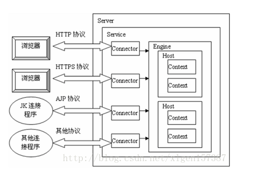
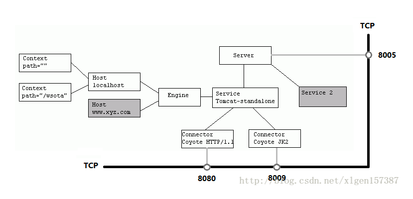

# tomcat的整体架构

## 架构图

Tomcat中最顶层的容器是Server，代表着整个服务器，从上图中可以看出，一个Server可以包含至少一个Service，用于具体提供服务。

Service主要包含两个部分：Connector和Container。从上图中可以看出 Tomcat 的心脏就是这两个组件，他们的作用如下：

1、Connector用于处理连接相关的事情，并提供Socket与Request和Response相关的转化;
2、Container用于封装和管理Servlet，以及具体处理Request请求；

一个Tomcat中只有一个Server，一个Server可以包含多个Service，一个Service只有一个Container，但是可以有多个Connectors，这是因为一个服务可以有多个连接，如同时提供Http和Https链接，也可以提供向相同协议不同端口的连接,示意图如下（Engine、Host、Context下边会说到）：

## 架构小结

（1）Tomcat中只有一个Server，一个Server可以有多个Service，一个Service可以有多个Connector和一个Container；
（2） Server掌管着整个Tomcat的生死大权；
（4）Service 是对外提供服务的；
（5）Connector用于接受请求并将请求封装成Request和Response来具体处理；
（6）Container用于封装和管理Servlet，以及具体处理request请求；

## 参考文章
- https://blog.csdn.net/xlgen157387/article/details/79006434

