# Tomcat的整体架构

[TOC]


## 架构设计

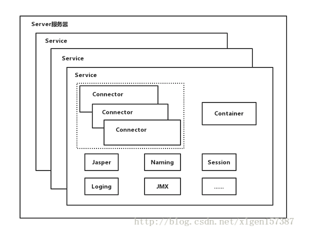

- Tomcat中只有一个Server，一个Server可以有多个Service，一个Service可以有多个Connector和一个Container；
- Server掌管着整个Tomcat的生死大权；
- Service 是对外提供服务的；
- Connector用于接受请求并将请求封装成Request和Response来具体处理；
- Container用于封装和管理Servlet，以及具体处理request请求；

## Tomcat的两个重要组件

连接器（Connector）负责对外交流，建立Socket连接，读取并解析网络字节流，生成Request和Response对象并转发给容器。
容器（Container）负责内部处理，加载和管理Servlet，通过Response对象的输出流写入响应结果。

### 基础组件默认实现

| 接口                                                       | 默认实现                                                     | 阀值                 |
| ---------------------------------------------------------- | ------------------------------------------------------------ | -------------------- |
| Server                                                     | StanderdServer                                               |                      |
| Service                                                    | StanderdService                                              |                      |
| Engine                                                     | StanderdEngine                                               | StandardEngineValve  |
| Host                                                       | StanderdHost                                                 | StandardHostValve    |
| Context                                                    | StanderdContext                                              | StandardContextValve |
|                                                            | StandardWrapper                                              | StandardWrapperValve |
| Endpoint组件没有接口<br />但提供一个抽象类AbstractEndpoint | `<Connector protocol="HTTP/1.1"/>`<br />使用NioEndpoint      |                      |
| ProtocolHandler                                            | `<Connector protocol="HTTP/1.1"/>`<br />使用Http11NioProtocol |                      |
| Processor                                                  | `<Connector protocol="HTTP/1.1"/>`<br />使用Http11Processor  |                      |

## Connector基本结构

**对应Connector中的三个组件就是：Endpoint、Processor、Adapter，其中 Endpoint和 Processor放在一起抽象成了 ProtocolHandler协议组件。**

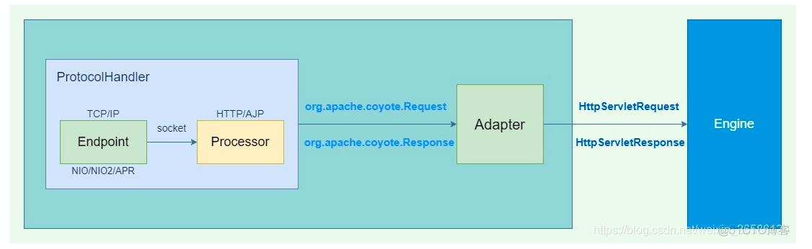


## ProtocolHandler

**ProtocolHandler负责传输层网络连接和应用层协议解析，由两个核心部件 Endpoint和 Processor具体做这两件事。**

- Tomcat的连接器主要支持两种协议：HTTP/1.1协议和AJP协议，实则还支持HTTP/2.0协议

- 还分别支持3种I/O方式：NIO、NIO2、APR

  *总结：两两组合就出现了很多实现类：Http11NioProtocol、Http11Nio2Protocol、Http11AprProtocol（已过期）、AjpNioProtocol、AjpNio2Protocol、AjpAjpProtocol*

  

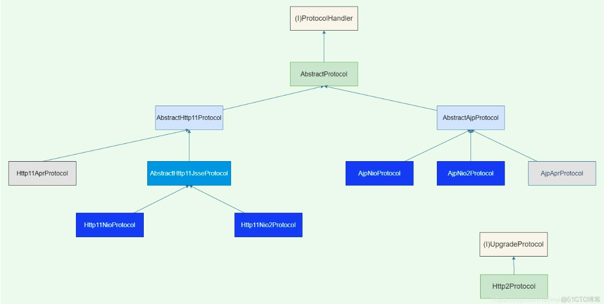


### EndPoint通信端点

Endpoint负责网络通信，监听一个端口，循环接收socket请求，读取网络字节流等。Endpoint不是接口，而是提供了一个抽象类AbstractEndpoint，又根据I/O方式提供了若干实现类：

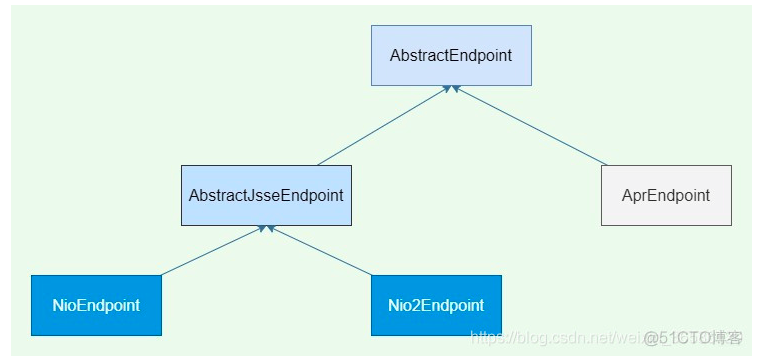

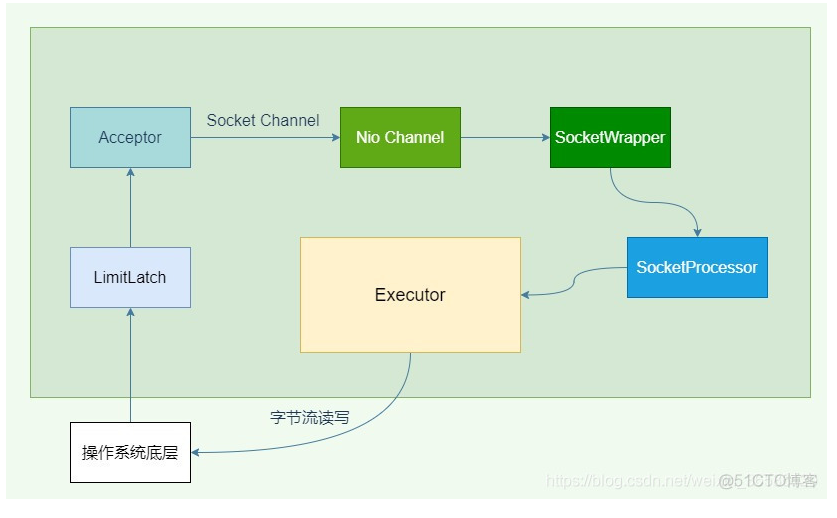


### Processor应用层协议解析

Acceptor接收到请求封装成一个SocketProcessor扔进线程池Executor后，会调用Processor从操作系统底层读取、过滤字节流，对应用层协议（HTTP/AJP）进行解析封装，生成org.apache.coyote.Request和org.apache.coyote.Response对象。不同的协议有不同的Processor，HTTP/1.1对应Http11Processor，AJP对应AjpProcessor，HTTP/1.2对应StreamProcessor，UpgradeProcessorInternal 和 UpgradeProcessorExternal用于协议升级：

### ConnectionHandler创建合适的Processor

SocketProcessor并不是直接调用的Processor，而是通过org.apache.coyote.AbstractProtocol.ConnectionHandler#process找到一个合适的Processor进行请求处理：

- 根据不同协议创建Http11Processor or AjpProcessor；
- 根据协议升级是内部升级（HTTP/2.0）还是外部升级创建UpgradeProcessorInternal or UpgradeProcessorExternal。

### 配置方式

```html
<Connector port="8080" protocol="HTTP/1.1" 
           connectionTimeout="20000" 
           executor="tomcatThreadPool" 
           redirectPort="8443">
     <UpgradeProtocol className="org.apache.coyote.http2.Http2Protocol"/>
</Connector>
```

- port是Connector监听的端口。
- protocol是应用层协议名，可填参数有HTTP/1.1、org.apache.coyote.http11.Http11NioProtocol、AJP/1.3、org.apache.coyote.ajp.AjpNioProtocol，如果protocol不填，则默认为Http11NioProtocol。
- connectionTimeout表示Connector读数据（长连接的超时时间）、写数据的超时时间（因为tomcat是服务器端所以不涉及创建连接的超时），单位毫秒，默认20秒。
- executor表示使用一个共享线程池，若使用私有线程池，则executor不需要指定，私有线程池可选参数有minSpareThreads=“10”、maxThreads=“200”等
- redirectPort表示非SSL重定向到SSL端口，当请求是non-SSL请求，但是接收到的请求内容需要SSL传输，则重定向到SSL端口。

## 其他重要的组件

### Adapter

**Adapter接口只有一个实现类org.apache.catalina.connector.CoyoteAdapter，其主要职责如下：**

- 将org.apache.coyote.Request和org.apache.coyote.Response转为实现了标准Servlet的org.apache.catalina.connector.Request和org.apache.catalina.connector.Response。
- 将请求体的serverName、URI、version传给Mapper组件做映射，匹配到合适的Host、Context、Wrapper。
- 将Request和Response传给Container处理，Engine通过管道Pipeline传给Host，Host再传给Context，Context再传给Wrapper，Wrapper是最终的Servlet。

### Lifecycle接口

Tomcat所有的组件均存在初始化、启动、停止等生命周期方法，拥有生命周期管理的特性， 所以Tomcat在设计的时候， 基于生命周期管理抽象成了一个接口 Lifecycle 。而组件 Server、Service、Container、Executor、Connector 、WebappLoader、WebappClassLoader组件 ， 都实现了一个生命周期的接口。

**生命周期中的核心方法**

- init（）：初始化组件
- start（）：启动组件
- stop（）：停止组件
- destroy（）：销毁组件

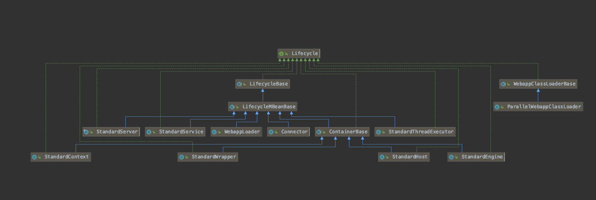

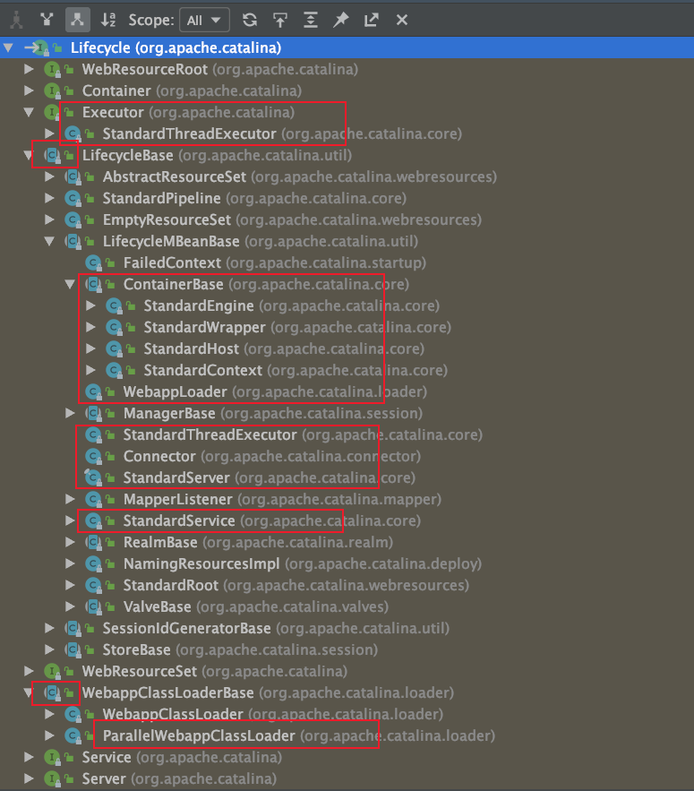

### LifecycleListener接口

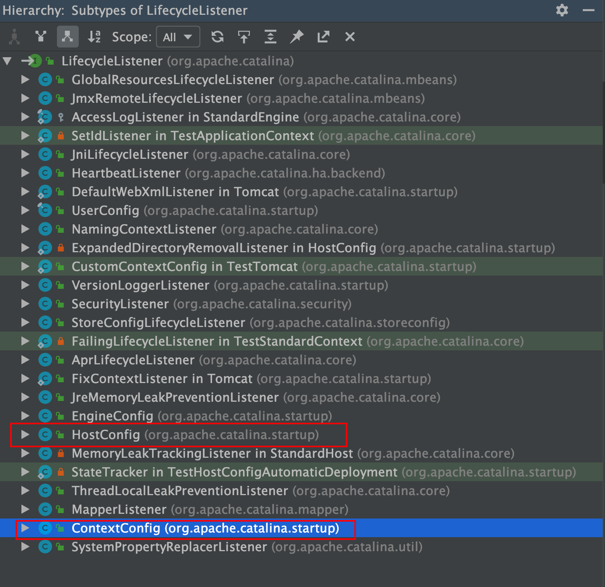

## 启动流程


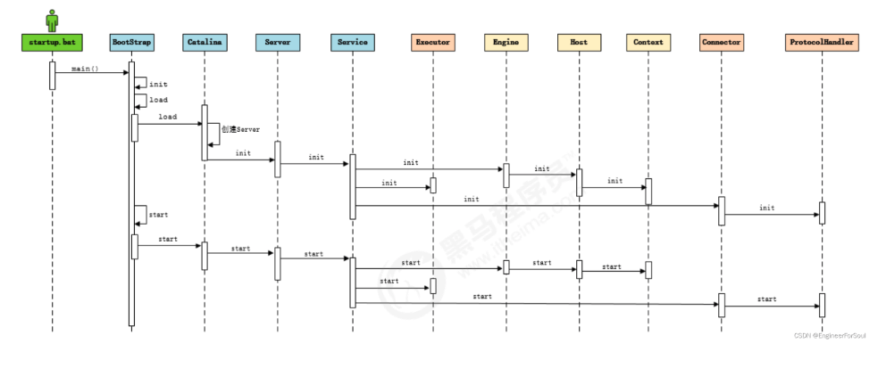

**启动步骤**

1. 启动tomcat ， 需要调用 bin/startup.bat (在linux 目录下 , 需要调用 bin/startup.sh) ， 在startup.bat 脚本中, 调用了catalina.bat。
   在catalina.bat 脚本文件中，调用了BootStrap 中的main方法。

2. 在BootStrap 的main 方法中调用了 init 方法 ， 来创建Catalina 及 初始化类加载器。

3. 在BootStrap 的main 方法中调用了 load 方法 ， 在其中又调用了Catalina的load方 法。

4. 在Catalina 的load 方法中 , 需要进行一些初始化的工作

   1. 解析 XML，填充到StandardServer中，包含StandardService、Connector、StandardEngine、Mapper、MapperListener等等；

   2. 重定向日志输出路径

   3. 将很多组件注册到JMX（全称为“Java Management Extension”，即Java管理扩展）中。注册后可以通过Jconsole获取属性，对象等监控信息。IDEA debug tomcat应用的时候利用JMX技术调用org.apache.catalina.mbeans.MBeanFactory#createStandardContext(java.lang.String, java.lang.String, java.lang.String)来初始化StandardContext，如下：

      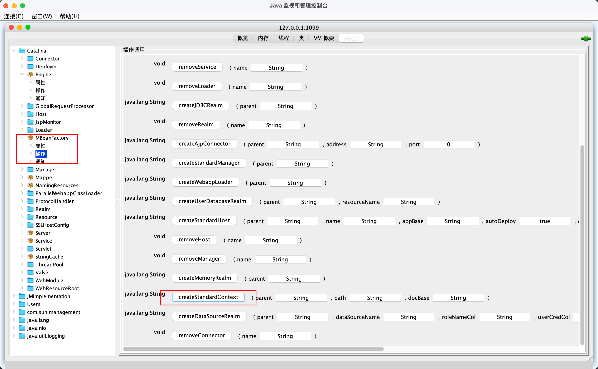

5. 在context的start方法中

   1. 调用流程如上图所示，不同的是StandardHost通过发送LifecycleState#STARTING事件给HostConfig->HostConfig.start()->HostConfig.deployApps()来部署app->StandardContext.startInternal来部署Context
   2. StandardContext.startInternal中的操作
      1. 实例化StandardRoot
      2. 调StandardRoot.startInternal初始化该context要加载的资源
      3. 实例化WebappLoader
      4. 调WebappLoader.startInternal初始化该context的类加载器ParallelWebappClassLoader
      5. 利用 ContextConfig.lifecycleEvent 解析 web.xml，其中利用类加载器ParallelWebappClassLoader来实例化ServletContainerInitializer（SpringBoot利用这个特性不使用web.xml）
      6. 实例化DefaultInstanceManager，在DefaultInstanceManager保存了tomcatClassLoader：commonClassLoader和context应用类加载器：ParallelWebappClassLoader
      7. 调用 ServletContainerInitializer.onStartup 方法
      8. 委托DefaultInstanceManager使用ParallelWebappClassLoader来实例化EventListener, 并调用ServletContextListener的contextInitialized方法
      9. 委托DefaultInstanceManager使用ParallelWebappClassLoader来实例化Filter, 并调用Filter的init方法
      10. 委托DefaultInstanceManager使用ParallelWebappClassLoader来实例化配置了load-on-startup属性的Servlet,并调用Servlet.init方法


## 请求的完整流程

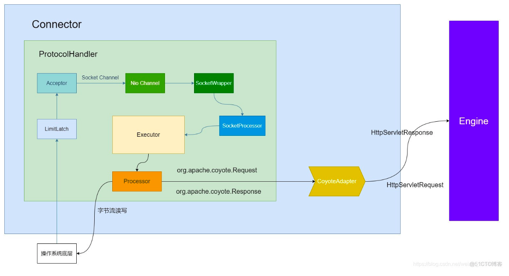

## 参考

- https://blog.51cto.com/stefanxfy/4722102
- https://blog.csdn.net/xlgen157387/article/details/79006434
- https://blog.csdn.net/lingyiwin/article/details/125428376