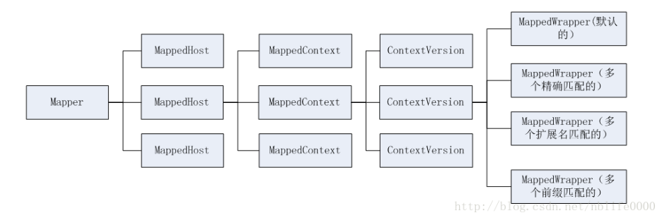

# Tomcat的url到wrapper的映射


[TOC]


## 简介

当用户发起一个请求时，tomcat是如何将url映射到具体的Wrapper上的呢，就这是本文要阐述的问题。

与url到Wrapper映射相关的类位于org.apache.catalina.mapper包下，包含四个类：

Mapper:映射关系最核心的、最重要的类。完成url与Host，Context，Wrapper映射关系的初始化、变更、存储及映射
MapperListener：实现了ContainerListener与 LifecycleListener接口，监听tomcat组件的变化，当有Host，Context及Wrapper变更时，调用Mapper相关方法，增加或者删除Host，Context，Wrapper等。
MappingData:url映射后的数据，表示一个url具体映射到哪个host，哪个context，哪个wrapper上。
WrapperMappingInfo：表示一个Wrapper的信息，是一个普通的类，不太重要。
本文章主要介绍Mapper，对其中用到的MapperingData做简要介绍。

Mapper主要功能是完成url到Wrapper的映射，有三个主要的功能
1. 映射关系存储：存储所有的Host，context及Wrapper的对应关系；
2. 映射关系初始化及变更：当新增一个组件或者移除一个组件时，mapper如何维护url到Wrapper的映射关系；
3. 映射关系使用：根据url，映射到具体的host，context和wrapper。


## Mapper解析

### Mapper的重要属性

```java
// 定义所有的Host组合，表示一个Engine下所有Host
volatile MappedHost[] hosts = new MappedHost[0];
```

### MapperHost的重要属性

```java
// 包含的Context信息，其实内部是一个数组
public volatile ContextList contextList;
```

### ContextList的重要属性

```java
// 如在 MappedHost定义中提到的，这个里面存储的是一系列的 MapperContext
public final MappedContext[] contexts;
```

### MapperContext的重要属性

```java
// 一个MappedContext 中又有多个ContextVersion，表示多个版本的context
public volatile ContextVersion[] versions;
```

### ContextVersion的重要属性

```java
// 默认的 Wrapper
public MappedWrapper defaultWrapper = null;
// 精确匹配路径的 Wrapper
public MappedWrapper[] exactWrappers = new MappedWrapper[0];
// 通配符结束的 Wrapper
public MappedWrapper[] wildcardWrappers = new MappedWrapper[0];
// 扩展名匹配的 Wrapper
public MappedWrapper[] extensionWrappers = new MappedWrapper[0];
```

### MappperWrapper、ContextVersion、MapperHost的重要属性

```java
// 去除匹配规则的name
public final String name;
// 真实的Wrapper: 可能是StandardHost、StandardContext、StandardWrapper
public final T object;
```

### 小结

从定义可以看出，Mapper中包含了这个Engine中所有的映射关系，首先包含了多个MapperHost，MapperHost分两类，一个是real MapperHost，另一类是 alias的MapperHost。每一个MapperHost都包含有多个MappedContext，代表不同的Context，每一个MappedContext又有多个ContextVersion，表示每一个Context的不同的版本号，这样在请求参数中可以带版本号进行请求，每一个ContextVersion可以包含一个默认MapperWrapper，多个精确匹配的Wrapper，多个扩展名匹配的Wrapper，多个通配符匹配的Wrapper，这其中多种不同的Wrapper就是根据web.xml中的servlet的 url－pattern不同类型确定的。

## 映射关系的初始化

### org.apache.catalina.core.StandardService#startInternal方法

```java
protected void startInternal() throws LifecycleException {

    if(log.isInfoEnabled())
        log.info(sm.getString("standardService.start.name", this.name));
    setState(LifecycleState.STARTING);

    // Start our defined Container first
    if (engine != null) {
        synchronized (engine) {
            engine.start();
        }
    }

    synchronized (executors) {
        for (Executor executor: executors) {
            executor.start();
        }
    }

    // 在Mapper中添加host的映射关系
    mapperListener.start();

    // Start our defined Connectors second
    synchronized (connectorsLock) {
        for (Connector connector: connectors) {
            try {
                // If it has already failed, don't try and start it
                if (connector.getState() != LifecycleState.FAILED) {
                    connector.start();
                }
            } catch (Exception e) {
                log.error(sm.getString(
                        "standardService.connector.startFailed",
                        connector), e);
            }
        }
    }
}
```


### org.apache.catalina.mapper.MapperListener#startInternal方法


```java
public void startInternal() throws LifecycleException {

    setState(LifecycleState.STARTING);

    Engine engine = service.getContainer();
    if (engine == null) {
        return;
    }

    findDefaultHost();

    addListeners(engine);

    Container[] conHosts = engine.findChildren();
    for (Container conHost : conHosts) {
        Host host = (Host) conHost;
        if (!LifecycleState.NEW.equals(host.getState())) {
            // Registering the host will register the context and wrappers
            // 注册 Host 到 Mapper 中
            registerHost(host);
        }
    }
}
```
### org.apache.catalina.mapper.MapperListener#registerHost方法

```java
private void registerHost(Host host) {

    String[] aliases = host.findAliases();
    // 在 mapper 中添加 MapperHost
    mapper.addHost(host.getName(), aliases, host);

    for (Container container : host.findChildren()) {
        if (container.getState().isAvailable()) {
            // 将 context 添加到 MapperHost 中
            registerContext((Context) container);
        }
    }
    if(log.isDebugEnabled()) {
        log.debug(sm.getString("mapperListener.registerHost",
                host.getName(), domain, service));
    }
}
```


### org.apache.catalina.mapper.MapperListener#registerContext方法

```java
private void registerContext(Context context) {

    String contextPath = context.getPath();
    if ("/".equals(contextPath)) {
        contextPath = "";
    }
    Host host = (Host)context.getParent();

    WebResourceRoot resources = context.getResources();
    String[] welcomeFiles = context.findWelcomeFiles();
    List<WrapperMappingInfo> wrappers = new ArrayList<>();

    for (Container container : context.findChildren()) {
        // 准备 standardWrapper 添加到 standardContext中
        prepareWrapperMappingInfo(context, (Wrapper) container, wrappers);

        if(log.isDebugEnabled()) {
            log.debug(sm.getString("mapperListener.registerWrapper",
                    container.getName(), contextPath, service));
        }
    }

    // 添加 contextVersion 到 MapperHost 中
    mapper.addContextVersion(host.getName(), host, contextPath,
            context.getWebappVersion(), context, welcomeFiles, resources,
            wrappers);

    if(log.isDebugEnabled()) {
        log.debug(sm.getString("mapperListener.registerContext",
                contextPath, service));
    }
}
```

### org.apache.catalina.mapper.Mapper#addContextVersion方法

```java
public void addContextVersion(String hostName, Host host, String path,
        String version, Context context, String[] welcomeResources,
        WebResourceRoot resources, Collection<WrapperMappingInfo> wrappers) {

    hostName = renameWildcardHost(hostName);

    MappedHost mappedHost  = exactFind(hosts, hostName);
    if (mappedHost == null) {
        addHost(hostName, new String[0], host);
        mappedHost = exactFind(hosts, hostName);
        if (mappedHost == null) {
            log.error("No host found: " + hostName);
            return;
        }
    }
    if (mappedHost.isAlias()) {
        log.error("No host found: " + hostName);
        return;
    }
    int slashCount = slashCount(path);
    synchronized (mappedHost) {
        ContextVersion newContextVersion = new ContextVersion(version,
                path, slashCount, context, resources, welcomeResources);
        if (wrappers != null) {
            // 添加 MapperWrapper 到 MappedContext 中
            addWrappers(newContextVersion, wrappers);
        }

        ContextList contextList = mappedHost.contextList;
        MappedContext mappedContext = exactFind(contextList.contexts, path);
        if (mappedContext == null) {
            mappedContext = new MappedContext(path, newContextVersion);
            // 添加 MappedContext 到 contextList 中
            ContextList newContextList = contextList.addContext(
                    mappedContext, slashCount);
            if (newContextList != null) {
                // 添加 contextList 到 MapperHost 中
                updateContextList(mappedHost, newContextList);
                contextObjectToContextVersionMap.put(context, newContextVersion);
            }
        } else {
            ContextVersion[] contextVersions = mappedContext.versions;
            ContextVersion[] newContextVersions = new ContextVersion[contextVersions.length + 1];
            if (insertMap(contextVersions, newContextVersions,
                    newContextVersion)) {
                mappedContext.versions = newContextVersions;
                contextObjectToContextVersionMap.put(context, newContextVersion);
            } else {
                // Re-registration after Context.reload()
                // Replace ContextVersion with the new one
                int pos = find(contextVersions, version);
                if (pos >= 0 && contextVersions[pos].name.equals(version)) {
                    contextVersions[pos] = newContextVersion;
                    contextObjectToContextVersionMap.put(context, newContextVersion);
                }
            }
        }
    }
}
```

### org.apache.catalina.mapper.Mapper#addWrappers()方法

```java
private void addWrappers(ContextVersion contextVersion,
        Collection<WrapperMappingInfo> wrappers) {
    for (WrapperMappingInfo wrapper : wrappers) {
        // 将 MappedWrapper 添加到 contextVersion 中
        addWrapper(contextVersion, wrapper.getMapping(),
                wrapper.getWrapper(), wrapper.isJspWildCard(),
                wrapper.isResourceOnly());
    }
}
```

## 结论

  一个Ｍapper中，应该保存有多个Ｈost对象（的确是这样的，每个Ｈost对象称之为ＭappedＨost，多个ＭappedＨost以数组形式组合，各元素通过其name进行排序）
一个Ｈost对象包含多个context（Context在Mapper中定义为MappedContext，也是通过数组形式存在，并且元素根据ＭappedContext的命名排序。但是与组件不同的是，每一个Context可以有多个版本，因此每一个MappedContext 包含了多个ContextVersion，每一个MappedContext下的多个ContextVersion表示同一个Context的多个版本）
一个Context包含多个Wrapper（此处的Context在Mapper中为ContextVersion，包含多个Wrapper，这些Wrapper分成四类，精确匹配的Wrapper，前缀匹配的Wrapper，扩展名匹配的Wrapper，默认的Wrapper，在Mapper中，每一个Wrapper都通过一个MappedWrapper表示）
因此，Mapper的构成可以用下图表示



  

  ## 参考

  - https://blog.csdn.net/nblife0000/article/details/60364847