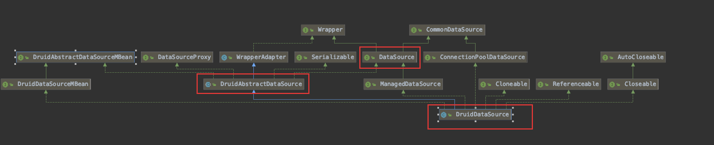
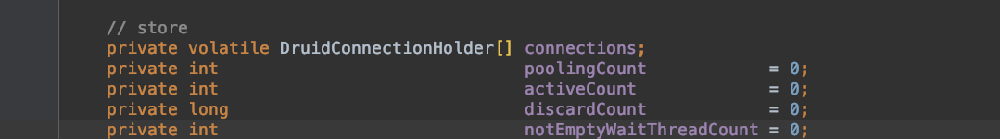
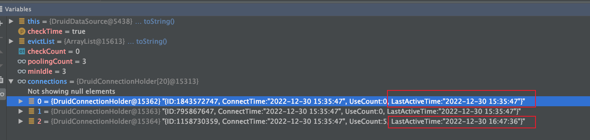
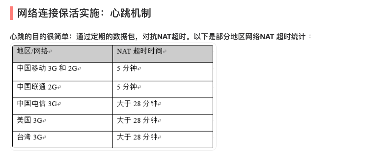

# Druid数据连接池源码分析


[TOC]

## 简介

本文从连接池初始化，从连接池获取连接以及把连接close，连接的保活的源码的角度来分析连接池。本文参考的主要是1.0.9版本，以及1.2.8版本


## 数据结构

主要的类***DruidDataSource***




使用数组来组成栈来实现 *DataSource* 的*getConnnection()* 以及 *close()* 操作



- 使用DruidConnectionHolder[] connections存放连接，
- poolingCount的增加以及减少来实现stack的操作来实现*getConnnection()* 以及 *close()* 操作

## Druid的初始化

```java
public void init() throws SQLException {
  if (inited) {
    return;
  }

  final ReentrantLock lock = this.lock;
  try {
    lock.lockInterruptibly();
  } catch (InterruptedException e) {
    throw new SQLException("interrupt", e);
  }

  boolean init = false;
  try {
    if (inited) {
      return;
    }

    init = true;

    initStackTrace = Utils.toString(Thread.currentThread().getStackTrace());

    this.id = DruidDriver.createDataSourceId();
    if (this.id > 1) {
      long delta = (this.id - 1) * 100000;
      this.connectionIdSeed.addAndGet(delta);
      this.statementIdSeed.addAndGet(delta);
      this.resultSetIdSeed.addAndGet(delta);
      this.transactionIdSeed.addAndGet(delta);
    }

    if (this.jdbcUrl != null) {
      this.jdbcUrl = this.jdbcUrl.trim();
      initFromWrapDriverUrl();
    }

    if (this.dbType == null || this.dbType.length() == 0) {
      this.dbType = JdbcUtils.getDbType(jdbcUrl, null);
    }

    for (Filter filter : filters) {
      filter.init(this);
    }

    if (JdbcConstants.MYSQL.equals(this.dbType) || //
        JdbcConstants.MARIADB.equals(this.dbType)) {
      boolean cacheServerConfigurationSet = false;
      if (this.connectProperties.containsKey("cacheServerConfiguration")) {
        cacheServerConfigurationSet = true;
      } else if (this.jdbcUrl.indexOf("cacheServerConfiguration") != -1) {
        cacheServerConfigurationSet = true;
      }
      if (cacheServerConfigurationSet) {
        this.connectProperties.put("cacheServerConfiguration", "true");
      }
    }

    if (maxActive <= 0) {
      throw new IllegalArgumentException("illegal maxActive " + maxActive);
    }

    if (maxActive < minIdle) {
      throw new IllegalArgumentException("illegal maxActive " + maxActive);
    }

    if (getInitialSize() > maxActive) {
      throw new IllegalArgumentException("illegal initialSize " + this.initialSize + ", maxActieve "
                                         + maxActive);
    }

    if (timeBetweenLogStatsMillis > 0 && useGlobalDataSourceStat) {
      throw new IllegalArgumentException("timeBetweenLogStatsMillis not support useGlobalDataSourceStat=true");
    }

    if (this.driverClass != null) {
      this.driverClass = driverClass.trim();
    }

    initFromSPIServiceLoader();

    if (this.driver == null) {
      if (this.driverClass == null || this.driverClass.isEmpty()) {
        this.driverClass = JdbcUtils.getDriverClassName(this.jdbcUrl);
      }

      if (MockDriver.class.getName().equals(driverClass)) {
        driver = MockDriver.instance;
      } else {
        driver = JdbcUtils.createDriver(driverClassLoader, driverClass);
      }
    } else {
      if (this.driverClass == null) {
        this.driverClass = driver.getClass().getName();
      }
    }

    initCheck();

    initExceptionSorter();
    // 初始化ConnectionChecker
    initValidConnectionChecker();
    validationQueryCheck();

    if (isUseGlobalDataSourceStat()) {
      dataSourceStat = JdbcDataSourceStat.getGlobal();
      if (dataSourceStat == null) {
        dataSourceStat = new JdbcDataSourceStat("Global", "Global", this.dbType);
        JdbcDataSourceStat.setGlobal(dataSourceStat);
      }
      if (dataSourceStat.getDbType() == null) {
        dataSourceStat.setDbType(this.getDbType());
      }
    } else {
      dataSourceStat = new JdbcDataSourceStat(this.name, this.jdbcUrl, this.dbType, this.connectProperties);
    }
    dataSourceStat.setResetStatEnable(this.resetStatEnable);

    connections = new DruidConnectionHolder[maxActive];

    SQLException connectError = null;

    try {
      // init connections
      for (int i = 0, size = getInitialSize(); i < size; ++i) {
        // 初始化创建连接，填充到连接池的池子中
        Connection conn = createPhysicalConnection();
        DruidConnectionHolder holder = new DruidConnectionHolder(this, conn);
        connections[poolingCount] = holder;
        incrementPoolingCount();
      }

      if (poolingCount > 0) {
        poolingPeak = poolingCount;
        poolingPeakTime = System.currentTimeMillis();
      }
    } catch (SQLException ex) {
      LOG.error("init datasource error", ex);
      connectError = ex;
    }

    createAndLogThread();
    // 启动创建connection的连接
    createAndStartCreatorThread();
    // 启动销毁connetion的连接
    createAndStartDestroyThread();

    initedLatch.await();

    initedTime = new Date();
    registerMbean();

    if (connectError != null && poolingCount == 0) {
      throw connectError;
    }
  } catch (SQLException e) {
    LOG.error("dataSource init error", e);
    throw e;
  } catch (InterruptedException e) {
    throw new SQLException(e.getMessage(), e);
  } finally {
    inited = true;
    lock.unlock();

    if (init && LOG.isInfoEnabled()) {
      LOG.info("{dataSource-" + this.getID() + "} inited");
    }
  }
}
```

### 创建初始化大小的数据库连接

```java
// 初始化创建连接，得到真正的connection
public Connection createPhysicalConnection() throws SQLException {
  String url = this.getUrl();
  Properties connectProperties = getConnectProperties();

  String user;
  if (getUserCallback() != null) {
    user = getUserCallback().getName();
  } else {
    user = getUsername();
  }

  String password = getPassword();
  PasswordCallback passwordCallback = getPasswordCallback();

  if (passwordCallback != null) {
    if (passwordCallback instanceof DruidPasswordCallback) {
      DruidPasswordCallback druidPasswordCallback = (DruidPasswordCallback) passwordCallback;

      druidPasswordCallback.setUrl(url);
      druidPasswordCallback.setProperties(connectProperties);
    }

    char[] chars = passwordCallback.getPassword();
    if (chars != null) {
      password = new String(chars);
    }
  }

  Properties physicalConnectProperties = new Properties();
  if (connectProperties != null) {
    physicalConnectProperties.putAll(connectProperties);
  }

  if (user != null && user.length() != 0) {
    physicalConnectProperties.put("user", user);
  }

  if (password != null && password.length() != 0) {
    physicalConnectProperties.put("password", password);
  }

  Connection conn;

  long startNano = System.nanoTime();

  try {
    // 使用jdbc真正的创建连接
    conn = createPhysicalConnection(url, physicalConnectProperties);

    if (conn == null) {
      throw new SQLException("connect error, url " + url + ", driverClass " + this.driverClass);
    }

    initPhysicalConnection(conn);

    // 校验连接的有效性，使用MySqlValidConnectionChecker
    validateConnection(conn);
    createError = null;
  } catch (SQLException ex) {
    createErrorCount.incrementAndGet();
    createError = ex;
    lastCreateError = ex;
    lastCreateErrorTimeMillis = System.currentTimeMillis();
    throw ex;
  } catch (RuntimeException ex) {
    createErrorCount.incrementAndGet();
    createError = ex;
    lastCreateError = ex;
    lastCreateErrorTimeMillis = System.currentTimeMillis();
    throw ex;
  } catch (Error ex) {
    createErrorCount.incrementAndGet();
    throw ex;
  } finally {
    long nano = System.nanoTime() - startNano;
    createTimespan += nano;
  }

  return conn;
}
```


### 初始化创建connection的连接的线程

```java
protected void createAndStartCreatorThread() {
    if (createScheduler == null) {
        String threadName = "Druid-ConnectionPool-Create-" + System.identityHashCode(this);
        createConnectionThread = new CreateConnectionThread(threadName);
        createConnectionThread.start();
        return;
    }

    initedLatch.countDown();
}
```

```java
public class CreateConnectionThread extends Thread {

    public CreateConnectionThread(String name){
        super(name);
        this.setDaemon(true);
    }

    public void run() {
        initedLatch.countDown();

        int errorCount = 0;
        for (;;) {
            // addLast
            try {
                lock.lockInterruptibly();
            } catch (InterruptedException e2) {
                break;
            }

            try {
                // 必须存在线程等待，才创建连接
                if (poolingCount >= notEmptyWaitThreadCount) {
                    empty.await();
                }

                // 防止创建超过maxActive数量的连接
                if (activeCount + poolingCount >= maxActive) {
                    empty.await();
                    continue;
                }

            } catch (InterruptedException e) {
                lastCreateError = e;
                lastErrorTimeMillis = System.currentTimeMillis();
                break;
            } finally {
                lock.unlock();
            }

            Connection connection = null;

            try {
                connection = createPhysicalConnection();
            } catch (SQLException e) {
                LOG.error("create connection error", e);

                errorCount++;

                if (errorCount > connectionErrorRetryAttempts && timeBetweenConnectErrorMillis > 0) {
                    if (breakAfterAcquireFailure) {
                        break;
                    }

                    try {
                        Thread.sleep(timeBetweenConnectErrorMillis);
                    } catch (InterruptedException interruptEx) {
                        break;
                    }
                }
            } catch (RuntimeException e) {
                LOG.error("create connection error", e);
                continue;
            } catch (Error e) {
                LOG.error("create connection error", e);
                break;
            }

            if (connection == null) {
                continue;
            }

            put(connection);

            errorCount = 0; // reset errorCount
        }
    }
}
```

将连接放入到stack顶

```java
protected void put(Connection connection) {
    DruidConnectionHolder holder = null;
    try {
        holder = new DruidConnectionHolder(DruidDataSource.this, connection);
    } catch (SQLException ex) {
        LOG.error("create connection holder error", ex);
        return;
    }

    lock.lock();
    try {
        connections[poolingCount] = holder;
        incrementPoolingCount();

        if (poolingCount > poolingPeak) {
            poolingPeak = poolingCount;
            poolingPeakTime = System.currentTimeMillis();
        }

        notEmpty.signal();
        notEmptySignalCount++;

        if (createScheduler != null) {
            createTaskCount--;

            if (poolingCount + createTaskCount < notEmptyWaitThreadCount //
                && activeCount + poolingCount + createTaskCount < maxActive) {
                emptySignal();
            }
        }
    } finally {
        lock.unlock();
    }
}
```


### 初始化启动销毁connetion的连接的线程

```java
protected void createAndStartDestroyThread() {
    destoryTask = new DestroyTask();

    if (destroyScheduler != null) {
        long period = timeBetweenEvictionRunsMillis;
        if (period <= 0) {
            period = 1000;
        }
        destroySchedulerFuture = destroyScheduler.scheduleAtFixedRate(destoryTask, period, period,
                                                                      TimeUnit.MILLISECONDS);
        initedLatch.countDown();
        return;
    }

    String threadName = "Druid-ConnectionPool-Destroy-" + System.identityHashCode(this);
    destroyConnectionThread = new DestroyConnectionThread(threadName);
    destroyConnectionThread.start();
}
```


```java
public class DestroyConnectionThread extends Thread {

    public DestroyConnectionThread(String name){
        super(name);
        this.setDaemon(true);
    }

    public void run() {
        initedLatch.countDown();

        for (;;) {
            // 从前面开始删除
            try {
                if (closed) {
                    break;
                }

                // 多长时间检测一次
                if (timeBetweenEvictionRunsMillis > 0) {
                    Thread.sleep(timeBetweenEvictionRunsMillis);
                } else {
                    Thread.sleep(1000); //
                }

                if (Thread.interrupted()) {
                    break;
                }

                destoryTask.run();
            } catch (InterruptedException e) {
                break;
            }
        }
    }

}
```

```java
public class DestroyTask implements Runnable {

    @Override
    public void run() {
        shrink(true);

        if (isRemoveAbandoned()) {
            removeAbandoned();
        }
    }

}
```

使用shrink方法进行探活

### 小结

创建initialSize大小的连接，在timeBetweenEvictionRunsMillis检测一次，使用shrink方法进行探活，探活原理见下文

## 校验连接的有效性

```java
private void initValidConnectionChecker() {
  if (this.validConnectionChecker != null) {
    return;
  }

  String realDriverClassName = driver.getClass().getName();
  if (JdbcUtils.isMySqlDriver(realDriverClassName)) {
    // mysql使用的是这个connectionChecker
    this.validConnectionChecker = new MySqlValidConnectionChecker();

  } else if (realDriverClassName.equals(JdbcConstants.ORACLE_DRIVER)
             || realDriverClassName.equals(JdbcConstants.ORACLE_DRIVER2)) {
    this.validConnectionChecker = new OracleValidConnectionChecker();

  } else if (realDriverClassName.equals(JdbcConstants.SQL_SERVER_DRIVER)
             || realDriverClassName.equals(JdbcConstants.SQL_SERVER_DRIVER_SQLJDBC4)
             || realDriverClassName.equals(JdbcConstants.SQL_SERVER_DRIVER_JTDS)) {
    this.validConnectionChecker = new MSSQLValidConnectionChecker();

  } else if (realDriverClassName.equals(JdbcConstants.POSTGRESQL_DRIVER)
             || realDriverClassName.equals(JdbcConstants.ENTERPRISEDB_DRIVER)) {
    this.validConnectionChecker = new PGValidConnectionChecker();
  }
}
```

```java
// 校验连接是否有效
public boolean isValidConnection(Connection conn, String validateQuery, int validationQueryTimeout) {
  try {
    if (conn.isClosed()) {
      return false;
    }
  } catch (SQLException ex) {
    // skip
    return false;
  }

  // mysql默认是true
  if (usePingMethod) {
    if (conn instanceof DruidPooledConnection) {
      conn = ((DruidPooledConnection) conn).getConnection();
    }

    if (conn instanceof ConnectionProxy) {
      conn = ((ConnectionProxy) conn).getRawObject();
    }

    if (clazz.isAssignableFrom(conn.getClass())) {
      try {
        // 通过反射调com.mysql.jdbc.Connection.ping()方法，
        ping.invoke(conn);
        return true;
      } catch (InvocationTargetException e) {
        Throwable cause = e.getCause();
        if (cause instanceof SQLException) {
          return false;
        }

        LOG.warn("Unexpected error in ping", e);
        return false;
      } catch (Exception e) {
        LOG.warn("Unexpected error in ping", e);
        return false;
      }
    }
  }

  Statement stmt = null;
  ResultSet rs = null;
  try {
    stmt = conn.createStatement();
    if (validationQueryTimeout > 0) {
      stmt.setQueryTimeout(validationQueryTimeout);
    }
    rs = stmt.executeQuery(validateQuery);
    return true;
  } catch (SQLException e) {
    return false;
  } catch (Exception e) {
    LOG.warn("Unexpected error in ping", e);
    return false;
  } finally {
    JdbcUtils.close(rs);
    JdbcUtils.close(stmt);
  }

}

```

反射调用com.mysql.jdbc.Connection.ping()方法

```java
/**
 * Detect if the connection is still good by sending a ping command
 * to the server.
 * 
 * @throws SQLException if the ping fails
 */
public abstract void ping() throws SQLException;
```

### 小结

使用com.mysql.jdbc.Connection.ping()方法进行探活

## 获取连接以及连接的释放

### 连接池获取连接

获取connection的操作，调com.alibaba.druid.pool.DruidDataSource#getConnection()方法

```java

public DruidPooledConnection getConnection(long maxWaitMillis) throws SQLException {
	init();

	if (filters.size() > 0) {
		FilterChainImpl filterChain = new FilterChainImpl(this);
		return filterChain.dataSource_connect(this, maxWaitMillis);
	} else {
    // 真正获取connenction
		return getConnectionDirect(maxWaitMillis);
	}
}
```
真正获取connenction

```java
public DruidPooledConnection getConnectionDirect(long maxWaitMillis) throws SQLException {
	int notFullTimeoutRetryCnt = 0;
	for (;;) {
		// handle notFullTimeoutRetry
		DruidPooledConnection poolableConnection;
		try {
			poolableConnection = getConnectionInternal(maxWaitMillis);
		} catch (GetConnectionTimeoutException ex) {
			if (notFullTimeoutRetryCnt <= this.notFullTimeoutRetryCount && !isFull()) {
				notFullTimeoutRetryCnt++;
				if (LOG.isWarnEnabled()) {
					LOG.warn("not full timeout retry : " + notFullTimeoutRetryCnt);
				}
				continue;
			}
			throw ex;
		}

    // 是否在获得连接后检测其可用性，通常false
		if (isTestOnBorrow()) {
			boolean validate = testConnectionInternal(poolableConnection.getConnection());
			if (!validate) {
				if (LOG.isDebugEnabled()) {
					LOG.debug("skip not validate connection.");
				}

				Connection realConnection = poolableConnection.getConnection();
				discardConnection(realConnection);
				continue;
			}
		} else {
			Connection realConnection = poolableConnection.getConnection();
			if (realConnection.isClosed()) {
				discardConnection(null); // 传入null，避免重复关闭
				continue;
			}

      // 是否在连接空闲一段时间后检测其可用性，通常true
			if (isTestWhileIdle()) {
				final long currentTimeMillis = System.currentTimeMillis();
				final long lastActiveTimeMillis = poolableConnection.getConnectionHolder().getLastActiveTimeMillis();
				final long idleMillis = currentTimeMillis - lastActiveTimeMillis;
				long timeBetweenEvictionRunsMillis = this.getTimeBetweenEvictionRunsMillis();
				if (timeBetweenEvictionRunsMillis <= 0) {
					timeBetweenEvictionRunsMillis = DEFAULT_TIME_BETWEEN_EVICTION_RUNS_MILLIS;
				}

				if (idleMillis >= timeBetweenEvictionRunsMillis) {
					boolean validate = testConnectionInternal(poolableConnection.getConnection());
					if (!validate) {
						if (LOG.isDebugEnabled()) {
							LOG.debug("skip not validate connection.");
						}

						discardConnection(realConnection);
						continue;
					}
				}
			}
		}

    // 通常false，不校验activeConnection是否要移除，因为activeConnenction不涉及NAT网关清除长连接的问题
		if (isRemoveAbandoned()) {
			StackTraceElement[] stackTrace = Thread.currentThread().getStackTrace();
			poolableConnection.setConnectStackTrace(stackTrace);
			poolableConnection.setConnectedTimeNano();
			poolableConnection.setTraceEnable(true);

			synchronized (activeConnections) {
				activeConnections.put(poolableConnection, PRESENT);
			}
		}

		if (!this.isDefaultAutoCommit()) {
			poolableConnection.setAutoCommit(false);
		}

		return poolableConnection;
	}
}
```
从连接池中获取连接

```java
private DruidPooledConnection getConnectionInternal(long maxWait) throws SQLException {
  if (closed) {
    connectErrorCount.incrementAndGet();
    throw new DataSourceClosedException("dataSource already closed at " + new Date(closeTimeMillis));
  }

  if (!enable) {
    connectErrorCount.incrementAndGet();
    throw new DataSourceDisableException();
  }

  final long nanos = TimeUnit.MILLISECONDS.toNanos(maxWait);
  final int maxWaitThreadCount = getMaxWaitThreadCount();

  DruidConnectionHolder holder;
  try {
    lock.lockInterruptibly();
  } catch (InterruptedException e) {
    connectErrorCount.incrementAndGet();
    throw new SQLException("interrupt", e);
  }

  try {
    if (maxWaitThreadCount > 0) {
      if (notEmptyWaitThreadCount >= maxWaitThreadCount) {
        connectErrorCount.incrementAndGet();
        throw new SQLException("maxWaitThreadCount " + maxWaitThreadCount + ", current wait Thread count "
                               + lock.getQueueLength());
      }
    }

    connectCount++;

    if (maxWait > 0) {
      // 通常maxWait=-1,不走这里
      holder = pollLast(nanos);
    } else {
      // 从stack顶部获取connection，真正需要关注的点
      holder = takeLast();
    }

    if (holder != null) {
      activeCount++;
      if (activeCount > activePeak) {
        activePeak = activeCount;
        activePeakTime = System.currentTimeMillis();
      }
    }
  } catch (InterruptedException e) {
    connectErrorCount.incrementAndGet();
    throw new SQLException(e.getMessage(), e);
  } catch (SQLException e) {
    connectErrorCount.incrementAndGet();
    throw e;
  } finally {
    lock.unlock();
  }

  // maxWait设置了大于0的值的时候会走这里，通常不走这里
  if (holder == null) {
    long waitNanos = waitNanosLocal.get();

    StringBuilder buf = new StringBuilder();
    buf.append("wait millis ")//
      .append(waitNanos / (1000 * 1000))//
      .append(", active " + activeCount)//
      ;

    List<JdbcSqlStatValue> sqlList = this.getDataSourceStat().getRuningSqlList();
    for (int i = 0; i < sqlList.size(); ++i) {
      if (i != 0) {
        buf.append('\n');
      } else {
        buf.append(", ");
      }
      JdbcSqlStatValue sql = sqlList.get(i);
      buf.append("runningSqlCount ");
      buf.append(sql.getRunningCount());
      buf.append(" : ");
      buf.append(sql.getSql());
    }

    String errorMessage = buf.toString();

    if (this.createError != null) {
      throw new GetConnectionTimeoutException(errorMessage, createError);
    } else {
      throw new GetConnectionTimeoutException(errorMessage);
    }
  }

  holder.incrementUseCount();

  // 包装DruidConnectionHolder为DruidPooledConnection，所以close操作是在DruidPooledConnection里面的逻辑
  DruidPooledConnection poolalbeConnection = new DruidPooledConnection(holder);
  return poolalbeConnection;
}
```
优先获取栈顶的连接

```java

DruidConnectionHolder takeLast() throws InterruptedException, SQLException {
  try {
    while (poolingCount == 0) {
      emptySignal(); // send signal to CreateThread create connection
      notEmptyWaitThreadCount++;
      if (notEmptyWaitThreadCount > notEmptyWaitThreadPeak) {
        notEmptyWaitThreadPeak = notEmptyWaitThreadCount;
      }
      try {
        notEmpty.await(); // signal by recycle or creator
      } finally {
        notEmptyWaitThreadCount--;
      }
      notEmptyWaitCount++;

      if (!enable) {
        connectErrorCount.incrementAndGet();
        throw new DataSourceDisableException();
      }
    }
  } catch (InterruptedException ie) {
    notEmpty.signal(); // propagate to non-interrupted thread
    notEmptySignalCount++;
    throw ie;
  }

  // 获取stack顶部的connection
  decrementPoolingCount();
  DruidConnectionHolder last = connections[poolingCount];
  connections[poolingCount] = null;

  return last;
}
```

### 连接释放

获取连接是从连接池获取，释放连接是调`connection`的close时把连接放回到连接池中

```java
// 调com.alibaba.druid.pool.DruidPooledConnection#close的方法
public void close() throws SQLException {
  if (this.disable) {
    return;
  }

  DruidConnectionHolder holder = this.holder;
  if (holder == null) {
    if (dupCloseLogEnable) {
      LOG.error("dup close");
    }
    return;
  }

  DruidAbstractDataSource dataSource = holder.getDataSource();
  boolean isSameThread = this.getOwnerThread() == Thread.currentThread();

  if (!isSameThread) {
    dataSource.setAsyncCloseConnectionEnable(true);
  }

  if (dataSource.isAsyncCloseConnectionEnable()) {
    syncClose();
    return;
  }

  for (ConnectionEventListener listener : holder.getConnectionEventListeners()) {
    listener.connectionClosed(new ConnectionEvent(this));
  }


  List<Filter> filters = dataSource.getProxyFilters();
  if (filters.size() > 0) {
    FilterChainImpl filterChain = new FilterChainImpl(dataSource);
    filterChain.dataSource_recycle(this);
  } else {
    // 把连接放到连接池中
    recycle();
  }

  this.disable = true;
}

```
```java
public void recycle() throws SQLException {
  if (this.disable) {
    return;
  }

  DruidConnectionHolder holder = this.holder;
  if (holder == null) {
    if (dupCloseLogEnable) {
      LOG.error("dup close");
    }
    return;
  }

  if (!this.abandoned) {
    DruidAbstractDataSource dataSource = holder.getDataSource();
    // 把连接放入到连接池中
    dataSource.recycle(this);
  }

  this.holder = null;
  conn = null;
  transactionInfo = null;
  closed = true;
}
```
```java

protected void recycle(DruidPooledConnection pooledConnection) throws SQLException {
  final DruidConnectionHolder holder = pooledConnection.getConnectionHolder();

  if (holder == null) {
    LOG.warn("connectionHolder is null");
    return;
  }

  if (logDifferentThread //
      && (!isAsyncCloseConnectionEnable()) //
      && pooledConnection.getOwnerThread() != Thread.currentThread()//
     ) {
    LOG.warn("get/close not same thread");
  }

  final Connection physicalConnection = holder.getConnection();

  if (pooledConnection.isTraceEnable()) {
    synchronized (activeConnections) {
      if (pooledConnection.isTraceEnable()) {
        Object oldInfo = activeConnections.remove(pooledConnection);
        if (oldInfo == null) {
          if (LOG.isWarnEnabled()) {
            LOG.warn("remove abandonded failed. activeConnections.size " + activeConnections.size());
          }
        }
        pooledConnection.setTraceEnable(false);
      }
    }
  }

  final boolean isAutoCommit = holder.isUnderlyingAutoCommit();
  final boolean isReadOnly = holder.isUnderlyingReadOnly();
  final boolean testOnReturn = this.isTestOnReturn();

  try {
    // check need to rollback?
    if ((!isAutoCommit) && (!isReadOnly)) {
      pooledConnection.rollback();
    }

    // reset holder, restore default settings, clear warnings
    boolean isSameThread = pooledConnection.getOwnerThread() == Thread.currentThread();
    if (!isSameThread) {
      synchronized (pooledConnection) {
        holder.reset();
      }
    } else {
      holder.reset();
    }

    if (holder.isDiscard()) {
      return;
    }

    // 是否在连接放回连接池后检测其可用性，通常是false，不需要校验连接的有效性
    if (testOnReturn) {
      boolean validate = testConnectionInternal(physicalConnection);
      if (!validate) {
        JdbcUtils.close(physicalConnection);

        destroyCount.incrementAndGet();

        lock.lockInterruptibly();
        try {
          activeCount--;
          closeCount++;
        } finally {
          lock.unlock();
        }
        return;
      }
    }

    if (!enable) {
      discardConnection(holder.getConnection());
      return;
    }

    final long lastActiveTimeMillis = System.currentTimeMillis();
    lock.lockInterruptibly();
    try {
      activeCount--;
      closeCount++;

      // 把连接放入到连接池的stack的顶部
      putLast(holder, lastActiveTimeMillis);
      recycleCount++;
    } finally {
      lock.unlock();
    }
  } catch (Throwable e) {
    holder.clearStatementCache();

    if (!holder.isDiscard()) {
      this.discardConnection(physicalConnection);
      holder.setDiscard(true);
    }

    LOG.error("recyle error", e);
    recycleErrorCount.incrementAndGet();
  }
}

```


### 小结

连接的获取以及释放都是有限操作stack顶的连接，所以如果并发数较少的话，只有栈顶的元素的lastActiveTimeMillis是变化的。

## 连接保活-自动创建以及清除机制

### Druid-1.0.27之前的版本的保活机制

 探活机制

```java
public void shrink(boolean checkTime) {
  final List<DruidConnectionHolder> evictList = new ArrayList<DruidConnectionHolder>();
  try {
    lock.lockInterruptibly();
  } catch (InterruptedException e) {
    return;
  }

  try {
    // 池里面的连接数-最小空闲连接数，最少空闲连接数内的连接不进行探活，所以存在问题
    final int checkCount = poolingCount - minIdle;
    final long currentTimeMillis = System.currentTimeMillis();
    for (int i = 0; i < checkCount; ++i) {
      DruidConnectionHolder connection = connections[i];

      if (checkTime) {
        long idleMillis = currentTimeMillis - connection.getLastActiveTimeMillis();
        if (idleMillis >= minEvictableIdleTimeMillis) {
          evictList.add(connection);
        } else {
          break;
        }
      } else {
        evictList.add(connection);
      }
    }

    int removeCount = evictList.size();
    // 把minEvictableIdleTimeMillis时间没有活跃的线程从connetions池里移除
    // 原因：由于ISP的NAT网关清除一段时间内不使用的连接的存在，可能导致该长连接失效，mysql默认的长连接的超时时间是8小时
    if (removeCount > 0) {
      System.arraycopy(connections, removeCount, connections, 0, poolingCount - removeCount);
      Arrays.fill(connections, poolingCount - removeCount, poolingCount, null);
      poolingCount -= removeCount;
    }
  } finally {
    lock.unlock();
  }

  for (DruidConnectionHolder item : evictList) {
    // 移除的连接进行关闭
    Connection connection = item.getConnection();
    JdbcUtils.close(connection);
    destroyCount.incrementAndGet();
  }
}


```




这里面出现一个问题：在并发量比较低的时候，minIdle数量内的连接可能存在由于NAT的存在（有的数据库可能是负载均衡，例如京东的Jed）已经被干掉啦，但是客户端连接池里面依然有这个连接，当并发忽然高的时候就会导致拿到一个无效连接。

解决方案：升级Druid到1.0.28版本之后，并设置keepAlive=true，来增强timeBetweenEvictionRunsMillis的周期性连接检查所有的连接，如果连接失活则直接干掉。

国内的ISP的NAT超时：



### Druid-1.0.28版本之后的保活机制

在1.0.28版本之后，新加入keepAlive配置避免了连接池中含有假死的问题

```java
public void shrink(boolean checkTime, boolean keepAlive) {
    try {
        lock.lockInterruptibly();
    } catch (InterruptedException e) {
        return;
    }

    boolean needFill = false;
    int evictCount = 0;
    int keepAliveCount = 0;
    int fatalErrorIncrement = fatalErrorCount - fatalErrorCountLastShrink;
    fatalErrorCountLastShrink = fatalErrorCount;
    
    try {
        if (!inited) {
            return;
        }

        final int checkCount = poolingCount - minIdle;
        final long currentTimeMillis = System.currentTimeMillis();
        for (int i = 0; i < poolingCount; ++i) {
            DruidConnectionHolder connection = connections[i];

            if ((onFatalError || fatalErrorIncrement > 0) && (lastFatalErrorTimeMillis > connection.connectTimeMillis))  {
                keepAliveConnections[keepAliveCount++] = connection;
                continue;
            }

            if (checkTime) {
                if (phyTimeoutMillis > 0) {
                    long phyConnectTimeMillis = currentTimeMillis - connection.connectTimeMillis;
                    if (phyConnectTimeMillis > phyTimeoutMillis) {
                        evictConnections[evictCount++] = connection;
                        continue;
                    }
                }

                long idleMillis = currentTimeMillis - connection.lastActiveTimeMillis;

                if (idleMillis < minEvictableIdleTimeMillis
                        && idleMillis < keepAliveBetweenTimeMillis
                ) {
                    break;
                }

                if (idleMillis >= minEvictableIdleTimeMillis) {
                    // 当前连接不在最小空闲连接数范围内，直接放入到无效连接里面
                    if (checkTime && i < checkCount) {
                        evictConnections[evictCount++] = connection;
                        continue;
                    } else if (idleMillis > maxEvictableIdleTimeMillis) {
                        evictConnections[evictCount++] = connection;
                        continue;
                    }
                }

                // 检验所有的连接是否需要校验保活，需要保活加入到keepAliveConnections中
                if (keepAlive && idleMillis >= keepAliveBetweenTimeMillis) {
                    keepAliveConnections[keepAliveCount++] = connection;
                }
            } else {
                if (i < checkCount) {
                    evictConnections[evictCount++] = connection;
                } else {
                    break;
                }
            }
        }

        int removeCount = evictCount + keepAliveCount;
        if (removeCount > 0) {
            System.arraycopy(connections, removeCount, connections, 0, poolingCount - removeCount);
            Arrays.fill(connections, poolingCount - removeCount, poolingCount, null);
            poolingCount -= removeCount;
        }
        keepAliveCheckCount += keepAliveCount;

        if (keepAlive && poolingCount + activeCount < minIdle) {
            needFill = true;
        }
    } finally {
        lock.unlock();
    }

    if (evictCount > 0) {
        // 无效连接直接删除
        for (int i = 0; i < evictCount; ++i) {
            DruidConnectionHolder item = evictConnections[i];
            Connection connection = item.getConnection();
            JdbcUtils.close(connection);
            destroyCountUpdater.incrementAndGet(this);
        }
        Arrays.fill(evictConnections, null);
    }

    // 校验保活连接
    if (keepAliveCount > 0) {
        // keep order
        for (int i = keepAliveCount - 1; i >= 0; --i) {
            DruidConnectionHolder holer = keepAliveConnections[i];
            Connection connection = holer.getConnection();
            holer.incrementKeepAliveCheckCount();

            boolean validate = false;
            try {
                this.validateConnection(connection);
                validate = true;
            } catch (Throwable error) {
                if (LOG.isDebugEnabled()) {
                    LOG.debug("keepAliveErr", error);
                }
                // skip
            }

            boolean discard = !validate;
            // 连接能ping通，加入到连接池中
            if (validate) {
                holer.lastKeepTimeMillis = System.currentTimeMillis();
                boolean putOk = put(holer, 0L, true);
                if (!putOk) {
                    discard = true;
                }
            }

            // 连接不能ping通，直接关闭连接
            if (discard) {
                try {
                    connection.close();
                } catch (Exception e) {
                    // skip
                }

                lock.lock();
                try {
                    discardCount++;

                    if (activeCount + poolingCount <= minIdle) {
                        emptySignal();
                    }
                } finally {
                    lock.unlock();
                }
            }
        }
        this.getDataSourceStat().addKeepAliveCheckCount(keepAliveCount);
        Arrays.fill(keepAliveConnections, null);
    }

    if (needFill) {
        lock.lock();
        try {
            int fillCount = minIdle - (activeCount + poolingCount + createTaskCount);
            for (int i = 0; i < fillCount; ++i) {
                emptySignal();
            }
        } finally {
            lock.unlock();
        }
    } else if (onFatalError || fatalErrorIncrement > 0) {
        lock.lock();
        try {
            emptySignal();
        } finally {
            lock.unlock();
        }
    }
}
```

### 小结

- 1.0.28版本之前的没有对minIdle数量内的连接进行探活，minIdle数量内的连接可能是假死的连接，这些连接可能被NAT网关（或者负载均衡器）干掉，而客户端没有感知
- 1.0.28版本之后对所有连接进行探活，确保连接池中都是在120s（默认值，可以通过keepAliveBetweenTimeMillis设置）时间内都会进行一次探活，失活的话就进行关闭；
- 共同点：不在minIdle数量内的连接且连接在minEvictableIdleTimeMillis没有处理请求，该请求直接关闭
- 其中minEvictableIdleTimeMillis要大于socketTimeout防止连接池探活关闭连接


