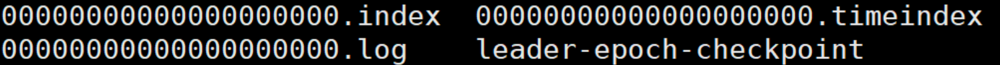
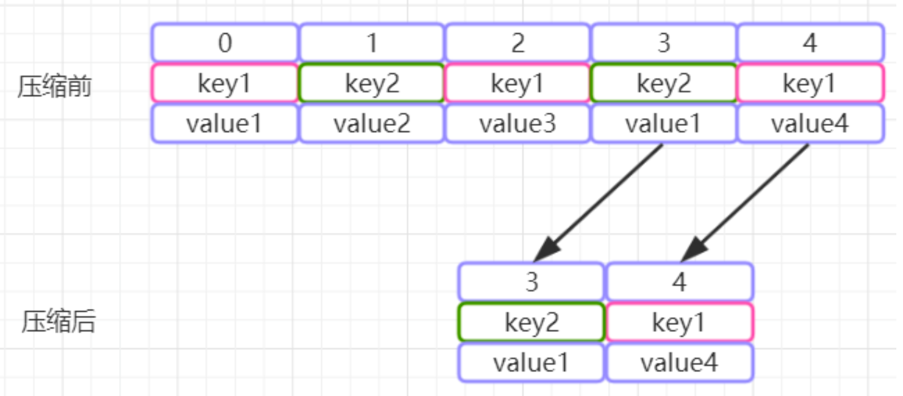

[TOC]

# Kafka解析

## Kafka架构

一个典型的kafka集群包含若干Producer(可以是应用节点产生的消息，也可以是通过Flume收集日志 产生的事件)，若干个Broker(kafka支持水平扩展)、若干个Consumer Group，以及一个 zookeeper集群。kafka通过zookeeper管理集群配置及服务协同。Producer使用push模式将消息发布 到broker，consumer通过监听使用pull模式从broker订阅并消费消息。

多个broker协同工作，producer和consumer部署在各个业务逻辑中。三者通过zookeeper管理协调请 求和转发。这样就组成了一个高性能的分布式消息发布和订阅系统。


1. Broker

   Kafka集群包含一个或多个服务器，这种服务器被称为broker。broker端不维护数据的消费状态，提升 了性能。直接使用磁盘进行存储，线性读写，速度快:避免了数据在JVM内存和系统内存之间的复制， 减少耗性能的创建对象和垃圾回收。

2. Producer
    负责发布消息到Kafka broker

3. Consumer
    消息消费者，向Kafka broker读取消息的客户端，consumer从broker拉取(pull)数据并进行处理。 

4. Topic

   每条发布到Kafka集群的消息都有一个类别，这个类别被称为Topic。(物理上不同Topic的消息分开存 储，逻辑上一个Topic的消息虽然保存于一个或多个broker上但用户只需指定消息的Topic即可生产或消费数据而不必关心数据存于何处)

   

5. Partition

   Parition是物理上的概念，每个Topic包含一个或多个Partition。每个topic可以划分多个分区(每个Topic至少有一个分区)，同一topic下的不同分区包含的消息是不同 的。每个消息在被添加到分区时，都会被分配一个offset(称之为偏移量)，它是消息在此分区中的唯 一编号，kafka通过offset保证消息在分区内的顺序，offset的顺序不跨分区，即kafka只保证在同一个 分区内的消息是有序的。

   **producer会根据key和partition机制来判断当前这条消息应该发送并存储到哪个partition中**。默认情况下，kafka采用的是hash取模的分区算法，如果partition规则设置合理，那么所有的消息会均匀的分布在不同的partition中，这样就有点类似数据库的分库分表的概念，把数据做了分片处理。

   

6. Consumer Group/Group Id

   每个Consumer属于一个特定的Consumer Group/Group Id(可为每个Consumer指定group name)，consumer group是kafka提供的可扩展且具有容错性的消费者机制。既然是一个组，那么组内必然可以 有多个消费者或消费者实例(consumer instance)，它们共享一个公共的ID，即Group Id。组内的所有 消费者协调在一起来消费订阅主题(subscribed topics)的所有分区(partition)。当然，每个分区只能由 同一个消费组内的一个consumer来消费

7. Topic & Partition

   Topic在逻辑上可以被认为是一个queue，每条消费都必须指定它的Topic，可以简单理解为必须指明把 这条消息放进哪个queue里。为了使得Kafka的吞吐率可以线性提高，物理上把Topic分成一个或多个 Partition，每个Partition在物理上对应一个文件夹，该文件夹下存储这个Partition的所有消息和索引文 件。若创建topic1和topic2两个topic，且分别有13个和19个分区，则整个集群上会相应会生成共32个 文件夹(本文所用集群共8个节点，此处topic1和topic2 replication-factor均为1)。

## produer端/生产者端

### 发送到Partition(分区) 的路由逻辑

默认情况下，kafka采用的是hash取模的分区算法。如果Key为null，则会随机分配一个分区。这个随机 是在这个参数”metadata.max.age.ms”的时间范围内随机选择一个。对于这个时间段内，如果key为 null，则只会发送到唯一的分区。所以要设置key，保证相同的key会路由到同一个partition中，例如数据库记录的变更，必须设置key，保证相同key发送到相同的Partition(分区) ，避免生产者端后发先至

### 真正发送消息

**项目开发中通常是同步发送，确保生产者把消息发送到Mq服务端**，如果有异常是生产者端处理

异步发送有两个配置

batch.size：批量提交的字节数大小，默认大小是16384byte,也就是16kb

linger.ms：两次发送时间间隔内收集到的所有Requests进行一次聚合然后再发送

这两个参数是kafka性能优化的关键参数，很多同学会发现batch.size和 linger.ms这两者的作用是一样的，当二者都配置的时候，只要满足其中一个要求，就会发送请求到broker上

## consuemr端/消费者端

### 重要配置

```java
spring.kafka.consumer.group-id=test-consumer-group // group id
spring.kafka.consumer.auto-offset-reset=latest // consuemr接入时的消费offset
spring.kafka.consumer.enable-auto-commit=false // 自动提交
```

- auto.offset.reset=latest情况下，新的消费者将会从其他消费者最后消费的offset处开始消费Topic下的消息
- auto.offset.reset= earliest情况下，新的消费者会从该topic最早的消息开始消费
- auto.offset.reset=none情况下，新的消费者加入以后，由于之前不存在offset，则会直接抛出异常。

### consumer和partition的数量建议

1. 如果consumer比partition多，是浪费，因为kafka的设计是在一个partition上是不允许并发的， 所以consumer数不要大于partition数
2. 如果consumer比partition少，一个consumer会对应于多个partitions，这里主要合理分配 consumer数和partition数，否则会导致partition里面的数据被取的不均匀。最好partiton数目是 consumer数目的整数倍，所以partition数目很重要，比如取24，就很容易设定consumer数目
3. 如果consumer从多个partition读到数据，不保证数据间的顺序性，kafka只保证在一个partition 上数据是有序的，但多个partition，根据你读的顺序会有不同
4. 增减consumer，broker，partition会导致rebalance，所以rebalance后consumer对应的 partition会发生变化

### 分区分配策略

在同一个group中的消费者对于一个topic中的多个partition，存在三种分区分配策略，一种是Range(默认)、 另一种是RoundRobin(轮询)、 StickyAssignor(粘性)。

当出现以下几种情况时，kafka会进行一次分区分配操作，也就是kafka consumer的rebalance

1. 同一个consumer group内新增了消费者
2. 消费者离开当前所属的consumer group，比如主动停机或者宕机
3.  topic新增了分区(也就是分区数量发生了变化)

kafka consuemr的rebalance机制规定了一个consumer group下的所有consumer如何达成一致来分 配订阅topic的每个分区。而kafka 对于分配策略这块，提供了可插拔的实现方式， 也就是说我们还可以创建自己的分配机制。

### 怎样确定分区分配策略

Kafka提供了一个角色: **Group Coordinator**来执行对于consumer group的管理，当consumer group的第一个consumer启动的时 候，它会去和kafka server确定谁是它们组的Group Coordinator。之后该group内的所有成员都会和该Group Coordinator进行协调通信；

1. 消费者向kafka集群中的任意一个broker发送一个 GroupCoordinatorRequest请求，服务端会返回一个负载最小的broker节点的id，并将该broker设置为group coordinator，对于每个consumer group子集，都会在服务端对应一个Group Coordinator进行管理， Group Coordinator会在zookeeper上添加watcher，当消费者加入或者退出consumer group时，会修 改zookeeper上保存的数据，从而触发Group Coordinator开始Rebalance操作
2. 一旦所有成员都发送了joinGroup请求，那么coordinator会选择一个consumer担任leader角色
3. Group Coordinator会收集全部消费者信息之 后，来确认可用的消费者，并从中选取一个消费者成为group_leader。并把相应的信息(分区分配策略、leader_id、...)封装成response返回给所有消费者，但是只有group leader会收到当前 consumer group中的所有消费者信息。当消费者确定自己是group leader以后，会根据消费者的信息以及选定分区分配策略进行分区分配
4. GroupCoordinator会 根据Group Leader的分区分配结果形成SyncGroupResponse返回给所有的Consumer。consumer根据分配结果，执行相应的操作，这样所有成员都知道自己应该消费哪个分区。

### 小结

1. 得到该消费者组的Group Coordinator
2. 一旦所有成员都发送了joinGroup请求或者触发分区分配策略，那么coordinator会选择一个consumer担任leader角色
3. Group Coordinator把组成员信息和订阅信息发送消费者给到所有消费者，leader选出分区分配策略进行分区分配发送给Group Coordinator
4. 当leader把方案发给Group Coordinator以后，Group Coordinator会把结果设置到 SyncGroupResponse中返回给所有的Consumer。这样所有成员都知道自己应该消费哪个分区。

## 如何保存consumer端的offset

同一topic下的不同分区包含的消息是不同的。每个消息在被添加到分区时，都会被分配一个 offset(称之为偏移量)，它是消息在此分区中的唯一编号，kafka通过offset保证消息在分区内的顺 序，offset的顺序不跨分区，即kafka只保证在同一个分区内的消息是有序的; 对于应用层的消费来 说，每次消费一个消息并且提交以后，会保存当前消费到的最近的一个offset。那么offset保存在哪里?

在kafka中，提供了一个**consumer_offsets_\*** **的一个topic**，把offset信息写入到这个topic中。consumer_offsets——按保存了每个consumer group某一时刻提交的offset信息。 __consumer_offsets 默认有50个分区

```text
bin/kafka-consumer-groups.sh --bootstrap-server localhost:9092 --describe --group my-group
```

得到该消费者组的信息含offset


## 分区的副本机制

每个分区可以有多个副本，并且在副本集合中会存在一个leader的副本，所有的读写请求都是由leader 副本来进行处理。剩余的其他副本都做为follower副本，follower副本会从leader副本同步消息日志。

一个分区的多个副本会被均匀的分配到集群中的不同broker上，当leader副本所在的 broker出现故障后，可以重新选举新的leader副本继续对外提供服务。通过这样的副本机制来提高 kafka集群的可用性，利用ISR集合来保证消息不丢失

### ISR集合

ISR：同步副本集合。表示目前“可用且消息量与leader相差不多的副本集合，这是整个副本集合的一个子集”。具体来说，ISR集合中的副本必须满足两个条件

1. 副本所在节点必须维持着与zookeeper的连接
2. 副本最后一条消息的offset与leader副本的最后一条消息的offset之间的差值不能超过指定的阈值 (replica.lag.time.max.ms) replica.lag.time.max.ms:如果该follower在此时间间隔内一直没有追 上过leader的所有消息，则该follower就会被剔除isr列表

ISR数据保存在Zookeeper的 /brokers/topics/<topic>/partitions/<partitionId>/state 节点中

follower副本把leader副本LEO之前的日志全部同步完成时，则认为follower副本已经追赶上了leader 副本，这个时候会更新这个副本的lastCaughtUpTimeMs标识，kafk副本管理器会启动一个副本过期检查的定时任务，这个任务会定期检查当前时间与副本的lastCaughtUpTimeMs的差值是否大于参数replica.lag.time.max.ms 的值，如果大于，则会把这个副本踢出ISR集合。


### Controller

Broker在启动时，会尝试去 ZooKeeper 中创建`/controller`节点。Kafka当前选举控制器的规则是：第一个成功创建 /controller 节点的 Broker 会被指定为Controller Broker。

Controller Broker的主要职责有很多，主要包括以下几个方面：

- 创建、删除主题，增加分区并分配leader分区
- 集群Broker管理（新增 Broker、Broker 主动关闭、Broker故障)
- Leader选举
- 分区重分配

### 怎样选主

1. KafkaController会监听ZooKeeper的/brokers/ids节点路径，一旦发现有broker挂了，执行下面的逻辑。KafkaController挂了，各个 broker会重新leader选举出新的KafkaController

2. leader副本在该broker上的分区就要重新进行leader选举，目前的选举策略是
    a) 优先从isr列表中选出第一个作为leader副本，这个叫优先副本，理想情况下有限副本就是该分区的leader副本
    b) 如果isr列表为空，则查看该topic的unclean.leader.election.enable配置。

unclean.leader.election.enable:为true则代表允许选用非isr列表的副本作为leader，那么此 时就意味着数据可能丢失，为false的话，则表示不允许，直接抛出NoReplicaOnlineException异常，造成leader副本选举失 败。

### 副本数据怎样同步

写请求首先由Leader副本处理，之后follower副本会从leader上拉取写入的消息，这个过程会有一定的 延迟，导致follower副本中保存的消息略少于leader副本，但是只要没有超出阈值都可以容忍。但是如 果一个follower副本出现异常，比如宕机、网络断开等原因长时间没有同步到消息，那这个时候， leader就会把它踢出去。kafka通过ISR集合来维护一个分区副本信息

我们假设两个副本：Leade副本A和Follower副本B，且都ISR副本集合中，初始状态如下：


Leader节点会缓存一份其它副本的LEO值（remote LEO），Leader副本会依赖remote LEO值来更新HW（ISR副本集合中的所有副本都成功写入，Leader HW才会更新）。Leader副本更新HW值=max (currentHW, min(LEO-1, LEO-2, ……，LEO-n) )，Follower副本更新HW值=min(currentHW, currentLEO)。

当Producer给分区发送一条消息后，Leader会写入到本地Log中，并更新自己的LEO；Follower会带上自己的LEO值，发起fetch request来pull数据；Leader收到请求后，会更新remote LEO和HW值，并带上自己的HW值和消息log，传输给Follower副本；Follower副本接收到消息，写入本地Log中，并更新自己的LEO值，状态变更如下：


各自都发送请求后，Leader和Follower副本的LEO都是1，但各自的HW依然是 0，还没有被更新。在第二次Follower发起fetch request请求后，Leader更新remote LEO=1，然后更新Leader HW为1。更新完后，Leader会将当前已更新过的HW=1的值发送给 Follower 副本，Follower副本根据min(leader hw, leo)计算来更新自己的HW值，最终状态如下：


了解完这些后，我们能发现，其实Follower副本的HW更新需要第二次request请求才能得到更新，也就是说Leader副本HW更新和 Follower副本HW更新在时间上是存在错位的，这种错位在某些场景下就会导致“数据丢失” 或 “数据不一致”的问题。

我们假设一个特定的场景（KAFKA/KIP-101），Follower副本写入Log后，Leader副本节点宕机或不可用状态，经过选举后Follower副本成为Leader副本。


**情况一：数据丢失**

副本B成为Leader后，发现自己的HW=0，也就是说副本B的offset=1的数据是未提交确认的，副本B会做一个日志截断(log truncation)，把offset=1的消息日志删除掉，并调整LEO=1；等副本A恢复过来，发送请求同步Leader副本B的数据，发现Leader副本的HW=0，同样也会进行一个日志截断，和Leader副本数据保持一致。


这种情况会导致，原本已经写入副本A的数据会丢失，因为Producer端认为该消息日志已经提交，已经开始进行下一条消息的写入流程了，实际Kafka并没有存储到这条消息，导致Consumer根本消费不到。

**情况二：数据不一致**

副本B成为Leader后，也会进行日志截断，此时HW=0，LEO=1，副本A还没有恢复；当接收到了Producer发来的新消息（绿色框），副本B会更新LEO=2，HW=1，这时副本A恢复了，发送请求同步Leader副本B的数据，发现不需要进行日志截断和写入。


这种情况会导致，Leader副本A的日志和Follower副本B的数据不一致；在下次选举切换Leader副本后，新的Consumer消费该分区的数据会和之前Consumer消费的数据部分不一致。

导致数据不一致或丢失的根本原因是HW值被用于衡量副本写入日志的成功与否以及在出现宕机恢复时，作为日志截断的位移依据；但之前我们说过，Leader副本和Follower副本的HW值的更新时间是存在时间错位的，Follower需要额外的FETCH请求才能更新HW值。

为了解决精确一致性的问题，Kafka在0.11版本，引入了Leader epoch来取代作为日志截断依据的HW值。

#### Leader Epoch

Leader Epoch是由一对值组成：（epoch, offset）。

- Epoch：epoch表示Leader的版本号，一个单调增加的版本号。当Leader变更过时，epoch就会+1；小版本号的 Leader 被认为是过期 Leader，不能再行使 Leader权力。
- offset：消息起始位移，Leader副本在该Epoch值上写入的首条消息的位移。

比如有两对值 (0, 0)和(1, 100)，表示第一个Leader从位移0开始写入消息；共写了100条[0, 99]；而第二个Leader版本号是1，从位移100处开始写入消息。Broker会把Leader Epoch数据缓存起来，并定期写入分区副本的日志文件leader-epoch-checkpoint中。

当Leader副本写入Log时，Broker会尝试更新，如果这个Leader首次写消息，则会在缓存中增加一条记录；而每次副本重新成为Leader时，会首先查询这部分缓存，获取出对应Leader版本的位移，在进行判断。


我们看看数据丢失的情况：引用Leader Epoch机制后，Follower副本B需要向Leader副本A发送OffsetsForLeadErepochRequest请求并同步数据，Leader副本A返回自身的LEO=2的值，此时副本B发现Leader副本的LEO值并不比自己的LEO值小，且缓存中也没有保存任何起始位移值大于Leader副本的LEO值，故不做任何日志截断的操作。

现在Leader副本A宕机，副本B成为Leader。同样地，当副本A重启回来后，执行与副本B相同的逻辑判断，发现也不用执行日志截断，至此位移值为1的那条消息在两个副本中均得到保留。后面当Producer程序向Leader副本B写入新消息时，Leader副本B所在的 Broker缓存中，会生成新的 Leader Epoch 条目：[Epoch=1, Offset=2]。之后，副本B会使用这条记录帮助判断后续是否执行日志截断操作。这样，通过 Leader Epoch 机制，Kafka可以规避了这种数据丢失的场景。


我们再看看数据不一致的情况：副本B成为Leader副本后发现leader epoch缓存的位移值并没有大于自身的LEO值2，故不会做截断操作，保留了自身的offset=1的消息，并更新自身的HW=1。等副本A恢复后，发送请求同步Leader副本B的数据，执行相同的判断逻辑，也不需要进行日志截断，这样看来，两个副本的消息就保持了一致。

通过Leader Epoch机制，对高水位机制有了一个明显改进，即副本是否执行日志截断不再依赖于高水位进行判断，从而解决数据丢失和一致性问题。

### producer端的acks配置和最小ISR数量来尽量保证消息不丢失（0.11版本后可以保证）

acks表示producer发送到broker上的确认值。有三个可选项

0:表示producer不需要等待broker的消息确认。这个选项时延最小但同时风险最大(因为当server宕机时，数据将会丢失)。 

1:表示producer只需要获得kafka集群中的leader节点确认即可，这个选择时延较小同时确保了leader节点确认接收成功。

 all(-1):需要ISR中所有的Replica给予接收确认，速度最慢，安全性最高，但是由于ISR可能会缩小到仅包含一个Replica，所以设置参数为all并不能一定避免数据丢失。

通常设置为all且设置**min.insync.replicas**，默认配置为1，可以通过修改配置文件config/server.properties修改默认属性。配置修改需要重启服务才能生效

```java
min.insync.replicas=2//设定ISR中的最小副本数是多少，默认值为1(在config/server.properties中)， 并且生产者端的acks参数设置为-1(表示需要所有副本确认)时，此参数才生效
```

min.insync.replicas=1 默认情况： topic必须有一个分区作为ISR，因此可以容忍2个broker关闭（AR为3的情况下）

min.insync.replicas=2 : 主题必须至少有2个ISR启动，因此我们最多可以容忍一个代理关闭（AR为3的情况下），并且我们保证每次写入时，数据至少会被写入两次

min.insync.replicas=3: 这种场景要求最严格，不允许任何broker宕机（AR为3的情况下）

## 消息的顺序性

### 不严格顺序性

1. 保证producer发送到Partition(分区) 的时候是顺序的：确定好key，保证相同的key会发送到相同的Partition(分区) 中
2. 保证Partition(分区) 内部是顺序的：每次添加消息到 Partition(分区) 的时候都会采用尾加法，所以Partition(分区) 内有序
3. 保证consumer端消费的时候是顺序的：由于Partition(分区) 与consumer是多对一或者一对一的关系，所以consumer消费Partition(分区) 的数据时一定是顺序的

考虑异常场景：

1. producer宕机，由于相同的key，以及相同的hash算法，一定会发送到相同的Partition中，所以没问题。
2. broker宕机导致Partition减少，producer会把相同的key的后续消息发送到不同的Partition中，所以该kay在Partition中不能保证顺序性。
3. consumer宕机，消费者组的leader重新分配消费策略之后，继续消费，所以消费的Partition变化，但是由于Partition有分区锁，来保证消息的消费成功，所以该consumer消费的新的Partition中的消息都是消费失败的或者没有消费的，配合consuemr端的消息幂等，所以也是没有问题的

#### 小结

虽然这种情况发送broker宕机的情况，不会保证消息顺序性，但是集群上下线是不影响消息的顺序性的，只有在broker宕机的情况下才会

### 严格顺序性

申请1 个 Topic 只对应一个 Partition。这种情况下Partition宕机，会选主，然后继续消费，不会导致乱序的问题，但是性能受到限制

## 消息的存储

### 存储结构

为了避免日志文件过 大，Log并不是直接对应在一个磁盘上的日志文件，而是对应磁盘上的一个目录，这个目录的命名规则 是<topic_name>_<partition_id>

kafka是通过分段的方式将Log分为多个LogSegment，LogSegment是一个逻辑上的概念，一个 LogSegment对应磁盘上的一个日志文件和两个索引文件（索引文件和时间索引文件），其中日志文件是用来记录消息的。索引文件是用来保存消息的索引。



index中存储了索引以及物理偏移量。 log存储了消息的内容。索引文件的元数据执行对应数 据文件中message的物理偏移地址。举个简单的案例来说，以[4053,80899]为例，在log文件中，对应 的是第4053条记录，物理偏移量(position)为80899. position是ByteBuffer的指针位置


#### 通过offset找到消息

比如说，我们要查找offset=2490这条消息，那么先找到00000000000000000000.index, 然后找到 [2487,49111]这个索引，再到log文件中，根据49111这个position开始查找，比较每条消息的offset是 否大于等于2490。最后查找到对应的消息以后返回

查找的算法是

1. 根据offset的值，查找segment段中的index索引文件。由于索引文件命名是以上一个文件的最后 一个offset进行命名的，所以，使用二分查找算法能够根据offset快速定位到指定的索引文件。
2. 找到索引文件后，根据offset进行定位，找到索引文件中的符合范围的索引。(kafka采用稀疏索引的方式来提高查找性能)
3. 得到position以后，再到对应的log文件中，从position出开始查找offset对应的消息，将每条消息的offset与目标offset进行比较，直到找到消息

### 日志清理

日志的清理策略有两个

1. log.retention.hours：根据消息的保留时间，当消息在kafka中保存的时间超过了指定的时间，就会触发清理过程。默认7天
2. log.retention.bytes：根据topic存储的数据大小，当topic所占的日志文件大小大于一定的阀值，则可以开始删除最旧数据

当其中任意一个达到要求，都会执行删除。 默认的保留时间是:7天

### 日志压缩

Kafka还提供了“日志压缩(Log Compaction)”功能，通过这个功能可以有效的减少日志文件的大小， 缓解磁盘紧张的情况，在很多实际场景中，消息的key和value的值之间的对应关系是不断变化的，就像 数据库中的数据会不断被修改一样，消费者只关心key对应的最新的value。因此，我们可以开启kafka 的日志压缩功能，服务端会在后台启动启动Cleaner线程池，定期将相同的key进行合并，只保留最新的 value值。



### 磁盘性能优化

1. 当consumer消费数据的时候，通过**“零拷贝”**技术，可以去掉这些没必要的数据复制操作，同时也会减少上下文切换次数。现代的unix 操作系统提供一个优化的代码路径，用于将数据从页缓存传输到socket;在Linux中，是通过sendfile系 统调用来完成的。Java提供了访问这个系统调用的方法:FileChannel.transferTo API。使用sendfile，只需要一次拷贝就行，允许操作系统将数据直接从页缓存发送到网络上。


2. 大量使用操作系统的Page Cache，producer发送数据到mq服务端的时候，可以**不直接刷盘**，即不采用同步刷盘的方式来保证消息的可靠性，但是实际使用上，消息可靠性可以由多副本来解决，同步刷盘会带来性能的影响。 刷盘的操作由操作系统去完成即可

## CAP满足哪些

```java
replication.factor = 3
min.insync.replicas = 3
acks = all
```

上面配置组合，使得Kafka尽可能满足CP特性（0.11后可以满足）。任意写入一条数据，需要复制保存三个副本，且每个副本都要求在ISR副本集合中，并且Producer产生的消息必须等所有副本都成功写入才算完成commit；即使在有副本的节点宕机的情况下，在任意节点都可以消费到这条数据，包括Leader节点宕机的情况；但是这样会损耗了部分吞吐性能，因为要等待ISR集合中所有副本都成功写入。

```java
replication.factor = 3
min.insync.replicas = 3
acks = 1
```

而这组配置，主要是保证可用性，使得Kafka满足AP特性。对于任意写入一条数据，当Leader节点副本commit了之后就返回ack；如果Leader节点在数据被发送到从节点之前就宕机，这时，重新选举之后，Consumer就消费不到这条数据。这种配置，保证了消息可用性，但是损失了一致性。

```java
replication.factor = 3
min.insync.replicas = 2
acks = all
```

基于最后的这种配置组合，虽然会损失了一定的consistency和availability，使得Kafka满足的是一种介于AP和CP之间的一种平衡状态。因为，在这种配置下，可以在容忍一个节点（包括Leader节点）宕机的情况下，尽可能保证数据一致性和整体可用性；但是有两个节点宕机的情况，该分区整体也会不可用。所以这种情况可以满足CP（0.11后可以满足）

## 怎样保证消息不丢失

一般来说，3个副本就能满足对大部分场景的可靠性要求

1. 设置acks = all，消息不仅仅写入到leader副本，并且被ISR集合中所有副本同步完成之后才告诉生产者已 经提交成功，这个时候即使leader副本挂了也不会造成数据丢失。
2. 设置min.insync.replicas = 2，设置同步副本数大于等于2，Producer产生的消息必须等2个及以上副本成功写入才算完成commit
3. 设置unclean.leader.election.enable配置false，代表不允许选用非isr列表的副本作为leader，而且如果ISR中的所有 Replica都无法“活”过来了，或者数据都丢失了，直接抛出NoReplicaOnlineException异常，造成leader副本选举失败，这个Partition将永远不可用；之后利用报警通知，实际ISR全部宕机的可能性非常小。
4. enable.auto.commit设置为false，保障消息到了broker之后，消费者也需要有一定的保证，因为消费者也可能出现某些问题导致消息没有消费到，宁愿重复消费也不应该因为消费异常而导致消息丢失

### 小结

1. 0.11版本之前由于kafka不能完全保证一致性，所以不能完全解决消息不丢失的问题；0.11版本之后可以保证消息不丢失

## 参考

https://gitee.com/Ljh_1/JavaGuide/blob/main/docs/high-performance/message-queue/kafka-questions-01.md

https://www.zhihu.com/question/48611929/answer/2914552258?utm_id=0

https://blog.csdn.net/u013433591/article/details/128486967

https://pross.space/blog/2021/talk-about-the-practice-of-cap-theorem-in-kafka/


