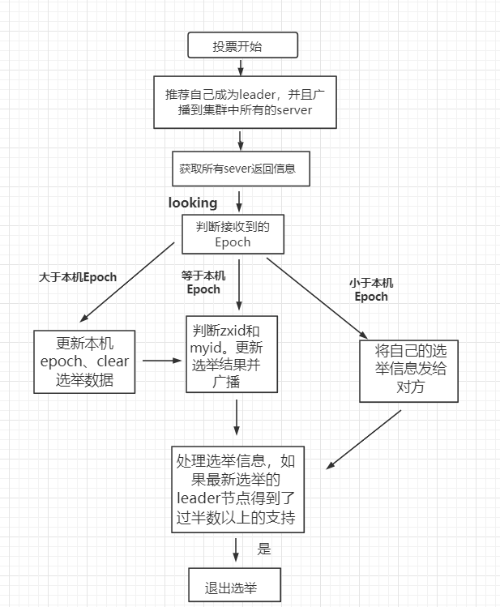

[TOC]


# Zookeeper解析


## ZAB协议

Zookeeper 是通过 Zab 算法来保证[分布式事务](https://www.zhihu.com/search?q=分布式事务&search_source=Entity&hybrid_search_source=Entity&hybrid_search_extra={"sourceType"%3A"answer"%2C"sourceId"%3A3006108128})的最终一致性。

1.  Zab协议是为分布式协调服务Zookeeper专门设计的一种 **支持崩溃恢复** 的 **原子广播协议** ，是Zookeeper保证数据一致性的核心算法。Zab借鉴了Paxos算法，但又不像Paxos那样，是一种通用的分布式一致性算法。**它是特别为Zookeeper设计的支持崩溃恢复的原子广播协议**。
2.  在Zookeeper中主要依赖Zab协议来实现数据一致性，基于该协议，zk实现了一种主备模型（即Leader和Follower模型）的系统架构来保证集群中各个副本之间数据的一致性。 这里的主备系统架构模型，就是指只有一台客户端（Leader）负责处理外部的写事务请求，然后Leader客户端将数据同步到其他Follower节点。

ZAB算法分为两大块内容，**消息广播**和**崩溃恢复**。

-  消息广播（boardcast）：Zab 协议中，所有的写请求都由 leader 来处理。正常工作状态下，leader 接收请求并通过广播协议来处理。
-  崩溃恢复（recovery）：当服务初次启动，或者 leader 节点挂了，系统就会进入恢复模式，直到选出了有合法数量 follower 的新 leader，然后新 leader 负责将整个系统同步到最新状态。

## 日志

原子广播阶段，zk对于一个事务，先写事务日志（默认同步刷盘），然后写内存，最终响应客户端。

崩溃恢复阶段，zk先获取最新的snapshot快照，快照包含某一时刻所有节点的数据，这一时刻（zxid）之后的数据，都需要通过事务日志回放事务来恢复。

利用集群来保证数据不丢失，不依赖于写磁盘

## 选主

在选举的过程中，每个节点的当前状态会在以下几种状态之中进行转变。

```text
LOOKING: 竞选状态。
FOLLOWING: 随从状态，同步Leader 状态，参与Leader选举的投票过程。
OBSERVING: 观察状态，同步Leader 状态，不参与Leader选举的投票过程。
LEADING: 领导者状态。
```

### 服务器启动时的 leader 选举

每个节点启动的时候都 LOOKING 观望状态，接下来就开始进行选举主流程。这里选取三台机器组成的集群为例。第一台服务器 server1启动时，无法进行 leader 选举，当第二台服务器 server2 启动时，两台机器可以相互通信，进入 leader 选举过程。

1. 每台 server 发出一个投票，由于是初始情况，server1 和 server2 都将自己作为 leader 服务器进行投票，每次投票包含所推举的服务器myid、zxid、epoch，使用（myid，zxid）表示，此时 server1 投票为（1,0），server2 投票为（2,0），然后将各自投票发送给集群中其他机器。
2. 接收来自各个服务器的投票。集群中的每个服务器收到投票后，首先判断该投票的有效性，如检查是否是本轮投票（epoch）、是否来自 LOOKING 状态的服务器。
3. 分别处理投票。针对每一次投票，服务器都需要将其他服务器的投票和自己的投票进行对比，对比规则如下：

- a. 优先比较 epoch
- b. 检查 zxid，zxid 比较大的服务器优先作为 leader
- c. 如果 zxid 相同，那么就比较 myid，myid 较大的服务器作为 leader 服务器

4. 统计投票。每次投票后，服务器统计投票信息，判断是都有过半机器接收到相同的投票信息。server1、server2 都统计出集群中有两台机器接受了（2,0）的投票信息，此时已经选出了 server2 为 leader 节点。
5. 改变服务器状态。一旦确定了 leader，每个服务器响应更新自己的状态，如果是 follower，那么就变更为 FOLLOWING，如果是 Leader，变更为 LEADING。此时 server3继续启动，直接加入变更自己为 FOLLOWING。



### 运行过程中的 leader 选举

当集群中 leader 服务器出现宕机或者不可用情况时，整个集群无法对外提供服务，进入新一轮的 leader 选举。

- （1）变更状态。leader 挂后，其他非 Oberver服务器将自身服务器状态变更为 LOOKING。
- （2）每个 server 发出一个投票。在运行期间，每个服务器上 zxid 可能不同。
- （3）处理投票。规则同启动过程。
- （4）统计投票。与启动过程相同。
- （5）改变服务器状态。与启动过程相同。


### 小结

1. 服务器状态为Looking
2. 投票：epoch->zxid->myid的顺序来确认投票
3. 计票得到主
4. 更新服务器状态


## 处理请求

1. Leader 接收到消息请求后，将消息赋予一个全局唯一的 64 位自增 id，叫做：zxid，通过 zxid 的大小比较即可实现因果有序这一特性。
2. Leader 通过先进先出队列（通过 TCP 协议来实现，以此实现了全局有序这一特性）将带有 zxid 的消息作为一个提案（proposal）分发给所有 follower。
3. 当 follower 接收到 proposal，先将 proposal 写到硬盘，写硬盘成功后再向 leader 回一个 ACK。
4. 当 leader 接收到合法数量的 ACKs 后，leader 就向所有 follower 发送 COMMIT 命令，同时响应客户端成功。
5. 当 follower 收到消息的 COMMIT 命令时，就会执行该消息。

相比于完整的二阶段提交，Zab 协议最大的区别就是不能终止事务，follower 要么回 ACK 给 leader，要么抛弃 leader，在某一时刻，leader 的状态与 follower 的状态很可能不一致，因此它不能处理 leader 挂掉的情况，所以 Zab 协议引入了恢复模式（选主的时候）来处理这一问题。

从另一角度看，正因为 Zab 的广播过程不需要终止事务，也就是说不需要所有 follower 都返回 ACK 才能进行 COMMIT，而是只需要合法数量（2n+1 台服务器中的 n+1 台） 的follower，利用崩溃恢复来解决**已经被处理的消息不能丢**以及**被丢弃的消息不能再次出现**也提升了整体的性能。

### 顺序性的保证

先到达 leader 的请求，先被应用到状态机。

ZooKeeper 在提交议案的时候也是按顺序写入各个 follower 对应在 leader 中的队列，然后 follower 必然是按照顺序来接收到议案的，对于议案的过半提交也都是一个个来进行的

### server与client 端是否存在不一致

- 客户端收到 OK 回复，会不会丢失数据？
- 客户端没有收到 OK 回复，会不会多存储数据？

客户端如果收到 OK 回复，说明已经过半复制了，则在 leader 选举中肯定会包含该请求对应的事务日志，则不会丢失该数据

客户端连接的 leader 或者 follower 挂了，客户端没有收到 OK 回复，目前是可能丢失也可能没丢失，因为服务器端的处理也很简单粗暴，对于未来 leader 上的事务日志都会当做提交来处理的，即都会被应用到内存树中

### 小结

1. 使用过半提交
2. 利用队列来保证顺序性
3. 利用选主的崩溃恢复来解决**已经被处理的消息不能丢**以及**被丢弃的消息不能再次出现**


## 断网的影响

目前 ZooKeeper 是过半即可，所以对于分区是容忍的。如 5 台机器，分区发生后分成 2 部分，一部分 3 台，另一部分 2 台，这 2 部分之间无法相互通信

其中，含有 3 台的那部分，仍然可以凑成一个过半，仍然可以对外提供服务，但是它不允许有 server 再挂了，一旦再挂一台则就全部不可用了。

含有 2 台的那部分，则无法提供服务，即只要连接的是这 2 台机器，都无法执行相关请求。

所以 ZooKeeper 和 Raft 在一旦分区发生的情况下是是牺牲了高可用来保证一致性，即 CAP 理论中的 CP。但是在没有分区发生的情况下既能保证高可用又能保证一致性，所以更想说的是所谓的 CAP 二者取其一，并不是说该系统一直保持 CA 或者 CP 或者 AP，而是一个会变化的过程。在没有分区出现的情况下，既可以保证 C 又可以保证 A，在分区出现的情况下，那就需要从 C 和 A 中选择一样。ZooKeeper 和 Raft 则都是选择了 C。

### 小结

1. N+1的集群的集群选出来主以后可以继续运行
2. N的集群处于Looking的状态，不执行相关请求

## 数据模型

### znode 4 种类型

我们通常是将 znode 分为 4 大类：

- **持久（PERSISTENT）节点** ：一旦创建就一直存在即使 ZooKeeper 集群宕机，直到将其删除。
- **临时（EPHEMERAL）节点** ：临时节点的生命周期是与 **客户端会话（session）** 绑定的，**会话消失则节点消失** 。并且，**临时节点只能做叶子节点** ，不能创建子节点。
- **持久顺序（PERSISTENT_SEQUENTIAL）节点** ：除了具有持久（PERSISTENT）节点的特性之外， 子节点的名称还具有顺序性。比如 `/node1/app0000000001` 、`/node1/app0000000002` 。
- **临时顺序（EPHEMERAL_SEQUENTIAL）节点** ：除了具备临时（EPHEMERAL）节点的特性之外，子节点的名称还具有顺序性。

### znode 数据结构

每个 znode 由 2 部分组成:

- **stat** ：状态信息
- **data** ： 节点存放的数据的具体内容


## 应用

### 选主

总的来说，我们可以完全 **利用 临时节点、节点状态 和 `watcher` 来实现选主的功能**，临时节点主要用来选举，节点状态和`watcher` 可以用来判断 `master` 的活性和进行重新选举

### 分布式锁

使用Apache Curator可以解决惊群效应

### 注册中心

dubbo利用zk来做注册中心


## 参考

https://www.zhihu.com/question/28242561/answer/3006108128

https://javaguide.cn/distributed-system/distributed-process-coordination/zookeeper/zookeeper-intro/#_3-2-znode-%E6%95%B0%E6%8D%AE%E8%8A%82%E7%82%B9


